---

## Page 1

214234

# 海洋浮游生物学

# 郑重 李少菁 许振祖 编著

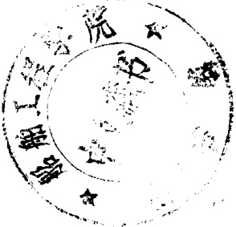

海洋出版社

1984年·北京

---

## Page 2

## 内容简介

本书共分十二章，将各类海洋浮游生物，特别是比较重要的门类如浮游植物的硅藻类和浮游动物的水母类与甲壳类的形态、分类，作了详细的叙述，并兼述各类的个体生物学、生态习性及经济意义。对我国近海常见的或经济价值较大的种类，还作了分类特征描述和列出种、属检索表，并附有大量插图，以利于读者的鉴定。书末附有大量文献和索引，以供参考。

本书的主要读者是海洋和水产学院及综合大学海洋生物专业的师生，同时也可作为海洋和渔场调查人员及其它高等院校生物系师生的参考书。

# 海洋浮游生物学

# 郑重李少菁许振祖编著

海洋出版社出版

(北京市复兴门外大街)

北京通县科技印刷厂印刷

新华书店北京发行所发行 各地新华书店经售

1984年6月第1版

1984年6月第1次印刷

开本：850×1168 1/32 字数：600,000

印张：20 5/8

印数1—2,000

统一书号：13193·0289

定价：6.00 元

---

## Page 3

## 序言

《浮游生物学概论》于1965年出版迄今已有18年了。原拟在10年内修改后再版一次，但由于“十年动乱”，这个愿望未能实现。最近几年来，我国各门学科(特别是一些新兴学科)像雨后春笋那样蓬勃地发展起来，海洋浮游生物学也不例外。近年来，随着近海调查(包括海岸带、渔场和港湾等调查)的普遍开展，外海和深海调查及海洋生态系统研究也有了良好开端。通过这些调查研究，填补了一些空白门类(如浮游多毛类、介形类、端足类等)，增添了不少过去没有发现过的种类(主要是一些外海和深海种类)，并充实了自然生态(如平面、垂直和季节等分布)的内容。在个体生物学(包括生长、生殖、发育、食性等)方面，也做了不少研究。但是，在过去10多年中，国外在海洋浮游生物分类、生态(特别是实验生态和生态系统)研究方面更是方兴未艾，硕果累累。随着新技术、新方法的广泛应用，生理、生化研究不再是一个薄弱环节，而有了显著进展，从而改变了浮游生物学的落后面貌——从定性(描述性)转向定量(实验性)研究。以上这些国内、外研究成果和所得资料大大丰富和充实了海洋浮游生物学的内容。因此，作者认为，重写一本内容更充实、更全面、更能反映现代科学成就的浮游生物学参考书的时机已经到来。为了更好地结合海洋生物资源调查的需要，为了更好地结合作者多年来在海洋浮游生物方面的教学和科研成果，定名为《海洋浮游生物学》，专述海洋浮游生物的分类、形态，兼述个体生物学、生态习性及经济意义。

由于浮游生物在理论上和实践上的重要性(见“绪论”), 这门学科日益受到世界各国的高度重视, 把它列为海洋、水产等高等院校的必修课或选修课; 同时, 由于浮游生物在生态系统, 特别是在食物链、生产力、能量流动和物质循环中的重要性, 它是海洋生态

---

## Page 4

学的重要组成部分，也是海洋综合调查的一个不可缺少的项目。因此，本书的出版，既是教学和科研的需要，又是水产资源调查的需要。

浮游生物是一个复杂、庞大的类群，既包括植物(主要是单细胞藻类)，又包括动物(主要是无脊椎动物)，其中对海洋浮游动物来说，以水母类和甲壳类最为重要，因它们不论在种类上或数量上都占明显优势，并具有重要经济意义；同时，它们也正结合着作者的专长。为此，本书的重点是放在这两类浮游动物上，而这两类，特别是经济意义较大的甲壳类，也是海洋渔场和海洋资源调查的主要对象。当然，在浮游生物类群中常占优势的硅藻类在本书中也占较多的篇幅。此外，由于养殖业的需要，本书对较难鉴定的浮游幼虫类，也作了较详细的介绍。为了更好地鉴定种类，本书比前书增多了我国近海常见种、属的检索表和插图的数目，对一些主要种、属的特征还作了扼要描述。书末列举了比较重要的参考文献(特别是国内有关文献列举较多)，这对读者进一步研究将有所帮助。

浮游生物学在我国原是一门空白学科。它的发展是在解放后才开始的。30多年来，它已从无到有、从小到大地发展起来了；但和欧美诸国比较起来，还有不小差距，主要是在实验生态、生理、生化方面的差距较大，而这些方面正是今后浮游生物学的发展方向。为了我国四个现代化建设的需要，抓紧培养高级人才是非常必要的，而提高教学和科研质量是培养人才的必由之路。作者希望本书的出版将有助于人才的培养。

郑重

1982年6月于厦门大学

---

## Page 5

## 目录

绪论.....(1)  
  
第一篇 海洋浮游植物.....(15)  
  
第一章 硅藻类.....(19)  
  
第二章 甲藻类.....(70)  
  
第三章 其它浮游植物.....(98)  
  
第一节 细菌.....(98)  
  
第二节 蓝藻.....(101)  
  
第三节 绿藻.....(109)  
  
第四节 金藻.....(120)  
  
第五节 黄藻.....(130)  
  
第六节 隐藻和眼藻.....(133)  
  
第二篇 海洋浮游动物.....(139)  
  
第四章 原生动物.....(140)  
  
第五章 腔肠动物.....(166)  
  
第六章 栉水母.....(252)  
  
第七章 浮游甲壳动物.....(266)  
  
第一节 概述.....(266)  
  
第二节 枝角类.....(275)  
  
第三节 桡足类.....(289)  
  
第四节 端足类.....(391)  
  
第五节 糠虾类.....(405)  
  
第六节 磷虾类.....(418)  
  
第七节 樱虾类.....(439)  
  
第八节 其它浮游甲壳类.....(454)

---

## Page 6

第八章 浮游软体动物 …… (468)  
第一节 翼足类 …… (468)  
第二节 异足类 …… (484)  
第三节 其它浮游软体动物 …… (492)  
第四节 生物学与经济意义 …… (494)  
第九章 毛颚动物 …… (501)  
第十章 被囊动物 …… (527)  
第十一章 其它浮游动物 …… (547)  
第一节 轮虫类 …… (547)  
第二节 多毛类 …… (556)  
第三节 其它浮游动物 …… (569)  
第十二章 浮游幼虫 …… (571)  
参考文献 …… (600)  
索引 …… (610)

---

## Page 7

## 绪论

## 第一节 定义

浮游生物（Plankton）一词，源出于希腊字  $ \pi\lambda\nu\kappa\tau o_{5} $ （即 planktos），意思是漂浮者（或流浪者）。指的是在水流运动的作用下，被动地漂浮于水层中的生物群。这些生物，一般个体很小，必须借助于显微镜或解剖镜才能看清它们的构造；当然，浮游生物群中也有一些较大型的动物，如水母类、甲壳类、被囊类等。尽管浮游生物隶属于不同的生物门类，却有一个共同的特点，就是缺乏发达的行动器官（如鱼的鳍），运动能力很弱，只能随水流移动，而不能像鱼类那样自由游泳，这就是它们和同样生活于水层中的游泳动物（nekton）和在海底营底栖生活的底栖生物（benthos）主要不同之处。研究浮游生物的生命现象和活动规律的科学，称为浮游生物学（Planktology）。

## 第二节 海洋浮游生物学的内容及其与其它学科的关系

浮游生物学和其它生物科学一样，包括形态、分类、生理、生化及生态等部分。浮游生物是一个重要生态群落，数量大，分布广，种类组成又十分复杂，既包括浮游植物，又包括浮游动物（见第三节生态类群）。研究这两类浮游生物在时间上和空间上的数量变动和种类组成变化（季节分布、平面分布、垂直分布）是海洋综合调查的一个十分重要的项目。它对阐明海洋物理、化学、地质等现象（特别是水文现象）的变化规律是必不可少的。所以，海洋浮游生物学本身就是海洋生态学的一个重要组成部分，也可以这样说，

---

## Page 8

浮游生物学，实质上，是一门生态学(群落生态学)。

这门学科一方面是研究海洋浮游生物的种类组成和数量变动及其与海洋理化环境的相互关系，包括海流、水团的生物性指标(biological indicator)、海底沉积过程的生物作用、海-气界面的生物学过程，以及海洋环境中的营养动力学等问题，这些就是生物海洋学(Biological Oceanography)的主要内容。另一方面，也涉及浮游生物的分类鉴定、形态构造、化学组成、生命活动(生理机能、质能代谢、渗透调节)等一些海洋生物学（Marine Biology）的主要内容。

海洋浮游生物学和生物科学、海洋科学等学科，以及数、理、化等基础科学都有密切的关系。在形态、分类方面，这门科学和微生物学(包括细菌学)、海藻学、无脊椎动物学的关系非常密切，因为浮游植物主要是由细菌和单细胞藻类组成的，而浮游动物主要是由各类无脊椎动物及底栖动物和游泳动物的幼体组成的。所有这些生物的构造、分类知识是研究浮游生物生态、生理、生化的必要基础。在生态方面，浮游生物学和水产学、海洋学，以及气象学发生了密切关系，因为，浮游生物是海洋经济动物(包括上、中层鱼类和幼鱼)的饵料基础，因此，它的产量和分布可直接影响虾类、贝类和鱼类等水产动物的繁殖和洄游，从而影响渔业产量。同时，浮游生物的产量和分布是与水域的理化环境条件分不开的。此外，有一些浮游生物，例如，硅藻、有孔虫、放射虫、翼足类等的外壳大量沉积在海底，成为大洋性软泥的主要组成者，这样，浮游生物学又和海洋地质学发生了联系。随着科学技术的不断发展，现代化仪器、设备的广泛使用，使浮游生物的生理、生化研究不断取得新成果，从而，也促进了生理学、生物化学与生物物理学的相应发展。近年来，新兴的环境科学的迅速发展和浮游生物学的关系也很密切，因为浮游生物作为海洋生态系统的主要成员之一，在污染物质的分布、迁移、转化过程中担当了重要角色，因此，在海洋环境科学研究中显得特别重要。无疑，近年来数、理、化等基础学科的强烈渗透，也推进了浮游生物学，特别是浮游生物实验科学(包括实验生态、

---

## Page 9

生理、生化)的发展，从而改变了这门学科的落后面貌。由此可见，浮游生物学是一门涉及范围很广的生物科学。它的发展是和其它自然科学的发展分不开的。为此，浮游生物学工作者必须具有坚实的生物学基础和广博的科学知识。

## 第三节 浮游生物的生态类群

浮游生物是一个庞大而复杂的生态类群。按照它们的营养方式、个体大小、浮游生活时间的长短，以及时空分布等，可划分为以下一些类别：

## 一、 按营养方式，浮游生物可分为浮游植物和浮游动物两大类

(1) 浮游植物 (Phytoplankton) 这是一类自养性的浮游生物，具有叶绿素或其它色素体，能吸收光能（太阳辐射能）和  $ CO_{2} $ 进行光合作用，而自己制造有机物（主要是碳水化合物）。这类浮游生物主要包括细菌和单细胞藻类——硅藻、甲藻、绿藻、蓝藻、金藻、黄藻等。它们是水域生态系统中的主要生产者（producer） [属于初级生产力，其中有些细菌又是还原者（decomposer）]。由于需要吸收日光能，一般分布于海洋的上层或称真光层（euphotic layer）。

(2) 浮游动物(Zooplankton) 是一类异养性的浮游生物,也就是不能自己制造有机物,而必须依赖已有的有机物作为营养来源。这类浮游生物主要包括原生动物的有孔虫、放射虫和纤毛虫；水母类的水螅水母，钵水母和栉水母；轮虫类的单卵巢轮虫；甲壳类的枝角类、桡足类、磷虾类、樱虾类及部分介形类(壮肢类)、端足类(蜮类)和糠虾类等；毛颚类；软体动物的翼足类和异足类；被囊动物的有尾类和海樽类；以及各类无脊椎动物和低等脊索动物的浮游幼虫(包括鱼类的仔鱼、稚鱼等)。它们的生活水层不限于真光层，可以分布到较深水层；大多是滤食性的，也有捕食性的，是海洋生态系统中的消耗者(consumer)，主要属于次级生产力。

## 二、 按浮游生物的个体大小，可分为下列六类(表1)

---

## Page 10

表 1 浮游生物的大小类别和种类组成

<table border=1 style='margin: auto; word-wrap: break-word;'><tr><td style='text-align: center; word-wrap: break-word;'>类别</td><td style='text-align: center; word-wrap: break-word;'>体型大小</td><td style='text-align: center; word-wrap: break-word;'>主要种类组成</td></tr><tr><td style='text-align: center; word-wrap: break-word;'>超微型浮游生物(Ultraplankton)</td><td style='text-align: center; word-wrap: break-word;'>&lt;5微米</td><td style='text-align: center; word-wrap: break-word;'>细菌,金藻等</td></tr><tr><td style='text-align: center; word-wrap: break-word;'>微型浮游生物(Nannoplankton)</td><td style='text-align: center; word-wrap: break-word;'>5—50微米</td><td style='text-align: center; word-wrap: break-word;'>微型硅藻、甲藻(腰鞭毛虫)、金藻、绿藻、黄藻</td></tr><tr><td style='text-align: center; word-wrap: break-word;'>小型浮游生物(Microplankton)</td><td style='text-align: center; word-wrap: break-word;'>50微米—1毫米</td><td style='text-align: center; word-wrap: break-word;'>硅藻、蓝藻、原生动物、小型甲壳类，小型浮游幼虫，轮虫</td></tr><tr><td style='text-align: center; word-wrap: break-word;'>中型浮游生物(Mesoplankton)</td><td style='text-align: center; word-wrap: break-word;'>1—5毫米</td><td style='text-align: center; word-wrap: break-word;'>小型水母，桡足类、枝角类，介形类，小型被囊类，翼足类和异足类</td></tr><tr><td style='text-align: center; word-wrap: break-word;'>大型浮游生物(Macroplankton)</td><td style='text-align: center; word-wrap: break-word;'>5—10毫米</td><td style='text-align: center; word-wrap: break-word;'>水母，大型桡足类，磷虾类，鳅类，樱虾类，被囊类，毛颚类，翼足类和异足类</td></tr><tr><td style='text-align: center; word-wrap: break-word;'>巨型浮游生物(Megaplankton)</td><td style='text-align: center; word-wrap: break-word;'>&gt;1厘米，最大可超过1米</td><td style='text-align: center; word-wrap: break-word;'>大型水母(海蜇，鼹水母、僧帽水母)，大型甲壳类，大型被囊类(火体虫)</td></tr></table>

根据大小来划分浮游生物，尚无一致的看法。上表所列为一般情况。但对淡水浮游生物，个体大小的规定较小。各类浮游生物的大小分别为，超微型：小于2微米；微型：2—20微米；小型：20—200微米；大型：200微米—2毫米；巨型：大于2毫米。对于浮游动物，也可划分为以下4级：

小型浮游动物：<200 微米(包括微型和小型浮游动物)。

小的中型浮游动物：平均大小：大于200微米—小于10毫米。这是200微米筛绢的网捕获物。

大的中型浮游动物：用 1 毫米筛绢网采得的动物。

大型浮游动物：范围为 2—10 厘米(作为自游动物采集的)。

初看起来，按大小来划分浮游生物是比较人为的，实际上，它有重要的生物学意义。因为摄食浮游生物的动物有特殊的摄食机制和方法，只适于摄取一定大小范围的食物。因此，在研究食物网时，按大小来划分是有意义的。

三、依照浮游生活阶段在生活史中所占时期的长短，可将浮游生物划分为以下三类

---

## Page 11

(1) 永久性浮游生物 (holoplankton) 整个一生在水中营漂浮生活。大多数浮游生物属于这一类，或称终生浮游生物。

(2) 阶段性浮游生物(meroplankton) 在生活史中仅某一阶段(一般为幼虫期)营浮游生活；经过变态后，改营底栖或自游生活。这类幼虫在浮游生物群落中(特别是在动物繁殖盛期)常占有很重要位置。它们常周期性地在一定季节出现(主要在春、夏、秋三季)，故又称季节性浮游生物。

(3) 暂时性浮游生物（tychoplankton）这类浮游生物原非浮游种类，仅有时短暂地营浮游生活。例如，有些底栖甲壳动物如涟虫类、糠虾类、等足类、介形类等，有时(一般在夜晚)离开底层而上升到上层浮游。又有一些外寄生的桡足类有时可脱离寄主，营短期的浮游生活。上述情况一般在生殖时期较为常见。

## 四、 依照浮游生物不同的水平和垂直分布及生活环境，浮游生物也可划分为以下几个生态类群

（一）依照水平分布，浮游生物可分为沿岸性(近海)和远洋性(外海)浮游生物，以及两者都能分布的泛栖性浮游生物

(1) 沿岸性浮游生物（neritic plankton）生活于沿岸盐度较低水域的浮游生物。这类生物也包括河口浮游生物（estuarine plankton）。它们生活于半咸水（5—10‰）（介于海水、淡水之间）的水域。这类浮游生物的组成较为复杂。由于环境（特别是盐度）的不断变化，种类组成变化也较大。它们分别来源于江河和海洋，但有些生物，由于长期适应了这多变的环境，已改变为真正的河口浮游生物。

(2) 远洋性浮游生物(oceanic plankton) 生活于盐度较高的大洋区的浮游生物。

（二）依照浮游生物的垂直分布，可划分为下列三类

(1) 上层浮游生物(epiplankton) 栖息于海水上层(0—100米)的浮游生物。在上层浮游生物中有一群生活于海水近表层(0—5厘米)，即大气与海水界面的海洋生物。它们组成了一个特殊的海洋生物群落，称为漂浮生物（neuston），主要包括水漂生物

---

## Page 12

表 2 漂浮生物的生态特点和代表

<table border=1 style='margin: auto; word-wrap: break-word;'><tr><td colspan="2">类别</td><td style='text-align: center; word-wrap: break-word;'>生态特点</td><td style='text-align: center; word-wrap: break-word;'>主要代表</td></tr><tr><td colspan="2">水源生物(Pleuston)</td><td style='text-align: center; word-wrap: break-word;'>生活于水-气界面,身体部分在水中,部分在大气中,其分布直接受风力的影响</td><td style='text-align: center; word-wrap: break-word;'>帆水母(Velella) 僧帽水母(Physalia)</td></tr><tr><td rowspan="5">漂浮生物</td><td style='text-align: center; word-wrap: break-word;'>表漂浮生物(Epineuston)</td><td style='text-align: center; word-wrap: break-word;'>生活在水-气界面的海水表层</td><td style='text-align: center; word-wrap: break-word;'>海蝇(Halobates)</td></tr><tr><td style='text-align: center; word-wrap: break-word;'>真次漂浮生物(Euhyponeuston)</td><td style='text-align: center; word-wrap: break-word;'>日、夜均生活于海水表层的动物</td><td style='text-align: center; word-wrap: break-word;'>角鳔水蚤(Pontellidae) 大眼剑水蚤(Corycaeus)</td></tr><tr><td style='text-align: center; word-wrap: break-word;'>浮游性次漂浮生物(Planktohyponeuston)</td><td style='text-align: center; word-wrap: break-word;'>夜间出现于表层的一些进行昼夜垂直移动的深水层种类</td><td style='text-align: center; word-wrap: break-word;'>许多桡足类和磷虾类</td></tr><tr><td style='text-align: center; word-wrap: break-word;'>暂时性次漂浮生物(Merohyponeuston)</td><td style='text-align: center; word-wrap: break-word;'>日、夜在表层出现的幼体,其成体则生活在较深水层</td><td style='text-align: center; word-wrap: break-word;'>许多甲壳类幼体</td></tr><tr><td style='text-align: center; word-wrap: break-word;'>底栖性次漂浮生物(Benthohyponeuston)</td><td style='text-align: center; word-wrap: break-word;'>夜间出现于表层的营底栖生活的浅海种类</td><td style='text-align: center; word-wrap: break-word;'>糠虾类</td></tr></table>

和漂浮生物两类。后者以次漂浮生物（hyponeuston）较为重要，它们的种类较多，生活情况比较复杂(表2)。漂浮生物的特点之一，是身体上含有丰富的类胡萝卜素（carotenoid），呈现不同程度的蓝色。

(2) 中层浮游生物(mesoplankton) 栖息于海水中层(100—400 米)的浮游生物。

(3) 下层浮游生物（hypoplankton）栖息于 400 米以下的深层。在大洋里，这类还包括“深海浮游生物”（bathyplankton）。此外，栖息在 3000—4000 米深海中的浮游动物还称为“极深海浮游生物”（abysso-plankton）。

尽管浮游生物有上述那么多的不同生态类群，种类组成也具高度多样性，然而，它们具有共同的基本特征，主要表现在体色和

---

## Page 13

个体大小上，而体色也是适应环境和保护种族的一种表现。

浮游植物细胞往往由于色素不同而呈现不同颜色。浮游动物大多数个体是透明的，这在含水量很多的水螅水母、管水母、栉水母、纽鳃樽等胶质动物尤为明显；也有少数种类由于某些器官含有少量色素而着色。例如，表层浮游动物(或漂浮生物)的帆水母、角水蚤科等的身体呈深蓝色，而深层浮游动物常呈红褐色。

大多数浮游生物的个体很小，一般浮游植物为10—100微米，一般浮游动物为1—10毫米。当然，也有例外，如某些霞水母(Cyanea)直径长达1米、火体虫(Pyrosoma)群体长达2米。

## 第四节 经济意义

海洋浮游生物是海洋生物界的重要组成部分之一，不但分布很广，种类繁多，并且在数量上超过底栖生物和游泳动物，而更重要的是，它是经济海产动物(包括须鲸类、鱼类、虾类等)的饵料基础，特别是经济鱼类的一切幼鱼和中、上层鱼类(如鲱鱼、鲐鱼、蓝圆鲹、沙丁鱼、鲚鱼等)的主要摄食对象。到了索饵季节，这些鱼类成群地洄游到浮游动物(主要是浮游甲壳动物、毛颚动物等)最丰富的海区，而这些海区正是渔场的所在地。因此，饵料浮游动物可作为探索鱼群索饵洄游路线的标志，也可作为寻找渔场的标志。这对渔业(捕捞业)的重要性不言而喻。另有一些小型浮游生物(如硅藻类、甲藻类、枝角类、桡足类、轮虫类等)是养殖虾类、贝类和鱼类，特别是它们的幼体的重要饵料。这些饵料生物的大量培养对养殖业十分重要。此外，有些浮游动物(如钵水母类的海蜇、甲壳类的毛虾等)可作为人类食品，成为我国海洋渔业的捕捞对象。现已发展成为一种新兴渔业，称为浮游生物渔业(Plankton Fishery)。以上所讲的是，浮游生物对渔业有利的一面。但另有些海洋浮游生物如甲藻类(腰鞭毛虫类)的夜光虫、裸沟虫、旋沟虫等(统称为“赤潮生物”)，如果繁殖过盛，并密集在一起，可使海水变色，称为赤潮(Red tide)，这对渔业，特别是对贝、虾类养殖业危害很大，因这些赤潮生物(如裸沟虫等)一般能分泌一种麻醉神经的毒素叫神

---

## Page 14

经毒素(neurotoxin)，如果这种毒素的浓度很大，便会使鱼类等动物的神经系统（主要是呼吸中枢）受到严重伤害而死亡。此外，有些大型水母如霞水母等如果数量太大，可以破坏渔网，同时它分泌的粘液可使渔网腐烂。这样就会损害捕捞业。另有一些浮游动物如栉水母、毛颚类等喜食幼鱼，破坏渔业资源。这是海洋浮游生物对渔业不利的一面。不过总的来说，浮游生物对渔业还是利多害少。除上述在渔业上的意义外，海洋浮游生物还具有以下几点重要性：(1)很多浮游动物如有孔虫类、管水母类、桡足类、毛颚类等可作为海流的指示种。根据它们的分布，对探索海流的来龙去脉有一定帮助，可以作为测量海流的辅助工具。(2)有孔虫的外壳大量沉积在海底，成为有孔虫泥(Foraminiferan ooze)。这些外壳可作为勘探海底石油资源的一种标志。(3)有些发光浮游生物（特别是夜光虫）密集在一起，并大面积发光，对海军在夜间作战殊多不利，因它的发光可以暴露军舰的航行路线。(4)有些浮游动物如磷虾类、管水母类等大量密集在一起，形成声散射层，可以阻碍或干扰声波在水中的传播。这在声速研究上和国防建设上都有重要意义。(5)硅藻、放射虫、有孔虫和翼足类死后的外壳大量沉积在海底，成为海洋底质的重要组成部分，这些生物性沉积物对研究海洋地质史和古代海洋环境有一定帮助。(6)有些浮游生物具有富集放射性同位素的能力，可以作为海域被放射性同位素污染的指示种；同时也有些浮游生物如硅藻类的骨条藻（Skeletonema）可作为“三废污染”的指示种。以上所列举的重要意义还不够全面，将来随着调查和研究的不断发展，当会进一步发现浮游生物在理论上和实践上的重要性。

## 第五节 海洋浮游生物学简史与展望

浮游生物学是一门比较年青的科学，迄今仅一百多年的历史。1887年，著名浮游生物学家 V. Hensen 创用了“Plankton”这个名词，将所有在水域中随着水流漂浮的生物，统称为浮游生物，并且，首先采用定量方法来研究浮游生物的分布。然而，对浮游生物的研究

---

## Page 15

还可追溯到更早的年代，可以说，浮游生物的研究是在1828年开始的。在那一年，G. V. Thompson在爱尔兰的科克(Cork)海滨用浮游生物网来采集浮游生物；1845年，J. Müller率领学生到德国北岸的赫耳果兰岛(Helgoiand Isle)采集浮游生物，并作了分类研究。但作为浮游生物学一门科学来说，其发展应该始于十九世纪的七十至八十年代。1873—1876年，英国皇家学会组织了“挑战者号”(Challenger)环球调查，为系统的综合性海洋调查作出了开端。这次调查，遍及世界各大洋，航行7万海里左右，采集了大西洋、太平洋大量的生物标本以及海水、沉积物样品。尔后，陆续发表50本《挑战者号调查报告》的巨幅专著，其中有几本是专述浮游生物的，如硅藻、放射虫、桡足类、裂足类(包括磷虾类)等。接着，德国在1889年，派遣“国家”号(National)调查船赴北大西洋专门采集浮游生物。因此，也称为浮游生物远征队(Plankton Expedition)，出版了《浮游生物远征队的结果》(Ergebnisse der Plankton Expedition)。无疑，上述远征队报告奠定了浮游生物学的基础。本世纪以来，随着海洋生物资源的开发利用及海洋调查的继续发展，浮游生物学进一步蓬勃发展起来。就整个海洋浮游生物学的研究历史而言，大致可划分为两个阶段：第一阶段，从十九世纪八十年代(学科初创时期)至本世纪三十年代以前，以形态、分类为研究核心。在这个时期，出版了很多大幅的分类专著，如Sars的《挪威甲壳类》(Crustacea of Norway)，Mayer的世界水母(Medusae of the World)，Schmidt的《硅藻图集》(Atlas der Diatomaceen-Kunde)，以及很多专家合著的《北方浮游生物》(Nordisches Plankton)；同时，各国海洋调查队的报告，如Challenger Report，Siboga-Expeditie，Dana Expedition，Wiss. Ergeb. Deutsch. Tiefsee Exped., Discovery Report等；和各国海洋研究机构，特别是意大利的那波利斯（Naples）海洋生物研究所与摩纳哥（Monaco）的海洋研究所发表很多有关浮游生物方面的分类巨著。上述这些专著，为浮游生物分类学打下了坚实广博的基础。

1930 年以后，是浮游生物学发展的第二阶段，这一阶段，海洋调查活动大大加强了(除了二次大战期间基本处于停滞状态以外)，

---

## Page 16

海洋浮游生物学基本上向着生物海洋学（Biological Oceanography）和海洋生物学（Marine Biology）两个方向发展。这两个方向都是结合着海洋生物资源的开发利用（包括渔捞和养殖）的需要，而且受到其他学科的高度渗透，因而获得较为迅速的发展。在生物海洋学方面，引入了生物量（biomass）的概念，使浮游生物分布的定量研究获得发展。四十年代以来，Hardy等以“哈代连续采集器”（Hardy's continuous plankton recorder）长期进行欧洲北海（North Sea）及其邻近海区的浮游生物调查，取得浮游生物平面分布的长期的基础研究的好成绩。五十至六十年代，海洋调查进入了国际合作调查时期，继国际印度洋调查以后，国际黑潮联合调查是规模较大的国际合作调查的代表。在这些调查中，采取了标准化方法，而且多学科综合研究和专题研究增多，特别是研究方法的不断改进，新技术的广泛应用，诸如遥感技术（如卫星或机载叶绿素测定装置），声学技术，多种自动观测仪器（如采集浮游生物的同时，记录多种环境因子的参数，并由多层声学控制的同步调查）的使用，大大扩大了调查范围和规模，提高了调查质量，从而获得了大量有价值的、全面的调查资料。目前，已能编绘出世界范围的浮游植物初级产量及浮游动物的生物量的分布图，为海洋生产力估计、浮游生物群落及生态分析，提供了必要的条件。群落生态研究也已从简单的组成描述，发展到生态系统，包括食物网各层次的营养动力学研究，并对生态系统进行数学模拟；通过生态系统的物质循环和能流的分析，为预报生态系统的生产力提供科学依据。近年来，为了了解污染物质对海洋生物（主要是浮游生物）的长期影响，在美洲还开展了一个“受控生态系统污染实验”（Controlled Ecosystem Pollution Experiment，简称“CEPEX”）作为国际海洋十年（七十年代）规划的一个项目。这是较大规模的现场实验，以揭示生态系统的动态过程，以及生理机制的一种实验生态研究，也即在一悬浮于海中的大型塑料袋内，投入不同的污染物质，观察它对浮游植物和浮游动物群落结构的影响，在这方面已取得一些初步成果。浮游生物指示种，特别是海流指示种的研究，是生物海洋学的另一项内容。这

---

## Page 17

项研究正在世界各海区广泛进行，主要是利用浮游生物的生态特性和分布，来协助判断水文工作者用温、盐度等要素不能完全识别的海流和水团。过去，以毛颚类、水母类(尤其是管水母)作为指示种的研究较多，取得了很大成绩。当前，利用其他浮游生物(如小型的有孔虫，放射虫，桡足类，磷虾类，浮游腹足类，被囊类等)日益增多，并且，越来越多以群体及群落(代替个别种类)来作为标志，从而提高其准确性。此外，Corner & Davies（1971）的《作为海洋的氮、磷循环的一个因素的浮游生物》的综述性论文，评述了浮游生物在营养物质循环中的作用，这是元素的生物地球化学的一项内容。由此可见，浮游生物作为海洋学的一个要素的研究日益受到重视，并促进了生物海洋学的迅速发展。

海洋浮游生物学发展方向首先是从个体生物学开始的。在这方面，以桡足类的个体生物学研究较多，诸如摄食、生长、大小、呼吸、排泄、运动、生殖、发育、产量，以及寄生等方面取得较大成绩。Marshall & Orr（1955）的《一种海洋桡足类（飞马哲水蚤）的生物学》专著就是一个突出例子。接着，磷虾类、毛颚类等的个体生物学专著或论文也陆续发表。浮游生物的个体生物学研究一般需要活体培养的基本条件，而活体培养（如硅藻类、桡足类等）的成功，也促进了实验生态学的发展，在最近的将来将成为浮游生物学的主流，因为很多生态系统和养殖问题都需要研究外界条件如温度、盐度等对生物的生长、生殖、发育的影响，以便获得稳产、高产；而现代科学技术的进步，又促使其它实验科学（如生理、生化等）的迅速发展。通过实验科学的研究，对自然规律的认识也不断地深化。但总的看来，浮游生物生理学、生化学是当前这门学科的薄弱环节。不过，近20年来也有较大的进展。在生化研究方面，随着现代化分析仪器的广泛应用，浮游生物生化组成的微量分析获得较快的发展，特别是氨基酸、类脂化合物的分析测定，取得较大成绩，为类脂化合物的季节变化、生物合成等研究打下基础。最近又开展了桡足类和其它浮游动物的消化酶的研究。在生理研究方面，主要是在营养生理、代谢生理（特别是呼吸及排泄生理）和发

---

## Page 18

光生理等方面研究较多，但在光合作用生理、神经及感觉生理、渗透调节生理等方面还落后于淡水浮游生物方面的研究。值得提出的是，近年来，国际上出现了运用生理、生化研究的手段来综合地阐明浮游生物的生态、生理问题的趋势。作者认为，实验生态和生理生化相结合，自然生态和实验生态相结合将是今后海洋浮游生物学的研究方向。

此外，由于采集器具的改进和电子显微镜的使用，微型浮游生物的分类及亚显微结构的研究有了显著进展。最近研究表明，微型浮游生物在海洋生态系统，特别是食物网和生产力中担负着重要角色。无疑，今后微型浮游生物的生理生态研究将会受到更大的重视。

解放前，我国海洋浮游生物学基本上是一门空白学科，仅在硅藻及原生动物方面作过零星的调查研究。解放后30多年来，在分类和生态研究方面都取得了显著成绩。海洋浮游生物的分类研究几乎遍及各大门类，以浮游硅藻类，有孔虫类，水母类，桡足类和浮游软体动物的研究尤为突出，其它如甲藻类，沙壳纤毛虫类，放射虫类，枝角类，介形类，端足类，磷虾类、莹虾类、毛虾类，毛颚类，浮游多毛类和被囊类等也作了不同程度的分类研究。在形态学和个体生物学方面，如对海蜇的生活史；沿岸各海区哲水蚤的大小、繁殖、性比及季节分布等方面作了比较研究；枝角类的生殖研究，中华假磷虾的幼体形态的研究，中国毛虾和常见桡足类的幼体发育研究；以及几种常见的海洋浮游桡足类、毛虾、太平洋磷虾的食性研究等，均为个体生物学研究作出了良好开端。

解放后，通过沿岸渔场、港湾调查和海洋综合调查，浮游生物的自然生态研究获得了迅速的发展，特别在1958—1960年开展了全国近海综合调查和断面调查及海岸带调查之后，我国浮游生物研究已从分类转向生态。通过上述一系列调查，对我国沿岸水域浮游生物的生物量的平面分布和季节变化，群落生态，主要种类的数量分布等积累了大量资料，并对分布情况有了概括的了解，编辑出版了调查报告和浮游生物图集以及渔捞海图等。在渔场和近海

---

## Page 19

综合调查中，还发现一些海流和渔场的指示种；而在有孔虫类、水螅水母类等区系和桡足类、浮游软体动物的地理分布，烟、咸鲐鱼渔场、厦门港和西沙、中沙群岛浅滩浮游动物的昼夜垂直移动，厦门、青岛的硅藻和浮游动物的季节分布，以及黄海和东海西部浮游动物群落结构及其季节变化等方面都作了不同程度的研究，也获得了初步结果。值得提出的是，海洋浮游生物生态系统研究(如厦门九龙江口生态系统的调查研究)也有了开端。今后将在种类组成和分布及食物链的基础上进一步开展生产力、能量流动和物质循环方面的研究。

我国海洋浮游生物的实验生态研究还做得很少，仅在温、盐度和污染物质（如重金属等）对硅藻生长、繁殖的影响及哲水蚤滤食率，产卵量，和纺锤水蚤卵型及孵化率等方面作过一些零星研究，而生理生化研究仍是薄弱环节，仅在活体培养（包括附着生物的幼虫）方面有过一些报道。上述研究，无论在揭示浮游生物的生命活动规律或是促进渔业生产发展，为人类提供更多的动物蛋白，以及探索生命起源等理论问题，都是不可缺少的科学资料。因此，今后，实验生态、生理、生化，结合生产实践需要的研究应大大加强。

---

## Page 20

---

## Page 21

## 第一篇 海洋浮游植物

浮游植物（phytoplankton）是一类具有色素或色素体（chromatophore），能进行光合作用，并制造有机物的自养性浮游生物（autotrophic plankton）。它们和底栖藻类一起，构成海洋中有机物的初级产量。然而，透入海水的阳光迅速地随深度而衰减，其结果是底栖藻类限于大陆边缘的浅水处，而浮游植物则遍布整个海洋的上层。据估计，世界海洋初级产量为  $ 31 \times 10^{9} $ 吨碳/年。海洋浮游植物主要包括原核细胞型生物（Prokaryotae）的细菌和蓝藻；真核生物（Eukaryota）的单细胞藻类，如硅藻、甲藻、绿藻、金藻、黄藻等。原核细胞与真核细胞的基本区别如表3所示。浮游植物的大小，除了褐藻类的漂浮性马尾藻（Sargassum）达几十厘米之外，一般为几个至几百微米。各类浮游植物所含的色素体各不相同；而且，叶绿素a、c的含量也是因种类而不同的（表4）。

浮游植物是海洋动物，尤其是幼体的直接或间接饵料，是海洋生物生产力的基础，在海洋渔业上具有重要意义。同时，由于缺乏运动器官，浮游植物的分布直接受海水运动的影响，有些种类的分布可作为海流、水团的指示生物，这在生物海洋学研究中愈益受到重视。再者，有些浮游植物具有富集污染物质的能力，可作为污染的指示生物，这在海洋环境保护方面也具有一定意义。

海洋浮游植物的主要类别有：

原核细胞型生物

细菌（Bacteria）代表：假孢杆菌属（Pseudomonas）

蓝藻门（Cyanophyta）

蓝藻纲（Cyanophyceae）

颤藻目（Oscillatoriales）代表：束毛藻属（Trichodesmium）真核生物

---

## Page 22

表 3 原核与真核浮游植物细胞的基本特征比较

<table border=1 style='margin: auto; word-wrap: break-word;'><tr><td style='text-align: center; word-wrap: break-word;'>特征</td><td style='text-align: center; word-wrap: break-word;'>原核生物(蓝藻)</td><td style='text-align: center; word-wrap: break-word;'>真核浮游植物</td></tr><tr><td style='text-align: center; word-wrap: break-word;'>细胞直径</td><td style='text-align: center; word-wrap: break-word;'>1—55微米(常见4微米)</td><td style='text-align: center; word-wrap: break-word;'>2微米—2毫米(常见10—50微米)</td></tr><tr><td style='text-align: center; word-wrap: break-word;'>细胞核</td><td style='text-align: center; word-wrap: break-word;'>无</td><td style='text-align: center; word-wrap: break-word;'>有</td></tr><tr><td style='text-align: center; word-wrap: break-word;'>DNA</td><td style='text-align: center; word-wrap: break-word;'>不与组氨酸结合</td><td style='text-align: center; word-wrap: break-word;'>核中有组氨酸</td></tr><tr><td style='text-align: center; word-wrap: break-word;'>呼吸与光合作用</td><td style='text-align: center; word-wrap: break-word;'>在整个膜上</td><td style='text-align: center; word-wrap: break-word;'>在膜的特化上</td></tr><tr><td style='text-align: center; word-wrap: break-word;'>核糖体</td><td style='text-align: center; word-wrap: break-word;'>70s</td><td style='text-align: center; word-wrap: break-word;'>80s</td></tr><tr><td style='text-align: center; word-wrap: break-word;'>链霉素</td><td style='text-align: center; word-wrap: break-word;'>敏感</td><td style='text-align: center; word-wrap: break-word;'>不敏感</td></tr><tr><td style='text-align: center; word-wrap: break-word;'>氯霉素</td><td style='text-align: center; word-wrap: break-word;'>敏感</td><td style='text-align: center; word-wrap: break-word;'>不敏感</td></tr><tr><td style='text-align: center; word-wrap: break-word;'>亚胺环己酮</td><td style='text-align: center; word-wrap: break-word;'>不敏感</td><td style='text-align: center; word-wrap: break-word;'>敏感</td></tr><tr><td style='text-align: center; word-wrap: break-word;'>细胞壁成分</td><td style='text-align: center; word-wrap: break-word;'>肽聚糖糖(peptidoglycan)</td><td style='text-align: center; word-wrap: break-word;'>其它成分</td></tr><tr><td style='text-align: center; word-wrap: break-word;'>青霉素</td><td style='text-align: center; word-wrap: break-word;'>敏感</td><td style='text-align: center; word-wrap: break-word;'>不敏感</td></tr><tr><td style='text-align: center; word-wrap: break-word;'>膜含甾醇</td><td style='text-align: center; word-wrap: break-word;'>痕量</td><td style='text-align: center; word-wrap: break-word;'>富有</td></tr><tr><td style='text-align: center; word-wrap: break-word;'>内共生体</td><td style='text-align: center; word-wrap: break-word;'>没有</td><td style='text-align: center; word-wrap: break-word;'>常有</td></tr><tr><td style='text-align: center; word-wrap: break-word;'>(endosymbiont)</td><td style='text-align: center; word-wrap: break-word;'></td><td style='text-align: center; word-wrap: break-word;'></td></tr><tr><td style='text-align: center; word-wrap: break-word;'>细胞质</td><td style='text-align: center; word-wrap: break-word;'>有气泡</td><td style='text-align: center; word-wrap: break-word;'>有液泡</td></tr><tr><td style='text-align: center; word-wrap: break-word;'>固氮作用</td><td style='text-align: center; word-wrap: break-word;'>有</td><td style='text-align: center; word-wrap: break-word;'>无</td></tr><tr><td style='text-align: center; word-wrap: break-word;'>忍受氧</td><td style='text-align: center; word-wrap: break-word;'>低(暗处)</td><td style='text-align: center; word-wrap: break-word;'>需氧</td></tr><tr><td style='text-align: center; word-wrap: break-word;'>忍受温度</td><td style='text-align: center; word-wrap: break-word;'>高(70—100℃)</td><td style='text-align: center; word-wrap: break-word;'>较低(小于40℃)</td></tr></table>

甲藻门（Pyrophyta）

双鞭甲藻纲（Dinophyceae）

纵裂甲藻亚纲（Desmokontae）

纵裂甲藻目（Desmonadales）代表：纵裂原甲藻属（Pleuromonas）

双甲藻目（Prorocentrales）代表：原甲藻属（Prorocentrum）

横裂甲藻亚纲（Dinokontae）

多甲藻目（Peridinales）

环沟藻亚目（Gymnodiniinae）代表：裸沟藻属（Gymnodinium）

翅甲藻亚目（Dinophysidineae）代表：翅甲藻属（Dinophysis）

---

## Page 23

表 4 几种海洋藻类含叶绿素 a,  $ c_{1} $ 与  $ e_{2} $ 的相对比例 (Jeffrey, 1972)

<table border=1 style='margin: auto; word-wrap: break-word;'><tr><td rowspan="2">海洋藻类</td><td colspan="2">叶绿素(占总叶绿素重量的%)</td><td style='text-align: center; word-wrap: break-word;'>叶绿素比</td></tr><tr><td style='text-align: center; word-wrap: break-word;'>a</td><td style='text-align: center; word-wrap: break-word;'>$ c_{1}+c_{2} $</td><td style='text-align: center; word-wrap: break-word;'>$ c_{1}:c_{2} $</td></tr><tr><td style='text-align: center; word-wrap: break-word;'>硅藻</td><td style='text-align: center; word-wrap: break-word;'></td><td style='text-align: center; word-wrap: break-word;'></td><td style='text-align: center; word-wrap: break-word;'></td></tr><tr><td style='text-align: center; word-wrap: break-word;'>Phaeodactylum tricornutum</td><td style='text-align: center; word-wrap: break-word;'>78</td><td style='text-align: center; word-wrap: break-word;'>22</td><td style='text-align: center; word-wrap: break-word;'>1:1</td></tr><tr><td style='text-align: center; word-wrap: break-word;'>Thalassiosira decipiens</td><td style='text-align: center; word-wrap: break-word;'>69</td><td style='text-align: center; word-wrap: break-word;'>31</td><td style='text-align: center; word-wrap: break-word;'>1:1</td></tr><tr><td style='text-align: center; word-wrap: break-word;'>Thalassiosira aestivalis</td><td style='text-align: center; word-wrap: break-word;'>77</td><td style='text-align: center; word-wrap: break-word;'>23</td><td style='text-align: center; word-wrap: break-word;'>1:1</td></tr><tr><td style='text-align: center; word-wrap: break-word;'>Thalassiosira sp.</td><td style='text-align: center; word-wrap: break-word;'>85</td><td style='text-align: center; word-wrap: break-word;'>15</td><td style='text-align: center; word-wrap: break-word;'>2:1</td></tr><tr><td style='text-align: center; word-wrap: break-word;'>Chaetoceros didymum</td><td style='text-align: center; word-wrap: break-word;'>74</td><td style='text-align: center; word-wrap: break-word;'>26</td><td style='text-align: center; word-wrap: break-word;'>1:3</td></tr><tr><td style='text-align: center; word-wrap: break-word;'>Skeletonema costatum</td><td style='text-align: center; word-wrap: break-word;'>83</td><td style='text-align: center; word-wrap: break-word;'>17</td><td style='text-align: center; word-wrap: break-word;'>1:5</td></tr><tr><td style='text-align: center; word-wrap: break-word;'>Nitzschia closterium</td><td style='text-align: center; word-wrap: break-word;'>85</td><td style='text-align: center; word-wrap: break-word;'>15</td><td style='text-align: center; word-wrap: break-word;'>1:1</td></tr><tr><td style='text-align: center; word-wrap: break-word;'>Navicula sp.</td><td style='text-align: center; word-wrap: break-word;'>84</td><td style='text-align: center; word-wrap: break-word;'>16</td><td style='text-align: center; word-wrap: break-word;'>1:1</td></tr><tr><td style='text-align: center; word-wrap: break-word;'>Cylindrotheca closterium</td><td style='text-align: center; word-wrap: break-word;'>85</td><td style='text-align: center; word-wrap: break-word;'>15</td><td style='text-align: center; word-wrap: break-word;'>1:1</td></tr><tr><td style='text-align: center; word-wrap: break-word;'>var. californicum</td><td style='text-align: center; word-wrap: break-word;'></td><td style='text-align: center; word-wrap: break-word;'></td><td style='text-align: center; word-wrap: break-word;'></td></tr><tr><td style='text-align: center; word-wrap: break-word;'>Coscinodiscus centralis</td><td style='text-align: center; word-wrap: break-word;'>—</td><td style='text-align: center; word-wrap: break-word;'>—</td><td style='text-align: center; word-wrap: break-word;'>2:1</td></tr><tr><td style='text-align: center; word-wrap: break-word;'>甲藻</td><td style='text-align: center; word-wrap: break-word;'></td><td style='text-align: center; word-wrap: break-word;'></td><td style='text-align: center; word-wrap: break-word;'></td></tr><tr><td style='text-align: center; word-wrap: break-word;'>Amphidinium carteri</td><td style='text-align: center; word-wrap: break-word;'>63</td><td style='text-align: center; word-wrap: break-word;'>37</td><td style='text-align: center; word-wrap: break-word;'>0:1</td></tr><tr><td style='text-align: center; word-wrap: break-word;'>Gymnodinium simplex</td><td style='text-align: center; word-wrap: break-word;'>67</td><td style='text-align: center; word-wrap: break-word;'>33</td><td style='text-align: center; word-wrap: break-word;'>0:1</td></tr><tr><td style='text-align: center; word-wrap: break-word;'>Prorocentrum micans</td><td style='text-align: center; word-wrap: break-word;'>77</td><td style='text-align: center; word-wrap: break-word;'>23</td><td style='text-align: center; word-wrap: break-word;'>0:1</td></tr><tr><td style='text-align: center; word-wrap: break-word;'>金藻</td><td style='text-align: center; word-wrap: break-word;'></td><td style='text-align: center; word-wrap: break-word;'></td><td style='text-align: center; word-wrap: break-word;'></td></tr><tr><td style='text-align: center; word-wrap: break-word;'>Monochrysis lutheri</td><td style='text-align: center; word-wrap: break-word;'>84</td><td style='text-align: center; word-wrap: break-word;'>16</td><td style='text-align: center; word-wrap: break-word;'>1:1</td></tr><tr><td style='text-align: center; word-wrap: break-word;'>Isochrysis galbana</td><td style='text-align: center; word-wrap: break-word;'>71</td><td style='text-align: center; word-wrap: break-word;'>29</td><td style='text-align: center; word-wrap: break-word;'>1:1</td></tr><tr><td style='text-align: center; word-wrap: break-word;'>隐藻</td><td style='text-align: center; word-wrap: break-word;'></td><td style='text-align: center; word-wrap: break-word;'></td><td style='text-align: center; word-wrap: break-word;'></td></tr><tr><td style='text-align: center; word-wrap: break-word;'>Chroomonas sp.</td><td style='text-align: center; word-wrap: break-word;'>80</td><td style='text-align: center; word-wrap: break-word;'>20</td><td style='text-align: center; word-wrap: break-word;'>0:1</td></tr><tr><td style='text-align: center; word-wrap: break-word;'>褐藻</td><td style='text-align: center; word-wrap: break-word;'></td><td style='text-align: center; word-wrap: break-word;'></td><td style='text-align: center; word-wrap: break-word;'></td></tr><tr><td style='text-align: center; word-wrap: break-word;'>Sargassum fallax</td><td style='text-align: center; word-wrap: break-word;'>75</td><td style='text-align: center; word-wrap: break-word;'>25</td><td style='text-align: center; word-wrap: break-word;'>1:1</td></tr></table>

多甲藻亚目（Peridiniinae）代表：多甲藻属（Peridinium）

硅藻门（Bacillariophyta）

中心硅藻纲 (Centriae)

圆筛藻目（Coscinodiscales）代表：圆筛藻属（Coscinodiscus）

盒形藻目（Biddulphiales）代表：盒形藻属（Biddulphia）

根管藻目（Rhizosoleniales）代表：根管藻属(Rhizosolenia)

---

## Page 24

羽纹硅藻纲（Pennatae）

舟形藻目（Naviculales）代表：舟形藻属（Navicula）

等片藻目（Diatomales）代表：海毛藻属（Thalassothrix）

褐指藻目（Phaeodactylales）代表：褐指藻属(Phaeodactyla)

双菱藻目（Surirellales）代表：菱形藻属（Nitzschia）

## 绿藻门 Chlorophyta

绿藻纲 Chlorophyceae

团藻目（Volvocales）代表：盐藻属（Dunaliella）

绿球藻目（Chlorococcales）代表：小球藻属（Chlorella）

青绿藻纲（Prasinophyceae）

塔形藻目（Pyramimonadales）代表：扁藻属（Platymonas）

## 金藻门（Chrysophyta）

定金藻纲（Haptophyceae = Prymnesiophyceae）

球石藻目（Coccolithiales）代表：球石藻属（Coccolithus）

等鞭藻目（Isochrysidales）代表：等鞭金藻属（Isochrysis）

金囊藻目（Chrysocapsales）代表：褐胞藻属（Phaeocystis）

金黄藻纲（Chrysophyceae）

硅鞭藻目（Silicoflagellales = Dictychales）代表：网骨藻属（Dictyocha）

## 黄藻门（Xanthophyta）

黄藻纲（Xanthophyceae）

异鞭藻目（Heterochloridales）代表：滑盘藻属（Olisthodiscus）

柄球藻目（Mischococcales = Heterococcales）代表：海球藻属（Halosphaera）

异囊藻目（Heterocapsales）代表：浮囊藻属（Pelagocystis）

## 隐藏门（Cryptophyta）

隐藏纲（Cryptophyceae）代表：隐藻属（Cryptomonas）

眼藻门（Euglenophyta）

眼藻纲（Euglenophyceae）代表：双鞭藻属（Eutreptia）

---

## Page 25

## 第一章 硅藻类

硅藻门（Bacillariophyta） $ ^{*} $，俗称硅藻（Diatom），是一类最重要的海洋浮游植物，尤其是温带和高纬度海区，由于种类多，数量大，常被誉为海洋的“草原”。它是海洋动物及其幼体的直接或间接饵料，是海洋食物网的一个不可缺少的基本环节。因此，浮游硅藻的产量必然会影响浮游动物以及经济鱼、虾、贝类产量的相应变化，从而影响海洋水产业的发展。

## 第一节 形态特征

## 一、 细胞的外形

硅藻是一类具有色素体的单细胞植物，常由几个或很多细胞连结成各式各样的群体，其细胞壁富有硅质，成为坚硬的外壳（frustule），壳分上、下两个，如同一只小盒似地套在一起。套在外面、较大的称为上壳（epitheca），套在里面、较小的称为下壳（hypotheca）。壳顶和壳底均称为壳面或瓣（valve），壳边称为相连带（connecting band），上、下相连带总称为壳环或壳环带（girdle band），该面称为壳环面。壳面向相连带的转弯部分，称为壳套（valvemantle）。壳面中央的纵线称纵轴（apical axis），横线为横轴（transapical axis）。在壳面圆形的中心硅藻，纵轴和横轴几乎相等；而在壳面长形的羽纹硅藻，长轴为纵轴，短轴为横轴。上、下壳中点的相连线，称为壳环轴（pervalvar axis）（图1）。

硅藻细胞从壳面来看，称壳面观；从壳环面来看，称环壳面观。硅藻壳面观与壳环面观的形态截然不同。一般，在中心硅藻，壳面辐射对称，多为圆形、椭圆形，也有三角形或多角形等。羽纹硅藻

---

## Page 26

壳面观一般较细长，呈两侧对称，如舟形、梭形、弓形、“S”形等，而环面观一般为方形、长方形或为弓形、楔形。但壳面长形的种类，壳环面有宽狭之分，宽的称宽壳环面，狭的称为狭壳环面。

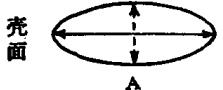

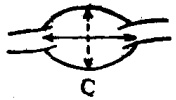

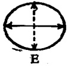

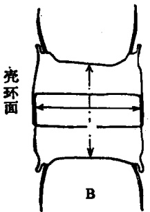

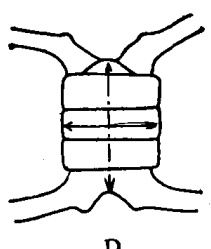

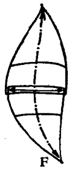

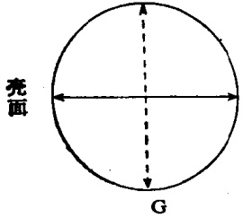

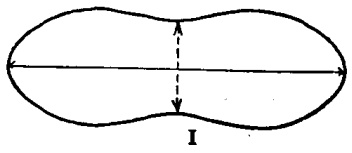

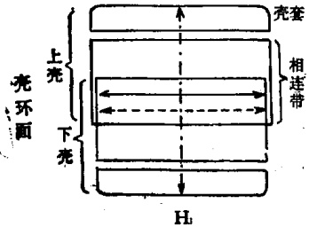

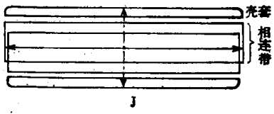

图 1 硅藻的基本类型(仿金德祥等,1965)

A—B. 合形藻  $ (Biddulphia) $; C—D. 角毛藻  $ (Chaetoceros) $;

E—F. 根管藻 (Rhizosolenia); G—H. 圆筛藻 (Coscinodiscus); I—J. 双壁藻 (Diploneis)

纵轴 $ \left(\begin{array}{c}\rightarrow\\ \rightarrow\rightarrow\end{array}\right) $，横轴 $ \left(\begin{array}{c}\leftarrow\rightarrow\rightarrow\\ \rightarrow\rightarrow\end{array}\right) $，壳环轴 $ \left(\begin{array}{c}\leftarrow\cdots\rightarrow\\ \cdots\rightarrow\end{array}\right) $

## 二、 细胞壁

硅藻的细胞壁由硅质（SiO₂·nH₂O）和果胶质（pectin）构成。

---

## Page 27

硅质壁在细胞壁的外面，而果胶质则紧贴在硅质的里面。在正常状态下，两者难以分辨，只有用氢氟酸把硅质溶去之后，才能看到果胶质。硅质壁的厚度随种类而异，底栖种类厚些，浮游种类薄些，这是对浮游的一种适应机制。硅藻的细胞壁都具有规则排列的花纹。中心硅藻，细胞壁的花纹基本上是六角形，如星脐圆筛藻(Coscinodiscus asteromphalus)。形成花纹的原因是细胞壁向内部凹入，成为很多小室。小室的外面有1层硅质薄膜，膜内满布许多小穴，从壳面观呈现许多小点。小室的里面又有1层硅质薄膜，在膜的中央有1圆形大孔。因此，在显微镜下会呈现不同的形态，首先

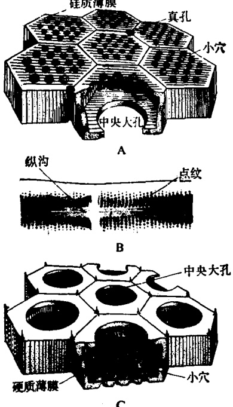

图 2 硅藻壳面的构造图解 (A,C 仿金德祥等, 1965; B 仿 Holdway, 1976)

A. 星脐圆筛藻 (Coscinodiscus asteromphalus); B. 辐节藻 (Stauroneis decipiens); C. 蜂窝三角藻 (Triceratium favus)

看到小点的薄膜，向下转时看到明显的六角孔纹，再下层则可看到

---

## Page 28

圆形的内膜大孔。在六角形孔纹的交接处，有壳面和外界相通的微细小孔，称真孔(pore)，孔径一般为0.1—0.6微米，分布在壳面各部分，或集中于细胞的一端，或靠近壳面边缘(图2A,C)。中心硅藻壳面的孔纹，都是辐射对称排列的，而羽纹硅藻细胞壁上的花纹则比较简单，主要是点纹(puncta)。点纹有粗细之分，它们常紧密地靠近，连成一条直线状，称为点条(striae)。羽纹硅藻壳面的点纹都是左右对称排列的(图2)。

## 三、 纵沟（raphe）

纵沟或称壳缝，是羽纹藻纲细胞壁的一个重要构造。根据它的周围液体的流动情况来判断，纵沟是一种行动器官。纵沟位于壳面的中线上。从壳面的断面来看呈“>”形，向外的裂缝称为外裂缝（external fissure），向内的称为内裂缝（internal fissure）（图3B）。外、内裂缝在细胞的末端分开，并围绕着壳面向内增厚的端节（图3D）。外裂缝通到壳面中央，因受到向内增厚的中节阻挠，而绕着中节的一侧转弯（图3E）。内裂缝伸到中央中节处则中断而

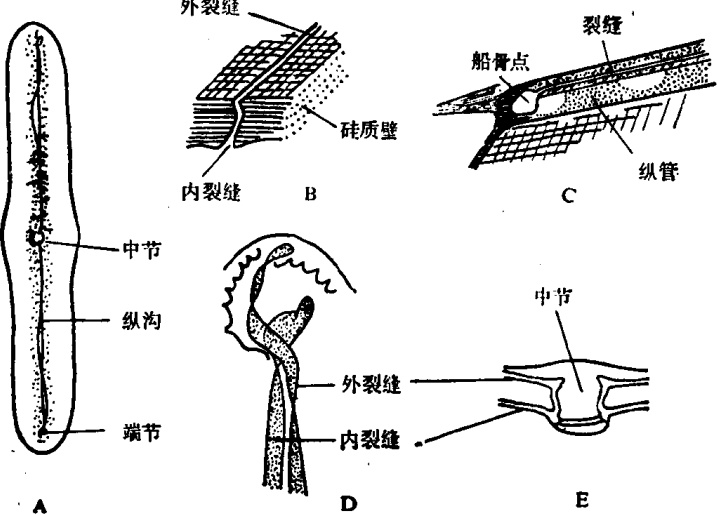

图 3 羽纹藻纲的纵沟、管纵沟的图解(仿 O. Müller, 1909)

A. 羽纹藻(Pinnularia)壳面观；B. 羽纹藻的纵沟；C. 菱形藻(Nitzschia)的管纵沟；D. 羽纹藻的纵沟末端内外裂缝的分叉；E. 羽纹藻中节处的纵沟

---

## Page 29

向上弯，和该处的外裂缝相连接。这种纵沟存在于大多数的羽纹藻纲里。中节（central nodule）和端节（polar nodule）都是壳面硅质向内的增厚部分 $ ^{*} $，有增强裂缝部分细胞壁强度的作用。中节位于壳面的中央，如向横扩张，则形成侧节或称十字节（stauros）。端节位于细胞中央线的两端，一般呈半球形（图3D）。在菱形藻属和双菱藻属，纵沟呈管状，称为管纵沟（canal-raphe）。管纵沟存在于船骨突（keel或carina）中。一般，船骨突在壳的一缘，像船底的龙骨那样向外突出，起支持作用。管纵沟的构造，向外有1条纵裂的狭裂缝，向内则有1列大孔和内部相通，每一大孔就是1个船骨点（carinal dot）或称船骨孔（carinal pore）（图3C）。有船骨突的种类一般没有中节和端节，但少数种类仍有节的残迹。

## 四、 节间带（intercalary band, copulae）

节间带是壳环面细胞壁的一种特殊构造，亦即壳面和相连带之间的次级相连带。凡壳环轴较长的种类都有节间带，它具有加强细胞壁的作用。节间带的数目随着种类而异，有1个[如串珠梯楔藻(Climacosphenia moniligera)]，有2个或2个以上(如平板藻Tebellaria)，甚至有达28个之多(如杆线藻Rhabdonema)。节间带的花纹大致有两类：鱼鳞状的，如卡氏根管藻(Rhizosolenia castracanei)；环状或领状的，如环形娄氏藻(Lauderia annulatus)和中肋角毛藻(Chaetoceros costatus)(图4A-B，E-F)。

此外，有些种类的节间带成为片状，称为隔片（septum）。如扇形藻的隔片从一极向内延伸，又如斑条藻（Grammatophora）从两极向中央延伸。这两类隔片的一端都是游离的，称为假隔片。如果从细胞的一端通到另一端，称为全隔片或真隔片，如梯楔藻（图4 C—D，G—I）。

## 五、 细胞表面的突出物

硅藻细胞表面向外伸展的突出物是多种多样的，有头状突出物，如弯角藻（Eucampia）和翼根管藻（Rhizosolenia alata），它们

---

## Page 30

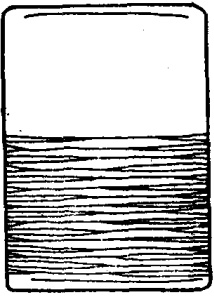

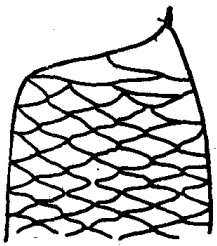

A

B

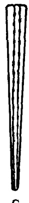

C

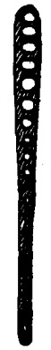

D.

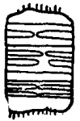

E

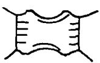

F

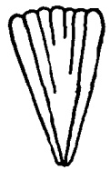

G

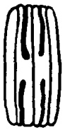

H

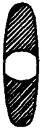

I

图 4 硅藻的节间带和隔片(仿金德祥等, 1965)

A. 杆线藻（Rhabdonema）的环状节间带；B. 根管藻（Rhizosolenia）

的鱼鳞状节间带；C—D. 楔藻（Climacosphenia）的全隔片；E—F.

领状节间带：E. 娄氏藻（Lauderia），F. 角毛藻（Chaetoceros）；G—I.

假隔片：G. 楔形藻（Licmophora），H-1. 斑条藻（Grammatophora）

借助突起相互连接成群体。两个细胞突起相互连接，其间的空隙称为胞间隙（aperture）。胞间隙的形状也是多样化，有椭圆形，圆形，方形，六角形，以及长椭圆形。刺也是细胞壁向外的一种突出物，如双尾藻和角毛藻的刺位于壳面的中央，又如豪猪刺冠藻（Corethron hystrix）的刺遍布在壳的四周。另一种突出物为毛，它较细长，其长度常比细胞直径大好几倍。有些角毛藻的粗毛里还有色素体，这是毛和刺的最大区别。此外，还有膜状突起（如太阳漂流藻）和胶质突起（如海链藻）等。上述这些不同突起都具有增加浮力和相互连接的作用（图5）。

## 六、 细胞内含物

---

## Page 31

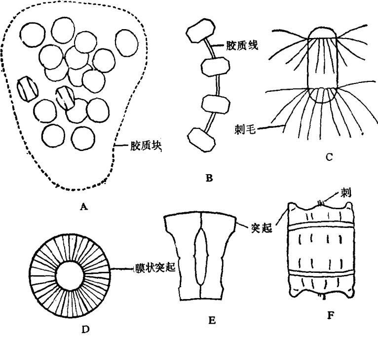

图 5 硅藻细胞表面的突出物(仿金德祥等,1965)

A—B. 海链藻 (Thalassiosira); C. 刺冠藻 (Corethron); D. 漂流藻 (Planktoniella); E. 弯角藻 (Eucampia); F. 合形藻 (Biddulphia)

硅藻细胞内含物与普通植物细胞类似。细胞核位于细胞的中央。色素体有黄、棕黄或青色，其形状多样化，如粒状、片状、叶状、带状、分枝状或星状，一般分布在细胞内，但也有的分布到角毛中。色素体的排列和数量随种类而异。硅藻的色素体含有叶绿素a、c、硅藻素和叶黄素。这种色素体通过光合作用，制造油点(脂肪)、蛋白核（pyrenoid）和淀粉粒等营养物质。

## 第二节 硅藻的分类

硅藻门包括 2 个纲，9 个目，20 个科。纲的特征以壳面花纹为主。中心硅藻纲以细胞主体为一级特征，细胞突出物为二级特征。羽纹硅藻纲以行动器官为一级特征，细胞的对称为二级特征。

---

## Page 32

## 一、 中心硅藻纲（Centriae）

本纲又称辐射硅藻。壳面圆形、多角形或不规则形；花纹一般作辐射状排列。断面为圆形、椭圆形、三角形、多角形以及扁形等。没有纵沟，不能行动。色素体一般小而多。中心硅藻的生殖，除了间接分裂以外，还有小孢子和休止孢子的生殖方法。复大孢子系直接产生。本纲包括3个目，8个科，大部分种类营海洋浮游生活。

## (一) 圆筛藻目 (Coscinodiscales)

一般，细胞壳面圆形，也有半圆形、椭圆形或三角形。花纹一般由壳面中央向四周辐射排列。这一目包括4个科。这是一类最重要的海洋浮游硅藻，在浮游植物中常占优势。

### 1. 圆筛藻科（Coscinodiscaceae）

由于种类多, 数量大, 分布广, 这类硅藻在浮游植物中占重要位置。一般, 壳面没有无纹眼, 也没有明显地分成小块。根据细胞形状、壳外套发达程度、细胞壁硅质含量以及群体形态, 可分为 3 个亚科。兹分别简介如下。

1）直链藻亚科（Melosiroideae）细胞一般呈圆球形，也有呈盘状或短圆柱状。壳外套常发达。借助于细胞中央分泌的胶质，连接成直链，或由壳面紧连，或由刺相连。有些种类的群体营海洋固着生活，但常被风浪击动，脱离附着物而混入浮游群中。一般，这样的浮游细胞不再繁殖(但如果再行附着后，仍能繁殖)。这个亚科可分为下列7个属。

## 直链藻亚科分属的检索表

1. 壳周有刺……2    
壳周无刺……3    
  
2. 壳周有短刺与邻胞相连……冠盖藻属（Stephanopyxis）    
壳周有长刺向外围斜射。壳面半球形……环毛藻属（Corethron）    
  
3. 壳有孔纹或点纹……4    
壳面有大孔纹……6    
  
4. 壳面中央部分和边缘部分的花纹大小不同……玻盘藻属（Hyalodiscus）    
壳面花纹相似……5

---

## Page 33

5. 细胞球形或圆柱形，常连成长链……直链藻属（Melosira）细胞球形。单个生活或2—3个细胞相连……球形藻属（Podosira）

6. 壳面呈半球状凸起……圆箱藻属（Pyridicula）

壳面平……内网藻属（Endictyca）

(1) 直链藻属（Melosira Ag.）细胞呈圆柱形，靠壳面连接成念珠状直链。壳面圆形。细胞壁一般较厚，有细点纹，或孔纹。分裂时壳环带伸得很长。有的种类壳上有横沟，有的有船骨突。色素体多而小。这是淡水硅藻的主要属，也有生活于沿岸海区的。本属有150种，我国已记录的海洋浮游直链藻有4种。

具槽直链藻 [Melosira sulcata (Ehrenb.) Cleve, 1873] (图 6A) 细胞呈短圆柱形，壳面平，紧连成直链 (10—20 个细胞)。两细胞间有凹纹。细胞壁厚。在壳环面有大形网纹。细胞直径大于壳环轴。这是沿岸性种类，分布甚广，在我国沿岸水域均有发现，为重要浮游硅藻之一。

(2) 环毛藻属 (Corethron Castracane) 细胞呈圆柱形。壳面呈半球形鼓起。在上、下壳上各有 1 圈细长的刺，向四周射出。在壳环面有不甚明显的鳞状纹。本属系单独生活，共有 10 种，我国只有 1 种。

素猪环毛藻 (Corethron hystrix Hensen, 1887)(图 6B)

细胞呈圆柱形，高大于直径。上壳刺毛有两种类型，一圈较长，另有一圈较短，介在长刺毛之间，其末端呈头状膨大。细胞壁较薄。色素体多而小。这是大洋性种类，但在沿岸海区也可采到。它在我国沿岸都产。

(3) 冠盖藻属 (Stephanopyxis Ehrenb.) 细胞呈束状，壳面圆形，稍微鼓起。壳缘列生 1 圈管状刺，与壳环轴平行，借此连成短链。细胞壁有六角形孔纹，无节间带。色素体多而小，呈片状或颗粒状。本属包括 39 种，我国有 2 种。

掌状冠盖藻 [Stephanopyxis palmeriana (Greville) Grunow, 1884] (图 6C) 细胞呈球形至圆筒形。 $ \underset{\cdot}{壳}\underset{\cdot}{面}\underset{\cdot}{圆}\underset{\cdot}{形} $， $ \underset{\cdot}{略}\underset{\cdot}{为}\underset{\cdot}{鼓}\underset{\cdot}{起} $。 $ \underset{\cdot}{管}\underset{\cdot}{状}\underset{\cdot}{刺} $ 16—20 条，刺的末端截平，借此连结成链。色素体为盘状。这是近海偏暖性种类，在我国黄海、东海和南海有广泛分布。

---

## Page 34

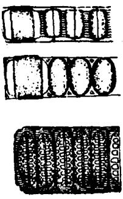

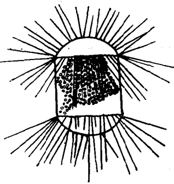

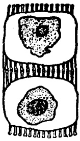

C

图 6 直链藻亚科(仿金德祥等, 1965)

A. 具槽直链藻（Melosira sulcata）的壳环面；B. 豪猪环毛藻（Corethron hystrix）的壳环面；C. 掌状冠盖藻（Stephanopyxis palmeriana）的壳环面

2）圆筛藻亚科（Coscinodisoideae）细胞盘形，常单独生活，表面略有凸起，有的扁平或略为凹入。壳环带花纹不明显。壳外套也不特别发达。根据壳面花纹及突出物形态，可分为下列5个属。

## 圆筛藻亚科分属的检索表

1. 壳周有环状翼，翼上有射出肋……漂流藻属（Planktoniella）

壳周无环状翼……2

2. 壳周有强刺，射出状排列与壳面平行……顾氏藻属(Gossleriell)壳周无刺，个别具胶质突出物……3

3. 壳面波纹状，有边缘条纹区和中央区之分……小环藻属（Cyclotella）壳面非波纹状，不分边缘区与中央区……4

4. 壳面边缘有强刺 1 圈……冠盘藻属（Stephanodiscus）壳面边缘无强刺，但常有小刺……圆筛藻属（Coscinodiscus）

(1) 圆筛藻属 (Coscinodiscus Ehrenb.) 一般，细胞呈盘状，壳面圆形(仅少数椭圆形)，孔纹 (areola) 一般为六角形。孔壁内凹而成内孔，内孔一般圆形，孔纹表面还有与外界不相通的小点纹。孔纹在壳面正中心，有时特别粗大，称为中央玫瑰区；正中心有时有小块的无纹区，称为裂隙，较大时称为中央无纹区。壳缘部分称为

---

## Page 35

外围，最外围孔纹之间常有小刺，有时还有真孔，能分泌胶质，使细胞附着。本属是一个大类，约有300多种，我国已记录的约近30种。

## 我国沿岸水域圆筛藻属常见种的检索表

1. 孔纹线型排列……2  

孔纹非线型排列……3

2. 孔纹直线排列，中央与其它的孔纹大小一致，每10微米内有8—9个孔纹……

…… 狭线形圆筛藻（Coscinodiscus lineatus）

孔纹呈7个偏心曲线排列，壳面中央部的孔纹较大……

…… 偏心圆筛藻（Cos. excentricus）

3. 壳面中央和外围部分的孔纹大小相同，辐射排列……辐射圆筛藻（Cos. radiatus）壳面中央的孔纹到外围逐渐缩小……4

4. 壳周有无纹线，细胞凸镜形。孔纹较粗，中央部分每10微米有5个，外围6个……中心圆筛藻（Cos. centralis）壳周没有无纹线，壳面中央有玫瑰区，中央部分每10微米内有3—5孔……星脐圆筛藻（Cos. asteromphalus）

辐射圆筛藻 (Coscinodiscus radiatus Ehrenb.,1839)(图7A) 壳面扁平，无真孔，无中央玫瑰区。孔纹粗糙，近圆形，作辐射排列， $ \underset{\cdot}{孔}\underset{\cdot}{之}\underset{\cdot}{间}\underset{\cdot}{的}\underset{\cdot}{间}\underset{\cdot}{隙}\underset{\cdot}{较}\underset{\cdot}{大} $。 $ \underset{\cdot}{一}\underset{\cdot}{列}\underset{\cdot}{之}\underset{\cdot}{中}\underset{\cdot}{的}\underset{\cdot}{孔}\underset{\cdot}{纹}\underset{\cdot}{大}\underset{\cdot}{小}\underset{\cdot}{不}\underset{\cdot}{一} $， $ \underset{\cdot}{相}\underset{\cdot}{互}\underset{\cdot}{掺}\underset{\cdot}{杂} $。壳缘狭，有辐射条纹，每10微米有6—9条。本种分布极广，为我国近海最常见种类之一。

星脐圆筛藻（Coscinodiscus asteromphalus Ehrenb., 1844）（图 7E—F）细胞大型，直径可达 180—300 微米，呈盘状，中央略凹。壳面中央有明显的玫瑰区，内孔明显，表面膜有 1 圈小点。壳面孔纹大小几乎一致，或向外围略有缩小。真孔小，位于最边缘，与壳面中心及邻近真孔相距约 100 度。这是广温性外海种类，分布广，为我国近海最常见硅藻之一，也是毛虾的主要饵料。

线形圆筛藻（Coscinodiscus lineatus Ehrenb., 1838）（图7B）细胞呈扁圆盘状，壳面扁平。 $ \underset{\cdot}{孔}\underset{\cdot}{纹}\underset{\cdot}{排}\underset{\cdot}{列}\underset{\cdot}{成}\underset{\cdot}{直}\underset{\cdot}{线} $，横贯壳面，纵横交错，分布均匀，大小一致。这是我国近海常见种类。

(2) 漂流藻属（Planktoniella Schütt）细胞呈圆盘形，壳环面四周有翼状突，薄而宽，并有许多射出肋，有支持翼状突及有利于漂浮的作用。本属为单独生活，只有2种，我国有1种。

太阳漂流藻 [Planktoniella sol (Wallich) Schütt, 1893]

---

## Page 36

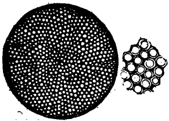

A

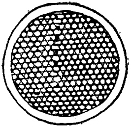

B

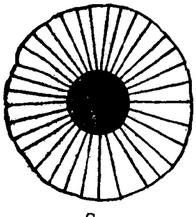

C

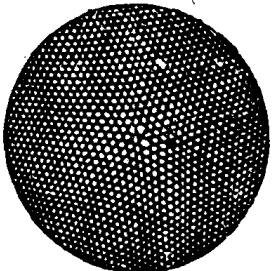

D

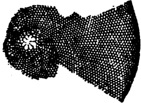

B

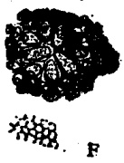

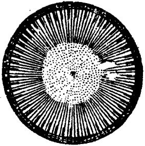

G

图 7 圆筛藻亚科 (A, C—F. 仿 Hustedt, 1927—1930; B, G. 仿金德祥等, 1965)

A.辐射圆筛藻（Coscinodiscus radiatus）的壳面；B.线形圆筛藻（C.lineatus）的壳面；C-D.太阳漂流藻（Planktoniella sol）：C.壳面，D.中央部分放大；E-F.星脐圆筛藻（Coscinodiscus usteromphalus）：E.壳面，F.中央放大；G.扭曲小环藻（Cyclotella comta）的壳面

---

## Page 37

(图 7C—D) 细胞呈圆盘形，直径 40—96 微米。壳面扁平或中央略凹，花纹为偏心曲线排列。壳缘无刺， $ \underset{\cdot}{具}\underset{\cdot}{有}\underset{\cdot}{透}\underset{\cdot}{明}\underset{\cdot}{薄}\underset{\cdot}{膜}\underset{\cdot}{状}\underset{\cdot}{的}\underset{\cdot}{翼}\underset{\cdot}{状}\underset{\cdot}{突} $，有 25—40 条放射肋。这是暖海大洋性种类，但在沿岸水域也较常见。在我国广泛分布于黄海、东海和南海，是良好的暖流指示种。

(3) 小环藻属（Cyclotella Kutzing）细胞呈圆盘形，壳面花纹分为外围和中央区，外围有向中心伸入的肋纹，少数成点纹，或杂有微刺。细胞单独生活，或2—3个由壳面连结成短链，或包埋于自己分泌的胶质块或管内。本属共有61种，大多数为淡水种类，海产的不多。

扭曲小环藻 [Cyclotella comta (Ehrenb.) Kutzing, 1849]（图 7 G）细胞呈盘形，中央部分略有凹凸，直径 57—60 微米。壳面正圆形，壳环面长方形。壳缘厚，壳面四周具有精细放射排列的条纹，每 10 微米有 12—15 条，每隔 3—4 条间 $ \underset{\cdot}{插}\underset{\cdot}{着} $ 1 条 $ \underset{\cdot}{粗}\underset{\cdot}{条}\underset{\cdot}{纹} $。 $ \underset{\cdot}{壳}\underset{\cdot}{面}\underset{\cdot}{中}\underset{\cdot}{央}\underset{\cdot}{具}\underset{\cdot}{有}\underset{\cdot}{较}\underset{\cdot}{整}\underset{\cdot}{齐}\underset{\cdot}{的}\underset{\cdot}{射}\underset{\cdot}{出}\underset{\cdot}{点}\underset{\cdot}{纹} $。本种为淡水产，分布广，是本属最普通的种类，在我国近海也常发现。

5）骨条澡业科（Skeletonemoidae）细胞柱形，由硅质刺，小突起，胶质丝或胶质块连结成链。细胞壁硅质少。有些种类的壳环面常有领纹。本亚科包括10个属。

## 骨条藻亚科分属的检索表

1. 细胞靠刺与邻胞相连 ……2  
   细胞不靠刺与邻胞相连 ……4  
2. 细胞靠缘刺的基部和邻胞连接 …… 辐杆藻属（Bacteriastrum）  
   细胞靠缘刺和邻胞相连 …… 3  
3. 刺与刺相连，在连接处略有膨大。细胞圆盘形 …… 骨条藻属（Skeletonema）  
   刺的末端有胶质线和邻胞胶质线相连成“Z”字形。壳面中央有1根大刺，刺入邻  
   胞。细胞圆柱形 …… 旭氏藻属（Schroederella）  
4. 细胞靠胶质线相连，或埋在胶质块内 …… 5  
   细胞靠壳面与邻胞相连接 …… 7  
5. 细胞圆柱形 …… 娄氏藻属（Lauderia）  
   细胞圆盘形 …… 6  
6. 中央由1条胶质线相连，或埋在胶质块内 …… 海链藻属（Thalassiosira）  
   中央由几条胶质线相连 …… 筛链藻属（Coscinosira）  
7. 壳缘有1个不对称的齿状突 …… 几内亚藻属（Guinardia）  
   壳缘没有不对称的齿状突 …… 8

---

## Page 38

8. 壳面靠突起相连，中央部分不相连。细胞长圆柱形，壳环面有环纹……角管藻属（Cerataulina）壳面中央稍向内凹……

9. 壳环纹多而明显，略呈螺旋形 …… 指管藻属（Dactyliosolen）壳环纹不易看到，非螺旋形 …… 细柱藻属（Leptocylindrus）

(1) 骨条藻属 (Skeletonema Greville) 细胞呈透镜形，圆柱形或球形。壳缘着生 1 圈细刺，与壳环轴平行，并与邻胞的对应刺相接，构成直的长链。细胞间隙长短不一，刺内有细管。壳套上细纹与壳环轴平行。壳面有细点纹。色素体 1—10 个。本属共 10 种，均为海产，但在我国浮游生物中仅发现 1 种。

骨条藻 [Skeletonema costatum (Greville) Cleve, 1878] (图 8B)  $ \underset{\cdot}{细}\underset{\cdot}{胞}\underset{\cdot}{为}\underset{\cdot}{透}\underset{\cdot}{镜}\underset{\cdot}{形}\underset{\cdot}{或}\underset{\cdot}{圆}\underset{\cdot}{柱}\underset{\cdot}{形} $， $ \underset{\cdot}{直}\underset{\cdot}{径}\underset{\cdot}{为} $ 6—7  $ \underset{\cdot}{微}\underset{\cdot}{米} $。壳面圆而鼓起。细胞间隙比细胞本身还长。这是广温、广盐性种类，分布很广，但以沿岸水域最多。我国近海也很常见。河口港湾常由于有机质的污染(即富营养化)，骨条藻大量繁殖而形成赤潮。在实验生态研究上，骨条藻是广泛采用的良好材料(包括作为浮游甲壳动物，特别是幼体的饵料)。

(2) 海链藻属（Thalassiosira Cleve）细胞呈圆盘状，以1条胶质线相连成串，或埋在由原生质分泌的胶质块内。一般营群体生活。壳面平或鼓起，少数种类的壳中央凹入，有点纹；壳缘有许多小刺。节间带明显，呈环纹状或领纹状。色素体多而小，呈板状。本属是近海浮游种类，共有23种，我国已记录的有4种。

细弱海链藻 [Thalassiosira subtilis (Ostenfeld) Gran, 1899]（图 8E）细胞呈小盒形，直径 15—32 微米，10—90 个细胞共同埋在一个胶质块内。壳面正圆形，中央鼓出，呈凸镜形。真孔在壳缘。这是外海种，分布广，我国黄海、东海和南海均有分布。

(3) 辐杆藻属（Bacteriastrum Shadbolt）细胞呈圆柱形。壳面扁平，壳周射出1圈刺毛，和壳环轴平行，然后与邻胞相连，并和壳环轴垂直，向四周射出一定距离后，仍分为2支。因此，从壳面观，刺毛呈“Y”形，由壳周射出。本属有11种，全为海产。我国近海已记录的有6种和2变种。

---

## Page 39

优美辐杆藻（Bacteriastrum delicatulum Cleve，1897）（图8H—I）细胞连结成直链，直径9—15微米。 $ \underset{\cdot}{刺}\underset{\cdot}{基}\underset{\cdot}{较}\underset{\cdot}{长} $， $ \underset{\cdot}{分}\underset{\cdot}{叉}\underset{\cdot}{部}\underset{\cdot}{分}\underset{\cdot}{较}\underset{\cdot}{短} $， $ \underset{\cdot}{分}\underset{\cdot}{叉}\underset{\cdot}{面}\underset{\cdot}{与}\underset{\cdot}{链}\underset{\cdot}{轴}\underset{\cdot}{不}\underset{\cdot}{平}\underset{\cdot}{行} $。群体的两端刺毛同型，都向链内弯入。这是外海广温性种。我国台湾海峡和南海都有分布。

透明辐杆藻（Bacteriastrum hyalinum Lauder，1864）（图8F—G）细胞呈短圆柱形。壳面正圆形。细胞连结成直、长的链状群体，链内刺毛与链轴垂直射出，“Y”形基部短于分叉部，刺基长度相当于细胞直径，刺毛分叉部不呈波状弯曲。端刺毛较粗，两端同型。这是广温性沿岸种，我国黄海、东海和南海都有分布。

(4) 娄氏藻属 (Lauderia Cleve) 细胞呈圆柱形，壳面中央略凹，细胞靠壳面密接，或胶质线连接成直链。壳面边缘有许多小棘。节间带明显，呈环领纹状。色素体多，呈小板状。本属有6种，我国只发现1种。

北方娄氏藻（Lauderia borealis Gran, 1900)（图 8C—D）细胞粗大，借壳面四周紧密相接，而成为直链。壳面边缘列生放射状的小棘。本种为广温性沿岸种，在浮游生物中常见，我国东海、南海有分布。

(5) 指管藻属 (Dactyliosolen Castracane) 细胞圆柱形，壳面扁平，中央稍向内凹。单独生活或靠壳面全面连接成直链。节间带有领纹，并略呈螺旋状。本属共有 7 种，我国只发现 1 种。

地中海指管藻(Dactyliosolen mediterraneus Peragallo, 1892)（图 8 A）细胞长宽比例超过 2 倍。壳环面每 10 微米内有 1—5 条条纹。领纹间和壳面都有六角形小孔纹。这是偏暖性沿岸种类，我国黄海、东海和南海均有分布。

(6) 细柱藻属（Leptocylindrus Cleve）细胞长圆柱形，断面圆形，以壳面紧密相接，构成细长的链状群体。链直或呈波状弯曲。壳面无刺或突起。细胞壁薄，无花纹。色素体2个或多个，呈颗粒状或圆板状。本属有3种，我国只发现1种。

丹麦细柱藻（Leptocylindrus danicus Cleve，1889）细

---

## Page 40

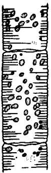

 $  \text{The quick brown fox jumps over the lazy dog.}  $

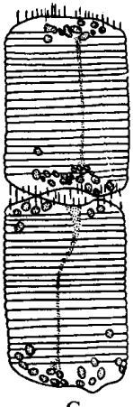

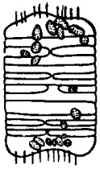

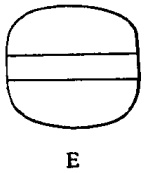

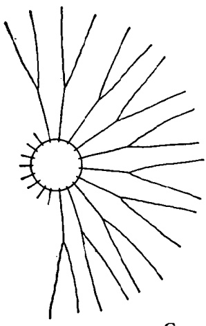

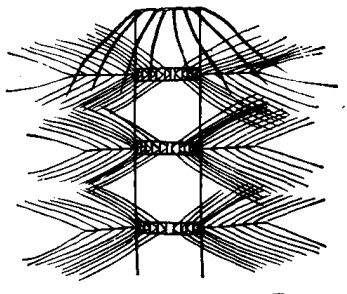

<table border=1 style='margin: auto; word-wrap: break-word;'><tr><td style='text-align: center; word-wrap: break-word;'></td></tr></table>

<table border=1 style='margin: auto; word-wrap: break-word;'><tr><td style='text-align: center; word-wrap: break-word;'></td><td style='text-align: center; word-wrap: break-word;'></td><td style='text-align: center; word-wrap: break-word;'></td><td style='text-align: center; word-wrap: break-word;'></td></tr><tr><td style='text-align: center; word-wrap: break-word;'></td><td style='text-align: center; word-wrap: break-word;'></td><td style='text-align: center; word-wrap: break-word;'></td><td style='text-align: center; word-wrap: break-word;'></td></tr><tr><td style='text-align: center; word-wrap: break-word;'></td><td style='text-align: center; word-wrap: break-word;'></td><td style='text-align: center; word-wrap: break-word;'></td><td style='text-align: center; word-wrap: break-word;'></td></tr><tr><td style='text-align: center; word-wrap: break-word;'></td><td style='text-align: center; word-wrap: break-word;'></td><td style='text-align: center; word-wrap: break-word;'></td><td style='text-align: center; word-wrap: break-word;'></td></tr></table>

---

## Page 41

胞直径 8—12 微米，长 31—130 微米，长等于宽的 2—12 倍。色素体颗粒状，6—33 个。这是沿岸种，我国近海常见。

### 2. 眼纹藻科（Eupodiscaceae）

细胞圆盘形或近半球形。壳面圆形或椭圆形，有或没有纹眼和乳状突；壳面或壳环面有花纹。本科分为5个属。

<table border=1 style='margin: auto; word-wrap: break-word;'><tr><td colspan="2">眼纹藻科分属检索表</td></tr><tr><td style='text-align: center; word-wrap: break-word;'>1. 亮有乳突……</td><td style='text-align: center; word-wrap: break-word;'>沟盘藻属（Aulacodiscus）</td></tr><tr><td style='text-align: center; word-wrap: break-word;'>亮有无纹眼……</td><td style='text-align: center; word-wrap: break-word;'>2</td></tr><tr><td style='text-align: center; word-wrap: break-word;'>2. 无纹眼 2 个或 2 个以上……</td><td style='text-align: center; word-wrap: break-word;'>眼纹藻属（Auliscus）</td></tr><tr><td style='text-align: center; word-wrap: break-word;'>无纹眼 1 个……</td><td style='text-align: center; word-wrap: break-word;'>3</td></tr><tr><td style='text-align: center; word-wrap: break-word;'>3. 亮面半圆形……</td><td style='text-align: center; word-wrap: break-word;'>半盘藻属（Hemidiscus）</td></tr><tr><td style='text-align: center; word-wrap: break-word;'>亮面圆形……</td><td style='text-align: center; word-wrap: break-word;'>4</td></tr><tr><td style='text-align: center; word-wrap: break-word;'>4. 无纹眼大，占亮的 1/8—1/4……</td><td style='text-align: center; word-wrap: break-word;'>斑环藻属（Stictocyclus）</td></tr><tr><td style='text-align: center; word-wrap: break-word;'>无纹眼小……</td><td style='text-align: center; word-wrap: break-word;'>辐环藻属（Acinocyclus）</td></tr></table>

1）沟盘藻属（Aulacodiscus Ehrenb.）细胞圆盘形，扁平，中央稍凸或凹，四周有4个或多个排列整齐的圆锥形突起。壳面和壳环面都有花纹。色素体小而多。本属为底栖种类，共31种，在浮游生物中仅发现1种。

珍珠沟盘藻 (Aulacodiscus margaritaceus Ralfs, 1842)

(图 9D) 壳面圆而扁平，中央略为凹人。壳缘薄， $ \underset{\cdot}{在}\underset{\cdot}{壳}\underset{\cdot}{面}\underset{\cdot}{近}\underset{\cdot}{壳}\underset{\cdot}{缘}\underset{\cdot}{处}\underset{\cdot}{有} $ 4 个圆锥形突起，在 4 个突起之间的线互相交叉成十字形。 $ \underset{\cdot}{壳}\underset{\cdot}{面}\underset{\cdot}{中}\underset{\cdot}{央}\underset{\cdot}{有} $ 1 个小圆形的无纹区；突起周围也形成无纹区。本种分布于我国东海和南海。

2）辐环藻属（Actinocyclus Ehrenb.）细胞呈圆盘状。壳周有1个圆形或椭圆形的无纹眼点。壳面正中央点纹排列不规则。壳周还有小刺。大多为海洋底栖种类，常和海藻在一起，但在

---

## Page 42

沿岸浮游生物中也较常见。本属有82种，在我国海洋浮游生物中已发现4种。

厚辐环藻 (Actinocyclus crassus V. Heurck, 1880) (图 9B) 小型种类，直径 30—40 微米。壳面圆形，壳缘厚，内侧有 1 个透明小眼点。壳面孔纹分成 5 块，每块以一中线作平行排列。中央孔纹大，在直线上的孔纹每 10 微米有 8 个；边缘孔纹较小，每 10 微米有 10 个。壳环面近四方形。本种单独生活，我国福建东山近海很常见，浙江沿岸水域也有过记录。

3）半盘藻属（Hemidiscus Wallich）细胞近半球形，断面楔形。壳面从半月形至左右对称的椭圆形。壳面孔纹细致，呈辐射状排列；壳缘密生1圈小棘。本属大多分布于亚热带海区，在外

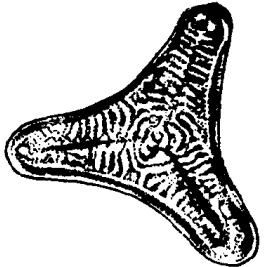

A

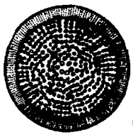

B

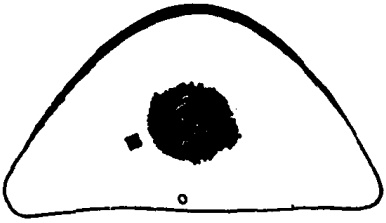

C

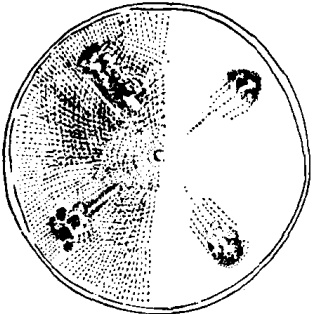

D

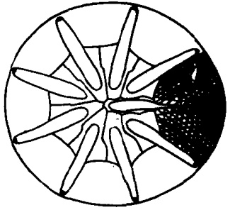

E

图 9 眼纹藻科、辐盘藻科、星纹藻科(仿金德祥等,1965)

A. 环状辐襯藻 (Actinoptychus annulatus); B. 厚辐环藻 (Actinocyclus crassus); C. 楔形半盘藻 (Hemidiscus cuneiformis); D. 珍珠沟盘藻 (Aulacodiscus margaritaceus); E. 粗星脐藻 (Asteromphalus robustus)

---

## Page 43

海或沿岸水域营浮游生活，共有87种，我国只发现2种。

楔形半盘藻（Hemidiscus cuneiformis Wallich，1860）（图 9C）细胞有背腹之分，背面弯曲成弧形， $ \underset{\cdot}{腹}\underset{\cdot}{面}\underset{\cdot}{中}\underset{\cdot}{央}\underset{\cdot}{略}\underset{\cdot}{凸} $， $ \underset{\cdot}{两}\underset{\cdot}{端}\underset{\cdot}{鼓}\underset{\cdot}{圆} $。壳面孔纹近六角形，作放射状排列， $ \underset{\cdot}{自}\underset{\cdot}{中}\underset{\cdot}{央}\underset{\cdot}{向}\underset{\cdot}{边}\underset{\cdot}{缘}\underset{\cdot}{逐}\underset{\cdot}{渐}\underset{\cdot}{缩}\underset{\cdot}{小} $。 $ \underset{\cdot}{近}\underset{\cdot}{腹}\underset{\cdot}{缘}\underset{\cdot}{中}\underset{\cdot}{央}\underset{\cdot}{有} $1个伪结节。这是暖海浮游性种类，在我国福建东山曾采到。

### 3. 辐盘藻科（Actinodiscaceae）

细胞呈盘形、椭圆形，或呈三角形、多角形。壳面无纹或小点纹，中央不分块。本科种类一般单独生活或结成小群体，可分4个属。

## 辐盘藻科分属检索表

<table border=1 style='margin: auto; word-wrap: break-word;'><tr><td style='text-align: center; word-wrap: break-word;'>1. 壳面凹凸不平 ……2</td></tr><tr><td style='text-align: center; word-wrap: break-word;'>壳面扁平,有狭条射出 ……3</td></tr><tr><td style='text-align: center; word-wrap: break-word;'>2. 壳面起伏、圆形、三角形或多角形 …… 辐裥藻属（Actinopychus）</td></tr><tr><td style='text-align: center; word-wrap: break-word;'>壳面凸起、椭圆形 …… 乳头藻属（Mastogonia）</td></tr><tr><td style='text-align: center; word-wrap: break-word;'>3. 壳面蛛网形 …… 蛛网藻属（Arachnoidiscus）</td></tr><tr><td style='text-align: center; word-wrap: break-word;'>壳面非蛛网形 …… 斑盘藻属（Stictodiscus）</td></tr></table>

1) 辐裥藻属（Actinoptychus）……乳头藻属（Mastogonia）……斑盘藻属（Stictodiscus）……斑盘藻属（Stictodiscus）

1) 辐裥藻属（Actinoptychus Ehrenb.）细胞呈盘形，或三角形。壳面中央区无花纹，呈三角形、六角形或多角形，其周围花纹分成射出小块，一凸一凹，相间排列。从壳环面观，壳面呈波纹状。壳壁由多层组成，花纹多样，有六角形的粗纹、微细的点纹，或网状纹，也有呈环状向中心排列的花纹。壳缘有刺。本属有157种，我国海洋浮游生物中已记录6种。

环状辐裥藻 [Actinoptychus annulatus (Wallich) Grunow, 1896]（图 9A）壳面三角形，角间凹入，角端圆形。壳面中央无纹区大，近圆形或星形， $ \underset{\cdot}{具}\underset{\cdot}{有}\underset{\cdot}{许}\underset{\cdot}{多}\underset{\cdot}{向}\underset{\cdot}{心}\underset{\cdot}{条}\underset{\cdot}{纹} $。这是底栖种类，但常混入浮游生物中。我国东、南近海常可采到。

## (二) 合形藻目 (Biddulphiales)

细胞形似一面粉袋，壳面形状多样，有长椭圆形、多角形，以至长形，偶有圆形。细胞各角常有突起，有的还具小刺。本目包括3个科，大部分营浮游生活，有的种类能分泌胶质，营固着生活。

---

## Page 44

### 1. 合形藻科（Biddulphiaceae）

壳面椭圆形、三角形、四角形、多角形或近圆形。壳面有2个突起或每角有1个突起；也有些种类不具突起。细胞一般单独生活，也有靠突端分泌的胶质相连成链。合形藻是一个大科，包括11个属，绝大多数为海洋种类。

## 合形藻科分属检索表

<table border=1 style='margin: auto; word-wrap: break-word;'><tr><td style='text-align: center; word-wrap: break-word;'>1. 壳面椭圆形、三角形或多角形</td><td style='text-align: center; word-wrap: break-word;'>2</td></tr><tr><td style='text-align: center; word-wrap: break-word;'>壳面长椭圆形</td><td style='text-align: center; word-wrap: break-word;'>9</td></tr><tr><td style='text-align: center; word-wrap: break-word;'>2. 壳面中央各有1根大刺</td><td style='text-align: center; word-wrap: break-word;'>双尾藻属（Diylum）</td></tr><tr><td style='text-align: center; word-wrap: break-word;'>壳面无大刺，细胞靠突起相连</td><td style='text-align: center; word-wrap: break-word;'>3</td></tr><tr><td style='text-align: center; word-wrap: break-word;'>3. 壳面中央部分靠突起相连</td><td style='text-align: center; word-wrap: break-word;'>中鼓藻属（Bellerochea）</td></tr><tr><td style='text-align: center; word-wrap: break-word;'>壳面中央部分不相连</td><td style='text-align: center; word-wrap: break-word;'>4</td></tr><tr><td style='text-align: center; word-wrap: break-word;'>4. 壳面近圆形至圆形。细胞扭转。硅质壁厚</td><td style='text-align: center; word-wrap: break-word;'>角状藻属（Ceraialulus）</td></tr><tr><td style='text-align: center; word-wrap: break-word;'>壳面非圆形</td><td style='text-align: center; word-wrap: break-word;'>5</td></tr><tr><td style='text-align: center; word-wrap: break-word;'>5. 壳面三角形、四角形或多角形</td><td style='text-align: center; word-wrap: break-word;'>三角藻属（Triceratium）</td></tr><tr><td style='text-align: center; word-wrap: break-word;'>壳面椭圆形</td><td style='text-align: center; word-wrap: break-word;'>6</td></tr><tr><td style='text-align: center; word-wrap: break-word;'>6. 壳面只有1个突起</td><td style='text-align: center; word-wrap: break-word;'>扁梯藻属（Isthemia）</td></tr><tr><td style='text-align: center; word-wrap: break-word;'>壳面有2个突起</td><td style='text-align: center; word-wrap: break-word;'>7</td></tr><tr><td style='text-align: center; word-wrap: break-word;'>7. 细胞弯转。突起狭尖，突端有爪，突间无小刺</td><td style='text-align: center; word-wrap: break-word;'>半管藻属（Hemiaulus）</td></tr><tr><td style='text-align: center; word-wrap: break-word;'>细胞直</td><td style='text-align: center; word-wrap: break-word;'>8</td></tr><tr><td style='text-align: center; word-wrap: break-word;'>8. 突短、突间有小刺</td><td style='text-align: center; word-wrap: break-word;'>合形藻属（Biddulphia）</td></tr><tr><td style='text-align: center; word-wrap: break-word;'>突起向外射出，突间无小刺，有中棘</td><td style='text-align: center; word-wrap: break-word;'>四棘藻属（Atheya）</td></tr><tr><td style='text-align: center; word-wrap: break-word;'>9. 细胞连成直链。壳环面“H”形</td><td style='text-align: center; word-wrap: break-word;'>梯形藻属（Climacodium）</td></tr><tr><td style='text-align: center; word-wrap: break-word;'>细胞不连成直链</td><td style='text-align: center; word-wrap: break-word;'>10</td></tr><tr><td style='text-align: center; word-wrap: break-word;'>10. 链呈螺旋状。壳环面“I”形</td><td style='text-align: center; word-wrap: break-word;'>弯角藻属（Eucampia）</td></tr><tr><td style='text-align: center; word-wrap: break-word;'>链扭转，壳环面方形</td><td style='text-align: center; word-wrap: break-word;'>扭鞘藻属（Streptotheca）</td></tr></table>

1) 合形藻属（Biddulphia Gray）壳面一般椭圆形；两端有突起，突起的末端常有小形的真孔，能分泌胶质使细胞连成链状群体。营附着生活的种类，以这种胶质和附着基相接。浮游种类具有细长突起，有助于浮游。在突起附近的壳面上，或壳面中央具2根刺毛。壳环带明显，壳环带与壳套之间有明显的界线，或有相当宽的肋纹。浮游种类的细胞壁一般较薄，壁上有六角形或圆形的孔纹，其大小、粗细、排列随种而异。色素体多而小。本属是个大属，有237种，大多数营固着生活，少数是真正浮游的。我国海区已记录的有14种。

---

## Page 45

## 我国沿岸水域合形藻属常见种的检索表

1. 突起和刺毛与壳环轴平行 ……中华合形藻（Biddulphia sinensis）突起或刺毛，或两者均呈射出状排列 ……2

2. 壳面中部呈半球状鼓起。刺毛位于近中央 …… 3

壳面表面鼓起、或平、或向内微凹 …… 4

3. 细胞相连成锯链……长耳合形藻（B. aurita）

细胞相连成直链……长角合形藻（B. longicrasis）

4. 细胞纵轴小于 80 微米。壳面弧状鼓起，刺毛在壳面正中央和突起之间射出……活动合形藻（B. mobiliensis）细胞纵轴大于 100 微米。壳面平或略有下凹。刺毛略靠近突起……高合形藻（B. regia）

中华合形藻 (Biddulphia sinensis Greville,1866)(图 10A) 细胞呈面粉袋状，突起为棒状，与壳环轴平行或稍弯向细胞内侧，其末端截平；突起内侧的壳面上有明显的小隆起，上面着生1根粗的中空的刺毛，与突起平行。这是偏暖性沿岸种类，营浔游生活，分布很广，为我国近海最常见的种类之一。

长耳合形藻 [Biddlphia aurita (Lyngbye) Brebisson et Godey, 1838] (图 10B) 壳面椭圆形， $ \underset{\cdot}{中}\underset{\cdot}{央}\underset{\cdot}{疣}\underset{\cdot}{状}\underset{\cdot}{鼓}\underset{\cdot}{起} $， $ \underset{\cdot}{通}\underset{\cdot}{常}\underset{\cdot}{有} $ 2—3 $ \underset{\cdot}{根}\underset{\cdot}{刺} $，突起末端呈乳头状。色素体圆板状。群体呈锯齿状。这是沿岸和潮间带种类，常附着于海藻上，也出现于浮游生物中。我国黄海和东海均有分布。

2）双尾藻属（Ditylum Bailey）细胞三角柱形，四角柱形或圆柱形。壳面中央有1条粗直中空的长刺，和壳环轴平行；有的种类在壳面四周有许多小刺。壳环面的长短随着节间带的多少而改变。壁薄、花纹不明显。本属为单独生活，有4种，我国沿岸水域有2种。

布氏双尾藻 [Ditylum brightwellii (West) Grunow, 1881]（图 10D）壳面扁平，大多为三角形，中央有 1 大刺，末端截平； $ \underset{\cdot}{在}\underset{\cdot}{壳}\underset{\cdot}{面}\underset{\cdot}{上}\underset{\cdot}{列}\underset{\cdot}{生}\underset{\cdot}{冠}\underset{\cdot}{状}\underset{\cdot}{小}\underset{\cdot}{刺} $。本种适温范围广，属于世界种，也是我国沿岸常见种类之一。

3）半管藻属（Hemiaulus Ehrenb.）细胞单个生活，或连结成直或弯的链状群体。壳面卵圆形、三角形、四角形；中央平或略凸或凹，壳缘有2—3个突起，与壳环轴平行。突起末端有短小

---

## Page 46

的爪状棘，借以插入邻胞而组成群体。壳环面呈“H”形。本属有87种，皆为海产。我国近海有4种浮游种类。

中华半管藻(Hemiaulus sinensis Greville,1865)(图 10E)群体常呈弯链状，甚至螺旋状，少数为直链。 $ \underset{\cdot}{壳}\underset{\cdot}{面}\underset{\cdot}{中}\underset{\cdot}{央}\underset{\cdot}{略}\underset{\cdot}{凸} $， $ \underset{\cdot}{其}\underset{\cdot}{隅}\underset{\cdot}{角}\underset{\cdot}{有}\underset{\cdot}{较}\underset{\cdot}{粗} $的突起， $ \underset{\cdot}{与}\underset{\cdot}{链}\underset{\cdot}{轴}\underset{\cdot}{平}\underset{\cdot}{行} $。突起的末端尖，具有细小的爪状

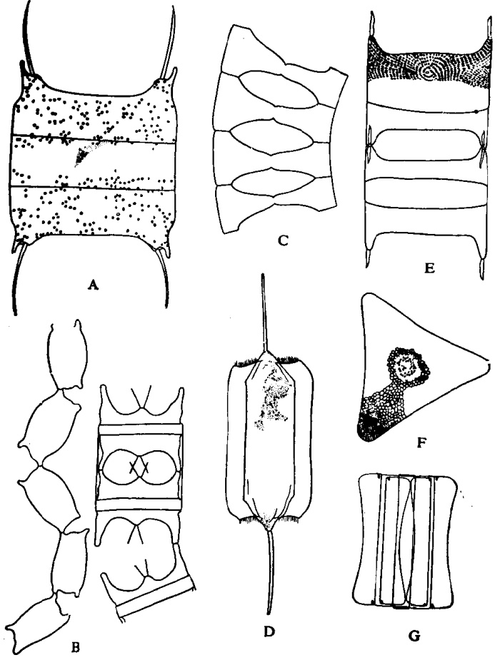

图 10 合形藻科(仿金德祥等,1965)

A. 中华合形藻 (Biddulphia sinensis); B. 长耳合形藻 (B. aurita); C. 浮动弯角藻 (Eucampia zoodiacus); D. 布氏双尾藻 (Ditylum brightwellii); E. 中华半管藻 (Hemiaulus sinensis); F—G. 美丽三角藻 (Triceratium formosum); F. 壳面, G. 壳环面

---

## Page 47

棘。壳环面呈“H”形，胞间隙方形。这是沿岸性种类，我国东海和南海有分布。

4）三角藻属（Triceratium Ehrenb.）细胞单个生活或组成短链。壳面三角形、四角形、五角形至多角形。在各个角隅有略高的突起，其上常有小棘或明显的孔纹。壳面孔纹六角形，排列整齐。多数为沿岸性种类，营附着生活，但在浮游生物中常有单个个体。本属种类很多，有427种，在我国浮游生物中只发现6种、1变种和2变型。

美丽三角藻（Triceratium formosum Brightwell, 1856）（图 10 F—G）壳面三角形，壳面孔纹六角形至多角形，在中央的孔纹近圆形，很小，稀疏而不规则地排列。这是广温性底栖种类，有时混入浮游生物中。我国东海有分布。

5）弯角藻属（Eucampia Ehrenb.）壳面狭扁，椭圆形，链短者呈折扇状，链长者卷曲呈螺旋状。在长轴的两极各有1个突起，顶端截平，借此与邻细胞相对突起连接，细胞间隙大。壳面有细点纹。本属有5种，都是海产，我国近海有2种。

浮动弯角藻（Eucampia zoodiacus Ehrenb.，1839）（图10C） $ \underset{\cdot}{细}\underset{\cdot}{胞}\underset{\cdot}{宽}\underset{\cdot}{大}\underset{\cdot}{于}\underset{\cdot}{高} $，壳环面呈“I”字形；一边长，另一边短，两边与邻细胞的对立突起相连结，成为螺旋链；胞间隙较小，椭圆形至圆形。这是沿岸广温性种类，分布很广。我国近海均有分布，特别是山东青岛在秋季大量出现，为青岛常见种类之一。

### 2. 角毛藻科（Chaetoceraceae）

宽壳环面长方形或正方形。壳面椭圆形；有的圆形。壳面有2个突起，并有长角毛。角毛的基部和邻胞角毛相连成链，细胞间常有空隙，称为细胞间隙。本科海产浮游的只有1属。

1) 角毛藻属（Chaetoceros Ehrenb.）特征同科。这属包括种类很多，分布很广，是最常见的、最重要的浮游硅藻之一，也是我国近海重要硅藻之一。根据角毛内有无色素体以及色素体的形态和数目，角毛藻可分为3个亚属，并根据细胞、角毛、胞间隙以及休止孢子等形态，又可划分为若干组(表5)。角毛藻有140种，我国

---

## Page 48

近海已发现 50 种。

表 5 角毛藻的特征比较

<table border=1 style='margin: auto; word-wrap: break-word;'><tr><td style='text-align: center; word-wrap: break-word;'>亚属</td><td style='text-align: center; word-wrap: break-word;'>类型</td><td style='text-align: center; word-wrap: break-word;'>细胞本身的构造</td><td style='text-align: center; word-wrap: break-word;'>角毛</td><td style='text-align: center; word-wrap: break-word;'>胞间隙</td><td style='text-align: center; word-wrap: break-word;'>休止孢子</td></tr><tr><td rowspan="2">多色暗角毛亚属Phaeocerospolychromatophorus(外海种)</td><td style='text-align: center; word-wrap: break-word;'>大西洋组(Atlantica)</td><td style='text-align: center; word-wrap: break-word;'>壳面中央常有1个小刺</td><td style='text-align: center; word-wrap: break-word;'>角毛在同一平面上射出</td><td style='text-align: center; word-wrap: break-word;'>大</td><td rowspan="2">无休止孢子(Ch.eibenii除外)</td></tr><tr><td style='text-align: center; word-wrap: break-word;'>北方组(Borealia)</td><td style='text-align: center; word-wrap: break-word;'>壳面中央常无小刺</td><td style='text-align: center; word-wrap: break-word;'>角毛向不同方向射出</td><td style='text-align: center; word-wrap: break-word;'>小</td></tr><tr><td rowspan="4">多色明角角毛亚属Hyalochaetopolychromatophora</td><td style='text-align: center; word-wrap: break-word;'>大洋组(Oceanica)</td><td style='text-align: center; word-wrap: break-word;'>色素体大6—10个</td><td style='text-align: center; word-wrap: break-word;'></td><td style='text-align: center; word-wrap: break-word;'></td><td style='text-align: center; word-wrap: break-word;'>无休止孢子</td></tr><tr><td style='text-align: center; word-wrap: break-word;'>二茎组(Dicladia)</td><td style='text-align: center; word-wrap: break-word;'>同上</td><td style='text-align: center; word-wrap: break-word;'></td><td style='text-align: center; word-wrap: break-word;'></td><td style='text-align: center; word-wrap: break-word;'>有休止孢子</td></tr><tr><td style='text-align: center; word-wrap: break-word;'>扁形组(Compressa)</td><td style='text-align: center; word-wrap: break-word;'>断面扁形,色素体小而多</td><td style='text-align: center; word-wrap: break-word;'>有粗大而弯曲的内角毛</td><td style='text-align: center; word-wrap: break-word;'>中等</td><td style='text-align: center; word-wrap: break-word;'></td></tr><tr><td style='text-align: center; word-wrap: break-word;'>圆柱组(Cylindrica)</td><td style='text-align: center; word-wrap: break-word;'>断面近圆形,色素体小而多</td><td style='text-align: center; word-wrap: break-word;'>端角毛和内角毛相同</td><td style='text-align: center; word-wrap: break-word;'>小</td><td style='text-align: center; word-wrap: break-word;'>有休止孢子</td></tr><tr><td rowspan="12">寡色体亚属Oligochromatophorus(近海种)</td><td style='text-align: center; word-wrap: break-word;'>单胞组(Simplicia)</td><td style='text-align: center; word-wrap: break-word;'>单独生活,有时2、3个组成短链</td><td style='text-align: center; word-wrap: break-word;'>端刺同内刺</td><td style='text-align: center; word-wrap: break-word;'></td><td style='text-align: center; word-wrap: break-word;'></td></tr><tr><td style='text-align: center; word-wrap: break-word;'>聚生组(Socialia)</td><td style='text-align: center; word-wrap: break-word;'>链短而弯,在球状胶质块内</td><td style='text-align: center; word-wrap: break-word;'></td><td style='text-align: center; word-wrap: break-word;'></td><td style='text-align: center; word-wrap: break-word;'>休止孢子光滑或有小刺</td></tr><tr><td style='text-align: center; word-wrap: break-word;'>叉形角毛组(Furcellata)</td><td style='text-align: center; word-wrap: break-word;'></td><td style='text-align: center; word-wrap: break-word;'>端刺、内刺相似</td><td style='text-align: center; word-wrap: break-word;'></td><td style='text-align: center; word-wrap: break-word;'>休止孢子间有愈合而再分叉的刺毛</td></tr><tr><td style='text-align: center; word-wrap: break-word;'>有突起组(Protuberantia)</td><td style='text-align: center; word-wrap: break-word;'>壳面中央有半球状或锥形突起</td><td style='text-align: center; word-wrap: break-word;'></td><td style='text-align: center; word-wrap: break-word;'></td><td style='text-align: center; word-wrap: break-word;'>休止孢子有2长角</td></tr><tr><td style='text-align: center; word-wrap: break-word;'>桥联角毛组(Anastomosantia)</td><td style='text-align: center; word-wrap: break-word;'></td><td style='text-align: center; word-wrap: break-word;'>有桥联角毛</td><td style='text-align: center; word-wrap: break-word;'></td><td style='text-align: center; word-wrap: break-word;'></td></tr><tr><td style='text-align: center; word-wrap: break-word;'>缢缩组(Constricta)</td><td style='text-align: center; word-wrap: break-word;'>壳套与壳环带间有深缢</td><td style='text-align: center; word-wrap: break-word;'>端刺常粗</td><td style='text-align: center; word-wrap: break-word;'></td><td style='text-align: center; word-wrap: break-word;'>休止孢子两壳有刺,少数无刺</td></tr><tr><td style='text-align: center; word-wrap: break-word;'>异角毛组(Diversa)</td><td style='text-align: center; word-wrap: break-word;'>有粗大内刺,短链</td><td style='text-align: center; word-wrap: break-word;'>端刺小</td><td style='text-align: center; word-wrap: break-word;'></td><td style='text-align: center; word-wrap: break-word;'></td></tr><tr><td style='text-align: center; word-wrap: break-word;'>旋链组(Curviseta)</td><td style='text-align: center; word-wrap: break-word;'>链扭转或弯成螺旋状,无特殊端刺毛</td><td style='text-align: center; word-wrap: break-word;'>角毛与链轴垂直或弯向链的一方</td><td style='text-align: center; word-wrap: break-word;'></td><td style='text-align: center; word-wrap: break-word;'></td></tr><tr><td style='text-align: center; word-wrap: break-word;'>窄环带组(Stenocincta)</td><td style='text-align: center; word-wrap: break-word;'>壳环带窄,小于1/3</td><td style='text-align: center; word-wrap: break-word;'>端刺常粗大</td><td style='text-align: center; word-wrap: break-word;'>狭小</td><td style='text-align: center; word-wrap: break-word;'>孢子双壳有小刺</td></tr><tr><td style='text-align: center; word-wrap: break-word;'>冕状孢子组(Diadema)</td><td style='text-align: center; word-wrap: break-word;'>链长</td><td style='text-align: center; word-wrap: break-word;'>端刺略有不同</td><td style='text-align: center; word-wrap: break-word;'></td><td style='text-align: center; word-wrap: break-word;'>初级壳上有分枝突起或1圈小刺或无刺或双壳有刺</td></tr><tr><td style='text-align: center; word-wrap: break-word;'>短链组(Brevicatenata)</td><td style='text-align: center; word-wrap: break-word;'>小形短链</td><td style='text-align: center; word-wrap: break-word;'>端刺略有不同,但微细</td><td style='text-align: center; word-wrap: break-word;'>小</td><td style='text-align: center; word-wrap: break-word;'></td></tr><tr><td style='text-align: center; word-wrap: break-word;'>垂缘组(Laciniosa)</td><td style='text-align: center; word-wrap: break-word;'>壳环带宽</td><td style='text-align: center; word-wrap: break-word;'>端刺粗</td><td style='text-align: center; word-wrap: break-word;'>孔大</td><td style='text-align: center; word-wrap: break-word;'>孢子不在中央,初级壳光滑或有小刺</td></tr></table>

## 我国沿岸水域角毛藻属常见种的检索表

1. 细胞本身色素体很多。角毛粗，有色素体 ……2

细胞本身色素体少。角毛细，无色素体 ……5

---

## Page 49

2. 单胞生活。上、下壳不同。端角毛和内角毛相似，向下方伸展  
……秘鲁角毛藻（Chaetoceros preuvianus）  
细胞群体呈链状  
3. 细胞在链中的排列扭转。壳面长轴与链轴成一定角度。角毛基本上呈“S”形弯曲，但仍与链轴垂直  
……卡氏角毛藻（Ch. castracanei）  
细胞在链中的排列无显著扭转  
4. 胞间隙甚狭。壳套低，小于或等于细胞高度的1/3……密联角毛藻（Ch. densus）  
胞间隙宽。壳套常大于细胞高度的1/3……北方角毛藻（Ch. borealis）  
5. 色素体有4个或多于4个  
……6  
色素体少于2个  
7. 细胞单独生活，或由2—3个组成群体，细胞小型…单勒氏角毛藻（Ch. muelleri）  
细胞连成群体  
8. 每两个休止孢子互相靠近，其间有2个粗棘，基部愈合，末端分叉。细胞角毛细长，无小刺  
……绕孢角毛藻（Ch. cinctus）  
休止孢子不同于上述形态  
9. 壳面中央有疣状或圆锥状突起。角毛相交点在壳缘附近  
……双突角毛藻（Ch. didymus）  
壳面中央无疣状突起  
10. 凹缢宽又深。休止孢子的次生壳边缘光滑无刺。角毛后半段呈波状，并有4行刺  
……缢缩角毛藻（Ch. constrictus）  
凹缢浅或缺  
11. 链内有一种粗大而异形的角毛。粗角毛先沿着对角线伸展，末端与链轴平行  
……异角角毛藻（Ch. diversus）  
链内无两种异形角毛  
12. 链螺旋状弯曲，角毛弯向弯凸的一侧  
……13  
链直或略微扭曲，角毛不弯向链的一侧  
13. 壳面有4个突起与邻胞突起相连，形成3个胞间隙  
……假弯角毛藻（Ch. pseudocurvisetus）  
壳面无突起与邻胞相连  
14. 胞间隙椭圆形。壳套与壳环带交界处有明显的凹缢。休止孢子壳面呈弧形鼓起，单峰  
……旋链角毛藻（Ch. curvisetus）  
胞间隙长条形。壳套与壳环带交界处无凹缢。休止孢子内壳面各有2个驼峰形  
突起  
15. 壳环带窄，其宽度小于细胞高度的1/3。壳面近壳处无突起。端角毛与内角毛异形，内角毛与链轴垂直  
……窄隙角毛藻（Ch. affinis）  
壳环带宽达细胞高度的1/3，链短，上、下壳异形，无胞间隙。下端的端角毛只一根，长而粗，另一根细小  
……异常角毛藻（Ch. abnormis）  
窄隙角毛藻（Chaetoceros affinis Lauder，1864）（图11）  
C) 群体直链状。壳面椭圆形。角毛与链轴垂直伸出，或逐渐弯向

---

## Page 50

链端。 $ \underset{\cdot}{端}\underset{\cdot}{角}\underset{\cdot}{毛}\underset{\cdot}{粗}\underset{\cdot}{大} $， $ \underset{\cdot}{弯}\underset{\cdot}{曲}\underset{\cdot}{呈}\underset{\cdot}{镰}\underset{\cdot}{刀}\underset{\cdot}{状} $。壳环带狭。胞间隙狭长。这是沿岸广温性种类，分布广。我国近海常见。

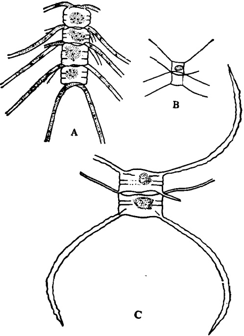

图 11 角毛藤科(仿金德祥等,1965)

A. 密联角毛藻 (Chaetoceros densus); B. 牟勒氏角毛藻 (C. muelleri); C. 窄隙角毛藻 (C. affinis)

密联角毛藻（Chaetoceros densus Cleve,1901）（图 11 A）链长而直。壳面椭圆形至圆形， $ \underset{\cdot}{中}\underset{\cdot}{央}\underset{\cdot}{无}\underset{\cdot}{小}\underset{\cdot}{刺} $。 $ \underset{\cdot}{胞}\underset{\cdot}{间}\underset{\cdot}{隙}\underset{\cdot}{小} $。角毛粗，基部短，末端尖细，由壳缘内侧射出，先与链轴垂直，后弯向链端。角毛离基部不远处生出 4 行小刺。色素体多，椭圆形，在角毛内也有。这是大洋广温性种类，但在沿岸水域也能采到。我国近海均有分布，在烟、威鲐鱼渔场的数量很大，成为该海域浮游硅藻的优势种之一。

牟勒氏角毛藻(Chaetoceros muelleri Lemmermann,1898)

(图 11 B) 细胞小型，大多数是单个生活，仅有个别出现2、3个细胞

---

## Page 51

组成的群体。壳环带不明显。角毛细长而直，末端尖，伸出方向与纵轴平行。色素体1个，呈片状。休止孢子在母细胞中只有1个，两壳表面光滑；初生壳凸出，呈球形；次生壳中央部更高且凸出。这是沿岸半咸水种类，在我国分布于台湾海峡及南海沿岸、河口水域。这种硅藻可大量培养，成为贝、虾类幼体的良好饵料。

## (二) 根管藻目 (Rhizosoleniales)

细胞壳面为椭圆形，少数圆形。壳环轴伸长呈管状。壳面突起多样，呈半球形、锥形、斜锥形或鸭咀形，并在末端常有爪状刺。本目只有1科。

### 1. 根管藻科（Rhizosoleniaceae）

特征同目。本科只有1属。

1）根管藻属 [Rhizosolenia (Ehrenb.) Brightwell] 特征同科。本属分布很广，大多为暖水性，共有52种。我国沿岸水域有16种、3个变种和3个变型。本科可分为下列6个类型。

根管藻属分类型(及其代表种)的检索表

1. 末端无刺……无刺类 (Sec. Inermes)

末端有刺……3

2. 大多鳞片状，末端截断形，有细孔，细孔基部呈瓶形……伯戈根管藻 (Rhizosolenia bergonii)

很少鳞片状，突起背腹扁平……翼根管藻 (Rhiz. alata)

3. 壳面平或略呈圆形，有短刺。细胞圆筒形……窄隙类 (Sec. Affinis)

4. 链成弧形。色素体多。壳面平……斯托根管藻 (Rhiz. stolterfothii)

链直，壳面平。色素体大，2—5个……柔弱根管藻 (Rhiz. delicatula)

5. 壳面近于圆锥形。单蚀生活……粗壮类 (Sec. Robustae)

6. 锥体上有纵条纹。端刺细小。细胞略弯……粗根管藻 (Rhiz. robusta)

锥体上无纵条纹。端刺粗大。细胞壁厚，细胞直……厚刺根管藻 (Rhiz. crassisipina)

7. 大多鳞片状……多鳞类 (Sec. Squamosae)

很少鳞片状……9

8. 壳面渐渐转圆……克氏根管藻 (Rhiz. clevei)

壳面渐渐转尖，鳞纹间构造微细……尖根管藻 (Rhiz. acuminata)

9. 壳环纹分为左右两列，条纹明显……复瓦类 (Sec. Imbricatae)，复瓦根管藻 (Rhiz. imbricata)

壳环纹分为背腹两列……模式类 (Sec. Genuinae)

---

## Page 52

10. 壳面弧形，有1距状强刺……距端根管藻(Rhiz. calcar-avis)无距状刺，端刺甚长。刺基部为长圆柱形，但突然变细，呈毛状，壳环纹不明显……刚毛根管藻(Rhiz. setigera)

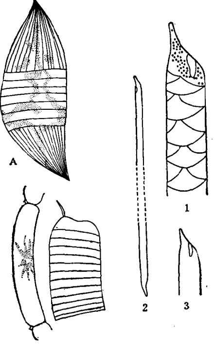

c

图 12 根管藻科(仿金德祥等,1965)

A. 粗根管藻 (Rhizosolenia robusta); B. 斯托根管藻 (R. stolterfothii);

C. 翼根管藻 (R. alata): 1. 印度翼根管藻 (R. alata f. indica), 2. 细长翼根管藻 (R. alata f. gracillima), 3. 几内亚翼根管藻 (R. alata f. genuina)

翼根管藻（Rhizosolenia alata Brightwell，1858）（图12C₁₋₃）单个生活或成短链。壳面伸长。突起背腹扁平，顶端截平。没有端刺。细胞壁很薄，节间带花纹呈鳞片状，整齐排列成背腹2行。本种有许多变型，为外海性种类，分布很广，但沿岸水域也常见。我国近海有广泛分布。

斯托根管藻 (Rhizosolenia stolterfothii Peragallo, 1888)

(图 12 B) 壳环轴长而弯曲、呈弧形，群体则呈螺旋状。壳面平坦

---

## Page 53

至卵圆形，边缘着生1根小刺，嵌入邻胞。节间带呈环状纹。这是近海广温性种类，分布很广。我国黄海、东海和南海均有分布。

粗根管藻（Rhizosolenia robusta Norman，1861）（图12A）单个生活。壳面凸出，呈圆锥形。两壳大小不一，通常上壳短于下壳。锥形突具纵线。这是大洋性种类，我国南海有分布。在厦门水域，当暖流强盛季节，其数量也大。

## 二、 羽纹硅藻纲（Pennatae）

细胞基本上为长形至椭圆形，壳面大多为舟形或针形。花纹一般左右对称，向着一条中线，呈羽纹状排列。许多种类具纵沟，能行动。色素体较少而大，常呈叶状或分枝状。生殖方式多，但没有大小配子生殖。本纲硅藻大多营淡水底栖生活，海洋浮游的种类较少。本纲硅藻包括6个目、12个科。

## (一) 舟形藻目 (Naviculales)

上、下两壳各有纵沟 1 条，其位置在壳的正中线、边缘或四周。细胞形状多样，呈箭形、“S”形、月形、弓形等。本目包括 4 个科。

### 1. 舟形藻科 (Naviculaceae)

壳面左右对称。纵沟在壳的中线上，或接近中线。有中节和端节。壳环面呈长方形。本科是羽纹硅藻中最大的科，种类和数量均多。

## 舟形藻科分属的检索表

<table border=1 style='margin: auto; word-wrap: break-word;'><tr><td colspan="2">舟形藻科分属的检索表</td></tr><tr><td style='text-align: center; word-wrap: break-word;'>1. 壳面长方形</td><td style='text-align: center; word-wrap: break-word;'>小箱藻属（Cistula）</td></tr><tr><td style='text-align: center; word-wrap: break-word;'>壳面略呈舟形</td><td style='text-align: center; word-wrap: break-word;'>2</td></tr><tr><td style='text-align: center; word-wrap: break-word;'>2. 壳有船骨突</td><td style='text-align: center; word-wrap: break-word;'>3</td></tr><tr><td style='text-align: center; word-wrap: break-word;'>壳无船骨突</td><td style='text-align: center; word-wrap: break-word;'>4</td></tr><tr><td style='text-align: center; word-wrap: break-word;'>3. 纵沟“S”形</td><td style='text-align: center; word-wrap: break-word;'>茧形藻属（Amphiprora）</td></tr><tr><td style='text-align: center; word-wrap: break-word;'>纵沟直形</td><td style='text-align: center; word-wrap: break-word;'>龙骨藻属（Tropidoneis）</td></tr><tr><td style='text-align: center; word-wrap: break-word;'>4. 纵沟“S”形</td><td style='text-align: center; word-wrap: break-word;'>5</td></tr><tr><td style='text-align: center; word-wrap: break-word;'>纵沟一般直形</td><td style='text-align: center; word-wrap: break-word;'>6</td></tr><tr><td style='text-align: center; word-wrap: break-word;'>5. 纹斜横排列</td><td style='text-align: center; word-wrap: break-word;'>曲舟藻属（Pleurosigma）</td></tr><tr><td style='text-align: center; word-wrap: break-word;'>纹纵横排列</td><td style='text-align: center; word-wrap: break-word;'>布纹藻属（Gyrosigma）</td></tr><tr><td style='text-align: center; word-wrap: break-word;'>6. 中节包住一部分纵沟</td><td style='text-align: center; word-wrap: break-word;'>双壁藻属（Diploneis）</td></tr><tr><td style='text-align: center; word-wrap: break-word;'>中节内无纵沟</td><td style='text-align: center; word-wrap: break-word;'>7</td></tr><tr><td style='text-align: center; word-wrap: break-word;'>7. 中节横伸为侧节</td><td style='text-align: center; word-wrap: break-word;'>8</td></tr><tr><td style='text-align: center; word-wrap: break-word;'>中节球形</td><td style='text-align: center; word-wrap: break-word;'>9</td></tr></table>

---

## Page 54

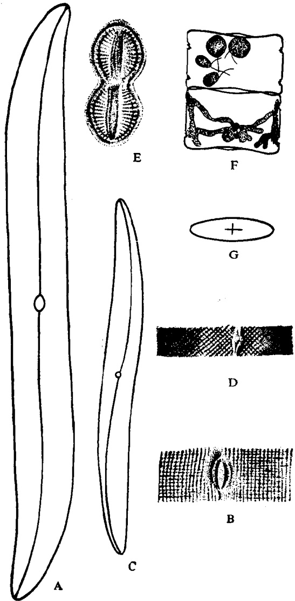

图 13 舟形藻科(仿金德祥等,1965)

A·B. 波罗的海布纹藻（Gyrosigma balticum）：A. 壳面观，B. 壳面部分放大；C-D. 美丽曲舟藻（Pleurosigma formosum）：C. 壳面观，D. 壳面部分放大；E. 蜂腰双壁藻（Diploneis bombus）；F-G. 膜状舟形藻（Navicula membranacea）：F. 壳环面观，示小孢子，G. 壳面观

---

## Page 55

8. 壳纹细点状 …… 侧节藻属（Stauroneis）

壳具粗而长的珠状纹 …… 粗纹藻属（Trachyneis）

9. 壳有肋纹 …… 羽纹藻属（Pinnularia）

壳有点纹 …… 舟形藻属（Navicula）

1）舟形藻属（Navicula Bory）壳面有直的纵沟和中节，没有船骨突。细胞三轴都是左右对称。每个细胞有色素体2—4个。舟形藻是硅藻中最大的1个属，包括近千种，但绝大多数营底栖生活，在海洋浮游生物中的种数及数量不多。

膜状舟形藻（Navicula membranacea Cleve,1897）（图13F—G）细胞由壳面连接成短、直的链。壳环面矩形，其四角略呈圆形。壳面梭形、扁平，其中部稍微凹入，并常有1个加厚的十字形中节。这是沿岸浮游广温性种类。我国东海产。

2）双壁藻属（Diploneis Ehrenb.）壳面椭圆形，或中部收缩，末端圆形。中节明显，常为方形，其四角硅质加厚而延伸到纵沟的两侧，并包住它，名为中节角（horn）。中节角的两侧有无纹沟（sulci 或 furrow），其间有的还包围了1列点纹。这属包括125种，在海产浮游生物中常见的有3种。

蜂腰双壁藻（Diploneis bombus Ehrenb., 1844) (图 13 E) 壳面中部有很深的收缩，使细胞分为两个等大或略不等的两部分。中节椭圆形至长方形，其四角略呈叉状射出。有很多条纵列无纹沟。本种为底栖种类，偶入浮游生物群。我国渤海、黄海和东海均有分布。

3）布纹藻属（Gyrosigma Hassall）细胞狭而扁，壳面“S”形。纵沟线在壳中线上，也呈“S”形。壳纹纵横排列。每个细胞有2个色素体。本属有59种。

波罗的海布纹藻 [Gyrosigma balticum (Ehrenb.) Cleve, 1894]（图 13 A—B）细胞直、长，末端钝圆。点条纹由纵横两种明显的点条组成，互相交叉成直角。中心区斜列。本种为海产，也出现于半咸水中。我国近海均有分布。

4）曲舟藻属（Pleurosigma W. Smith）壳面线形或箭形，但总是“S”形，纵沟也呈“S”形，在中线上或偏在一侧。点条纹

---

## Page 56

斜列和横列。中节常小而圆。壳环面狭，有时呈弓形、或扭转、或中部收缩。色素体2个，呈带状。本属共有124种。我国海洋浮游生物中已记录的有4种。

美丽曲舟藻 (Pleurosigma formosum W. Smith, 1852) (图 13 C—D) 细胞细长。 $ \underset{\cdot}{壳}\underset{\cdot}{面}\underset{\cdot}{的}\underset{\cdot}{斜}\underset{\cdot}{纹}\underset{\cdot}{交}\underset{\cdot}{叉}\underset{\cdot}{成} $ 90  $ \underset{\cdot}{度}\underset{\cdot}{角} $。这是我国近海很普通的一种曲舟藻，为底栖种类，但在浮游生物中也有少量出现。

### 2. 桥弯藻科 (Cymbellaceae)

壳面左右不对称，两壳各具1纵沟。本科包括3个属，即月形藻（Amphora）、内丝藻（Encyonema）和桥弯藻（Cymbella）。它们主要营底栖生活，偶而出现在浮游生物中。

1）月形藻属（Amphora Ehrenb.）壳面纵轴两侧不对称，较大的为背面，呈弧形凸起；较小的为腹面，常呈直线，其中部常呈弓形突起。壳面半月形。两纵沟在腹面，其间为狭的相连带，有时无花纹。相反的一面为宽的相连带，有纵条排列的点条纹。中节有时扩大成为侧节。本属共有253种，我国海产的只有1种。

牡蛎月形藻（Amphora ostearica Brebisson，1849）壳环面长卵形，末端平，两边直。相连带有许多横纹纵条。中节向两侧扩大，成为侧节。本种营底栖生活，有时在浮游生物中出现。我国东海有分布。

## (二) 等片藻目 (Diatomales)

细胞长形。花纹羽状排列。没有纵沟，不能行动，本目只有1科，但包括很多种类。

### 1. 等片藻科 (Diatomaceae)

特征同目。本科分为16个属。

## 等片藻科分属的检索表

1. 细胞内无隔片 ……2

细胞内有隔片 ……7

2. 细胞两端大小不同(少数例外)……星杆藻属（Asterionella）

细胞两端基本相似……3

3. 细胞棍形，直或稍弯。壳环面线形……4

---

## Page 57

细胞梭形或其它形。壳环面长方形 …… 5

4. 细胞两端略有大小不同……海毛藻属（Thalassiothrix）

细胞两端相似……海线藻属（Thalassionema）

5. 壳面蛾眉形……蛾眉藻属（Ceratoneis）

壳面梭形……6

6. 细胞连结成丝状或星状群体 …… 脆杆藻属（Fragilaria）

细胞单独生活…… 针杆藻属（Synedra）

7. 纵隔片波纹状……斑条藻属（Grammatophora）

无波纹状纵隔片……8

8. 细胞两端大小不同 ……9

细胞两端大小相同 ……10

9. 隔片只在粗大的一端……楔形藻属（Licmophora）隔片通达细胞的全部，隔片上有梯状大孔……梯楔藻属（Climacosphenia）

10. 壳面中部和两端都膨大……平板藻属（Tabellaria）

壳面长箭形或长卵形……条纹藻属（Striatella）

1）星杆藻属（Asterionella Hassall）细胞棒状，两端异形。细胞借助一端相连成螺旋状或星形群体。色素体多、呈板状或小颗粒状。本属为浮游性种类，已记录的有8种，其中3种在我国沿岸水域有分布。

日本星杆藻（Asterionella japonica Cleve，1878）（图14B） $ \underset{\cdot}{壳}\underset{\cdot}{环}\underset{\cdot}{面}\underset{\cdot}{的}\underset{\cdot}{近}\underset{\cdot}{端}\underset{\cdot}{呈}\underset{\cdot}{三}\underset{\cdot}{角}\underset{\cdot}{形} $。壳面较狭，呈长椭圆形，一端大，另一端细长。这是沿岸广温性种类，分布广，数量大。我国近海均有分布。

2）针杆藻属（Synedra Ehrenb.）细胞细长，单独生活或相连成射出状或扇状群体。壳面针形，壳环面长方形，有细纹。壳面中央常有方形或长方形的无纹区。有拟纵沟，伪中节和伪端节，但有时不明显。本属有81种，大多生活在淡水，而在海洋浮游生物中较少。我国已记录的有3种。

尺骨针杆藻 [Synedra ulna (Nitzsch) Ehrenb., 1878]（图14 A）壳面狭长，中部不扩大，末端呈鸭嘴形，中央有方形无纹区。这是淡水常见种，但在我国渤海、黄海和东海的沿岸水域中也常采到。

3) 海毛藻属 (Thalassothrix Cleve et Grunow) 细胞棒状，直或略弯；单个生活或借胶质相连成锯齿状或星状群体。壳环面

---

## Page 58

针形，两端形状不同。壳缘带有小刺。壳面条纹短。无纵沟、节间带和隔片。色素体大多为颗粒状。本属包括7种海生种类，我国已记录的有2种。

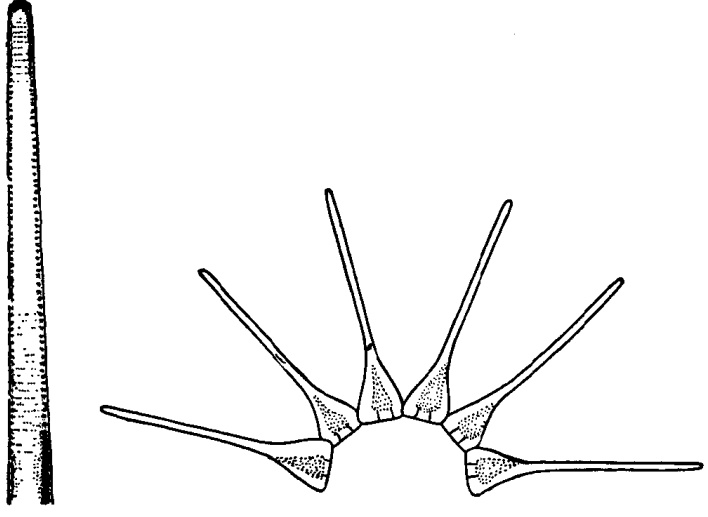

A

图 14 桥弯藻科、等片藻科 仿金德祥等，1965)

A. 尺骨针杆藻 (Synedra ulna); B. 日本星杆藻 (Asterionella japonica) 的群体

长海毛藻（Thalassiothrix longissima Cleve et Grunow, 1880）（图 15C—E）细胞很细长，略为弯曲。单个生活。壳面狭，呈披针形，两端略异形。本种为大洋性浮游种类。分布很广，我国近海也常见。

4) 海线藻属（Thalassionema Grunow）细胞棒状，相连成锯齿链。壳面两端圆形，等大。本属只有1种。

菱形海线藻（Thalassionema nitzschioides Grunow, 1880)（图15G—H）特征同属。这是世界种，我国近海常见。

5）楔形藻属（Licmophora Ag.）细胞楔形，内有假隔片。群体如扇，用胶质柄附着在藻类或其它物体上。本属有53种，在浮游生物中常见的仅1种。

---

## Page 59

短楔形藻(Licmophora abbreviata Ag., 1831)(图 15A—B)细胞三角形或扇形，常借助尖端附着于胶质柄上，而组成群体，节间带弯曲。隔片长，约占细胞的1/8至2/3。本种在沿岸水域营附着生活，但常混入浮游生物中。我国黄海、东海和南海均有分布。

6）斑条藻属（Grammatophora Ehrenb.）壳环面长方形，但四角为圆形，用胶质块相连成锯齿状或星形群体。每个细胞有2个节间带，有2个波状弯曲的假隔片：一端固定在相连带；另一端游离，游离端呈头状。壳面细线形或椭圆形，有时中部或两端突出，壳中央有很狭的拟纵沟，但不明显；有端节，无中节。本属都是海产，共42种，在我国浮游生物中有2种。

海斑条藻 [Grammatophora marina(Lyngbye) Kützing, 1844]（图 15 F）细胞长形，壳环面四角形，有两种假隔片：长隔片，在靠近基部有 1 个 $ \underset{\cdot}{明}\underset{\cdot}{显}\underset{\cdot}{曲}\underset{\cdot}{折} $；短隔片在壳套上。这是潮间带广温性种类，常附生在海藻上，有时混入浮游生物中。我国黄海、东海和南海均有分布。

## （三） 弯杆藻目（Achnanthales）

细胞的一个壳具有纵沟，另一壳只有拟纵沟。一般营固着生活，但也常出现在浮游生物中。本目包括曲壳藻科和卵形藻科2个科，前者壳的纵轴弯曲；后者则壳的横轴弯曲。

### 1. 曲壳藻科（Achnanthaceae）

细胞壳环面呈屈膝形。上、下壳形态不同，下壳有纵沟，上壳只有拟纵沟，壳面呈舟形，或长形。这一科包括3个属。

## 弯杆藻科分属的检索表

1. 细胞两端大小不同·细胞两端大小相同

2. 两壳的花纹相似……小型藻属（Microneis）

两壳的花纹不相似……曲壳藻属（Achnanthes）

1) 曲壳藻属（Achnanthes Bory）壳面和舟形藻相似；但上壳只有拟纵沟，无结节，下壳有纵沟和结节。壳环面呈屈膝形。单个生活或相连成带，或有胶质柄附着于他物上。本属为附着生物，

---

## Page 60

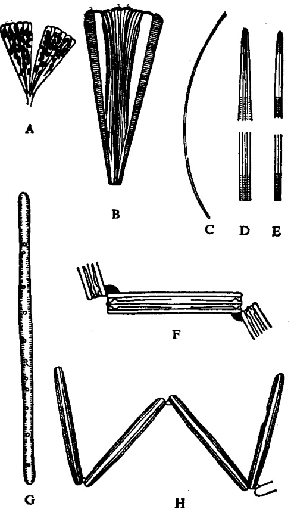

图 15 等片藻科 (A—B. 仿 Gran, 1905; C—H. 仿金德祥等, 196 A—B. 短楔形藻 (Licmophora abbreviata): A. 群体, B. 细胞壳环面; C—E. 长海毛藻 (Thalassiothrix longissima); F. 海斑条藻 (Grammatophora marina); G—H. 菱形海线藻 (Thalassionema nitzschioides): G. 壳面, H. 群体壳环面

共有 123 种。

短柄曲壳藻（Achnanthes brevipes Ag., 1824）(图 16A) 壳面呈舟形，两侧缢缩。点条纹略呈射出状。相连带具细的和横列的点条纹。细胞呈屈膝状，具胶质柄。本种分布于我国福建、台湾近海，是杂色蛤仔的饵料。

### 2. 卵形藻科 (Cocconeaceae)

---

## Page 61

细胞呈扁椭圆形，上、下壳异形。细胞在横轴处弯转。本科大多营附着生活，包括卵形藻和鞍形藻（Campyloneis）2个属，前者无隔片(或只限于边缘)，孔纹小；后者隔片扁平，达细胞内部，孔纹大。

1）卵形藻属（Cocconeis Ehrenb.）上壳具拟纵沟，下壳有纵沟和中节。没有节间带和隔片。色素体单个。本属共有146种，主要营附着生活，真正海洋浮游的种类极少，在我国海洋浮游生物中只发现2种。

盾形卵形藻（Cocconeis scutellum Ehrenb., 1878）（图16C）纵沟末端直。上壳中央区很狭， $ \underset{\cdot}{花}\underset{\cdot}{纹}\underset{\cdot}{呈}\underset{\cdot}{方}\underset{\cdot}{格}\underset{\cdot}{形} $， $ \underset{\cdot}{边}\underset{\cdot}{缘}\underset{\cdot}{每}\underset{\cdot}{小}\underset{\cdot}{格}\underset{\cdot}{又}\underset{\cdot}{分}\underset{\cdot}{为} $2格。下壳有分格的宽的边缘。点条纹从中央向四周射出，粗大，被纵列的无纹带所隔， $ \underset{\cdot}{也}\underset{\cdot}{成}\underset{\cdot}{为}\underset{\cdot}{小}\underset{\cdot}{方}\underset{\cdot}{格} $。中央有纵沟。这是分布广的潮间带种类，在我国近海浮游生物中也常见。

## （四） 褐指藻目（Phaeodactylales）

细胞卵形、梭形或三角形，只有卵形的细胞有一个和桥弯藻科相似的硅质壳面，缺少另一个壳面，也没有壳环带。本目只有1科，即褐指藻科。

### 1. 褐指藻科（Phaeodactylaceae）

特征同目。只有1属。

A

B

3

C

图 16 弯杆藻科、卵形藻科和褐指藻科(仿金德祥等,1965)

A. 短柄曲壳藻（Achnanthes brevipes）的群体和壳面；B. 三角褐指藻（Phaedactylum tricornutum）；1. 梭形细胞，2. 三叉形细胞，3. 卵形细胞； C. 盾形卵形藻（Cocconeis scutellum）的壳面

---

## Page 62

1）褐指藻属（Phaeodactylum Bohlin）特征同目。本属只有1种。

三角褐指藻 (Phaeodactylum tricornutum Bohlin, 1946) (图 16 B₁₋₃) 这是从梭形藻 (Nitzschia closterium f. minutissima) 的培养液中出现的。这种硅藻也被广泛作为培养对象，是实验生态学研究的良好材料，也是鱼、虾、贝类幼体的良好饵料，因此，在水产养殖业上占有相当重要位置。

## (五) 双菱藻目 (Surirellales)

细胞有管纵沟，每壳各有1条。有船骨突。一般，单独生活，有时也组成群体。这是底栖硅藻，但有些种类是真正浮游的。这一目分为3科。这里介绍2个科。

### 1. 菱形藻科 (Nitzschiaceae)

每壳有管纵沟 1 条，位于船骨突上。船骨突常在壳的一缘，而另一壳的船骨突则在另一缘。因此，细胞的断面为菱形。无节结。船骨突上有船骨点。本科的属数不多，但种类不少，包括一些常见种。

## 菱形藻科分属的检索表

1) 菱形藻属（Nitzschia Hassall）细胞菱形，单独生活，或成群体。壳缘有管纵沟。无中节。色素体一般2个。

居间鸾菱形藻（Nitzschia sigma v. intercedens Grunow，1878）(图 17D—E)细胞细长，弯曲呈“S”形。点条较细。海产，有时也出现于半咸水中。我国渤海和南海均有发现。

奇异菱形藻 [Nitzschia paradoxa (Gmelin) Grunow,

---

## Page 63

1880](图 17 B-C) 细胞棍形, 断面近方形, 彼此连接成一条滑动的带状群体。壳面的两端尖。这是沿岸性种类, 我国近海常见。

2）拟菱形藻属（Nitzschiella Rabh.）细胞细长，末端延长成嘴状。壳有离心的船骨点。

新月拟菱形藻 [Nitzschiella closterium (Ehrenb.) W. Smith, 1853]（图 17 F）细胞单个生活。壳面中央膨大，两端细长，向同方向弯曲成弓形。本种营潮间带底栖生活，但在浮游生物中也常见，而且已在实验室大量培养，为养殖动物幼体的良好饵料。

### 2. 双菱藻科 (Surirellaceae)

细胞单独生活。壳面卵圆形，一般左右对称，也有不很对称。细胞扁平或扭转，每壳有管纵沟1条，在壳缘的翼状船骨突上。由壳的一端绕壳缘经过另一端，而再回到原初的一端。因此，每壳虽只有1条管纵沟，但在壳的两侧都有。所以在断面上成为双菱形。壳面中线上有拟纵沟。壳面常有强肋纹。这科硅藻一般营底栖生活，但常混入浮游生物中。

## 双菱藻科分属的检索表

<table border=1 style='margin: auto; word-wrap: break-word;'><tr><td style='text-align: center; word-wrap: break-word;'>1. 细胞有胶质柄固着在其它藻类上。壳面楔形……足囊藻属（Podocystis）细胞无柄……2</td></tr><tr><td style='text-align: center; word-wrap: break-word;'>2. 壳面有块状起伏花纹……折盘藻属（Tryblioptychus）壳面没有起伏花纹……3</td></tr><tr><td style='text-align: center; word-wrap: break-word;'>3. 壳面有横波纹状……波缘藻属（Cymatopleura）壳面有肋纹……4</td></tr><tr><td style='text-align: center; word-wrap: break-word;'>4. 壳面扁平或螺状扭转……双菱藻属（Surirella）壳面不扁平……5</td></tr><tr><td style='text-align: center; word-wrap: break-word;'>5. 壳面弯曲或呈马鞍状……马鞍藻属（Campylodiscus）壳面呈长羽状……长羽藻属（Stenopterobia）</td></tr></table>

1) 双菱藻属（Surirella Turpin）壳环面细长形或楔形。壳面细长形、椭圆形或卵圆形，有时中部收缩。肋纹由中线射出，长短不等。肋内有点条纹。中央区线形或箭形，构造常不明显。壳缘常有突起，有波状翼的船骨突，其最边缘为管纵沟。色素体片状，2个。本属有287种，在我国浮游生物中仅发现3种。

---

## Page 64

芽形双菱藻（Surirella gemma Ehrenb., 1839)（图 17A）形似宽叶片，肋纹狭长，左右不对称。壳面左右不对称。本种为潮间带底栖种类，常漂入浮游生物中。我国黄海、东海均有分布。

2）马鞍藻属（Campylodiscus Ehrenb.）细胞单个生活，弯转成马鞍形。壳环轴直，而纵轴成弯转状。壳面中央有明显的拟纵沟。肋条短。色素体2个。本属为底栖沿岸种类，但常出现在浮游生物中。共有132种，在我国海洋浮游生物中仅发现3种。

布氏马鞍藻 (Campylodiscus brightwellii Grunow, 1862)

(图 17G) 壳面弯转而呈椭圆形。肋纹明显，近边缘部分较宽，近

图 17 菱形藻科和双菱藻科(仿金德祥等,1965)

A. 芽形双菱藻 (Surirella gemma); B—C. 奇异菱形藻 (Nitzschia var. adoxa); B. 群体, C. 单个细胞; D—E. 居间弯菱形藻 (N. sigma var. intercedens); D. 壳面, E. 壳面部分放大; F. 新月拟菱形藻 (Nitzschiella closterium); G. 布氏马鞍藻 (Campylodiscus brightwellii)

---

## Page 65

中央较狭。本种为底栖种类，但常混入浮游生物群中，在我国福建东山海区曾被发现。

## 第三节 生物学与经济意义

## 一、 生物学

## (一) 分布

硅藻在自然界的分布极广，可以说，任何潮湿和有水的地方都有硅藻的生长。就其生活习性而论，一般，海洋硅藻可分为底栖性和浮游性两大类。前者主要生活于潮间带，它们或借助纵沟而行动，或借助分泌胶质，或以柄附着于其它藻类及其它物体上。这些底栖种类大都分布在沿岸水域，常由于风浪的打动，而混入浮游生物中，但不能繁殖。浮游硅藻包括全部或部分生活时间浮游于光照层中的种类。它们的分布，不论在空间上或时间上，其数量都处在变动之中，而这种变动是和内、外环境因子的变化密切相关的。浮游硅藻的平面分布显然与水温、盐度有关，如南极海链藻(Thalassiosira antarctica)和透明海链藻(Th. hyalina)是狭温性的环极种(circumpolar species)，仅分布于南极海或北冰洋的种类。它们的适温范围为 $ -1.35 \sim +9^{\circ}C $，如水温高于 $ 5^{\circ}C $就不能生长繁殖(Smayda，1958)。此外，南极种还有：Chaetoceros criophilus，Ch. neglectus，Eucampia balaustium；北极种还有：Bacteriastrum fragilis，Fragilaria oceanica，Navicula vanhoeffeni等。又如太阳漂浮藻、平滑角毛藻(Chaetoceros laevis)、膜质半管藻(Hemiaulus membranaceus)和粗根管藻是适应高温、高盐的环热带种(circum-tropical species)，前一种虽有时会被暖流带入温带水域，生活一段时间，但在 $ 10 \sim 15^{\circ}C $以下的环境中不能生长、繁殖，故应属于热带性广温种。有些硅藻是广温、广盐性的，如菱形海线藻、扁面角毛藻、丹麦细柱藻、骨条藻等，是属于世界种(cosmopolitan species)。这些种类常分布在沿岸水域。此外，有些种类如异常角毛藻(Chaetoceros abnormis)等是河口种，能适应盐度的剧烈变化，可作为半咸水指

---

## Page 66

示种。在温带水域，由于温度、光度、营养盐等因素的周年和季节变化较大，其种类组成也发生较大变化，这反映在浮游硅藻的季节演替上。据 Sverdrup（1942）等研究，在美国东岸缅因湾硅藻的季节演替是：4月（3℃）主要硅藻为诺氏海链藻（Thalassiosira nordenskioldii）、Chaetoceros diadema；5月（6℃）是柔弱角毛藻（Chaetoceros debilis）；6月（9℃）是扁形角毛藻（Chaetoceros compressus）；8月（12℃）是缢缩角毛藻（Chaetoceros constrictus）、绕孢角毛藻（Ch. cinctus）、骨条藻（Skeletonema costatum）等。这些变化显然与水温、营养盐（氮、磷等）的季节变化有密切关系，因每种硅藻的适温范围及所需营养盐的质和量都不相同。换言之，每种硅藻出现在水温、营养盐等环境因子对它生长、繁殖最适宜的季节里。

## (二) 色素

硅藻通过色素(主要是叶绿素)进行光合作用。它吸收太阳能及水中的无机盐类和二氧化碳，转化为碳水化合物和氧气，由此而产生的有机物(初级生产力)是海洋食物链的第一环节，也是海洋生产力的基础。

中心纲硅藻具有许多细小的色素体，但在羽纹纲硅藻色素体减少，通常仅有2个，较大的呈叶状。硅藻由于含有丰富的胡萝卜素和硅黄藻素，所以，硅藻常呈褐色。硅藻的色素还含有：叶绿素a、c₁、c₂，以及胡萝卜素、硅甲黄素和墨角藻黄素等。这些色素在光合作用过程中所产生的碳水化合物是多糖（polysaccharide）、黄藻昆布多糖（chrysolaminarin）[类似昆布多糖，但分子式缺少甘露醇（mannitol）]（Lewis and Guillard,1963; Morris,1967）。此外，硅藻的光合作用也产生脂类（lipid），这种油球在硅藻细胞内十分显著，特别在缺氧的培养液中更加显著（Raymont,1980）。

一般，硅藻的叶绿素 a 比叶绿素  $ c_{1} $、 $ c_{2} $ 多。据 Jeffrey (1972) 研究，几种海洋硅藻叶绿素 a、 $ c_{1} $、 $ c_{2} $ 的比例随种而异。

## (三) 繁殖

硅藻的繁殖有营养繁殖(无性)、有性繁殖等多种方式，其中以

---

## Page 67

营养繁殖最为普遍。兹分别简述如下：

### 1. 营养繁殖（vegetative reproduction）

硅藻最常见的繁殖方式是营养细胞的分裂，这是间接分裂，即有丝分裂。在临分裂之前，相连带拉得长些，在细胞核分裂完毕以后，两核就靠近中央，然后在两核之间产生2个下壳，从而出现壳面，并产生相连带。初生的新壳，细胞壁很薄，尔后逐渐加厚，直至与母壳厚度相等，最后长出刺和毛，形成两个完整细胞（图18）。在细胞分裂过程中，细胞的大小和相连带的长短都产生了变化，其特点是：

1）细胞的大小 硅藻分裂后的两个子细胞，各得母细胞的一个壳作为上壳，新生成的壳在里面成为下壳。因此，每分裂一次就有一个子细胞比母细胞小，如此连续分裂下去，后代细胞就有逐渐减小的趋势。它们的大小正符合数学二项式定理，如 A、B、C……代表细胞的大小的顺序，其数量分布如下表所示：

<table border=1 style='margin: auto; word-wrap: break-word;'><tr><td style='text-align: center; word-wrap: break-word;'></td><td style='text-align: center; word-wrap: break-word;'>A</td><td style='text-align: center; word-wrap: break-word;'>B</td><td style='text-align: center; word-wrap: break-word;'>C</td><td style='text-align: center; word-wrap: break-word;'>D</td><td style='text-align: center; word-wrap: break-word;'>E</td><td style='text-align: center; word-wrap: break-word;'>F</td><td style='text-align: center; word-wrap: break-word;'>G……</td></tr><tr><td style='text-align: center; word-wrap: break-word;'>母细胞</td><td style='text-align: center; word-wrap: break-word;'>1</td><td style='text-align: center; word-wrap: break-word;'>—</td><td style='text-align: center; word-wrap: break-word;'>—</td><td style='text-align: center; word-wrap: break-word;'>—</td><td style='text-align: center; word-wrap: break-word;'>—</td><td style='text-align: center; word-wrap: break-word;'>—</td><td style='text-align: center; word-wrap: break-word;'>—</td></tr><tr><td style='text-align: center; word-wrap: break-word;'>第一代</td><td style='text-align: center; word-wrap: break-word;'>1</td><td style='text-align: center; word-wrap: break-word;'>1</td><td style='text-align: center; word-wrap: break-word;'>—</td><td style='text-align: center; word-wrap: break-word;'>—</td><td style='text-align: center; word-wrap: break-word;'>—</td><td style='text-align: center; word-wrap: break-word;'>—</td><td style='text-align: center; word-wrap: break-word;'>—</td></tr><tr><td style='text-align: center; word-wrap: break-word;'>第二代</td><td style='text-align: center; word-wrap: break-word;'>1</td><td style='text-align: center; word-wrap: break-word;'>2</td><td style='text-align: center; word-wrap: break-word;'>1</td><td style='text-align: center; word-wrap: break-word;'>—</td><td style='text-align: center; word-wrap: break-word;'>—</td><td style='text-align: center; word-wrap: break-word;'>—</td><td style='text-align: center; word-wrap: break-word;'>—</td></tr><tr><td style='text-align: center; word-wrap: break-word;'>第三代</td><td style='text-align: center; word-wrap: break-word;'>1</td><td style='text-align: center; word-wrap: break-word;'>3</td><td style='text-align: center; word-wrap: break-word;'>3</td><td style='text-align: center; word-wrap: break-word;'>1</td><td style='text-align: center; word-wrap: break-word;'>—</td><td style='text-align: center; word-wrap: break-word;'>—</td><td style='text-align: center; word-wrap: break-word;'>—</td></tr><tr><td style='text-align: center; word-wrap: break-word;'>第四代</td><td style='text-align: center; word-wrap: break-word;'>1</td><td style='text-align: center; word-wrap: break-word;'>4</td><td style='text-align: center; word-wrap: break-word;'>6</td><td style='text-align: center; word-wrap: break-word;'>4</td><td style='text-align: center; word-wrap: break-word;'>1</td><td style='text-align: center; word-wrap: break-word;'>—</td><td style='text-align: center; word-wrap: break-word;'>—</td></tr><tr><td style='text-align: center; word-wrap: break-word;'>第五代</td><td style='text-align: center; word-wrap: break-word;'>1</td><td style='text-align: center; word-wrap: break-word;'>5</td><td style='text-align: center; word-wrap: break-word;'>10</td><td style='text-align: center; word-wrap: break-word;'>10</td><td style='text-align: center; word-wrap: break-word;'>5</td><td style='text-align: center; word-wrap: break-word;'>1</td><td style='text-align: center; word-wrap: break-word;'>—</td></tr><tr><td style='text-align: center; word-wrap: break-word;'>第六代</td><td style='text-align: center; word-wrap: break-word;'>1</td><td style='text-align: center; word-wrap: break-word;'>6</td><td style='text-align: center; word-wrap: break-word;'>15</td><td style='text-align: center; word-wrap: break-word;'>20</td><td style='text-align: center; word-wrap: break-word;'>15</td><td style='text-align: center; word-wrap: break-word;'>6</td><td style='text-align: center; word-wrap: break-word;'>1</td></tr></table>

因此,可以在一定时间内,从计算缩小的数字来测定硅藻繁殖的速度。

在链状群体情况下，即可以从链上观察上、下壳的位置和大小，因为上壳总是在链的两端。兹以 e 代表上壳，h 代表下壳，它们的关系如下：

---

## Page 68

同一种硅藻，细胞的大小，一般相差在 2—3 倍以下，但也有达 7 倍左右的。

2）相连带的长短 相连带在细胞分裂前后的长短不同，尤其是在中心硅藻更为明显。相连带的长短直接与壳环面的高度（壳环轴长度）和宽度（壳面纵轴）比例相关。

间接分裂一般在夜间进行，但也有在白天进行的。在环境良好条件下，个别种类能在每小时内分裂一次。色素体在细胞分裂

图 18 硅藻的细胞分裂(仿各作家)

A—E. Surirella capronii；A. 分裂前，B. 分裂开始，C. 细胞核分裂，D. 分裂完毕，E. 产生新壳；F—J. 细胞两均分裂；F—G. Coscinodiscus jonesianus，H—J. Biddulphia pulchella；K—M. Ditylum；K. 母细胞，L. 细胞分裂，M. 子细胞

---

## Page 69

后，每个子细胞各得一半，然后随着分裂而增多。分裂方法有纵横两种。

### 2. 复大孢子 (auxospore)

当细胞经过多次的分裂缩小到一定程度时，将不能继续生存。复大孢子的繁殖就是细胞恢复原形的一种方式。但应该指出的是，复大孢子也不是只限于小型细胞才能形成，就是相当大的细胞也常会形成复大孢子。这是在温度、光照以及营养条件改变时进行的。复大孢子的形成有无性和有性两种方式：

1）无性方式 这种方式是营养细胞直接膨大而成的。例如，中心纲的变异直链藻（Melosira varians）产生复大孢子时，首先是上下两壳互相分开，中间露出的原生质膨大而近似球形，其大

图 19 硅藻的复大孢子(一)(仿各作家)

A. 变异直链藻（Melosira varians）的复大孢子；B—D. 长角合形藻（Biddulphia mobilensis）的复大孢子；E. 爱氏角毛藻（Chaetoceros eibenii）的复大孢子

---

## Page 70

小比母细胞大得多。复大孢子的细胞核先在上壳的一端，等上壳长成后，细胞核移向另一极，接着分泌下壳。初生的复大孢子有细胞膜包围着，有的在产生上壳后就脱离，有的待上、下壳完全长成后才能脱离群体（图 19A—D）。又如爱氏角毛藻（Chaetoceros ibeni）复大孢子产生于细胞的侧面，复大孢子的长轴和群体轴适成直角（图 19E）。

2）有性方式 通过这个方式形成的复大孢子是经过接合作用，借助于运动或分泌胶质使个体接近，然后被包围于共同的胶质膜内，进行接合。兹将四种类型分述如下：

(1) 接合的两个细胞各产生 2 个配子（图 20B—F）。当形成配子时，核先进行减数分裂，然后原生质与壳面垂直分裂成两半，形成两个配子，各有 2 个核，其中一个后来消失。由不同细胞产生的配子，两两结合形成 2 个接合子，最后接合子与母体向垂直方向延长，而成为 2 个复大孢子。

(2) 接合的两细胞各产生 1 个配子，接合后只产生 1 个复大孢子（图 20G—J）。有些是同配生殖（isogamy），有些是异配生殖（anisogamy）——配子有大小区别，小配子进入另一个细胞内与大配子接合。

(3) 单性生殖：两个细胞相互接近后，各个细胞内的两个单倍核相互结合，而形成复大孢子。这种生殖方式也称自配生殖(autogamy)。

（4）卵生生殖：这是硅藻有性繁殖的最高形式，由卵子和精子受精后的接合子形成复大孢子。骨条藻的有性生殖就是一例（Migita，1967）。当细胞直径为5—6微米时，如果增强温度和光照，将促使有性生殖的发生。骨条藻精子是在减数分裂后产生的，每个精原细胞形成4个无色的单鞭的精子；每个卵原细胞（oogonium）只产生1个卵子，卵子受精后的接合子就形成1个复大孢子，然后复大孢子再进行营养细胞分裂（图21）。

硅藻进行有性生殖的原因不仅与细胞大小有关，而且与温度、光照以及营养条件等的影响有关。例如，星脐圆筛藻在较高的温

---

## Page 71

A

G

H

图 20 硅藻的复大孢子(二)(仿各作家)

A. 掌状冠盖藻 (Stephanopyxis palmeriana) 的结合子膨大成复大孢子；B—F. 隆起棒杆藻 (Rhopalodia gibba) 复大孢子的形成过程 (两个细胞接合后，产生两个复大孢子)；G—J. 圆卵形藻 (Cocconeis placentula) 复大孢子的形成过程 (两个细胞接合，只产生一个复大孢子)

度和较强的光照条件下，诱导24小时后，立即出现精子囊形成（Weruer，1971）；又如掌状冠盖藻（Stephanopyxis palmeriana）从15℃和400 lux光照，移到21℃和3000—5000 lux的光照下，就会诱导配子产生（Stosch et Dredes，1964）。此外，据Steele（1965）观察结果，布氏双尾藻在培养基中，如果缺少锰时，就会产生卵和精子。有些种类如梅尼小环藻（Cyclotella meneghimana），由于钠浓度的增加，也会引起复大孢子的产生（Schulter et Trainor，1968）。

### 3. 休眠孢子（resting spore）

中心纲的许多硅藻可以产生休眠孢子，特别是浮游性的沿岸种类，产生休眠孢子的较多，而在羽纹硅藻，却还没发现过。一般，休眠孢子是细胞内含物收缩到中央部分，然后分泌厚壁而形成的，有单个的或成对的，也有4个一列的。例如，在角毛藻属，休眠孢

---

## Page 72

图 21 骨条藻(Skeletonema costatum) 的生殖(仿 Migita, 1967)

A-I. 精子的形成： A. 精原细胞的形成，B-C. 精原细胞产生，D-E.

精子形成，F-I. 精子的释放过程；J-O. 卵的受精和复大孢子的形成；

J. 伸长的卵细胞，K. 受精，L-M. 结合子的发育，N. 复大孢子的生长，

O. 复大孢子的分裂

---

## Page 73

子具两瓣厚壁，没有壳环，只有壳衣互相套合。上壳面常具特殊小刺、突起分叉的刺、或粗短的刺毛，其数量随种类而异；下壳面大都平滑，也有生小刺的(图 22)。这种休眠孢子，待环境条件适宜时，则以萌芽的方式，再生长发育起来。导致休眠孢子形成的原因主要有水温过高，或太低、光照不足、以及营养盐类缺乏等不良环境而产生的。这种繁殖方法对于维持种族的生存，地理分布和渡过不利的环境具有重要的生态意义。

## 二、 经济意义

## (一) 有益方面

A

B

C

D

E

F

图 22 硅藻的休眠孢子(仿各作家)

A. 冕孢角毛藻 (Chaetoceros subsecundus); B. 僧帽状角毛藻 (C. mitra); C. 链刺角毛藻 (C. seiracanthus); D. 范氏角毛藻 (C. vanheurcki); E. 窄隙角毛藻 (C. affinis); F. 柔裾角毛藻 (C. debilis)

1. 硅藻是鱼、贝、虾类，特别是它们幼体的主要饵料

硅藻是海洋有机物的主要生产者之一，它和其它植物一起，构

---

## Page 74

成海洋初级产量。硅藻是一切海洋动物的直接或间接饵料。例如，在我国沿海四大贝类(牡蛎、蛏、蛤、蚶)的饵料中，硅藻占着首要地位；浮游甲壳动物如桡足类、磷虾类、樱虾类，以及对虾和其它经济虾类的幼体等，都以硅藻为主要摄食对象。例如，在中国毛虾的全年食料中，硅藻占54%。在鱼类方面，如鲱鱼、沙丁鱼等幼鱼的主要饵料也是硅藻。因此，海洋经济动物产量(渔获量)的高低与硅藻的产量密切相关。为了发展养殖业，我们必须大量培养硅藻来促进经济海产动物的生长、繁殖，从而提高它们的产量。

### 2. 有些硅藻可作为海洋捕捞业的指标

由于许多经济海产动物，特别是幼体，以硅藻为摄食对象，所以，这些饵料的数量分布将会影响经济动物的分布，特别是渔场的形成和浮游植物的产量密切相关。例如，在大洋脆杆藻（Fragilaria oceanica）的密集区捕捞沙丁鱼，可提高渔获量。又如，在星脐圆筛藻密集区捕捞中国毛虾，也同样可获得增产。

### 3. 硅藻是形成海底生物性沉积物的重要组成部分

硅藻死亡后的硅质外壳，大量沉积在海底，形成硅藻软泥(diatom ooze)，这种软泥在寒带海中最多，其沉积层最厚可达200米。据海相沉积分析结果，硅藻土含有83.2%的氧化硅。它在工业上用途很广，可以作为建筑、磨光等材料，过滤剂，化学方面的吸着剂，造纸、橡胶、化妆品和涂料等的填充剂，以及保温材料等；同时，硅藻土对地层的历史及古海洋环境的研究也提供重要资料。

4. 硅藻可作为法医的检验手段之一，根据溺死者肺、胃的硅藻含量的检查，可以判别是溺死或他杀后弃置于水池之中，成为法医判断死因的佐证。

## 三、 有害方面

海洋环境，如果受到富营养污染或其它原因，常使某些硅藻如骨条藻、楔形藻、盒形藻、角毛藻、根管藻等繁殖过盛，形成赤潮，使水质恶劣，对渔业及其它水产动物带来严重危害。

海洋污染物质，包括碳氢化合物、有害重金属、有机氯，以及放射性物质等，经过硅藻的吸附、吸收而积累，又经过海洋食物网的

---

## Page 75

传递、扩大，会损害海洋生物资源的开发利用，并对人类健康带来危害。

有些硅藻(如根管藻等)繁殖太盛并密集在一起，可阻碍或改变鲱鱼的洄游路线，使捕获量降低。这对渔业是有害的。

由此可见，硅藻在理论上和实践上都具有十分重要的意义。

---

## Page 76

## 第二章 甲藻类

甲藻类是海洋浮游藻类的重要组成之一，隶属于真核生物的甲藻门（Pyrrhophyta）。甲藻具有叶绿素 a、c、 $ \beta $-胡萝卜素和叶黄素（以多甲藻素占优势），故细胞呈黄绿色以至金黄褐色，其同化产物为淀粉和酯类。细胞壁为纤维素，或粘质状物质构成。鞭毛2条，等长或略不等长，是运动胞器，其中，一条环绕着横沟，另一条从纵沟伸向体后，因此，甲藻通常又被称为双鞭毛虫（Dinoflagellate）。大多数甲藻是营浮游生活，但也有少数种类为不动类型——细胞呈丝状（如 Dinothrix）或变形虫状（如 Dinamoebidum）。此外，还包括一些寄生、腐生和共生的种类。

甲藻在海洋，淡水都有广泛分布。一般，热带种类多，寒带种类少，但数量以后者较大。外海种类大多为裸体的甲藻，而沿岸种类大多具由甲板组成的外壳。甲藻为小型海洋浮游动物（包括仔、稚鱼）的重要饵料，其产量可作为海洋生产力的指标之一。但是，有些种类的过度繁殖，会形成赤潮，危害渔业。因此，这类浮游植物与海洋学、渔业都有密切关系。

## 第一节 形态特征

甲藻大多为游动的单细胞藻类，体呈球形、针形，或分枝状。细胞背腹扁平(如多甲藻目)，或左右侧扁(如甲藻目)，其前后端常有角状突起(如角藻属)，有些种类的突起呈翅状[如翅甲藻(Dinophysis)]。此外，有些种类(如角藻属)的少数细胞连结成群体。总之，甲藻的形状是多种多样的。

## 一、 细胞壁

甲藻的细胞表面有一层由原生质所分泌的相当坚实的表质膜(amphiesma)。这个表质膜系由几层膜所组成的，如角藻属的细胞

---

## Page 77

图 23 甲藻的一般构造(仿各作家)

A. 分叉多甲藻（Peridinium divergens）的液泡系；B. (Nematodinium armatum) 的感觉器及刺丝泡；C. 多甲藻目（Peridionales）的外部和内部构造模式图；D. 甲藻横沟的螺旋方式：D. 左旋(下旋)，E. 右旋(上旋)

壁具4层明显的膜：一层内部的片状物、一层壳膜、一层外部的板膜和一层细胞膜(Wetherbee,1975)。有些不具外壳的裸体种类(如环沟藻亚目)，细胞壁只有薄板，而有些具壳的种类，则有复杂的壳板，但壳板数随种类而异，如原甲藻属的壳是由2块板组成的(图24)，有的种类如翅甲藻目(Dinophysiales)的壳板多达18块。这

---

## Page 78

些壳板具有刺、脊、网纹或具穿通的小孔；壳板的边缘稍为倾斜，并相互覆盖；壳板相接的边缘易于扩展，而使细胞增大。在横裂甲藻亚纲的大多数种类，壳板以横沟分成上壳与下壳；在细胞腹面的横沟下面，另有1条纵沟。所有上壳、下壳、横沟及纵沟都由小板组成(图23)。这些小板的形状、数目和排列方式随属、种而异，是具外壳甲藻分类的重要依据。

## 二、 鞭毛

活动的甲藻均有 2 条鞭毛，鞭毛的构造及运动方式随种类而异。在横裂甲藻类，鞭毛着生于腹面，自横沟及纵沟相交处的鞭毛孔伸出 1 条横鞭（transverse flagellum），它是由成排的细长毛构成的，呈带状，环绕于横沟内，作波状运动，使细胞旋转；另一条为纵鞭（longitudinal flagellum），呈线状，从纵沟伸向体后，作鞭状运动，使细胞前进。因此，甲藻的运动为旋转式的前进。纵裂甲藻类的鞭毛着生于细胞的前端。

## 三、 色素体

除了全动营养（holozoic）种类，如 Dinamoebidium、夜光藻（Noctiluca）和寄生的种类，如 Blastodinium 等没有叶绿体以外，大多数甲藻均有叶绿体。一般，纵裂甲藻类的叶绿体少，常呈片状；而横裂甲藻类的叶绿体小而多。所以，甲藻细胞常呈黄绿色或棕黄色，许多暖海种类常呈黄色或粉红色。叶绿体除了含有叶绿素 a、c 和  $ \beta $-胡萝卜素外，还含有棕红色的甲藻素（phycopyrin）、暗红色的多甲藻素（peridinin）和黄绿色的绿色素（chlorophyllin）等副色素。在不同种的甲藻细胞内，墨角藻黄素（fucoxanthin）的含量有相当大的差异，例如，海洋原甲藻（Prorocentrum micans）以多甲藻素为主，没有墨角藻黄素，而裸甲藻（Gymnodinium veneficum）恰与前种相反。这些叶绿体，在光照条件下，进行光合作用，产生淀粉和脂类；海生种类的细胞内常含有黄色或红色的油滴。有些无色的种类（如夜光藻）进行动物性营养，故能消化固体的食物。

## 四、 细胞核

甲藻有 1 个大而明显的细胞核（图 23B,C），一般有核膜，但有

---

## Page 79

这些种类如双甲藻，核膜不明显；核内含有DNA，而没有组蛋白。核仁有1至数个。染色质呈环状，一边附于核膜。细胞分裂时，一般核仁先消失，染色质联合成细长的染色体，在分裂过程中不产生明显的纺锤丝。

## 五、 细胞器

甲藻含有如下一些细胞器：

## (一) 液泡 (pusule)

在许多甲藻中，细胞内有1个较大的囊状构造，称甲藻液泡，它类似伸缩泡，但却无伸缩活动。据Dodge(1972)观察40种甲藻的结果，认为这是由1组小泡系统所构成的，位于鞭毛插入之处，不是一种排泄器，而是具有调节渗透作用的能力。甲藻液泡内含有红色或赭红色的液体。Morris（1966）认为，这种液泡对甲藻的漂浮能力起着重要的作用(图23A、C)。

## (二) 眼点

有些海生种类(如 Nematodinium)，在细胞后端具有1个特殊的感光器，乃由1个或1组反光的晶体，部分或全部包埋于一团色素内组成的。

## (三) 丝泡 (trichocyst)

在甲藻中，有 2 个属 [Nematodinium 属和多沟藻属 (Polykrikos)] 具有丝泡。丝泡是由高尔基体的小泡产生的，释放出来的刺丝呈棒状，构造与蛋白质类似。

## 第二节 分 类

甲藻门只有 1 纲，即双鞭甲藻纲（Dinophyceae）*。根据生活习性和鞭毛的位置，分为 3 个亚纲，即纵裂甲藻亚纲（Desmokontae）或称半甲藻亚纲（Haplodinophycidae）——具 2 条顶生的鞭毛；横裂甲藻亚纲（Dinokontae）或称双鞭甲藻亚纲（Dinophycidae）——具 2 条腹生的鞭毛；囊甲藻亚纲（Blastodinophycidae）——是营寄生生

---

## Page 80

活的,在形态上发生了变化。

甲藻有多种亚显微结构。细胞核有核膜包围着，这是与真核生物的共同点。但是，细胞核无组蛋白，染色质成环状，其性质与原核生物相类似，所以甲藻应属于介核生物（Mesokaryote）（Dodge，1966）。这种类型是属于原核生物向真核生物进化的中介型。

## 一、 纵裂甲藻亚纲

单细胞生物，细胞壁由左右两壳瓣组成。细胞前端生出2条鞭毛。本亚纲大多数为海产。

## (一) 纵裂甲藻目 (Desmonadales)

细胞壁纵分为两半，但纵裂线不明显。鞭毛呈带状，着生于细胞前端，一条伸向前方，另一条螺旋环绕于细胞前端。本目只有纵裂甲藻科、纵裂甲藻属，其特征同目。主要代表为：

啮蚀纵裂甲藻（Pleromona erosa Pascher，1914）（图 24 A—B）细胞呈卵形。纤维素的细胞壁很薄，分成左右不等的两瓣。细胞前端略凹入，2 条带状鞭毛由此生出。细胞含有 1 个大的色素体，体内含有 2 个造粉核。生殖为纵分裂法。

## (二) 原甲藻目 (Procorcentales)

A

B

C

D

图 24 纵裂甲藻目和原甲藻目的种类 (A—B. 仿 Shiller, 1933, C—E. 仿 Labour, 1925)

A—B. 啮蚀纵裂甲藻 (Pleromonas erosa): A. 细胞构造，B. 细胞壁；C—D. 海洋原甲藻 (Protocentrum micans): C. 侧面观，D. 背面观

---

## Page 81

细胞壁有 1 条明显的纵裂线，将细胞分成左右两半。本目只有 1 个科，即原甲藻科（Prorocentraceae），特征同目。

1）原甲藻属（Prorocentrum Ehrenb.）细胞呈卵形或略似心形，后端尖，前端或中部略宽，左右侧扁；壳自中央分成左右相等的两瓣。鞭毛2条，自细胞前端两半壳之间伸出。在鞭毛孔旁的两半壳之间，有1个空心或实心的齿状突起。壳面有孔状纹。色素体2个，侧生，呈片状，或粒状。在鞭毛基部有1个细胞核或1—2个液泡。本属是海产。

海洋原甲藻（Prorocentrum micans Ehrenb., 1835)（图24C—D）细胞侧扁，呈瓜子形，长度约为50微米。本种分布较广，我国近海产，是牡蛎和幼鱼的饵料。当大量繁殖时，可形成赤潮。这是太平洋东岸形成赤潮的主要种类之一。

## 二、 横裂甲藻亚纲

细胞表面有1层薄的纤维质膜，或具由多块小板构成的外壳。壳面有1条纵沟和1条或更多条的横沟。有纵沟的一面称为腹面；横沟将细胞分为上壳(或称前体部)和下壳(后体部)。除极少数例外，横沟都能环绕细胞一周。大多数种类的横沟常呈螺旋状，左面的横沟更靠近细胞前端的叫“下旋”或称“左旋”(图23D)，如所有裸体的无壳种类及多数较原始的种类都属于这个类型。相反的，右面的横沟更靠近细胞前端的叫“上旋”或称“右旋”(图23E)。2根鞭毛分别着生于纵、横沟相交点的附近，也有些种类的鞭毛是从一个鞭毛孔生出来。带状横鞭自鞭毛孔伸出后，向左经过背面到达右方，环绕于横沟内；丝状纵鞭从纵沟伸出体外。

本亚纲分为以下5个目：

多甲藻目（Peridinales）能动的细胞类型

变形甲藻目（Dinamoebidiales） 根足类型

球甲藻目（Dinococcales）无胶被的圆球类型

胶甲藻目（Gloeodiniales）有胶被的圆球类型

丝甲藻目（Dinotrichales）丝状类型

在上述 5 个目中，以多甲藻目最为重要。它们的种类多，分布

---

## Page 82

广，是甲藻门中最重要的1个目，其它目的种类很少。多甲藻目可分为3个亚目：裸甲藻亚目、翅甲藻亚目和多甲藻亚目（Fott，1971）。兹分别简述如下：

## (一) 裸甲藻亚目 (Gymnodiniinae)

大多为单细胞，少数为群体。细胞裸露，无甲板或有固定形的表质膜。有横沟和纵沟，前者呈环状或螺旋状。色素体有时缺如。多数种类营海洋浮游生活。本亚目包括6个科。

### 1. 裸甲藻科（Gymnodiniaceae）

横沟位于细胞中央或靠近前端。纵沟略延伸到上锥部（epi-cone）。

1）裸甲藻属（Gymnodinium Stein）细胞侧扁，圆形或椭圆形，表质膜上无纹或有条状纹。横沟在细胞中部略下旋。纵鞭长，向右端伸出。色素体多，呈盘状或棒状，侧生或放射排列，为金褐色、绿色，也有蓝绿色或蓝色。细胞核1个，在细胞中央或下锥部（hypocone）。

蓝色裸甲藻（Gymnodinium coeruleum Doyiel,1906）（图25B）细胞较大，呈长圆锥状，长度120微米，宽度60微米。横沟左旋；纵沟达上锥部顶端。表质膜有纵列条纹。这是形成赤潮的种类之一。

### 2. 夜光藻科 (Noctilucaceae)

细胞圆，呈囊状，没有外壳，具有1条能动的触手。幼体类似环沟藻，成长后横沟及鞭毛均不明显。本科只有夜光藻属（Noctiluca Suriray），特征同科。

夜光藻 [Noctiluca scientillans (Macartney 1810) Kofoid et Swezy, 1921]*（图 25A）细胞很大，直径可达 2 毫米，呈圆球状。成体横沟不明显，仅在腹面留下一点痕迹。纵沟与口沟相通，末端生出 1 条触手。2 条鞭毛均退化。细胞中央有 1 大

---

## Page 83

液泡。生殖时产生的游孢子有横沟、触手和1条鞭毛。细胞无色或绿色，有时中央为黄色；当夜光藻大量密集时则呈粉红色。它具发光能力，海上发光现象常由它受到刺激而引起。如果繁殖过盛并密集在一起，可形成赤潮，对渔业危害很大，这是亚热带和热带海区发生赤潮的主要生物之一。夜光藻是沿岸表层种类，分布很广，几遍及世界各海（寒带海除外）。在我国整个近海可以大量采到，而在河口附近水域的产量更高。

图 25 裸甲藻亚目（A. 仿 Fott，1971；B. 仿小久保清治，1965） A. 夜光藻 (Noctiluca scientillans); B. 蓝色裸甲藻 (Gymnodinium coeruleum)

## (二) 翅甲藻亚目 (Dinophysidineae)

细胞左右侧扁，有与长轴平行的纵裂线，将细胞分成左右两瓣。横沟明显，靠近细胞前部，因而上锥部小，下锥部大。纵沟短，与纵裂线相重合。邻接横沟与纵沟的各块甲板都有翼状的边翅。在有些种类，其纵沟一侧的边翅很发达，一直延伸到细胞后端，并有着支撑作用的肋刺。细胞壁由17块甲板组成，按照甲板的部位分为4组（图26A—B）：上壳5片、下壳4片、横沟4片、腹区4片。甲板上有明显的网状花纹。本目包括2个科，主要分布于热带海区。

---

## Page 84

### 1. 翅甲藻科 (Dinophysiaceae)

细胞左右侧扁，呈卵圆形，或后端有不规则突起。横沟及纵沟均有发达的边翅。

1）翅甲藻属（Dirophysis Ehrenb.）（图 26 A—B）细胞横沟的边翅斜伸向前，成漏斗形。壳面有孔纹。色素体黄绿色。约有 50 种。

具尾翅甲藻（Dinophysis caudata Kent, 1882)（图 26C—D）细胞后端形状不规则。我国南海及东海均有分布。

## (三) 多甲藻亚目 (Peridiniinae)

单细胞，有时几个细胞连接成链状群体。外壳不分成左右两瓣，而是由横沟分为上壳(epitheca)及下壳(hypotheca)两部分。横沟

图 26 翅甲藻亚目的形态和种类(仿 Tai & Skogsberg, 1934)

A—B. 翅甲藻（Dinophysis fortii）的甲板构造：A. 侧面观，B. 背面观；C—D. 具尾翅甲藻（D. caudata）：C. 侧面观，D. 背面观

(或称腰带)位于细胞中央，呈环状或螺旋状。纵沟在下壳，又称腹区。上壳、下壳、横沟及腹区各由数块甲板组成，其数目、形状和排

---

## Page 85

列方式随属、种而异。甲板多角形，有些甲板表面有网状、线波状或刺状突起。一般甲板共分下列四组(图 27):

## (i) 上壳部分

顶孔板（apical pore plate） 在上锥部顶端，有 1 个明显的顶孔(以 P 表示)。

顶板（apical plate） 在上锥部前端，围绕顶孔板的小板（以'表示）。

沟前板（precingular plate）位于上锥部与横沟相邻的小板或称前带板(以"表示)。

前间插板（anterior intercalary plate）在顶板和沟前板之间的小板或称副板（accessory plate）（以 a 表示）。

## (ii) 下壳部分

底板（antapical plate）在下锥部最右端(以“”表示)。

沟后板（postcingular plate） 下锥部与横沟相邻的小板或称后带板(以"表示)。

(iii) 横沟板或称腰带板（girdle plate）一般由3板组成 $ \left(G_{1}-G_{3}\right) $。

## (iv) 腹区 (V)

左右前板（left and right anterior plate）(以 la 和 ra 表示)。

左右鞭毛孔板(left and right flagellar pore plate)(以 lf 和 rf 表示)。

连结板（connecting plate）(以 co 表示)。

后围板（posterior plate）（以 po 表示）。

上述的小板有一定排列，称板式。板式一般自左→背→右排列，板式随种类而异。例如，多甲藻为  $ 1p,4',2-3a,7',3G,5''',2'' $，6V，即顶孔板 1，顶板 4，副板 2—3，前带板 3，后带板 5，底板 2，腹区 6。

鞭毛 2 条，自腹面横沟及纵沟交叉处的鞭毛孔生出。色素体有或无，有色素体的种类常呈浅红色或棕黄色。本目包括 15 个现代科和 7 个化石科（Schiller，1937），是甲藻门中种类最多的 1 个

---

## Page 86

目。

### 1. 光甲藻科 (Glenodiniaceae)

细胞大多为卵圆形，背腹略扁或腹面中央略凹入。细胞壁薄。板式为：3—5′,0—2a,6—7′′,1—5′′′′,2′′′′。本科大多为淡水产，仅少数种类生活于海洋中。

1）翼藻属（Diplopsalis Bergh）细胞呈扁透镜形、球形或长椭圆形，不具角，背腹略扁。横沟在细胞中部，呈环状或略上旋。

E

图 27 多甲藻属甲板排列的模式图 (A—D. 仿 Lebour, 1925, E、F. 仿倪达书, 1939)

A. 腹面观；B. 背面观；C. 顶面观；D. 底面观；E. 横沟腰带板；F. 腹区，p顶孔板，'顶板，''沟前板，a前间插板，''沟后板，''底板，G_{t}-G_{p}腰带板，l_{a}. 左前板，l_{f} 左孔板，r_{a}. 右前板，r_{f}. 右孔板，c_{0}. 连结板，p_{0}. 后围板

纵沟在下锥部，具透明的边翅。表面光滑无纹。板式为： $ 3^{\prime}, 2a $

---

## Page 87

6″, 3G, 5″, 2″, 6V。

透镜翼藻 (Diplopsalis lenticula Bergh, 1882)(图 28 G) 壳长 55 微米，宽 75 微米，体呈球形或凸镜形，有时背腹扁平；壳的两端钝圆，顶孔显著，呈瓶塞状。横沟在赤道位，几乎环状，但在腹面中央稍向下。纵沟没有超过上壳。外壳平滑或有微点。板式为：4′，6″，5″，2″”。我国厦门产。

### 2. 膝沟藻科（Gonyaulaxaceae）

单细胞或成链状群体。横沟明显左旋，腹面横沟较宽。

1）膝沟藻属  $ [Goniaulax (= Goniaulax) Diesing] $ 细胞形态与多甲藻属相似，其不同点是，本属有1块小的延长的副顶端板，纵沟直达顶部。本属大部分为海产，淡水仅有1种。

多边膝沟藻（Goniaulax polyedra Stein, 1883）(图 28H) 细胞前端略尖，后部钝圆，末端有 2 至多个小短刺。板式为：3′，6″，6″′′，1p，1″″′。

### 3. 多甲藻科（Peridiniaceae）

细胞呈球形、椭圆形或多角形，大多呈双锥形。前端常成细而短的圆顶状，或突出成角状；后端钝圆或分叉成角状，或有2—3个刺。细胞腹面略凹入，因此顶面大多为肾形。板式为：1p，4′，2—3a，7′，3G，5′′′，2′′′′，6V，其中第一顶板和第二前间插板的形态，以及它们与沟前板的连接关系在分类上极其重要。细胞内有液泡，色素体大多为粒状，也有不具色素体的，细胞质为黄棕色或粉红色。贮藏物除淀粉外，海生种类含有很多油滴。细胞核1个，位于细胞中部。本科只有1属。

1）多甲藻属（Peridinium Ehrenb.）特同科。这是一个大属，约有200多种，是多甲藻目最大的一类，绝大多数为海产。

锥多甲藻 [Peridinium conicum (Gran, 1900) Ostenfeld et Schmidt, 1901]（图 28C—D）细胞为双锥形，后端狭，分成 2 角；第一顶板直角形，第二间插板六边形。

五边多甲藻 (Peridinium pentagonum Gran, 1897) (图 28 A—B) 细胞为五边形。纵沟短，自横沟向右延伸，不到细胞后缘，

---

## Page 88

第二间插板五角形。这是世界种，广泛分布于沿岸水域。

扁多甲藻（Peridinium depressum Bailey, 1855）（图 28 E—F）有明显的前角及 2 个后角。第一顶板直角形，第二间插板四边形。细胞质粉红色，内含大量油滴。我国渤海、东海有分布。

A

B

D

E

G

H

图 28 光甲藻科、膝沟藻科和多甲藻科(仿各作家)

A—B. 五边多甲藻 (Peridinium pentagonum): A. 腹面观, B. 背面观; C—D. 锥多甲藻 (P. conicum): C. 背面观, D. 腹面观; E—F. 扁多甲藻 (P. depressum): E. 腹面观, F. 背面观; G. 透镜翼藻 (Diplosalis lenticulata) 腹面观; H. 多边膝沟藻 (Goniaulax polyedra) 的腹面观

### 4. 角藻科 (Ceratiaceae)

单细胞或连接成链状。顶角细长，底角2或3个，有些种类只

---

## Page 89

有一个发达的底角，另一个短小或完全退化。这些底角大多向上弯曲，末端开口或封闭，也有末端呈扁平、片状或掌状分枝。横沟位在细胞中央，呈环状。细胞腹面中央为斜方形的透明区，由数块薄板组成，纵沟即在此区的左方。透明区的右侧另有一个锥形的沟，是用来容纳另一个个体的前角，从而连成群体。板式为：4′，5″，5″′′′，2″′′′；缺前、后间插板（图29），其中顶板联合组成顶角，底板联合组成底后角。壳面有孔状纹。色素体多个，呈小颗粒状，顶角和底角内也有色素体。细胞核1个，位于细胞中央。本科只有1属。

图 29 角藻属的甲板排列模式图(仿各作家)

A—B. 三角角藻 (Ceratium tripos): A. 背面观, B. 腹面观; C—D. 飞燕角藻 (C. hirudinella): C. 底面观, D. 顶面观

1）角藻属（Ceratium Schr.）特征同科。本属是最常见的海洋浮游甲藻类。

## 我国沿岸水域角藻属常见种的检索表

1. 后角只有 1 个，左右角完全退化。细胞细长，呈纺锤形。

---

## Page 90

后角2个

2. 两后角直伸向后，不弯曲向前。前角与体部无明显界限。左后角比右后角长，呈叉状……叉状角藻（C. furca）

两后角向上弯曲……3

3. 后角自基部先向下伸出后缘，然后再向上弯曲。下壳中央有1深凹……长角角藻（C. macroceros）后角自基部向上弯曲。下壳中央没有深凹……三角角藻（C. tripos）

三角角藻 [Ceratium tripos (O. F. Müller, 1781) Nitzsch, 1817]（图 29 A—B）前、后角均发达，2 个后角自基部向前弯曲，与顶角平行或略呈交叉状。下壳中央没有深凹。本种*在我国沿岸水域有广泛分布。

叉状角藻（Ceratium furca Dajardin, 1841）（图 30C—D）前角与体部无明显分界限，2 后角略呈叉状，伸向后方，左角比右角长。本种在我国近海有广泛分布。

长角角藻 [Ceratium macroceros (Ehrenb.) Vanhöffen, 1897]（图 30 A）后角长，自基部先向后伸出，然后再向前弯曲，末端与顶角平行或分叉。本种在我国近海有分布。

梭角藻[Ceratium fusus (Ehrenb., 1834) Dujardin, 1841]（图 30B）细胞细长，梭形，左后角很长，右后角完全退化。本种在我国近海有广泛分布。

### 5. 角甲藻科 (Ceratocoryaceae)

细胞呈角状或圆形，无突出角。上壳短而钝圆，无突出角或刺；下壳呈角状或圆形，具有突出的刺。横沟环状、左旋，没有凹陷。腹区狭而平坦，鞭毛孔在腹区的前端。海产，仅有1属。

1）角甲藻属（Ceratocorys Stein） 甲板由29块组成，其板式为：1p,3',1a,5'',6G,5'',1p,1''',6V（图31）。其它特征同科。本属产于热带、亚热带海区。

长刺角甲藻 (Ceratocorys horrida Stein, 1883) (图 31) 细

---

## Page 91

图 30 角藻属(仿王家辑、倪达书，1932，倪达书，1934)

A. 长角角藻 (Ceratium macroceros); B. 梭角藻 (C. fusus); C—D.

叉分角藻 (C. furca): C. 腹面观, D. 背面观

胞长69微米，直径64微米。横沟接近细胞前端、左旋，两端位移距离约等于或略大于横沟宽度。横沟边翅发达，宽达细胞直径的一半。背、腹部和底部着生6根“毛刷”状的长刺。本种分布在我国西沙群岛海区，数量多。

---

## Page 92

图31 长刺角甲藻 (Ceratocorys horrida) (仿陈国蔚，1981)

A. 侧面观；B. 右侧面观；C. 左侧面观；D. 底面观；E. 顶面观

前沟板，后沟板

---

## Page 93

## 第三节 生物学与经济意义

## 一、 生物学

## (一) 分布

甲藻的种类多，分布广，几乎遍及世界各个海区，但是在热带海的种类较多，其中，以多甲藻属、角藻属和膝沟藻属及夜光藻较为重要。

温度和盐度是影响甲藻平面分布的主要因素。狭温性的北极翅甲藻（Dinophysis arctica）、北极角藻（Ceratium arcticum）是典型北极寒带种。它们和一些北极硅藻一样，只能适应较低温度（−1.35−+9℃），有时可随寒流南下，扩大其分布范围；南极海的多甲藻（Peridinium applanatum）也仅出现于−1.8−+3.5℃的海域。上述这些狭温性的冷水甲藻同时也是狭盐性的大洋种类。相反，有些热带性甲藻，如秀多甲藻（Peridinium elegans）、坚强多甲藻（P. grande）、新月角藻（Ceratium lunula）、Ceratium humile 及 Pyrodinium bahamense 则适应于高温、高盐的海域中生活，它们同样属于狭布性种类（Stenotropic species）。可是，有些甲藻如卵甲藻（Exuviaella baltica）、海洋原甲藻、叉状角藻、夜光藻等则几遍布世界各海区。它们是广温、广盐性世界种，不过，它们主要分布于沿岸低盐水域。值得提出的是，在南大西洋，16℃等温线可以作为一个界限，在90种甲藻中，出现于16℃等温线以北水域有68种（即暖水种），出现于16℃以南水域有17种（冷水种），而南北水域共有的只有5种（Gessner，1970）。但是，根据角藻属分布的调查研究，Williams（1971）指出，在南大西洋，虽然温度是区分地理区划的一个因素，但是，15—27℃的温度的影响并不那么明显，只有粗壮角藻（Ceratium pentagonum robustum）一种出现于寒带的南部水域外，33种出现于亚热带、热带水域，21种出现于温带水域。而在高盐度和低磷酸盐水域中却出现更高的种类多样性。

甲藻的种类组成及其数量具有明显的季节变化。例如，在我

---

## Page 94

国南方的厦门港，夜光藻于春季（3—5月）大量繁殖起来，成为优势种；在夏季，不论在种类组成或数量上以角藻、多甲藻最多；秋季以后，甲藻开始减少，而进入冬季它们已近绝迹。又如在爱尔兰海（Irish Sea），甲藻于夏季（6—8月），突然增多，达到一年中的最高峰。值得注意的是，某些甲藻能在温度更高和营养盐含量更低的条件下生长繁殖。在温带海区，甲藻大量出现于春季硅藻高峰之后的夏季，那时海水中营养盐非常贫乏。上述季节分布情况对种类季节演替研究具有一定参考意义。又据Brockman et al.（1977）的实验研究，在春季硅藻及秋季甲藻数量高峰之间的营养盐的贫乏期，发现甲藻类的尖翅甲藻（Dinophysis acuminata）和海洋原甲藻的高峰恰与硝酸盐和磷酸盐浓度降低相一致。可见，营养盐浓度也是影响甲藻的季节分布的一个重要理化环境因子。

值得提出的是，甲藻一般进行昼夜垂直移动——22:00及14:00上升，在一昼夜间上下移动2次。

## (二) 赤潮现象

赤潮是海水变色的一种自然现象，而这个现象是由某些微小的赤潮生物的大量繁殖和高度密集所引起的。据调查，能引起赤潮的甲藻有20多种（表6），其中，以夜光藻，裸甲藻和膝沟藻最为常见。由于赤潮生物种类及其数量的不同，发生赤潮的海水的颜色也有差异。例如，夜光藻产生的赤潮使海水呈桃红色，而大多数甲藻产生的赤潮呈褐色或黄色。

通常，赤潮现象出现于闷热、风平浪静的夏季。例如，在印度沿岸赤潮常于东北与西南季风之间的热期的晴天发生。除了海水的物理因素(温度)之外，海水的化学因子变化，也是赤潮生物大量繁殖的原因之一。一方面，由于迳流以及城市生活污水大量注入，营养盐含量骤升，引起硅藻的大量繁殖[有时，某些硅藻(如骨条藻)也会形成赤潮]，提供了夜光藻的丰富饵料，促使后者的急剧增殖，从而形成了赤潮。另一方面，由于硅藻大量繁殖，耗尽了海水中的无机营养盐，而某些甲藻却能在磷、氮等营养盐贫乏的条件下生长、繁殖。根据Ryther（1955)的计算，美国佛罗里达州沿岸的赤

---

## Page 95

表 6 引起赤潮的甲藻类

<table border=1 style='margin: auto; word-wrap: break-word;'><tr><td style='text-align: center; word-wrap: break-word;'>种类名称</td><td style='text-align: center; word-wrap: break-word;'>出现的海区</td><td style='text-align: center; word-wrap: break-word;'>危害情况</td></tr><tr><td style='text-align: center; word-wrap: break-word;'>Noctiluca scientillans</td><td style='text-align: center; word-wrap: break-word;'>南非,印度,日本</td><td style='text-align: center; word-wrap: break-word;'>机械阻塞,影响呼吸</td></tr><tr><td style='text-align: center; word-wrap: break-word;'>Gymnodinium breve</td><td style='text-align: center; word-wrap: break-word;'>（美）佛罗里达</td><td style='text-align: center; word-wrap: break-word;'>有毒素</td></tr><tr><td style='text-align: center; word-wrap: break-word;'>G. splendeus</td><td style='text-align: center; word-wrap: break-word;'>（美）佛罗里达</td><td style='text-align: center; word-wrap: break-word;'>有毒素</td></tr><tr><td style='text-align: center; word-wrap: break-word;'>G. nelsoni</td><td style='text-align: center; word-wrap: break-word;'></td><td style='text-align: center; word-wrap: break-word;'></td></tr><tr><td style='text-align: center; word-wrap: break-word;'>G. veneficum</td><td style='text-align: center; word-wrap: break-word;'></td><td style='text-align: center; word-wrap: break-word;'></td></tr><tr><td style='text-align: center; word-wrap: break-word;'>G. mikimotai</td><td style='text-align: center; word-wrap: break-word;'></td><td style='text-align: center; word-wrap: break-word;'></td></tr><tr><td style='text-align: center; word-wrap: break-word;'>G. sanguineum</td><td style='text-align: center; word-wrap: break-word;'>日本 Gokasho 湾</td><td style='text-align: center; word-wrap: break-word;'></td></tr><tr><td style='text-align: center; word-wrap: break-word;'>Goniaulax polyedra</td><td style='text-align: center; word-wrap: break-word;'>（美）加利福尼亚</td><td style='text-align: center; word-wrap: break-word;'>有毒素</td></tr><tr><td style='text-align: center; word-wrap: break-word;'>G. catenella</td><td style='text-align: center; word-wrap: break-word;'>（美）加利福尼亚</td><td style='text-align: center; word-wrap: break-word;'>剧毒</td></tr><tr><td style='text-align: center; word-wrap: break-word;'>G. monilata</td><td style='text-align: center; word-wrap: break-word;'>（美）佛罗里达</td><td style='text-align: center; word-wrap: break-word;'>有毒素</td></tr><tr><td style='text-align: center; word-wrap: break-word;'>G. minima</td><td style='text-align: center; word-wrap: break-word;'>（美）佛罗里达</td><td style='text-align: center; word-wrap: break-word;'>有毒素</td></tr><tr><td style='text-align: center; word-wrap: break-word;'>G. famerensis</td><td style='text-align: center; word-wrap: break-word;'>（美）佛罗里达</td><td style='text-align: center; word-wrap: break-word;'>有毒素</td></tr><tr><td style='text-align: center; word-wrap: break-word;'>G. polygramma</td><td style='text-align: center; word-wrap: break-word;'>日本</td><td style='text-align: center; word-wrap: break-word;'></td></tr><tr><td style='text-align: center; word-wrap: break-word;'>Glenodinium rubrum</td><td style='text-align: center; word-wrap: break-word;'>澳大利亚,日本</td><td style='text-align: center; word-wrap: break-word;'>神经毒素</td></tr><tr><td style='text-align: center; word-wrap: break-word;'>Gyrodinium phoneus</td><td style='text-align: center; word-wrap: break-word;'>（美）加利福尼亚</td><td style='text-align: center; word-wrap: break-word;'></td></tr><tr><td style='text-align: center; word-wrap: break-word;'>Amphidinium fusiforme</td><td style='text-align: center; word-wrap: break-word;'>（美）特拉华湾</td><td style='text-align: center; word-wrap: break-word;'></td></tr><tr><td style='text-align: center; word-wrap: break-word;'>Prorocentrum micans</td><td style='text-align: center; word-wrap: break-word;'>（美）加利福尼亚,黑海</td><td style='text-align: center; word-wrap: break-word;'></td></tr><tr><td style='text-align: center; word-wrap: break-word;'>P. minimum</td><td style='text-align: center; word-wrap: break-word;'>日本沿岸</td><td style='text-align: center; word-wrap: break-word;'></td></tr><tr><td style='text-align: center; word-wrap: break-word;'>Exuviaella baltica</td><td style='text-align: center; word-wrap: break-word;'>日本沿岸</td><td style='text-align: center; word-wrap: break-word;'></td></tr><tr><td style='text-align: center; word-wrap: break-word;'>Eutreptiella sp.</td><td style='text-align: center; word-wrap: break-word;'>日本沿岸</td><td style='text-align: center; word-wrap: break-word;'></td></tr><tr><td style='text-align: center; word-wrap: break-word;'>Cochlodinium calenatum</td><td style='text-align: center; word-wrap: break-word;'>（美）佛罗里达</td><td style='text-align: center; word-wrap: break-word;'></td></tr><tr><td style='text-align: center; word-wrap: break-word;'>Polykrikos sp.</td><td style='text-align: center; word-wrap: break-word;'></td><td style='text-align: center; word-wrap: break-word;'></td></tr><tr><td style='text-align: center; word-wrap: break-word;'>Peridinium triquetrum</td><td style='text-align: center; word-wrap: break-word;'>挪威,苏格兰</td><td style='text-align: center; word-wrap: break-word;'></td></tr><tr><td style='text-align: center; word-wrap: break-word;'>Ceratium tripos</td><td style='text-align: center; word-wrap: break-word;'>日本沿岸</td><td style='text-align: center; word-wrap: break-word;'></td></tr><tr><td style='text-align: center; word-wrap: break-word;'>C. furca</td><td style='text-align: center; word-wrap: break-word;'>（美）佛罗里达</td><td style='text-align: center; word-wrap: break-word;'></td></tr></table>

---

## Page 96

潮生物短裸甲藻（Gymnodinium breve）的细胞大小为  $ 28 \times 28 \times 13 $ 微米，其湿重约  $ 7.7 \times 10^{-9} $ 克/细胞，其干重接近于湿重的 25%，磷含量约为细胞干重的 2.5%，则裸甲藻含有  $ 0.48 \times 10^{-10} $ 克磷/细胞。如果海水中磷含量  $ 1.55 \times 10^{-6} $ 克/升（或 0.05 毫克原子/升），将会满足  $ \frac{1.55 \times 10^{-6}}{0.48 \times 10^{-10}} = 3.2 \times 10^{4} $ 个细胞/升的需要。实验还证明（Barker，1935），在陈海水中增氮 1000—10000 倍，却不能使海洋原甲藻，或多甲藻提高生长率。但是，痕量的金属却能刺激某些甲藻的生长（Iwasaki，1971）。例如，从濑户内海采来的海水中加入铁螯合剂（小于 3 毫克/升）和锰螯合剂（小于 2 毫克/升），可使赤潮生物卵甲藻（Exuviaella）和真甲藻（Eutreptiella）达到最高生长率。相反，在没有铁、锰的海水中，即使在最适温度、盐度、pH 和基本的营养盐条件下，也不会增加种群的密度。其次，一些有机物质也会促使赤潮生物急剧地增殖。例如，用无机营养盐培养简裸甲藻（Gymnodinium simplex），生长不明显，但当加入酵母提出液时，则生长显著；而在培养液中加入土壤浸出液和维生素  $ B_{12} $ 时，光亮裸甲藻（Gymnodinium splendeus）生长特别良好；所有的嘌呤，嘧啶，植物激素都能提高卵甲藻的生长率，特别是鸟嘌呤  $ (\mathrm{C}_{5}\mathrm{H}_{5}\mathrm{N}_{5}\mathrm{O}) $、黄嘌呤  $ (\mathrm{C}_{5}\mathrm{H}_{4}\mathrm{O}_{2}\mathrm{N}_{4}) $、胸腺嘧啶  $ (\mathrm{C}_{5}\mathrm{H}_{6}\mathrm{O}_{2}\mathrm{N}_{2}) $、吲哚基醋酸  $ (\mathrm{C}_{8}\mathrm{H}_{6}\mathrm{N}\cdot\mathrm{CN}_{2}\mathrm{COOH}) $ 和赤霉酸的效果尤为显著。可见，如果海水发生上述有机物质的污染，很可能会引起甲藻的赤潮。

赤潮对渔业的危害很大。由于暴发赤潮的生物种类不同，它们所产生的危害程度和方式也有很大差异，大致可分为下列两类：

1）赤潮使海水缺氧，或使呼吸器官发生堵塞，妨碍呼吸而导致生物死亡。夜光藻赤潮属于这一类型。当发生夜光藻赤潮时，由于藻体大量粘附在鱼的鳃上，阻碍呼吸而引起鱼类的大量死亡。

2）某些甲藻分泌毒素，毒害生物。这方面又有下列不同情况：

(1) 赤潮生物在海水中释放毒素，使鱼、虾、贝类大量死亡。

---

## Page 97

例如，佛罗里达沿岸发生赤潮的短裸甲藻和薄甲藻能分泌神经毒素（neurotoxin），而这种毒素不能被滤去，直接杀死鱼类和其它经济海产动物，甚至在养殖池中的鲨鱼也不能幸免。据报道，1971年在该州沿岸出现的赤潮，持续3周之久，被杀死的鱼类估计损失达5000万磅以上。值得提出的是，在毒素致死原因方面曾作过不少实验。例如，若将裸甲藻毒素稍加提纯后注入生物体内，对心脏肌肉、呼吸中枢产生瞬时的毒害作用。一种膝沟藻（Goniaulax catenella）所分泌的毒素（称Saxitoxin），其毒性为古柯碱的10万倍，对滤食性的贝类（贻贝、牡蛎）有明显致死毒效，且对人和哺乳动物也有毒害作用，只要0.18微克，就可把20克重的小白鼠在7—15分钟内杀死，而对人的致死剂量为3—4毫克。它是一种神经毒素 $ \left(\mathrm{C}_{10}\mathrm{H}_{17}\mathrm{N}_{7}\mathrm{O}_{4}\right) $，分子量为272，在氧化和水解过程中产生胍 $ \left[\left(\mathrm{H}_{2}\mathrm{N}\right)_{2}\mathrm{C}:\mathrm{NH}\right] $，尿素和 $ \mathrm{CO}_{2} $。另一种膝沟藻（G. monilata）分泌的毒素可使鲻鱼（Mugil cephalus）在4小时内死去。

（2）赤潮生物死亡后产生的毒素。例如，美国加利福尼亚州南部沿岸水域的多角膝沟藻死亡后能产生毒素。因此，这一水域鱼类的大量死亡往往出现于赤潮的后期，并延续到赤潮消失以后一段时间。

（3）有些膝沟藻，如 Goniaulax famerensis 分泌的毒素(neosa-xitoxin)，虽不会引起经济海产动物的大量死亡，但可积聚在贝类的水管或消化管内。如果人或其它动物吃了这些贝类，就会受到麻醉中毒，甚至死亡。

总之，近年来有关赤潮生物毒害动物的现象，作了不少调查研究，初步阐明了毒害的原因，但怎样防除赤潮，是一个急待解决的重要问题。

## (三) 发光

发光是甲藻类的特点之一。据报道，很多种类有发光能力，其中比较重要的有以下11个属：夜光藻属、膝沟藻属、裸甲藻属、翅甲藻属、角藻属、多甲藻属、原甲藻属、Pyrodinium属、梨甲藻属(Pyrocystis)、多沟藻属(Polykrikos)和Blepharocysta属等。在上

---

## Page 98

述这些属中，以夜光藻和膝沟藻的发光研究最多。

夜光藻是简单的细胞内发光，发光的颗粒是一种拟脂蛋白质(sarcode)，常呈粉红色，散布于细胞质中，从口沟附近的原生质团向细胞周围作丝状排列，约占整个细胞质的12%。当细胞受到刺激时，发光颗粒收缩而产生淡蓝色的闪光。Tapacob（1956）认为，夜光藻数量在200个/升时，只能形成微弱的海发光，而当达到1000—2000个/升时，则形成剧烈的海发光。夜光藻是我国沿岸低盐海域浮游生物群落的主要组成者之一，在黄、渤、东海，一年有2次高峰，而在南海，由于理化环境的季节变化较不显著，它的数量变动不大，也影响着海发光的季节变化。

A

B

C

D

E

图 32 甲藻的细胞分裂(仿各作家)

A. 锥多甲藻(Peridinium conicum)的横分裂；B. 翅甲藻(Dinophysis)的纵分裂；C—D. 海洋原甲藻(Prorocentrum micans)的纵分裂；C. 表面

观；D. 分裂后期；E—G. 三角角藻（Ceratium tripos）的斜分裂

---

## Page 99

多边膝沟藻不仅是形成赤潮的主要种类，而且在夜间能产生强烈的发光。这种甲藻也是细胞内发光，当其发光颗粒[称闪烁体(scintillon)]（分子量 $ 10^{9} $）受到刺激时，能发射出蓝绿色的闪光。膝沟藻的发光类型是属于萤光素-萤光酶反应。如将萤光素和萤光酶溶液在有盐和氧的情况下混合时，即能发光。发光的强度具有昼夜节律，一般夜间比白昼强40—60倍。值得提出的是，经过人工培养一年半的膝沟藻，仍保持着生物发光的能力。

## (四) 生殖

### 1. 营养生殖

营养体的分裂是甲藻中最普遍的繁殖方法，原生质没有发生显著变化。例如，纵裂甲藻亚纲和横裂甲藻亚纲的翅甲藻目为纵裂生殖，当分裂时，母细胞的两个大壳先行分开，分裂后的每一个子细胞都保留着一个老壳，接着形成第二个新壳(图32B—D)。横裂甲藻亚纲的其它种类如多甲藻属是横裂(图32A)，或者如角藻属沿着甲板的连接线进行斜分裂(图32E—G)。值得注意的是，所有甲藻的分裂都须通过鞭毛孔。

### 2. 无性生殖

在甲藻中，无性繁殖的方式包括游动孢子和包囊期两种类型。有些种类可以产生不动孢子。游动孢子为圆形或卵圆形，有纵、横沟和纵、横鞭毛。

1) 游动孢子 (swarmer) 有些种类以无性生殖方法，进行原生质的分裂，产生次生细胞，然后次生细胞离开母体，再进行分裂，形成数个裸甲藻体状的游动孢子(gymnodinioid swarmer)。这个过程没有经过接合，但原生质有分裂，游动孢子是经过二次分裂而产生的。例如，新月梨甲藻（Pyrocystis lunula）的营养细胞[或称初生细胞（primary cyst）]，呈球形，有1个细胞核、许多叶绿体，和薄的纤维质细胞壁（图33 A）。这个球形细胞分裂成8、16或32个新月形细胞，每个新月形细胞离开母体后，称为次生细胞（secondary cyst），然后每个新月形细胞再分裂产生1—8个裸甲藻体状的游动孢子(图33B—C)。

---

## Page 100

图 33 甲藻的生殖 (A—C. 仿 Tregouboff and Rose, 1957)

A—C. 小月囊甲藻 (Pyrocystis lunula): A. 初生细胞, B—C. 次生月形细胞; D. 具指膝沟藻 (Goniaulax digitalis) 的包囊期; E. 刺状角藻 Ceratium horridum 的接合过程

此外，Drebes（1969）曾发现一种甲藻 Dissodinium pseudocalani 的生活史中要经过一段寄生时期。这种甲藻寄生在长伪哲水蚤（Pseudocalanus elongatus）的卵上，待将卵的营养物质消耗以后，这种甲藻形成特殊的初生细胞，然后分裂产生8、16或32个次生细胞，每个次生细胞又再分裂，产生16或32个无色、具鞭毛的裸甲藻体状的游动孢子。

2）包囊期（encysted stage）许多甲藻能形成包囊期，而这种细胞是在不良环境条件下产生的，因为包囊期的细胞壁能抵抗酸碱的处理。包囊分为以下两种类型：一种很像营养细胞，形成于营养细胞之内，如多甲藻；另一种则与营养细胞大不相同，有呈

---

## Page 101

球状体的，也有具管状突起，如具指膝沟藻（Goniaulax digitale）(图 33D)。当包囊破裂时，常有 1 个固定的开口，称为颈口（arch-eopyle），而这个颈口可能是由于顶端的壳板，或腹部顶间板，或中腹部沟前板的消失而形成的。颈口的形状和位置在分类上具有一定意义。

### 3. 有性生殖

甲藻的有性生殖包括异配生殖和同配生殖两种方式；有同体的，也有异体的。这种有性生殖主要发生在角藻属、夜光藻属和Glenodinium属。

1) 同配生殖 (isogamy) 这种生殖方式是由两个同样大小的配子互相融合，而发育成新个体，称为同配生殖。例如，夜光藻的生活史中，要经过一个有性的同配生殖世代。这个过程是这样：先由母细胞的细胞核进行减数分裂，成为 4 个，随后核继续分裂，常排成 4 个一堆，最后分裂产生 1000 个以上的细胞核。接着通过细胞核的分化，形成具单鞭毛的、裸露的配子，每个配子只有 1 个细胞核，以后配子互相结合，形成结合子，由结合子再直接发育成典型的具空泡的营养细胞。所以，夜光藻的生活史包括无性繁殖的配子世代和由两个同形配子结合的有性孢子体世代(图 34)。

2）异配生殖（anisogamy）有些甲藻的有性生殖是由不同大小的两个配子进行结合而生成新个体。例如，三角角藻和 Ceratium horridum 能产生一种小型细胞，即雄性配子，这个小型配子的形态与营养体一样，它附着在一个大型细胞的腹面区（图 33 E），随后小型配子“溶解”在大型细胞里，形成 1 个结合子。这个结合子生长发育成为正常的营养体。

## (五) 共生

甲藻与其它藻类的共生现象是很普遍的。例如，横裂甲藻类的Ornithococcus和Histioneis的环带（cingular list）很大，其中有蓝藻共生，而蓝藻具有固氮能力，可给宿主提供氮源。此外，Tomas et Cox（1973），Jeffery et Vesk（1976）先后发现二种甲藻[Kryptoperidinium（Peridinium）foliaceum和Peridinium balticum]

---

## Page 102

图 34 夜光藻 (Noctiluca scintillans) 的生活史 (仿 Adachi, 1970) A. 无性生殖(细胞二分裂); B. 有性生殖(配子形成); C. 配子形成(放大); D. 配子

的色素有异常的色素光谱，并具有二个细胞核。后经电子显微镜检查结果，发现这些色素体不属于甲藻，而是属于甲藻细胞内的另一个小的细胞。这个小细胞有1个与甲藻不同的细胞核。这个现象称为胞内共生（intracellular symbiosis）。

此外，热带海的夜光藻常呈绿色，这是因为细胞内有一种绿色鞭毛藻叫夜光原眼虫(Protoeuglena noctilucae)和它共生的缘故。

## 二、 经济意义

甲藻是海洋浮游生物的一个重要类群，在海洋生态系统中占有相当重要地位。有些甲藻吸收少量营养盐，通过光合作用，合成大量有机物，其产量也可作为海洋生产力的指标，它们和硅藻一样是小型浮游动物的重要饵料之一。

但是，某些甲藻的大量繁殖，形成赤潮，杀死海产经济动物，对渔业危害很大，但是，有些甲藻能分泌毒素，而这种毒素可能在医

---

## Page 103

药上提供一些有益的麻醉剂。此外，不少甲藻具有发光能力，特别是夜光藻是典型的细胞内发光，这种甲藻的细胞又大，是研究发光生理生态的好材料。再者，甲藻是介核生物，它是原核生物向真核生物进化的中介型。它们的形态、分类研究，将为生物进化理论提供新的参考资料。可见，甲藻不论在理论上或实践上都具有重要意义。

---

## Page 104

## 第三章 其它浮游植物

除了硅藻和甲藻之外，海洋有机物的生产者还包括原核细胞型生物的细菌及蓝藻和真核生物的其它单细胞藻类（简称单胞藻），如绿藻、金藻、黄藻、隐藻、眼藻等。它们也是海洋动物，特别是幼体的饵料基础。有些单胞藻已被大量地人工培养，从而，大大促进了水产养殖事业的发展。此外，细菌既是分解者，又是还原者，它在生态系统的物质循环中担当了必不可少的重要角色。因此，这类“其它浮游植物”在理论上与实践上也具有重要意义。

## 第一节 细菌

海洋细菌（marine bacteria）是一类超微型浮游生物（ultraplankton），也是浮游生物群落的一个组成部分，称为细菌浮游生物（bacterioplankton）。由于个体太小，不是网具所能采得，同时对它的鉴定、计数也很困难，所以，一般常规浮游生物调查研究没有包括细菌，而是把它作为一个专题项目来进行调查研究。由于它在理论上和实践上的重要性（见“经济意义”），海洋细菌受到世界滨海国家的高度重视，特别是受到污染较为严重的海域，更是如此。

## 一、 一般特征及分类、鉴定

(一) 一般特征

一般海洋细菌比淡水和土壤细菌为小，平均长度为2—3微米，宽度为0.4—0.6微米。大多数(约75—85%)具有鞭毛，故有行动能力。海洋细菌常表现多种形态，以弧菌及螺旋菌较多。它们大部分没有芽孢，故产生孢子的种类较少。

从培养特征来看，海洋细菌的生长一般较慢，它的菌落较小。再从生理特征来看，海洋细菌对蛋白质的分解能力是很强的，对大多数蛋白质能迅速分解，但海洋细菌对糖类的分解能力则不如淡

---

## Page 105

水和土壤细菌。

海洋细菌大多能产生色素，其中以黄色、橙黄色、棕色较多。

## (二) 分类、鉴定

海洋细菌的分类、鉴定，和淡水及土壤细菌一样，是一项非常繁杂而细致的工作。对革兰氏染色反应——阳性或阴性，是分类的一个主要根据。

按细菌的生活习性和栖息环境不同，可分为两大类，即自由生活和共生与寄生，前者又可分为底栖性细菌和浮游性细菌，其中浮游性的种类较少。海洋浮游性细菌主要有：极毛杆菌（Pseudomonas）、变形杆菌（Proteus）、弧菌（Vibrio）、螺旋菌（Spirillum）、大肠杆菌（Escherichia）等。迄今对我国海洋细菌尚未作过深入调查研究。据胶州湾和厦门港的初步调查结果，有小球菌（Micrococcus）、硫杆菌（Thiobacillus）、螺旋菌等。至于浮游性种类则尚待查明。

根据营养方式，海洋细菌也可分为两大类，即异养性和自养性。大多数的海洋细菌是异养性的，但也有一些自养性的细菌，它们能以  $ CO_{2} $、 $ NO_{3}^{-} $等碳、氮原料，借光能或化能进行还原，制造自己所需要的有机物。自养菌又可分为二类：光能自养类——细胞内有菌绿素，能进行光合作用，合成有机物，例如，光合细菌；化能自养类——利用无机物氧化，而获得能量以合成有机物，如硝化细菌。海洋中的 Azotobacter 和 Clostridium 能以细胞代谢所产生的 ATP 高能磷酸键的键能作为能源，来固定空气中的自由氮，使  $ N_{2} $ 还原为  $ NH_{3} $。

## (三) 生物学与经济意义

### 1. 生物学

1）元素循环 海洋细菌在完成水域食物（物质）的生物地球化学循环中担当了必不可少的角色，因为海洋中的任何生物一旦死亡，分解(腐烂)过程（degradation）就开始进行，而在这过程中，细菌起着主要作用。细菌首先把有机物(包括动物排泄物和生物尸体)分解，然后把它转变为无机盐类(包括磷酸盐、硝酸盐等)，而这些无机盐类正是浮游植物制造有机物所必需吸收的营养物

---

## Page 106

质,故称为营养盐类。水体中蛋白质的分解可以下列图解来说明:

在上述代谢过程中，腐生菌（saprophyte）把蛋白质(生物尸体等)分解为氨基酸或氨 $ \left(\mathrm{NH}_{3}\right) $，氨由亚硝化毛杆菌（Nitrosomonas） $ ^{*} $氧化为亚硝酸盐 $ \left(\mathrm{NO}_{2}^{-}\right) $，而硝化杆菌（nitrobacteria）又将亚硝酸盐进一步氧化为硝酸盐 $ \left(\mathrm{NO}_{3}^{-}\right) $，才能被浮游植物吸收、利用。所以，很显然，没有细菌，水域中氮的循环就不可能完成。同时，浮游植物由于缺乏硝酸盐，不能生长、繁殖。这样，也就影响到浮游动物和鱼类的生长、繁殖。细菌在完成磷、硫、碳等的循环中也起着同样重要作用。

2）发光 海洋细菌的生物发光是一种呼吸现象。发光细菌有2属、4种，自由生活的只有 Beneckea harveyi，共生的则属于发光杆菌属（Photobacterium）。它们广泛分布于世界各大洋，发射出连续的蓝绿光。细菌的发光是在分子氧存在下，二氢黄素单核苷酸的醛复合物（FMNH₂·RCHO）（即细菌黄光素）的酶氧化作用的结果。发光反应后，黄素单核苷酸被二磷酸吡啶核苷酸（DPNH）还原为FMNH₂，继续再氧化而发光，所以是连续的，也即在反应中先还原后氧化的作用机制。利用培养细菌发光而制成的发光菌灯可作为火药库的安全照明，以及藻类的培养之用。

### 2. 经济意义

---

## Page 107

1）海洋细菌在海洋生态系统的物质转化和元素循环中起着关键性作用。如果没有细菌，有机物（包括生物尸体和动物排泄物）不可能分解，营养盐类就不可能产生，而元素循环也就不可能完成。这样，海洋中植物（包括浮游和底栖藻类）因缺乏 N、P 等营养盐，无法生长、繁殖。海洋动物将因缺乏食料而死亡。海洋中生命也就消灭了。

2）海洋细菌可作为小型浮游动物(包括原生动物、轮虫等)和各种动物幼虫的饵料。

3）海洋细菌是经济贝、虾、鱼类以及人类疾病的病原。海产品的腐烂主要是由细菌引起的。

4）海洋细菌参加了地质作用，影响海底沉积物的生成和特性。

5）海洋细菌对石油的生成、移动及积聚起着主要作用。

6）有些海洋细菌(如大肠杆菌)可作为海水污染的指示种。

## 第二节 蓝藻

蓝藻（Cyanophyta）是一类广分布的浮游植物，特别是在温暖水域（淡水或海洋）中数量较大。它是单细胞的、群体的或丝状体的藻类植物(图 35)，具有核的物质——DNA，但不与组氨酸结合，没有核膜和核仁，也没有“真正”的细胞核及色素体，细胞的色素大多分散于原生质外缘。原生质分有色（chromoplasm）和无色两部分，后者称为“中央体”（centroplasm），可作为原型细胞核，故属于原核细胞型生物。此外，蓝藻除有叶绿素a外，还含有辅助色素——蓝藻蓝素（c-phycocyanin）和蓝藻红素（c-phycorythrin）。因此，当蓝藻大量繁殖时，会使海水呈现红色，称为“赤潮”。红海就是一种浮游蓝藻（Trichodesmium）的大量繁殖，使海水染上一层红色而得名。

蓝藻在淡水中也是一类很重要的浮游生物。由于有些种类能直接吸收溶解氮，具有固氮作用，故蓝藻在农业增产上具有重要经济意义。

---

## Page 108

## 一、 形态特征

## (一) 细胞壁

细胞壁很薄，含有纤维质并具果胶质和粘质（mucilaginous）层。Chapman & Chapman（1973）指出，真正细胞“被膜”（cell envelope）至少有2层，主要由粘肽（mucopeptide）（氨基糖+氨基酸）组成，这是蓝藻区别于其它藻类的特征之一。Fogg et al.（1973）认为，除了细胞壁的粘聚体（mucopolymer）之外，为脂多糖（lipolysaccharide）的成分。粘质外鞘部分为纤维质，由果胶酸和粘多糖组成。种类不同，其成分常有变化。粘质鞘包被着细胞本身、群体或丝状体，可阻止细胞内水分的蒸发，也可抵抗外界温度的变化。

## (二) 原生质体

蓝藻的原生质体除了类囊体（thylakoid）和 DNA 以外，还含有 70s*核糖体（ribosome），气泡（gas-vacuole）、多葡糖颗粒（polyglucan granule）、蓝藻颗粒（cyanophycin granule）、多面物体（polyhedral body），以及其它的脂类小点（lipid droplet）。兹将上述主要原生质体分别简述如下。

### 1. 类囊体

蓝藻的类囊体或称光合作用层，和其它植物的叶绿体不同的是：蓝藻的光合色素分散在细胞的周围，或者以游离状态分布于细胞质中，没有被膜包围而形成色素体。叶绿素a是在类囊体内，其表面为藻胆色素（phycobilin）**和蓝藻蓝素。此外，还有 $ \beta $-胡萝卜素、海胆酮（echinenone）、蓝藻叶黄素（myxoxanthophyll）、玉米黄质（zeaxanthin）等。这些辅助色素能转移光能——将光能吸收转移到叶绿素a，并具有“保护影”的作用，防止色素在强光下氧化。蓝藻的同化产物以蓝藻淀粉为主。

### 2. 中央体

蓝藻的细胞中部有 DNA 物质存在，但没有被核膜包起来。

---

## Page 109

这个 DNA 是以细小的纤维出现，不与组氨酸结合。这些细小纤维系网状结构(Pankratz & Bowen, 1963)，被称为中央体*。在固定后的蓝藻，可用染细胞核的染料染色，因而可知中央体含有核酸，并与有机质混合。可以认为，中央体的物质与染色质类似。

### 3. 气泡

许多浮游蓝藻在光学显微镜下，可观察到红色的颗粒称为气泡或称假液泡（pseudo-vacuole）。在电子显微镜下观察，气泡是由许多气囊（gas vesicle）组成，这个气泡在加压时则消失，但放在真空处，气泡仍然存在。这证明气泡内含有气体，有助于蓝藻的漂浮。

## (三) 运动

蓝藻的细胞不具鞭毛或纤毛，但许多没有坚实鞘的丝状体的种类，当它们附着在某些基质上，或彼此相聚合时，却出现移动现象，称为滑动，但这种滑动的机制尚未完全了解，可能是由于胞壁小孔分泌粘液所引起的推进，也可能是与细胞表面小纤维的波动有关。

## 二、 蓝藻的分类

蓝藻门只有1个纲，即蓝藻纲（Cyanophyceae）**。根据内、外生孢子的有无和细胞的类型(单细胞、丝状或群体)(图35A—J)分为3个目：管胞藻目（Chamaesiphonales）——能产内生孢子或外生孢子；色球藻目（Chroococcales）——不产内生或外生孢子，单细胞或群体；颤藻目（Oscillatoriales）——不产内生或外生孢子，细胞单丝状，常连接成群体。营海洋浮游生活的蓝藻主要隶属于颤藻目和色球藻目，以前者较为习见。

## (一) 颤藻目 (Oscillatoriales)

---

## Page 110

图 35 蓝藻的各种类型(仿各作家)

A. 粘球藻（Gloeocapsa）的胶质鞘；B. 平裂藻（Merismopedia）的平板状群体；C. 居氏腔球藻（Coelo spaerium kutzingianum）不规则的群体；D. Gomphosphaeria aponina 的胶质鞘内的群体分枝；E. Calothrix 的丝状体内异形细胞；F. 颤藻（Oscillatoria）的不分枝的丝状体；G. 红枣毛藻（Trichodesmium erythraeum）的片束群体；H. T. thiebauii 的扭束群体；I. 较管藻（Hapalosiphon）的分枝丝状体；J. 伪枝藻（Scytonema）的成对假分枝丝状体

本目包括所有的丝状蓝藻，但不产内生或外生孢子；其生殖方法是以形成段殖体或形成厚壁孢子来进行繁殖。异形孢子也能萌发产生新的藻丝。本目包括5个科，其中营海洋浮游生活的蓝藻有下列两个科的代表。

---

## Page 111

### 1. 颤藻科 (Oscillatoriaceae)

藻体丝状，单条或具单分枝，或成群体。无异型胞或孢子，每个细胞都能直接分裂。大多为丝体种类，藻丝（trichome）外表有粘质鞘。本科海洋浮游蓝藻共有7个属。

## 顏藻科常見屬(海洋浮游种类)的检索表

1. 细胞排列成有规则的螺旋形。细胞间横壁一般不明（图 36A）……螺旋藻属（Spirulina）

  细胞排列是直的或不规则的弯曲。细胞间横壁明显……2

2. 丝状体具明显鞘……3

  丝状体无明显鞘……5

3. 鞘很厚，膨大（图 36H）……厚鞘藻属（Katagnymene）

  鞘很薄，或稍厚……4

4. 鞘有一定厚度，在丝状体的各部分均明显（图 36G）……鞘丝藻属（Lyngbya）

  鞘很薄，在丝状体的各部分不明显（图 36F）……胶鞘藻属（Phormidium）

5. 藻丝单独，不集聚成束（图 36B）……颤藻属（Oscillatoria）

  藻丝集聚成束……6

6. 藻丝的束状群体外部无胶质鞘包围（图 36C）……束毛藻属（Trichodesmium）

  藻丝的束状群体外部有胶质鞘包围……7

7. 鞘里的藻丝平行排列（图 36D）……海藻属（Pelagothrix）

  鞘里的藻丝放射状排列（图 36E）……射藻属（Haliarachne）

1）束毛藻属（Trichodesmium Ehrenb.）藻丝呈束状群体，其外部没有胶质鞘包围。细胞呈短筒形，细胞列末端钝圆。断裂繁殖。营浔游生活。

束毛藻 [Trichodesmium erythraeum (Ehrenb.) Gomont, 1892]（图 35 G）藻丝上、下粗细不同，细胞直径 7—12 微米。群体呈灰色、棕色或淡黄色。这种蓝藻具有固氮能力，习见于暖海区，在大于 25℃ 和 35‰ 左右的热带水域常密集成块状分布。它在我国东海为常见种，为南海浮游植物的优势种之一。另二种蓝藻——薛氏束毛藻（T. thiabouti）和汉氏束毛藻（T. hildebrandtii）在东海也很普遍，其中后者是东海的优势种。当它们大量繁殖时，常成块地漂浮于海面，形成赤潮，使海水发生腥味，俗称“臭水”。

### 2. 念珠藻科 (Nostocaceae)

---

## Page 112

图 36 颤藻科(仿 Umezaki, 1975)

A. 螺旋藻属 (Spirulina); B. 颤藻属 (Oscillatoria); C. 束毛藻属 (Trichodesmium); D. 海藻属 (Pelagothrix); E. 射藻属 (Haliarachne); F. 胶鞘藻属 (Phormidium); G. 鞘丝藻属 (Lyngbya); H. 厚鞘藻属 (Katagnymene)

上列为丝状体，下列为丝状体集合的群体

藻丝单列，由珠形细胞组成不分枝的链状丝体。藻丝除异形胞或孢子外，其余细胞都能分裂。连锁体由藻丝断折而成。

1) 念珠藻属 (Nostoc Vaucher) 细胞排列呈绳状。本属主要生活于淡水，少数海生，在地中海和印度洋的浮游生物中，数量常达几千个/厘米 $ ^{3} $。

## 三、 生物学与经济意义

(一) 生物学

1. 分布

蓝藻的分布很广，从热带到两极，从高山到海洋，都有蓝藻的分布。但蓝藻绝大多数分布于淡水，仅有少数是海生的种类，而且主要分布于热带、亚热带海区。例如，束毛藻属主要分布于外海区，而颤藻属则主要分布于沿岸水域。

---

## Page 113

### 2. 生殖

蓝藻的生殖方法主要为细胞分裂，这和细菌相同，故有的植物学家将它们放在一起，称为裂生植物。当分裂时，细胞中部向内生出新的横壁，初生如环，逐渐向中心加阔，直至将原生质分为两部分，中央体也同样分为两半。这种分裂属于直接分裂。

1）营养繁殖 多细胞的丝状藻体常进行营养繁殖——藻体断折，分为若干小段，每一段称为段殖体或连锁体(homogonium)，彼此离开后各成一新丝。群体的种类，通常是由细胞分裂成小群体，然后由许多小群体联合成大群体。有些种类，每个小群体的细胞包埋在一个共同的胶质鞘内(图 37A)。

2）厚壁孢子（akinete）有些丝状的种类产生厚壁孢子，它是由普通细胞扩大而成的。在细胞内，储藏蓝藻颗粒；在细胞外，生出厚壁。这种孢子能在不利环境下进行长期休眠，当环境好转时，孢子萌发成新的丝体。这样，蓝藻就能渡过恶劣环境，并能繁殖更多的个体(图 37 B)。

3）内生孢子（endospore）及外生孢子（exospore）内生孢子是在母细胞内形成的，由原生质分裂成许多小型圆球形的内生孢子，待母细胞破裂后，孢子就能释放出来，萌发成新的藻丝(图37 C)。有些蓝藻，如管胞藻属（Chamaesiphon）的外生孢子是在顶端细胞内形成，然后从顶端释放出去(图37D—E)。

4）异形胞（heterocyst）丝状体的蓝藻，除了颤藻科以外，都产生异形胞。这种特殊细胞比一般的营养细胞大些，具有明显透明的细胞厚壁。异形细胞位于丝状体的中间或前端，也可能分布在营养细胞之间。当水体中的氮缺乏时，异形胞的数目显著增加。它具有固氮的能力(图 37B)。

### 3. 共生

有些蓝藻可与其它藻类共生。例如，念珠藻科的胞内植生藻(Richelia intracellularis)在硅藻类的根管藻和梯形藻(Climacodium)的细胞内共生。这种蓝藻当硅藻细胞分裂时，可转移到两个子细胞的一边，其丝状体的顶端异形胞则朝向硅藻的壳面。由于蓝藻

---

## Page 114

图 37 蓝藻的生殖

A. 颤藻（Oscillatoria）丝状体；B—D. 念珠藻（Nostoc）具有厚壁孢子和异形孢子的群体；C. 内生孢子；D. 外生孢子的放散；E. 管胞藻（Chamaesiphon）外生孢子的形成

的固氮作用，增多了硅藻的营养盐，从而使生活在氮源经常贫乏的热带海的硅藻大量繁殖，而形成水花（Mague, et al., 1974）（图 38B）。这种蓝藻也能附生于角毛藻细胞外面，称外共生（图 38A）（Taylor, 1980）。

## (二) 经济意义

有些蓝藻具有固氮能力，这种特性在生态学上具有重要意义。具有固氮能力的蓝藻有下列三类：(i) 具有异形胞的丝状体的种类，如束毛藻和植生藻（Richelia）；(ii) 某些不具异形胞的丝状体的种类，如鲍氏织线藻（Plectonema boryanum）（Stewart & Lex，1970）；(iii) 某些不具异形胞的单细胞种类（Rippka et al.，1971）。在上述三类中，以束毛藻在海洋浮游生物中最为常见。

固氮蓝藻能在空气贫乏环境中，将氮固定下来。实验表明，固

---

## Page 115

氮酶对氧是很敏感的，在缺氧的条件下，其固氮率最高。蓝藻把固定下来的氮贮藏在藻蓝蛋白内（van Gorkon & Donze, 1971），并可把它转移到相邻的营养细胞中去。这种现象，对于增加海水肥力，从而提高生产力是有重要意义的。

此外，有些蓝藻是

图 38 胞内植生藻 (Richelia intracellularis) 与其它藻类的共生(仿 Umezaki, 1975) A. 着生在角毛藻的细胞外面；B. 根管藻的细胞内共生

有害的。例如，束毛藻的大量繁殖形成赤潮，对经济海产动物是不利的。还有一种巨大鞘丝藻（Lyngbya majuscula）能分泌一种有毒的物质，可引起人们的皮肤炎（Moikeha & Chu，1971）。至于淡水蓝藻在温暖季节，特别是在夏季繁殖过盛，就会发生“水华”或“湖靛”，从而危害池塘养鱼业，这更是常见的事例。

## 第三节 绿藻

绿藻（Chlorophyta）属于真核生物，是一个复杂的大类，包括的种类很多，但是约90%的种类生活于淡水，为淡水浮游生物的重要组成部分之一；约10%为海生，其中海洋浮游种类只占绿藻很小的比例。可是，有些种类却是海产经济动物的重要饵料之一。绿藻的主要特征是：具有叶绿体*，色素包含叶绿素a、b和其它色素。因此，绿藻的藻体为绿色。具有淀粉鞘包被的蛋白核。光合作用的产物为淀粉。细胞壁主要由纤维质的微丝（microfibril）

---

## Page 116

构成。运动细胞的顶端具有2或4条等长鞭毛。

## 一、 一般形态特征

## (一) 藻体类型

绿藻的藻体（phycobiont）有很多类型：有游动式、不定群体、球状体。此外，底栖绿藻还有丝状体、膜状体、异丝体以及管状体等。但在浮游种类中，一般是单细胞或球状的群体，不具鞭毛，如微球藻（Nannochloris）以及具鞭毛的单细胞或群体，如扁藻、衣藻等。这些类型都是适应于浮游生活的。

## (二) 细胞壁

绿藻的细胞壁由原生质体分泌而成。内层为纤维质的微丝，作不同方向地排列；外层为果胶质，果胶为水溶性，外面果胶溶掉后，再由内面分泌新的，因此能保持一定的厚度。浮游的藻体，由于所分泌的果胶比溶解的多，因而形成胶质套，或者是鳞片（图39），围于细胞外面，这就增加藻体的浮游性。在有些属（如盐藻）的细胞壁非常薄，而在一些衣藻属的细胞壁相当厚，但其厚度因种类而不同。

## (三) 叶绿体

一个细胞具有 1 个或多个的叶绿体，集合在细胞中央的，称为轴生，而靠近细胞壁的称为侧生或周生。叶绿体的形状多样，是绿藻门分类的重要特征之一。例如，杜氏藻属（Dunaliella）、扁藻属（Platymonas）的叶绿体为杯形（图 43E），双星藻属（Zygnema）为星形（图 40D），水绵属（Spirogyra）为侧生、带状（图 40A），还有轴生、片状，侧生、网状，以及颗粒状等。一般认为，轴生、单一的叶绿体较为原始，侧生、粒状的较为高级。绿藻所含的色素与高等植物相似，以叶绿素 a、b 占优势，故呈绿色。此外，还有一些副色素如  $ \alpha $、 $ \beta $ 胡萝卜素（以  $ \beta $-胡萝卜素的含量最多），以及一些叶黄素（含相当多的黄体素 lutein），少量新黄素（neoxanthin）和紫黄素（violaxathine），以及玉米黄素。

多数绿藻的叶绿体含有蛋白核，或称造粉核（pyrenoid）(图39)。它包括两部分，中心是蛋白质体，外面被淀粉鞘包着。中心

---

## Page 117

蛋白质体仅是蛋白质的胶粘物。小的细胞一般具有小的叶绿体，只有1个蛋白核，但有的叶绿体含有较多的蛋白核。关于蛋白核的功能，仍有不同看法，但一般认为与淀粉形成有关，也有人认为是储藏蛋白质的。

图 39 浮游藻类(具鞭毛)的一般构造(仿 Morris, 1980)

## (四) 细胞核

大多数绿藻的每个细胞只有1个核，位于原生质中央，但有些种类却是多核的。在静止的细胞，细胞核有明显的固定核膜和1个或几个核仁。它在结构上和高等植物的细胞基本相似。

## (五) 鞭毛和鞭毛器

运动细胞，一般具有 2 条等长的鞭毛，少数有 4 条，极少是 1 条或更多条。一般，鞭毛着生于细胞的前端中央，但也有少数着生

---

## Page 118

A

B

C

D

图 40 绿藻的叶绿体形态(仿各作家)

A. 水绵 (Spirogyra) 的带形叶绿体；B. 片接藻 (Mougeotia jogeneis) 的片形叶绿体；C. 环丝藻 (Ulothrix zonata) 的板状叶绿体；D. 星接藻 (Zygnema peclinatum)

于细胞中部或侧面。鞭毛大多光滑，仅少数种类的鞭毛具有1列或2列的侧生毛(图41,42)。

游动细胞、游孢子与配子具有精细的鞭毛器（flagellum apparatus）。这个构造与鞭毛相连接。每一条鞭毛的基部有颗粒，称生毛体（blepharoplast），两个生毛体被纤细的横丝-副连丝（desmose）连接起来，其中有一个生毛体伸出1条纤细的根丝（rhizoplast）连接核内的中心体，而中心体再由1条细丝连接核仁（图41B）。当细胞分裂时，鞭毛器除中心体外，全部消失。待子核形成后，新的鞭毛器就由每一个子细胞内的中心体形成，如图（42H—K）所示。

(六) 眼点

单细胞绿藻的游动细胞和群体的游动类型都有眼点 (eye-spot = stigma) $ ^{*} $。多细胞种类的游泡子和配子也有眼点。眼点的形

---

## Page 119

图 41 绿藻的眼点和鞭毛器的构造 (A 仿 Mast, 1928; B 仿 Entz, 1918) A. 眼点；B. 鞭毛器

状多样，有环形、卵形或亚线形，为桔红色。一般，位于细胞的前端，靠近鞭毛的基部，也有位于细胞的中央。眼点的结构（如几种衣藻）包括1个弯曲的色素板，1个双面凸的透镜和位在两者之间的1个弯曲的无色的感光区（图41A）。色素板表面被认为具有选择、反射的作用，其表面透过长光波（黄、红色），而它的凹面反射短光波（绿、蓝色），其交点集于色素板和透镜间的感光层的中间。

## (七) 其它

绿藻与其它真核细胞一样，具有各种细胞器，如高尔基体、线粒体和内质网(图 39)。有些种类(如衣藻)，在游动细胞的前端，靠近生毛体的后面有伸缩泡，其功能具有调节、渗透作用。在比较高等的绿藻，除游动细胞外，都无伸缩泡。

## 二、 分类

绿藻的种类很多，而且结构繁杂，故其分类系统尚未有一致的意见。这里仅介绍一些海洋浮游的绿藻。

---

## Page 120

图 42 绿藻的各种鞭毛类型和衣藻鞭毛器的生成(仿各作家)  A. 平藻属（Padinomonas）的鞭毛着生于近顶端；B. 衣藻属（Chlamydomonas）的两条鞭毛着生于顶端；C. 四鞭藻属（Carteria）的4条鞭毛着生于顶端；D. 塔胞藻属（Pyramimonas）的4条鞭毛从凹陷区的基部伸出；E. 黄丝藻属（Tribanema）的不等长鞭毛；F. 红毛藻属（Ectocarpus）的侧生鞭毛；G. Chrysochromalina的附着鞭毛；H—K. 衣藻（Chlamydomonas）的生成过程

## (一) 绿藻纲 (Chlorophyceae)

藻体的形状多样，从单细胞到群体，或从丝状体到叶状体。浮游种类大多为单细胞或群体。细胞前端具2条等长的鞭毛，通常鞭毛没有茸毛，或者细胞无鞭毛，但在胶质内，成为大球体（cocoid）。大多数藻体具纤维几丁质的细胞外壁，有些种类还有硅质。叶绿体单个，呈杯状或片状，有1个造粉核。眼点在叶绿体侧面。色素有叶绿素a、b和 $ \alpha- $或 $ \beta- $胡萝卜素及叶黄素。光合作用产物为淀粉。本纲主要为淡水种类，但也有少数是在海洋中浮游的。

### 1. 团藻目 (Volvocles)

---

## Page 121

藻体除少数种类外，具有2—4条鞭毛。单细胞或群体。叶绿体为杯状或片状，每个细胞只有1个叶绿体，其中含有1个造粉核。具1个眼点。无性繁殖为原生质体纵分裂为2个，或者重复分裂形成2—16游孢子；有性繁殖有同配和异配方式，配子具2条鞭毛。

1）衣藻科（Dunaliellaceae）单细胞无明显细胞壁，活动时可改变形状，有椭圆形、卵形、梨形或纺锤形。细胞前端具2—8条鞭毛。叶绿体呈杯形，具有造粉核。有1个眼点。无性繁殖为纵分裂，形成2个新个体；有性繁殖为同配生殖，合子具厚壁。

(1) 杜氏藻属 (Dunaliella Teodoresco) 细胞前端生出 2 条同样鞭毛，约比细胞长 1/3。有 1 个叶绿体，并有 1 个大的造粉核，位于叶绿体近基部，眼点大，位在细胞的上方。

盐生杜氏藻(Dunaliella salina Teodoresco, 1905)(图 43D) 细胞壁很薄, 体形变化大, 一般, 细胞长为 22 微米, 宽为 14 微米。叶绿体的近基部有 1 个较大的造粉核。眼点大, 位于细胞上方, 为桔红色。

盐生杜氏藻嗜盐，常在海岸的盐场中大量出现，最适盐度范围为60—70‰，也可在正常盐度的海水中培养。本种是海产养殖动物幼体的饵料生物之一。

### 2. 绿球藻目 (Chlorococcales)

藻体不活动，营自由生活或固着生活，其形态多样，有圆形、长圆筒形、肾形、针形或左右对称，辐射对称的多角形。细胞壁薄。单核或多核。1个或数个叶绿体，呈杯形或带形，每一个叶绿体含有1个或数个造粉核。

1）卵胞藻科（Oocystaceae） 细胞单个生活或结成不规则排列的群体。其繁殖方式是形成似亲孢子（autospore）（图 45 E—F）。

(1) 小球藻属（Chlorella Beijerinch）细胞为圆球形到宽椭圆形，有1杯状叶绿体。细胞壁光滑。似亲孢子通过细胞壁的破裂而游离出来。本属大多在淡水中生活，但在海洋中也有发现。

---

## Page 122

本属的蛋白核小球藻（Chlorella pyrenoidosa）（图 43A—B）和卵形小球藻（Chlorella ovalis）（图 43C）都是浮游动物的摄食对象，因此，可作为养殖贝、虾类幼体的饵料之一。

图 43 绿藻纲(仿各作家)

A—B. 蛋白核小球藻 (Chlorella pyrenoidosa); C. 卵形小球藻 (C. ovalis); D. 盐生杜氏藻 (Dunaliella salina); E. 心形扁藻 (Platymonas subcardiformis)

## (二) 青绿藻纲 (Prasinophyceae)

单细胞，具有 4 条鞭毛，鞭毛上有茸毛和“鳞片”（scale），有些种类只有 1—2 条鞭毛，茸毛和“鳞片”退化，胞壁（鞘）外层由“鳞片”组成，内层薄，含氨基酸，无纤维质。叶绿体单个、杯形，有 1 个造粉核。色素包括叶绿素 a、b、β-胡萝卜素，还有 α-胡萝卜素及原叶绿素（protochlorophyl-like pigment）。叶黄素主要为黄体素，另有少量新黄素和紫黄素。眼点在叶绿体侧面。光合作用产物为淀粉。本纲包括海生和淡生种类。

### 1. 塔形藻目 (Pyramimonadales)

细胞前端有 1 圆锥形的深凹，鞭毛由此生出，鞭毛侧面有“鳞片”。细胞有或没有细胞壁。

---

## Page 123

1) 扁藻科（Platymonadaceae）细胞有膜包着，两侧对称。

(1) 扁藻属 (Platymonas West) 细胞长圆形、扁平，有背腹之分。一般有 1 层薄的纤维质细胞壁。细胞有 1 条背腹沟。细胞的前端有 4 条从纵沟中伸出的鞭毛，分成两组。叶绿体杯状，内有 1 蛋白核。本属主要代表为心形扁藻 (Platymonas subcordiformis) (图 43E)。这是一种被广泛地大量培养的扁藻，为水产养殖贝、虾类幼体的良好饵料。

图 44 卷扁藻 (Platymonas convolutae) 的构造(仿 Parke and Manton, 1967)

## 三、 生物学与经济意义

## (一) 生活习性

在藻类中，以绿藻的种类最多，分布最广，但分布在海洋里的却不多，尤其是在海洋浮游生物中，绿藻占的比例更少。不过，有些种类如扁藻和盐生杜氏藻却是海产经济动物幼体的重要饵料。例如，心形扁藻在我国已被广泛地培养、应用。这种扁藻对盐度的适应力很强，在盐度12—80‰的海水中都能生长、繁殖，但以盐度28—32‰及温度20—25℃范围较为适宜。可见，扁藻是一种广温，广盐种类。在33℃时，藻体由绿变黄，高温时间延长，就会发生大量死亡现象。在1000—20000米烛光照下都能生长、繁殖，适

---

## Page 124

宜光照为5000—10000米烛，长时间暴露于20000米烛以上，就会导致藻体产生黄萎现象。但在大面积培养中，藻液浓度较高时，由于光线被大量吸收，光线较强反而有好处。扁藻具有很强的趋光性，它可利用鞭毛自由游动，而调整于对其生长适合的光强的水层，并经常成群地上下游动，呈鲜绿色云彩状，当光强较低时，大量上浮，反之则下沉，以迴避过强光照。在用一般玻璃器皿培养时，水面上常有一层浓密的群聚扁藻体，有的已丢掉鞭毛或在母细胞内纵分为两个细胞。这些群聚在水面的藻体经常不断地成群下沉，而呈一条绿色带，其机制尚欠明了。又如盐生杜氏藻也是一种广盐性生物，它能适应高达60—70%的盐度，但也能在正常盐度的海水中培养。在自然界，它还分布在半咸水的河口区。

## (二) 生殖方式

绿藻的生殖方式有营养生殖、无性生殖及有性生殖三种类型：

### 1. 营养生殖

藻体可以断裂成为 2 至几个部分，每部分可以只包含几个细胞，从而生长成一个新藻体。在一些绿藻类，细胞壁增厚，成为休止孢子，或称厚壁孢子，这种孢子能渡过不良环境。

### 2. 无性生殖

一般，绿藻的无性生殖是产生游孢子（zoospore），进行繁殖，游孢子除了没有细胞壁外，很象衣藻。产生游孢子的细胞叫游孢子囊（sporangium），每个囊产生游孢子的数目随种类而异。游孢子的形成，首先是原生质体收缩成为1个游孢子，或者原生质体分裂成二或较多的原生质体，每一个原生质体就成为1个游孢子，然后游孢子逸出后，发育成和其亲体相似的新藻体。但有些种类，在母细胞内不形成游孢子，而形成静孢子（aplanospore）。大多数绿球藻就是通过静孢子繁殖的(图 45A—F)。

### 3. 有性生殖

绿藻类都进行有性生殖。配子的形成和构造与孢子相似，只是配子的数目较多，个体较小。配子含单核、无壁。有性生殖包括同配(两配子的形状，大小完全相同)、异配(配子形状相同，大小不

---

## Page 125

一)和卵配(配子大小和形状均不相同：大者为“卵”，不能游动；小者为“精子”，一般能游动)等生殖方式。同配是比较原始的，卵配则较高级，而异配为过渡的方式，其中以同配生殖的方式在绿藻中较为常见，而卵配则较少见(图 45G-V)。

图 45 绿藤的生殖

A—D. 盐生杜氏藻（Dunaliella salina）的同型配子结合生殖；E. 蛋白核小球藻（Chlorella pyrenoidosa）的孢子生殖；F. 卵形小球藻（C. ovalis）的孢子生殖；G—V. 衣藻（Chlamydomonas）的有性和无性生殖过程：G—R. 有性生殖，S—V. 无性生殖

## (三) 经济意义

海产的底栖绿藻主要是石莼目(如浒台、石莼等)，具有较大经

---

## Page 126

济价值。除了可作为食品以外，还可提取胶质(代替阿拉伯胶)、糊精作为粘着浆料；而浮游种类大多具有间接的经济意义，有些种类如小球藻、扁藻、盐生杜氏藻等是海产经济动物幼体的重要饵料。此外，有些绿藻还具有净化海水作用，这对保护海洋环境是有一定意义。

## 第四节 金 藻

金藻（Chrysophyta）大多为单细胞或群体，少数为丝状体。既包括可动的，也包括不动的细胞。细胞含有大量的含氧的类胡萝卜素(oxygen-containing carotenoid)，这占金藻细胞色素总量的75%，因此，金藻呈现金黄色或金褐色，仅少数为绿黄色。细胞的储藏物质是金藻多糖-麦清蛋白（leucosin），或称金藻昆布糖（chrysolaminarin）和油滴状的脂肪，特别是在休眠孢子或孢囊中的数量相当大，使藻体有时呈红色。大多数金藻没有真正细胞壁，只有周质膜，而在有壁的种类中，有的细胞壁主要是由果胶质构成，但也含有大量的硅质或钙质。金藻大多生活于淡水中，尤其是在较冷的水域中较多。海生种类主要属于金鞭藻目和等鞭金藻目。金藻是海产经济动物的重要饵料之一，也是海洋生物性沉积物的一个组成部分。

## 一、 形态特征

## (一) 细胞壁

金藻的细胞壁有两种：一种是没有真正细胞壁，而只有固定形状的周质膜；另一种是具有鳞片、囊壳或鞘壳的细胞壁。这些细胞壁主要由果胶质组成，并含有许多硅质或钙质，甚至有些种的硅质特化成类似骨骼的构造。

## (二) 叶绿体及色素

金藻大多只有1个或2个，片状，侧生的叶绿体。色素除了叶绿素a、c之外，还有大量含氧的类胡萝卜素。此外，还有一种无氧的类胡萝卜素（nonoxygenated carotenoid），这些副色素总称为金藻素（phycochrysin），由于它的大量存在，使藻体呈金黄色或棕色。

---

## Page 127

当水域中含有丰富的有机物时，这些副色素将减少，使藻体呈现绿色。值得提出的是，金藻还含有墨角藻黄素和硅甲藻黄素，有些种类还有叶绿素d、e。

## (三) 造粉核

有些种类，如金球藻属（Ochrosphaera）的造粉核以短柄附生在色素体内；另有些种类有类似造粉核的构造，包埋在色素体内，但许多属是没有造粉核的(图 46A)。

## (四) 储藏物

金藻的储藏物是油和一种白色反光强的颗粒，叫多糖-麦清蛋白，这种麦清蛋白是由  $ \beta $-链葡聚糖（ $ \beta $-linked glucan）和金藻昆布糖所组成的，常位于细胞的后部。此外，细胞内含物还有透明的颗粒（图 46B）。

图 46 金藻的一般形态(仿各作家)

A. Chromulina freburgensis; B. 卵形单鞭金藻 (Chromulina ovalis); C. 黄群藻属 (Synura); D. Chrysochromulina 属; E. 等鞭金藻属 (Isochrysis)

## (五) 细胞核及液泡

金藻只有 1 个核。液泡 1—2 个或更多个，位于鞭毛基部

---

## Page 128

(图 46B)。

## (六) 鞭毛

金藻具有2条异动向的鞭毛（heterodynamic flagella），其中有些种类，一条为较长的侧生小毛的鞭毛（pleuronematic flagella），这条鞭毛常指向前方；另一条不具小毛的短的鞭毛，常指向后方（图46C）。在有些种类，这2条鞭毛等长，属于一种类型（图46E）。另有一些种类[如（Chrysochromulina）等]，除这2条鞭毛之外，还具有1条能卷曲的附着鞭毛（haptonema），其行为与鞭毛完全不同，具有附着作用（图46D）。

## 二、 分类

金藻门的大多数种类，过去被认为是原生动物而列入动物界的。近50年来，发现这一类的细胞型和丝状型的体制与绿藻的形态相似，故应放在植物界中。由于这类的原生质含有黄色或褐色的色素，故称金藻。

金藻门分 2 纲，即定鞭藻纲和金藻纲，前者的海生种类较多，如球石金藻类（Coccolithophoridae）在海洋浮游生物群落中占着一定位置。

## (一) 定鞭藻纲（Haptophyceae = Prymnesiophyceae）

单细胞。有2条鞭毛，一般，鞭毛光滑(有些种类在鞭毛侧面有稀疏的茸毛或小微粒)。细胞壁具“鳞片”，或具钙化的球石（coccolith）。金藻主要进行光合作用，一般，具有2个叶绿体，并有造粉核附着。主要色素有叶绿素a、 $ c_{1} $、 $ c_{2} $、 $ \beta $-胡萝卜素、墨角藻黄素、硅黄藻素（diatoxanthin）和硅甲黄素（diadinoxanthin）。光合作用产物为金藻昆布糖(但尚待进一步证实)和脂肪。高尔基体位于细胞核与鞭毛基部之间。本纲主要分布在海洋里，但也有少数生活在淡水中。

### 1. 钙板金藻目 (Coccolithiales)

单个生活，原生质被一胶质被膜包着，在膜上或在细胞内有特殊的石灰质体，称为球石。因此，这类金藻称为钙质鞭毛类或球石金藻类。这类的胶质膜还能再钙化，与球石联结，产生石灰质壳。这

---

## Page 129

个壳是由两层或多层的菱形小板组成的，其间仅有原生质分泌的球石粒，而这石粒是由结晶化的碳酸钙组成。这些球石粒的结构和形状是本目分类的重要根据。金藻有2条等长的或几乎等长的鞭毛，并有2个黄褐色的叶绿体。这类藻体多数是海产，大量分布在热带、亚热带的外海区，是其它浮游动物的饵料之一。它死后的石灰质小板，在形成海底生物性沉积物中起着重要作用。

1）钙板金藻科（Coccolithaceae）具有穿孔的分节石（就是圆盘形的扁圆石或棒形的杆状石），由于退化而可能没有轴的穿孔。

(1) 钙板金藻属（Gephyrocapsa Kamptaer）在膜表面的扁圆石内有很小的圆盘石。

赫氏钙板金藻 [Gephyrocapsa huxleyi (Lohmann, 1902)] Reinhart, 1972]（图 47C）特征同属。本种广泛分布于海洋中。由于它在浮游生物中大量出现，故这种金藻是属于海洋有机物的重要生产者之一。

### 2. 等鞭藻目 (Isochrysidales)

这是最简单的类型,单细胞,无石灰质小板。细胞前端有2条等长鞭毛,没有附着鞭毛。

1）等鞭金藻科（Isochrysidaeae）特征同目。这是具有原始特征的海洋单细胞藻类，具有2条等长的鞭毛，鞭毛侧面具茸毛。本科只有等鞭金藻属（Isochrysis Parke），特征同科。

球等鞭金藻 (Isochrysis galbana Parke,1949)(图 47 A) 细胞形状多变，一般呈椭圆形或长椭圆形。细胞长 5—6 微米，宽 2—4 微米。鞭毛从细胞前端伸出。细胞内有 2 个大而伸长的色素体。刚分裂的细胞呈淡绿色或金色，老细胞的孢囊呈金色或金褐色。在细胞中央有 1 个暗红色眼点，具有感光功能。细胞核 1 个，位于细胞近中央处。生殖方法以无性生殖为主，但也进行有性生殖。在鱼、虾和贝类的育苗中，这是良好的饵料生物之一。目前国内外养殖业已广泛培养、应用这种金藻。

### 3. 金囊藻目（Chrysocapsales）

---

## Page 130

图 47 定金藻纲(仿各作家)

A. 球等鞭金藻 (Isochrysis galbana); B. 褐胞藻 (Phaeocystis pouchetii):

1. 群体，2. 细胞(放大)；C. 赫氏钙板金藻（Gephyrocapsa huxleyi）群体

细胞常被胶质包裹着。鞭毛退化。大多数种类还有可伸缩的液泡。有色素体及金藻昆布糖的颗粒。在生殖时，营养细胞由双分裂法来进行，或者可直接转变成游动孢子，这个游动孢子不久进入静止状态，用胶质包着，并形成粘液层。本目大多为淡水种，海生种类只有金囊藻科的一些属。

1）金囊藻科（Chrysocapsaceae）藻体胶状，呈圆球形、小团块状或丝状。本科代表为褐胞藻属（Phaeocystis Lagerheim），特征同科。只有下列1种。

褐胞藻（Phaeocystis poucheti Lagerh.,1896）图(47 B)胶质群体包含很多原生质体，而这个原生质体呈4组排列。本种主要分布在高纬度的冷水海域(如欧洲北海、北大西洋等)，当它大量繁殖时，可阻碍鱼类的回游，而危害渔业。

---

## Page 131

## (二) 金藻纲 (Chrysophyceae)

单细胞或群体。2条或1条鞭毛，前鞭毛具有侧茸毛，后鞭毛常膨大。眼点位于叶绿体外部。叶绿体2个以上。高尔基器(复合体)位于细胞核侧面。细胞常裸露，或具有微细的有机质或硅质化“鳞片”。色素有叶绿素 $ a+c_{1},c_{2},\beta- $胡萝卜素及墨角藻黄素。光合作用产物为金藻昆布糖，但本纲也有一些非光合作用的种类。大多是淡水种类，仅少数生活在海洋里。

### 1. 硅鞭藻目 (Silicoflagellata = Dictyochales)

硅鞭藻的细胞小，裸露，并能伸出微细的伪足，只有1条鞭毛。在细胞内有空心的小棒结合成的硅质骨骼，细胞外，有骨骼基环，基环的形状多样，为简单环状、或椭圆形、三角形、四角形或多角形(图48A—I)，在这基环的角上有辐射刺，有时还有1弓形的顶端器。色素体小、金褐色，分布在整个细胞的原生质层中。光合作

图 48 硅鞭藻目的骨骼(仿各作家)

A. Cannopilus hemisphaericus; B—C. 四角网骨藻 (Dictyocha fibula); D. C. tricantha; E. 四角网骨藻的侧面观; F. Corbisema triacantha var. apiculata; G. 双类拟舟形藻 (Naviculopsis biapiculata); H. Dictyocha fibula f. rhombica; I. Mesocena elliptica

用产物是和金藻昆布糖相似的物质和油。本目藻类大多已成为化石，现存的种类不多，但分布很广，世界各海均有。

---

## Page 132

这一目包括网骨藻科（Dictyochaceae），特征同目。

1）网骨藻属（Dictyocha Ehrenb.）基环有分枝的刺，4—8根，顶端器简单或由多个小窗格集合而成。我国近海常见种有：四角网骨藻（Dictyocha jibula Ehrenb., 1839）（图 48H）和六角网骨藻（Dictyocha speculum Ehrenb., 1837）（图 49A）。前种细胞内支架呈四角形，后种为六角形。

图 49 六角网骨藻及其骨骼(仿 Marshall, 1934)

A. 六角网骨藻 (Dictyocha speculum) 的活体标本； B. D. speculum var. pentagona 的硅质骨骼

## 三、 生物学与经济意义

## (一) 生物学

1. 分布

金藻主要生活在淡水，而在海洋里的种类较少。后者，如钙板金藻目则主要在海洋中营浔游生活，它也是初级产量的主要组成者之一。例如，赫氏钙板金藻是广温、广盐性种类，遍及世界各海，

---

## Page 133

称为世界种（Braarud，1962），但其个体数在不同纬度的海区是有差异的：在热带海，其个体数仅占钙板金藻类的50%，而在两极海却占100%（McIntyre & Bé，1967）。此外，这个种的密集区在两极海分布于近表层（30米以上水层），而在热带海则分布较深（50或100米水层），这种数量分布差异主要与温度、光度不同有关。有些金藻是狭温性暖水种，如Umbellosphaera irregularis的适温范围为21—28℃（McIntyre et al.，1967）；也有狭温性冷水种，如Coccolithus pelagicus的适温范围为7—14℃（Huburt，1975）。值得提出的是，在地中海，Cyclococcolithus fragilis是一个优势种，它占光照层浮游植物总容量的50—90%，最大密度可达1800个细胞/毫升（Bernard，1967）。

### 2. 生殖

1）无性生殖 金藻的无性生殖有三种方式，即细胞分裂，游孢子和静孢子。兹分别简述如下：

(1) 细胞分裂 这是金藻的主要生殖方式，大多数单细胞种类都以纵分裂来繁殖。群体的种类也进行细胞分裂，分裂后，一个保留原细胞，另一个脱离，形成新个体。

(2) 游孢子 除少数种类外, 大部分金藻都能产生游孢子。游孢子具 1—2 条鞭毛和 1—2 个叶绿体。

(3) 静孢子 (statospore) 静孢子由两部分构成，内部为细胞质，可形成新个体（2—4 个或更多的游孢子）；外部为硅质细胞壁，光滑或有点状、刺状、带状等各种不同突起。静孢子有 1 个开口，开口的边缘有 1 圈凸起，其中央有 1 个硅质“塞子”（图 50 A—B）。待孢子萌发时，开口部分的细胞壁先融解，变形虫状的原生质体自开口处流出胞外，发育成新个体（图 50 C—E）。

2）有性生殖 这仅在少数具有囊壳的种类中出现。它们的结合子形成过程较易观察。当具有囊壳的细胞在开口处相互附着时，原生质从一个囊壳移入另一个囊壳细胞内，从而形成结合子(图 50F)。

### 3. 球石粒的构造和形成

---

## Page 134

图 50 金藻的生殖(仿各作家)

A-B. 静孢子的类型：A. 变形单鞭金藻  $ Chromulina\ pascheri $，B. 星孢棕鞭藻  $ Ochromonas\ stellalis $ 的静孢子；C-F. 囊生单鞭金藻  $ Chromulina\ freiburgensis $ 的静孢子发生过程：F. Kephyriopsis 有性生殖形成的静孢子

钙板金藻的特点是具有钙化的“鳞片”，或称球石粒。球石粒有两种基本类型：(i) 全球石粒（holococcolith）由微小的结晶产生很精细的“鳞片”，而仅以这种“鳞片”形成球石粒；(ii) 异球石粒（heterococcolith），这种球石粒是由不同形状的石粒集合组成的（图 51）。异球石粒有许多不同形状，如环状、盘状、楯状、冠状和棒状等。任何一种钙板金藻的球石粒都是套在一起，而形成一个集合体，称为颗石球（coccosphere）。Paasche 早在 1964 年已指出，球石粒是由内部产生的。最近，Outha & Williams（1971）对 Hymenomonas carterae 的球石粒研究结果，证实这种球石粒是从高尔基淋巴间隙（Golgi cisternae）产生的，所以，高尔基体是球石粒或“鳞片”产生的场所，但关于球石粒产生的机制，则尚欠了解。

## (二) 经济意义

海洋浮游金藻的种类虽少，但它是微型浮游生物的重要组成者之一，也是海洋生态系统中初级产量的生产者之一。此外，有些

---

## Page 135

金藻如球等鞭金藻及其他一些种类(如  $ Dicraterin\ inonata $,  $ D.\ gilva $,  $ Chromulina\ pleiades $,  $ Monochrysis\ lutheri $,  $ Pyraminonas\ grossi $ 等)是经济贝、虾类幼体的良好饵料，有的种类，目前已大量培养，作为人工育苗的饵料。

图 51 球石粒构造 (A—B. 仿 Pienaar, 1976, C—H. 仿 Dodge, 1973) A—B. Hymenomonas lacuna 的球石粒：A. 侧面观，B. 纵切面观； C—H. 各种球石粒的形状

由于钙板金藻和硅鞭藻具有钙质和硅质的骨骼，藻体死后的遗骸沉于海底，形成颗石虫软泥（coccolithophorid ooze）。这类生物

---

## Page 136

性沉积物在大西洋中形成较大的覆盖面积，约占13%（Correns，1939）。此外，钙板金藻目中的化石种类，可为地层年代的鉴别，提供重要依据。

但是，有些金藻的大量繁殖也会形成赤潮，如小足鞭金藻（Prymnesium parvum）也是产生赤潮的种类之一。又如褐胞藻的繁殖过盛并密集在一起，可以阻碍或改变中、上层鱼类（如鲱鱼）的洄游路线，使渔民找不到鱼群而降低渔获量（Savage，1930）。这个现象在欧洲北海已屡见不鲜。

## 第五节 黄藻

黄藻（Xanthophyta）与金藻很相类似，都没有叶绿素b。有些藻类学家将黄藻放在金藻门，作为一个纲。但是，黄藻除了没有叶绿素b以外，叶绿素c也大为减少；同时也没有墨角藻黄素，而金藻和硅藻却都有这种辅助色素，故把黄藻从金藻门中分出来。黄藻有丰富的黄黄素（flavoxanthin），所以，细胞呈黄绿色。这个颜色与绿藻相似，可是，经过淀粉的试验，黄藻是黑色的反应，而绿藻是蓝色的反应。这就表明，黄藻虽更像绿藻，但仍有区别，所以，另独立一门。黄藻绝大多数生活于淡水，仅少数分布于海洋及半咸水水域。

## 一、 形态特征

黄藻大多为单细胞或群体型，仅少数为丝状的，但也有个别为管状或变形虫体型(如 Rhzochlonis)

## (一) 细胞壁

很多黄藻的细胞壁由两瓣组成，其主要成分为果胶化合物；有些种类含有少量的硅质和纤维质；仅少数种类的细胞壁含有大量纤维素。

## (二) 叶绿体

细胞内有1或2个叶绿体，但也有较多的；叶绿体位于细胞中央，一般为盘状或板状，很少为环状或杯状。无造粉核。色素含叶绿素a、 $ \beta $-胡萝卜素、黄黄素、硅甲藻黄素、硅藻黄素、无隔藻黄素

---

## Page 137

脂（vaucheria xanthin ester）和异黄素（heteroxanthin），其中以黄黄素较多。因此，黄藻呈黄绿色。但在有些水域中，有的种类含黄色素较少，因此，颜色像绿藻。此外，有些叶绿体含有1个裸露的类似造粉核的物体，其性质尚待查明。

## (三) 储藏物

黄藻的光合作用产物为金藻昆布糖，还有油和脂肪。

## (四) 细胞核

黄藻的细胞一般都是单核。细胞核常是很小的，因此，在活的细胞中不易看出；但也有多核的种类。

### (五) . 鞭毛

黄藻属于异鞭毛藻（heterokont flagellate），因能动的藻体和生殖细胞的前端都有2条不等长的鞭毛，长的鞭毛比短的约长4—6倍，在长鞭毛上有发达的侧生细毛。

## 二、 分类

黄藻门只有1个纲，即黄藻纲（Xanthophyceae）。根据营养细胞的形态，本纲可分为6个目：异鞭藻目、柄球藻目、异囊藻目、黄丝藻目、无隔藻目和异管藻目，前三个目有海洋浮游种类。

## (一) 异鞭藻目 (Heterochloridales)

单细胞具有 2 根鞭毛。细胞裸露。有些种类呈暂时性的变形虫状。生殖方式为细胞分裂和产生游孢子。本目的种类很少，海生的更少，仅有1属。

### 1. 滑盘藻属 (Olisthodiscus Carter)

细胞含有几个叶绿体，有2条接近等长，但异动向的鞭毛。

金黄滑盘藻（Olisthodiscus luteus Carter）*(图 52D) 细胞内有大量圆球体。两条鞭毛着生于细胞近顶端，与鞭毛根系统相连，长鞭毛具有侧毛，伸向前方，短鞭毛光滑，伸向后方。囊泡移至鞭毛基部。本种生活于半咸水的表层，可大量培养，作为牡蛎和其它贝类幼体的饵料。

---

## Page 138

## (二) 柄球藻目 (Mischococcales = Heterococcales)

藻体大多为单细胞，也有的结成群体。营养细胞不能直接转变为游动孢子。生殖方式包括产生游孢子、静孢子或休眠孢子。

### 1. 海球藻属 (Halosphaera Schmitz)

细胞呈球形。细胞壁稍硅质化。细胞核1个，位在细胞中央或侧面。叶绿体多个、侧生、呈盘状或多角形。

绿海球藻（Halosphaera viridis Schmitz，1878）（图 52）

图 52 异鞭藻目、柄球藻目和异囊藻目(仿各作家)

A—B. 绿海球藻 (Halosphaera viridis): A. 营养体, B. 活动期(放大); C. 海洋浮藻 (Pelagocystis oceanica); D. 滑盘藻 (Olisthodiscus luteus)

---

## Page 139

A—B）细胞呈球形，直径大于500微米。由相等的两辨组成，以边缘相连。这是暖水种，有时大量分布在我国近海。

## (三) 异囊藻目 (Heterocapsales)

本目包括变形的群体的种类，有些种类的营养体具有运动细胞的特征，如伸缩泡、眼点等，可直接转变为游动状态。生殖为群体断裂，也可产生游孢子或休眠孢子。本目包括很多种类，但绝大多为淡水产。

#### 1. 浮囊藻属 (Pelagocystis Lohm.)

特征同目。这是海洋浮游黄藻。主要代表：海洋浮囊藻（Pellagocystis oceanica Lohm.）（图52C）。细胞圆形或椭圆形，内含1个铃形叶绿体。许多细胞成对地包埋于胶质内。这种海洋浮囊藻曾在大西洋浮游生物中出现过。

## 三、 生殖

黄藻主要进行无性生殖，有以下几种方式：

1）细胞分裂 运动的种类一般以细胞分裂进行繁殖。

2）游孢子 在静止的种类，原生质体分裂后形成游孢子。游孢子呈梨形，具1至数个色素体及1个或几个液泡。一般无眼点。

3) 静孢子 在不良环境下，黄藻产生静孢子。这种孢子萌发后再产生游孢子，或直接形成新个体。

4）囊胞 当原生质体收缩时，分泌出1个两半相等的壁，形成囊胞。囊胞萌发后再产生游孢子。

此外，有少数种类进行同配或卵配的生殖方式。

## 第六节 隐藻和眼藻

## 一、 隐藏

隐藏门(Cryptophyta)只有1个纲，即隐藏纲（Cryptophyceae）。这纲的主要特征是单细胞很小，（一般3—6微米），无细胞壁，但有周质体（periplast），周质体的外层是由具颗粒的原生质膜，或原纤维物质所组成；内层则为细胞的内含物。藻体呈卵形、豆形或拖鞋

---

## Page 140

形。有 2 条鞭毛，从细胞近顶端的凹陷内或沟内生出 [沟的边缘具成排的丝囊泡（trichocyst）]。这 2 条鞭毛等长或不等长，摆动的方向是一致的，或者不一致。每条鞭毛各具两排侧生毛（图 53），但有的种类，仅在稍短的一条鞭毛上具单排的侧生毛，这是本纲的特征之一。细胞内有1个伸缩胞（图 53），1—2 个较大的略呈裂片状的叶绿体（图 53）。隐藏的颜色变化较大，有茶青色、黄色、褐色、

图 53 隐藏的纵切面(仿 Dodge, 1973)

红色或蓝色，但藻龄不同，也能显出不同的颜色。例如，沼盐隐藏（Chroomonas salina）在藻龄幼时的培养液，呈红色，而在藻龄老时的培养液则变为绿色。隐藏的主要色素有叶绿素 $ a+c_{1},c_{2},\beta- $胡

---

## Page 141

萝卜素、双阿脲（alloxantin）、X-藻青蛋白（X-phycocyanin）、X-藻红蛋白（X-phycorythrin）、蓝隐藻黄素（monadoxanthin）、隐藻黄素（crocoxanthin）。此外，还有胆素蛋白（biliprotein）。光合作用的产物为淀粉。无色种类（如 Chilomonas paramecium）具有1个大的白色体（leucoplast），这是一个大型细胞器，含有淀粉粒。有些种类还有眼点，常位于细胞内的中间位置，接近细胞核（图53）。大多数隐藻都有躯器（ejectosome），在光学显微镜下，它是一个反射小点，大的成排地排列于咽胞侧面，小的分散排列在周质膜内（图53）。这个躯器与甲藻的丝囊泡具有相似的功能，但是，它们的构造不同。所以，Dodge（1973）称它为躯器，它的产生与高尔基体有关。

隐藏的生殖，大多为纵分裂，有些种类，藻体先包在胶质套内，然后进行细胞分裂（Butcher，1967）；而有的种类产生厚壁的休止

图 54 半胞藻 (Hemiselmis rufescens) 的生殖 (仿 Parke, 1949) A. 幼动胞体；B. 成熟动胞体；C—D. 分裂期；E. 分裂后的子细胞

---

## Page 142

孢子。

虽然隐藏纲是一个种类较少的小类群，但有些种类如隐藏属(Cryptomonas)、红胞藻属(Rhodomonas)和半胞藻属(Hemiselmis)等，在沿岸水域是常见的，特别是隐藏属的一些种类，在沿岸水域的微型浮游生物中更为普通(Knight-Jones，1951)(图54，55)。又如，沼盐隐藏是广盐性种类，能生活在海湾、河口低盐水域，也能忍受盐沼池的高盐水。此外，有些种类如小黄藻(zooxanthella)与其它藻类和个别低等动物营共生生活，也有个别种类寄生在动物体内。

本纲生物，由于细胞太小，行动迅速，不易被网采得，因此没有受到浮游生物工作者的重视。但它是广盐性种类，分布很广，数量也大，在海洋浮游生物群落中占着一定地位。

图 55 尖隐藏（Cryptomonas acuta）侧面观(仿 Butcher, 1952)

## 二、 眼藻

## (一) 一般形态

眼藻门（Euglenophyta）只有1纲，即眼藻纲（Euglenophyceae）。

---

## Page 143

大多是单细胞(很少群体)，没有纤维质的细胞壁。原生质表面分化成1层膜，即周质膜。周质膜较硬，并具弹性。因此，使细胞具有固定的外形，呈纺锤形或圆筒形。膜的表面具有复杂条纹，有的种类的周质膜表面还有疣突，有的种类[如壳虫藻（Trachelomonas）及囊鞘藻（Ascoglena）]的细胞外面有1囊鞘（lorica），藻体可借此附着在基质上。鞭毛1—2条(很少3条)，从细胞顶端的凹陷内伸出体外。这2条鞭毛等长或不等长，具有单排的侧生毛，其中有一条在凹陷内部的主鞭毛的基部膨大，其相对的位置是眼点(图56)。此外，有的种类，如眼藻属（Euglena）有2条不等长鞭毛，长的鞭毛称为运动鞭毛（locomotory flagellum），但在凹陷内侧另有1条次级鞭毛(second flagellum)(图56)。细胞顶端的凹陷细狭，呈管状，称咽管或胞咽(cytopharynx)，其膨大的末端叫储蓄胞(reservoir)(图56)。细胞内有1个或更多的伸缩泡，当收缩时，把内含物排

图 56 双鞭藻 (Eutreptia pertyi) 的形态(仿 Leedale, 1967)

人储蓄胞，然后由储蓄胞排出体外。叶绿体1个或多个，其形状因种类而不同，有盘形、裂片状或带状。叶绿体呈现草绿色，主要色素有叶绿素a、b、 $ \beta $-胡萝卜素、角黄素（canthaxanthin）、变胞藻黄素（astaxanthin）、海胆酮、新黄素、硅藻黄素、硅甲藻黄素等。光合作用产物为副淀粉（paramylum）、淀粉状的碳水化合物（starch-like carbohydrate），及 $ \beta $-1,3-葡聚糖（glucan）。这种副淀粉不同于

---

## Page 144

淀粉，它不溶于沸水，不受淀粉酶（diastase）的影响，用碘试验不染色。这种副淀粉是眼藻的特点，有的眼藻也有油的储藏物。值得提出的是，有些无色种类，在黑暗环境中也能生活，它以腐生方式吸取营养。

A

B

C

图 57 眼藻（Euglena）的细胞分裂过程（仿Hall and Jahn, 1929）

## (二) 生物学

### 1. 生殖

眼藻的生殖主要是纵分裂(图 57)。当分裂时，细胞核先分裂，核膜保存，并且不出现纺锤体，然后原生质体自前向后分裂。此外，有些种类可以形成具厚壁的囊胞，通常有保护囊胞、休止囊胞和生殖囊胞之分，后者具有弹性和渗透作用的外膜，可以分裂成32或64个子细胞。

### 2. 分布

眼藻主要为淡水种，仅少数生活在沿岸水域。例如，绿蛛藻属(Chlorachne)，克莱氏藻属(Klebsiella)，Ploeotia，Chloranema，Eutreptia和Eutreptiella等都分布于半咸水及海水中，特别是后两个属是重要海产属，在有些污染河口区较为常见(Palmer & Round,1965)。

### 3. 营养

眼藻的营养方式有两种：植物性营养(如有色的眼藻)，腐生或动物性营养(如无色的眼藻)。此外，还有少数种类营寄生生活。

---

## Page 145

## 第二篇 海洋浮游动物

浮游动物（Zooplankton）是一类自己不能制造有机物的异养性浮游生物。一般，它们构成海洋中的次级产量。浮游动物的种类组成比浮游植物复杂得多，包括无脊椎动物的大部分门类——从最低等的原生动物到较高等的尾索动物(被囊动物)，差不多每一类都有永久性浮游生物的代表，其中以种类繁多，数量很大，分布又广的桡足类最为突出。此外，还出现了阶段性浮游生物，包括各种底栖动物的浮游幼虫及游泳动物(如鱼类)的仔、稚鱼。这样，使浮游动物的种类组成更加复杂化。浮游动物在水层中的分布也比浮游植物广得多，甚至在深海中也有浮游动物的分布。在种类组成上，这类浮游生物主要包括原生动物、腔肠动物、栉水母、轮虫、甲壳动物、腹足动物、毛颚动物、被囊动物，以及浮游幼虫。它们是经济水产动物，特别是上、中层鱼类和一切幼鱼的饵料基础。因此，在海洋渔业增产上，具有重要意义。而且，许多种类的分布与海流、水团密切相关，可作为寒流和暖流的指示生物。这是生物海洋学的重要课题之一。

---

## Page 146

## 第四章 原生动物

原生动物（Protozoa）是一类最小、最原始的单细胞动物，具有细胞膜、细胞质和1个或几个细胞核。它没有组织或器官，而有分化的胞器（organelle）来进行各种生命活动，如对刺激的反应、运动、生长和生殖等。所以，它具有多细胞动物所具有的基本的生命特征。除了孢子虫纲（Sporozoa）和吸管虫纲（Suctoria）外，大多数原生动物是营浮游生活的。由于种类多（超过55000种）、数量大、分布广，它们在海洋生态系统中占着相当重要的位置。特别是，不少种类是水产动物及其幼体的天然饵料；有些种类如有孔虫类可作为寻找石油的指示生物。因此，原生动物和人类的关系是十分密切的。

## 第一节 基本形态

## 一、 大小和形状

原生动物的体积一般都是很小的(小于250微米)，但也有比较大的，如有的有孔虫的壳的直径可达2—10或15厘米。原生动物的形状是多种多样的，除变形虫（Amoeba）是不定形以外，一般，细胞具有固定的形状和大小，如球形(球虫 $ Sphaerozoum $)、锥形或喇叭形(沙壳纤毛虫)、螺旋形(有孔虫)、钟形(网纹虫 $ Favella $)等，这是因为大多原生动物的体表有1层较硬而有弹性的皮膜（pellicle)，使细胞保持其特有的形状，而皮膜的构造则随种类而异。

## 二、 外壳和骨针

不少原生动物具有坚硬的外壳，以保护细胞。壳的成分有的是硅质的(如硅壳虫 Distephanes 及放射虫等)；有的是石灰质的如球房虫（Globigerina）等有孔虫；有的是假几丁质的(如网纹虫等沙壳纤毛虫)。壳的形态可作为分类的依据。此外，不少原生动物

---

## Page 147

能产生休眠孢子。孢子具有坚厚的皮膜，用以渡过恶劣环境。

不少原生动物也能分泌骨针，以支持和保护细胞。这种骨针(也称骨骼)的化学成分是多样的，有的是硅质的(如放射虫)；有的是石灰质的(如有孔虫)；也有的是硫酸锶的(如等棘虫 Acanthometron)。这些骨针也是鉴定种类的根据之一。

## 三、 细胞质

原生动物的原生质常可分为内外两部分：

## (一) 外质 (ectoplasm)

外部透明而少颗粒，表面具有坚硬的薄膜，称皮膜，其化学成分为蛋白凝胶（protein gel）。有的种类(如草履虫 Paramecium）的外质分化，皮膜外有纤毛，其内有丝胞（trichocyst）。有些种类的外质分泌出粘液，使表皮附有砂粒(如沙壳纤毛虫)。

## (二) 内质 (endoplasm)

内质多颗粒，并比外质有较大的流动性。它包含1个或多个细胞核及各种胞器和内含物等，它们具有进行各种生命活动的功能。

## 四、 细胞核

细胞核位于内质。一般，细胞核只有1个，也有2个的，如草履虫具有1个大核（macronucleus）和1个小核（micronucleus），也有多个小核的（如辐球虫 Actinophaerium）。

根据染色质的多少及其分布,细胞核一般可分为:

## (一) 泡状核 (vesicular nucleus)

染色质较少，分布不均匀，有的聚集于核中央，有的分布于核膜内，有的连接成网状(图 58A)。

## (二) 致密核 (massive nucleus)

染色质多，均匀而又致密地分布于核内(图 58B)。

以草履虫为例,大核是致密核,与代谢有关,而小核为泡状核,通常与生殖有关。

## 五、 胞器

原生动物具有履行各种不同生理机能的胞器，乃由细胞质分

---

## Page 148

化而成。

## (一) 运动胞器 (locomotive organelle)

图 58 原生动物的两种细胞核 A. 泡状核；B. 致密核

原生动物有下列三种

运动胞器:

### 1. 伪足 (pseudopod)

伪足乃是细胞质的突出物，不少原生动物行动时能自由伸缩伪足，借此移动或包围食物。伪足有的呈叶状，或丝状[如根足亚纲(Rhizopoda)]；也有的呈针状[如辐足亚纲(Actinopoda)]；也有的细长、相互交叉呈网状[如有孔虫目(Foraminifera)]。伪足可分为两类，一类是具有轴丝，呈锥状，如辐足亚纲；另一类没有轴丝，可以伸缩，如根足亚纲。

### 2. 纤毛 (cilium)

纤毛短而多，呈丝状，从外质的基体穿过皮膜生出，通常呈纵的或斜的排列，位于体表面或者仅限于特殊的位置。纤毛常结合成波动膜（undulating membrane），膜带（membranelle）或丝状（cirrus）等构造。海洋浮游旋唇亚纲（Spirotricha）的种类有膜带纤毛，系由2排或多排纤毛合并而成的。

此外，有些原生动物的有性生殖的配子常具有鞭毛。

## (二) 营养胞器 (nutritive organelle)

包括与消化有关的各种胞器，如胞口（cytosome）、胞咽（cytopharynx）、食物泡（food vacuole）、胞肛（cytopyge）等。这些胞器是异养性原生动物用于消化之用。

## (三) 排泄胞器 (excretive organelle)

与排泄有关的胞器为伸缩泡（contractile vacuole），其功能是借伸缩泡的伸缩，使代谢废物排出和调节水分。这些含氮排泄物随种类而异，但以铵最为常见。

---

## Page 149

上述各种胞器随种类而异,也是分类的依据之一。

## 第二节 分 类

原生动物的种类繁多。根据它的运动胞器的构造及生活方式，可分为4个纲 $ ^{*} $：肉足虫纲（Sarcodina）、孢子虫纲（Sporozoa）、纤毛虫纲（Ciliophora）、吸管虫纲（Suctoria）。在海洋里浮游的原生动物主要是肉足虫纲和纤毛虫纲的种类，兹分别叙述如下。

## 一、 肉足虫纲 (Sarcodina)

这是一类以伪足作为运动胞器的原生动物，通常没有坚实的皮膜，故它的体形常会改变。但有时体表或体内具有胶质、角质、钙质或硅质外壳和骨针。这类原生动物全是异养性，换言之，它们以捕食性作为营养方式。根据伪足的形状及足内有无轴丝，本纲可分为2个亚纲：根足亚纲——伪足叶状，根状或丝状，可以伸缩，没有轴丝；辐足亚纲——伪足针状，足内有轴丝。

## (一) 辐足亚纲或称放射虫亚纲（Radiolaria）

这类原生动物具有辐射对称的针状伪足，细胞一般圆形，中央囊的细胞质明显地分为内质、外质两部分。有些种类具有硫酸锶的骨针。在细胞外膜有成束肌丝（myofrisk）围绕辐射骨针。本亚纲除了太阳虫目（Heliozoa）几乎全为淡水产以外，其它都是海产，尤以热带海的数量较大，种类较多。

### 1. 泡沫虫目 (Spumellaria)

中心囊膜散布着小孔，无骨骼或有硅质骨针，向中心囊松散排列。

1）胶体虫科（Collozoidae）特征同目，营群体生活。

(1) 胶体虫属 (Collozoum Haeckel) 群体一般长形。无骨骼。

### 肢体虫 [Collozoum inerme (J. Müller)] (图 59 B) 群

---

## Page 150

体呈球形或长条形(可长达3米)。中央囊呈球形，膜薄，内具油滴。本种常见于热带海表层。我国海南岛及东海西部有分布。

2）胶球虫科（Collosphaeridae）营群体生活，其个体由气泡状的胶状体使之相连。伪足连结成网状。每个中央囊具不规则的骨骼壳。

A

B

c

图 59 泡沫虫目（A、C. 仿谭智源、张作人，1976；B. 仿斯特列夫科夫，1962）

A. 镜太阳盘虫 (Heliodiscus phacodiscus); B. 胶体虫 (Collozoum inermes); C. 徽章棘球虫 (Acanthosphaera insignis)

(1) 胶球虫属（Collosphaera J. Müller）壳简单，内外平滑，无任何骨针或小管。

胶球虫（Collosphaera huxleyi J. Müller，1855）壳呈亚球形，有时稍压扁，具不规则的略呈圆形的网孔。壳面之半具8—16孔，孔径约为孔间桁宽的2—5倍。这是暖水表层种，在我国分布于海南岛及东海西南部海域。

3）星球虫科（Astrosphaeridae）格孔球壳简单或多重，具8根或更多(常为20—60根)放射针。

(1) 棘球虫属（Acanthosphaera Lemm.）具1简单格孔球壳，壳表生出同形而简单的放射针。

徽章棘球虫[Acanthosphaera insignis(Hertwing),1879]（图59C）壳壁很薄，具不很规则的三角形网孔。放射针100—120

---

## Page 151

根，由壳表网架节点生出，呈三边棱柱形，棱边具小齿。我国东海西部有记录。

4）镜盘虫科（Phacodiscidae） 具单个透镜格孔状的外皮壳。髓壳简单或双重同心形。无带孔的赤道腰带。

(1) 太阳盘虫属（Heliodiscus Haeckel）盘内具简单的髓壳，盘缘有很多(10至20或更多)简单的放射针。

镜太阳盘虫 [Heliodiscus phacodiscus (Haeckel)，1860]（图 59A）盘呈透镜形，盘面有辅针，孔呈圆圈形，排列有规则，盘半径上有 6—8 孔。盘缘具 10—14 根圆锥形骨针，各骨针长度相当于盘的半径。我国东海西部有记录。

### 2. 罩笼虫目 (Nassellaria)

中心囊限制在孔板（pore plate）里，其上面构成锥形，称为孔管（pore canal）。无细胞核。

1）三肋笼虫科(Tripocytidae) 壳由1横缢分成“头”、“胸”两节，具3条放射肋。

(1) 石蜂虫属（Lithomelissa Ehrenb.）具3个自胸壁生出的游离侧翼或实心骨针。无末端足。头具1或多个角。

单角石蝽虫（Lithomelissa monoceras Popofsky，1913)（图60B）壳分“头”、“胸”两节，“头”呈卵形，“胸”呈圆筒形。头胸之间有明显颈缢。头具1锥形顶角，其基部嵌于头壁之内。本科分布于我国东海西部。

### 3. 稀孔虫目 (Phaeodaria)

中心囊有 1 个孔眼,称星孔 (astropyle), 其相对位置有 2 个附加开孔,称副孔 (parapyle)。

1）水母虫科（Medusettidae）壳为单轴，两侧对称，一般呈卵形、钟罩形或僧帽形，少数为球形。壳壁具气泡状结构。壳面有1中央囊，位于口极之前。具梳齿状口针，口针中空，内有横隔小室。

(1) 水母虫属（Medusetta Haeckel） 口针 4 根，大小相同，或其中两两相连而成鞍蹬形。

---

## Page 152

图 60 罩笼虫目和稀孔虫目(仿谭智源、张作入,1976)

A. 胖水母虫 (Medusetta inflata); B. 单角石蜂虫 (Lithomelissa monoceras)

胖水母虫（Medusetta inflata Borgent, 1902）（图 60A）壳侧面观近圆形，表面光滑，反口极无针。口针 4 根，内带小室，末端笔直向下或稍微内弯。口针外侧具较长或较短的侧针。这是暖水种，我国东海西部有记录。

具有中央囊或只具内胶膜。它的骨骼是由硫酸锶或棘质(acanin)组成。根据骨髓结构、中央囊及胶膜的有无、肌丝的形状和数目等特征，本目可分为5个亚目。这是放射虫纲的一个大类。我国已记载了30多种。

### 4. 等辐骨虫目（Acantharia）

1）等棘虫科（Acanthometridae）骨针20根，等长，同形，或2—4根主针较其余的副针长、粗，且异形；骨针基部呈五面或六面的角锥形，并结合成1中央颗粒。细胞质体为多角形、长卵形、或侧扁形以至凸透镜形，由1层薄的中央囊膜所包裹，囊被透明的胶质层包覆着，层外有1层胶膜。伪足有两种，一种是细致、分枝

---

## Page 153

的，从中央囊外面伸出，而又相互接合成网状的伪足；另一种是不分枝的轴足。胶膜上有放射状与环状的弹性纤维丝，膜内每根骨针具有16—40条线形的肌丝。

(1) 等棘虫属（Acanthometra J. Müller）骨针等长（有时1—4根稍长），同形。中央囊呈球形或多角形。肌丝常为16条，也可达32—40条。

透明等棘虫（Acanthometra pellucida J. Müller，1856）（图 61A）这是一种大型的放射虫。骨针 20 根，同形，大多数等长或 1 至 2 根以至 4 根较长。骨针瘦细、圆柱形，末端呈针尖形，基端呈五或六面的角锥形，并以此结合为星状体。身体柔软部分为多角形，无色。中央囊膜薄。伪足两种。胶膜上具弹性纤维丝，膜内每根骨针带有很多（24—40）的线形肌丝。这是大洋暖水种，在我国近海可采到，以外海较多。

(2) 对矛虫属(Amphilonche Haeckel) 主针 2 根较长, 形状与 18 根副针相异。中央囊呈长卵形或纺锤形。肌丝 16—24 条。

长对矛虫 [Amphilonche elongata (J. Müller), 1856]（图61D）骨针 20 根，其中两主针的近心端有 4 条突出的稜边，末端针尖形；副针 18 根，甚纤细，呈刚毛状，基部膨大。细胞质体为长卵形，中央囊膜薄，内质透明。本种在我国东海有记录。

2）穿盾虫科（Dorataspidae）骨针20根，同形，多数等长，在距基端有2个对生的或4个成十字交叉的横突起，或成1块五或六角形的盾柱，相互连结成格孔壳或铠壳。细胞质体呈球形或椭圆形，位于格孔壳或铠壳内。中央囊外的外质形成很多伪足，并伸出壳外，另具不分枝的轴足。胶膜在壳外呈帐幕状，膜内每根骨针有6—16条肌丝。本科种类繁多，我国东海、南海已记录的有6属。

(1) 肋盾虫属 (Pleuraspis Haeckel) 骨针具 2 个相对、单枝或双分枝的横突起，由横突起连结成大的网孔球壳。有副针。肌丝 8 条。中央囊无色或黄褐色。

圆菸肋盾虫 [Pleuraspis costata (J. Müller), 1906](图61B) 骨针 20 根，等长，呈剑形，在中段的两刃边上生出相对的横

147

---

## Page 154

A. 透明等棘虫 (Acanthometra pellucida); B. 圆脊肋盾虫 (Pleuraspis costata); C. 四翅双十字虫 (Amphistaurus tetrapterus); D. 长对矛虫 (Amphilonche elongata); E. 光亮双锥虫 (Diploconus nitidus)

---

## Page 155

突起，横突起分叉，并相互连结成1个大的网孔球壳。横突起分叉的连结处形成结节，每个结节有2个倒齿形的副针。球壳被1层胶膜包着，膜内每根骨针有8条短的线形肌丝。我国东海有分布。

3）双锥虫科（Diploconidae）骨针20根，其中主针2根比其余18根副针长而粗，异形。骨针穿过相对角链的铠壳，在中央融合为1星状体。壳表每根骨针具2个卵圆形的围针孔，5—6个缝间孔。角锥形鞘由6块纵板连结而成，具纵肋，并套于主针之外。中央囊外质形成纤细、分枝的伪足，特别是角锥形套膜口处的伪足呈放射状伸出；不分枝的轴足由缝间孔伸出。膜内每根骨针有6—12条肌丝。

(1) 双锥虫属（Diploconus Haeckel）副针具 2 个围针孔，5—6 个缝间孔。铠壳椭圆形，壁厚，具 2 相对的角锥形鞘，鞘由 6 块骨板连成，并套于主针之外。

光亮双锥虫（Diploconus nitidus Popofsky, 1906) (图 61E) 主针 2 根较粗，呈扁锥形，在宽面上常有突起的脊棱；18 根副针稍短，侧扁，呈双刃状。铠壳椭圆形，各骨针自铠壳中穿出，每根副针有 2 个围针孔，5—6 个缝间孔。主针有鞘，鞘壁具纵肋与横隔，并由此形成小方格。鞘口具尖长的梳齿。我国东海有分布。

4）十字叶虫科（Phyllostauridae）骨针20根，平滑而无横突起，其中主针2—4根比其余的副针长而粗，异形。骨针基部具十字叶，十字叶在中央相互结合为一星状体。

(1) 双十字虫属（Amphistaurus Schewiakoff）主针 2 根，比 18 根副针长，异形。中央囊呈长卵形。肌丝 16—40 条。

四翅双十字虫 [Amphistaurus tetraplerus (Haeckel), 1860]（图 61 C）骨针呈四翅状，基部较宽，延向末端逐渐变为细针。主针 2 根，比 18 根副针长而宽。肌丝 25—40 条，宽扁形。本种分布于我国东海。

## (二) 根足亚纲 (Rhizopoda)

伪足没有轴(肌)丝。很多种类具有外壳，壳上有大或小的孔，伪足从壳孔伸出。

---

## Page 156

### 1. 有孔虫目 (Foraminifera)

伪足从壳孔伸出，细长或分枝，或常相互交叉成网状（图 63）。外壳主要有两种类型：一种只有 1 室，称为单室类型（monothalamous 或 unilocular），这种类型的壳，呈简单球状、卵形、管状、分枝状或螺旋形；另一种为多室类型（polythalamous 或 multilocular）。根据壳室的排列，多室型的有孔虫又可分为直线型（nodosaroid）（图 62A—B）、螺旋型（spiral）（图 62 D）、环型（cyclic）（图 62 E）以及其它类型等（图 62 C,F）。大多数有孔虫为多室型，壳壁

A

B

C

D

胎座

G

图 62 有孔虫的各种壳型(仿各作家)

A—B. 直线型；C. Textularid 型；D. 螺旋型；E. 环型；F—G. 小球型；H. 大球型

多孔、钙质(含有假几丁质)，壳呈螺旋状(图 62D)。

多室类的有孔虫，当它们在幼体时也是单室，最初形成的第一室称胎室或胚室（proloculum）（图 62G—H），在发育过程中，由壳口分泌出来的原生质形成了第二室，如此重复多次，就形成为多室的外壳。

胎室的形成有两种方式：一种是由2↑游动配子结合而成，

---

## Page 157

胎室较小，称小球型（microspheric）（图 62F—G）；另一种是胎室较大，是由无性生殖形成的，称大球型（megalospheric）（图 62H）。

有孔虫大多营底栖生活。浮游的有孔虫主要是圆辐虫科(Globorotallidae)和圆球虫科的抱球虫亚科(Globigerininae)。我国海区已记录的浮游有孔虫近30种。

1）圆辐虫科（Globorotallidae）壳呈塔式螺旋，房室呈角形、卵形或球形。壳壁为石灰质多孔性、辐射结构。主壳口自脐部向壳缘延伸。大多数为浮游种类。

(1) 圆辐虫属（Globorotalia Cushman）壳呈塔式螺旋，两面隆凸，或仅脐面隆凸，而螺旋面较平坦或稍凹，具有脐部。壳缘有单条龙骨或没有。房室自卵形至角状、椭圆形或圆锥形。缝合

图 63 有孔虫的各种伪足(仿各作家)

A—B. 大球型的长丝状伪足：A. Textularia，B. Globigerina；C. Gromia的小球型的丝状伪足(呈网状)；D. Globigerina的小球型的刺状伪足

---

## Page 158

线在背面呈弯曲或辐射状，在腹面则呈直线辐射排列。壳壁为石灰质、细孔性、辐射结构，表面平滑或具茸刺。壳口位于终室基部内缘，自脐部向壳缘延伸，呈低弧形，并具狭长铲状或三角形的口唇。我国近海已发现4种，1变种。

敏纳圆辐虫 [Globorotalia menardii (d'Orbigny),1826]（图64G—H）前部房室壳厚，后部房室逐渐变薄。壳大而扁，略呈圆轮状，脐面与螺旋面几乎同等隆凸，脐部凹陷。从背面观约具2—3个壳环，腹面仅可看到由5—6个房室组成的终壳环。壳缘呈瓣状，镶有壳质龙骨。房室清楚，依次增大。缝合线明显，在背面呈隆凸而弯曲的镶边状，并与壳缘龙骨相联合；在腹面则不呈镶边状，多少呈辐射排列。壳口弧形，自终室的脐部延伸到接近边缘，并具1片三角形或不甚规则的口唇。这是一种高温、高盐的热带种。由于壳体较大（壳径为1.13—1.60毫米），易于鉴别，是个优良的暖流指示种。本种分布于我国黄海、东海的黑潮流域。

2）圆球虫科（Orbulinidae）壳呈塔式螺旋或扭螺旋。房室球形、卵形或棍棒形。壳口开于脐部或自脐部延伸至螺旋面，可另具缝合线次壳口（secondary sutural aperture）、区域壳口（areal aperture）或泡片下缘附属壳口（accessory infralaminal aperture）与泡状物。我国近海已发现3个亚科的圆球虫，即抱球虫亚科（Globigerininae）、圆球虫亚科和下泡虫亚科，其中以抱球虫亚科的属、种数较多。这个亚科的主要特征是，壳口位于脐部或自脐部延伸到螺旋面，有时具缝合线次壳口。我国近海共有5个属，比较常见的有3个属的种类。

## 我国近海抱球虫亚科分属的检索表

1. 壳塔螺旋形 …… 2  
壳塔非螺旋形 …… 4  
2. 房室呈长形、棍棒形或圆筒形 …… 小矛棘虫属（Hastigerinella）  
房室卵形至球形 …… 3  
3. 最后几个房室，在背面各有 1 个或数个缝合线次壳口 …… 拟抱球虫属（Globigerinoides）

---

## Page 159

无次壳口，壳口在终室内缘……抱球虫属（Globigerina）

4. 壳呈长卵形。成体2—3房室构成整个壳表，掩盖早期房室。终环房室相互分裂，呈果裂状。房室内缘呈波状褶纹……小球形虫属（Sphaeroidinella）壳呈球形、扭螺旋。后期房室扭旋包卷初期壳环，呈内卷式。壳口有口唇……普林虫属（Pulleniatina）

(1) 抱球虫属(Globigerina d'Orbigny) 壳呈塔式螺旋。房室圆形至卵形。缝合线凹陷，辐射排列。壳壁多孔性、辐射结构。壳口在终室内缘，开向脐部，有些种类自脐部向壳缘延伸。

泡泡球虫（Globigerina bulloides d'Orbigny，1826）（图64A—B）壳径为0.47毫米，具2—3个壳环，腹面仅见终壳环。壳缘呈圆瓣状。脐部深凹。房室膨大，终环常有4个相连房室，依次迅速增大。壳壁呈网状，各房室壳口大，开向脐部。口缘平滑，有如口唇，但不隆起。这是现代抱球虫属中分布最广的一种，为我国东海的优势种。

伊格抱球虫（Globigerina eggeri Rhumbler，1900）（图64E—F）壳径为0.63—0.76毫米。壳为低或高塔式螺旋，具2—3个壳环，腹面脐大而深陷。壳缘圆，呈瓣状。终壳环由5—7个室组成，依次逐渐增大。缝合线有明显深陷。各房室壳口开向脐部。这是广温性的暖水种，我国黄海、东海和南海均有分布，是东海最优势种类。

(2) 拟抱球虫属（Globigerinoides Cushman）本属类似抱球虫属，所不同的是，最后几个房室在背面各具1个或数个缝合线次壳口。本属在我国已发现5种。

红拟抱球虫 [Globigerinoides rubra (d'Orbigny), 1839]（图 64C—D）壳呈塔式螺旋，多少高凸，具 3 个壳环，各壳环由 3 个近球形的房室构成。缝合线明显而深陷。壳壁孔呈网状。主壳口甚大，呈高弧形或近圆形，位于终室基部内缘。背面最后几个房室各具 1—2 个半圆形或近圆形缝合线次壳口。这是分布较广的暖水种，我国东海和南海都有分布，也是东海优势种之一，数量很大，最北可分布到南黄海中部，可作为该海暖水团的指示种。

(3) 普林虫属 (Pulleniata Cushman) 壳呈球形或塔式扭

---

## Page 160

图 64 圆辐虫科和圆球虫科(仿郑执中、郑守仪,1960)

A—B. 泡抱球虫 (Globigerina bulloides): A. 背面观, B. 腹面观; C—D. 红拟抱球虫 (Globigerinoides rubra): C. 背面观, D. 腹面观; E—F. 伊格抱球虫 (Globigerina eggeri): E. 背面观, F. 腹面观; G—H. 敏纳圆辐虫 (Globorotalia menardii): G. 背面观, H. 腹面观; I—J. 斜室普林虫 (Pulleniatina obliquiloculata): I. 背面观, J. 腹面观; K—L. 袋状拟抱球虫 (Globigerinoides sacculifera): K. 腹面观, L. 背面观

---

## Page 161

螺旋。初期房室排列为抱球虫状，后期房室扭旋并包卷初期壳环，呈内卷式（involute）。壳口长弧形，位于终室基部内缘，具口唇。

斜室普林虫 [Pulleniatina obliquiloculata (Parker & Jones), 1865]（图 64I—J）壳呈球形，约具 3 个壳环。初壳环室小。终壳环具 4—5 个房室，循序逐渐增大，扭旋包卷初期壳环，呈内卷式，有时在背面尚显露初壳环房室。缝合线弯曲、微凹。壳口长弧形，位于终室的基部内缘，口唇厚而光滑。本种为暖流指示生物，在我国东海、南海均有分布，也是东海的优势种，向北未越过北纬 30°。

## 二、 纤毛虫纲（Ciliata）

纤毛虫是原生动物中构造较为复杂的一类。纤毛是其运动和摄食胞器。细胞核分化为专司代谢的大核——致密核；和专司生殖的小核——泡状核。细胞表面有1层皮膜，故不变形，皮膜下面有1行丝胞，皮膜表面常遍生纤毛。

## (一) 旋唇亚纲 (Spirotricha)

本亚纲的主要特征是：有1个从前端(右侧)沿细胞向胞口旋转的小腹带——由许多纤毛列合并而成。本亚纲中的沙壳纤毛虫目是海洋浮游原生动物的主要代表。

### 1. 沙壳纤毛虫目 (Tintinnida)

这类纤毛虫具有胶质或假几丁质的外壳（lorica）。一般具2个大核和1个小核。外壳的形态是鉴定种类的主要根据。它们主要分布于沿岸水域。

1）沙壳纤毛虫科（Tintinnididae）壳常呈管状或各种各样的囊状，壳壁常附有微细砂粒、泥土等杂物。

(1) 麻铃虫属 (Leprotintinnus Jorgensen) 壳呈管状。背口端开口，无领。

诺氏麻铃虫 [Leprotintinnus nordquisti (Brandt),1906]（图 65C）壳延长呈管状或圆柱形，后端扩大，呈锥状基部。两端开口。壳壁表面有泡状纤维及颗粒物。本种广泛分布于我国黄海、东海。

---

## Page 162

2）铃壳纤毛虫科(Codonellidae) 壳壁薄，有沙粒或其它杂物附着。壳形多样，常为球形、圆锥形或圆柱形。一般无领。背口端(后端)钝圆或尖突，有或没有背口角。

(1) 拟铃虫属(Tintinnopsis Stein) 壳呈壶状，在壳壁表面有许多分散的沙粒附着。无领。这是一个大属。我国已记录的有40多种。

## 我国近海拟铃虫属分种的检索表

1. 壳部延长呈圆柱形 ..... 2

壳部呈壶状 ..... 7

2. 背口端突起，呈锥状或角状 ..... 3

背口端钝圆 ..... 6

3. 背口端末端开口 ..... 根突拟铃虫（Tintinnopsis radix）

背口端末端不开口 ..... 4

4. 口缘不外翻。壳部长度为口径的 6-7 倍 ..... 圆筒拟铃虫（T. cylindrica）

口缘外翻。壳部短，小于口径的 6 倍 ..... 5

5. 口缘具有针突 ..... 缘针拟铃虫（T. spiradis）

口缘没有针突，扩大呈阔圆形 ..... 光亮拟铃虫（T. nitida）

6. 壳细长，呈管状 ..... 细拟铃虫（T. gracilis）

壳圆筒状 ..... 近圆拟铃虫（T. rotundata）

7. 背口端呈角状，其长度相当于口径大小 ..... 妥肯丁拟铃虫（T. tocaninensis）

背口端钝圆 ..... 8

8. 壳体仅在颈部较狭，中央较宽 ..... 东方拟铃虫（T. orientalis）

壳体前半部较狭，后半部扩大 ..... 布氏拟铃虫（T. butschlii）

妥肯丁拟铃虫（Tintinnopsis tocantinensis Kofoid et Campbell, 1929)（图 65B）壳上部呈圆筒状，下半部膨大，呈鳞茎状。背口端具 1 角状突，其长度相当于口径。壳壁附有暗色的颗粒。我国近海有分布。

光亮拟铃虫（Tintinnopsis nitida Brandt，1896）（图 65A）壳呈钟形，背口端略呈锥状，在壳体上部 2/3 处呈圆柱形。口缘扩张，稍为翻转，呈阔圆形。壳壁附有许多角状颗粒。本种在厦门数量较大。

东方拟铃虫(Tintinnopsis orientalis Kofoid et Campbell, 1929)(图 65F) 口缘具微弱锯齿。壳体在颈缩处较狭，中部较宽。

---

## Page 163

图 65 沙壳纤毛虫科和铃壳纤毛虫科(C 仿 Wang & Nie, 1932, A—B; D—F 仿 Nie, 1934)

A. 光亮拟铃虫 (Tintinnopsis nitida); B. 妥肯丁拟铃虫 (Tintinnopsis tocantinensis); C. 诺氏麻铃虫 (Leprotintinnus nordquisti); D. 根突拟铃虫 (Tintinnopsis radix); E. 布氏拟铃虫 (Tintinnopsis butschlii); F. 东方拟铃虫 (Tintinnopsis orientalis)

背口端钝圆。壳壁很厚，附有相当粗的颗粒。厦门产。

布氏拟铃虫（Tintinnopsis butschlii Daday，1887）（图65 E）壳呈钟形，具有很宽的锯齿状口缘。壶部呈倒凸锥状，前半部较狭，后部略为扩大。壳壁附有大的颗粒。本种在我国近海有广泛分布。这是厦门常见种。

根突拟铃虫 [Tintinnopsis radix (Imhof) Brandt,1886]（图 65D）壳延伸为管状，壶部圆柱形，背口端逐渐缩小成背口角（有时略为弯曲），其末端开口。壳壁薄，附有不同大小的颗粒。这是我国近海常见种。

---

## Page 164

3）类铃纤毛虫科（Codonellopsidae）壳体明显区分为：前透明领部（collar）及后壶部（bowl）。壳壁常有沙粒附着。

(1) 类铃虫属（Codonellopsis Jorgensen）壳口有 1 明显较高的领部，其宽度比壶部狭，在领部壁上至少还有 1 或 2 个领带。背口端封闭。

奥氏类铃虫 [Codonellopsis ostenfeldi (Schmidt) Kofoid et Campbell, 1929]（图 66A）领部薄而透明，其长度比壶部宽度稍短，领部后端部的4/5处，具5或6排椭圆形或圆形膜孔（fenestrae）。在领部前端1/5处，具2或3个环领带。壶部呈球形或近球形，附有大而无规则的颗粒。本种分布于我国东海和南海。

圆形类铃虫（Codonellopsis rutunda Wang et Nie, 1932）(图 66C) 整个领部有 7—8 环的领带，并附有许多不同大小和形状的分散颗粒。壶部呈球形，整个表面附有较规则的颗粒。我国东海和南海均有分布。

(2) 领铃虫属 (Wangiella Nie) 领部显著，比壶部狭，外领部有 8—10 个方形窗孔；内领部有许多棱柱形盖。壶部比长度更宽，无背口角。壳壁坚硬，附有浓密的颗粒。

双厚领铃虫（Wangiella dicollaria Nie，1934）（图65B）领部短而狭，无环状领带，外领部有8—10个大的窗孔，内领部有16—18棱形盖。壶部在领部下面膨大，呈肩状，背口端锐圆。壳壁厚，附有许多颗粒。这是厦门常见种。

4）杯状纤毛虫科（Cytarocylididae）壳呈钟形或杯形。壳口大，背口端突出，呈棱柱形。无透明和螺旋的领部，壶部较长。

(1) 网纹虫属（Favella Jorgensen）壳呈钟形，背口端尖角突出，壳具网纹。

巴拿马网纹虫(Favella panamensis Kofoid et Campbell, 1927)（图 66D）壳坚硬，呈圆柱形。口缘完整，有1个口环。壶部无领，近圆柱形，背口端突然紧缩，构成一个末端尖的，具斜翼的角状突起，其长度约为口径的0.4—0.8倍。这是我国近海常见种，在夏季较多。

---

## Page 165

图 66 类铃纤毛虫科和杯状纤毛虫科 (A—B 仿 Nie, 1934; C—E 仿 Wang and Nie, 1932)

A. 奥氏类铃虫 (Codonellopsis ostenfeldi); B. 双厚领铃虫 (Wangiella dicollaria); C. 圆形类铃虫 (Codonellopsis rutunda); D. 巴拿马网纹虫 (Favella panamensis); E. 厦门网纹虫 (F. amoyensis)

---

## Page 166

厦门网纹虫（Favella amoyensis Wang et Nie, 1932）(图 66E) 壳体呈圆柱形，口缘完整，具 3 个口环。壶部无领，背口端具 1 个短的角状突起，其长度约为口径的 0.27 倍；末端钝圆，无斜翼。我国东海有分布。

## 第三节 生物学与经济意义

## 一、 生物学

## (一) 分布

在海洋中，浮游原生动物的分布很广，几乎遍及世界各海，主要分布在外海区——愈近岸边，愈少。但是，种类数目是随纬度而异，一般，越近热带，种类越多。例如，黄、东海浮游有孔虫的种数：北纬28°30′以南为26种，北纬30°30′—31°30′为11种，北纬32°30′—33°30′为5种，北纬35°30′以北就没有采到(郑执中、郑守仪，1960)。这是海洋生物的一个普遍规律。种类组成在不同纬度海区也有明显区别。例如，寒带海的代表为Globigerina dutertrei、G.paedyderma；温带的代表为泡抱球虫，胖抱球虫（Globigerina inflata）；热带的代表为红拟抱球虫，袋状拟抱球虫（Globigerinoides sacculifera），伊格抱球虫（Globigerina eggeri）。和其它海洋生物一样，狭分布的原生动物(如有孔虫、放射虫等)也可作为海流和水团的指示种。例如，敏纳圆辐虫（Globorotalis menardii）是良好的暖流指示种。

原生动物的平面分布，除受水温影响外，盐度也是一个重要因素。浮游放射虫和有孔虫类大多分布于高盐度外海区，一般在盐度小于33‰海域，有孔虫就趋于绝迹；但沙壳纤毛虫类却相反，主要分布于低盐度的近海区，有些种类可作为沿岸流的指示种。

在垂直分布上，浮游放射虫类、有孔虫类和沙壳纤毛虫类大多为表层种类，主要分布在100米以上的表层，尤以6—30米水层的数量最大；但有些放射虫如Challengeridae科，Tuscaroidae科等栖息在深海中。在季节分布上，原生动物的种类组成及其数量都有

---

## Page 167

显著的季节变化。例如，在厦门港的沙壳纤毛虫类(金德祥 1951，郑重 1955)，春季以拟铃虫占优势，而夏季以网纹虫占优势。值得注意的是有些放射虫还有季节垂直移动的现象。例如，在地中海，罩笼虫目和泡沫虫目的种数，冬季在表层数量很大，但在春季随着水温上升，放射虫却向下移动至 1200 英尺深层（Barnes，1963）。据报道(郑执中、郑守仪，1978)，浮游有孔虫也有昼夜垂直移动现象——傍晚上升，午夜前后下降，午前再上升；午后又下降。Bradshaw(1959)认为，这和共生藻类的昼夜产氧量不同有关。

## (二) 食性

海洋浮游原生动物的营养方式属于全动性营养（holozoic）类型，即摄食其它生物，也称为异养性。肉足虫纲的放射虫类和有孔虫类是以伪足包围食物，形成食物泡，从而进行消化、吸收。它们的饵料组成主要为小型的单细胞藻类、硅藻和原生动物等，其中以硅藻为有孔虫的主要饵料。在纤毛虫类是以特化的营养胞器摄取食物的，即由于胞口和胞咽的纤毛摆动，微小的生物被吸入胞咽后，形成食物泡，在泡内消化、吸收，而未被消化的残渣从胞肛排出体外。

## (三) 生殖

原生动物的生殖方式有无性生殖和有性生殖两种类型。

### 1. 无性生殖

无性生殖有三种主要方式，一种是二分裂法（binary fission）；细胞一分为二，形成2个基本相等的子细胞。这是原生动物最普遍的生殖方式，如纤毛虫的横分裂；另一种是复分裂（multiple fission）：核先分裂，形成多核之后，通常移向细胞表面。尔后，每一个核周围的细胞质也同时分割而形成许多子体，如有孔虫、放射虫；第三种是出芽生殖（budding）：这和二分裂法大体相同，但通常子体为一小一大，大的是母体，小的是芽体。有的可以同时形成许多芽体。这在吸管虫纲比较常见。

### 2. 有性生殖

原生动物的有性生殖有两种方式，其一，是配合法(受精)(syn-

---

## Page 168

gamy): 由母体产生配子，两个配子愈合为一，而形成 1 个新个体。两个配子的大小、形状相当的，称为同型配子（isogamete）。这种配子常由复分裂或连续的二分裂产生。同型配子相结合，称同配（isogamy），如有孔虫；两个配子大小、形状不同的，称为异形配子（anisogamete或heterogamete）。大的称大配子（macrogamete）或卵（ovum），小的称小配子（microgamete）或精子（sperm），二者相结合而成合子（zygote），这一方式称异配生殖（heterogamy）。大多数原生动物的有性生殖是异配的。第二种方式是接合法（conjugation）：这是两个母细胞的口区开始接合，先大核消失，小核分为大、小两个，并互相交换，然后大、小核结合后分离，而各自分裂产生子细胞。这种方式在纤毛虫类比较常见。

### 3. 世代交替（metagenesis）

这种现象在有孔虫类也有发现。图 67 表示一种底栖有孔虫的世代交替的生活史。某些有孔虫是二态的（dimorphic），即由不同生殖方式产生不同大小的壳型，它是由有性生殖的两个游动配子结合而成的小球型（microscleric）和由无性生殖形成的胎室较大的大球型（megascleric），这两型的相互交替而完成同一生活史。大球型的第一胚室（proloculus）较大，细胞体有 1 个细胞核。细胞分裂成许多具鞭毛的配子，配子离母细胞后，成对地结合为合子，由合子发育成小球型。小球型细胞核可分裂成许多核，每个核的周围被细胞质包围着，并从母细胞中逸出，在外界形成外壳，成为 1 个新个体，尔后发育为大球型。

## (四) 发光

发光的原生动物主要是放射虫类，特别是深海的放射虫几乎都有发光能力。放射虫是细胞内发光。当动物受到刺激后，散射出蓝色光。无骨虫（Thalassicolla）和胶体虫可以在缺氧的条件下发光（Boden and Kampa,1964）。生物发光的放射虫类，除上述2属外，还有群体的球虫（Sphaerozoum）、粘球虫（Myxosphaera）、胶球虫（Collosphaera）及个体的Cytocladus,Aulosphaera,Alacorys等8个属。由于广泛分布于太平洋与印度洋的大洋区，这些放射虫

---

## Page 169

图 67 一种有孔虫 (Elphidium crispum) 的生活史 (仿 Clavez, 1953) A. 小球型个体；B—C. 小球型个体产生大球型幼体；D. 大球型幼体；E. 大球型个体；F. 大球型个体及其周围的游走配子；G. 游走配子；H. 结合；I. 合子；J. 小球型幼体

---

## Page 170

对该海区浮游生物群落的发光现象担当了重要的角色。

## (五) 赤潮

在近海区，某些纤毛虫如中缢虫（Mesodinium）因海水富营养化，大量繁殖并密集一起，而引起赤潮。关于赤潮对渔业的危害性，已见前章(第二章第三节)，兹不重复。

## (六) 共生与共栖

这是原生动物生态方面另一个较突出的现象，如动黄藻（Zoo-xanthellae）和动绿藻（Zoochlorelae）与许多有孔虫和一些放射虫（如长对矛虫）以及纤毛虫共生。在纤毛虫类的中缢虫（Mesodinium rubrum）的原生质内由于隐藻（Cryptomonad）的共生，其胞口就完全退化了。此外，还有一些放射虫和发光甲藻的 Pyrocystis 共生。

此外，某些放射虫和蛾类共栖。例如，小蛾(Hyperietta stephen-seni)与群体的球虫和胶体虫共栖。Laval(1980)认为，蛾类是作为拟寄生者生活于放射虫的群体中的。

## 二、 经济意义

海洋浮游原生动物(如纤毛虫等)是经济鱼、虾、贝类幼体的饵料，它们的数量变动可直接或间接地影响海产经济动物的生长、繁殖。但有的纤毛虫(如中缢虫)的繁殖过盛，可引起赤潮，危害渔业。

浮游有孔虫类和放射虫类在海洋生物沉积物中占绝对优势，特别是抱球虫软泥（globigerina ooze），它的分布面积约占海洋底质总面积的1/3。这些沉积物的种类组成和数量变动，不仅可作为鉴定地质年代和反映古代海洋环境的科学依据，而且还可作为勘察海底石油的一种重要标志。

抱球虫软泥含有碳酸钙成分，高达98%，它是一种制造水泥的良好材料。放射虫软泥含有大量硅质的细胞壁，它是滤剂和热、声的良好绝缘材料。

浮游有孔虫作为海流指示生物已引起浮游生物学家的重视。它可作为黑潮暖流的指示种就是一例。

---

## Page 171

再者，某些纤毛虫在自然界中净化污染物质，尤其是有机污染方面的能力是很强的，是生物净化的可能对象。因此，原生动物和海洋环境保护的关系也很密切。

由此可见，浮游原生动物和人类关系相当密切，必须大力开展调查研究，使之更好地为人类服务。

---

## Page 172

## 第五章 腔肠动物

腔肠动物（Coelenterata）是一类低等多细胞动物，其身体由内、外两胚层和中胶层所构成。辐射对称（radial symmetry）或两辐对称（biradial symmetry）。具有1消循腔（即原肠腔），故称为腔肠（coelenteron），有口，无肛门。除消循腔外，这类动物的神经及肌肉已开始分化。所以，是属于低等的后生动物（metazoa）。常有世代交替现象。这类动物的另一特点是，具刺细胞，又称为刺胞动物（Cnidaria）。

水母是腔肠动物在浮游生物中的主要代表，也是海洋浮游生物的重要类群之一。除了钵水母类的十字水母目（Stauromedusae）营附着生活和水螅水母类的桃花水母属（Craspedacusta）系淡水产以外，所有水母都是海产，并且都是浮游的。由于含有大量水分（95%以上，有的水螅水母高达97%），水母的身体柔软、透明，体重轻，是适应浮游生活的一种机制。这类浮游动物不但种类多、数量大，并且分布很广，遍及世界各海，在海洋生态系统中占有重要位置。而更重要的是，它和渔业关系也很密切，既有有利的一面，又有有害的一面。故不论在理论上或实践上都具有重要意义（详见本章“经济意义”）。

## 第一节 水母类的基本形态

## 一、 体制和体型

除了终生浮游的种类之外，大多数水母类具有两种基本体型，即水螅型（polyp）和水母型（medusa），而这两种体型又往往出现在同一种的生活史中，成为两个不同世代——水螅型世代（无性世代）和水母型世代（有性世代）。这两个世代的相互交替便是腔肠动物的一个重要特征。水螅型和水母型的体型不同：前者呈圆筒

---

## Page 173

形，后者呈伞形；生活方式也不同：前者营附着生活 $ ^{*} $，后者营浮游生活。但它们的基本构造是一致的(图 68)，都包括伞部、垂管、消循腔、缘触手以及由外胚层，内胚层与中胶层构成的体壁。

图 68 水螅型和水母型

A. 水螅型；B. 水母型

在管水母的群体中有多种不同形态与功能的个体，包括水螅体的营养体、指状体、生殖体、触手体；和水母体的泳钟体、叶状体、浮囊体等(图 69)。上述群体的各种个体都是从共肉(coenosarc)上用出芽法生出来的。

## 二、 刺胞

刺胞（nematocyst）是腔肠动物所独有的，由间细胞形成的。一般分布于外胚层，尤其是在触手和外伞表面上较多；有些种类（如海月水母）在内胚层也有刺胞。本世纪50年来，刺胞的形态、分类、功能和生化等方面的研究，日益受到动物学家，特别是水母分类学家的高度重视。这里，仅先介绍刺胞的形态和分类，其它方面将在本章最后一节叙述。

## (一) 刺胞的形态

---

## Page 174

图 69 管水母 (Agalma elegans) 的多态群体(仿 Totton, 1965) A. 整体；B. 泳钟体；C. 叶状体；D. 合体节(无叶状体)；E. 触手体的刺胞囊

---

## Page 175

刺胞系由盖、刺丝囊和刺丝组成的（图 70A—B）。当刺胞受到刺激时，刺丝立即外翻射出。一般，刺丝尚未射出时，刺胞有圆形、卵形、梨形、棒状形等多种形状。刺胞长度为 3—100 微米以上，较长的刺胞如管水母的 Halistema 长达 1.12 毫米。必须指出，在同种组织里，同类型的刺胞大小也不一致。

### 1. 盖 (operculum)

刺胞盖位于刺丝囊的顶端。平常盖着，当刺丝释放时，孔盖（lip）立刻打开，并与刺丝囊铰链着。腔肠动物各纲的刺胞盖的超微结构不同。据Mattern等（1965）研究，水螅虫纲和钵水母纲的刺胞盖一般分为两种类型：同构型（homogeneous type）或薄片层迭型（lamellar type）；而珊瑚虫纲的刺胞盖是由3分片（tripartite flap）组成的（Westfall，1965）（图70C—E）。

### 2. 刺丝囊 (capsule)

这是由两壁构成的囊，囊壁较厚，如全刺等丝刺胞(holotrichous isorhiza)的囊壁厚约150毫微米，水不能透入，嗜碱性。据Sker & Pichen（1965）研究，囊壁的两侧光滑，但壁的内侧上面1/2处略有放射条纹，囊壁外面有模糊的间隔宽的斜条纹。囊内装有不同构造的防护刺丝。

### 3. 刺丝 (thread)

刺丝是微小的管子，通常在刺囊内绕成螺旋状或棒状。当刺胞外翻射出时，有些刺丝的基部膨大，称为粗管（butt）或丝柄（shaft），在粗管上旋圈着不同构造的刺（有些种没有粗管）。刺丝（小管）位于粗管的末端，它的末端开孔，或不开孔。故刺丝的构造较为复杂，是鉴定刺胞的重要依据之一。

## (二) 刺胞的分类

虽然，由于电子显微镜技术应用于观察刺胞的构造，并发现了过去光学显微镜所不能看到的构造，如海葵 Calliactis 和 Epiactis 的基刺等丝刺胞（basitrichous isorhiza）的刺丝基部具有微小细刺，但是根据超微结构的特点来鉴定刺胞还是不符合实际的。所以，目前 Weill（1930，1934）的刺胞分类系统仍被广泛使用。根

---

## Page 176

图 70 刺胞的外部构造(仿各作家)

A. 未释放刺胞；B. 释放刺胞；C. 一E. 刺胞盖；C. 薄片层迭型，D. 同构型，E. 三叉型

据 Weill 的分类法，刺胞分为两大类：(i) 螺旋囊 (spirocyst)——囊呈圆柱形，囊壁较薄，水能渗透，易染酸性染料。囊内有 1 条很长的光滑无刺的螺旋状刺丝。当刺丝射出时，刺丝囊和刺丝非常透明。这类刺胞仅见于多射亚纲 (Zoantharia)；(ii) 刺胞 (nematocyst)——囊有双壁，较厚，水不能渗透，易染碱性染料。囊内有 1 条不同长度的刺丝。这类刺胞广泛分布于各类腔肠动物。它的鉴定主要根据释放出来的射丝和丝柄的构造。据统计 [Marischal(1974)]，

---

## Page 177

迄今已知的刺胞有 26 种。兹将各种刺胞作成下列检索表，以供分类学工作者的参考。

## 水螅虫纲和钵水母纲刺胞的分类检索表

1. 刺丝顶端封闭 …… 2  
   刺丝顶端开口 …… 6  
2. 刺丝呈棍棒状，末端不螺旋 …… 3  
   刺丝不呈棍棒状，通常末端螺旋 …… 4  
3. 刺丝无顶突(图 71A) …… 无顶突刺胞 (anacrophore)  
   刺丝有顶突(图 71B) …… 顶突刺胞 (acrophore)  
4. 刺丝无丝柄，刺丝末端螺旋(图 71C) …… 卷丝刺胞 (desmoneme)  
   刺丝有丝柄，刺丝末端螺旋或不螺旋 …… 5  
5. 刺丝末端螺旋(图 71D) …… 微基卷丝刺胞 (spirotele)  
   刺丝末端不螺旋(图 71E) …… 微基无丝刺胞 (microbasic aspirotele)  
6. 无丝柄 …… 7  
   有丝柄 …… 13  
7. 刺丝一样粗细 …… 8  
   刺丝不一样粗细 …… 11  
8. 刺丝上无刺(图 71F) …… 无刺等丝刺胞 (atrichous isorhizas)  
   刺丝上有刺 …… 9  
9. 刺丝全部有刺(图 71J) …… 全刺等丝刺胞 (holotrichous isorhizas)  
   刺丝上的刺限于局部 …… 10  
10. 刺在刺丝基部(图 71G) …… 基刺等丝刺胞 (basitrichous isorhizas)  
   刺在刺丝中部(图 71H) …… 中刺等丝刺胞 (merotrichous isorhizas)  
   刺在刺丝末端(图 71I) …… 端刺等丝刺胞 (apotrichous isorhizas)  
11. 刺丝无刺(图 71K) …… 无刺异丝刺胞 (atrichous anisorhizas)  
   刺丝有刺 …… 12  
12. 整条刺丝的刺同样大小(图 71L) …… 等刺异丝刺胞 (homotrichous anisorhizas)  
   整条刺丝的刺在基部较大(图 71M) …… 异刺异丝刺胞 (heterotrichous anisorhizas)  
13. 丝柄两端膨大(图 72J) …… 双球丝柄刺胞 (birhopaloid)  
   丝柄只有一端膨大或不膨大 …… 14  
14. 丝柄圆柱形，全部一样粗细 …… 15  
   丝柄不一样粗细，一端膨大 …… 19  
15. 有刺丝 …… 16  
   无刺丝 …… 18  
16. 丝柄长，大于刺丝囊长度的 4 倍(图 71 O) …… 长柄丝刺胞 (macrobasic mastigophore)  
   丝柄短，小于刺丝囊长度的 3 倍(图 71 N₁₋₁) …… 17  
17. 丝柄逐渐变细成刺丝(图 71N₂) …… 短柄 b 型丝刺胞 (microbasic b-mastigophore)  
   丝柄突然变细成刺丝(图 71N₁) …… 18

---

## Page 178

18. 丝柄短，小于刺丝囊长度的3倍（图72A）……短柄无丝刺胞（microbasic amastigophore）

丝柄长，大于刺丝囊长度的4倍（图72B）……长柄无丝刺胞（macrobasic amastigophore）

19. 丝柄基部膨大，具3根刺（图72I）……基宽刺胞（stenotele）

丝柄仅在末端膨大……20

20. 丝柄短，小于刺丝囊长度的3倍……21

丝柄长，大于刺丝囊长度的4倍……23

21. 刺丝呈弯鞭状，中部有大的扁平刺（图72E）……扁刺短端宽刺胞（semiphoric microbasic eurytele）

刺丝直的……22

22. 丝柄上的刺同样大小（图72C）……等刺短端宽刺胞（homotrichous microbasic eurytele）

丝柄上的刺不同样大小（图72D）……异刺短端宽刺胞（heterotrichous microbasic eurytele）

23. 整条丝柄有刺（图72H）……全刺长端宽刺胞（holotrichous macrobasic eurytele）

丝柄仅局部有刺……24

24. 刺限于丝柄末端（图72F）……顶刺长端宽刺胞（telotrichous macrobasic eurytele）

刺限于丝柄末端的膨大基部下面（图72G）……中刺长端宽刺胞（merotrichous macrobasic eurytele）

上述刺胞，除了螺旋囊、短柄无丝刺胞和长柄无丝刺胞三种刺胞仅分布于珊瑚虫纲以外，大多数刺胞分布在水螅水母类，而钵水母类的刺胞只有4种，即无刺等丝刺胞、全刺等丝刺胞、等刺短端宽刺胞和异刺短端宽刺胞。

## 三、 体壁

水母的体壁由外、内胚层和中胶层组成(图 73)。兹将各层的细胞简介如下。

## (一) 外胚层 (ectoderm)

### 1. 上皮肌细胞 (epithelio-muscle cell)

呈立方形、长柱形或扁平，其内缘常有肌丝（myoneme），为纵列的丝状物，借其收缩，使身体缩短。在几种硬水母和多数钵水母，表皮能伸出伪足而无肌丝。这层细胞的功能是保护和支持作用。

### 2. 感觉细胞 (sensory cell)

---

## Page 179

A

:

B

C

D

E

F

G

H

i

J

K

1

M

N'

0

图 71 腔肠动物的各种刺胞(一)(仿各作家)

A. 无顶突刺胞；B. 顶突刺胞；C. 卷丝刺胞；D. 微基卷丝刺胞；E. 微基无丝刺胞；F. 无刺等丝刺胞；G. 基刺等丝刺胞；H. 中刺等丝刺胞；I. 端刺等丝刺胞；J. 全刺等丝刺胞；K. 无刺异丝刺胞；L. 等刺异丝刺胞；M. 异刺异丝刺胞；N. 短柄丝刺胞；1. P型，2. b型；O. 长柄丝刺胞

---

## Page 180

呈长柱形，末端细小，有刺或长鞭毛，在触手和口附近相当普遍。这层细胞有接受触觉、温度和化学物质的能力。

3. 神经细胞 (nerve cell)

位于支持细胞和中胶层之间，有两极或多极突起。

4. 间细胞 (interstitial cell)

A

B

C

D

筆

E

F

G

H

1

I

K

图 72 腔肠动物的各种刺胞(二)

A. 短柄无丝刺胞；B. 长柄无丝刺胞；C. 等刺短端宽刺胞；D. 异刺短端宽刺胞；E. 扁刺短端宽刺胞；F. 顶刺长端宽刺胞；G. 中刺长端宽刺胞；H. 全刺长端宽刺胞；I. 基宽刺胞；J. 双球丝柄刺胞；K. 螺旋囊刺胞

---

## Page 181

图 73 水螅体壁的构造(模式图)

在外胚层内有成堆的间细胞，能分化为刺胞。在水螅虫纲的间细胞为嗜碱性，而在钵水母纲的外胚层或中胶层另有一种非嗜碱性的变形细胞（amoebocyte），通常把这两种细胞统称为间细胞。事实上，这两种细胞是不同的。据 Campbell（1967）和 Lesh（1970）的研究，间细胞在组织里有移动现象，如浮浪幼虫（planula）的早期内胚层是构成间细胞的场所，以后移动到外胚层。Polteva（1970）指出，间细胞没有吞噬作用，而变形细胞则有吞噬作用。

### 5. 刺胞 (cnidoblast)

位于外胚层内，而在触手表层特别多。

## (二) 中胶层 (mesoglea)

位于外胚层和内胚层之间。这层在水螅水母类有胶质和肌纤维，而在钵水母类还有变形细胞(图 74)。据 Chapman (1974) 对海月水母的钵口幼虫（scyphistoma）和水母体的观察，变形细胞的形状多样化，可从光滑圆形到线状突起，细胞宽度为 5.5—8.5 微米，细胞核宽度为 4.0—4.5 微米，有 1 个核仁，另有许多细小的充

---

## Page 182

满分泌液的泡囊和膜界嗜酸性颗粒（membranebound acidophil granules）。中胶层一般含有大量水分（95—96%）。

图 74 海月水母中胶层的变形细胞(仿 Chapman, 1974)

## (三) 内胚层(endoderm)

这是体内消化层的内皮肌细胞，末端能变形，或具鞭毛。细胞内有颗粒酶腺细胞(enzymatic gland cell)和食物泡(food vacuole)。

## 四、 肌肉

水母体的肌肉比水螅体发达。消化层缺乏收缩的肌肉细胞，而肌肉细胞则主要分布在上表皮层。一般，肌肉有环肌和轭肌之分，水母体的内伞表层和缘膜大多是环肌纤维，而在触手和垂管都为辐肌纤维。通常钵水母类的肌肉较发达，具有独立的肌肉细胞，如霞水母和海蜇的内伞表面用肉眼便可看到成束的发达的环肌和辐肌，这些肌肉的收缩使动物进行节奏性的垂直运动。

## 五、 神经和感觉

## (一) 神经细胞

从腔肠动物开始已有神经分化，但是很低级、原始的。近20年来，对腔肠动物的神经研究较多，主要是在神经节细胞和神经内分泌细胞等方面。现分下列三方面作扼要叙述。

### 1. 神经网 (nerve net)

神经细胞位于上皮肌细胞基部，而与支持板上的伸缩突起相接近。每个神经细胞均有突起与邻近细胞的突起相连，从而形成统一的网状神经，而神经细胞在口缘，触手和伞部特别多。一般是由伞部内的神经网，与辐管平行的辐神经，及围绕伞部边缘的神经

---

## Page 183

环(在钵水母类一般没有)构成(图 75)。

### 2. 神经节细胞 (ganglion cell)

典型的神经节细胞是包括神经细胞体的皮质区（cortical region）和1条中央神经毛（central neuropile），并有结缔组织覆盖。中央神经毛还有神经突。通常，神经节分布在触手基部和垂管基部下胃区（hypostomal region）较多。但

图 75 水螅水母的内、外神经环（仿 Hyman，1940）

神经节的数量少，如花水母目的长管水母（Sarsia）只有4个主辐位球状神经节，位于缘膜与有刺胞的触手基垫之间的触手基部内缘。每个神经节与较大的外神经环（外伞）相连接，并接受从背眼点伸来的2条视神经（“optic nerve）。此外，触手基部还有几条触手神经。所以，眼点的感光作用是被神经的传导所控制的（图76）。

### 3. 神经内分泌细胞 (neurosecretory cell)

神经内分泌细胞是一种具有特殊功能的神经细胞，虽然在大小、形状、分布上类似神经节，但是这两种细胞是有区别的。主要是神经内分泌细胞具有产生颗粒泡（granular vesicle）和非颗粒泡（agranular vesicle）的高尔基体（Golgi body）的功用。这种颗粒泡代表神经内分泌的物质，平均直径约100—120微米。实验证明，神经内分泌物质为缩氨酸特性（peptide nature）。根据这个化学特性，就可与其它神经细胞区别开来。现将几种水母神经泡（neuronal vesicle）的类型、大小，以及位置列表（表7）所示。

## (二) 感觉器官

### 1. 色素细胞 (pigment cell)

---

## Page 184

图 76 水螅水母的神经(仿各作家)

A--D 长管水母（Sarsia）的神经构造：A. 通过主辐位纵切面，B. 口面观，C. 通过辐管横切面，D. 通过主辐横切面

色素细胞主要是集中或分散在上表皮层里，与上皮层的感觉细胞相联系。色素细胞在水螅水母类大多集中在触手基部的眼点(ocelli)上（图77A—B），而在钵水母类则在感觉器官上；但在管水母类和有些钵水母类还有少数分散的色素细胞。一般，眼点的色素是由外、内胚层产生的，有红、棕、黑色，其间杂有感觉细胞，起感光作用。

### 2. 平衡囊 (statocyst)

这是表皮上的 1 个小囊，为一种机械感受器，能起平衡作用。囊是由一些感觉细胞、平衡石，以及上皮细胞组成的。水螅水母类的多数软水母和淡水水母及所有的硬水母和筐水母都有平衡囊，但管水母类和钵水母类却没有平衡囊。所以，平衡囊的有无、数目，以及平衡石的数量是鉴定水螅水母类的重要依据之一。

---

## Page 185

表 7 几种水母神经泡的类型和大小 $ ^{*} $（Chapman，1974）

<table border=1 style='margin: auto; word-wrap: break-word;'><tr><td style='text-align: center; word-wrap: break-word;'>种类</td><td style='text-align: center; word-wrap: break-word;'>测 位</td><td style='text-align: center; word-wrap: break-word;'>类 型</td><td style='text-align: center; word-wrap: break-word;'>直径(微米)</td><td style='text-align: center; word-wrap: break-word;'>作 者</td></tr><tr><td style='text-align: center; word-wrap: break-word;'>Amphinema</td><td style='text-align: center; word-wrap: break-word;'>内 伞</td><td style='text-align: center; word-wrap: break-word;'>A G</td><td style='text-align: center; word-wrap: break-word;'>140 100</td><td style='text-align: center; word-wrap: break-word;'>D. M. Chapman (1974)</td></tr><tr><td style='text-align: center; word-wrap: break-word;'>Sarsia</td><td style='text-align: center; word-wrap: break-word;'>神经环</td><td style='text-align: center; word-wrap: break-word;'>A G</td><td style='text-align: center; word-wrap: break-word;'>200—350 100—150</td><td style='text-align: center; word-wrap: break-word;'>Jha &amp; Mackie (1967)</td></tr><tr><td style='text-align: center; word-wrap: break-word;'>Euphysa</td><td style='text-align: center; word-wrap: break-word;'>?</td><td style='text-align: center; word-wrap: break-word;'>A G</td><td style='text-align: center; word-wrap: break-word;'>45—250 150—225</td><td style='text-align: center; word-wrap: break-word;'>同 上</td></tr><tr><td style='text-align: center; word-wrap: break-word;'>Nanomia</td><td style='text-align: center; word-wrap: break-word;'>?</td><td style='text-align: center; word-wrap: break-word;'>G</td><td style='text-align: center; word-wrap: break-word;'>150—300</td><td style='text-align: center; word-wrap: break-word;'>同 上</td></tr><tr><td style='text-align: center; word-wrap: break-word;'>Obelia</td><td style='text-align: center; word-wrap: break-word;'>内 伞</td><td style='text-align: center; word-wrap: break-word;'>A&amp;G</td><td style='text-align: center; word-wrap: break-word;'>80—110</td><td style='text-align: center; word-wrap: break-word;'>D.M. Chapman (1966)</td></tr><tr><td style='text-align: center; word-wrap: break-word;'>Gonionemus</td><td style='text-align: center; word-wrap: break-word;'>触 手 神经刺泡 神经肌肉</td><td style='text-align: center; word-wrap: break-word;'>A G G</td><td style='text-align: center; word-wrap: break-word;'>100 120—140 120—140</td><td style='text-align: center; word-wrap: break-word;'>Westfall (1970)</td></tr><tr><td style='text-align: center; word-wrap: break-word;'>Cyan a</td><td style='text-align: center; word-wrap: break-word;'>缘感觉器</td><td style='text-align: center; word-wrap: break-word;'>A(大的) A(小的) G</td><td style='text-align: center; word-wrap: break-word;'>150—200 70—100 70—100</td><td style='text-align: center; word-wrap: break-word;'>Horridge &amp; Mackay (1962)</td></tr><tr><td style='text-align: center; word-wrap: break-word;'>Aurelia (水母体)</td><td style='text-align: center; word-wrap: break-word;'>缘感觉器</td><td style='text-align: center; word-wrap: break-word;'>A G</td><td style='text-align: center; word-wrap: break-word;'>200 140</td><td style='text-align: center; word-wrap: break-word;'>D. M. Chapman (1974)</td></tr><tr><td style='text-align: center; word-wrap: break-word;'>Aurelia (钵口幼虫)</td><td style='text-align: center; word-wrap: break-word;'>各 处</td><td style='text-align: center; word-wrap: break-word;'>G</td><td style='text-align: center; word-wrap: break-word;'>160—280</td><td style='text-align: center; word-wrap: break-word;'>同 上</td></tr></table>

* G 代表颗粒泡，A 代表非颗粒泡。

据 Russell（1953）的研究，平衡囊可分两大类：其一，由外胚层产生的开放型和关闭型平衡囊，如软水母；其二，由内胚层产生的游离感觉棒和内包感觉棒，如淡水水母，硬水母和筐水母。兹将这4种平衡囊和感觉棒简介如下：

1）开放型平衡囊(open marginal vesicle) 平衡囊向缘膜内凹陷，在内伞侧开放。囊的表面常有几个或更多的（20—30个）上皮细胞包围着，囊内有石细胞（lithocyte），胞内有平衡石（statolith）(图77D；78A)。

---

## Page 186

2）关闭型平衡囊（closed marginal vesicle）缘膜完全封闭平衡囊的开孔，使平衡囊呈球形或卵圆形，并悬挂于缘膜下面。囊

图 77 水螅水母类眼点和平衡囊的构造 (A、C 仿 Linko，1900; (B、D、E 仿 Hertwig，1878)

A—B. 眼点的横切面：A. 长管水母 (Sarsia)，B. Tiaropsis；C—E. 平衡囊：C. 薮枝水母 (Obelia) 关闭型平衡囊，D. Mitrocoma 开放型平衡囊：1. 横切面、2. 整体，E. 多管水母 (Aequorea) 关闭型平衡囊

壁由两层扁平细胞组成，囊底有具感觉毛的感觉细胞，并有1或多个平衡石(图77C，E；78B)。

3）游离感觉棒（free marginal sensory club）感觉棒伸出伞

---

## Page 187

图 78 水螅水母类的平衡囊图解(仿 Russell, 1953)

A. 开放型平衡赛；B. 关闭型平衡赛；C. 游离感觉棒；D. 内包感觉棒

缘，呈触手状。棒内有1个从环管的内胚层产生的轴，轴外为外胚层细胞。在棒的远端有1个或更多的大的内胚层细胞，每个细胞有1个平衡石(图78C)。

4）内包感觉棒（enclosed marginal sensory club）感觉棒没有伸出伞缘，而被外胚层细胞包着，内有1个小的平衡囊（图78D）。这里必须指出，棍手水母（Rhopalonema）的内包感觉棒是从游离感觉棒发育来的（Russell，1953）。

值得提出的是，在钵水母类的伞部边缘的缺刻内有1个感觉棍（rhopalium），这是由平衡器和眼点构成的一种感觉器官。

## 六、 胃管(消化)系统

从水母类开始有消循腔（gastro-vascular cavity）。或称“胃”，

---

## Page 188

其壁由内胚层构成，仅一端开口，食物从“口”进入消循腔。在水螅水母类，介于“口”与消循腔之间有1垂管（manubrium）；在钵水母类，除上述消化器官外，还有吸口。消循腔和辐管相连，辐管一般4条，也有更多的，在少数种类还有分枝现象。这些辐管和围绕伞部边缘的环管相连（一般钵水母类没有环管）。这个由消循腔和辐管及环管构成的“消化”系统在功能上相当于高等动物的消化系统和循环系统。

水母类的消化作用有细胞内消化（intracellular digestion）和细胞外消化（extracellular digestion）两种机能，后者在消循腔中进行。据 Bouillon（1966）对水螅虫纲的水螅体和水母体的消化系统研究，分泌性消化细胞（secretory digestive cell）可分以下三种类型：（i）口泡沫细胞（oral spumous cell）——细胞呈棍状，具1细长柄和梨形顶；（ii）口颗粒细胞（oral granular cell）——细胞呈圆柱形，具细长鞭毛；（iii）胃颗粒细胞（gastric granular cell）——细胞大，呈棍棒状或卵圆形，有细长鞭毛。上述这些腺细胞分泌的蛋白消化酶于消循腔的碱性溶液中进行消化，将食物分为碎片和液汁后，被吸收细胞（absorptive cell）所吸收，在细胞内进一步消化。据 Ganthier（1963）和 Lentz（1966）研究，这些细胞呈圆柱形或棍棒状，具2根鞭毛（也有1—8根鞭毛），位于胃区和下口区。经细胞内消化的营养物质由特殊的细胞通过辐管和环管输送到水母的各部分，并把未经消化的排泄物，经“口”或排泄孔排出体外。

## 七、 生殖

水母类一般为雌雄异体，在外部形态上，看不出两性区别。生殖腺(卵巢或精巢)的形状在各种水母不同——囊状、线状、叶状、带状等，并且它的位置也随种类而异。在水螅水母类一般位于辐管上，而在钵水母类一般位于胃囊内。性细胞在水螅水母类是由外胚层的间细胞产生的，而在钵水母类的性细胞则来源于内胚层。性成熟后，精、卵直接由“口”排出，在海水中受精(在钵水母类，精子游入雌体的消循腔内受精)，并发育为浮浪幼虫(也称实囊幼虫)。这个幼虫期的发育方式可分两种：一种是发育成水螅体，改

---

## Page 189

营附着生活，有世代交替现象，如阶段性浮游水母；另一种是直接发育成水母体，不经过水螅体的附着生活，也就没有世代交替现象，如终生浮游的水母。

## 八、 呼吸与排泄

水母类没有特殊的呼吸器官，薄的体壁和细长的触手，具有呼吸作用。由于身体运动和鞭毛摆动所引起的消循腔内液体流动，一般具有气体交换的呼吸作用，不过，它们的呼吸率是很低的。

水母类没有明显的排泄器官，代谢废物由体壁排入水中，或由消循腔的水流排出。有些水母，每条辐管的末端(接近触手球处)有1排泄孔，具排泄作用。有些水母[如多管水母（Aequorea）]的排泄孔位于接近生殖腺的辐管中间。此外，多态的管水母类的浮囊体下面的某些细胞含有“鸟嘌呤”晶体（guanine crystal），据说也有排泄作用。

水母类的排泄物属于什么形态的氮化合物，还不清楚。有人认为，铵氮是其主要排泄物。因为，它一般没有尿素，尿酸和肌酸等。

## 第二节 水螅水母纲

水螅水母纲（Hydromedusae）的个体一般较小，单体或群体，后者有多态现象。 $ \underset{\cdot}{具}\underset{\cdot}{有}\underset{\cdot}{缘}\underset{\cdot}{膜} $。中胶层较薄，无细胞结构。一般具有触手。生殖腺来自外胚层。生活史大多有世代交替现象。

## 一、 形态特征

## (一) 外部形态

1. 伞部 (umbrella)

水母体象一把伞，伞部就是它的身体。活体柔软、透明。凸起部向上，称为外伞（exumbrella），有些种类外伞表面有色素细胞或刺细胞群。凹面部向下，称为内伞（subumbrella），其内腔称为伞腔（图 79）。

### 2. 缘膜 (velum)

---

## Page 190

图 79 水螅水母的外部形态(仿 Russell, 1953)

这是水螅水母纲的主要特征，因此，也称为缘膜水母（Craspedote medusae）。它是从伞缘伸向伞腔内的1圈薄膜，膜有肌肉，有助于游泳(图79)。

### 3. 垂管（manubrium）

这是从内伞中央生出来的下垂部分(相当于伞的柄部)，其长短随种类而异。有些种类的辐管也随着垂管下垂，这种垂管称为胃柄（peduncle）或称假垂管（pseudomanubrium）。垂管的下端有“口”，“口”的周围有的呈简单环状（图80A）；有的呈瓣状的简单口唇（图80B），或有皱褶发达的口唇（图80C—D）。在口唇上有刺胞(图80E—F)。

### 4. 触手 (tentacle)

触手是水螅水母类的一个明显特征。触手有两种：即缘触手和口触手，前者位于伞缘，其数目、排列和长短随种类而异，是分类的依据之一。触手的基部膨大，称为触手球（tentacle bulb）或称触手基部。据 Hyman（1940）的意见，触手球具有三种功能：（i）

---

## Page 191

制造并储藏刺胞；（ii）有感觉功能；（iii）进行细胞内消化。触手实心或空心，单条或成束；口触手位于垂管的口上或口缘，有简单或复杂的分枝，口触手的末端有球状刺胞（图 80 G—H）。

图 80 水螅水母各种口唇和口触手(图解)

A—F. 口唇：A. Sarsia, B. Phialidium, C. Cosmetica, D. Eirene, E. Turritopsis, F. Podocoryne; G—H. 触手：G. Lizzia, H. Bougainvillia

### 5. 刺胞

其结构是鉴定种类的主要根据之一(详见本章第一节)。

### 6. 平衡囊和眼点

这两种感觉器的有无和数目也是分类的依据之一(其结构详见本章第一节)。

## (二) 内部形态

### 1. 胃管系统

这个系统包括垂管、胃(消循腔)、辐管和环管等。“口”一般位于垂管的末端(在管水母类，营养体才有消化器官，“口”开在营养体的末端)。垂管的另一端通入消循腔。辐管（radial canal）从消循腔四周伸出，多数为4条，也有8、16或更多条。辐管的末端和

---

## Page 192

位于伞缘的环管（ring canal）连接。有些种类，辐管有分枝现象，在分枝的辐管中，有的末端游离，不与环管相接；另有些种类有向心管从环管伸出，末端游离，不与消循腔连接。胃管系统具有消化与循环作用。

### 2. 神经系统和感觉器官

这在基本形态中已有叙述，不再重复。

### 3. 生殖腺

水螅水母类的生殖腺(精巢或卵巢)位于垂管上或辐管上。在垂管上的生殖腺有环状的排列（图 81A—B），或者仅位于胃壁的间辐或主间辐的位置上（图 80C—D）；在辐管上的生殖腺形状多样化——卵圆形、线状、皱褶状或波状（图 81E—J）。在管水母类，生殖体（gonozoid）和生殖胞（gonophore）是它的生殖器官。

## 二、 分类

水螅水母纲可分为6个目，主要区别在于缘膜的发达程度、眼点与平衡囊的有无，生殖腺的位置，以及生活史的类型等。兹分别介绍如下：

## (一) 花水母目 (Anthomedusae)

生活史有世代交替。水母体的形状多样化，一般呈高钟形。有发达的缘膜。大多数有眼点，而没有平衡囊。生殖腺位于垂管或胃壁上，很少延伸至内伞的主辐位置。本目共有22科。这类的水螅体为裸芽水螅。

### 1. 棍螅水母科 (Corynidae)

“口”简单、呈环状。辐管4条。生殖腺围绕在垂管上。有4条发达的缘触手，触手基部有眼点。

1）长管水母属（Sarsia Lesson）触手4条，主辐位。生殖腺围绕在垂管上。我国沿岸水域有2种。

日本长管水母（Sarsia nipponica Uchida，1927）（图82A）伞呈钟形，高稍大于宽。外伞表面有成堆的分散的刺胞。垂管呈纺锤形，其长度不超出伞缘。缘触手有一些刺胞束。这种水母在2—3月出现在山东烟台、福建北部水域。

---

## Page 193

图 81 水螅水母各种生殖腺(图解)

A—B. 生殖腺在垂管上：A. Sarsia，B. Dipurea；C—D. 生殖腺在胃壁

上：C. Bougainvilia ramosa，D. B. principis；E—J. 生殖腺在辐管上：

E. Eirene brevigona, F. Octophialucium medium, G. Eirene kambra, H. Gonionemus vertens, I. Craspedacusta, J. Aglantha

### 2. 筒螅水母科（Tubularidae）

“口”简单，呈环状。有4条辐管。垂管不伸出伞缘口。生殖腺围绕在垂管上。伞缘有4条或较少的触手，触手空心，触手基部没有眼点。

## 我国海区筒螅水母科常见属的检索表

1. 外伞有 8 条纵列刺胞带。2 或 4 条触手 …… 外肋水母属 (Ectopleura) 外伞无刺胞带。1—4 条触手……2

2. 1—4 条构造相同的触手……囊水母属（Euphysa）

3 条短或退化的触手和 1 条长触手，构造不同……真囊水母属（Euphysora）

---

## Page 194

1）外肋水母属（Ectopleura L. Agassiz）外伞表面从触手基部到伞顶有8条纵列的刺胞带。伞缘有2条相对排列的触手，或4条主辐位触手，其构造相同。我国有3种。

外防水母[Ectopleura dumortieri(van Beneden, 1844)]（图82B）伞近球形，胶质层厚，特别是伞顶部。垂管很大，长度未达伞缘口。“口”简单，圆形，口缘有许多刺胞。 $ \underset{\cdot}{触}\underset{\cdot}{手} $4 $ \underset{\cdot}{条} $， $ \underset{\cdot}{基}\underset{\cdot}{部}\underset{\cdot}{大} $， $ \underset{\cdot}{有}\underset{\cdot}{许}\underset{\cdot}{多}\underset{\cdot}{刺}\underset{\cdot}{胞}\underset{\cdot}{球} $。这种水母分布于我国沿岸水域。

2）囊水母属（Euphysa Forbes） 外伞表面无刺胞带，也无顶管。触手1—4条，构造相同。触手通常呈念珠状。我国仅发现1种。

耳状囊水母（Euphysa aurata Forbes，1848）（图82D）伞呈钟形，高大于宽。伞缘有1条长的触手，其表面有许多环状刺胞；另有3个向外伞卷曲的缘球，球上也有成堆的刺胞。垂管大，呈圆柱形，其长度没有达到伞缘。成熟的生殖腺上长出许多圆形突起。本种分布于我国黄海、东海。

3）真囊水母属（Euphysora Maas）伞缘有3条短的或退化的触手；及1条长的触手，两者的构造不同。我国有2种。

真囊水母（Euphysora bigelowi Maas, 1905)（图82C）伞呈钟形，有顶突。触手4条，其中3条很短，逐渐变细，无刺胞球；另一条长的触手外侧或内侧有10—30个刺胞球。触手末端呈球状。这是暖水种，广泛分布于我国近海。

### 3. 帆水母科（Velellidae）

水母体外伞主辐位上有成排刺胞。辐管4条。生殖腺位于垂管上。无眼点。水螅群体营浮游生活。本科只有1个属。

1) 帆水母属（Velella Lamarck）伞缘有2个大的主辐缘触手球，各有1或2条触手，其末端有成束刺胞球（在成熟个体，有1长触手和1短触手）；另有2个没有触手的主辐缘触手球。生殖腺位于垂管上，雌性的仅有1个卵；雄性的大多分散排列。浮游水螅群体有竖立的帆状突起，有1个中央营养体和许多能摄食的生殖体和指状体。只有1种。

---

## Page 195

图 82 棍手水母科（A）和筒媳水母科（B—D）（仿各作家）

A. 日本长管水母 (Sarsia nipponica); B. 外肋水母 (Ectopleura dumortieri); C. 真囊水母 (Euphysora bigelowi); D. 耳状囊水母 (Euphysa aurata)

帆水母 [Velella vellele (L., 1758)]*（图 83）水母体高1.5 毫米以上，呈钟形。垂管锥状。有 4 条辐管和 1 条环管，这些

---

## Page 196

图 83 帆水母（Velella velella）的水母体和水螅体（A 仿高哲生等，1962；B 仿 Brinckmann-Voss，1970） A. 水螅体；B. 水母体

管内常有大量黄藻共生。雄性生殖腺位于垂管上，其数目和位置常有变化：3或4个在主辐位，或者2—3个在间辐位。触手有1排内胚层细胞和1层很薄的外胚层，其末端有1个大刺胞球。新释放水母的触手退化。

浮游水螅体：浮囊体呈椭圆形或盘状。 $ \underset{\cdot}{帆}\underset{\cdot}{板}\underset{\cdot}{三}\underset{\cdot}{角}\underset{\cdot}{形} $， $ \underset{\cdot}{竖}\underset{\cdot}{立}\underset{\cdot}{于}\underset{\cdot}{浮}\underset{\cdot}{囊}\underset{\cdot}{体}\underset{\cdot}{上} $。浮囊体内部无色，呈透明海绵状，内部有放射状的、充满空气的细管网。浮囊体下方有干群，由触手体、主营养体、小营养体和生殖体组成。整个群体呈蓝紫色。它的三角帆漂浮在水面上，因此，属于“水漂生物”。这是热带暖水种，分布于我国东南近海。

### 4. 镰螅水母科（Zancleidae）

外伞有或没有刺胞，如果有刺胞，仅限于卵圆形、棍棒形或延长带状的特殊组织之中。“口”呈简单环状，有或没有口触手。4条辐管(很少叉状)。生殖腺位于间辐位。2或4条空心的缘触手，各有具柄的刺胞球。有或没有眼点。本科在我国仅发现1属。

1）镰螅水母属（Zanclea Gegenbaur）外伞有刺胞。胃上无孵化囊。无口触手。4条简单辐管。2—4条缘触手，触手上有

---

## Page 197

许多有柄的球形刺胞体。无眼点。我国近海仅发现1种。

嵴状镰螅水母（Zanclea costata Gegenbaur，1856）（图84B）伞呈钟形或近球形，胶质较厚，有或无顶突。在触手基部上的外伞刺胞椭圆形、棒状形或呈带状，它从触手基部延伸到近伞顶。垂管呈瓶状，长度超过伞径1/2。缘触手2或4条，相对排列，触手上有丝状柄的大刺胞球。这是沿岸暖水种，在我国黄海、东海、南海都有分布。

### 5. 刺胞水母科（Cytaeididae）

“口”简单环状，有不分枝的口触手。4条简单辐管。缘触手4条，实心。无眼点。生殖腺在间辐位上。

1）刺胞水母属（Cytaeis Eschscholtz）有4条或更多条不分枝的口触手。我国仅有1种。

刺胞水母（Cytaeis tetrastyla Eschscholtz，1829）（图84C）伞呈长椭圆形。“胃”很大。在成熟个体的“胃”的上部有许多水母芽。 $ \underset{\cdot}{口}\underset{\cdot}{触}\underset{\cdot}{手} $8—32 $ \underset{\cdot}{条} $，不分枝，其末端有成束刺胞。伞缘有4条基部膨大的触手，向外伞略为延伸，触手表面具有成环的刺胞。这种水母是热带、亚热带种，分布在我国东海、南海。

### 6. 棒螅水母科 (Clavidae)

有 4 个口唇，唇缘有一系列成束的刺胞。生殖腺位于间辐位。4 条简单辐管。伞缘有许多实心、单条触手。有眼点。

1）灯塔水母属（Turritopsis McCrady）在“胃”壁上部或4条辐管与“胃”相连处有浓密的泡沫内胚层细胞（vacuolated endodermal cell）。我国沿岸水域有2种。

灯塔水母（Turritopsis nutricula McCrady，1856）（图84 A）伞呈钟形，高与宽几乎相等。胶质层全部较薄。“胃”大，横切面呈十字形。有80—150条缘触手。本种广泛分布于我国沿岸水域。

### 7. 芮氏水母科 (Rathkeidae)

4 个口唇延伸为口腕。在“胃”壁上有或没有水母芽。有 4 条（很少 8 条）辐管和 8 束实心缘触手。无眼点。

---

## Page 198

1）芮氏水母属（Rathkea Brandt）有4条辐管和4条由口角延伸的口腕，腕上有成束的刺胞体。我国沿岸水域仅有1种。

斑芮氏水母 [Rathkea octopunctata (M. Sars, 1835)]

A

图 84 镰水母科（B）、刺胞水母科（C）、棒螅水母科（A）和芮氏水母科（D）（仿各作家）

A. 灯塔水母 (Turritopsis nutricula); B. 蜻状镰媳水母 (Zanclea costata); C. 刺胞水母 (Cytaeis tetrastyla); D. 斑芮氏水母 (Rathkea octopunciata)

---

## Page 199

(图 84D) 伞呈梨形，有实心顶突，高略大于宽。生殖腺围绕在“胃”壁上，能生出水母芽。4 个口腕触手的末端分为 1—2 对，其末端有刺胞球。伞缘有 8 条触手，在成熟个体的触手球(主辐位)上有 3—5 条触手，而在间辐位的触手球上只有 3 条触手。本种在 1—3 月间分布于我国渤海、黄海、东海。这是烟台海区最常见的水母之一，有时数量很大。

### 8. 介螅水母科（Hydractiniidae）

“口”具4个简单或分枝口唇，口唇末端有成束刺胞。生殖腺处在“胃”的间辐位置，或者仅在辐管的基部。有4、8或更多条实心的缘触手。有或没有眼点。

1）介穗水母属（Podocoryne M. Sars）伞缘有4或更多条简单触手。有4或8个简单，或分枝的口腕。我国沿岸水域只有1种。

小介穗水母 [Podocoryne minina (Trinci,1903)] (图 85A) 伞呈钟形。胃壁有水母芽。“胃”短，位在短的胃柄上。4 条 $ \underset{\cdot}{简}\underset{\cdot}{单}\underset{\cdot}{口}\underset{\cdot}{腕} $。 $ \underset{\cdot}{触}\underset{\cdot}{手} $ 4 条， $ \underset{\cdot}{长}\underset{\cdot}{度}\underset{\cdot}{几}\underset{\cdot}{相}\underset{\cdot}{等} $。这种水母分布在我国山东烟台近海，7—8 月间很多。

9. 高手水母科（Bougainvilliidae）

“口”简单，从口上生出4条简单或分枝的口触手。4条辐管。生殖腺处在间辐位或从辐位，或者完全围绕在“胃”壁上。有4或8个大的缘球（marginal bulb），球上有2、4或更多条成束的、实心的触手。有或没有眼点。

## 我国沿岸水域高手水母科常见属的检索表

1. 8 束缘触手……八束水母属（Kollikerina）

4 束缘触手……2

2. 每束缘触手中间有 1 对棒状小触手 …… 拟线水母属 (Nemopsis) 每束缘触手都是同样构造 …… 高手水母属 (Bougainvillia) $ ^{1} $

---

## Page 200

## 我国沿岸水域高手水母属分种的检索表

1. 胶质胃柄发达……2    
胶质胃柄没有或不显著……3    
2. 口触手分两叉。每个缘球有2条触手……    
……双高手水母（Bougainvillia bitentaculata）    
口触手分4—5(7)叉。每个缘球有11—15(22)条触手。眼点大而圆……    
盾形高手水母（B. superciliaris）    
3. 8个从辐位生殖腺……4    
4个间辐位生殖腺……7    
4. 口触手基柄长……5    
口触手基柄短……6    
5. 每个缘球约有30条成束缘触手。胃壁上无水母芽……    
……不列颠高手水母（B. britannica）    
每个缘球约有8条成束触手。胃壁上有水母芽……纵芽高手水母（B. niobe）    
6. 缘球比缘球之间的间隙更宽，每个缘球有20—30(40)条触手。口触手分5—6叉……首要高手水母（B. principis）    
缘球肩章形，每个缘球有15—20条触手。口触手分6—8叉。8个生殖腺明显分开……肩高手水母（B. fulva）    
7. “胃”宽而扁。每个缘球有10—13条触手。口触手分5—6叉……扁胃高手水母（B. platygaster）    
“胃”不扁平。每个缘球有2—4条触手。口触手分1—3叉……束状高手水母（B. ramosa）

不列颠高手水母 (Bougainvillia britannica Forbes, 1848) (图 85 B) 伞呈球形。“胃”短而无柄，横断面呈十字形。口触手柄部长，分 4—6 叉。每个缘球有 12—17 条触手，有时 30 条以上，触手基部有眼点。生殖腺在胃壁上，从辐位。我国沿岸水域均有分布，常出现在 9—11 月 (台湾海峡西南海域)。

束状高手水母 [Bougainvillia ramosa (van Beneden, 1844)]（图 85D）伞呈半球形，胶质很厚。“胃”短。口触手分1—3叉。有4个间辐位的生殖腺。雌者呈球状；雄的延伸在“胃”的主辐侧上。 $ \underset{\cdot}{每}\underset{\cdot}{个}\underset{\cdot}{缘}\underset{\cdot}{球}\underset{\cdot}{有} $3—5条 $ \underset{\cdot}{触}\underset{\cdot}{手} $（很少6—7条）。有眼点。本种广泛分布于我国沿岸水域。

2）拟线水母属（Nemopsis L. Agassiz） 4束缘触手，每束中间有1对棒状小触手，其它为丝状触手，触手基部有眼点。“胃”有4个胃叶延伸到辐管。生殖腺位在胃叶上。口触手叉状分枝。

---

## Page 201

本属包括 4 种。我国沿岸水域仅发现 1 种。

贝氏拟线水母(Nemopsis qachei L.; Agassiz, 1849)(图 85E)伞近方形，胶质厚。伞缘有 4 束触手， $ \underset{\cdot}{每}\underset{\cdot}{束} $ 12—18 条 $ \underset{\cdot}{触}\underset{\cdot}{手} $ 和 1 对棒状短触手。有眼点。“胃”短，约为伞腔深度的 1/3—1/4。 $ \underset{\cdot}{口}\underset{\cdot}{触}\underset{\cdot}{手}\underset{\cdot}{分} $ 5—7  $ \underset{\cdot}{叉} $。生殖腺随着胃叶延伸到辐管的 2/3 处。这种水母分布于我国沿岸水域，是河口种类，出现于 6—11 月(福建沿岸河口区)。

3）八束水母属（Kollikerina Kramp）伞缘有8束相同的缘触手。4条叉状分枝的口触手，触手基部有或没有眼点。本属共有8种，其中有5种分布于我国沿岸水域。

## 我国沿岸水域八束水母属分种的检索表

1. 生殖腺间辐位，向内纵裂。缘球小，三角形，有眼点……八手八束水母 (Kollikerina octonemalis) 生殖腺主辐位，横裂……2

2. 口触手分两叉。“胃”宽大。每束缘触手有5条 …… 双叉八束水母 (K. di/orficulata) 口触手分两叉以上 …… 3

3. 在伞高 1/3 处有 1 紧缩。每束缘触手有 7—8 条 ___ 缢八束水母 (K. constricta) 在伞高 1/3 处没有紧缩 ___ 4

4. 生殖腺有 6—9 横裂褶皱。缘球肾形。每束触手有 10—13 条 ……

缢八束水母 [Koellikerina constricta (Menon, 1932)] (图 85 F) 伞呈圆锥形， $ \underset{\cdot}{在}\underset{\cdot}{伞}\underset{\cdot}{高}\underset{\cdot}{1}\underset{\cdot}{/}\underset{\cdot}{3}\underset{\cdot}{处}\underset{\cdot}{有} $ 1 紧缩，使伞顶成为一球形实心突起。“胃”呈球形。生殖腺主辐位，作 3—4 褶叠横裂。口触手分 4—5 叉。8 束缘触手，每束有 8 条触手，触手基部有 1 个红褐色斑点。这是沿岸暖水种，分布于我国东海、南海。

### 10. 面具水母科（Pandeidae）

“胃”常无柄。口唇简单或呈锯齿状。通常有4条辐管。生殖腺位于纵辐或间辐位上，有时延伸至辐管上。缘触手空心，从基部向末端逐渐变细，末端无刺胞球。触手球侧扁。本科包括24属，我国已记录的有8属，其中常见的有下列2属。

---

## Page 202

图 85 介螅水母科（A）、高手水母科（B—F）和面具水母科（G）（仿各作家）

A. 小介穗水母 (Podocoryne minina); B. 不列颠高手水母 (Bougainvillea britannica); C. 双高手水母 (B. bitentaculata); D. 束状高手水母 (B. ramosa); E. 贝氏拟线水母 (Nemopsis bachei); F. 缢八束水母 (Kollikerina constricta); G. 双手水母 (Amphinema dinema)

1) 双手水母属（Amphinema Haeckel）有两条相对的主辐触手。伞有顶突。“胃”基部宽、无柄，有或没有隔膜。生殖腺在

---

## Page 203

纵辐或间辐位，或者延伸到辐管上。伞缘有退化的小触手或缘疣。有或没有眼点。本属共有7种，我国沿岸水域有4种。

## 我国沿岸水域双手水母属分种的检索表

1. 生殖腺皱褶，从“胃”的纵辐位延伸到辐管。有16条小触手……塔形双手水母（Amphinema turrida）生殖腺仅在胃壁上……2

2. 两条发达触手之间有 14—24 个缘疣……双手水母（A. dinema）两条发达触手之间有实心小触手……3

3. 每条大触手近基部内侧有透明胶质状的附属球 …… 气囊双手水母（A. physophorum）

没有这个附属球…… 皱口双手水母（A. rugosum）

双手水母 [Amphinema dinema (Peron et Lesueur 1809)]（图 85G）伞高 6 毫米以上，有 1 个大的锥状实心顶突。“胃”横切面为十字形。生殖腺简单，纵辐位。两条相对的触手基部呈长锥状，有 14—24 个小的缘疣。无眼点。这是我国沿岸水域常见的种类。

2) 隔膜水母属（Leuchartiara Hartlaub）伞有顶突。“胃”和辐管之间有隔膜。“口”有皱褶弯曲的口唇。生殖腺间辐位，呈马蹄形，向主辐位皱褶。辐管呈宽带状，边缘有锯齿。有许多缘触手，触手球延长，侧扁，常有许多退化小触手。有或没有眼点。本属共有9种，我国已发现3种，常见的是厦门隔膜水母。

厦门隔膜水母（Leuckartiara hoepplii Hsu, 1928)（图86A）伞有大的球状顶突。“胃”宽大。口唇边缘皱褶。有8条发达的触手，触手基部有背距（abaxial spur），无眼点。约有24条很短的退化触手，其上有眼点。本种在我国沿岸水域有广泛分布。

### 11. 萼水母科（Calycopsidae）

伞无顶突，没有胃柄。有 4 个简单弯曲的口唇。生殖腺简单或皱褶，位于胃壁上。有 4 或 8 条简单或分枝的辐管，有或没有向心管。有 8 条或更多的空心缘触手，触手基部不膨大，但末端有膨大的刺胞球。有或没有退化触手和短小触手。一般没有眼点。本科包括 8 属，我国仅发现 1 属。

---

## Page 204

A

B

图 86 面具水母科（A）和萼水母科（B）（A 仿 Hsu，1928，B 仿许振祖、张金标，1978）

A. 厦门隔膜水母 (Leuckartiara hoepplii); B. 异形水母 (Heterotiarac minor)

1）异形水母属（Heterotara Maas）4条辐管，无向心管。生殖腺间辐位，无横皱褶。无次级触手。我国仅有1种。

小异形水母（Heterotara minor Vanhöffen，1911）（图86 B）伞顶的胶质较厚。垂管短，约为内伞腔的1/3。缘触手16—24条，触手基部与外伞愈合，每条触手的末端有1个膨大的刺胞球。这是沿岸暖水种，分布于我国台湾近海和南海。

## (二) 软水母目（Leptomedusae）

生活史有世代交替。水母体呈半球形或扁形。生殖腺在辐管上。伞缘有感棒（cordyli）或平衡囊。一般没有眼点。本目包括12科，我国有9科。

### 1. 感棒水母科（Laodiceidae）

伞缘有感棒，没有平衡囊。辐管 4—8 条或更多，简单或分枝。触手空心。有或没有缘丝和眼点。

1) 感棒水母属（Laodicea Lesson）有4条简单辐管。生殖腺简单，常呈波状。有或没有缘丝。有眼点。我国已记录的有2种。

---

## Page 205

波状感棒水母 [Laodicea undulata (Forbes et Goodsir, 1853)]（图 87A）伞比半球形略短小。4 条长波状生殖腺，位于辐管上，一端与“胃”的主辐叶相连；另一端游离。缘触手一般 120—60 条，最多可达 400—600 条以上，触手基部发达，有 1 个内胚层距伸入外伞。通常每 2 条触手间有 1 个感觉棒及 1—2 条触丝，每隔 3—5 条触手间有 1 个眼点。本种分布在我国东海、南海。

### 2. 钟媳水母科 (Campanulariidae)

缘膜正常或退化。“胃”小，无口柄。一般有4条简单辐管。生殖腺位于辐管上，但与“胃”分开。缘触手大多空心。无排泄孔。无缘丝或侧丝。具有关闭型平衡囊。无眼点。本科共有5属，我国有2属。

1) 杯水母属 (Phialidium Leuckart) 缘膜正常。有多条空心触手，并有许多平衡囊。本属包括 24 种，我国有 6 种，其中常见的有下列两种：

嵊山杯水母 [Phialidium chengshanense (Ling, 1937)] (图 87 B) 伞扁平，通常呈椭圆形或圆形。 $ \underset{\cdot}{垂}\underset{\cdot}{管} $ 2—6 个。 $ \underset{\cdot}{辐}\underset{\cdot}{管} $ 6—9 条。缘触手 19—44 条。触手芽 27—41 个。平衡囊多个。本种分布在我国沿岸低盐水域，常见于冬、春两季。

半球杯水母[Phialidium hemisphaericum(L.),1767](图87C)伞近半球形，胶质较薄。“胃”小。有4个简单口唇。生殖腺呈卵形或线形。 $ \underset{\cdot}{缘}\underset{\cdot}{触}\underset{\cdot}{手} $16—30 $ \underset{\cdot}{条} $，触手基部呈球状。每两条触手之间 $ \underset{\cdot}{有} $1—3 $ \underset{\cdot}{个} $(2个较常见)平衡囊。这是沿岸暖水种，在我国沿岸水域常可采到。

2) 薮枝水母属（Obelia Peron et Lesueur）伞扁平，胶质薄。缘膜退化。生殖腺呈圆囊状，位于辐管的中部。触手实心，基部有1个短的内胚层突起，伸入伞缘中胶层。8个纵辐位的平衡囊。这种水母由于水母世代时间很短，种的特征不易区别，故把过去所鉴定的许多种水母体合并为一混合种，统称为薮枝水母[Obelia spp.（Russell，1953）]，广泛分布于我国沿岸水域(图87 D)。

---

## Page 206

图 87 感棒水母科（A）和钟鸠水母科（B—D）（仿各作家）

A. 波状感棒水母 (Laodicea undulata); B. 蜾山杯水母 (Phialidium chengshanense); C. 半球杯水母 (P. hemispaericum); D. 薮枝水母 (Obelia spp.)

### 3. 触丝水母科（Lovenellidae）

“胃”小，无胃柄。4条简单辐管。生殖腺在辐管上，不与“胃”连接。触手空心。无排泄孔。有侧丝或缘丝。平衡囊关闭型。无眼点。本种包括1属，在我国沿岸水域均有分布。

1）真唇水母属（Eucheilota McCrady）触手基部有侧丝。伞缘无缘丝。平衡囊4—12个，大多为8个。本属共有12种，我国有3种。

---

## Page 207

## 我国沿岸水域真唇水母属分种的检索表

1. 16 条触手和 16 个退化触手球。触手基部有 1 对侧丝。8 个平衡囊……心形真唇水母（Eucheilota ventricularis）

4 条触手，有或没有退化触手球……

2. 12 个平衡囊。触手基部具！对侧丝。无退化触手球 …… 真唇水母（E. duodecimalis）

8 个平衡囊。4 条主辐触手基部有 2—3 对侧丝，而 4 个间辐触手球无侧丝……黑球真唇水母（E. menoni）

黑球真唇水母（Eucoeilota mnoni Kramp, 1959）（图 88 C）伞呈半球形。“胃”短小。4 个卵圆形生殖腺位于辐管远端。4 条发达主辐触手， $ \underset{\cdot}{基}\underset{\cdot}{部}\underset{\cdot}{两}\underset{\cdot}{侧}\underset{\cdot}{有} $ 2—3 对侧丝。有 4 个大的间辐位和 16 个小的纵辐位的触手球，没有侧丝。8 个纵辐位平衡囊，各有 1 个平衡石。 $ \underset{\cdot}{所}\underset{\cdot}{有}\underset{\cdot}{主}\underset{\cdot}{辐}\underset{\cdot}{位}\underset{\cdot}{和}\underset{\cdot}{间}\underset{\cdot}{辐}\underset{\cdot}{位}\underset{\cdot}{的}\underset{\cdot}{触}\underset{\cdot}{手}\underset{\cdot}{基}\underset{\cdot}{部}\underset{\cdot}{都}\underset{\cdot}{有}\underset{\cdot}{黑}\underset{\cdot}{色}\underset{\cdot}{素} $。这是沿岸暖水种，分布于我国东南海区。

2) 触丝水母属（Lovenella Hincks）伞缘有侧丝，而没有缘丝。平衡囊 16 个或更多。本属共有 6 种，我国仅发现 1 种。

四手触丝水母 [Lovznella assimilis (Browne, 1905)] (图 88 A) 伞扁平。“胃”短小。生殖腺 4 个，呈球形，位于近伞缘的辐管上。4 条  $ \underset{\cdot}{主}\underset{\cdot}{辐}\underset{\cdot}{位}\underset{\cdot}{触}\underset{\cdot}{手} $。  $ \underset{\cdot}{触}\underset{\cdot}{手}\underset{\cdot}{球}\underset{\cdot}{很}\underset{\cdot}{大} $，外侧有大的深蓝色圆斑，基部有 3—4 对侧丝。每两条触手间有 4—7 个退化触手芽。4—6 个关闭型平衡囊，各具 2—3 个平衡石。这是沿岸暖水种，广泛分布于我国黄海、东海和南海。

### 4. 拟杯水母科 (Phialuciidae)

“胃”小，有4—8条辐管，无口柄。生殖腺在辐管上(除Octocannoides的属以外)，与“胃”分开。在触手球背侧有排泄乳突。无侧丝和缘丝。平衡囊关闭型。这是我国常见的科，主要有下列两个属。

1）拟杯水母属（Phialucium Maas）4条辐管。有退化触手球。无眼点。本属共有6种，我国已发现5种。

## 我国沿岸水域拟杯水母属分种的检索表

1. 辐管 “S” 形。生殖腺几乎占了整条辐管 …… …… ……

---

## Page 208

辐管直形。生殖腺仅占辐管1/2或少一点……2  
2. 生殖腺接近“胃”……厚伞拟杯水母（P. condensum）  
生殖腺接近伞缘……3  
3. 退化触手球呈榫舌状。无排泄乳突……真拟杯水母（P. mbenga）  
退化触手球呈球状，以居中间者大。有排泄乳突……4  
4. 生殖腺呈长带状，位于辐管远端，16—36条触手……拟杯水母（P. carolinae）  
生殖腺呈宽而扁带形，稍有扭转，位于近伞缘处。8或更多条触手……带拟杯水母（P. taeniogonia）

拟杯水母 [Phialucium carolinae (Mayer,1900)] (图 88B) 伞近半球形，上部胶质层较厚。辐管通常 4 条（有时 3—5 条或超过 8 条）。 $ \underset{\cdot}{生}\underset{\cdot}{殖}\underset{\cdot}{腺}\underset{\cdot}{呈}\underset{\cdot}{长}\underset{\cdot}{带}\underset{\cdot}{状} $， $ \underset{\cdot}{位}\underset{\cdot}{于}\underset{\cdot}{近}\underset{\cdot}{伞}\underset{\cdot}{缘}\underset{\cdot}{的}\underset{\cdot}{辐}\underset{\cdot}{管}\underset{\cdot}{上} $。 $ \underset{\cdot}{有} $ 16—36  $ \underset{\cdot}{条}\underset{\cdot}{触}\underset{\cdot}{手} $，每两条触手之间有 2—6 个触手芽，以居中者较大。有 3—6 个平衡囊，一般各有 2 个平衡石。这是常见沿岸暖水种，分布于我国黄海、东海和南海。

2）八拟杯水母属（Octophialucium Kramp）通常8条辐管。无眼点。本属共有6种，我国已发现4种，都较常见，且数量也较大。

## 我国沿岸水域八拟杯水母属分种的检索表

1. 生殖腺延伸在整条辐管上……2    
生殖腺仅占辐管的1/4或更短……3    
  
2. 4条大的触手，每两条触手之间有5—6个退化触手芽。没有排泄乳突……    
……坚实八拟杯水母（Octophialucium solidum）    
16条发达触手，每两条触手之间有2—8个退化触手芽。有排泄乳突……    
……中型八拟杯水母（O. medium）    
  
3. 每两条触手之间，有触手64—128条而无触手芽……    
……宽八拟杯水母（O. funerarium）    
每两条触手之间，有触手19—28条并有3—5个触手芽……    
……印度八拟杯水母（O. indicum）

印度八拟杯水母 (Octophialucium indicum Kramp, 1958) (图 88D) 伞呈半球形或扁平，胶质较厚。“胃”宽约为伞径的 1/6。有 8 个逐渐尖细并弯曲的口唇。有 6—11 条辐管，通常 8 条。生殖腺呈纺锤状，位于辐管远端 1/5 处。伞缘有 20—30 条触手，触手基部宽锥状，每两条触手之间，通常有 3—5 个触手芽，每两条触手

---

## Page 209

图 88 触丝水母科（A）和拟杯水母科（B—D）（仿各作家）

A. 四手触丝水母 (Lovenella assimilis); B. 拟杯水母 (Phialucium carolinae); C. 黑球真唇水母 (Eucheilota menoni); D. 印度八拟杯水母 (Octophialucium indicum); 1. 口面观, 2. 伞缘(放大)

芽之间有 1—2 个平衡囊。这是沿岸暖水种，我国黄海、东海和南海都有分布。

### 5. 和平水母科 (Eirenidae)

“胃”小，具有胃柄。4或6条辐管。生殖腺在辐管上。缘触手空心。有或没有排泄孔。伞缘有或没有侧丝和缘丝。平衡囊关闭型。没有眼点。本科在我国沿岸水域常见的有2个属。

1）和平水母属（Eirene Eschscholtz）具有明显的胃柄。无侧丝或缘丝。这是我国海区的重要属，已记录的有8种。

---

## Page 210

1. 胃柄宽大。辐管6条。缘触手30—50条 ……六辐和平水母(Eirene hexanemalis) ……2

胃柄狭长。辐管4条 ……2

2. 无排泄乳突。32—48 条触手 …… 细颈和平水母 (E. menoni) 有排泄乳突。100 或更多条同样大小触手 …… 锡兰和平水母 (E. ceylonensis)

锡兰和平水母（Eirene ceylonensis Browne，1905）（图89 E）伞呈半球形或稍超过半球形。胃柄狭长。生殖腺从胃柄基部延伸到伞缘。伞缘触手数目变化很大， $ \underset{\cdot}{通}\underset{\cdot}{常}\underset{\cdot}{为} $19—118 $ \underset{\cdot}{条} $。 $ \underset{\cdot}{有}\underset{\cdot}{排}\underset{\cdot}{泄}\underset{\cdot}{孔} $。很少或没有未发育的触手芽。每两条触手之间有1—2平衡囊，通常各具1个平衡石。这是沿岸暖水种，为我国近海习见种类，出现在夏、秋两季。

六辐和平水母 [Eirene hexanemalis (Goette, 1886)]（图89 A）伞近半球形，胶质很厚。胃柄短，基部宽，呈锥状。“胃”很小。 $ \underset{\cdot}{生}\underset{\cdot}{殖}\underset{\cdot}{腺} $ 6 个，位于辐管的远端。 $ \underset{\cdot}{辐}\underset{\cdot}{管} $ 6 条。 $ \underset{\cdot}{缘}\underset{\cdot}{触}\underset{\cdot}{手} $ 30—50 条，触手基部膨大。有排泄乳突。每两条触手之间有 1—3 触手芽和 2—4 个平衡囊，各有 2 个平衡石。这是沿岸暖水种，在我国分布于黄海、东海和南海。

2）侧丝水母属（Helgicirraha Hartlaub）有明显的胃柄。在部分或所有的触手基部有侧丝。有排泄孔。我国有2种。

马来侧丝水母[Helgicirraha malayensis(Stiasny,1928)]（图89B）伞扁平，胶质层薄。胃柄长度为伞宽的1/2。“胃”短小。 $ \underset{\cdot}{生}\underset{\cdot}{殖}\underset{\cdot}{腺}\underset{\cdot}{长}\underset{\cdot}{线}\underset{\cdot}{状} $，成熟时稍扭曲， $ \underset{\cdot}{从}\underset{\cdot}{胃}\underset{\cdot}{柄}\underset{\cdot}{基}\underset{\cdot}{部}\underset{\cdot}{延}\underset{\cdot}{伸}\underset{\cdot}{到}\underset{\cdot}{伞}\underset{\cdot}{缘} $。 $ \underset{\cdot}{缘}\underset{\cdot}{触}\underset{\cdot}{手} $84—147条，触手基部锥状，有侧丝。触手芽的数目不等，通常每两条触手之间有1—2个平衡囊，各有2个平衡石(少数有3个)。这是沿岸暖水种，在我国分布于黄海、东海和南海。

### 6. 真瘤水母科（Eutimidae）

“胃”小，有胃柄。4条辐管。生殖腺在辐管上，不与“胃”相连，或者位于胃柄或内伞的辐管上。触手空心。无排泄孔。有或没有侧丝和缘丝。有8个或更多个关闭型平衡囊。无眼点。本科

---

## Page 211

图 89 和平水母科（A—C）和真瘤水母科（D—E）(仿各作家)

A. 六辐和平水母 (Eirene hexanemalis); B. 马来侧丝水母 (Helgicirrae malayensis); C. 真瘤水母 (Eutima levuka); D. 八蕊水母 (Eutima (Octorchis) gegenbauri); E. 锡兰和平水母 (Eirene ceylonensis)

包括 5 个属。我国有 2 属。

1）真瘤水母属（Eutima McCrady）有8个平衡囊（少数12个）。在触手和缘疣基部有侧丝，而无缘丝。本属包括2个亚属：真瘤水母亚属（Eutima）——缘疣无背乳突；八蕊水母亚属（Octorchis）——缘疣有背乳突。本属共有14种，我国有8种。

## 我国近海真瘤水母属常见种的检索表

1. 缘疣无乳突。8个生殖腺，其中4个在内伞辐管上，4个在胃柄辐管上。4—16条触手。36—80个缘疣……八蕊水母[Eutima（Octorchis）gegenbauri] 缘疣无乳突……2

2. 4个生殖腺仅在胃柄辐管上。4条触手有背指状突。有120—140个缘疣……指突真瘤水母（E. curva）

---

## Page 212

8个生殖腺，其中4个在内伞辐管上，4个在胃柄辐管上

3. 4 个触手和 60—80 个缘疣……蚌艳真瘤水母（E. orientalis）

8 个触手和 100 个以上缘疣……真瘤水母（E. levuka）

八蕊水母 [Eutima (Octorchis) gegenbauri (Haeckel, 1864)](图 89D) 伞近半球形，顶部胶质厚。胃柄长而狭。“胃”短小。口唇短，皱褶。生殖腺 8 个：其中 4 个在内伞的辐管上；4 个在胃柄的辐管上。缘触手 4—16 条。缘疣 36—80 个，每个缘疣背面有乳突。侧丝位于触手及缘疣基部的两侧。8 个平衡囊，每个囊有 6—12 个平衡石。本种分布于我国黄海、东海。

真瘤水母 [Eutima levuka (Agassiz et Mayer, 1899)] (图 89 C) 伞高超过半球形，胶质很薄。胃柄狭长，其长度大于伞的直径。8 个生殖腺，其中 4 个在胃柄辐管上；4 个在内伞辐管上。缘触手 4—15 条，通常 8 条。每两条触手之间有 3—11 个缘疣，通常 8—9 个。无乳突。触手和缘疣基部都有侧丝。8 个平衡囊，各具 9 个以上平衡石。这是沿岸暖水种，分布于我国东海、南海。

### 7. 多管水母科（Aequoreidae）

“胃”很宽大。无胃柄。有许多简单或分枝的辐管。生殖腺在辐管上，与“胃”分开。触手空心。具有排泄孔。无缘丝或侧丝。平衡囊关闭型。有或没有眼点。共有3个属，我国有2个属。

1) 多管水母属（Aequorea Péron et Lesueur）具有许多简单辐管。内伞表面没有成排的胶质状乳突。本属共有13种，我国有8种。

## 我国近海多管水母属常见种的检索表

1. 生殖腺约占辐管长度的 1/2 生殖腺几乎占了整条辐管…

2. 16 条辐管，约为触手数的 2 倍。伞高，锥状，胶质厚。生殖腺侧扁，位于辐管的近端……锥状多管水母（Aequorea conica）（图90 C）16—32（40）条辐管，约与触手数相等。伞近半球形，胶质薄。生殖腺带状，位于辐管的远端（近伞缘）……澳洲多管水母（A. australis）

---

## Page 213

3. 32 条以上辐管。4—8 条触手。触手球无背龙突……细小多管水母（A. parva）60—250 条辐管。7—29 条触手（很少 40 条以上），触手球有背龙突……大型多管水母（A. macrodactyla）

澳洲多管水母（Aequorea australis Uchida,1947)（图90B）伞近半球形，胶质薄。胃径略小于伞径1/2。辐管16—50条。生殖腺呈带状，位于辐管远端(近伞缘)，其长度约为辐管的1/2。有16—35条触手，每两条触手之间通常有2—9个触手芽。平衡囊的数目约与触手芽数相同。有明显排泄孔。这是沿岸暖水种，分布在我国黄海、东海和南海。

细小多管水母（Aequorea parva Browne，1905）（图90A）伞形如一个平凸头镜，胶质厚。胃宽约为伞径的1/2。辐管大多为13—40条。生殖腺几乎占了整条辐管。伞缘有4—8条触手。触手球两侧钝圆。无排泄乳突。每两条触手之间有4—14个触手芽和1—4个平衡囊。这是沿岸暖水种，产于热带、亚热带海区，在我国分布于东海和南海。

## (三) 淡水水母目 (Limnomedusae)

生活史有世代交替。有缘膜。触手空心。生殖腺位于胃壁上，从主辐叶延伸到辐管上，或者仅在辐管上。有或没有平衡囊。本目包括4科，除花笠水母科的桃花水母属（Craspedacusta）为淡水种以外，其它都是海产。

A

B

C

图 90 多管水母科(仿各作家)

A. 细小多管水母 (Aequorea parva); B. 澳洲多管水母 (A. australis); C. 锥状多管水母 (Aequorea conica)

---

## Page 214

### 1. 摩勒水母科（Moerisiidae）

图 91 摩勒水母科(仿许振祖、张金标，1978)帽铃水母(Tiaricodon coeruleus)

一般没有平衡囊。生殖腺从“胃”的辐叶延伸到辐管。4条简单不分枝的辐管。触手球有眼点。本科共有5个属。我国有2属。

1) 帽铃水母属（Tiaricodon Browne） 4 条主辐触手。“胃”有 4 个主辐叶。 4 个口唇。本属仅有 1 种。

帽铃水母(Tiaricodon coeruleus Browe, 1902)(图 91)伞呈钟罩形，外伞光滑，胶质厚，尤其是顶部。成熟时 4 个主辐胃叶呈“S”形。胃柄长度超过内伞腔深度的 1/2。生殖腺位于胃壁及胃叶的两侧，形成一环状。4 条主辐触手的基部膨大。背轴延长与外伞连接，形成一个小距。触手基部有 1 个背轴黑色眼点。整条触手具有不规则成堆的，或者横条成束的刺胞。本种是沿岸暖温性种类，我国山东和福建沿岸水域产。

### 2. 花笠水母科(Oliniadiae)

有平衡囊。生殖腺在辐管上。辐管简单、不分枝。无眼点。本科包括8个属，除桃花水母属之外，我国有2个属。

1）钩手水母属（Gonionemus A. Agassiz）4条辐管，无向心管。伞缘有许多不同形状的触手，所有触手的近末端有粘液盘，触手上具环状刺胞。平衡囊大，其数目不等。

钩手水母（Gonionemus vertens A. Agassiz，1862）（图92A）伞近半球形。“胃”基部呈十字形。4个口唇稍褶叠。 $ \underset{\cdot}{伞}\underset{\cdot}{缘}\underset{\cdot}{有} $50—80条 $ \underset{\cdot}{触}\underset{\cdot}{手} $，近触手末端有1圆形粘液盘。 $ \underset{\cdot}{生}\underset{\cdot}{殖}\underset{\cdot}{腺}\underset{\cdot}{呈}\underset{\cdot}{带}\underset{\cdot}{状} $

---

## Page 215

 $ \underset{\cdot}{皱}\underset{\cdot}{褶} $，几乎占了整条辐管。辐管4条。每两条触手之间有1—2个平衡囊，囊内有1个平衡石。这种水母常附着在沿岸的马尾藻和其它海藻上，分布在我国山东烟台，浙江嵊山海域，是一种习见水母。

### 3. 枝管水母科（Proboscidactylidae）

没有平衡囊。“胃”有4—6或更多辐叶，延伸到辐管的基部。生殖腺环绕在“胃”上并延伸到胃叶基部，很少位于胃壁的间辐位。通常辐管分枝。触手基部没有眼点。本科共有2个属，我国有1属。

1）枝管水母属（Proboscidactyla Brandt）每两条触手之间的外伞上有成束的刺胞。生殖腺延伸到胃辐叶上。有4—6或更多条辐管。我国沿岸水域已发现4种。

## 我国沿岸水域枝管水母属常见种的检索表

1. 6条辐管，各有4条分枝通到伞缘。缘触手数目与辐管分枝数相同……六枝管水母(Proboscidactyla stellata)

4条辐管……2

2. 辐管各分 7—14 枝，通到伞缘。触手数目与辐管分枝数相同。无水母芽……四枝管水母 (P. livicirrata) 辐管各分 4—5 枝，通到伞缘。触手数目与辐管分枝数相同。有水母芽……芽口枝管水母 (P. ornata)

芽口枝管水母 [Proboscidactyla ornata (McCrady, 1857)]（图 92B）伞呈浅碗状，胶质厚。“胃”有 4 个辐叶。4 条辐管，每条辐管有 4—5 条分枝通到伞缘。触手与辐管分枝数相同。无环管。水母芽从胃基部或辐管分叉处生出。每两条触手间的外伞表面有成束的刺胞。这是沿岸暖水种，在我国分布于黄海、东海和南海。

## (四) 硬水母目 (Trachymedusae)

伞缘完整，不分叶。有辐管。生殖腺仅分布在辐管上。触手实心，或者同时有空心和实心两种触手。缘膜发达。有游离感觉棒或内包感觉棒。

1. 棍殖水母科（Rhopalonematidae）

---

## Page 216

图 92 花笠水母科（A）、枝管水母科（B—C）和棍殖水母科（D—E）（仿各作家）

A. 钩手水母 (Gonionemus vertens); B. 芽口枝管水母 (Proboscidactyla ornata); C. 宽膜棍手水母 (Rhopalonema velatum); D. 半口壮丽水母 (Aglaura hemistoma); E. 异腺瓮水母 (Amphogona apsteini)

有或没有口柄。通常有8条辐管，没有向心管。生殖腺在辐管上。缘触手均匀分布，有时具两种触手。通常有游离感觉棒，而很少有内包感觉棒。

1）棍殖水母属（Rhopalonema Gegenbaur）没有胃柄。生殖腺在8条辐管上，但与“胃”分开。伞缘有棍状和丝状触手。有内包感觉棒。我国沿岸水域有2个种。

宽膜棍手水母(Rhopalonema velatum Gegenbaur, 1856)

---

## Page 217

（图 92C）伞近半球形，伞顶有锥状突。垂管狭长，其长度随个体大小而异，一般为内伞深度的 1/2。 $ \underset{\cdot}{生}\underset{\cdot}{殖}\underset{\cdot}{腺} $ 8 个， $ \underset{\cdot}{呈}\underset{\cdot}{线}\underset{\cdot}{状}\underset{\cdot}{或}\underset{\cdot}{卵}\underset{\cdot}{圆}\underset{\cdot}{形} $， $ \underset{\cdot}{位}\underset{\cdot}{于}\underset{\cdot}{辐}\underset{\cdot}{管}\underset{\cdot}{中}\underset{\cdot}{部}\underset{\cdot}{或}\underset{\cdot}{近}\underset{\cdot}{伞}\underset{\cdot}{缘} $ 1/3 处。伞缘的每条辐管末端有 1 条棍状触手，每两条棍状触手间有 1 条丝状触手。所有触手基部附近都有 1 个平衡囊。缘膜很发达。这是大洋热带种，在我国，分布于台湾东南岸海域和南海。可作为暖流指示种。

2）壮丽水母属（Aglaura Péron et Lesueur）有细的胃柄。8条腊肠状生殖腺仅分布在口柄上。伞缘有许多同样触手。有游离感觉棒。本属仅有1种。

半口壮丽水母(Aglaura hemistoma Péron et Lesueur, 1809)(图 92D)伞顶扁平，伞侧直，胶质薄。“胃”小。有 4 个膜状口唇。 $ \underset{\cdot}{伞}\underset{\cdot}{缘}\underset{\cdot}{有} $ 48—50 条 $ \underset{\cdot}{触}\underset{\cdot}{手} $。有 8 个游离感觉棒，各有 1 个平衡石。这是广分布的大洋暖水种，为我国东海和南海的优势种。

3）瓮水母属（Amphogora Browne） 外伞光滑。有短锥状胃柄。生殖腺椭圆形或呈囊状，悬垂在8条辐管上。伞缘仅有1种触手。有游离感觉棒。

异腺瓮水母 [Amphogona apsteini (Vanhöffen, 1902)] (图 92E) 伞近半球形，胶质很薄。“胃”小。4 个口唇。8 个 $ \underset{\cdot}{椭}\underset{\cdot}{圆}\underset{\cdot}{形}\underset{\cdot}{生}\underset{\cdot}{殖}\underset{\cdot}{腺} $， $ \underset{\cdot}{大}\underset{\cdot}{小}\underset{\cdot}{间}\underset{\cdot}{隔}\underset{\cdot}{排}\underset{\cdot}{列}\underset{\cdot}{于}\underset{\cdot}{辐}\underset{\cdot}{管}\underset{\cdot}{的}\underset{\cdot}{远}\underset{\cdot}{端} $。 $ \underset{\cdot}{缘}\underset{\cdot}{触}\underset{\cdot}{手} $ 50—80 条。游离感觉棒 16—24 个。这是表层大洋暖水种，分布于我国东海、南海。

### 2. 怪水母科 (Geryoniidae)

“胃”有胃柄。4或6条辐管，有向心管。生殖腺在辐管上，扁平叶状。缘触手有实心和空心两种。有内包感觉棒。我国有2属。

1）怪水母属（Geryonia Péron et Lesueur）有6条辐管及6个生殖腺。我国仅有1种。

枝管怪水母 [Geryonia proboscidalis (Forskål, 1775)] (图 93A) 伞呈半球形。“胃”小。胃柄长锥形，有 6 个口唇。辐管 6 条，每两条辐管之间有 3—7 条向心管。生殖腺呈心形，在幼

---

## Page 218

体时呈棒状，位于辐管上。6条长的空心触手位于主辐上，具环状刺胞；另有6条短的实心触手位于间辐上，具成束刺胞。内包感觉棒12个。这是大洋暖水种，在我国分布于台湾东西岸海域和南海。

2）小舌水母属（Liriope Lesson）有4条辐管和4个生殖腺。

四叶小舌水母 [Liriope tetraphylla (Chamisso et Eysenhardt, 1821)]（图93B）伞呈半球形，胶质厚。“胃”小。胃柄长度一般可达伞半径的3倍。4个口唇。4条辐管，每两条辐管之间有1—3条，或者更多条向心管。生殖腺在辐管上，其形状和大小有很大变化。4条长的空心的主辐位缘触手，具有环刺胞；另有4条短的实心的间辐位的触手，具成束刺胞。8个内包感觉棒。这是广分布的大洋性暖水种，在我国黄海、东海和南海是常见种

图 93 怪水母科（A 仿许振祖，1965；B 仿 Russell，1953）

A. 枝管怪水母 (Geryonia proboscidalis); B. 四叶小舌水母 (Liriope tetraphylla)

---

## Page 219

类。

## (五) 筐水母目 (Narcomedusae)

伞缘分叶。“胃”宽大、呈环状或外围表面突起呈囊状。没有辐管。有或没有外围管系统（peripheral canal system）。生殖腺在胃壁上。缘触手实心，从伞缘或从伞缘上生出，有的还有次级触手。感觉棒内的轴由内胚层产生。

### 1. 间囊水母科（Aeginidae）

“胃”呈囊状，位于间辐上。生殖腺在胃囊上。有或没有外围管系统。主辐触手从两个缘囊生出。有或没有次级触手和刺胞纹（otoporpae）（刺胞在外伞上排列成条纹状）。共有6属，我国有4属。

1）四手筐水母属（Aegina Eschscholtz）通常有8个胃囊（个别有10—12个）。有外围管系统。典型标本有4条（少数5—6条）主辐触手。根间管（图94C）与触手数相同。没有次级触手和刺胞纹。

四手筐水母（Aegina citrea Eschscholtz,1829）（图 94 C）伞呈半球形，顶部胶质厚。“胃”大、环状，基部锥状，有8个长方形胃囊。“口”简单环状。生殖腺在胃囊上。4条大的实心触手从伞顶与伞缘之间的近中部伸出，基部各有1条根间管索（perional strand）伸向伞缘环管，使伞缘形成4个大缘叶，每个缘叶有5—6个游离感觉棒。没有次级缘触手和刺胞纹。本种广泛分布于三大洋暖水区各水层，而在高纬度海区则分布在深水层。我国台湾东岸海域和南海产。

2）八手筐水母属（Aeginura Haeckel）有16—22个胃囊。外围管系统退化或没有。8—11条主辐触手。根间管与触手数相同。伞缘有次级触手。无刺胞纹。

八手筐水母（Aeginura grimaldii Maas,1904）（图 94 A）伞呈半球形，顶部胶质厚。“胃”大，环状，有 16 个直角形胃囊。8 条主辐触手自胃顶伸出，每条触手基部的根间管索伸向伞缘，使伞缘形成 8 个大缘叶。每缘叶的伞缘有 3—5 条小的次级触手。每

---

## Page 220

图 94 间囊水母科(仿各作家)

A. 八手筐水母 (Aeginura grimaldii); B. 两手筐水母 (Solmundella bitentaculata); C. 四手筐水母 (Aegina citrea)

两条次级触手之间有 1 或 2 个游离感觉棒。本种广泛分布在三大洋的暖水区，我国在苏北以南至南海水域也有分布。

3）两手筐水母属（Solmundella Haeckel）8个胃囊。无外围管系统。4条根间管。2条触手，无次级触手。无刺胞纹。

两手筐水母[Solmundella bitentaculata (Quoy et Gaimard,1833)]（图94 B）伞大于半球形，顶部胶质厚。“胃”宽、呈透镜状，8个胃囊呈直角形。2条相对位置的触手从伞的近顶部伸出。有8—16个内包感觉棒，有时达32个以上。本种广泛分布于各大洋，我国分布在苏北以南海区，是常见种类。

---

## Page 221

## (六) 管水母目 (Siphonophora)

这是独特的一类，没有世代交替，但有多态现象（polymorphism）。它包括若干变形的水母型与水螅型的个体。

## 水螅体包括：

(1) 营养体 (gastrozool) 有口和 1 条能伸缩的、很长的触手，能摄食。

(2) 指状体（dactylozooid）呈触手状，和营养体相似，但无口；有感觉功能。

(3) 生殖体（gonozoid）形如营养体，但无口，也无触手，能产生生殖胞（gonophore），有生殖功能。

## 水母体包括：

(1) 泳钟体 (nectophore) 形似水母，具缘膜，4 条辐管和 1 条环管，但无口、垂管、触手和感觉器。有运动功能。

(2) 浮囊体 (pneumatophore) 是一个泡状气囊，位于群体的顶端，囊壁含有气腺，能分泌与空气相似的气体，使群体营漂浮生活。

(3) 生殖胞（gonophore）大多有两性区别，雌的生殖胞为水母形；雄性者为囊状。无口、触手和感觉器。生殖胞虽有雌雄区别，但群体却是雌雄同体。

(4) 叶状体 (bract) 为厚胶质的个体，呈稜形，叶状或三角形，只有 1 条直的或分枝的消循管，位于群体外面，有保护功能。

上述各种个体都是从共肉上用出芽法生出来的。

本目绝大多数为大洋性热带水母，种类不多，但数量较大，分布也广，不少种类由于群体大，随流漂浮，是良好的海流指示生物。

本目原分四个亚目，但 Totton(1954) 将管水母类划分为 2 个目，即盘泳目和管水母目，后者包括钟泳、囊泳和胞泳 3 个亚目，其主要的分类依据在于浮囊体与泳钟体之有无及其不同形态。

#### 1. 盘囊水母亚目 (D.sconanthae = Chondrophorae)

群体顶端有圆盘状浮囊体，没有泳钟体。在浮囊体下方有1

---

## Page 222

个大营养体。

1）银币水母科（Porpitidae）浮囊体很硬，扁平，呈圆盘状，体内有很多气室。仅有1属。

(1) 银币水母属（Porpita Lamarck）特征同科。我国有1种。

银币水母 [Porpita porpita（L.）]*（图 95A—C）浮囊体透明，扁平，呈圆盘状，由 30 个左右的同心环和 50—60 条放射管组成。触手体排列成圈，围绕体盘周缘，每条触手体有 3 行纵列分散的短枝，每枝末端膨大，具刺胞。主营养体位于浮囊体下方的正中央，周围列生许多小营养体。浮囊体的背面中央附近有很多小的疣状突起。本种广泛分布于热带太平洋，在我国东海（暖流区）和南海常可采到，有时也会出现在港湾内。

### 2. 囊泳亚目 (Cystonectae)

群体顶端有胞囊的浮囊体，并且有 1 小孔。芽区仅在浮囊体下面基部的一侧。没有叶状体。

2）僧帽水母科（Physaliidae）浮囊体大，平面浮于海面。体囊内有1个大的空心气囊。

(1) 僧帽水母属（Physalia La Martiere）浮囊体有 1 背峰和横隔，中央无大的营养体。

僧帽水母 [Physalia physalis (L.), 1758]（图 95D）浮囊体呈胞囊状，白色，透明，但两端带蓝色；囊体前端稍尖，后端钝圆，顶端有 1 个背峰和几个横隔。营养体约 30 个左右，其中部和口部稍为膨大，呈葫芦状。生殖体呈树枝状，每个小分枝上具胶囊状的生殖体，囊内为颗粒状的生殖腺。触手有强大的刺丝胞。本种分布于我国东南沿岸水域，是属于“水漂生物”类群（pleuston），可作为气象和暖流的指示种。

3. 胞泳亚目 (Physonectae)

---

## Page 223

图 95 银币水母和僧帽水母(仿各作家)

A—C. 银币水母 (Porpita porpita): A. 整体, B. 营养体(放大), C. 触手体(放大); D. 僧帽水母 (Physalia physalis)

群体顶端有 1 个小的椭圆形浮囊体(最大仅几毫米), 无顶孔, 气囊内有隔片。在浮囊体基部的两侧有幼体发育的芽区(除 Forskalia 属仅在同一侧之外)。

3）盛装水母科（Agalmidae）群体长，有许多泳钟体，在两侧排列成长串。叶状体发达。

(1) 盛装水母属（Agalma Eschscholtz）触手体的刺胞囊（cnidobana）有1个末端囊突（terminal ampulla）和成对的侧角突（lateral horn）。本属共有4种，我国有2种。

华丽盛装水母[Agalma elegans(Sars,1846)]（图69） $ \underset{\cdot}{泳}\underset{\cdot}{钟}\underset{\cdot}{的}\underset{\cdot}{泳}\underset{\cdot}{囊}\underset{\cdot}{呈}\underset{\cdot}{三}\underset{\cdot}{角}\underset{\cdot}{形} $。叶状体发达，基部胶质厚，愈向远端愈薄， $ \underset{\cdot}{其}\underset{\cdot}{背}\underset{\cdot}{面}\underset{\cdot}{具} $3条 $ \underset{\cdot}{稜}\underset{\cdot}{突} $；远端边缘有3个突起。触手的刺胞包裹的侧角突的长度大于3毫米以上。这是我国常见种类，分布于黄海、东海和南海。

### 4. 钟泳亚目 (Calysophorae)

---

## Page 224

图 96 爪室水母（Chelophyes appendiculata）的发育(仿各作家) A. 幼体；B. 多营养体；C. 单营养体；D. 成熟的水母体

群体顶端有泳钟体及叶状体，而无浮囊体(马蹄水母科没有叶状体)。这类管水母的发育可分为四期（Totton，1954）：

幼体期 (larva phase) 包括带有早熟泳钟体的个体，称 ooo-zoolid [这是从卵发育而来的初级个体 (zoolid) 和芽生体 (blastozoolid)] (图 96A)。

多营养体期（polygastic phase）处于幼体期与单营养体期

---

## Page 225

之间的生长期，包括泳钟体和营养体、芽生体、叶状体、生殖体芽(图 96B)。

单营养体（eudoxid phase）释放游离成熟个体的生殖泳钟之前的最后生长阶段。这期包括叶状囊的叶状体，触手，营养体，有或没有泳钟体(图 96C)。

游离成熟的水母体期（free adult medusoid phase） 营自由浮游生活的生殖体（96D）。

4）帕腊亚水母科（Prayidae） 泳钟体胶质层厚，体囊小，呈细管状或复杂的分枝。

(1) 双钟水母属（Amphicaryon Chun）两个泳钟大小不等。共有3种。我国有2种。

盾状双钟水母 [Amphicaryon peltifera (Haeckel,1888)] (图 97B) 多营养体期有 2 个泳钟，大的泳钟称“持久性幼体泳钟” (persistent larval necophore); 小的泳钟称第二泳钟 (second necto-

图 97 马蹄水母科（A）和帕腊亚水母科（B）（仿许振祖、张金标，1978） A. 马蹄水母（Hippopodius hippopus）的泳钟体；B. 盾状双钟水母（Amphicaryon peltifera）的多营养体

phore)。前者长度为5毫米，略呈球形，有1个泳囊，囊顶有1条顶管，与干室相连；后者体小，几乎退化，呈扁盾状，位于持久性泳钟

---

## Page 226

体的侧面， $ \underset{\cdot}{泳}\underset{\cdot}{囊}\underset{\cdot}{退}\underset{\cdot}{化} $， $ \underset{\cdot}{仅}\underset{\cdot}{留}\underset{\cdot}{下} $3条 $ \underset{\cdot}{辐}\underset{\cdot}{管} $。单营养体期尚未发现。这是习见暖水种，分布于我国南海。

5) 马蹄水母科 (Hippopodidae) 群体有 12 个或更多泳钟，泳囊口下面有凹裂。无叶状体。

(1) 马蹄水母属（Hippopodius Quoy et Gaimard）从背面观，泳钟呈马蹄形，没有疣状突起。仅有1种。

马蹄水母 [Hippopodius hippopus (Forskål, 1776)]（图97 A）泳钟体呈马蹄形。在泳囊口上缘有4个圆背球，中间2个比两侧的略小。泳囊口大，呈帽状。本种为大洋暖水种，我国南海产。

6）双生水母科（Diphyidae）多营养体期有2个上下排列的泳钟(少数仅1个)，前泳钟呈稜锥形，后泳钟借助前泳钟干室连成群体。这是管水母目中最大一科，种类很多，数量也较大。我国海区共有7个属。

## 我国近海常见双生水母科多营养体的分属检索表

1. 无后泳钟……五角水母属（Muggiaea）

有后泳钟……2

2. 钟体表面无棱突……无棱水母属（Sulculolaria）

钟体表面有棱突……3

3. 干室浅，或几乎退化，与泳囊口几乎在同一水平上 …… 浅室水母属 (Lensia) 干室深，其高度超过泳囊口 …… 4

4. 干室腔呈爪状……爪室水母属（Chelophyes）

干室腔不呈爪状……5

5. ☐板不分叶，基侧角不尖锐……双生水母属（Diphytes）

☐板分叶，基侧角尖锐……尖角水母属（Eudoxoides）

(1) 无稜水母属(Sulculolaria Blainville) 多营养体期的前泳钟表面光滑(无纵稜)，顶端钝圆；后泳钟有环状侧管。本属共有11种，我国已发现10种。

## 我国近海无棱水母属常见种的前泳钟检索表

1. 体赛长…体赛短小

---

## Page 227

2. 泳囊口无齿。无接合管。体囊长度约为泳囊的 1/2-2/3 ……长囊无棱水母 (Sulculeolaria chuni) …… 泳囊口有 2-4 齿。有接合管。体囊长度约为泳囊的 1/3-1/2 ……四齿无棱水母 (S. quadrivalvis) …… 泳囊口有 3 个背齿，2 个侧齿。有接合管 …… 五齿无棱水母 (S. monica) …… 泳囊口无齿 …… 4 …… …… 双叶无棱水母 (S. biloba) …… …… ……

## 我国近海无棱水母属常见种的后泳钟检索表

1. 泳囊口有齿 …… 2

泳口囊无齿 …… 3

2. 泳囊口有 2 背齿，2 侧齿。口板（mouth plate）分 2 叶，基部愈合，叶的内侧有 1 个乳状突 …… 四齿无棱水母（Sulculola a quadrivalis）

泳囊口有 3 背齿，2 侧齿。口板不分叶，其末端截平，内侧有 2 个基齿 …… 五齿无棱水母（S. monica）

3. 口板分 2 叶，两叶中央增厚。泳囊顶端有向上倾斜的外套管（pallial canal），其末端呈小囊状 …… 双叶无棱水母（S. biloba）

口板不分叶 …… 4

4. 口板薄而钝圆 …… 膨大无棱水母（S. turgida）

口板薄，其末端有三角形凹口 …… 长囊无棱水母（S. chuni）

四齿无棱水母（Sulculeolaria quadrivalvis Blainville，1834)（图98)多营养体期前泳钟顶端钝圆，无痠突。体囊细长，其长度约为泳囊的1/3—1/2。泳囊口有2—4个齿；通常有2个明显背齿；侧齿不明显或者没有。口板分2叶，但基部愈合，叶的内缘有1卵圆形隆起物。泳囊侧管环状，与环管相接。有接合管。后泳钟的长度大大超过前泳钟。泳囊口具2个背齿、2个侧齿，并有2叶，称基腹翼（baso-ventral wing)，基部愈合，每叶的内缘有1个乳状突。我国东海、南海产。

(2) 双生水母属（Diphytes Cuvier）多营养体期有双泳钟，上下排列。前泳钟大，有5条纵稜突。泳钟体横切面呈五角形。泳囊口具3个齿，口板不分叶，具基侧角。干室深。后泳钟的侧辐管发达，构成顶环（apical loop）。本属包括4种，我国有3种。

## 我国近海双生水母属多营养体期前泳钟的分钟检索表

1. 泳囊顶端钝圆。干室深度为泳囊的1/2。体囊比干室略短…

---

## Page 228

图 98 四齿无棱水母（Sulculeolaria quadrivalvis）的多营养体(仿 Carre, 1979)

……双生水母(Diphyes chamissonis)

泳囊顶端细长、呈管状……2

2. 泳囊顶端突然变细，变细部分占整个泳囊的 1/3。泳囊口背齿很突出，比侧齿大……异双生水母（D. dispar）

泳囊顶端逐渐变细，变细部分占整个泳囊的 1/4 弱。泳囊口背齿不很突出，常比侧齿小……拟双生水母（D. bojani）

## 我国近海双生水母属单营养体期的分种检索表

1. 叶状体呈盾状。叶状囊不对称，有侧突……拟双生水母（D. bojani）

叶状体呈梳状。叶状囊没有侧管……2

2. 叶状体背面较直，顶端成60度角。叶状囊基部大，向末端逐渐变细。干管长……异双生水母(D. dispar)

---

## Page 229

叶状体背面弯弧，顶端成90度角。叶状囊呈粗棒状。干管短……双生水母(D. chamissonis)

双生水母（Diphyes chamissonis Huxley，1859）（图 99A）多营养体期：前泳钟有 5 条纵列棱突，均在钝圆的钟顶汇合。泳囊口有 3 个同大的泳囊齿（ostial teeth）。干室深，其深度约为泳囊的 1/2。体囊短，通常呈纺锤状，其长度比干室深度短。泳囊顶端不紧缩。没有后泳钟。

单营养体期：由叶状体和泳钟体组成。叶状体呈桃形， $ \underset{\cdot}{背}\underset{\cdot}{面}\underset{\cdot}{弯}\underset{\cdot}{弧}\underset{\cdot}{形} $，缝合面（sutural surface）圆形；从侧面观， $ \underset{\cdot}{叶}\underset{\cdot}{状}\underset{\cdot}{体}\underset{\cdot}{顶}\underset{\cdot}{端}\underset{\cdot}{成} $90度角， $ \underset{\cdot}{叶}\underset{\cdot}{状}\underset{\cdot}{囊}\underset{\cdot}{呈}\underset{\cdot}{粗}\underset{\cdot}{棒}\underset{\cdot}{状} $。叶状体与泳钟体的接合面与体轴成45度角。泳钟体口板稍向下凸出，泳囊口有3个齿，泳囊顶端较宽。泳钟的干管（pedicular canal）比泳囊顶更矮。这是沿岸暖水种，在我国近海除渤海之外，均有分布，是我国东南近海的优势种。

（3）浅室水母属（Lensia Totton）多营养体期：前泳钟横切面呈五角形，表面有3、5、7、15或更多条纵列的脊突棱（crested ridge）。口板短，分叶，其基侧角没有突起伸出。泳囊的辐管没有接合管。体囊较短。干室浅。后泳钟近似截形，口板圆、无齿。泳囊的侧辐管不成圈环，但略呈“S”形波状。单营养体期：没有特殊的泳钟体。叶状体宽，后缘圆，没有基侧齿。生殖泳钟接近截形，具有微小背齿。口板狭而圆。本属包括29种（包括亚种）。我国有11种。

## 我国近海浅室水母属常见种类前泳钟的检索表

1, 无脊突棱 …… 2

右脊窄栲 …… 4

2. 3条隆起，复基面呈马蹄形，钟顶扭转……拟铃浅室水母 (Lensia campanella)

4 条以上隆起 …… 3

3. 4 条隆起。体囊呈卵圆形或长椭圆形，位在很短的柄上……微脊浅室水母（L. cossack）

5 条隆起。体囊呈球状，位在长柄上……细浅室水母（L. subtilis）

4. 体囊基部在泳囊口上 …… 5

体囊基部在泳囊口下 …… 6

5. 口板长度约为体囊 1/2……细条浅室水母 (L. leloupi) 口板长度约为体囊的 1/3……拟细浅室水母 (L. subtiloides)

6. 体囊长度约为泳囊 1/2……锥体浅室水母 (L conoidea)

---

## Page 230

图 99 双生水母科(仿丘书院,1954)

A. 双生水母 (Diphytes chamissonis): 1. 多营养体的前泳钟, 2. 单营养体;

B. 五角水母 (Muggiaea atlantica) 的前泳钟

体囊短，向腹面倾斜，侧脊突棱达到泳囊口……小体浅室水母（L. hotspur）

拟细浅室水母 [Lensia subtiloides (Lens et van Riensdijk, 1908)](图 100) 多营养体期：前泳钟有 5 条纵列背突棱，都在钟顶汇合。干室很浅。体囊从干室伸出，呈卵形或长椭圆形，向腹面倾斜，具有细柄。口板分 2 叶，几乎同大，稍为突出，其长度约为体囊的 1/3。干室基线在泳囊口之上。背脊突棱的基端钝圆，没有齿状突。后泳钟的右干室顶端有 1 个小齿。单营养体期：叶状体后缘不突出。叶状体囊较短，呈桥状。这是沿岸暖水种，为我国东海、南海的优势种。

(4) 五角水母属 (Muggiaea Busch) 只有多营养体期的前泳钟，而没有后泳钟。前泳钟横断面五角形，背棱完整。泳囊口周围无齿。口板分 2 叶，基侧角不突出。干室深。体囊较长。

五角水母（Muggiaea atlantica Cunningharm, 1892）(图

---

## Page 231

图 100 拟细浅室水母 (Lensia subuloides) (仿 Totton, 1965) A. 前泳钟；B. 后泳钟；C. 单营养体

99B）前泳钟呈五角锥形。5条棱突边缘有齿状突。体囊呈长筒状，达泳囊顶，或稍超过，其长度约为泳囊的2/3。干室深，深度约为泳囊的1/2。这是沿岸暖温带种，我国近海有广泛分布，是个优势种。

(5) 爪室水母属（Chelophyes Totton）多营养体前泳钟背棱发达，从泳囊口延伸至钟顶。钟体呈四角锥形。泳囊口无齿。干室较深，室顶偏向腹面，从侧面观，干室呈爪状。口板分2叶，基侧角不明显。后泳钟侧辐管构成顶环。本属共有2种。

爪室水母 [Chelophyes appendiculata (Eschscholtz, 1829)](图 96 B—C) 多营养体期: 前泳钟的干室顶端向复面倾斜,

---

## Page 232

呈爪状。有3条纵棱，2条腹棱，1条右侧棱。腹、右侧棱均达到泳钟顶，并汇合。背棱很短，仅分布在泳囊口处。泳囊口没有明显的齿。体囊较长，呈棒状，有1个细柄。体囊长度约为泳囊的2/3。单营养体期：叶状体呈桃状。干室深，复面与接合面之间的夹角约为75度。叶状囊很长，呈圆柱形，末端变细，达到叶状体顶部附近。这是与其它种叶状体的主要区别。叶状体的后缘圆而光滑。这是大洋暖水种，分布很广，我国东海、南海都产，是一常见种类。

(6) 尖角水母属 (Eudoxoides Huxley) 前泳钟呈五角锥形。背棱完整。泳囊口无齿。口板分 2 叶，基侧角尖锐。后泳钟侧辐管构成顶环。本属有 3 种，我国已发现 2 种。

螺旋尖角水母 [Eudoxoides spiralis (Bigelow, 1911)]（图 101A）多营养体期：前泳钟体表面有 5 条纵棱突，但只有 4 条棱突在钟顶端汇合，棱突边缘有锯齿。泳囊口无齿。整个泳钟体向同一方向旋转，泳囊也旋转，但体囊不扭转。干室腔伸出泳囊基部之外。口板分 2 叶，基侧角尖锐。体囊呈长圆柱形，其长度大于泳囊的 1/2。没有后泳钟。单营养体期：叶状体的叶状囊呈长柱形。颈盾缘无基齿。干室腔较浅。生殖泳钟扭转近 1/4。泳囊顶的基管短。这是暖水种，为我国东南近海的常见种类。

1）多面水母科（Abylidae）多营养体期：前泳钟比后泳钟小。前者的干室腔在腹侧封闭，构成向下开口的管状腔；后者的顶端有1个长的骨突（apophysis），恰好插入前泳钟的干室腔（Ennegonum属除外）。本科包括6属，都是常见的管水母。

(1) 角杯水母属 (Ceratocymba Chun) 前泳钟顶端截平,通常呈长方形。腹侧面没有横棱; 后泳钟的左右背侧棱末端有侧齿。背棱末端有齿。本属共有 4 种, 在我国沿岸水域均有分布。

角杯水母 [Ceratocymba leucartii (Huxley, 1859)] (图101B) 多营养体期：前泳钟顶面截平，没有顶峰。泳囊、体囊和干室腔的顶部在同一平面上。干室位于泳囊和体囊之间。背侧面大于复侧面；后泳钟长为宽的3倍。干室上下翼都有栉齿。泳囊口有1背齿和2个背侧齿。泳囊呈长筒状，顶部有1条长的基管。

---

## Page 233

图 101 双生水母科（A）和多面水母科（B）（A 仿 Totton，1965；B 仿 Bigelew，1911）

A. 螺旋尖角水母 (Eudoxoides spiralis): 1. 多营养体的前泳钟，2. 单营养体；B. 角杯水母 (Ceratocymba leuckarti): 1. 多营养体的前泳钟，2. 多营养体的后泳钟，3. 单营养体的叶状体

单营养体期：叶状体背面顶部呈截平四边形。2条侧背棱分别从顶、背两角伸延至后腹缘。体囊前端分为2个细长叉，伸向前腹左右角；体囊的最后端变细，并向上、向前弯曲。这是大洋暖水种，我国东南近海均有分布。

(2) 拟多面水母属(Abylopsis Chun) 多营养体期: 前泳钟没有截平顶面。体囊超过干室的腹侧面，其下部还扩大到腹面和基面。泳囊的顶部位在体囊背面之间的高处。泳钟的背面扁平，没有中间棱。有后泳棱。单营养体期: 叶状囊的腹侧分枝，顶叶面呈长方形。本属只有 2 种，在我国沿岸水域均有分布。

方拟多面水母 (Abylopsis tetragona Otto, 1823) (图 102A) 多营养体期：前泳钟的侧辐管向泳囊顶端弯成弧形，然后再向下弯，与泳囊口的环管相连；后泳钟长约为宽的 3 倍。泳囊的辐管排列特殊，在泳囊口，环管和腹管之间交接成网状物(rete)，向上

---

## Page 234

图 102 多面水母科（A 仿 Totton，1954；B 仿

Totton & Fraser, 1955)

A. 方拟多面水母（Abylopsis tetragona）的多营养体；B. 巴斯水母（Bassia bassensis）：1. 多营养体的前泳钟，2. 多营养体的整体

伸出1条左盲管，或称新车管，位于左腹棱下。左侧辐管向下伸出1条盲状管，弯向左面。右干室翼内侧上半部具有9个栉齿，干室翼中部封闭。单营养体期：叶状体顶面有1突起，腹、背面呈五角形，侧面呈长方形。干室很深，其顶端有一个分4枝的叶状囊，其中有2个大而宽的向两侧平面分出，另两枝较细。这是暖水种，为我

---

## Page 235

国东南近海常见种。

(3) 巴斯水母属（Bassia L. Agassiz）多营养体期：前泳钟的体囊位置不超过干室腹侧面，即在干室腔之上。泳囊顶端不超出体囊和背面之间的位置。腹面无中稜。单营养体期：叶状体具有顶稜，叶状囊没有腹侧分枝。本属只有1种。

巴斯水母 [Bassia bassensis (Quoy et Gaimard, 1833)] (图 102 B) 种的特征同属。这是暖水种，为我国东南近海的常见种。

## 第三节 钵水母纲 (Scyphomedusae)

一般个体较大。水螅体退化，而水母体很发达。没有缘膜，所以，又称无缘膜水母（Acraspedote Medusae）。中胶层厚，含有变形细胞。伞部边缘有缺刻。胃腔很大，通常分为中央囊和4个胃囊。生殖腺来自内胚层。除了十字水母（Stauromedusae）营附着生活以外，这类水母都是在海洋中浮游的，约有200种。

## 一、 基本形态

## (一) 外部形态

### 1. 伞部

形状多样化，大多数呈蝶形，或半球形，少数为扁盘形(如Atolla)，方形(如方水母)，锥形(如Periphylla)。伞部中央的中胶层厚，向伞缘变薄，伞缘被缺刻分为若干缘瓣(lappet)，在缺刻内有感觉器官和触手。因此，缘瓣分为两类，一类称为感觉缘瓣(rhopalar lappet)——在缘瓣之间有感觉器官；而另一类处于触手位置的，称为触手缘瓣(ten.acular lappet)。在冠水母类(Coronatae)，外伞中央有1条环沟，称冠沟(coronal groove)，在冠沟下有若干辐沟(radial furrow)，使外伞分成若干缘叶(pedalia)。外伞表面光滑，或具刺胞疣，有些种类在口腕上也有刺胞。内伞表面有外胚层产生的环肌和辐肌，有些种类(如Periphylla)还有三角肌(deltoid muscle)。

### 2. 缘触手

触手为空心,或实心,具有很强的伸缩力,整条触手有刺胞和

---

## Page 236

纵肌纤维。大多数触手从缘瓣之间伸出；有些种类(如海月水母)从伞缘的外伞表面伸出空心小触手；另有一些种类(如霞水母)的触手则从内伞伸出。此外，叶腕水母（Lobonema）的缘瓣向外延伸为触手状，但也有些种类没有缘触手。

## (二) 内部形态

### 1. 胃管系统 (gastrovascular system)

钵水母的胃管系统比较复杂，由中央胃(内有胃丝)和胃管窦(gastrovascular sinus)，或冠窦(coronal sinus)组成。在冠水母，中央胃的周围有4个间辐胃隔片(gastric septa)和4个胃穴(gastric ostia)相间排列，中央胃在4个胃穴位置与胃管窦相通，胃管窦被辐隔片(radial septa)分成若干区。位于感觉器官的位置称为感觉囊(rhopalar pouch)；而位于触手位置的称为触手囊(tentacular pouch)(图103A)。旗口水母和根口水母没有胃隔片，中央胃与胃管窦相通；有些旗口水母和所有的根口水母则有辐隔片，把胃管窦分成若干区，各区有分枝和不分枝的辐管(如海月水母)。有的辐管联结成网状(如根口水母)。根据主辐口唇的位置，从中央胃分出的辐管可分为主辐(perradial)、间辐(interradial)和纵辐(adradial)管等。有些种类(如海月水母)，辐管与伞缘环管相通，有些种类(如海蜇)仅在内伞中央的辐管与环管相连。在旗口水母，胃管窦被辐隔片分开，在伞缘的辐管彼此也不相连，但有些种类在缘瓣上的辐管有分枝现象(图103B,C)。

伞的腹面有垂管，中央有“口”。在方水母和冠水母，有4个简单的主辐口唇，但在旗口水母有4条长的皱褶的口腕（oral arm），腕上有许多刺胞，为捕食器官。有些根口水母（如海蜇）的口腕基部愈合，没有中央口，而口腕的分枝辐管末端却有吸口，口腕上的皱褶就是它的口唇。

胃丝（gastric filament）位于中央胃的间辐位置上，成束或排列成行。胃丝是由内胚层细胞形成，丝上有腺细胞，刺细胞和肌肉细胞。食物进入胃腔后，被刺细胞杀死，并被腺细胞分泌的消化酶所分解、消化。据 Smith（1936）报道，Cassiopea 水母含有蛋白酶

---

## Page 237

(protease)、脂肪酶（lipase）、糖原酶（glycogenase），及由黄藻（zooxanthella）产生的淀粉酶(amylase)。营养物质是被游走细胞（wandering cell）输送到身体各部。

图 103 钵水母的胃管系统图解（仿 Russell, 1970） A. 冠水母目；B—C 旗口水母目

### 2. 神经和感觉

除分布在外胚层基部的弥散神经网以外，在内伞还分布着由许多神经细胞和神经纤维组成的神经丛，并大部分向主辐位集中。

在旗口水母，缘感觉器官（marginal sense organ）包括1个棒状感觉棍（rhopalium）。它是感觉管突出的小盲管（diverticulum）。感觉棍由感觉球和平衡囊组成，位于感觉凹内，两侧有缘瓣保护，上面还盖着1片笠（hood）。感觉棍基茎的外伞表面有1小凹陷，称为外伞感觉窝（exumbrella sensory pit）；而在感觉凹内的两侧则称为内伞感觉窝（subumbrella sensory pit）（图104A）。

感觉棍末端的平衡囊是实心的，堆积着由内胚层细胞分泌的三角形晶体，其化学成分含有碳酸钙、草酸钙、硫酸钙和少量磷酸钙。感觉球具有丰富的神经细胞。在外伞侧面有外胚层眼点；而在内伞侧面则有内胚层眼点(图 104A)。这些眼点有感光作用。据 Chapman（1974）研究，在海月水母感觉棍的触板(touch plate)上(在感觉球的位置)，还有感觉细胞(图 104B)。

### 3. 生殖和发育

---

## Page 238

图 104 海月水母（Aurelia aurita）的缘感觉器官（A 仿 Russell，1970；B 仿 Chapman，1974）

A. 纵切面；B. 触板上的感觉细胞

和其它水母一样，钵水母类也是雌雄异体(除了  $ Chrysaora $ 系雌雄同体以外)。兹以海月水母为例，阐明它的生殖器官。4个马蹄形的生殖腺，由内胚层产生，位于胃囊的底上、胃丝的内侧。当性成熟时，生殖腺呈粉红色。通常，钵水母为体外受精；但海月水母的精子由“口”排出，游到雌体内，和卵子受精，形成受精卵，再由“口”排出，在海水中发育为浮浪幼虫（planula）。幼虫经过一段浮游时间后，下沉附着在海底物体上，变成了很小的喇叭形水螅体（scyphistoma），称螅状幼体，具基盘和触手。它用出芽法（产生侧芽）分出新的螅状体，尔后通过横裂生殖，进一步发育为横裂体（strobila），犹如一堆重叠的碟子，每个碟子的边缘有8个成对的缘瓣，称为碟状体（ephyra）。它离亲体后，在海中上下翻转（原来下面的为外伞，上面的为内伞），开始营浮游生活，称水母体。以后，又开始进行有性生殖。

## 二 分类

## (一) 方水母目 (Cubomedusae)

伞呈立方形，具有假缘膜（vellarium）。伞缘无缘瓣。4条或

---

## Page 239

4 束间辐位触手，从基垫生出。4 个主辐位的感觉器，位于伞侧的凹穴内。4 个宽大的主辐胃囊。4 个叶状生殖腺。没有世代交替。这类水母大多分布在热带、亚热带水域。

### 1. 灯水母科（Charybdeidae）

4 条简单触手，或者 4 个基垫和成束的触手。4 个胃囊，没有盲囊。

1) 灯水母属（Carybdea Péron et Lesueur）伞呈方形，有4个简单的基垫。胃扁平。没有隔膜。有胃丝。我国沿海有下列2种。

灯水母（Carybdea rastonii Haacke，1886）（图 105A）外伞有许多刺胞疣。4 个感觉器位于伞缘上 5 毫米处， $ \underset{\cdot}{外}\underset{\cdot}{有}\underset{\cdot}{胶}\underset{\cdot}{质}\underset{\cdot}{薄}\underset{\cdot}{片}\underset{\cdot}{盖}\underset{\cdot}{着} $，但下面开孔。胃丝分散在胃底部的间辐位， $ \underset{\cdot}{成}\underset{\cdot}{束}\underset{\cdot}{地}\underset{\cdot}{单}\underset{\cdot}{排}\underset{\cdot}{排}\underset{\cdot}{列} $。4 条简单触手。4 个叶状生殖腺，在内伞的间辐位，每叶有 1 条隔片，将生殖腺分成 2 个半叶片。这是暖水种，分布在我国东海。

疣灯水母（Carybdea sivickisi Stiasny，1926）（图 105B）本种与灯水母相似，主要区别是：个体较小；感觉器的胶质薄片不发达；没有覆盖整个感觉穴腔。这是暖水种，分布于我国南海。

## (二) 冠水母目 (Coronatae)

伞呈圆锥形、钟形或扁扇形。伞缘分瓣。具有简单的口唇。感觉器和实心的触手位于缘瓣之间，但相间排列。外伞有1条环状的冠沟。笠在感觉器的末端。这类水母大多栖息深海，在沿岸水域较少。

### 1. 游船水母科（Nausithoidae）

有 8 个感觉棍，8 条触手和 16 个缘瓣。在内伞无囊状突起。16 条辐射胃囊，简单不分枝。

1）游船水母属（Nausithoe Kölliker）有8个纵辐位的生殖腺。

红斑游船水母（Nausithoe puncta Kölliker，1853）（图 105 C）伞呈浅盘状，伞顶中央胶质厚，外伞无辐射沟，有斑点。胃丝不

---

## Page 240

图 105 灯水母科（A—B）、游船水母科（C）和游水母科（D）（仿各作家）

A. 灯水母 (Carybdea rastonii); B. 疣灯水母 (C. sivickisi); C. 红斑游船水母 (Nausithoe punctata); D. 马来沙水母 (Sanderia malayensis)

成 $ \underset{\cdot}{束} $， $ \underset{\cdot}{为} $单 $ \underset{\cdot}{排} $分 $ \underset{\cdot}{出} $， $ \underset{\cdot}{每}\underset{\cdot}{排} $6—8 $ \underset{\cdot}{条} $。16条辐射胃囊，简单不分枝。8 $ \underset{\cdot}{个}\underset{\cdot}{大}\underset{\cdot}{的} $近球形的 $ \underset{\cdot}{纵}\underset{\cdot}{辐}\underset{\cdot}{位}\underset{\cdot}{生}\underset{\cdot}{殖}\underset{\cdot}{腺} $。16个缘瓣，呈舌状。8条触手和8个感觉棍，相间排列。本种是暖水种，分布于我国南海。

## (三) 旗口水母目 (Semaeostomeae)

伞缘分缘瓣，无冠沟及触手基垫。有或没有空心缘触手。有感觉棍。有1个中央“口”，“口”的四角伸出4条长的口腕。生殖腺在内伞，呈囊状皱褶。我国沿岸海域常见的有下列3科的种类：

### 1. 游水母科 (Pelagiidae)

触手从伞缘伸出。从中央胃分出许多不分枝的辐射胃囊，这

---

## Page 241

图 106 夜光游水母 (Pelagia noctiluca) (A 仿 Russell, 1970; B 仿 Krasinska, 1914)

A. 口面观；B. 缘触手的横切面

个胃囊被辐射隔片分开，成为触手囊和感觉囊。没有环管。口腕长，具有皱褶的口唇。

1）游水母属（Pelagia Péron et Lesueur）外伞有许多刺胞疣。16个缘瓣，8个感觉棍和8条触手相间排列。16条辐射胃

---

## Page 242

囊，每条末端分成叉管伸向各缘瓣。本属仅有1种。

夜光游水母 [Pelagia noctiluca (Forskål,1775)] (图 106) 特征同属。广泛分布在热带、亚热带海域。这是一种具有强的发光能力的水母，分布于我国南海。

2）金黄水母属（Chrysaora Péron et Lesueur）有8个感觉棍，每两个感觉棍之间有3或更多条缘触手。

图 107 金黄水母（Chrysaora helvola）（仿 Haymøb，1961）

金黄水母 (Chrysaora helvola Brandt, 1838) (图107) 伞呈黄褐色或淡红黄色，外伞有 32 条放射状的褐色星形色素，其表面具有许多疣状突起。每 1/8 伞缘有 3 条触手，与感觉棍相间排列。感觉胃囊的中部较宽，约为触手胃囊宽度的 2 倍，但在伞缘处即缩小为触手胃囊宽度的 1/2。本种广泛分布于热带、温带海域。我国广东及福建近海产。

射胃囊。本属仅有1种。

3) 沙水母属（Sanderia Goette）有32个缘瓣。16个感觉棍和16条触手，相间排列。32条辐马耒沙水母（Sanderia malayensis Goette,1886)（图105D）特征同属。这是暖水种，我国南海产。

### 2. 霞水母科（Cyaneidae）

大型水母。从中央胃伸出的辐射胃囊在缘瓣处分枝。没有环管。生殖腺皱褶扭曲，位于内伞壁上。触手细长，从内伞生出。

---

## Page 243

1) 霞水母属（Cyanea Péron et Lesueur）有8个感觉棍。

8 束纵辐位触手，分几排排列。内伞具有环肌和放射肌。

北极霞水母 [Cyanea capillata (L.,1758)](图 108)伞径300—500毫米，最大可达2米以上。在两条辐射隔片之间的内伞上，具13—15条环肌。每束触手约有70—150条或更多。 $ \underset{\cdot}{胃}\underset{\cdot}{囊}\underset{\cdot}{管}\underset{\cdot}{末}\underset{\cdot}{端}\underset{\cdot}{在}\underset{\cdot}{伞}\underset{\cdot}{缘}\underset{\cdot}{不}\underset{\cdot}{构}\underset{\cdot}{成}\underset{\cdot}{网}\underset{\cdot}{状} $。本种为冷水种，通常为黄褐色或淡红色，主要分布在北冰洋。这是个体最大的一种浮游动物，过去订为北极霞水母 (Cyanea arctica)，是本种的同物异名。

霞水母（Cyanea nozakii Kishinouye, 1891）（图 111A）伞宽 260 毫米以上。所有 16 条胃囊管的末端构成网状。伞部呈乳白色。本种在夏季大量出现于我国东南近海。如果数量太多，会破坏渔网。渔民常利用这种水母作为海肥。

3. 洋须水母科 (Ulmaridae)

A

图 108 北极霞水母 (Cyanea capillata) (A 仿 HaymOB, 1961; B 仿 Russell, 1970) A. 整体侧面观；B. 口面观(部分)

---

## Page 244

辐管有分枝和不分枝两种，分枝的辐管彼此连接成不同程度的网状。有环管。

1) 海月水母属（Aurelia Péron et Lesueur）伞缘分成8或16缘叶。4条不分枝的口腕。少数或所有分枝辐管构成网状。许多触手从伞缘上的外伞生出。有生殖下穴(subgenital pit)。

图 109 海月水母（Aurelia aurita）(仿Russell, 1970)

A. 口面观；B. 伞缘(放大)

海月水母[Aurelia aurita(L.,1758)]（图109）伞径260—400毫米。有8个宽大的绿叶。口腕胶质较硬，其长度约为伞径的1/2。口唇边缘生出1列细小触手。纵辐管不分枝，主辐和间辐管各分4—5侧枝，所有枝管与环管相连接。分枝管之间仅少数构成网状。这是常见的水母，分布很广，几遍及世界各海。我国近海常可采到，特别是黄、渤海区，数量更大。

(四)根口水母目

(Rhizostomeae)

有缘瓣，没有触手。由于口腕愈合，中央口消失，但在8条分枝口腕上有许多吸口。口腕下面常有很多丝状或棒状附属物。感觉棍在缘瓣之间。

### 1. 轮环水母亚目 (Kolophorae)

---

## Page 245

内伞的网状管与中央胃相连。感觉棍穴平滑，无辐射皱褶。生殖下穴口无乳突。

1）硝水母科（Mastigiidae） 口腕短锥状，分3翼，在口腕上有附属物。

(1) 硝水母属（Mastigias A. Agassiz） 口腕末端有 1 根棍状附属物。吸口不仅沿着口腕边缘，而且扩散到口腕侧面。口腕上有许多小的棍状和丝状附属物。每 1/8 内伞的网状管有 6—20 条管根（canal root），通常与感觉辐管接合。

眼硝水母 [Mastigias ocellatus (Modeer,1791)] 伞胶质厚，外伞表面有多角形刺胞疣，并有眼状色素斑点(外圈白色，边缘和中央褐色)。每1/8伞缘有12个圆形缘瓣。口腕短，有坚硬的侧枝，附有丝状和棍棒状附属物。每1/8内伞的网状管有15—20条管根。这是暖水种，分布于我国香港。

### 2. 指环水母亚目（Dactylophora）

内伞的网状管不与中央胃相连，而与环管相连。感觉棍穴有辐射皱褶。生殖下穴口有乳突。本亚目分2个族。

## 无肩族（Inscapulatae）

口腕基部没有肩板。具有环管。16或32条辐管，没有都达到伞缘。生殖下腔彼此相连。

2）端棍水母科（Catostylidae） 8条感觉辐管延伸至伞缘，另外8条间感觉辐管仅与环管相接。内环网状管与环管相连接。口腕呈金字塔形。

(1) 端鞭水母属（Acromitus Light）宽的内环网状管直接与环管和感觉辐管相接，但不与间感觉管相连。口腕末端有1条鞭状附属物。

嘉庚水母（Acromitus tankahkeei Light, 1924）（图 110A）外伞 $ \underset{\cdot}{表}\underset{\cdot}{面}\underset{\cdot}{光}\underset{\cdot}{滑} $。在外伞表面、生殖下腔底部及下腔间部位都有 $ \underset{\cdot}{红}\underset{\cdot}{褐}\underset{\cdot}{色}\underset{\cdot}{的}\underset{\cdot}{斑}\underset{\cdot}{点} $。每个生殖下腔口具1个大的梨形乳突。口腕长度约为伞径的2/3。这是福建沿岸水域常见种，通常在秋季大量出现于沿岸低盐海区。当大量出现时，会使网具破裂。

---

## Page 246

图 110 根口水母目(仿各作家)

A. 嘉庚水母 (Acromitus tankahkeei); B. 叶腕水母 (Lobonema smithi); 1. 整体侧面观，2. 缘瓣(放大)

3）叶腕水母科（Lobonematidae）内环网状管与环管相接，不与“胃”相连。有16—32条辐管，一些或全部辐管与内环网状管相接。缘瓣伸长，呈触手状。

(1) 叶腕水母属（Lobonema Mayer）内环网状管的网孔大，与感觉辐管、间感觉辐管和环管相接。

叶腕水母（Lobonema smithi Mayer，1910）（图110B）这种水母俗称“粉鲩”。成体伞径达230毫米以上。中胶层厚而坚韧。外伞表面具有竖直、尖锥形的胶质突起，特别在伞中央大而多，突起的长度约35—40毫米，具有刺胞。伞缘每1/8处有4个缘瓣，缘瓣细长、呈触手状，其长度达90—100毫米。口腕长为150毫米，远端分3翼，翼部的长度为基部的1.5倍，具有许多纺锤状和丝状附属物。这是大型暖水种，可供食用，主要分布于福建南部至广东海南岛沿岸一带水域，数量大，已成为捕捞对象之一。

有肩族（Scapulatae）

---

## Page 247

口腕基部有肩板。有或没有环管。16条辐管都达到伞缘。有4个分开的生殖下腔。

4) 根口水母科(Rh-izostomatidae) 口腕仅在基部愈合。垂管有复杂的管道系统。口腕远端具有3个翼，通常其末端有1个棒状附属物。

(1) 海蜇属 (Rhopilema Haeckel) 有大的肩板和长的垂管。口腕有许多棒状和丝状附属物，腕的末端通常有 1 个大的棒状物。一

图 111 旗口水母目和根口水母目（仿山路勇，1976）

A. 霞水母 (Cyanea nozakii); B. 海蜇 (Rhopilema esculentum)

般没有环管。网状管宽，具有许多细小网孔。间感觉管宽。本属共有4种，我国沿岸水域有3种。这些大型水母，特别是海蜇，已成为我国重要渔业之一。

## 我国近海海蜇属常见种的检索表

1. 外伞表面具有小而尖的锥状突起。每1/8伞缘有8个缘瓣。在口腕翼上有许多棒状附属物，腕的末端有1个大的棒状物，附属物末端膨大……黄斑海蜇（Rhopilema hispidum）外伞表面光滑……2

2. 伞胶质厚。有生殖乳突。伞缘每1/8有14—22个缘瓣。口腕具有丝状和棒状附属物……海蜇（R. esculentum）伞胶质薄。无生殖乳突。伞缘每1/8有14—16个缘瓣。口腕上的棒状附属物很少，丝状物仅在肩板上，口腕末端棒状物长……棒状海蜇（R. rhopalophorum）

海蜇 (Rhopilema esculentum Kishinouye,1891)(图 111B) 成体伞呈半球形， $ \underset{\cdot}{外}\underset{\cdot}{伞}\underset{\cdot}{表}\underset{\cdot}{面}\underset{\cdot}{光}\underset{\cdot}{滑} $，中胶层厚而硬，尤以中央更厚。伞径可达 250—600 毫米，最大可达 1 米。 $ \underset{\cdot}{伞}\underset{\cdot}{缘}\underset{\cdot}{有} $ 112—160

---

## Page 248

舌 $ \underset{\cdot}{状}\underset{\cdot}{缘}\underset{\cdot}{瓣} $。无缘触手。8个感觉器位于主辐和间辐管的末端，在感觉缘瓣的内侧具2片小的特殊感觉缘瓣。感觉器表面有1凹陷，称感觉窝，上面有明显的放射褶；感觉器由基柄和平衡囊组成，囊内有许多小黑色平衡石，它具有平衡，感觉及嗅觉功能。内伞部具有发达的环肌，环肌呈红褐色、深褐色、金黄色或乳白色。没有辐肌。在内伞的靠近口腕基部间有4个肾状的生殖下腔，腔外有膜，不与外界相通，下腔外侧有1个表面粗糙的生殖乳突。 $ \underset{\cdot}{每}\underset{\cdot}{条}\underset{\cdot}{口}\underset{\cdot}{腕}\underset{\cdot}{约}\underset{\cdot}{有} $150—180 $ \underset{\cdot}{条}\underset{\cdot}{丝}\underset{\cdot}{状}\underset{\cdot}{物}\underset{\cdot}{和} $30—40 $ \underset{\cdot}{条}\underset{\cdot}{棒}\underset{\cdot}{状}\underset{\cdot}{物} $。

## 第四节 生物学与经济意义

## 一、 生物学

## (一) 分布

水母类在海洋中的分布很广。和其它生物一样，不同种类对温、盐度的变化有不同适应范围。有些种类只能适应较狭范围的温、盐度变化，因此，分布较狭，如钵水母类的北极霞水母仅分布于北冰洋，可以作为寒流的指示生物。水螅水母类的半口壮丽水母、宽膜棍手水母、管水母类的海冠水母（Halistema rubrum）、狭无棱水母(Sulculolelaria angusta)、七棱浅室水母(Lensia multricristata)、银币水母、帆水母和僧帽水母等仅分布于热带海，可作为暖流的指示生物。另有些种类，特别是世代交替明显的花水母目、软水母目、淡水水母目、旗口水母目和根口水母目，大多分布于沿岸水域。另有些种类仅分布于河口，如贝氏拟线水母、弗洲无光水母（Blackfordia virginica）和无光水母（B. manthattensis），可作为河口冲淡水的指示生物。这些沿岸和河口种类的分布，一方面是和它们生活史中的水螅世代必须有附着基密切相关，另方面是和它们适应低盐范围有关。从垂直分布来看，很多水母分布于上层(包括一些在海面漂浮的帆水母、僧帽水母等)，但也有些种类，如管水母类的盔形双体水母（Clausophytes galeata）、冠水母和灯水母等则分布于深海。此外，有些种类有昼夜垂直移动现象，如八瓣隔膜水母(Leuckatiara octona)，在夜间移动到表层，而在白天下沉至深层，又

---

## Page 249

如管水母类的 Nanomia 也有昼夜垂直移动习性。当它大量聚集在某水层时(数量为 300 个/1000 米 $ ^{3} $)，就会形成声散射层，阻碍声波在海中的传播。

## （二） 刺胞毒素的化学和生理反应

近年来，刺胞毒素的生物化学、药物学、毒物学等方面研究，日益受到科学家的重视，其目的是企图从刺胞毒素中寻找出一些对人类有益的新药物。实验证明，水母刺胞毒素，除了蛋白质和肽类以外，还有其它物质，如四胺物(四甲胺化氢氧)及组胺等。毒素的致命和麻痹作用是由于几种多肽所致，而其它严重局部作用主要是由于四胺物、5-羟色胺、组胺及组胺释放剂以及其它化合物。详见表8。

总之，Physalia、Chironex 和 Chiropsalmus 是水母类中毒性较大的，已引起医药界的重视。据 Wasuwat（1970）报告指出，从二叶红薯（Ipomoea pes-caprae）植物的提取物，对钵水母类的 Catostylus sp. 的刺毒素[抗组胺（antihistamine）麻醉剂]有解毒作用。

## (三) 食性

水母类大多是肉食性动物。它们借助触手捕取小型生物，利用触手上的刺胞把小动物杀死。例如，管水母类的 Nanomia，体长仅 11 厘米，但当触手丝伸出时能长达 5 米以上，在水中来回移动，收缩或展开，捕取小动物；又如霞水母，内伞具长而多的触手，在浮游时触手散开，网罗食物。水母类的饵料主要是各类浮游动物（包括甲壳动物、软体动物、浮游幼虫、原生动物以及仔、稚鱼等）。据Миноров(1967)观察，海月水母的食料组成中，甲壳类占50.6%，夜光虫占31.7%，软体动物面盘幼虫占13.9%，被囊类占2.9%，毛颚类占1.6%，纤毛虫类占0.3%，藻类小于1%。这种水母消耗食料的数量随着个体增长而增加，当伞径达30毫米时，昼夜消耗浮游生物量为39.7毫克；但当伞径达120毫米时，能消耗187.4毫克。可见，消耗食料的数量是相当大的。此外，有些水母能摄食大量仔、稚鱼，如海月水母每天每个水母能捕食4—5条仔、稚鱼，管水母类的Rhizophyta平均每天每个水母能捕食8.8条仔、稚鱼。故水母类

---

## Page 250

表 8 不同水母类刺胞毒素的生物化学、毒物学和药物学特点比较（Mariscal, 1974）

<table border=1 style='margin: auto; word-wrap: break-word;'><tr><td style='text-align: center; word-wrap: break-word;'>种类</td><td style='text-align: center; word-wrap: break-word;'>毒素来源</td><td style='text-align: center; word-wrap: break-word;'>毒素化学</td><td style='text-align: center; word-wrap: break-word;'>毒素性质</td><td style='text-align: center; word-wrap: break-word;'>生理反应</td></tr><tr><td style='text-align: center; word-wrap: break-word;'>Physalia physalis</td><td style='text-align: center; word-wrap: break-word;'>搅匀触手刺胞（全刺等丝刺胞）</td><td style='text-align: center; word-wrap: break-word;'>谷氨酸磷脂酶A磷脂酶B</td><td style='text-align: center; word-wrap: break-word;'>麻醉神经毒素肌毒素（myotoxic）</td><td style='text-align: center; word-wrap: break-word;'>（1）停止脊椎动物肌肉性心脏跳动（2）停止甲壳动物神经性心脏跳动（3）能引起哺乳动物呼吸衰退</td></tr><tr><td style='text-align: center; word-wrap: break-word;'>Cyanea capillata</td><td style='text-align: center; word-wrap: break-word;'>搅匀触手刺胞（主要有异刺短端宽刺胞和全刺等丝刺胞）</td><td style='text-align: center; word-wrap: break-word;'>蛋白质</td><td style='text-align: center; word-wrap: break-word;'></td><td style='text-align: center; word-wrap: break-word;'>毒素注射老鼠有致命危险</td></tr><tr><td style='text-align: center; word-wrap: break-word;'>Chironex fleckeri</td><td style='text-align: center; word-wrap: break-word;'>整条触手搅匀，分离刺胞毒素</td><td style='text-align: center; word-wrap: break-word;'>碳水化合物胱氨酸化合物3-吲哚衍生物</td><td style='text-align: center; word-wrap: break-word;'>肌肉性毒素</td><td style='text-align: center; word-wrap: break-word;'>（1）引起人和其它脊椎动物痉挛、瘫痪、呼吸抑制、心血管失灵而迅速死亡（2）引起藤壶条肌强烈收缩，脊椎动物平滑肌和心肌强烈收缩</td></tr><tr><td style='text-align: center; word-wrap: break-word;'>Chironex fleckeri</td><td style='text-align: center; word-wrap: break-word;'>从触手分离刺胞</td><td style='text-align: center; word-wrap: break-word;'></td><td style='text-align: center; word-wrap: break-word;'>麻醉神经毒素</td><td style='text-align: center; word-wrap: break-word;'>（1）引起心肌硬塞和心血管失灵（2）阻塞老鼠坐骨神经传导</td></tr><tr><td style='text-align: center; word-wrap: break-word;'>Chiropsalmus quadrigatus</td><td style='text-align: center; word-wrap: break-word;'>整条触手提取</td><td style='text-align: center; word-wrap: break-word;'>可能是一种蛋白质</td><td style='text-align: center; word-wrap: break-word;'>肌肉性毒素</td><td style='text-align: center; word-wrap: break-word;'>（1）引起哺乳动物心血管衰退及呼吸抑制（2）兔子抗原实验证明具有溶血性，致死性和皮坏死性等3种毒素性质</td></tr></table>

的大量繁殖对渔业危害很大。

## (四) 发光

---

## Page 251

许多种水母具有发光能力，如软水母类的多管水母、管水母类的 Halistaura、旗口水母类的游水母以及管水母类的 Abylopsis、Agalma 等，不胜枚举。它们都是生物发光的著名代表，并且是海洋中大的光斑的主要产生者。它们大都是细胞内发光，发光的位置一般在伞缘触手基部、环管、外伞外部的粘液（如 Pelagia）及感觉管底部的环肌上（如 Atolla）。一般水母类的发光是受神经网控制的，当动物受到刺激（如机械刺激）时，水母就会分泌发光粘液，光的颜色一般为淡蓝或绿色。

值得提出的是，多管水母等的发光不同于萤光素-萤光酶反应，而是属于发光蛋白型的发光系统，其特点是生物发光的总量(能力)和发光蛋白的数量成比例。在发光过程中，缺少酶的直接参与，而发光蛋白的结构及作用机制又随种类而异。从多管水母中萃取的发光蛋白称为多管水母素（aequorin），是一类结合蛋白。它们在水溶液中被  $ Ca^{2+} $ 触发而发光，发出蓝色光，这一反应是不需要分子氧的。根据从上述的发光蛋白定量分离出腔肠动物型萤光素（coelenterate-type luciferin），以及其发光反应产物中有  $ CO_{2} $，发光蛋白被认为具有双重作用——在没有  $ Ca^{2+} $ 时，它起着萤光素结合蛋白作用，当有  $ Ca^{2+} $ 时，则起着海羽（Renilla）萤光酶的作用。此外，多管水母含有绿萤光蛋白（green fluorescent protein）。因此，当活体受到刺激时，多管水母会发出绿色光。值得提出的是，光照会抑制许多水母类的发光，从而，显示了这类动物的发光具有昼夜频率的现象。

## (五) 发育和生活史

所有水母类的发育都是间接的，在它们的发育过程中都要经过浮浪幼虫(花水母有少数种类，在胃壁或触手基部直接生出水母芽)。这个幼虫经过短期的浮游生活后，便开始附着，并发育成水螅体，以无性生殖法产生水母体，或者浮浪幼虫不经过附着生活，直接发育成水母体。所以，在水母类的生活史中，存在着两种类型，其一，在同一种的生活史中包括有性世代(营浮游生活的水母体)和无性世代(营附着生活的水螅体)，称为世代交替；其二，在生

---

## Page 252

活史中仅有有性世代，或者仅有无性世代，它们是终生浮游的，不经过附着生活，故没有世代交替。兹分别简述如下。

### 1. 有世代交替的水母类

大多数水母类是有世代交替的，尤其是水螅水母类更为显著。在水螅水母类，营附着生活的水螅体，通过出芽生殖，发育为树枝状群体(包括营养体和生殖体两种个员)，然后生殖体用出芽生殖法产生水母芽。这些水母芽长大后，脱离生殖体的子茎，发育为水螅水母(图 112)。

图 112 薮枝水母（Obelia）的生活史(仿 Buchsbaum, 1938)

A. 卵；B. 精子；C. 受精卵(合子)；D. 囊胚；E. 浮浪幼虫；F. 附着浮浪幼体；G. 早期水螅体；H. 水螅体；I. 水螅群体；J. 水母

在钵水母类，浮浪幼虫附着后，经过水螅体，发育为简单的螅状幼体(图113,114)，螅状体在生长过程中，普遍形成足囊(podocyst)，而足囊的“萌发”是产生新螅状体的唯一无性生殖方式(图113)。海蜇的螅状体，在18—20℃条件下，经过2个月的发育，开始进行横裂生殖，成为横裂体，或称迭生体(图113)。例如，海月水母和

---

## Page 253

海蜇的横裂体为多碟形，通常一次产生6—10个碟状体，每个碟状体逐一脱离横裂体，在海中发育成为浮游的水母体。海蜇的碟状幼体具有8个感觉缘瓣，缘瓣末端分4—5呈爪状分叉，这是海蜇碟状幼体的主要特征(图113)。以上两类的水母体又以有性生殖的方法产生水螅型个体。这就是具有世代交替的生活史。

图 113 海蜇 (Rhopilema esculenta) 的生活史 (仿丁耕芜、陈介康, 1981)

### 2. 没有世代交替的水母类

这个类型的发育也要经过浮浪幼虫，而与有世代交替的水母类的区别是，从受精卵孵化出来的浮浪幼虫，直接发育成水母体。水螅水母类的半口壮丽水母(图 115)和钵水母类的夜光游水母(Pelagia noctiluca)(图 116)就是一例。此外，从水母体的胃壁(如八

---

## Page 254

斑芮氏水母、刺胞水母)或触手基部[如叶手水母（Niobia dendrotentaculata）],以无性生殖方式产生水母芽。因此，这个类型的生活史，只有一种世代，无论是有性世代，还是在有性个体上的无性生殖，都缺乏营附着生活的水螅体或螅状幼体的发育过程，这和它们生活于外海有关。

图 114 海月水母（Aurelia）的生活史（仿 Storer & Usinger，1957） A. 合子；B. 囊胚；C. 原肠胚；D. 浮浪幼虫；E. 附着浮浪幼体；F. 早期螅状幼体；G—H. 螅状幼体；I. 横裂体；J. 碟状幼体

## (六) 共栖、共生、寄生现象

### 1. 共栖

水母类的共栖现象是很普遍的。这个现象如水母目虾是早在唐朝陈藏器著的《本草拾遗》一书中就已记载过，乃是海蜇虾（Lactures）生活在海蜇口腕之间的间隙里受到保护，而海蜇也得到小虾的帮助——发现敌害。又如鱼类（如 Stromateidae, Gadidae, Nomella 等）幼鱼躲在霞水母、根口水母、海月水母、金黄水母和僧帽水母的内伞下的触手间或浮囊体下的触手间，那些幼鱼可获得水母的保护，而水母又因小鱼对外界动物侵害的反应敏感，可触动水母体，引起伞部收缩而沉入深处避害。此外，还有水母和龙虾的叶状幼虫（Phyllosoma）共栖的报道。

---

## Page 255

图 115 半口壮丽水母 (Aglaura hemistoma) 的生活史(仿 Bager & Oure) A—B. 浮浪幼虫；C—D. 幼体；E. 成体

### 2. 共生

水母和单细胞藻类共生例子也不少。例如，前沟藻（Amphidinium chationii）在帆水母体内共生；另一种黄藻（Symbiodinium microadriaticum）在钵水母（Cassiopeia）体内共生。这些藻类能利用水母体内的代谢产物（如  $ CO_{2} $），而水母可利用藻类光合作用所产生的氧来进行呼吸。

### 3. 寄生

很多浮游动物如毛颚类、桡足类等体内常发现寄生虫。水母类也不例外。例如，端足类的短脚蜮(Hyperia galba)寄生在海月水母的卵巢、辐管、胃囊上，从这些组织中吸取营养。又如马蹄水母的中胶层内有吸虫类的 Lepocraedium album 的尾蚴寄生。这种寄生现象影响宿主的生长和发育。此外，还有吸虫类幼体寄生在水

---

## Page 256

图 116 夜光游水母 (Pelagia noctiluca) 的生活史(仿 HaymOB, 1961)

母的垂管和胃壁上的报道。

## (七) 再生现象

水母类具有再生能力。实验表明，切割其任何一部分都能再生，而有感觉器的部分的再生力更强(如海蜇)。这是符合“生物愈低等，再生力愈强”的一般规律。

## 二、 经济意义

水母类和人类的关系，和其它动物一样，既有有益的一面，又有有害的一面，兹分述如下。

## (一) 有益方面

### 1. 渔业对象

有些钵水母是渔业捕捞对象，如海蜇在我国已成为海蜇渔业，其主要种类是海蜇、黄斑海蜇，还有叶腕水母等。这种渔业在辽宁、江、浙、闽、粤沿海较为发达。例如，1973年辽宁营口市，在秋汛捕到鲜蜇一万多吨，加工成品七百余吨，这反映我国的海蜇资源十分宏厚。

---

## Page 257

### 2. 作为药用

据海蜇药理实验报道，将海蜇头洗净后加微热，使之溶成1克/毫升的原液，对兔子静脉注射，能降低血压，同时小肠容积增加，显示其有使血管舒张作用。对蛙注射也获得同样结果。因此，现已制成雪羹汤（海蜇和荸荠混合制成），可治疗原发性高血压。临床实验证明，适用于高血压症的各期，但早期治疗的效果最好。此药长期服用，无副作用或毒性反应（中国人民解放军海军后勤部卫生部等，1977）。

此外,有些水母可作为海流指示生物,这对探索渔场的位置是有帮助的。

## (二) 有害方面

水母类对海洋渔业的危害也是比较严重的。有些大型水母如霞水母，根口水母等，当在繁殖盛期大量出现时，会阻塞或破坏渔网，使产量减低。此外，许多水母类大量捕食经济鱼、虾、贝类的幼体，破坏水产资源。

---

## Page 258

## 第六章 栉水母

栉水母门（Ctenophora）是一类两辐对称，没有刺胞[刺胞栉水母（Euchlora rubra）除外]，也没有世代交替（没有水螅世代）的水母。它们有栉板和粘胞，故名栉水母，常被列为一个独立的门，因为它和其它水母在下列特征上截然不同：没有刺胞；以栉板作为行动器官；只有1个位在身体后端的感觉器(平衡器)。由于分布广，并较常见，它在海洋浮游动物中占有相当重要的位置。这类海产动物已被发现的约有100种。

## 第一节 基本形态

## 一、 外部形态

栉水母和其它水母一样，含有大量水分(约95%)，所以，身体柔软、透明。

## (一) 体型和体壁

栉水母的体型基本上属于辐射对称，但两侧辐射对称很明显。体型多样化，有球形或椭圆形[如侧腕水母（Pleurobrachia）]、瓜形[如瓜水母（Beroë）]、带形[如带水母（Cestum）]等，这些体型是适应浮游的一种机制。可是，栉水母也有个别底栖种类，如扁栉水母目的扁栉水母（Ctenoplana）和腔栉水母（Coeloplana），其体型系背腹扁平，适于爬行。栉水母的大小变化也大，例如带水母长达1米以上，瓜水母（Beroë cucumis）约20厘米，而侧腕水母仅1—2厘米。这类水母的身体分口端和反口端(具感觉器)。

体壁由内、外胚层细胞和中胶层组成，外胚层的细胞为方形或柱形，有感觉细胞和粘液腺细胞（mucous gland cell）。除了刺胞栉水母外，没有刺胞。中胶层较发达，具有变形细胞、结缔组织细胞、肌肉细胞等，所以，有原始中胚层之称。内胚层细胞又称胃上皮

---

## Page 259

(gastodermis) 细胞。

## (二) 栉毛板 (comb plate)

身体表面一般有8条纵列的栉毛带（comb row），每条栉毛带有若干栉毛板，每块栉板是由许多长而粗的纤毛细胞愈合而成的。每个细胞的内含物复杂，有神经纤维的线粒体、细胞核、纤毛细胞的肌纤维和油滴等，细胞末端具许多成束纤毛（图117C，F）。栉板基部与栉毛带相连，具有合胞体（synapses）和线粒体（图117D—E）。栉毛板的功能主要是运动，在活体（如球型侧腕水母），可以看到这些栉毛板有节奏地摆动。

图 117 栉毛带和栉毛板的构造(仿 Horridge, 1974)

A. 球栉水母(整体); B. 栉毛板; C. 纤毛细胞; D. 栉毛板的横切面; E. 纤毛细胞的合胞体和线粒体; F. 纤毛的横切面

## (三) 触手和粘细胞 (coloblast)

触手纲的水母在身体两侧有2根细长、能伸缩的触手，当收缩时触手藏于触手鞘（tentacular sheath）里。触手具有侧枝，在侧枝上有许多粘胞，而粘胞系由外胚层细胞分化而来。粘胞有1个半圆形的头部，其表面具有许多分泌粘液的颗粒，称为粘球（adhesive spherule），用以捕捉食物；粘胞头部下面有1条轴丝，丝上缠绕着能伸缩的螺旋丝，固着于触手皮质（tentacle core）上（图118B）。值

---

## Page 260

得出的是，刺胞栉水母，没有粘胞，而有刺胞，刺胞分布在不分枝的触手上，呈疣状突起，排列不规则，且较密集。这种刺胞栉水母被认为是刺胞门和栉水母门的中间类型，也可以说是栉水母门的原始代表；在某种意义上，它是刺胞门和栉水母门之间的“活化石”。

## 二、 内部形态

## (一) 胃管系统 (gastrovascular system)

复杂的胃管系统是栉水母的显著特点之一（图 118A）。它主要是由 1 两辐排列的水管系统组成的。从口经过口道（stomodaeum），沿着“极”轴向反口极进入胃腔。在口道内有 2 个口道囊（stomodael pouch），具有纤毛细胞和腺细胞组成的皱褶囊壁，平时很小，在摄食时特别扩大，这是消化、吸收器官。由胃腔连接 7 种由内胚层形成的水管，管壁遍生纤毛。

### 1. 口道管 (pharyngeal canal)

口道管也称咽管，系1对细长水管，从胃壁伸向口端，直达口的两侧，与口道平行。它的伸缩可使口启闭，有助于吞食饵料。

2. 横辐管 (transverse canal)

1. 对，短而粗大，位在胃与触手鞘之间，从胃的两侧伸出。

3. 间辐管（interradial canal）

由横管各分出 2 分叉，以后，每分叉再分出 2 分叉，共有 4 对。

4. 子午管（meridional canal）

每条间辐管的末端有 1 条纵列的长的子午管，除中部与间辐管连接以外，两端封闭，共有 4 对。每条子午管上有栉毛带。

5.触手管 (tentacular canal)

1 对，由横管分出，通入触手鞘侧面。

6. 背口管 (aboral canal)

又称反口管。这是一条细长水管，从胃腔通到身体后端。

7. 肛门管 (anal canal)

4 条短的水管，从背口管的后端分出，其中仅 2 条的末端开口，称肛门孔或排泄孔，位于感觉器附近；另 2 条为盲管。

---

## Page 261

以上这些水管有输送养料、氧气及排泄物的作用。

图 118 栉水母的胃管系统和粘胞（A 仿 Hyman，1940；

B 仿 Komai, 1922)

A 侧腕水母（Pleurobrachia）的胃管系统图解；B. 粘胞

## (二) 肌肉

中胶层有许多来自外胚层的结缔组织和肌肉纤维。后者系直接由间细胞分化而来的。它们和腔肠动物的表皮肌肉细胞不同，即已成为独立的肌肉纤维，而这种肌纤维很长、光滑，末端常分支，其排列方向则依不同部位而异。如表皮组织下面就同时有纵、环两行的肌纤维，沿着口道的也是类似的肌纤维；而口和感觉器周围则是括约肌；触手的肌束主要是纵肌；在兜水母，口叶内表面还有十字形排列的肌纤维，使它能强烈收缩。肌肉纤维的分化，也标志着它们比腔肠动物更高等的系统位置。

## (三) 神经和感觉器

---

## Page 262

栉水母的神经比其它水母较为集中。除外胚层基部形成一神经网外(包括分散的神经纤维和细胞)，在8条栉毛带下面各有1条纵神经。但是，它和其它水母类相似，神经仍是分散的，神经细胞并未集中为神经节，而且也没有中枢控制区。

图 119 栉水母的感觉器(仿各作家)

A. 感觉器和栉毛带的排列；B. 侧宛水母（Pleurobrachia）的感觉器和极区；C. 感觉器(放大)

感觉器或称顶端器（apical organ），位于反口端的杯形内凹里，因有平衡石，故又称平衡器(图 119)。栉水母的平衡器只有1

---

## Page 263

个，由外胚层细胞形成的。据报道（Horridge，1965），平衡器外面有具纤毛的杯形细胞所组成的透明圆顶（dome）；器内有平衡石，由4条感觉棒（balancer）或称纤毛束（ciliary tuft）支持着，每条感觉棒大约由100个纤毛细胞组成，纤毛细胞的顶端埋入平衡石细胞内，这些细胞通常控制着平衡石，主要是运动方向的反射控制；在有些属，感觉器的底部有4堆色素斑点，各由许多同心层的纤毛细胞组成，其功能尚欠明了，可能是一种光感受器（photoreceptor）。每条感觉棒各分出2条纤毛沟通到栉毛带的一侧，这是纤毛沟的纤毛轴突（axon）延长的结果（图119A，C）。有些栉水母的纤毛极区（polar field）是顶内凹（apical pit）底部的延伸物（图119B—C），其功能也不清楚。

总之，栉水母通过感觉棒，纤毛沟以及栉毛板的相互作用，调节身体的运动方向，并保持身体的平衡。当身体被浪冲击而倾斜时，支持平衡石的4条感觉棒受到不同压力，而这种压力是由平衡石倾斜的冲击而引起的，然后这种感觉经过纤毛沟传导到栉毛板，即可引起板上纤毛的运动，从而保持身体的平衡。

## (四) 生殖

栉水母为雌雄同体。生殖腺位于子午管壁内，呈连续或不连续带，卵巢在一边，精巢在另一边。性细胞由内胚层产生。生殖腺成熟后，精子和卵子经过各种水管，最后由口排出体外，在海中受精，直接发育，不经过水螅世代。故栉水母的生活史没有世代交替现象。

## 第二节 栉水母的分类

栉水母是一个较小的门类。过去，动物学者常将它列为腔肠动物的一个亚门，即无刺胞亚门（Acnidaria）。但是，由于栉水母具有一些与腔肠动物不同的特征，如粘胞和栉毛板，更复杂的水管系统，更集中的感觉器与神经系统，而更重要的是，有原始的中胚层，因而升级为门。

根据成体触手的有无，栉水母门可分 2 个纲。兹分别介绍如

---

## Page 264

下：

## 一、 有触手纲 (Tentaculata)

有触手。本纲包括 4 个目，除 Platycenea 目营底栖爬行生活外，其余 3 目均营浮游生活。

## (一) 球栉水母目 (Cydippida)

体圆形或卵形。胃管的分枝末端封闭。有 2 条分枝或不分枝触手，藏于触手鞘内。

### 1. 侧腕水母科（Pleurobrachidae）

体呈球形或长筒形。有8条等长的纵列栉毛板。

1）刺胞栉水母属(Euchlora Chun)触手基部位于胃两侧。触手具刺胞，不分枝，向近口端伸出。无口道管。

刺胞栉水母 [Euchlora rubra (Kölliker), 1853]（图 120B）体高 1—3.5 毫米，宽约为体高的 2/3。8 条约等长栉毛带，每条栉毛带的栉毛板通常为 10—31 块。触手 2 根，不分枝，通常藏于触手鞘内。在触手上有小疣状物（刺胞）；刺胞在触手上分布很密，排列不规则。胃管系统没有口道管。体色半透明，在腹下子午管内侧有一些黑色素点，而在 2 根触手伸出处各有 1 块金黄色斑块。这是暖水种，我国厦门产。

2）侧腕水母属（Pleurobrachia Fleming）触手基部位于口道与体表面之间，触手只有一种分枝。有2条口道管。

球型侧腕水母 (Pleurobrachia globosa Moser, 1903) (图120A) 体呈钝锥形，横切面（通过口道）略呈球形。高7—12毫米，宽5—10毫米。8条栉毛带的栉毛板数目相同，通常15—30块。触手2根，每根触手两侧生出几十条同一类型的分枝。触手基部小而圆，与胃处于等高位置。触手鞘很小，开口在栉毛带的背口端附近。这是分布广、数量大的种类，广泛分布于我国东南沿岸水域，尤其近海河口水域更为常见。

## (二) 兜水母目 (Lobata)

体侧扁，具有2块左右侧扁的大的口瓣和4个耳瓣(auricular lappet)，耳瓣的边缘具有许多纤毛。触手退化，仅遗留2根无触手

---

## Page 265

鞘的触手。在触手基部的两侧有 1 耳沟 (auricular groove)，伸至耳瓣的基部，并有 1 排短的触手。

### 1. 蝶水母科（Ocyropsidae）

口瓣特大，内壁富有肌纤维。运动迅速。

图 120 侧腕水母科(仿丘书院, 1957, 1980)

A. 球型侧腕水母(Pleurobrachia globosa)；B. 刺胞栉水母(Euchlora rubra)

1) 蝶水母属（Ocyropsis Mayer）体侧扁，在胃轴的体侧伸出2个口瓣，在口瓣上有大块的肌肉。耳状瓣发达，伸到口瓣的侧面。

蝶水母 [Ocyropsis crystallina (Rang), 1828] (图 121 A) 未成熟个体，宽 27 毫米，高 22 毫米。有 18 块耳状瓣下纤毛板 (sub-auricular ciliated plate)，23 块腹下纤毛板 (sub-ventral ciliated plate)。有 2 对很发达耳状瓣，边缘遍生纤毛。口道两端宽大。两个大的口瓣具有发达的肌肉，几乎占了整个口瓣，口瓣上的水管弯曲。在口瓣内的腹下子午管附近有 4 个大的棕黄色的斑块。2 对粉红色触手，在口道管的一侧各有 1 对分枝的触手，能伸缩，但不伸出口道之外。这是暖水种，分布于我国东海、南海。

### 2. 蛾水母科 (Bolinopsidae)

---

## Page 266

口瓣中等大。耳瓣短。耳沟浅。

蛾水母属（Bolinopsis L. Agassiz） 4 个耳瓣短，耳沟短浅。口瓣上没有大块肌肉。口瓣上的水管关闭型，没有盲管。栉毛板小而多。

蛾水母[Bolinopsis vitrea (L. Agassiz), 1860](图 121 B)

图 121 兜水母目(仿丘书院，1954, 1962)

A. 蝶水母 (Ocyropsis crystallina); B. 蛾水母 (Bolinopsis vitrea)

外形略呈卵圆形，背口端较小，体表面无绒毛。口瓣1对，很长，约为体高的3/4左右。4个耳瓣仅伸到口附近。耳瓣下的栉毛带短，其长度约为体高的1/3；腹下栉毛带长，自背口端几乎延伸到口瓣的末端，其长度约为体高的4/5。栉毛板的数目随个体大小而异：体高70毫米的标本，耳瓣下栉毛带有32—36块纤毛板；腹下纤毛带有85—89块。触手退化，仅剩下触手基部及短突起，在触手基部上有1束细小触手。耳沟边缘也有小触手。感觉器位于背口管的末端。腹下子午管在口瓣内形成3—4个弯曲。身体很透明，有的略呈淡红色，特别是腹下子午管和口道囊的红色较深。这是暖水种，我国东南近海产。

3. 瓣水母科（Mnemiopsidae）

口瓣很长。耳瓣也长。耳沟较深。

1）瓣水母属（Mnemiopsis L. Agassiz）本属类似蛾水母

---

## Page 267

属，但有下列不同特征：(i) 有 4 个很深的耳沟，从口沿着口瓣直至顶端感觉器附近；(ii) 口道管的侧枝沿着耳沟向上伸展，侧枝上生出许多短触手；(iii) 耳瓣边缘遍生许多纤毛。本属在我国尚未见记载，但有一种瓣水母（Mnemiopsis leidy A. Agassiz）（图122C）在大西洋常见，并常作为生态研究材料。

## (三) 带水母目 (Cestida)

体扁平，侧面呈带状。主触手退化，位于口旁，有触手鞘。4条触手下栉毛带退化，但4条腹下栉毛带很长。本目只有1科。

### 1. 带水母科（Cestidae）

特征同目。本科有 2 个属，以带水母属（Cestum Lesueur）较为普通。本属系暖水种，习见种为带水母（Cestum veneris Lesueur）（图 122A），但在我国尚未见记载。

## 二、 无触手纲 (Nuda)

无触手。

## (一) 瓜水母目 (Beroida)

体呈圆锥形，或瓜子形，侧扁。无触手或触手鞘。口及口道管很宽。子午管有许多侧枝。

### 1. 瓜水母科（Beroidae）

体呈圆锥形或卵形，稍侧扁。感觉器暴露于反口端外面。无触手及触手鞘。

1) 瓜水母属（Beroë Browne） 反口端形如圆钟，不分两个口瓣。

瓜水母（Beroë cucumis Fabricius，1780）（图122B）体呈长椭圆形，口道管左右侧扁，体长约为宽的2倍。口端具有宽大的口。口通入大形的口道。反口端钝圆，有感觉触丝和感觉器。在口道管的两侧各有4条纵列的栉毛带，其栉毛板的数目随个体大小而异。8条纵列子午管各有分枝，但没有互相连接成网状，也不与口道管相连。两条口道管，背口一端有4条短管与子午管相通，而在向口的一端，则与半环口管相连。这是一种分布很广，几遍及世界各海的种类，从寒带海到热带海都可采到。我国沿岸水域也

---

## Page 268

很常见。

图 122 瓣水母、带水母、瓜水母及其玫细胞(仿各作家)

A. 带水母 (Cestum veneris) (中央部分); B. 瓜水母 (Beroe cucumis); C. 瓣水母 (Mnemiopsis leidyii); D. 玫细胞

## 第三节 生物学与经济意义

## 一、 生物学

## (一) 分布

栉水母(除了扁栉水母以外)主要营浮游生活,由于分布广,数量大,是海洋浮游生物的重要成员之一。栉水母的平面分布与其它浮游动物一样,受温、盐度以及海流的影响很大。除了有些沿岸种类,如球型侧腕水母、瓜水母等为广分布种外,大多数为狭分布种,如蝶水母、带水母等仅分布于热带及附近海域。这些热带种可作为暖流的指示生物。此外,有些种类如 Aulacoctena, Bathyctena 等仅分布于500米以下深海。

## (二) 生殖与发育

栉水母都是雌雄同体。关于它的生殖情况已见上述，不再重复。值得提出的是，最近，Reeve and Walter（1978）指出，栉水母

---

## Page 269

能自我受精，从单个成熟个体能产生后代。腔栉水母（Coeloplana）和贝氏侧腕水母（Pleurobrachia bachei）有幼生生殖（paedogenesis）（在幼体期生殖）和重复生殖（dissogony）（同一个体具有两次性成熟期，即幼体和成体期）现象。它们的产卵量最高达1000卵/天（Hiroda，1972，Pianka，1974）；而瓣水母的产卵量更高，可达12000卵/天（Baker and Reeve，1974）。据研究，产卵量的大小与饵料的多寡有密切关系——饵料多，产卵也多。这是无脊椎动物界的普遍现象。

栉水母的发育为镶嵌型（mosaic type）。没有幼虫阶段和世代交替。胚的一极形成小的分裂细胞，称小分裂球，另一极形成大的分裂细胞，称大分裂球。前者包括后者形成外胚层，而大分裂球则形成内胚层。有一部分内胚层细胞离开了内胚层，与外胚层之间形成特殊的细胞群，由这群细胞发育成中胚层的细胞和肌肉组织，故栉水母具有原始中胚层。这是这类水母区别于其它水母的另一个重要特征。一般，较原始的栉水母的发育过程中要经过一个球栉幼虫（cydippid larve）期。

## (三) 食性

栉水母大多以肉食为主。在有触手纲的栉水母，触手在捕食中起主要作用，如球型侧腕水母、瓣水母的幼体，捕食小型浮游动物是借助于触手上的粘胞所分泌的胶粘来摄取食物，然后触手收缩，把粘着的食物送入口中；但瓣水母成体的捕食方法是借助纤毛、触手和口瓣的相互配合，并借助4个耳瓣边缘的纤毛摆动，将食物送入耳沟，以后被小触手缠着，触手向上弯，再加上口瓣的收缩，就把食物送入口道。实验表明，食物在消化管的停留时间约为2.5—3小时，不消化的颗粒仍由口排出。在无触手纲的栉水母(如瓜水母)，其摄食是借助扩大口缘来吸捕食物，它能吞咽比自身还大的动物，如甲壳动物，仔鱼等。据Swanberg（1974）研究，瓜水母的口能吸捕食物，主要是它的口缘内侧环绕着六角形的大的纤毛细胞，这些细胞构成纤毛束，由于纤毛束的摆动，使口有吸捕食物的能力。食物先在口道内开始细胞外消化，然后经过胃和辐管时，

---

## Page 270

再进行细胞内消化。营养物质由管壁的纤毛细胞输送到身体各部，而不消化的废物仍由口排出体外。

Bishop (1968) 指出, 贝氏栉水母和 Bolinopsis microptera 都以桡足类为主要食料, 常选食一些小型桡足类如小伪哲水蚤 (Pseudocalanus minutus)。同样, 瓜水母对食物也具有一定选择能力。它是以其它栉水母为摄食对象。实验还表明, Bolinopsis infundibulum 是以桡足类, 小型水母及箭虫为饵料。

## (四) 呼吸和排泄

栉水母没有特殊的呼吸器官，主要是通过细胞与环境之间的简单交换气体，其耗氧量较低。据报道，在16℃条件下，卵形瓜水母（Beroē ovata）耗氧量为5.04毫升/公斤·小时，带水母（Cestum veneris）为2.63毫升/公斤·小时。可见耗氧量随种类而异。此外，在瓣水母，于4—29℃范围内呼吸率为7.1—1.1，其呼吸率随温度升高而增高。实验还表明（Miller，1970；Baker，1973），重量比的氧耗量随着栉水母个体的增大而降低。

栉水母也没有真正的排泄系统，但在消化管里有一种特殊的致细胞（cell rosette），可能具有排泄或渗透调节（osmoregulation）的功能。这种致细胞是由纤毛细胞组成的（图 122 D）。关于栉水母的肛门管和肛门孔是否有排泄作用，尚不清楚，因为不消化的颗粒不形成粪粒，大多是被粘胶包被着，由口排出体外。排泄物的主要成分为溶解有机氮。

## (五) 发光

几乎所有的栉水母都有发光能力，甚至栉水母的卵的外质(ectoplasm)受到刺激时也会发光。不过，栉水母仅能在夜间发光，因日光、月光，甚至灯光，都能抑制它们的发光，这可能与发光物质受光的破坏作用有关。成体的球栉水母的发光是细胞内的，发光细胞位于子午管的生殖细胞外面，这种发光细胞的液泡发达，含有分散的小颗粒。瓜水母的发光是蓝绿色，而瓣水母发的光是绿色、更亮。

在栉水母，发光的感受器（receptor）位于子午管。当动物的

---

## Page 271

一条子午管受到机械刺激时，引起一个局部的发光反应；如果刺激加强，就会使反应扩散到其它子午管，这种传导乃是通过每条子午管的神经网进行的。值得提出的是，从瓣水母和瓜水母萃取的发光蛋白，分别称瓣水母素（mnemiopsin）和瓜水母素（berovin）。它们和多管水母素相似，在水溶液中被  $ Ca^{2+} $ 触发而发光。

## (六) 共生与再生

有关这方面的例子也不少。例如，生活于180米以下的深海瓜水母（Beroë abyssicola），其胃呈红色，这是红色鞭毛藻共生的结果。又如栉水母具有强大的再生能力，不论切除身体的任何部分（包括平衡器），甚至切去纵的或横的一半，都能再生，不过，含有平衡器的片段的再生率更快，而不含平衡器的片段，必需先再生平衡器，尔后才能再生栉毛板和其它部分。

## 二、 经济意义

从栉水母的食性来看，大多数种类能捕食大量贝苗、虾苗、鱼卵和仔、稚鱼，对渔业危害很大。例如，球栉水母、瓣水母和瓜水母等都能吞食双壳类的浮游幼虫、虾苗、鱼卵和仔鱼等。因此，它们的大量出现，能损坏鱼、虾、贝类的资源，降低渔获量。此外，有些热带性种类如蝶水母、带水母等，可作为暖流指示生物，对探索海流的来龙去脉有一定帮助。

---

## Page 272

## 第七章 浮游甲壳动物

第一节 概 述

甲壳动物是一类非常重要的浮游动物，既包括许多终生浮游的种类，也包括暂时性、阶段性浮游的种类。它们的数量很大，是海洋生态系统的次级产量(次级生产力)的最主要组成者之一。除了少数种类，如毛虾是直接的渔捞对象外，浮游甲壳动物是许多经济鱼、虾类及须鲸类的主要摄食对象。所以，不论在理论上或实践上，都具有重大意义。

## 一、 一般形态

虽然,各类浮游甲壳动物的形态差异很大,但它们均具备甲壳纲的共同特征。

## (一) 外部形态

### 1. 身体的分节、分段

浮游甲壳动物的身体(介形类和枝角类因有背甲覆盖着除外)有明显分节现象,节数随种类而异,少数低等甲壳类的体节数多达60节以上[如一些背甲类(Notostraca)],多数甲壳类的体节数在16—17节(桡足类)和20—21节(软甲类)之间。通常,每个体节具有1对附肢。

身体分段也随种类而异，有些低等甲壳类(如介形虫)的分段不明显；而在高等甲壳类，一般分为头胸部和腹部。

### 2. 外骨骼 (exoskeleton)

甲壳动物的身体被钙质或几丁质的外骨骼，或称外皮（integument）(图 123 B)所覆盖。外皮由表皮（cuticle）、真皮（epidermis）和基膜（basement membrane）组成。表皮可分为上表皮（epicuticle）和内表皮（endocuticle），上表皮为致密的、具蜡脂、没有几丁质的

---

## Page 273

图 123 甲壳动物的外部形态(仿各作家)

A. 体节横切面；B. 外皮图解；C. 附肢模式图

---

## Page 274

薄膜，又称蜡质膜，为外皮的最表层。内表皮由3层构成，即色素层（pigment layer），为上表皮下的薄层，通常是空泡化、钙质化的，由几丁质[含氮多糖类化合物（C₃₂H₅₄N₄O₂₁）]和类黑色素（melanin-like）组成；色素层的下方是钙化层（calcified layer），为含有钙质[含CaCO₃和Ca₃(PO₄)₂]和几丁质的厚层；内表皮最里面的是非钙化层（uncalcified layer），为薄的几丁质层。真皮层为一多角形细胞层，它们向外分泌出表皮，向内为一薄的颗粒层，称基膜。和外皮有关的，且位于真皮下面的有皮腺（tegumental gland）和色素细胞（chromatophore）。皮腺由一群分泌细胞和一条长管组成，长管穿过外皮，开口于上表皮的表面。色素细胞仅见于软甲亚纲的种类。甲壳动物外皮的几丁质和钙质含量随种类而不同。它们的生长必须通过蜕皮（ecdysis）来进行。当蜕皮时，真皮细胞分泌一种酶，溶解几丁质，并使非几丁质也变柔软，最后破裂，使动物脱离；接着，真皮细胞又分泌，而形成新的外皮。

### 3. 附肢

甲壳类的附肢是多样化的，在身体各部分的附肢形态并不一样，这和它们的不同功能密切相关，但大致可分为双肢型（biramous）和单肢型（uniramous）两类。现以前者为例来说明附肢的基本构造(图 123 C)：原肢（protopodite）（B）分 2 节，即基节（coxa）（B₁），固着于身体的腹面，和底节（basis）（B₂），而后者又着生内肢（endopodite）（Ri）和外肢（exopodite）（Re）。内肢分 5 节，依次为座节（ischium）、长节（merus）、腕节（carpus）、掌节（propodus）和指节（dactylus）。外肢一般由多节组成，但常因退化，或消失，而成为单肢型。在有些种类，从基节外侧生出上肢（epipodite），常改变为鳃。

由于功能和着生位置不同,附肢可分为:

1）触角一般有2对。第一对也称小触角(antennule) $ (A_{1}) $，第二对也称大触角 $ (antenna) $ $ (A_{2}) $，都位在头胸部前端，具感觉功能。

2）大颚(mandibula) (M) 这是一对具有齿状突起的几丁

---

## Page 275

质板，用于咀嚼，有时具颚须（palpus）。

3）小颚 一般 2 对，称第一小颚（maxillula） $ (M_{1}) $ 和第二小颚（maxilla） $ (M_{2}) $，都是小型，呈叶状，和摄食及呼吸有关。

4）颚足（maxilliped） $ \left(\mathrm{Mp}_{1-3}\right) $ 这是由胸肢分化而成，1—3对，有触觉及摄食的功能。

5）步足或胸足（pereiopod） $ \left(\mathrm{P}_{1-5}\right) $ 共有5对，常为单肢型，用以爬行和捕食。

6) 游泳足或腹足  $ \left(\text{pleopod}\right)\left(\text{Pl}_{1-5}\right) $ 一般 5 对，双肢型，内、外肢两侧遍生羽状毛，用于游泳。

7) 尾足 (uropod)(Up) 这是第六腹肢，常向后伸展，与尾节合成尾扇 (tail fan)，用于游泳。

以上这些附肢，除触角，大、小颚外，并不普遍存在，不过，在软甲亚纲，一般都有颚足、胸足、腹足和尾肢之分。上列附肢的结构是鉴定种类的主要根据之一。

### 1. 消化系统

## (二) 内部形态

大多数甲壳动物有1条几乎直行的消化管，一般可分为前段(食道)、中段(胃和中肠)和后段(直肠)。各段的来源不同，前、后段来自外胚层，而中段来自内胚层。有些种类(如有些涟虫)的消化道迴曲。在高等甲壳类，胃较发达，常可分为贲门和幽门，后者具有骨片和齿组成的咀嚼器，称胃磨。

消化腺：高等甲壳类有肝胰脏，一般通入中肠前端，能分泌消化酶；而且，还有吸收和储藏已被消化了的食物的功能。

### 2. 排泄系统

甲壳动物的排泄器官有两种（图 124）：

1）绿腺也称触角腺（antennal gland），1对。内端有1个小囊，称端囊（end sac），是在发育过程中残留下来的真体腔，与这囊相连的是绿色的腺体，这部分由1长管与膀胱（bladder）相连，最后由1短管开口于大触角的基部。绿腺的排泄物含有鸟氨酸。

2）小颚腺（maxillary gland）结构类似绿腺，开口在第二

---

## Page 276

图 124 甲壳动物的排泄器官 (A 仿 Parker et Haswell; B 仿 Marchal) A. 小颚腺；B. 触角腺

小颚基部或背甲的褶缝内。一般在低等甲壳类较普遍存在。

值得提出的是，这两种排泄器官有时在同一种动物的不同发育阶段出现，如鳃足类幼体为触角腺，成体为小颚腺；而十足类却恰相反。可是，在介形类，则两者均很退化。

此外，有些甲壳类还具有肾原细胞（nephrocyte）。它们能积累排废的颗粒，常位于鳃轴或足的基部。

### 3. 呼吸系统

水生高等甲壳类一般用鳃呼吸，最简单的鳃是胸肢基节的片状突起。在磷虾为胸肢基节伸出分枝状的足鳃。在十足类，有3种鳃：足鳃（podobranch）：从胸肢基节生出；节鳃（arthrobranch）：从胸肢基节与胸部之间的关节膜上生出；侧鳃（pleurobranch）：从体壁的胸片（sternite）上生出。许多低等甲壳类没有鳃，主要通过身体表皮进行呼吸。

甲壳类借附肢的摆动引起的水流进行呼吸。氧的输送是通过简单的溶解，或与血红蛋白或血青蛋白结合，这些呼吸色素溶于血浆中。

### 4. 循环系统

心脏位在身体背部，通过心孔（ostia）与围心窦（pericardial sinus）相通。心脏的形状和心孔的数目随种类而不同。一般，管状心脏的心孔较多，如卤虫（Artemia）；囊状者则较少，如枝角类的心

---

## Page 277

脏近圆形，只有1对心孔；少数种类，如介形类，通常没有心脏。

甲壳类的血液循环属于开放式——血液不完全在血管中流动。例如，在十足类，血液从心脏经动脉流入血窦，再由血窦经过鳃的呼吸作用，流入静脉，重返心脏。在低等甲壳类(如鳃足类)，血液从心脏直接流入血窦，再由血窦流回心脏。

高等甲壳类的血色素为血青蛋白，含有铜，经氧化，血液呈淡蓝色；而有些低等甲壳类(如部分枝角类)，血色素为血红蛋白，含有铁，经氧化，血液呈红色。因此，血红素量可作为水中含氧量的标志。

### 5. 神经系统与感觉器官

甲壳类的神经系统属梯状型。脑神经节位于食道上方，由1对围食道神经和食道下神经节相连，从食道下神经节后面有2条平行的神经索伸向身体后方。在每个体节，神经索各有1个神经节。

从脑神经节有 4 对较大的神经伸出，支配触角、复眼，并与食道下神经相连。此外，另有 1 对背神经通到头部外皮及 1 条神经通至无节幼虫眼（nauplius eye）。神经索上的各对神经节有 3 对神经通至体节各部及附肢。

甲壳类的感觉器官包括眼、平衡囊、触毛，以及化学感受器等。

1) 眼 甲壳类有中央眼和复眼。前者即无节幼虫眼(图125A)，一般在成体退化，由3—4个小的色素杯的单眼(ocelli)组成。中央眼的功能尚欠明了，大概是个定向的器官。复眼由许多小眼(ommatidium)组成。每个小眼由角膜、晶锥(crystalline cone)、网膜(retinula)及视神经组成。复眼位于身体前端，有的较高等甲壳动物的复眼具眼柄，如磷虾、糠虾、毛虾等；有的无柄，如端足类、等足类等。有些低等甲壳动物(如枝角类)，既有复眼，又有中央眼；另有些低等种类(如桡足类)只有中央眼而无复眼。

2）平衡囊（statocyst）（图125 B）这种感觉器只出现在少数软甲亚纲的种类，只有1对，位于小触角基部（如樱虾类）、或尾足内肢基部（如某些糠虾）。平衡囊由外胚层内陷而成，常有1

---

## Page 278

图 125 甲壳动物的感觉器官 (A 仿 Hickman) A. 无节幼虫眼；B. 糠虾的平衡囊

通向外界的开口，囊内有1粒石灰质构成的平衡石。

3）触毛（tactile hair）位于身体各个部位，具有检测水流的功能。

4）化学感受器（chemoreceptor）在甲壳类的附肢，特别是小触角上，常有感觉毛（aesthetasc），能辨别不同的化学物质。

### 6. 生殖系统

大多数甲壳动物为雌雄异体，不同性别的个体常有较大的形态差别，如个体大小，附肢及交接器形态等。生殖腺一般是狭长、成对的器官，位于胸部或腹部的背面。输精管和输卵管通常成对，开口于躯肢基部或腹甲上。具生殖孔的体节的形态常随种而异。

---

## Page 279

许多种类的雌体生殖节的外胚层内陷而成纳精囊（seminal receptacle）；精子常排于几丁质的精英（spermatophore）内；当交配时，借雄性交接器传送至雌体上。

## （三） 生殖与发育

一般，甲壳类系通过有性生殖方式繁殖的，但也有进行单性生殖，或称孤雌生殖（parthenogenesis），如枝角类，它们的孤雌生殖卵，也称夏卵，卵壁较薄，卵数较多，在适宜环境下(如温度较高，食料较多等)，不经受精，可以迅速繁殖，成为浮游生物群落中的优势种。

不同类别的甲壳类的发育方式不同,大致有以下三种类型:

1）增节变态（anamorphosis） 直接发育，或虽有幼体期，但各期并无显著变化，如介形类。

2）不完全变态（epimorphosis）幼体在育室或育卵囊中发育，孵化时已是后期幼体（post-larvae），如枝角类、糠虾类、涟虫类、等足类、端足类等。

3）变态（metamorphosis）间接发育，即幼体发育经过若干不同形态和习性的幼体阶段，如桡足类、磷虾类、十足类等。

## 二、 浮游甲壳动物的主要类别

甲壳纲或称亚门(Crustacea)是一类主要的水生节肢动物，已发现的约有38700种，可分为6个亚纲；其中，除了蔓足亚纲(Cirripedia)和鳃尾亚纲(Branchiura)只有幼虫阶段营浮游生活外，其余各纲在浮游生物群落中都有代表。海洋浮游甲壳动物包括以下几类：鳃足亚纲(Branchiopoda)

无甲目（Anostraca）代表：卤虫（Artemia）

枝角目（Cladocera）代表：尖头溞（Penilia）

介形亚纲（Ostracoda）

壮肢目（Myodocopa）代表：真浮萤（Euconchoecia）

桡足亚纲（Copopeda）

哲水蚤目（Calanoida）代表：哲水蚤（Calanus）

剑水蚤目（Cyclopoida）代表：长腹剑水蚤（Oithona）

---

## Page 280

猛水蚤目（Harpacticoida）代表：小星猛水蚤（Microsetella）

软甲亚纲（Malacostraca）

囊虾总目 (Peracarida)

糠虾目（Mysidacea）代表：囊糠虾（Gastrosaccus）

涟虫目（Cumacea）代表：针涟虫（Diastylis）

端足目（Amphipoda）代表：长脚蜮（Themisto）

等足目（Isopoda）代表：浪漂水蚤（Cirolana）

真虾总目 (Eucarida)

磷虾目（Euphausiacea）代表：磷虾（Euphausia）

十足目（Decapoda）代表：莹虾（Lucifer）

## 附：常用符号一览表

 $ A_{1} $ 第一触角 (antennule)

 $ A_{2} $ 第二触角 (antenna)

 $ Ab_{1-6} $ 第一至第六腹节

B 原肢（protopodite）

 $ B_{1} $ 基节（coxa）

 $ B_{2} $ 底节（basis）

M 大颚 (mandibula)

 $ M_{1} $ 第一小颚 (maxillula)

 $ M_{2} $ 第二小颚 (maxilla)

##  $ M_{p_{1-3}} $ 第一至第三颚足 (maxilliped)

 $ p^{1} $ 刺状突（spinose process）

 $ p^{2} $ 基突（proximal process）

 $ p^{3} $ 顶突（terminal process）

 $ p^{4} $ 侧突 (lateral process)

 $ p^{5} $ 副突（auxillary process）

 $ P_{1-5} $ 第一至第五胸足 (pereiopod)

 $ Pl_{1-5} $ 第一至第五腹足 (pleopod)

Ri 内肢 (endopodite).

---

## Page 281

Re 外肢 (exopodite)

 $ Th_{1-8} $ 第一至第八胸节

 $ U_{p} $ 尾足 (uropod)

## 第二节 枝 角 类

枝角目（Cladocera）是一类小型低等甲壳动物，隶属于甲壳纲、鳃足亚纲。绝大多数种类生活于江河、湖泊、池沼中，为淡水浮游生物的重要成员；而在海洋中，只有少数种类(被认为是真正海洋枝角类只有11种)，大多分布于沿岸水域。

## 一、 基本形态

一般，枝角类的身体短小，分为头部和躯部。壳瓣(也称背甲)透明，呈介壳状，只覆盖躯部。尾叉呈爪状；躯肢4—6对；发育为不完全变态。

## (一) 外部形态 (图 126)

### 1. 外形

枝角类身体左右侧扁。成体没有分节(薄皮溞除外)，可分为头部和躯部，这两部分常被颈沟（cervical notch）分开。头部大小因种类而异。头部在复眼之前的部分，称为额，额向下后方延伸，形成鸟喙状突起，称为吻。躯部由胸、腹部合成。胸部有附肢，而腹部则无。具有壳瓣的多数种类，在腹部背侧有1—4个指状突起，称腹突（abdominal process），它有堵塞育室（brood chamber），阻止卵子逸出的作用。在腹突之后，还有1小节突，在节突上生出1对司感觉的尾刚毛（abdominal setae）。腹部自着生尾刚毛的小节突起直到末端为止，称后腹部（post-abdomen），由最末腹节变成。后腹部的形态多样，在末端边缘部分遍生微小肛刺，是鉴定种类的重要依据之一。

枝角类的壳瓣由头部向后延伸的上皮皱褶，及这一皱褶的外层上皮所产生的角质膜形成。壳瓣上花纹有种类区别，是分类特征之一。大部分种类的躯体完全被包于壳瓣之内。

### 2. 附肢

---

## Page 282

图 126 枝角类雌体形态（模式图）(仿蒋燮治、堵南山，1979)

枝角类有附肢 9—11 对，除 5 对头肢外，其余均为胸肢(或躯肢)。

1）第一触角 位于头部腹面，单肢型，常呈棒状，1—2节。触角具有触毛和嗅毛两种不同的感觉器官。第一触角性别十分显著，雌者较小，基端与头部愈合，不能活动，末端有1束感觉毛；雄者较长大，可活动，末端除1束感觉毛外，另有1根长刚毛，交配时，借以攀附在雌性个体上。

2）第二触角 位在头部后面，具发达的柄部和分节的内、外两肢，内外肢的节数及其刚毛数因种类而不同，称为刚毛公式，为鉴别科的特征之一。这对发达的触角是枝角类的运动器官。

3）大颚位于口的内侧，是一对几丁质板，没有颚须。滤

---

## Page 283

食性种类的大颚呈槌状；捕食者呈尖钩状，而无咀嚼面，但具发达的锐齿。

4）小颚 2 对，都十分退化，位于大颚的后面。第一小颚为 1 对半圆形的小片，不分节，具有刚毛，隐藏于大颚和下唇的中间，有推送食物进入大颚之间的功用。第二小颚，在有的种类退化

图 127 蚤状潘雌体第一至第五躯肢 (A—E) (仿 Uèno, 1970)

---

## Page 284

成仅具刚毛的微小节突，有的种类则完全退化。

大、小颚和上、下唇(各1片，为头部的突出物，并非由附肢演变而成)组成了枝角类的口器。滤食种类没有研碎食物的机能，而只用来将腹沟内形成的食物团引入口中；肉食者的口器则有捣碎食物的功用。

5）躯肢（图 127）位于躯部腹面，4—6对。在滤食种类，一般扁平，呈叶状。由于其摆动，产生水流，把微小生物送入口中；并且由于具有梳状细长刚毛，可把水过滤。因此，这些附肢具有滤食作用。第一躯肢较小，有两性区别：在雄体常有小钩和长鞭。值得提出的是，海洋枝角类(圆囊溞科)躯肢(第一至第四对)外肢的刺毛数随种而异。这是鉴定种的主要依据之一。

## (二) 内部形态

### 1. 消化系统 (图 126)

消化道分为食道、中肠、直肠三部分。食道前端有口，口的周围是口器。食道后端伸入中肠，形成活瓣，防止食物倒流。直肠短，与中肠间无明显的界限。肛门大多位在后腹部的背缘或末端。

消化道内有各种酶，如蛋白酶、肽酶、脂酶与淀粉酶。通常，一些枝角类中肠前端的左右两侧，有耳状盲囊（hepatic caeca），具有分泌消化酶的功能。

### 2. 排泄系统 (图 126)

枝角类有两种不同的排泄器官，即颚腺和触角腺。成体有1对发达的颚腺，也称壳腺（shell gland），位于小颚的基部。触角腺是一种幼态器官。

### 3. 循环系统（图 126）

枝角类的循环系统不发达。一般，只有1个囊状心脏，位于头后背面的围心窦内，有3个心孔。多数种类虽无血管，血液只在体腔内及组织间流动，但其流动路线是一定的。

血液具血红蛋白，其含量与栖居水域的溶解氧成正比，而与含铁量无关。例如，在溶解氧贫乏的池沼中，血红蛋白量显著增加，使潘变为红色。

---

## Page 285

### 4. 呼吸系统

枝角类主要进行扩散性呼吸，通过身体的表面交换气体，尤其是壳瓣内层上皮与躯肢表面的气体交换特别旺盛。此外，有些种类也可能进行肠壁呼吸。

### 5. 肌肉系统

枝角类的肌肉是一种横纹肌，分为体节肌和附肢肌两大类。

每个体节原有2对纵走的体节肌，一对靠近背面，称背肌；另一对靠近腹面，称腹肌。但由于体节的愈合，不但体节肌按节排列的现象已不明显，而且腹部各节的背肌多已退化。附肢肌相当发达，尤其是第二触角肌和大颚肌特别强壮。躯肢各受3对肌肉的牵引，能使躯肢向前、后、上3个方向活动。

### 6. 神经系统和感觉器官

枝角类的神经系统(图 128)较原始，左右神经索相互分离，各对神经节基本上也不愈合。中枢神经有1个较发达的食道上神经

图 128 枝角类神经系统模式图(仿蒋燮治、堵南山,1979)

---

## Page 286

节(又称“脑”),其前方有1对大的视神经节,后端与1对围食道神经相连。这条神经后端与1对食道神经节相连,左右不愈合,直接与1对腹神经索连着,索上有7对神经节。外周神经由“脑”和各神经节发出的10对神经组成。

枝角类有 4 种感觉器官，即感化器、触觉器、视觉器与颈感器（cervical sense organ）。第一触角的嗅毛是感化器，能活动，位于触角末端，其数目随种类而异。例如，仙达溞科 7—9 根；大眼溞科和圆囊溞科均为 6 根。触毛是触觉器，通常仅 1 根，着生于触角中部。视觉器包括 1 个单眼与 1 个复眼。单眼又称色素点，位于第一触角基部附近，直接与“脑”相连，共有 10 个视觉细胞；复眼较大，位于头部前端，呈球形，在个体发育前期为 1 对，后来愈合为一，因有几条肌带连着，故能自由转动（图 126）。颈感器又名额器（frontal organ），为枝角类所特有，分布于头部各处，其机能尚欠明了。

### 7. 生殖系统 (图 126)

枝角类为雌雄异体。两性区别主要表现在第一触角的大小和第一躯肢的构造上(表9)。生殖腺常呈带状，位于肠子两侧。不过，在雌性，输卵管很不显著，单性生殖卵似乎直接排入育室内；而在雄性，有1条细长的输精管通入后腹部，雄生殖孔位于尾爪基部附近。

表 9 枝角类雌雄个体的形态差异

<table border=1 style='margin: auto; word-wrap: break-word;'><tr><td style='text-align: center; word-wrap: break-word;'>特征</td><td style='text-align: center; word-wrap: break-word;'>雌性</td><td style='text-align: center; word-wrap: break-word;'>雄性</td></tr><tr><td style='text-align: center; word-wrap: break-word;'>个体大小</td><td style='text-align: center; word-wrap: break-word;'>较大</td><td style='text-align: center; word-wrap: break-word;'>较小</td></tr><tr><td style='text-align: center; word-wrap: break-word;'>第一触角</td><td style='text-align: center; word-wrap: break-word;'>较小</td><td style='text-align: center; word-wrap: break-word;'>较大，可动，具长刚毛</td></tr><tr><td style='text-align: center; word-wrap: break-word;'>第一躯肢</td><td style='text-align: center; word-wrap: break-word;'>正常</td><td style='text-align: center; word-wrap: break-word;'>具钩或长鞭；或两者都有</td></tr><tr><td style='text-align: center; word-wrap: break-word;'>后腹部</td><td style='text-align: center; word-wrap: break-word;'>正常</td><td style='text-align: center; word-wrap: break-word;'>改变</td></tr><tr><td style='text-align: center; word-wrap: break-word;'>生殖腺</td><td style='text-align: center; word-wrap: break-word;'>通常成对</td><td style='text-align: center; word-wrap: break-word;'>不成对</td></tr><tr><td style='text-align: center; word-wrap: break-word;'>额角</td><td style='text-align: center; word-wrap: break-word;'>有</td><td style='text-align: center; word-wrap: break-word;'>无</td></tr></table>

---

## Page 287

## 二、 海洋枝角类的分类

枝角目可分为 2 个亚目，即单足亚目（Haplopoda）和真枝角亚目（Eucladocera）。海洋枝角类大多属于后一亚目，其特点是，身体较短，多少侧扁；躯肢一般分节，不呈叶状；直接发育。真正海洋浮游枝角类的种类不多，全世界只有11种。我国沿岸水域常见的有 5 种，兹检索如下：

## 我国沿岸水域常见枝角类的检索表

1. 背甲发达，覆盖躯部和躯肢，具6对躯肢……鸟喙尖头溞(Penilia avirostris)背甲退化，仅覆盖育室，具4对躯肢……2

3. 壳瓣顶端钝圆。第二、三躯肢Re各具3根刚毛……肥胖三角溞(Evadne tergestina)壳瓣顶端尖锐。第二、三躯肢各具2及1根刚毛……诺氏三角溞(E. nordmanni)

4. 第一、二、三躯肢 Re 各具 3 根刚毛…… 多型圆囊溞 (Podon polyphenoides) $ ^{*} $ 这 3 对躯肢各具 4 根刚毛…… 史氏圆囊溞 (P. schmackeri)

## (一) 仙达潘总科 (Sidoidea) (= 栉足族 Ctenopoda)

躯部及其附肢全为壳瓣所包被。躯肢6对，同形，呈叶状。

### 1. 仙达溞科 (Sididae)

头部长大，颈沟明显。复眼大，周缘有很多晶粒。如有单眼，呈点状。第一触角能动；第二触角粗大，双肢型，内、外肢扁平，外肢有很多刚毛。肠直，无盲囊。躯肢6对，呈叶状。在雄性，第一触角末端呈长鞭状；第一躯肢有执握器；后腹部两侧大多有交媾器。

1) 尖头潘属 (Penilia Dana) 身体很透明。头部较小，额角尖细。后腹部狭长；尾爪细长，具 2 个基刺。第二触角刚毛式为  $ \frac{2-6}{1-4} $

鸟喙尖头溞 (Penilia avirostris Dana, 1849)(图 129) 这是尖头溞属的唯一代表，是一种分布很广的广温性、广盐性暖水

---

## Page 288

图129 鸟喙尖头溞（Penilia avirostris）（仿郑重、陈孝麟，1965）

A. 孤雌生殖雌体侧面观；B. 有性生殖雄体侧面观；C. 有性生殖雌体侧面观

种，几遍及世界各海。我国沿岸水域也有广泛分布，在夏季的数量很大，成为优势种。

## (二) 大眼潘总科 (Polyphenoidea) (= 钩足族 Onychopoda)

躯部很短，和躯肢都裸出于壳瓣之外。壳瓣呈薄的球囊状，覆盖在身体背侧的育室，其大小可随胚胎发育而增大。躯肢4对，分节。

### 1. 圆囊溞科 (Podonida)

腹部短而尖，尾突较短。第一触角退化。复眼和育室都大。无单眼。

1) 三角溞属(Evadne Loven) 无颈沟。育室椎形。

诺氏三角溞（Evadne nordmanni Loven, 1836）（图 130 A—C）从壳瓣背缘通往第二触角基部的 2 条肌肉平行。它是较常见，分布较广的偏冷水性的海洋枝角类；一般栖居近海表层。在初夏最多。我国北方沿岸常见。

肥胖三角溞(Evadne tergestina Claus,1877) (图 130D—F)体呈卵圆形，壳瓣顶端钝圆、无刺。连接第二触角基部的2条粗细不同的提肌左右分开，但近触角基部，又相互靠近，而呈“V”形。这和诺氏三角溞的2条提肌的平行排列，显然不同。本种是我国沿岸水域常见的一种暖水性枝角类，广泛分布于我国沿岸各海区。

2）圆囊滏属（Podon Lilljb.）具颈沟，育室半圆形。

---

## Page 289

图 130 三角潘(Evadne)(仿郑重、陈孝麟,1965)

A-C. 诺氏三角溞 (E. norlmanni): A. 孤雌生殖雌体侧面观，B. 有性生殖雌体侧面观，C. 有性生殖雄体侧面观；D-F. 肥胖三角溞 (E. tergestina): D. 有性生殖雄体侧面观，E. 有性生殖雌体侧面观，F. 孤雌生殖雌体侧面观

图 131 圆囊溢(Podon)(仿郑重、陈孝麟,1965)

 $ ^{A} $ —C. 多型囱囊溞 (P. polyphenoides): A. 孤雌生殖雌体侧面观, B. 有性生殖雌体侧面观, C. 有性生殖雄体侧面观; D. 史氏圆囊溞 (P. schmackeri) 孤雌生殖雌体侧面观

---

## Page 290

史氏圆囊溞（Podon schmackeri Poppe）(图131D)除最末躯肢外肢具2根刚毛外，其余躯肢 $ \underset{\cdot}{外}\underset{\cdot}{肢}\underset{\cdot}{均}\underset{\cdot}{具} $4根 $ \underset{\cdot}{刚}\underset{\cdot}{毛} $。这是偏暖水性海洋枝角类，在我国山东以南海区有分布。

## 三、 生物学与经济意义

## (一) 生物学

### 1. 分布

海洋枝角类是一类广分布的沿岸性浮游动物，但由于适应温度的范围不同，大致可分为偏冷水性和偏暖水性种类，前者[如诺氏三角溞，刘氏圆囊溞（Podon leucarti）]主要分布于北方海域，而后者[如尾刺三角溞（Evadne spinifera），史氏圆囊溞等]主要分布于南方海域。此外，有的种类（如鸟喙尖头溞）分布很广，成为世界种。作为浮游生物群落的成员，海洋枝角类的地理分布受到海流的影响很大，有的种类可作为海流指示种。鸟喙尖头溞可作为沿岸流指示种就是一例。

海洋枝角类的季节分布十分明显，主要表现在数量季节变动上。一般种类在春季开始出现，随着水温的逐月升高而逐渐增多，到了夏季，数量激增，达到一年中最高峰。入秋以后，由于水温逐渐下降，而数量减少，到了冬季，已完全绝迹。上述种群数量的季节变化是和水温季节变化分不开的。由于水温变化而引起的生殖方式改变，也是一个主要因子。在高温季节，枝角类以孤雌生殖方式进行繁殖(产卵量大，生殖率高)，所以，数量激增；而在低温季节，枝角类改以有性生殖方式进行繁殖(产卵量小，生殖率低)，故数量减少，直至冬季来临而种群消失。这可说是枝角类数量季节变动的一般规律。

### 2. 食性

多数枝角类为滤食者。它们的第二至第五躯肢或第三、四叶状躯肢适于过滤作用，其羽状刚毛常排列成栉状，借躯肢摆动，水流从前向后移动，水中细菌、微小浮游植物与有机碎屑等食料颗粒被收集起来，并由躯肢基部(颚基)的特殊刚毛输入食物沟内。滤器没有选择性，不能主动选取食物。但枝角类壳瓣左右两部分腹

---

## Page 291

缘间的裂缝，以及腹缘上的刚毛，刺与褶片等附属物都能阻止过大的颗粒进入壳瓣内。后腹部的活动也只能将一定大小的食物颗粒拨撒到进入壳瓣内的水流中。躯肢上一部分刚毛，以及尾爪都可清除附着在滤器上的不能利用的大颗粒。这一系列适应，使枝角类摄取的食物颗粒大小一般直径为5—10微米。滤取食物的多少，与躯肢拨动的快慢有关，而后者又随种类而异，如仙达溞科的动物每分钟约500次以上。实验表明，拨动频率也常受外界因子的影响，如温度升高，频率随着提高。食物消化后排粪要持续一段时间。排粪后，食物才能重新经口器而进入消化道。

除了滤食之外，有些海洋浮游枝角类，如圆囊溞科和淡水的薄皮溞科（Leptodoridae）是捕食性的，其细长、分节的躯肢完全用来捕捉其它小型动物。总的看来，枝角类的摄食是以滤食为主，仅少数种类是捕食性的。

### 3. 生殖

枝角类有两种不同的生殖方式：孤雌生殖和两性生殖(图 132)。

孤雌生殖（parthenogenesis）又称单性生殖，是枝角类常见的一种生殖方式。当外界条件比较适宜的温暖季节(水温较高，食料较丰富)，就进行孤雌生殖。这时，雌体所产的卵，称为孤雌生殖卵，或夏卵(subitaneous egg)。这种卵的卵膜薄，不需受精，就能发育。因此，又称为非需精卵（amictic egg）。它在母体的育室内迅速发育，孵出的幼溞已和母体基本相似，并且全是雌性的。由于产卵量大，又迅速繁殖，故数量激增，一般在夏季达全年高峰。如此历经几个孤雌生殖世代，直至秋后环境逐渐恶化，如水温降低，食料贫乏时，生殖方式改变为有性生殖。那时，在种群中出现了雄体和有性生殖雌体。两者进行交配后，雌体所产的卵，称为有性生殖卵又称冬卵。由于它必须受精，才能发育，故又称需精卵(mictic egg)。受精的冬卵数目很少(1—2个)，常有厚而坚硬的卵壁[在淡水枝角类还有卵鞍(ephippium)包被冬卵]，不能立即孵化出幼溞，而留在育室内。当发育到囊胚阶段时就离开母体，沉入泥土，暂时停

---

## Page 292

图 132 海洋枝角类的生活史(示意图)

止发育，称为滞育(diapause)。因此，这种卵又称滞育卵（diapause egg），或休眠卵（dormant egg）。滞育期的长短因种类及外界条件而不同。当冬去春来，环境改善时（水温升高，食料丰富等），卵即孵化（图133）出另一世代的孤雌生殖雌溞。这样，就完成了世代交替，而这种现象是枝角类生活史的特点。

夏卵的大小不仅因种类而不同，就是在同一个种内，也常因母体的大小与生殖量的高低而不同。当母体大小一定时，夏卵的大小与生殖量成反比；反之，当生殖量一定时，夏卵的大小与母体大小成正比。夏卵数目(生殖量)的多寡与种类大小有关，同一种枝

---

## Page 293

图 133 鸟喙尖头溞（Penilia avirostris）休眠卵的孵化过程(仿Onbé，1974)  A. 胚体作90°旋转；B. 外膜长轴横裂；C. 裂线破；D. 胚体膨大(内膜也膨大)；E. 同D的侧面观；F. 继续膨大；G. 孵化前状态；H. 孵出后卵壳残骸；I. 内膜残骸附与外膜；J. 外膜横断面

角类的生殖量还与龄期、及母体大小有关。一般来讲，生殖量随着年龄(母体大小)而增加(即母体愈大(年龄愈大)，卵数愈多)，但进入“老年”期(在淡水溞属（Daphnia）约第十龄)后，生殖量有下降趋势，甚至停止生殖。同时，生殖量还受水温、水中溶解氧含量、

---

## Page 294

种群密度以及饵料等环境因子的影响。总的来说，在适宜环境条件下，生殖量较高。

### 4. 生长

和其它甲壳类一样，枝角类的生长不是连续的，而是间歇性的。生长与脱壳交替进行。每蜕一次壳，就生长一次，但只在新生的甲壳尚未硬化时，才能生长。生长的时间很短，如淡水的大型溞（Daphnia magna），每次不到1分钟，甲壳硬化之后，直到下一次蜕壳为止，其间不能生长。

前后两次脱壳之间的发育期，称为龄（instar）。幼潼的龄称为幼龄，成体的称为成龄。刚从卵中孵化出来的幼潼为第一幼龄，脱壳后的幼潼为第二幼龄；以后每脱壳一次，就增加1个幼龄，直到性腺成熟变为成龄。整个一生的龄数主要决定于寿命的长短——寿命愈长，龄数愈多。但一般幼龄较少[如淡水的美女潼（Daphnia pulex）的幼龄只有4个]，到了第五龄开始产卵，就成为第一成龄，以后龄数就随着年龄增大，逐渐增多。无论幼龄或成龄，每增加一龄就生长一次。生长的速度随着龄期的增加而下降。在幼龄时，龄期较短，生长较速。一般而论，最末幼龄或其前的一个幼龄生长最快。在良好的环境条件下，幼龄脱壳一次，体长就能增大约2倍。到了成龄后，龄期延长，生长也就缓慢；最末几个成龄往往不再生长。

水温、食物以及溶解氧含量等外界因子都能影响枝角类的生长。例如，在适温范围内，高温加速枝角类的生长，而低温则生长缓慢，但在低温培育下的个体，由于寿命较长，龄数较多，最终的体长往往超过在高温下的个体。又如，食料(对滤食性种类来说，浮游植物是主要食料)丰富，也能加速生长。总的来说，枝角类的生长率是和内界(年龄、生殖等)和外界(温度、饵料等)环境因子影响密切相关。这也是动物界生长的普遍现象。

## (二) 经济意义

枝角类是淡水浮游生物的重要组成者之一。在海洋中，它们的种类较少，但温暖季节，特别是夏季，在沿岸水域的数量很大，成

---

## Page 295

为经济水产动物及其幼体的饵料。因此，枝角类的培养在养殖业上具有重要实践意义。据报道，淡水枝角类是富含蛋白质与脂肪的，如大型溞含蛋白质44.61%干重，脂肪5.15%干重。可见，它们的营养价值是相当高的。其次，海洋枝角类的分布常受外界环境(如温度、盐度等)的影响，从而，可根据枝角类的平面分布来探索水团和海流的变化。再者，有些滤食性枝角类大量摄取细菌与有机碎屑，这对水域的自净也起着重要作用；同时，也可能作为污染的监测生物。

## 第三节 桡足类

海洋浮游桡足类是小型(一般体长1—4毫米，最大可达13毫米)、低等甲壳动物，隶属于甲壳亚门、桡足亚纲(Cepépoda)。它们不但种类多、数量大、分布广，在海洋浮游生物中占有很重要位置；而且，它们是海洋食物网中的一个重要环节。一般而论，它们摄食浮游植物，本身又是许多经济鱼类(包括鲱形鱼类)以及仔、稚鱼的主要摄食对象；它们的数量分布和变动可作为探索鱼群和寻找渔场的科学依据。同时，有些种类还可作为水团、海流的指示种。因此，桡足类不论在理论(生态系统)上或实践(渔业生产)上都具有重大意义。

## 一、 基本形态

## (一) 外部形态

桡足类的体形是多种多样的，这和生活环境有关。一般，浮游种类的躯体呈圆筒形，附肢刚毛较发达；而底栖种类则扁平、狭长，适于爬行；寄生种类的体形反常，常有吸盘，附肢退化。

桡足类身体的颜色多样化，具有保护意义，这也和生活环境有关。一般，表层种类的身体透明、无色或呈蓝色，这是因其内表皮含有类胡萝卜素的蓝色素的缘故；深海种类，因含有甲壳素(crusta)，故常带红色；而热带海域的桡足类的色彩则更鲜艳美丽。

### 1. 身体分段、分节（图 134）

桡足类的身体分节明显，由16—17个体节组成，但由于愈合

---

## Page 296

图 134 雌性桡足类的腹面观（仿 Giesbrecht & Schmeil, 1898）

的结果，一般不超过11节。身体分为前体部（metasome）和后体部（urosome），在这两个部分之间有1个活动关节，其位置是区别不同目的桡足类的根据之一。在哲水蚤目，这一活动关节位于第五胸节与第一腹节之间；在剑水蚤目和猛水蚤目，位于第四、五胸节之间；而在怪水蚤目则位于第三、四胸节之间。

前体部包括头部和胸部，头部由头节（5个体节愈合而成）和第一胸节（有时和第一、二胸节）愈合而成。头部的前端部分称前额(frontal)，在它的腹面常有刺状或线状突起，称为额角(rostrum)；在前额的背面常有1个单眼或1对晶体。胸部由3—5节组成(应

---

## Page 297

为6节，但在有些种类，第一或第一、二胸节与头节愈合；末2胸节也常愈合)，各节均具附肢1对。最末胸节的后侧角的形状，在哲水蚤目常随种类而异，这在种类鉴定上有一定意义。后体部包括腹部(哲水蚤目)或末胸节和腹部(剑水蚤目、猛水蚤目)；或末2胸节和腹部(怪水蚤目)。腹部不具附肢，一般由3—5节组成，节数有雌雄区别；雄性比雌性的多1节。第一腹节称生殖节，具生殖孔，在雌性，腹面膨大为生殖突起，这个腹节的形态是分类的重要依据之一。最末腹节称肛节或尾节，肛门位于其背面末端，尾节末端有1对尾叉（caudal furca），尾叉的形状、长度随种类而不同，其末端有5根不等长的刚毛，刚毛的发达程度与水温有关，一般，热带种类的刚毛较长，并常呈羽状。这是适应浮游的一种机制。

### 2. 附肢（图 135）

桡足类有附肢 11 对。

1）第一触角(图 136) 这是 1 对单肢型的、细长、分节的附肢，位于头部前端两侧，一般有明显的雌雄区别，雄者具有较多的感觉毛或棒（aesthetasc），并常特化为执握肢：在哲水蚤目，左或右触角改变为执握肢；在猛水蚤和剑水蚤目，左右触角均特化为执握肢。第一触角的长度和节数，与生活习性有关，例如，完全营浮游生活的哲水蚤类较长（23—25 节）；部分营浮游生活的剑水蚤类的较短（6—17 节）；营底栖生活的猛水蚤类的最短（5—9 节）。因为，触角伸长，有助于增加与水接触的表面积，从而有利于浮游。

2）第二触角（图 137） 双肢型，位于第一触角的后方。一般，由 2 节基肢，2 节内肢和 5—7 节外肢组成。各节的内缘和内、外肢末节的远端都有刚毛。内、外肢结构及长短比例是分类根据之一。在哲水蚤目和猛水蚤目，基本为双肢型；在剑水蚤目，外肢退化成为单肢型，基肢 2 节，内肢 2（如叶剑水蚤）—4（如大眼剑水蚤）节；在怪水蚤目，第二触角完全退化。这对触角和食性有关：在滤食性种类的活体，可看到它们不停地摆动，引起水流，把微小的食物送入口中；在捕食性种类，由于感觉毛的感觉作用，易于觅食。

## 3 ）大颚(图 138)

这是一对口器附肢，位于第二触角后方

---

## Page 298

图 135 桡足类的附肢(仿郑重等, 1965)

A. 第二触角； B. 大颚； C. 第一小颚； D. 第二小颚； E. 颚足； F. 胸足

---

## Page 299

的上唇下面。一般为双肢型，基肢2节，基节为几丁质板，面向口的一端呈锯齿状，称口缘或咀嚼缘（图139）。咀嚼缘有3类齿：腹齿、中央齿、背齿和1根刚毛，齿数及其形状与食性有关：滤食性的如哲水蚤，呈臼齿状，具硅质冠，用以磨碎硅藻；捕食者如异肢水

图 136 第一触角（仿郑重等，1965）

A. 针刺拟哲水蚤 (Paracalanus aculeatus)♀；B. 小盘盔头猛水蚤 (Clytemnestra scutellata)♂；C. 达氏叶剑水蚤 (Sapphirina darwinii)♀；D. 刺尾角水蚤 (Pontella spinicauda)♂；E. 小袖水蚤 (Chiridiella reducta)♂；F. 挪威小星猛水蚤 (Microsetella norvegica)♂；G. 近缘大眼剑水蚤 (Corycaeus affinis)♀；H. 大同长腹剑水蚤 (Oithona similis)♂；I. 瘦尾胸刺水蚤 (Ceniropages tenuiremis)♂

---

## Page 300

图 137 桡足类的第二触角（仿郑重等，1965）

A. 特氏歪水蚤 (Tortanus derjuginii) ♀； B. 美丽隆剑水蚤 (Oncaea venusta); C. 美丽大眼剑水蚤 (Corycaeus speciosus) ♀； D. 太平洋纺锤水蚤 (Aartia pacifica) ♀； E. 单尾猛水蚤 (Harpacticus uniremis) ♀； F. 羽状长腹剑水蚤 (Oithona plumifera) ♀

图 138 桡足类的大颚（仿郑重等，1965）

A. 特氏歪水蚤 (Tortanus derjuginii) ♀；B. 强壮异肢水蚤 (Heterorhabdus robustus) ♀；C. 叶水蚤 (Phyllopus muticus) ♂；D. 叉海羽水蚤 (Haloptilus chierchiae) ♀；E. 猛水蚤科 (Harpacticidae)

---

## Page 301

图 139 大颚咀嚼缘(仿郑重等, 1965)

A. 异肢水蚤 (Heterorhabdus vipera)：1. 右侧，2. 左侧； B. 晶额哲水蚤 (Calanus cristatus)♂； C. 大眼剑水蚤 (Corycaeus varius)♀； D. 精致真刺水蚤 (Euchaeta concinna)♀； E. 特氏蚤水蚤 (Tortanus derjuginii)♀； F. 中华哲水蚤 (Calanus sinicus)♀

图140 桡足类的第一小颚（仿郑重等，1965）

A. 太平洋纺锤水蚤 (Acartia pacifica)♀； B. 羽状长腹剑水蚤 (Oithona plumifera)♀； C. 真刺唇角水蚤 (Labidocera euchaeta)♀； D. 海羽水蚤 (Haloptilus validus)♀； E. 猛水蚤科 (Harpacticidae)； F. 特氏蚤水蚤 (Tortanus derjuginii)♀

---

## Page 302

蚤，呈犬齿状，不具硅质冠。因此，咀嚼缘齿的形态也是鉴定种的依据之一。大颚的底节及分节的内、外肢合称大颚须，颚须和几丁质板互为直角，具有刚毛。在滤食者，刚毛有助于滤食活动。

4）第一小颚(图140) 这是1对很小的附肢，位于口的下方。一般，基肢分4节，第一节称基前节(precoxa)，其内侧的咀嚼缘突起称第一内小叶或颚基(gnathobase)，具有较强大的锯齿状刺毛或刺，伸向口部，有助于捕食。第二节称基节，只带长刚毛丛的外突起，称第一外小叶。一般，基前节和基节并没有明显的界线。第三节称第一底节，其内侧突起，称第二内小叶，外侧有1个第二外小叶。第四节称第二底节，其基部内侧有1突起，称第三内小叶，这一节的末端具有2—3节的内肢和单节的外肢。第一小颚的形态随种类和食性而异：滤食者如哲水蚤有较多刚毛；捕食者如歪水蚤则刚毛退化。

5）第二小颚(图141) 这也是1对较小的附肢,位于第一小颚的后方,是头节的最后1对附肢。它是单肢型,由发达的基肢和简单的内肢构成。基肢分2节,内侧突起,称为小叶,一般有5个。

图 141 桡足类的第二小额(仿郑重等,1965)

A. 斯库哲水蚤 (Scottocalanus helnae)♂； B. 大真胖水蚤 (Euchirella maxima)♀； C. 深拟袖水蚤 (Chiridiella abyssalis)♀； D. 卵形叶剑水蚤 (Sapphirina ovalis)♀； E. 精致真刺水蚤 (Euchaeta concinna)♀； F. 猛水蚤科 (Harpacticidae)； G. 异大眼剑水蚤 (Corycaeus varius)♀

---

## Page 303

图 142 桡足类的颚足(仿郑重等,1965)

A. 羽状长腹剑水蚤 (Oithona plumifera)♀； B. 特氏歪水蚤 (Tortanus derjuginii)♀； C. 奇桨剑水蚤 (Copilia mytrabilis)♀； D. 精致真刺水蚤 (Euchaeta concinna)♀； E. 真刺唇角水蚤 (Labdocera euchaeta)♀； F. 猛水蚤 (Harpacticus cristatus)♀； G. 墨氏梭剑水蚤 (Lubbockia merukawai)♀

内肢短小，一般不超过 5 节，也各具刚毛。小叶和刚毛的形状、数目及长度随种类而异。

6）颚足（图 142）这是胸部的第一对附肢。它和第二小颚一样，也是单肢型，基肢分 2 节，较长，各具刚毛。内肢分 5 节，各具长刚毛。颚足的结构随种类和食性不同：肉食者（如真刺水蚤）的颚足特别发达，具强刺；有的（如梭剑水蚤）呈爪状。滤食性种类（如拟哲水蚤）具有较多刚毛；而有些种类（如纺锤水蚤）的颚足则较退化。

7) 胸足 (图 135 F) 位于胸节的腹面, 共有 5 对。第一至第四胸足为游泳器官, 都是双肢型, 结构基本相似, 一般没有雌雄

---

## Page 304

图 143 桡足类雌性第五胸足(仿郑重等, 1965)

A. 小盘盔头猛水蚤 (Clytemnestra scutellata); B. 单尾猛水蚤 (Harpacicus uniremis); C. 大同长腹剑水蚤 (Oithona similis); D. 特氏歪水蚤 (Tortanus derjuginii); E. 瘦长毛猛水蚤 (Setella gracilis); F. 瘦尾胸刺水蚤 (Centropages tenuiremis); G. 针刺拟哲水蚤 (Paracalanus aculeatus); H. 长足怪水蚤 (Monstrilla longipes)

区别。基肢2节，内、外肢各分3节。内肢较小，节数常因愈合而减少；外肢的外缘常有短刺，称外缘刺，外肢内缘和内肢常有刚毛。胸足的基节之间，有一块几丁质板连结着，这样，胸足只作同方向的摆动。

第五胸足（图 143—144）常有不同程度的改变。在哲水蚤目有显著雌雄区别。它是鉴定种类的最主要根据。雌性第五胸足因种类不同而有相当大的差异，基本上可分为3类，即双肢型、单肢型或完全消失（表 10）。雄性第五胸足（图 144）比雌性更为发达，结

---

## Page 305

表 10 桡足类雌性第五胸足的比较

<table border=1 style='margin: auto; word-wrap: break-word;'><tr><td colspan="3">特征</td><td style='text-align: center; word-wrap: break-word;'>种类代表（举例）</td></tr><tr><td rowspan="2">双肢型</td><td colspan="2">内、外肢均发达</td><td style='text-align: center; word-wrap: break-word;'>Calanidae, Centropagidae, Lucicutiidae, Heterorhabdidae, Augaptilidae</td></tr><tr><td colspan="2">内、外肢均退化</td><td style='text-align: center; word-wrap: break-word;'>Labidocera, Pontella, Pontellopsis, Acartiella</td></tr><tr><td rowspan="5">单肢型</td><td rowspan="4">对称</td><td style='text-align: center; word-wrap: break-word;'>1节</td><td style='text-align: center; word-wrap: break-word;'>Cyclopoida, Harpacticoida, Scolecithricella</td></tr><tr><td style='text-align: center; word-wrap: break-word;'>2节</td><td style='text-align: center; word-wrap: break-word;'>Paracalanus, Metacalanus, Acartia, Xanthocalanus</td></tr><tr><td style='text-align: center; word-wrap: break-word;'>3节</td><td style='text-align: center; word-wrap: break-word;'>Rhincalanus, Tortanus, Temora, Stephos</td></tr><tr><td style='text-align: center; word-wrap: break-word;'>4节</td><td style='text-align: center; word-wrap: break-word;'>Pseudodiaptomidae, Metridia</td></tr><tr><td colspan="2">不对称</td><td style='text-align: center; word-wrap: break-word;'>Ctenocalanus, Eurytemora, Temoropia</td></tr><tr><td colspan="3">完全消失</td><td style='text-align: center; word-wrap: break-word;'>Eucalanus, Spinocalanus Aetideidae, Euchaetidae, Scolecithrix</td></tr></table>

表 11 桡足类雄性第五胸足比较

<table border=1 style='margin: auto; word-wrap: break-word;'><tr><td rowspan="4">双肢型</td><td colspan="3">特征</td><td style='text-align: center; word-wrap: break-word;'>种类代表（举例）</td></tr><tr><td colspan="3">内、外肢均发达</td><td style='text-align: center; word-wrap: break-word;'>Calanus, Centropagidae, Augaptilidae, Heterorhabdidae</td></tr><tr><td colspan="2">外肢发达</td><td style='text-align: center; word-wrap: break-word;'>两足均双肢型</td><td style='text-align: center; word-wrap: break-word;'>Undinula, Pseudodiaptomus</td></tr><tr><td colspan="2">内肢较退化</td><td style='text-align: center; word-wrap: break-word;'>一足双肢型，另一足单肢型</td><td style='text-align: center; word-wrap: break-word;'>Rhincalanus, Euchaetidae, Scolecithricidae</td></tr><tr><td rowspan="5">单肢型</td><td colspan="3">对称</td><td style='text-align: center; word-wrap: break-word;'>Cyclopoida, Harpacticoida, Monstrillidae</td></tr><tr><td rowspan="4">不对称</td><td colspan="2">发达</td><td style='text-align: center; word-wrap: break-word;'>Labidocera, Tortanus, Calanopia, Acartia, Candacia, Pontella, Metridiidae</td></tr><tr><td rowspan="3">不发达</td><td style='text-align: center; word-wrap: break-word;'>左足长</td><td style='text-align: center; word-wrap: break-word;'>Paracalanus, Clausocalanus, Eucalanus（部分）</td></tr><tr><td style='text-align: center; word-wrap: break-word;'>右足长</td><td style='text-align: center; word-wrap: break-word;'>Calocalanus, Cornucalanus</td></tr><tr><td style='text-align: center; word-wrap: break-word;'>右足缺</td><td style='text-align: center; word-wrap: break-word;'>Aetideus, Ctenocalanus, Eucalanus（部分）</td></tr></table>

---

## Page 306

图 144 桡足类雄性第五胸足（仿郑重等，1965）

A. 普通波水蚤 (Undinula vulgaris); B. 椭圆形足水蚤 (Calanopia elliptica); C. 瘦尾胸刺蚤 (Centropages tenuiremis); D. 精致真刺水蚤 (Euchaeta concinna); E. 特氏蚤水蚤 (Tortanus derjuginii); F. 针刺拟哲水蚤 (Paracalanus aculeatus)

构也更复杂多变。基本上包括双肢型和单肢型两类(表 11)。

## (二) 内部形态

### 1. 消化系统 (图 145)

桡足类的消化器官为一条狭长的管道。口位于头部腹面中央、上唇(常具几丁质齿)的后方，经短的食道通入中肠，其向前部分为宽的盲囊(diverticulum)，盲囊向前伸展，几达头部前端；中肠在头节处稍膨大，或称“胃”，大约在第二胸节处，中肠突然狭窄，并继续向后伸展；位于腹部的一小段称为后肠(或直肠)。肛门位于尾节末端背面。

---

## Page 307

图 145 雌性哲水蚤内部形态模式图（仿 Marshall & Orr，1955）

消化道的前部与体壁之间的肌肉伸缩，能引起整条消化道由前向后有节奏地蠕动（除了直肠外）。食物经消化后，形成粪块(faecal pellet)，外被薄膜。

“胃”具腺上皮（glandular epithelium），它由大型、不规则的腺细胞组成，这种细胞的空泡很大，充满着分泌物，原生质和细胞核限于基端。在腺细胞中间有狭的、具中央核的、染色深的颗粒细胞散布着。一般认为，腺细胞分泌消化酶，食物的消化作用主要在这里进行。其次，在盲囊前端有1对小“袋”，它可能是消化盲囊的遗

---

## Page 308

迹。值得注意的是，桡足类（如哲水蚤）有8个上唇腺（labral gland），各由1个多核细胞（multinucleate cell）组成，并从多核体（syncytium）下部引出中空的管子通至开口处。

此外，桡足类（如哲水蚤）具有狭长油囊（oil sac），油囊充满着油，位于身体中部腹侧。Lowe（1935）认为，油囊是“水中平衡”器官（“hydrostatic”organ），但并没有关于哲水蚤游泳时，油囊能控制深度的证据（Marshall & Orr，1955）。油囊的大小在一定程度上取决于水中饵料生物的丰度，而且，在不同发育期和性别的个体，油囊的大小不相同。

### 2. 肌肉系统（图 145，146）

图 146 (马) Marshall & Orr, 1955)

图 146 飞马哲水蚤第二、三胸节关节横切面（仿 Marshall & Orr，1955）

桡足类的肌肉系统比较复杂，可简单地分为：

1）纵肌 在活体，可以清楚地看到前体部的纵行肌肉带，包括背、腹纵肌各1对。背纵肌的位置紧靠外骨骼，各有7条肌带组成，但各肌带的起迄点不同，肌带前端附着于食道水平面的外骨骼背侧，最背面的肌带向后附着于第二胸节前缘，第二、三、四肌带分别达第三、四、五胸节前缘；第五肌带达第五胸节后缘；第六、七肌带达后体部的第一节（第一腹节）前缘。腹纵肌向后伸到前体部的后端，并由腱(tendon)与腹甲及腹部的腹面肌肉相联系。

---

## Page 309

2）附肢牵引肌 每 1 对附肢都有一些肌肉，一端固着于头胸部的几丁质的侧壁上，另一端与附肢基部相连。这类肌肉一般在大、小颚上比较发达，它们常固着于腹内骨（endosternite）上。

3）附肢肌 这是附肢内部的肌肉。一般，基肢的肌肉比内、外肢的更粗壮。

此外，还有 3 对肌肉：一对从第一胸节伸至第四胸节，它支持心脏；第二对是从背甲伸至围心膜（pericardium）底部，它和围心膜的伸缩有关；第三对位于生殖管壁上（虽然，雄性没有右侧输精管，但肌肉仍然存在），大概起着支持生殖管的作用。

### 3. 排泄系统

颚腺（图 145）是桡足类的 1 对排泄器官。每个颚腺由 1 个一般是五角形的端囊构成，几乎完全被侧血窦所包围，囊壁由空泡化细胞组成。端囊由 3 个鞘细胞（guard cell）围成的窄孔通入排泄管的膨大端。排泄管呈简单的螺旋形，开口于第二小颚的基节内侧的凹陷上。

在无节幼虫期，触角腺（由一些基细胞和钩形管组成，开口于第二触角基节上）是它的排泄器官。自桡足幼体开始，触角腺退化、消失，而颚腺出现。

此外,身体的表皮和消化道的后段也具有一定的排泄作用。

### 4. 循环系统 (图 145, 146)

在哲水蚤目，心脏呈卵圆形，位于第二、三胸节的背面。有4个心孔——前1，侧2，腹1。前心孔与前大动脉相通，具活瓣，其余心孔与静脉相连。

当心脏的肌肉(环肌和纵肌)收缩时,前大动脉瓣(aortic valve)开启,而心孔关闭,血液涌入动脉[同时,围脏腔(pervisceral cavity)的血液也流入围心腔]。动脉中的血液向前运行至头部前端,通过一对背腹窦进入脑周围的空间和另一个主要血窦[即神经上窦(supraneural sinus)]及许多更小的血窦,最后汇入第二胸节的围脏腔。当动脉瓣上的肌肉收缩而关闭时,心脏舒张,血液乃由围心腔进入心脏。在血液循环过程中,包被心脏的围心膜底部

---

## Page 310

(pericardial floor) 随着心脏的搏动，也同时相应地升降，而有助于血液循环(心脏肌肉收缩时，围心膜底部压低，血液从心脏涌入动脉，同时，又有血液从围脏腔流入围心腔)。

在剑水蚤目和猛水蚤目，没有心脏和血管。血液的循环是通过消化道的蠕动和外部附肢的运动，来促使血液流动的。

### 5. 神经系统和感觉器官

1）中枢神经系统 哲水蚤目的中枢神经系统（图 147）位于头胸部腹面，由脑叶（cerebral lobe）和腹神经索组成。脑叶位于食道前面，分出 2 个神经环围绕食道，在其后方愈合成单条的腹神经索，向后穿行于身体腹面。从脑叶（脑叶的前端还有额器神经和眼神经分出）、围食道神经环、或腹神经索分出神经到各种附肢，

图 147 桡足类的神经系统（仿 Marshall & Orr, 1955） A. 背面观； B. 脑叶后面观（从 A 图的切线）

---

## Page 311

这些神经由1背根和1腹根组成——腹根司感觉，背根司运动；但在第一触角神经恰相反，腹根主要含有巨大的运动神经纤维。在前体部的最末体节处，腹神经索分为背、腹2支，背支再派出分支伸入后体部，而腹支乃支配第五胸足。除了上述附肢神经之外，还有一些由大纤维(giant fiber)组成的节间神经派出的神经支配纵行的躯干部肌肉。在剑水蚤目，中枢神经的神经节集结成粗大的食道神经环。

2）交感神经系统 哲水蚤目的交感神经系统有3个神经节。第一个是上唇神经节（labral ganglion），为最大的1个神经节，位于脑叶下面，有神经与脑叶及围食道神经环相联系；第二为胃神经节（gastric ganglion）：位于食道与中肠盲囊之间，有神经与脑叶和上唇神经节相联系，同时，派出神经至中肠；第三神经节位于中肠盲囊前端的背壁上，它分出1条神经到动脉管壁，可能和胃神经节联系。

3）巨神经纤维系统 哲水蚤目还具有巨神经纤维系统(system of giant nerve fiber)，其主要部分是来源于脑叶的1对显著的神经纤维，各分出神经至第一触角的肌肉，尔后横过对面，运行于食道神经环内面。在腹神经索，巨神经纤维沿着整个身体、靠近表面的背侧运行，各有8个分支，第一对在小颚神经处离开神经索，伸至背纵肌；第二对于颚足神经处离开，自第一胸节以后，各侧的巨神经纤维交替地派出分支到胸部的体节神经和体节间神经，而体节神经又派出分支支配胸足的屈肌，体节间神经分支则支配背纵肌。巨神经纤维乃起源于脑叶和腹神经索的巨细胞，而成为细微的小分支，最后伸入肌肉。整个系统形成了一个大的反射弧(Lowe，1935)。

4）感觉器官 桡足类没有复眼，只有无节幼虫眼，它由2个侧眼点和1个中眼点组成。在大洋中浮游的叶剑水蚤，大眼剑水蚤等，侧眼点高度发达，具有晶体及其它特化的结构；生活于海水表层的角水蚤科的桡足类，也常有晶体。

额器. (frontal organ), 位于身体最前端。例如哲水蚤, 额器为

---

## Page 312

1 对很小的发状结构，其基部有一群感觉细胞，此外，还有 1 个侧腺体部分，它独立地起神经作用（或许相当于枝角类的侧额器）。额器的作用尚欠明了。

此外，在脑叶的前面，有 1 对小的平衡器，其中各有 1 个石灰质颗粒。它们的作用尚欠明了。

### 6. 生殖系统 (图 145)

桡足类为雌雄异体。

雌性的卵巢单个，长柱形(在早期为三角形或梨形)，位于头胸部背面中央。在哲水蚤，卵巢可划分为3区（Hilton，1931）：增殖区（multiplication region）：为卵巢后端部；联合区（synapsis region）：位于增殖区前部，含有早期卵母细胞；生长区（growth region）：卵母细胞的生长区。从卵巢前端有1对输卵管，横过身体伸向后腹部，尔后，与肠子平行地向后延伸到生殖孔，生殖孔位于第一腹节（即生殖节）的腹面。在生殖孔两侧各有1个纳精囊（seminal re

图 148 哲水蚤雄性生殖系统的左侧面观（仿 Marshall & Orr, 1955）

ceptcle)，纳精囊有1短管与生殖孔相连，而且，纳精囊管联合而成1小腔，输卵管以短的几丁质部分通入小腔中。在剑水蚤目，雌性生殖孔绝大多数为2个；但在哲水蚤目和猛水蚤目，多数为1个生殖孔。

雄性的精巢（图 148）也是单个、长柱形，位于头胸部的中央。一般，精巢也可分为 3 区：增殖区：为精巢后端部；中央区：为精母细胞进行分裂的场所；和精子区：为精巢的前端部，常被第二区部分地包围着。有 1 条细长而弯曲的输精管从精巢前端伸向后左侧，输精管为 1 条厚壁的腺体管，充满精子和分泌物。输精管后段扩张，形成贮精囊，为薄壁、旋曲的管子，其旋曲程度与性成熟度有关。这是储

---

## Page 313

存精子的地方，其下面与更明显的精英赛（spermatophore sac）连接起来，精英赛的壁厚，具有腺体，并有较大囊腔，精英储藏在囊中。当精英成熟后，经短的、富有肌肉的射精管通到生殖孔。生殖孔开在第一腹节的左后边缘。在哲水蚤目和猛水蚤目，只有1条输精管，而在剑水蚤目则成对。

一般，哲水蚤类从桡足幼体第五期开始，生殖器官便有雌雄性的分化(图 149)。

图 149 桡足类生殖器官的发育（仿 Tande & Hopkins, 1981）

A. 第五桡足幼体(♀); B. 第四桡足幼体; C. 第五桡足幼体(♂)

## 二、 分类

桡足亚纲隶属于节肢动物门甲壳纲。这是一类分节明显的小型甲壳动物，身体狭长，分为前体部和后体部，两者之间有1 $ \underset{\cdot}{活}\underset{\cdot}{动}\underset{\cdot}{关}\underset{\cdot}{节} $。 $ \underset{\cdot}{没}\underset{\cdot}{有}\underset{\cdot}{复}\underset{\cdot}{眼} $。第一触角一般细长，常有雌雄区别，在雄性，常改变为执握触角。

关于桡足类亚纲的分类，目前大多数学者仍采用萨斯（Sars，1901—1903）的分类系统，他将桡足类作为甲壳纲的一个“目”，下设7个亚目 $ ^{*} $，即哲水蚤亚目（Calanoida）、猛水蚤亚目（Harpacti-

---

## Page 314

coida)、剑水蚤亚目（Cyclopoida）、鳜亚目（Arguloida）、背卵囊水蚤亚目（Notodelphyoida）、怪水蚤亚目（Monstrilloida）及鱼蝨亚目（Caligoida）。这一系统比较客观地反映了桡足类的系统发育，各科之间的亲缘关系，以及生态习性等。在上述7个亚目中，前3者是营自由生活的，其中，哲水蚤类是完全浮游的，剑水蚤类包括部分浮游种类，猛水蚤类主要是营底栖生活，仅少数营浮游生活，其余各亚目则营寄生(或阶段寄生)生活。

本书采用格尼改进的萨斯的分类系统，主要介绍海洋浮游的桡足类。

## (一) 哲水蛋目 (Calanoida)

前体部比后体部宽大，活动关节位于最末胸节与第一腹节之间。雄性第五胸足常呈钳状，其结构随种类而异，是鉴定种的主要依据之一。有心脏。卵直接产于水中，或产于一个卵囊内。哲水蚤类多数生活于海洋中，是浮游动物的最重要类群之一。

哲水蚤目可分为等镖水蚤族（Amphaskandria）、同镖水蚤族（Isokerandria）和异镖水蚤族（Heterarthrandria）三大类。这三类的主要区别在于第一触角结构的不同。

### 1. 等镖水蚤族

雄性第一触角左右对称，没有改变为执握触角，但它和雌性的还有区别。

1）哲水蚤科(Calanidae) 一般为中型桡足类。头胸部呈长筒形，头部和第一胸节一般分开。额部前端钝圆或略突出。额角呈两条细线状。胸部4—5节，末胸节后侧角常钝圆。腹部4（♀）—5（♂）节。第一触角细长，常超过尾叉，最末第二、三节各具1根羽状刺毛。第二触角内、外肢约等长。第五胸足基本没有改变，仍保持游泳肢状态，雌者与前4对相似，雄的稍不对称。本科分为9属，我国沿岸水域常见的有6属。

## 我国沿岸水域哲水蚤科分属的检索表

 $$ \mathbf{P}_{s} $$ 

 $$ \mathbf{B_{1}} $$ 

 $$ \mathbf{p}_{s} $$ 

 $$ \mathbf{B_{i}} $$ 

2.  $ P_{5}B_{1} $ 内缘齿数通常少于  $ 16(\Omega, \sigma^{\prime}) $。 $ P_{5} $ 左  $ Re_{2} $ 内末部膨大  $ \left(\sigma^{\prime}\right) $……

---

## Page 315

<table border=1 style='margin: auto; word-wrap: break-word;'><tr><td style='text-align: center; word-wrap: break-word;'>小哲水蚤属 (Nannocalanus)</td></tr><tr><td style='text-align: center; word-wrap: break-word;'>P, B1 内缘齿多于16。P, 左Re2 内末部不膨大(♂)……哲水蚤属 (Calanus)</td></tr><tr><td style='text-align: center; word-wrap: break-word;'>3. P1 B2 腹面末缘具1粗刺毛，其基部具1突起(♀、♂)……4</td></tr><tr><td style='text-align: center; word-wrap: break-word;'>P1 B2 腹面末缘不具粗刺毛及突起(♀、♂)……5</td></tr><tr><td style='text-align: center; word-wrap: break-word;'>4. P1 B1 腹面末缘具1齿突，Ri1-2 外末缘不具突起…刺哲水蚤属 (Canthocalanus)</td></tr><tr><td style='text-align: center; word-wrap: break-word;'>P1 B1 腹面末缘不具齿突，Ri1-2 外末缘具1粗突起……新哲水蚤属 (Neocalanus)</td></tr><tr><td style='text-align: center; word-wrap: break-word;'>5. P, Re、Ri各分2节(♀)。左Re稍长于右Re，Ri单节(♂)……似哲水蚤属 (Calanoides)</td></tr><tr><td style='text-align: center; word-wrap: break-word;'>P, Re、Ri各分3节(♀)。左Re比右Re发达得多，Ri更退化(♂)……波水蚤属 (Undinula)</td></tr></table>

(1) 哲水蚤属 (Calanus Leach) 前额钝圆或略突出。第四、五胸节分开；末胸节后侧角钝圆。 $ \underset{\cdot}{第}\underset{\cdot}{五}\underset{\cdot}{胸}\underset{\cdot}{足}\underset{\cdot}{第}\underset{\cdot}{一}\underset{\cdot}{基}\underset{\cdot}{节}\underset{\cdot}{内}\underset{\cdot}{缘}\underset{\cdot}{具}\underset{\cdot}{锯}\underset{\cdot}{齿} $。雄性的左足比右足长大。这是分布很广、数量最大的海洋桡足类，已发现14种。它们的亲缘关系已成为广泛研究的一个课题。

## 哲水蚤属常见种的检索表

1. 额部前端钝圆 ……2

   额部前端突出 ……3

2. A₁ 较长，末 3 节超过尾叉。P，齿缘截平或稍凸出，σ⁺ 左 Ri 较长，超过 Re₂ 中部，个体较小 (3.0—4.0 毫米) …… 飞马哲水蚤 (Calanus jinmarchicus)

   A₁ 较短，达尾叉或末 1—2 节超过尾叉。P，齿缘稍凹陷，σ⁺ 左 Ri 仅达 Re₂ 中部，个体较大 (4.3—5.5 毫米) …… 北极哲水蚤 (C. glacialis)

 $$ \sigma^{\mathrm{n}}\mathrm{P}, $$ 

 $$ \mathbf{R e}_{2} $$ 

 $$ 1/3, $$ 

 $$ \sigma^{\star} $$ 

 $$ \mathbf{p}_{s} $$ 

 $$ \mathbf{R}\mathbf{i} $$ 

 $$ \mathbf{R e}_{1} $$ 

 $$ \mathbf{P}_{s} $$ 

 $$ \mathbf{B}_{1} $$ 

 $$ \mathbf{P}, $$ 

 $$ \mathbf{B}_{1} $$ 

 $$ 1/3-2/5 $$ 

除了上述检索表所列举的常见种类以外，在南半球还有与这些种相似的澳大利亚哲水蚤（C. australis）和智利哲水蚤（C. chilensis）；在北半球有马歇尔哲水蚤（C. marshallae）。上述这些种类被认为是亲缘关系相近的广义飞马哲水蚤（Calanus finmarchicus s.l.）。此外，在北太平洋的寒带水域还分布着汤氏哲水蚤（C. tonsus）和晶额哲水蚤（C. cristatus）及C. hyperboreus；南极海有尖额哲水蚤（C. chilensis）。

---

## Page 316

水蚤（C. acutus）、C. propinquus 等，它们的数量有时也很大。总的来说，哲水蚤属是寒、温带最占优势的桡足类。

中华蜇水蚤（Calanus sinicus Brodsky，1962）（图 150）身体较小（一般，♀2.7—3.0 毫米；♂2.6—2.9 毫米）。前额略呈三角形突出。第五胸足基节内缘齿较少（♀18—22；♂17—21）。不过，齿数的变化是大的，不但随个体大小和地区而异，而且，还有季节变化，甚至不同世代个体的齿数也不相同。雄性左足内肢很短，仅达或不达其外肢第一节的末端。中华哲水蚤为暖温带种，广泛分布于我国渤、黄海和东海沿岸区，为这些水域的优势种。它向北分布至日本本州东、西岸，达北纬 42°；向南分布至南海北部近海，有时远达海南岛南部沿岸海域。

(2) 刺哲水蚤属 (Canthocalanus A. Scott) 本属和哲水蚤颇相似，唯个体较小。第一胸足第一基节的腹末缘有1钩状突，第二基节具1强刺突；第五胸足无齿。

微刺哲水蚤 [Canthocalanus pauper(Giesbrecht, 1888)] (图 151) 特征同属。这是我国东、南沿岸常见的暖水种。

(3) 新哲水蚤属 (Neocalanus Sars) 身体较粗壮，前额钝圆。 $ \underset{\cdot}{第}\underset{\cdot}{一}\underset{\cdot}{触}\underset{\cdot}{角}\underset{\cdot}{长} $，雌性的末6—8节常超过尾叉，雄的较短，仅达身体末端。 $ \underset{\cdot}{第}\underset{\cdot}{一}\underset{\cdot}{胸}\underset{\cdot}{足}\underset{\cdot}{第}\underset{\cdot}{二}\underset{\cdot}{基}\underset{\cdot}{节} $的内末缘具强刺毛，基部腹面有 $ \underset{\cdot}{指}\underset{\cdot}{状}\underset{\cdot}{突} $；第五胸足第一基节无齿，雄性的左足较长。

粗新哲水蚤 [Neocalanus robustior (Giesbrecht, 1888) (图 152A—C) 前额稍突出。雌性第一触角长，向后伸展时，末8节 $ \underset{\cdot}{超}\underset{\cdot}{过}\underset{\cdot}{尾}\underset{\cdot}{叉} $。这是热带种，在我国浙江外海、台湾海峡及南海均有分布，但数量不大。

(4) 小哲水蚤属 (Nannocalanus Sars) 本属和哲水蚤相似，但个体较小，头部和第一胸节愈合。第五胸足第一基节内缘具锯齿，雄性的左足外肢较发达。

小哲水蚤 [Nannocalanus minor (Claus, 1863)] 图 (152D—H) 同属的特征基本相似。这也是暖水种，广泛分布于我国东海、台湾海峡和南海，可从表层分布至 4000 米深处。

---

## Page 317

图 150 中华哲水蚤（Calanus sinicus）（仿李少菁，1963）

A—D.  $ \varphi $ : A. 侧面观， B. 背面观， C. P, D. P, 的 B 缘齿； E—G.  $ \sigma^{\gamma} $ : E. 侧面观， F. 背面观， G. P,

---

## Page 318

图 151 微刺哲水蚤（Canthocalanus pauper）（仿郑重等，1965）

A—E. ♀：A. 背面观，B. A_{1}, C. P_{1}, D. P_{2}, E. P_{3}; F—G. ♂：F. 背面观，G. P_{3}

---

## Page 319

图 152 粗新哲水蚤（Neocalanus robustior）和小哲水蚤

(Nannocalanus minor) (D—E 仿郑重等,1965;其余仿陈清潮、章淑珍,1965)

A—C. 粗新哲水蚤 ♀： A. 背面观， B. 侧面观， C. P_{1} 的 R_{i}； D—H. 小哲水蚤： D. ♀侧面观， E. ♀腹部背面观， F. ♀P_{2}， G. ♂背面观， H. ♂P_{3}，

(5) 波水蚤属 (Undinula A. Scott) 本属和哲水蚤属很相类似，唯头部与第一胸节愈合， $ \underset{\cdot}{末}\underset{\cdot}{胸}\underset{\cdot}{节}\underset{\cdot}{后}\underset{\cdot}{侧}\underset{\cdot}{角}\underset{\cdot}{较}\underset{\cdot}{尖}\underset{\cdot}{锐} $。第五胸足第一基节常无齿，在雄性，显著不对称。本属产于热带海。

普通波水蚤 [Undinula vulgaris (Dana, 1849)] (图 153 A—D) 末胸节向后延伸，几达生殖节末端， $ \underset{\cdot}{后}\underset{\cdot}{侧}\underset{\cdot}{角}\underset{\cdot}{尖}\underset{\cdot}{锐} $， $ \underset{\cdot}{且}\underset{\cdot}{常}\underset{\cdot}{有}\underset{\cdot}{分} $

---

## Page 320

图 153 波水蚤（Undinula）（仿郑重等，1965）

A—D. 普通波水蚤 (U. vulgaris): A. ♀背面观, B. ♀后体部侧面观: 1. 一个个体, 2. 另一个体, C. ♀ P₂, D. ♂ P₂; E—H. 达氏波水蚤 (U. darwinii): E. ♀侧面观, F. ♀后体部背面观, G. ♂ 背面观, H. ♂ P₂.

叉现象。第二胸足外肢第二节的外缘具1较深缺刻，雄性第五胸足的左足外肢末节具1细长的蠕虫状突起。我国东海和南海都有分布，数量较多，且较常见。

达氏波水蚤 [Undinula darwinii (Lubbock, 1860)]（图153 D—H）第一、二腹节后缘各具1圈小棘。第二、三胸足外肢末节的外缘远端部呈锯齿状，雄性第五胸足左足的末2节形成钳状。分布于我国东海和南海，可作为暖流指示种。

2）真哲水蚤科（Eucalanidae）体型较大，体长一般3—5毫米。头胸部特别长，头部一般向前突出，额角呈2条细线状(基部愈合)。最末2个胸节分开。腹部很短，雌性2—3节；雄性3—4

---

## Page 321

节。尾节和尾叉愈合，左叉内缘第二根刚毛特别长。第一触角长，其最末几节常超过体长。 $ \underset{\cdot}{第}\underset{\cdot}{五}\underset{\cdot}{胸}\underset{\cdot}{足}\underset{\cdot}{很}\underset{\cdot}{退}\underset{\cdot}{化} $，在雌性有的完全消失，在雄性常为单肢型，左足比右足长，有的右足消失。本科包括3个属。我国海区都有分布。

## 真哲水蚤科分属的检索表

1. 额部前端呈锚状突起 …… 锚哲水蚤属（Rhincalanus）  
额部前端不呈锚状突起 …… 2  
2. 身体较小。A₁ 特别长，向后伸展时，超过体长 1 倍 …… 长角哲水蚤属（Mecynocera）  
身体较大。A₁ 比身体稍长 …… 真哲水蚤属（Eucalanus）

(1) 真哲水蚤属 (Eucalanus Dana) 前额突出。头部与第一胸节愈合，腹部短。第二触角内肢比外肢长。第五胸足在雌性消失，在雄性也退化，左足分4节，右足有时消失。

## 我国沿岸水域真哲水蛋属常见种的检索表

1. ♀Ab 分 4 节。♂P, 单肢，左足较右足长大 瘦长真哲水蚤 (Eucalanus elongatus)  
♀Ab 分 3 节。♂P, 单肢，或右足消失 …… 2  
2. M₁B₂ 内缘具 2 根刺毛。♂P, 右足 3 节 …… 3  
M₁B₂ 内缘具 3 根刺毛。♂P, 右足消失 …… 4  
3. 身体较大 (一般大于 5 毫米)。前额呈三角形，末端钝 (♀)。M₁B₂ 节 …… 细真哲水蚤 (E. attenuatus)  
身体较小 (一般小于 4 毫米)。前额小而尖 (♀)。M₁B₂ 节 …… 伪细真哲水蚤 (E. pseudattenuatus)  
4. 前额较钝圆 (♀) …… 5  
前额突出 (♀) …… 6  
5. 身体粗壮。M₁B₂ 内缘有 4 根刺毛。♀生殖节宽约为长的 2 倍。尾叉几对称 …… 强真哲水蚤 (E. crassus)  
身体较狭长。M₁B₂ 有 5 根刺毛。♀生殖节宽小于长。尾叉不对称 …… 亚强真哲水蚤 (E. subcrassus)  
6. 前额尖锐突出，呈梨形 …… 尖额真哲水蚤 (E. mucronatus)  
前额呈三角形突出 …… 7  
7. M₁B₂ 有 5 根刺毛。♂P, 末刺短于末节 …… 帽形真哲水蚤 (E. pileatus)  
M₁B₂ 有 4 根刺毛。♂P, 末刺长于末节 …… 狭额真哲水蚤 (E. subtenuis)

---

## Page 322

图 154 真哲水蚤属 (Eucalanus) (B—C.E 仿陈清潮、章淑珍, 1965; 其余仿郑重等, 1965, 1982)

A—E. 亚强真哲水蚤 (E. subcrassus): A. ♀背面观，B. ♀头部侧面观，C. ♀后体部腹面观，D. ♂背面观，E. ♂P；F—I. 伪细真哲水蚤 (E. pseudattenuatus): F. ♀背面观，G. ♀后体部腹面观，H. 大颈须，I. ♂P

---

## Page 323

亚强真哲水蚤 (Eucalanus subcrassus Giesbrecht, 1888) (图 154 A—E) 前额向前突出，呈钝三角形。末胸节后侧角钝圆。雌性生殖节长度大于宽度。雄性第五胸足的右足消失。这是沿岸暖水性种类，在我国广泛分布于东海、台湾海峡和南海北部海域。夏秋季的数量较大。

伪细真哲水蚤（Eucalanus pseudattenuatus Sewell, 1947)（图 154 F—I）中等大型桡足类。前额小而尖。腹部短，其长度约为头胸部的 1/10。大颚内肢分 3 节，位于第二基节的内缘中部。雄性第五胸足单肢型，左足较长大。这是热带外海种，在我国浙江以南海区较常见。

(2) 锚哲水蚤属 (Rhincalanus Dana) 前额向前延伸为尖突。胸节背面后缘和腹节背面有成对小刺。第二触角内、外肢儿等长。第一胸足内、外肢各分 2 节。雌性第五胸足单肢型，各分 3 节；雄性不对称，左足双肢型，右足单肢型。本属包括 3 种，我国沿岸水域有 2 种。

角锚哲水蛋 [Rhincalanus cornutus (Dana, 1849)] (图155 A—E)  $ \underset{\cdot}{前}\underset{\cdot}{额}\underset{\cdot}{突}\underset{\cdot}{起}\underset{\cdot}{呈}\underset{\cdot}{锚}\underset{\cdot}{状} $。雄性第五胸足右足的末端刺稍弯曲。这是热带种，可作为暖流的指示生物。它的垂直分布幅度为0—1000米，一般，幼体栖息上层，成体匿居较深水层（200米以下）。在我国主要分布于东海、台湾海峡及南海。

鼻锚哲水蚤 (Rhincalanus nasutus Giesbrecht, 1888) (图 155 F—J)  $ \underset{\cdot}{前}\underset{\cdot}{额}\underset{\cdot}{突}\underset{\cdot}{起}\underset{\cdot}{呈}\underset{\cdot}{锥}\underset{\cdot}{状} $。雄性第五胸足右足的末端刺显著弯曲，呈钩状。这是外海种类，在温带、亚热带及热带海域都有分布，其垂直分布幅度为 0—1500 米。在我国分布于南黄海、东海和南海。

3）拟哲水蚤科（Paracalanidae）小型桡足类。头部与第一胸节愈合。前额钝圆，额角呈2条细线状。第四、五胸节常愈合。腹部雌2—4节；雄5节。胸足背面常具小刺，第五胸足退化、单肢型。

---

## Page 324

图 155 锚哲水蚤 (Rhincalanus) (仿各作家)

A—E. 角锚哲水蚤 (R. cornutus): A. ♀背面观, B. ♀头部侧面观, C. ♀P, D. ♂背面观, E. ♂P, F—J. 鼻锚哲水蚤 (R. nasutus):

F. ♀背面观，G. ♀侧面观，H. 头部腹面观，I. ♀P，J. ♂P，

## 拟哲水蚕科分属的检索表

1.  $ P_{2}-P_{4} $  $ Re_{3} $ 外缘近端无锯齿 …… 丽哲水蚤属 (Calocalanus)

 $ P_{2}-P_{4} $  $ Re_{3} $ 外缘近端有锯齿 …… 2

2. ♀ P，退化或消失；♂ P，左足发达，右足完全退化……隆哲水蚤属（Acrocalanus）♀ P，对称，2—3节；♂ P，左足发达，右足短小，2—3节…拟哲水蚤属（Paracalanus）

(1) 拟哲水蚤属 (Paracalanus Boeck) 身体较短，呈椭圆形，末胸节后侧角钝圆。第二至第四胸足外肢第三节的外缘呈锯齿状。雌性第五胸足分 2—3 节；雄性左足较长，分 5 节，右足短小，分 2—3 节。

## 我国沿岸水域拟哲水蛋属常见种的检索表

1. 额角粗短。♀P，末节内刺粗短；♂P，左足分4节 …… …… ……

---

## Page 325

图 156 拟哲水蚤 (Paracalanus) (仿郑重等, 1965)

A—D. 针刺拟哲水蚤 (P. aculeatus): A. 侧面观, B. P, C. P, D. P, E—H. 小拟哲水蚤 (P. parvus): E. 背面观, F. 背面观, G. P, H. P,

额角细线状或长刺状。♀P，末节内刺细长；♂P，左足分5节……2

2.  $ \sigma^{p} $，右足分3节……3  

 $ \sigma^{p} $，右足分2节……4

3. ♀ P, 2—3 节, 末节内刺外缘远端具锯齿 …… 裸拟哲水蚤 (P. nudus) ♀ P, 2 节, 末节背末缘具 3 小刺 …… 针刺拟哲水蚤 (P. aculeatus)

4. ♀P, 末节内刺外缘具锯齿 …… 瘦拟哲水蚤 (P. gracilis)

♀P, 末节内刺光滑 …… 5

5.  $ P_{2}-P_{4}Re_{3} $ 外缘齿较多。 $ \sigma^{7}P_{5} $ 右足第二节较狭长……小拟哲水蚤（P. parvus） $ P_{2}-P_{4}Re_{3} $ 外缘齿较少。 $ \sigma^{7}P_{5} $ 右足第二节较短小……矮拟哲水蚤（P. nanus）

小拟哲水蚤 [Paracalanus parvus(Claus, 1863)](图 156 E-H)在雄性，第四、五胸节分开。雌性第四胸足内、外肢第二节

---

## Page 326

 $ \underset{\cdot}{的}\underset{\cdot}{后}\underset{\cdot}{段}\underset{\cdot}{表}\underset{\cdot}{面}\underset{\cdot}{没}\underset{\cdot}{有}\underset{\cdot}{小}\underset{\cdot}{刺} $。这是一种最习见的表层桡足类，除南极海和北冰洋(简称极海)外，几乎遍布世界各海，一般近海较多。在我国，从渤海到南海沿岸水域，都有广泛分布，为我国沿岸水域桡足类的优势种。它在厦门港的冬春季数量很大，而夏秋季则几趋消失。

针刺拟哲水蚤（Paracalanus aculeatus Giesbrecht, 1888）（图 156 A—D）在雄性，第四、五胸节愈合。第四胸足内肢第二、三节及外肢第二节表面都具 $ \underset{\cdot}{梳}\underset{\cdot}{状}\underset{\cdot}{排}\underset{\cdot}{列}\underset{\cdot}{的}\underset{\cdot}{小}\underset{\cdot}{刺} $。这是暖水性较强的种类，主要分布于亚热带和热带海域。在我国东海和南海较为常见，向北可分布至山东半岛以南海域。

(2) 隆哲水蚤属（Acrocalanus Giesbrecht）头胸部背面隆起，腹部较短。第四、五胸节不完全分开。第二至第四胸足 $ \underset{\cdot}{外}\underset{\cdot}{肢}\underset{\cdot}{各}\underset{\cdot}{节}\underset{\cdot}{有}\underset{\cdot}{较}\underset{\cdot}{多}\underset{\cdot}{针}\underset{\cdot}{刺} $。 $ \underset{\cdot}{雌}\underset{\cdot}{性}\underset{\cdot}{第}\underset{\cdot}{五}\underset{\cdot}{胸}\underset{\cdot}{足}\underset{\cdot}{消}\underset{\cdot}{失}\underset{\cdot}{或}\underset{\cdot}{退}\underset{\cdot}{化} $；雄性右足消失。

## 我国沿岸水域隆哲水蛋属常见种的检索表

1.  $ A_{1} $ 向后伸展时，末6节超过尾叉( $ \not{Q} $)。 $ P_{4}Re_{3} $ 外末缘齿较多……长角隆哲水蚤（Acrocalanus longicornis）

 $ A_{1} $ 向后伸展时，少于3节超过尾叉( $ \not{Q} $)。 $ P_{4}Re_{3} $ 外末缘齿较少……2

2. 头部前端，背面观狭小，侧面观宽大、截平……单隆哲水蚤（A. monachus）

头部前端宽圆……3

3. 侧面观，头部前端的背隆起较明显……驼背隆哲水蚤（A. gibber）

侧面观，头部前端的背隆起较不明显……4

4.  $ \sigma^{P} $，末节外末角不具小刺……微驼隆哲水蚤（A. gracilis）

 $ \sigma^{P} $，末节外末角具1小刺……印度隆哲水蚤（A. indicus）

驼背隆哲水蚤（Acrocalanus gibber Giesbrecht，1888)（图158 G—J)体形粗壮，头部前端椭圆， $ \underset{\cdot}{背}\underset{\cdot}{部}\underset{\cdot}{前}\underset{\cdot}{端}\underset{\cdot}{明}\underset{\cdot}{显}\underset{\cdot}{隆}\underset{\cdot}{起} $。第四胸足外肢第三节远端的外缘齿较少。这是热带种，在我国，主要分布于东海和南海；秋季常出现于福建沿岸水域。

(3) 丽哲水蚤属 (Calocalanus Giesbrecht) 身体较短宽，雌性腹部 2—3 节；雄性 5 节。尾叉常不对称， $ \underset{\cdot}{尾}\underset{\cdot}{刚}\underset{\cdot}{毛}\underset{\cdot}{呈}\underset{\cdot}{羽}\underset{\cdot}{状} $。胸足外肢第三节的外缘没有锯齿。雌性第五胸足 3—4 节；雄性的不对称，左足 5 节，右足 4 节。

---

## Page 327

1. ♀Ab 3 节 ……2  
♀Ab 2 节 ……5  
2. ♀P, 4 节 ……3  
♀P, 3 节 ……4  
3. ♀P, 末节外末角具1 粗刺 …… 羽丽哲水蚤（Calocalanus plumulosus）  
♀P, 末节外末角无粗刺 …… 短缩哲水蚤（C. contractus）  
4. ♀P, 末节后末缘有横列小刺 …… 针丽哲水蚤（C. styliremis）  
♀P, 末节无横列小刺 …… 瘦丽哲水蚤（C. gracilis）  
5. 肛节稍膨大。♀P, 末节具3 末刺毛和1 长刺 …… 孔雀丽哲水蚤（C. pavo）  
肛节明显膨大。♀P, 末节具1 长刺毛 …… 6  
6. 肛节腹面突起没有细刚毛。♀P, 4 节 …… 锦丽哲水蚤（C. pavoninus）  
肛节腹面突起有1 束细刚毛。♀P, 3 节 …… 单刺丽哲水蚤（C. monospinus）

孔雀丽哲水蚤 [Calocalanus pavo (Dana, 1849)] (图157)头胸部呈长卵形，腹部短。尾叉呈长方形，向两侧撇开， $ \underset{\cdot}{具}\underset{\cdot}{很}\underset{\cdot}{发}\underset{\cdot}{达}\underset{\cdot}{的}\underset{\cdot}{羽}\underset{\cdot}{状}\underset{\cdot}{尾}\underset{\cdot}{刚}\underset{\cdot}{毛} $。这是热带种，广泛分布于三大洋表层，在我国东海和南海外海也较常见。

4）伪哲水蚤科（Pseudocalanidae）小型桡足类。头胸部呈长圆筒形。前额钝圆。头部与第一胸节愈合，第四和第五胸节也愈合，末胸节后侧角钝圆或突出。雌性腹部4节；雄性5节。第五胸足在雌性短小或消失；在雄性不对称。

图 157 孔雀丽哲水蚤 (Calocalanus pavo) ♀ (仿郑重等, 1982) A. 背面观; B. P,

1. ♀有 P，……2

---

## Page 328

 $ P_{1} $，消失

2.  $ P_{2}-P_{3} $  $ B_{2} $ 末缘锯齿状。  $ \varphi P_{5} $ 对称 …… 基齿哲水蚤属 (Clausocalanus)  $ P_{2}-P_{3}B_{2} $ 结构正常。  $ \varphi P_{5} $ 不对称 …… 栉哲水蚤属 (Ctenocalanus)

3.  $ P_{1}Re_{1} $ 有外末刺，Ri 有 5 根刺毛。 $ \sigma^{*}P $，有锥形末节…伪哲水蚤属 (Pseudocalanus)

 $ P_{1}Re_{1} $ 无外末刺，Ri 有 4 根刺毛。 $ \sigma^{*}P $，无锥形末节…微哲水蚤属 (Microcalanus)

(1) 基齿哲水蚤属 (Clausocalanus Giesbrecht) 头胸部呈长圆筒形。雌性第一触角 23 节；雄性 17 节。胸足背面没有针刺。第二和第三胸足第二基节的末缘具锯齿。雌性第五胸足短小，各分 3 节；雄性不对称，左足长，分 5 节，右足较退化，仅 1—3 节。

## 我国沿岸水域基齿哲水蚤常见种的检索表

1. ♀尾叉长为宽的2倍。♂P，右足单节……2

♀尾叉长不及宽的2倍。♂P，右足分3节……3

2. ♀ P₂ 具齿 8 个；♂ P₅ 左足末节具 2 刺毛，右足乳头状……厚基齿哲水蚤（Clausocalanus paululus）♀ P₂ 具齿 10 个；♂ P₅ 左足末节末端具小突起，右足钝指状……

3. 侧面观，头前端较钝平。 $ P_{2}B_{2} $ 齿较细长……短尾基齿哲水蚤（C. farrani）侧面观，头前端钝圆。 $ P_{2}B_{2} $ 齿粗短……弓角基齿哲水蚤（C. arcuicornis）

弓角基齿哲水蚤 [Clausocalanus arcuicornis (Dana, 1849)] (图 158 A—F) 末胸节后侧角钝圆。尾叉短小。这是暖水种，在我国广泛分布于东海和南海的表层。

5）鹰嘴水蚤科（Aetideidae）身体粗壮。头胸部呈长方形或长椭圆形。额角具发达几丁质或没有。头部与第一胸节，第四与第五胸节均愈合。雌性腹部4节；雄性5节。尾叉短小。第一至第四胸足内，外肢节数为：(2—3)/(1—2)、3/3、3/3。雌性第五胸足消失；雄性内肢的形态随种、属而异。本科包括17个属。

## 我国沿岸水域鹰嘴水蚤科分属的检索表

1. 末胸节后侧角具刺突。σP，单肢型……鹰嘴水蚤亚科（Aetideinae）2  
末胸节后侧角钝圆。σP，双肢型……真胖水蚤亚科（Euchirellinae）5  
2. 没有额角或仅短小刺突……3  
具发达的双叉的几丁质额刺……4  
3. 无额角。头前端背中央无刺……袖水蚤属（Chiridius）

---

## Page 329

额角短小。头前端背中央具1刺……枪水蚤属（Gaetanus）

4. 头前端背面具棱状突起……真鹰嘴水蚤属（Euaetideus）

头前端背面无棱状突起……鹰嘴水蚤属（Aetideus）

5. ♀生殖节具1背刺……波刺水蚤属（Undeuchaeta）

♀生殖节无背刺……真胖水蚤属（Euchirella）

图 158 驼背隆哲水蚤（Acrocalanus gibber）与弓角基因哲水蚤（Clausocalanus arcuicornis）（A—F，J 仿陈清潮、章淑珍，1965；G—I 仿郑重等，1965）

A—F. 弓角基齿哲水蚤： A. ♀侧面观， B. ♀ $ P_{2} $ 的 $ B_{2} $， C. ♀ $ P_{3} $ 的 $ B_{2} $， D. ♀ $ P_{5} $， E. ♂背面观， F. ♂ $ P_{5} $； G—J. 驼背隆哲水蚤： G. ♀侧面观， H. ♀ $ P_{3} $， I. ♀ $ P_{4} $， J. ♂ $ P_{5} $，

(1) 鹰嘴水蚤属（Aetideus Brady）雌性有较发达的几丁

---

## Page 330

图 159 鹰嘴水蚤科(Aetideidae) (A—E 仿连光山、林全美，1978；F—H 仿陈清潮、章淑珍，1965)

A—E. 粗壮真胖水蚤 (Euchirella amoena): A. ♀背面观， B. ♂背面观， C. 大颚须， D. P₄ 右足基肢， E ♂P₅； F—H. 武装鹰嘴水蚤 (Aetideus armata): F. ♀背面观， G. ♀侧面观， H. ♀P₁

质额角，但雄性的较不发达。第五胸足在雌性退化，而在雄性，仅存左足，右足消失。

武装鹰嘴水蚤[Aetideus armatus(Boeck, 1872)]（图 159 F—H）前额钝圆。末胸节后侧角呈尖锐刺突，向后伸展达生殖

---

## Page 331

节末端。这是热带种，在我国，夏季少量出现于闽、浙外海。

(2) 真胖水蚤属 (Euchirella Giesbrecht) 头胸部较宽大，前额钝圆，常有中央脊突，额角极小。雌性第五胸足消失；雄性呈双肢型、不对称，内肢仅存 1 节或退化，左足外肢细长，右足常呈钳状。

粗壮真胖水蚤（Euchirella amoena Giesbrecht, 1888)（图 159 A—E）前额钝圆，不具冠状物。末胸节后侧角钝圆、对称。腹部短胖。第四胸足第一基节中部内侧有1列梳状小刺（6根）。这是外海种，在我国分布于东海南部水域和南海，数量不大。

6) 真刺水蚤科（Euchaetidae）大型桡足类。身体狭长，头部与第一胸节分开或不完全愈合，第四、五胸节愈合，末胸节后侧角钝圆或突出。雌性腹部4节；雄性5节。雌性生殖节腹面常有显著突起。尾叉各具1根很长的内刚毛。第二触角内、外肢几等长。颚足强大，具爪状刚毛。第五胸足在雌性消失；在雄性特别发达、结构复杂。卵产于卵囊中。本科包括4个属，我国海区已发现2属。

(1) 真刺水蚤属 (Euchaeta Philippi) 头胸部呈长筒形，前额尖锐，额角发达，不分叉，呈刺状突起。雌性生殖节常不对称， $ \underset{\cdot}{腹}\underset{\cdot}{面}\underset{\cdot}{常}\underset{\cdot}{有}\underset{\cdot}{明}\underset{\cdot}{显}\underset{\cdot}{突}\underset{\cdot}{起} $，其结构随种而异。第五胸足在雌性消失；在雄性发达，左足单肢型，末节构造复杂，右足双肢型。本属包括很多种类，兹将我国近海较习见种作检索表如下：

## 我国近海真刺水蚤属常见种的检索表

1. ♀生殖节长度约等于其后3节之和……2

♀生殖节长度不等于其后3节之和……3

2. ♀生殖节右缘中部具1指状突，其末端稍向后弯。♂P，左  $ Re_{2} $ 片状突末端有8个约等粗的细刺……精致真刺水蚤（Euchaeta concinna）♀生殖节近对称，右缘中部略为突出。♂P，左  $ Re_{2} $ 片状突具11个细刺，最外3个较粗……平滑真刺水蚤（E. plana）

3. ♀生殖节较其后3节之和为短 …… 4

♀生殖节较其后3节之和为长 …… 6

4.  $ P_{2}Re_{3} $ 第二外缘刺不超越第三外缘刺末端……中型真刺水蚤 (E. media)

 $ P_{2}Re_{3} $ 第二外缘刺超越第三外缘刺末端……5

---

## Page 332

5. ♀生殖节左右侧缘中部均突出……长刺真刺水蚤（E. spinosa）

♀生殖节不对称，右缘中、末部有2突出……海洋真刺水蚤（E. marina）

6. ♀生殖节右末缘具1小结节突起。 $ P_{2}Re_{3} $ 第二外缘刺较第一外缘刺大 …… 吴氏真刺水蚤（E. wolfendeni）

♀生殖节右缘近后端2/3处具1短突。 $ P_{2}Re_{3} $ 第二外缘刺与第一外缘刺约等长 … 长角真刺水蚤（E. longicornis）

海洋真刺水蚤 [Euchaeta marina (Prestandrea, 1833)] (图 160 H—M) 身体遍生小毛。雌生殖节右侧缘稍突出。第二胸足外肢第三节的第二外缘刺长度超过第三外缘刺末端。雄性第五胸足的左足外肢第二节有 1 铲状突起，其末端具锯齿。这是暖水性外海种，垂直分布的幅度大 (0—1500 米)；我国南黄海、东海和南海有广泛分布。

精致真刺水蚤（Euchaeta concinna Dana，1849）（图 160 A—G）雌性生殖节的右侧中央有 1 大的  $ \underset{\cdot}{拇}\underset{\cdot}{指}\underset{\cdot}{状}\underset{\cdot}{突}\underset{\cdot}{起} $。第二胸足外肢第三节的外缘刺均短小。雄性第五胸足左足内肢几乎消失，外肢第二节的片状突末端有 8 个几乎等大的细刺。这是暖水性表层种类，主要分布于 0—200 米；在我国，东海和南海都有分布。

(2) 拟真刺水蚤属 (Pareuchaeta A. Scott) 前额较不尖锐。头部与第一胸节，第四与第五胸节均愈合。尾叉短小、对称，雌性第一内尾刚毛向外弯曲。雄性第五胸足左外肢的第三节末端退化，不呈刺状。本属包括很多种类，大多为深海种，在我国海区常见的仅如下1种。

芦氏拟真刺水蚤 [Pareuchaeta russelli (Farran, 1936)]（图 161）头胸部宽大，但向前渐趋狭小， $ \underset{\cdot}{前}\underset{\cdot}{额}\underset{\cdot}{刺}\underset{\cdot}{小} $， $ \underset{\cdot}{额}\underset{\cdot}{角}\underset{\cdot}{强}\underset{\cdot}{大} $，稍向下弯曲。雌性第二胸足外肢第二节的外缘刺较长，伸达第三节第一外缘刺的末端，第三节第二外缘刺也长。雄性第五胸足双肢型、不对称， $ \underset{\cdot}{左}\underset{\cdot}{足}\underset{\cdot}{内}\underset{\cdot}{肢}\underset{\cdot}{很}\underset{\cdot}{小} $， $ \underset{\cdot}{呈}\underset{\cdot}{钩}\underset{\cdot}{状} $，外肢第二节内缘呈锯齿状。这是外海深水种，在我国广分布于南黄海、东海和南海。

7）褐水蚤科（Phaennidae）中、大型桡足类。头胸部呈长卵形或近圆形，前额钝圆。头部与第一胸节分开，第四与第五胸节愈合或分开。腹部较长，雌性4节，雄性5节。第一触角有较多感

---

## Page 333

图 160 真刺水蚤属(Euchaeta)(仿陈清潮、章淑珍,1965)

A—G. 精致真刺水蚤 (E. concinna): A. ♀背面观，B. ♀头部侧面观，C. ♀后体部腹面观，D. ♀ $ P_{2} $ 的 $ Re_{2-3} $，E. ♂背面观，F. ♂ $ P_{2} $ 的 $ Re_{2-3} $，G. P; 1. 前面观，2. 左 $ Re_{2} $；H—M. 海洋真刺水蚤 (E. marina): H. ♀背面观，I. ♀头部侧面观，J. 生殖节腹面观，K. ♀ $ P_{2} $ 的 $ Re_{2-3} $，L. ♂侧面观，M. ♂ $ P_{2} $ 的 $ Re_{2-3} $

---

## Page 334

图 161 芦氏拟真刺水蚤(Pareuchaeta russelli)(仿陈清潮、章淑珍，1965)

A—C. ♀. A. 背面观， B. 头部侧面观， C.  $ P_{2} $ 的  $ Re_{3} $; D—E. ♂: D. 后体部背面观， E.  $ P_{5} $; 1. 前面观， 2. 末节

觉毛。雌性第五胸足单肢型，分3节；雄性也单肢型，但左足比右足长。本科包括11属，我国海区已发现3个属。

## 我国沿岸水域褐水蚕科分属的检索表

1. 末胸节后侧角为分叉刺突。胸足背面无针刺……卵毛水蚤属（Oothrix）末胸节后侧角不为叉刺突。胸足背面有针刺……2

2. 头胸部卵圆形。♀ P，缺；♂者左右足各5节……褐水蚤属（Phaenna）头胸部长椭圆形。♀P，对称；♂P，左右足的节数不等…黄水蚤属（Xanthocalanus）

---

## Page 335

图 162 刺褐水蚤 (Phaenna spinifera)(仿陈清潮、章淑珍，1965) A. ♀背面观， B. ♂背面观， C. ♂P，

(1) 褐水蚤属 (Phaenna Claus) 头胸部近圆形，额角呈细线状。第四、五胸节不完全愈合。雄性 $ \underset{\cdot}{第}\underset{\cdot}{一}\underset{\cdot}{腹}\underset{\cdot}{节}\underset{\cdot}{不}\underset{\cdot}{对}\underset{\cdot}{称} $， $ \underset{\cdot}{左}\underset{\cdot}{侧}\underset{\cdot}{隆}\underset{\cdot}{起} $。第二至第四胸足背面具小刺。雌性没有第五胸足；雄性单肢型，左足5节，右足4节。

刺褐水蚤（Phaenna spinifera Claus, 1863）(图162) 同属的特征。这是暖水种，在我国出现于福建、浙江近海。

8）厚壳水蚤科（Scolecithricidae）多数为大型桡足类。头胸部常呈长筒形，前额钝圆或呈稜状突，额角末端为细线状。头部与第一胸节愈合，第四和第五胸节也常愈合。末胸节后侧角钝圆或呈尖突。腹部短，雌性4节，雄性5节。 $ \underset{\cdot}{第}\underset{\cdot}{二}\underset{\cdot}{小}\underset{\cdot}{颚}\underset{\cdot}{顶}\underset{\cdot}{端}\underset{\cdot}{具}\underset{\cdot}{蠕}\underset{\cdot}{虫}\underset{\cdot}{状}\underset{\cdot}{突} $。胸足表面具小刺，第五胸足在雌性简单；在雄性结构复杂。本科包括7个属，大多栖居深海水域，我国海区已发现3个属。

## 我国海区厚壳水蚤科分属的检索表

1. ♀P, 退化或消失; ♂P, 发达, 常比 Ab 长……厚壳水蚤属 (Scolecithrix)

♀有 P; ♂P, 较不发达……2

2.  $ \underset{\cdot}{9} $P $ _{9} $ 一般单节……拟厚壳水蚤属（Scolecithricella）

---

## Page 336

(1) 厚壳水蚤属 (Scolecithrix Brady) 头胸部呈卵圆形，末胸节后侧角短小，稍突出。雌性第五胸足退化或消失；雄性长、发达。本属包括 3 种，我国海区已发现有下列 1 种。

丹氏厚壳水蚤 (Scolecithrix danae Lubbock, 1856) (图 163A—D) 头胸部长度约为腹部的 6 倍。雌性生殖节腹面具铲状突起。雄性第五胸足不对称，左足双肢型，内肢单节，外肢 3 节；右足单肢型，分 4 节。这是分布较广的暖水种，在我国，习见于东

图 163 厚壳水蚤科 (Scolocithricidae) (C—D 仿陈清潮、章淑珍，1965；其余仿郑重等，1965)

A—D. 丹氏厚壳水蚤 (Scolecithrix danae): A. ♀背面观，B. ♀腹部侧面观，C. ♂背面观，D. ♂P₁: 1. 前面观、2. 左足末端；E—J. 小拟厚壳水蚤 (Scolecithricella minor): E. ♀背面观，F. ♀额角，G. ♀P₁, H. ♀P₂, I. ♂背面观，J. ♂P₂,

---

## Page 337

海和南海。

(2) 拟厚壳水蚤属 (Scolecithricella Sars) 体型较小。头胸部呈 $ \underset{\cdot}{长}\underset{\cdot}{卵}\underset{\cdot}{圆}\underset{\cdot}{形} $， $ \underset{\cdot}{背}\underset{\cdot}{面}\underset{\cdot}{稍}\underset{\cdot}{隆}\underset{\cdot}{起} $，末胸节后侧角钝圆。雌性第五胸足一般单节；雄性不对称。大多为暖水外海种，数量不大。

小拟厚壳水蚤 [Scolecithricella minor (Brady, 1883)] (图 163 E—J) 体较短胖，额角分叉。雌性第五胸足单节，呈片状；雄性较长，左足双肢型，内肢单节。这是外海上层种 (50—200 米)，在我国台湾海峡有分布。

### 2. 异镖水蚤族（Heierarthrandria）

雄性第一触角不对称，左或右触角改变为执握触角。

1) 宽水蚤科（Temoridae）小型桡足类。头部中央较胖大，与第一胸节分开或愈合，第四、五胸节愈合或分开。额角呈两条线状。雌性腹部3节；雄性5节。 $ \underset{\cdot}{尾}\underset{\cdot}{叉}\underset{\cdot}{狭}\underset{\cdot}{长} $，但长短不一。雄性右第一触角改变成执握触角。第五胸足单肢型，雌性各分3节、对称；雄性不对称，左足常呈钳状。本科包括3属(海产)。

## 宽水蚕科分属的检索表

 $$ \mathbf{T}\mathbf{h}_{4} $$ 

 $$ \mathbf{T}\mathbf{h}, $$ 

 $$ \mathrm{P_{1}-P_{4}R i~2} $$ 

 $$ \mathbf{T}\mathbf{h}_{4} $$ 

 $$ \mathbf{T}\mathbf{h}, $$ 

2. P_{1}Ri 单节, P_{3}-P_{4}Ri 2 节…… 真宽水蚤属 (Eurytemora)

P_{1}Ri 2 节, P_{3}-P_{4}Ri 3 节…… 拟宽水蚤属 (Temoropia)

(1) 宽水蚤属（Temora Baird）头胸部宽壮、短钝。尾叉较狭长。雌体不具卵囊。第一至第四胸足内肢各分2节，雌性第五胸足单肢型，各分3节；雄性也单肢型，但不对称。我国沿岸水域有3种宽水蚤。

## 我国沿岸水域宽水至属分种的检索表

1. 头部末端两侧具发达的翼状突……柱形宽水蚤（Temora stylifera）

头部不具翼状突……2

2. 末胸节后侧角钝圆。尾叉近对称……锥形宽水蚤（T. turbinata）末胸节后侧角呈尖锐刺突。尾叉不对称，右叉较长…异尾宽水蚤（T. discaudata）

---

## Page 338

图164 宽水蚤科（Temoridae）（A—B 仿郑重等，1965；C—H 仿陈清潮、章淑珍，1965）

A—D. 锥形宽水蚤 (Temora turbinata): A. ♀背面观, B. ♀Ps, C. ♂背面观, D. ♂Ps; E—H. 太平洋真宽水蚤 (Eurytemora pacifica): E. ♀背面观, F. ♀Ps; 1. 右足、2. 左足, G. ♂背面观, H. ♂Ps,

锥形宽水蚤 [Temora turbinata (Dana, 1849)]（图 164 A—D）身体宽壮。 $ \underset{\cdot}{尾}\underset{\cdot}{叉}\underset{\cdot}{长}\underset{\cdot}{度}\underset{\cdot}{约}\underset{\cdot}{为}\underset{\cdot}{宽}\underset{\cdot}{度}\underset{\cdot}{的} $ 7 倍。雄性第五胸足左足 4 节，成钳状，右足 3 节。这是暖水近海种，在我国东南近海常见，在台湾海峡南部水域的夏、秋季数量大，成为桡足类优势种之一。

(2) 真宽水蚤属 (Eurytemora Giesbrecht) 头部与第一胸节分开，第四与第五胸节分开或愈合。雌性末胸节 $ \underset{\cdot}{后}\underset{\cdot}{侧}\underset{\cdot}{角}\underset{\cdot}{具}\underset{\cdot}{翼}\underset{\cdot}{状}\underset{\cdot}{突} $，雄性钝圆。腹部在雌性3节，在雄性4—5节。雌体具1对卵囊。第一胸足内肢单节。第五胸足单肢型，在雌性各分4节；在雄

---

## Page 339

性左足 4 节，右足 4—5 节。本属包括很多种类，主要分布于淡水和半咸水域，我国沿岸水域较常见的有下列 1 种。

太平洋真宽水蚤（Eurytemora pacifica Sato，1913)（图164E—H)头胸部宽大。第四、五胸节，在雌性愈合，在雄体分开。尾叉对称，长度约为宽度的3倍。这是沿岸种，在我国，夏季出现于山东半岛沿岸，数量较大，但仅分布于盐度较低的水域。

2）长腹水蚤科（Metridiidae）中、大型桡足类，身体(尤其是腹部)狭长，前额狭小，中央有1小突起，额角呈两条细线状。第四、五胸节愈合。腹部在雌性3节；雄性5节。雄体的右或左第一触角改变为执握触角。前4对胸足内、外肢各分3节，第二胸足内肢第一节内缘基部有一缺刻，其下方具1—3个倒刺。第五胸足在雌性单肢型、对称，分2—4节；在雄性也是单肢型，但不对称。本科包括3个属，但在我国海区已发现乳点水蚤1属。

(1) 乳点水蚤属 (Pleuromamma Giesbrecht) 前额有 1 突起，额角具 2 条短小的羽状刺毛。 $ \underset{\cdot}{第}\underset{\cdot}{一}\underset{\cdot}{胸}\underset{\cdot}{节}\underset{\cdot}{的}\underset{\cdot}{左}\underset{\cdot}{侧}\underset{\cdot}{或}\underset{\cdot}{右}\underset{\cdot}{侧}\underset{\cdot}{有}\underset{\cdot}{1}\underset{\cdot}{个}\underset{\cdot}{黑}\underset{\cdot}{色}\underset{\cdot}{素}\underset{\cdot}{点} $。雄体腹部常不对称。第一触角基部常有齿突。第二胸足的左右足在有些种类不等长。第五胸足在雌性单肢型，对称，分 1—3 节；在雄性不对称，各分 4 节。本属的种类具有发光能力。

## 我国海区乳点水蚤属常见种的检索表

 $$ \mathbf{A_{1}} $$ 

 $$ \mathbf{A_{i}} $$ 

3. A₁ 刺突弯曲。♂ P，左足发达……腹突乳点水蚤（P. abdominalis）

A₁ 刺突平直。♂ P，右足发达……粗乳点水蚤（P. robusta）

4. ♀P, 3节, 顶刺不等长; σ右P, 第三节内缘具刺突, 其上无微齿……北方乳点水蚤(P. borealis) ♀P, 2节, 顶刺几等长; σ右P, 第三节内缘具钩状突, 其上有微齿……瘦乳点水蚤(P. gracilis)

瘦乳点水蚤 [Pleuromamma gracilis (Claus, 1863)] (图165)前额中央具小突起，额角短小。雌性生殖节较长，纳精囊形

---

## Page 340

图 165 瘦乳点水蚤 (Pleuromamma gracilis) (仿郑重等, 1982)

A—D. ♀： A. 背面观， B. 腹部侧面观， C.  $ P_{2} $ 的  $ R_{1} $， D.  $ P_{3} $， E—F.  $ \sigma^{7} $： E.  $ A_{1} $ 第十八至廿二节， F. P，

态常有变化。雄性左第一触角改变为执握触角。第二胸足外肢第一节基部有18—20小齿，内肢第一节内缘具缺刻，在缺刻上有2个倒刺。第五胸足在雌性分2—3节；在雄性不对称。这是外海性桡足类，在我国东海和南海均有分布。

3）胸刺水蚤科（Centropagidae）中、小型桡足类。头胸部狭长，前额稍钝，头部与第一胸节分开或愈合，第四与第五胸节分开。末胸节后侧角钝圆或呈刺状突。腹部在雌性分3—4节，生殖节常具刺或毛，在雄性分4—5节。尾叉稍长。雄体右第一触角改变为执握触角。胸足内肢2—3节，外肢3节。雌雄第五胸足均为双肢型；雄性常不对称。本科包括5个属，其中只有2个属生活于海洋中。

---

## Page 341

(1) 胸刺水蚤属 (Centropages Kröyer) 头部较胸部狭小。雌性腹部分3节，生殖节常不对称；雄性腹部分4—5节。尾叉对称或不对称。雌性第五胸足外肢第二节内缘具刺突；雄性左足外肢分2节，右足外肢分3节，呈钳状。本属包括约30种，我国近海已发现9种。

## 我国近海胸刺水蚤属常见种的检索表

 $$ \mathrm{P_{1}-P_{4}} $$ 

 $$ \mathrm{P}_{1}\mathrm{-P}_{4} $$ 

 $$ \sigma^{\mathbf{r}}\mathbf{P}_{4} $$ 

 $$ \mathbf{R}\mathbf{e}_{3} $$ 

 $$ \sigma^{\mathbf{p}}_{\downarrow} $$ 

 $$ \mathrm{R e}_{3} $$ 

 $$ \sigma^{\mathbf{r}}\mathbf{P}, $$ 

 $$ \mathbf{R e}_{3} $$ 

 $$ \sigma^{\gamma}\mathbf{P}, $$ 

 $$ \mathbf{R e}_{3} $$ 

 $$ \mathrm{Ab_{2}} $$ 

 $$ \sigma^{\pi}\mathbf{P}, $$ 

 $$ \mathbf{R e}_{3} $$ 

 $$ \upsigma\mathrm{A b_{2}} $$ 

瘦尾胸刺水蚤 (Centropages tenuiremis Thompson & Scott, 1903)(图 166 A—E) 前额较为突出。雌性末胸节右后侧角较大。生殖节腹面有钩状突起。雌性第五胸足内肢第二节遍生小毛，右足外肢分 2 节，第一节内缘有 1 大的弯向后方的刺突，在刺突上具小齿；雄性右足外肢分 3 节，第二节刺突自内缘中部伸出与第三节形成钳状。这是河口沿岸种类，一般栖于表层，在我国沿岸水域有广泛分布。春夏之交，大量出现于福建近海。

叉胸刺水蚤 [Centropages furcatus (Dana, 1849)]（图

---

## Page 342

图 166 胸刺水蚤属（Centropages）（A—E 仿郑重等，1965；F—I 仿陈清潮、章淑珍，1965）

A—E. 瘦尾胸刺水蚤 (C. tenuremis): A. ♀背面观, B. ♀Ps, C. ♂背面观, D. ♂右A, E. ♂Ps; F—I. 叉胸刺水蚤 (C. furcatus): F. ♀背面观, G. ♀Ps, H. ♂背面观, I. ♂Ps,

166 F—I) 身体较狭长， $ \underset{\cdot}{前}\underset{\cdot}{额}\underset{\cdot}{截}\underset{\cdot}{平} $。末胸节 $ \underset{\cdot}{后}\underset{\cdot}{侧}\underset{\cdot}{角}\underset{\cdot}{尖}\underset{\cdot}{锐} $，在雌性，后侧角对称，而在雄性则左突较长。雌性第五胸足外肢第二节内缘的刺状突长度超过第三节中部，其远端部有 2 行细齿；雄性不对称，右足外肢第二节刺突的基部有 2 齿，左足外肢第二节末端除刺

---

## Page 343

图 167 细巧华哲水蚤 (Sinocalanus tenellus) (仿陈清潮、章淑珍, 1965)

A—C.  $ \frac{O}{2} $ A. 背面观， B. 侧面观， C.  $ P_{5} $ D—E.  $ \sigma^{N} $ D. 背面观， E.  $ P_{5} $

突外，另有2顶刺。这是暖水种，习见于各大洋热带区，在我国东海和南海也较常见。

(2) 华哲水蚤属 (Sinocalanus Burckhardt) 头胸部狭长，末胸节后侧角具 1 小刺。雌性腹部 4 节，雄性 5 节。尾叉细长。第五胸足在雌性双肢型，外肢第二节内缘具刺突，末节无顶刺；在雄性外肢各分 2 节，右足不呈钳状。

细巧华哲水蛋 [Sinocalanus tenellus (Kikuchi, 1928)]

---

## Page 344

(图 167)前额钝圆。 $ \underset{\cdot}{尾}\underset{\cdot}{叉}\underset{\cdot}{长}\underset{\cdot}{度}\underset{\cdot}{约}\underset{\cdot}{为}\underset{\cdot}{宽}\underset{\cdot}{度}\underset{\cdot}{的} $8倍，左叉稍长。第五胸足在雌性对称，外肢第一、二节无外缘刺；在雄性左足外肢第二节外缘有2小刺，右足第二基节内缘基部具1粗大刺突，末端分叉。这是沿岸河口种，在我国，夏、秋季出现于山东半岛南部沿岸及半咸水区，数量很大。

4）伪镖水蚤科（Pseudodiaptomidae）小型桡足类。前额宽圆或狭尖。头部与第一胸节，第四与第五胸节均愈合，末胸节后侧角钝圆或尖锐。雌体腹部4节， $ \underset{\cdot}{生}\underset{\cdot}{殖}\underset{\cdot}{节}\underset{\cdot}{常}\underset{\cdot}{不}\underset{\cdot}{对}\underset{\cdot}{称} $， $ \underset{\cdot}{腹}\underset{\cdot}{面}\underset{\cdot}{明}\underset{\cdot}{显}\underset{\cdot}{突}\underset{\cdot}{出} $；雄性5节。尾叉稍长，刚毛短。雄体右第一触角改变为执握触角。前4对胸足内、外肢均分3节，第五胸足在雌性单肢型、对称；在雄性结构复杂，内肢常退化。雌体带有左右不很对称的卵囊。本科包括3属，我国近海已记录2属。兹分别简介如下：

(1) 伪镖水蚤属(Pseudodiaptomus Herrick) 前额钝圆。雌体第一至第三腹节末缘，雄体第二至第四腹节末缘都具小刺。雄性第五胸足左足双肢型，右足单肢型。本属约有25种，在海水和淡水中皆有分布，而在海洋中较常见的是海洋伪镖水蚤。

海洋伪镙水蚤（Pseudodiaptomus marinus Sato，1913）(图168 A—E)头胸部呈长筒形，前额狭圆。末胸节后侧角呈刺状突起。腹部各节有小刺，雌体生殖节有发达的腹突。第五胸足在雌性单肢型、对称，各分4节，末节末端分2叉；在雄性不对称，右足呈单肢型，其第二基节内侧有1大刺和1三叉刺，外肢分3节，末节呈爪状，左足外肢分2节，内肢单节。这是沿岸河口种，在我国沿岸水域，从渤海到南海北部水域都有广泛分布。

(2) 许水蚤属（Schmackeria Poppe & Richard）前额较突出。 $ \underset{\cdot}{末}\underset{\cdot}{胸}\underset{\cdot}{节}\underset{\cdot}{后}\underset{\cdot}{侧}\underset{\cdot}{角}\underset{\cdot}{常}\underset{\cdot}{钝}\underset{\cdot}{圆} $。雌性第五胸足第三节较短， $ \underset{\cdot}{第}\underset{\cdot}{四}\underset{\cdot}{节}\underset{\cdot}{末}\underset{\cdot}{锯}\underset{\cdot}{刺}\underset{\cdot}{很}\underset{\cdot}{长} $；雄性第五胸足也是单肢型，第二基节内缘具1伸向后方的突起。本属有许多种类，淡水和半咸水都有分布，我国沿岸水域常见的有3种。

---

## Page 345

图 168 伪镖水蚤科（Pseudodiaptomidae）(A—E 仿郑重等，1965；F—J 仿陈清潮、章淑珍，1965)

A—E. 海洋伪镖水蚤 (Pseudodiaptomus marinus): A. ♀背面观, B. ♀腹部侧面观, C. ♀P, D. ♂腹部背面观, E. ♂P, F—I. 火腿许水蚤 (Schmackeria poplesia): F. ♀腹部腹面观, G. ♀P, I. 左足, 2. 左足末节, H. ♂背面观, I. ♂P,

## 我国沿岸水域许水蚤属常见种的检索表

1. ♀生殖节近基部两侧具钩状刺。♀P，第三节内缘末部无明显薄片突起；♂P，左足第三节内缘具粗突，其顶端呈双齿状……双齿许水蚤（Schmackeria dubia）♀生殖节无刺。♀P，第三节有薄片状突起；♂P，左足第三节内缘无突起……2

2. 尾叉长为宽的 3 倍，尾刚毛稍长。σ^{P}，左足第三节末端突起呈火腿状 …… …… 火腿许水蚤（S. poplesia）尾叉长为宽的 2 倍，尾刚毛稍短，第三尾刚毛基部膨大… 指状许水蚤（S. inopinus）

火腿许水蚤（Schmackeria poplesia Shen, 1955）(图 168 F—I) 前额狭长。腹节末缘具环列小刺。第五胸足在雌性第三

---

## Page 346

节的薄片突起较宽大；在雄性 $ \underset{\cdot}{左}\underset{\cdot}{足}\underset{\cdot}{第}\underset{\cdot}{三}\underset{\cdot}{节}\underset{\cdot}{末}\underset{\cdot}{端}\underset{\cdot}{突}\underset{\cdot}{出}\underset{\cdot}{呈}\underset{\cdot}{火}\underset{\cdot}{腿}\underset{\cdot}{状} $。这是河口种，在我国沿岸河口水域均有分布。夏、秋季在黄河口，冬季在江苏奉贤沿岸及福建九龙江河口数量很大，为虾酱的主要成分之一。

5）光水蚤科（Lucicutiidae）中、大型桡足类。头胸部呈卵圆形，前额钝圆， $ \underset{\cdot}{中}\underset{\cdot}{央}\underset{\cdot}{常}\underset{\cdot}{有}\underset{\cdot}{乳}\underset{\cdot}{状}\underset{\cdot}{突} $。第四、五胸节愈合，其后侧角钝圆。腹部较狭长，雌4节，雄5节。雄性 $ \underset{\cdot}{左}\underset{\cdot}{第}\underset{\cdot}{一}\underset{\cdot}{触}\underset{\cdot}{角}\underset{\cdot}{改}\underset{\cdot}{变}\underset{\cdot}{为}\underset{\cdot}{执}\underset{\cdot}{握}\underset{\cdot}{触}\underset{\cdot}{角} $。第五胸足双肢型，在雌性，外肢分3节，其第二节内末角有1刺毛，内肢分2—3节；在雄性，左足内、外肢各分3节，右足外肢分2节，呈钳状，内肢也常分2节。本科包括2属，我国海区已发现光水蚤属。

(1) 光水蚤属（Lucicutia Giesbrecht）头部两侧具角状突或缺如。第一胸足第二基节内缘末部具瘤状突。本属约有40种，大多生活于深海。我国海区已发现3种。

## 我国海区光水蛋属常见种的检索表

1. 头部两侧具角状突 …… 克氏光水蚤 (Lucicutia clausi)

头部两侧无角状突 …… 2

2. 尾叉长为宽的 5 倍。♂前额中央有 1 小突。♀P，末刺较长大……黄角光水蚤（L. flavicornis）尾叉长为宽的 3—4 倍。♂前额无小突。♀P，末刺较短小……卵形光水蚤（L. ovalis）

黄角光水蚤 [Lucicutia flavicornis (Claus, 1863)]（图169）头胸部呈长椭圆形，前额钝圆，在雄性还具小突。尾叉较长。第一胸足内肢分3节。第五胸足在雌性，外肢第二节的内末刺短小；在雄性， $ \underset{\cdot}{左}\underset{\cdot}{足}\underset{\cdot}{第}\underset{\cdot}{二}\underset{\cdot}{基}\underset{\cdot}{节} $内缘向下延伸为 $ \underset{\cdot}{钩}\underset{\cdot}{状}\underset{\cdot}{突} $， $ \underset{\cdot}{右}\underset{\cdot}{足}\underset{\cdot}{外}\underset{\cdot}{肢} $第二节狭长、弯曲， $ \underset{\cdot}{呈}\underset{\cdot}{钳}\underset{\cdot}{状} $。这是暖水种，在我国，分布于东海外海和南海。

6）异肢水蚤科（Heterorhabdidae）身体粗壮。前额狭小，具1小突。第四、五胸节愈合，后侧角钝圆或突出。雌体腹部3—4节，雄体5节，尾叉长短不一。雄性左第一触角改变成执握

---

## Page 347

图 169 黄角光水蚤 (Lucicutia flavicornis) (仿陈清潮、章淑珍，1965)

A—D. ♀： A. 背面观， B. 侧面观， C.  $ P_{1} $， D. 左  $ P_{5} $； E—F.  $ \vec{O} $

E. 背面观， F.  $ P_{5} $

触角。第五胸足在雌性为双肢型；在雄性内、外肢各分3节，左右足不对称。本科大多为中层桡足类，包括5个属，我国海区仅发现1属。

(1) 异肢水蚤属（Heterorhabdus Giesbrecht）头胸部呈长椭圆形。雌体腹部分4节。第五胸足在雌性外肢第二节的内末刺很长；在雄性的左足第二基节有显著内突起。本属约有25种，我国海区只发现1种。

---

## Page 348

图 170 乳突异肢水蚤 (Heterorhabdus papilliger)

A—D. ∅: A. 背面观, B. 腹部侧面观, C. Mp, D. P, E. ∅: P,

乳突异肢水蚤 [Heterorhabdus papilliger (Claus,1863)] (图 170) 前额钝圆，有小突。 $ \underset{\cdot}{尾}\underset{\cdot}{叉}\underset{\cdot}{长}\underset{\cdot}{约}\underset{\cdot}{为}\underset{\cdot}{宽}\underset{\cdot}{的} $ 3 倍。 $ \underset{\cdot}{雌}\underset{\cdot}{性}\underset{\cdot}{第}\underset{\cdot}{五}\underset{\cdot}{胸}\underset{\cdot}{足} $ 外肢 $ \underset{\cdot}{第}\underset{\cdot}{二}\underset{\cdot}{节} $ 的 $ \underset{\cdot}{内}\underset{\cdot}{刺}\underset{\cdot}{长}\underset{\cdot}{度}\underset{\cdot}{超}\underset{\cdot}{过}\underset{\cdot}{末}\underset{\cdot}{节} $；雄性的不对称，左足外肢第二节内侧基部突起与第三节略呈钳状。这是热带种，在我国，浙江、福建外海和南海都有分布。

7）亮羽水蚤科（Augaptilidae）中、大型桡足类。头胸部较长，前额形态随属、种而异。头部与第一胸节分开，第四与第五胸节愈合。雌体腹部分3—4节；雄体4—5节。尾叉短，对称。雄体左第一触角改变成执握触角。前4对胸足内、外肢各分3节。第五胸足双肢型。本科包括10个属，大多营深海生活，在我国海域已发现3属。

---

## Page 349

图 171 长角海羽水蚤 (Haloptilus longicornis) 雌性 (仿郑重等, 1982)

A. 背面观， B. 头部腹面观， C. 腹部侧面观， D. M， E. P， 左足

## 我国沿岸水域亮羽水蚤科分属的检索表

1. ♀Ab 4 节。♂P，Re 内缘无突起 …… 海羽水蚤属 (Haloptilus) ♀Ab3 节。♂P，Re 内缘有突起 …… 2

2. ☐器十分退化，M 颗须单肢型， $ M_{1}-M_{2} $ 结构简单……亮羽水蚤属（Augaptilus）

☐器正常，M颗须双肢型， $ M_{1}-M_{2} $ 刚毛多……真亮羽水蚤属（Euaugaptilus）

(1) 海羽水蚤属（Haloptilus Giesbrecht）身体透明。头胸部长。雌性腹部4节；雄性5节。尾叉对称，尾刚毛呈羽状。第五胸足与前4对同形，但雄性的不对称。本属包括20种以上，我国海区仅记录5种，大多为深海种。

长角海羽水蚤 [Haloptilus longicornis (Claus, 1863)] (图 171) 头胸部近纺锤形，前额钝圆，额角细长。第一触角长，向

---

## Page 350

后伸展时， $ \underset{\cdot}{末} $9 $ \underset{\cdot}{节}\underset{\cdot}{超}\underset{\cdot}{过}\underset{\cdot}{尾}\underset{\cdot}{叉} $。第二触角 $ \underset{\cdot}{内}\underset{\cdot}{肢}\underset{\cdot}{特}\underset{\cdot}{别}\underset{\cdot}{细}\underset{\cdot}{长} $。雌性第五胸足第二基节外缘末部具1细长刺毛。这是外海种，在我国，分布于东海和南海。

8）平头水蚤科（Candaciidae）中型桡足类，体型粗壮。 $ \underset{\cdot}{前}\underset{\cdot}{额}\underset{\cdot}{截}\underset{\cdot}{平} $，其中央有2个小突起， $ \underset{\cdot}{无}\underset{\cdot}{额}\underset{\cdot}{角} $。头部与第一胸节分开，第四与第五胸节愈合，其后侧角尖锐，左右角常不对称。雌性腹部3节；雄性5节。生殖节在雌性常有刺；在雄性不对称。雄性右第一触角改变为执握触角，第二触角外肢比内肢小得多。前4对胸足外肢3节，内肢2节。第五胸足单肢型，在雌性对称，分3节；在雄性不对称，左足4节，右足3节。本科包括2个属。

(1) 平头水蚤属 (Candacia Dana)  $ \underset{\cdot}{第}\underset{\cdot}{五}\underset{\cdot}{胸}\underset{\cdot}{足}\underset{\cdot}{在}\underset{\cdot}{雌}\underset{\cdot}{性}\underset{\cdot}{末}\underset{\cdot}{端}\underset{\cdot}{呈}\underset{\cdot}{指}\underset{\cdot}{状}\underset{\cdot}{突}\underset{\cdot}{或}\underset{\cdot}{具}\underset{\cdot}{长}\underset{\cdot}{刺}\underset{\cdot}{毛} $，内缘具0—3根刚毛；在雄性，右足呈螯状。本属约有25种，其中有10种出现在我国海域。

## 我国海区平头水蛋属分种的检索表

1. ♀Ab₁具腹突，或从腹面的刺突或片状突 …… 2  
♀Ab₂无侧或腹突，也无刺突 …… 4  
2. ♀Ab₂右侧有刺突(从腹面)；背面观，♂这一节不对称 …… 伯氏平头水蚤（Candacia bradyi）  
♀Ab₂右侧无刺突；背面观，♂这一节对称 …… 3  
3. ♀生殖节侧缘呈三角形翼状刺突。Ab₂腹面具透明片状突。♂M₂B₂基刺不比远端的粗大 …… 双刺平头水蚤（C. bipinnata）  
♀生殖节侧缘不突出。♂M₂B₂基刺比远端的粗大 …… 异尾平头水蚤（C. discaudata）  
4. ♀P₂末节内缘无刺毛 …… 5  
♀P₂末节内缘具2或3根刺毛 …… 7  
5. ♀生殖节腹右侧具刺状突；♂右缘的粗突指向右方 …… 短平头水蚤（C. curta）  
♀生殖节无刺状突；♂的指状突指向下方 …… 6  
6. ♀P₂末节末端具3个几等长刺状突 …… 长突平头水蚤（C. longimana）  
♀P₂末节末端具1个刺状突和2个不等长刺突 …… 腹突平头水蚤（C. varicans）  
7. ♀Ab₁背、侧缘无刺或刺状突；♂Ab₁右侧无突起 …… 幼平头水蚤（C. catula）  
♀Ab₁背、侧缘有刺或刺状突；♂Ab₁右侧有发达的突起 …… 8  
8. ♀Ab₁两侧膨大的背面有1小刺；♂Ab₁右侧有耳状突 …… 耳突平头水蚤（C. guggenheimi）  
♀Ab₁背面无小刺；♂Ab₁右侧有指状突 …… 9  
9. ♀Ab₁腹面两侧的刺突长大；♂Ab₁右末缘的指状突粗大，指向右下方 …… 厚指平头水蚤（C. pachydactyla）

---

## Page 351

♀Ab₁ 腹面两侧的刺突细小；σ↗Ab₁ 右末缘的指状突宽短，其末端具2小突起……黑斑平头水蚤（C. aethiopica）

图 172 平头水蚤科（Candaciidae）(A—E 仿 郑重等，1965；F—K 仿陈清潮、章淑珍，1965)

A—E. 伯氏平头水蚤 (Candacia bradyi): A. ♀背面观, B. ♀P, C. ♂背面观, D. ♂Ab, E. ♂P, F—K. 截拟平头水蚤 (Paracandacia truncata): F. ♀背面观, G. ♀后体部背面观, H. ♀P, I. ♂背面观, J. ♂A, 第十六至十九节, K. ♂P,

---

## Page 352

伯氏平头水蚤（Candacia bradyi A. Scott,1902)（图 172 A—E)头胸部宽，末胸节后侧角尖锐，对称。 $ \underset{\cdot}{生}\underset{\cdot}{殖}\underset{\cdot}{节}\underset{\cdot}{在}\underset{\cdot}{雌}\underset{\cdot}{性}\underset{\cdot}{右}\underset{\cdot}{缘}\underset{\cdot}{稍}\underset{\cdot}{突}\underset{\cdot}{出} $；在 $ \underset{\cdot}{雄}\underset{\cdot}{性} $， $ \underset{\cdot}{右}\underset{\cdot}{突}\underset{\cdot}{上}\underset{\cdot}{有}\underset{\cdot}{2}\underset{\cdot}{列}\underset{\cdot}{小}\underset{\cdot}{齿} $。雌性第五胸足单肢型、对称，末节末端呈刺状突，节的内缘有2根刺毛；雄性不对称，左足4节，右足3节，呈钳状。这是热带种，在我国，分布于东海和南海，有显著昼夜垂直移动的现象。

(2) 拟平头水蚤属 (Paracandacia Grice) 第二小颚第二基节的基刺比远端的更短而细。在雌性，第五胸足末端呈 $ \underset{\cdot}{细}\underset{\cdot}{长}\underset{\cdot}{指}\underset{\cdot}{状}\underset{\cdot}{突} $，其内缘有2 $ \underset{\cdot}{根}\underset{\cdot}{刺}\underset{\cdot}{毛} $；在雄性，右足不呈钳状，末端具长刺毛。本属只有3种，在我国海域均已采到。

## 我国海区拟平头水蛋属分种的检索表

1.  $ \not\supseteq Ab_{1} $ 两侧具向后的刺突。 $ \not\supseteq A_{1} $ 第十六节远端有瘤状突……双棘拟平头水蚤（Paracandacia bispinosa） $ \not\supseteq Ab_{1} $ 无突出。 $ \not\supseteq A_{1} $ 无瘤状突……2

2. ♀P，末节指状突基部有细齿，内缘刺毛不等长。♂A₁ 第十六节无长圆形突……简拟平头水蚤（P. simplex）♀P，末节指状突远端有细齿，内缘刺毛几等长。♂A₁ 第十六节有长圆形突……截拟平头水蚤（P. truncata）

截拟平头水蚤 [Paracandacia truncata (Dana, 1849)] (图 172 F—K) 雌体末胸节的右后侧角钝圆，左后侧角截平，而在雄体，左右侧角均尖锐。雌体生殖节稍膨大。第五胸足在雌性单肢型，各分 3 节；在雄性，左足 4 节，右足 3 节，但不呈钳状，末节末缘有长刺毛。这是热带种，在我国东海和南海都有分布。

9）角水蚤科（Pontellidae）中、大型桡足类。头胸部呈长筒形，前额宽大，稍钝或呈三角形，少数具刺突。额角发达，分2叉。前额背面常有1对晶体。有些种类的头部两侧有小钩，称侧钩。头部与第一胸节分开，第四与第五胸节分开或愈合，其后侧角尖锐。雌性腹部分1—3节，常不对称；雄性分4—5节。雄体右第一触角改变为执握触角。第五胸足在雌性退化，双肢型；在雄性单肢型，不对称，右足较发达，呈钳状。本科包括9个属，在亚热带和

---

## Page 353

热带海的种类较多，数量较大，常在浮游动物中占优势；有些种类栖息表层，是漂浮生物群落的重要成员。我国海域已发现5个属的种类。

## 我国海区角水蚤科常见属的检索表

1. 前额具 1 对晶体 …… 2
前额无晶体 …… 3
2. 头部有侧钩。P₁Ri分 3 节…… 角水蚤属（Pontella）
头部有或无侧钩。P₁Ri分 2 节…… 唇角水蚤属（Labidocera）
3. 有或没有侧钩。P₁Ri 2 节。♂ 右 P，半螯状；♀ P，单肢型 …… …… …… …… …… …… …… …… …… …… …… …… …… …… …… …… …… …… …… …… …… …… …… …… …… …… …… …… …… …… …… …… …… …… …… …… …… …… …… …… …… …… …… …… …… …… …… …… …… …… …… …… …… …… …… …… …… …… …… …… …… …… …… …… …… …… …… …… …… …… …… …… …… …… …… …… …… …… …… …… …… …… …… …… …… …… …… …… …… …… …… …… …… …… …… …… …… …… …… …… …… …… …… …… …… …… …… …… …… …… …… …… …… …… …… …… …… …… …… …… …… …… …… …… …… …… …… …… …… …… …… …… …… …… …… …… …… …… …… …… …… …… …… …… …… …… …… …… …… …… …… …… …… …… …… …… …… …… …… …… …… …… …… …… …… …… …… …… …… …… …… …… …… …… …… …… …… …… …… …… …… …… …… …… …… …… …… …… …… …… …… …… …… …… …… …… …… …… …… …… …… …… …… …… …… …… …… …… …… …… …… …… …… …… …… …… …… …… …… …… …… …… …… …… …… …… …… …… …… …… …… …… …… …… …… …… …… …… …… …… …… …… …… …… …… …… …… …… …… …… …… …… …… …… …… …… …… …… …… …… …… …… …… …… …… …… …… …… …… …… …… …… …… …… …… …… …… …… …… …… …… …… …… …… …… …… …… …… …… …… …… …… …… …… …… …… …… …… …… …… …… …… …… …… …… …… …… …… …… …… …… …… …… …… …… …… …… …… …… …… …… …… …… …… …… …… …… …… …… …… …… …… …… …… …… …… …… …… …… …… …… …… …… …… …… …… …… …… …… …… …… …… …… …… …… …… …… …… …… …… …… …… …… …… …… …… …… …… …… …… …… …… …… …… …… …… …… …… …… …… …… …… …… …… …… …… …… …… …… …… …… …… …… …… …… …… …… …… …… …… …… …… …… …… …… …… …… …… …… …… …… …… …… …… …… …… …… …… …… …… …… …… …… …… …… …… …… …… …… …… …… …… …… …… …… …… …… …… …… …… …… …… …… …… …… …… …… …… …… …… …… …… …… …… …… …… …… …… …… …… …… …… …… …… …… …… …… …… …… …… …… …… …… …… …… …… …… …… …… …… …… …… …… …… …… …… …… …… …… …… …… …… …… …… …… …… …… …… …… …… …… …… …… …… …… …… …… …… …… …… …… …… …… …… …… …… …… …… …… …… …… …… …… …… …… …… …… …… …… …… …… …… …… …… …… …… …… …… …… …… …… …… …… …… …… …… …… …… …… …… …… …… …… …… …… …… …… …… …… …… …… …… …… …… …… …… …… …… …… …… …… …… …… …… …… …… …… …… …… …… …… …… …… …… …… …… …… …… …… …… …… …… …… …… …… …… …… …… …… …… …… …… …… …… …… …… …… …… …… …… …… …… …… …… …… …… …… …… …… …… …… …… …… …… …… …… …… …… …… …… …… …… …… …… …… …… …… …… …… …… …… …… …… …… …… …… …… …… …… …… …… …… …… …… …… …… …… …… …… …… …… …… …… …… …… …… …… …… …… …… …… …… …… …… …… …… …… …… …… …… …… …… …… …… …… …… …… …… …… …… …… …… …… …… …… …… …… …… …… …… …… …… …… …… …… …… …… …… …… …… …… …… …… …… …… …… …… …… …… …… …… …… …… …… …… …… …… …… …… …… …… …… …… …… …… …… …… …… …… …… …… …… …… …… …… …… …… …… …… …… …… …… …… …… …… …… …… …… …… …… …… …… …… …… …… …… …… …… …… …… …… …… …… …… …… …… …… …… …… …… …… …… …… …… …… …… …… …… …… …… …… …… …… …… …… …… …… …… …… …… …… …… …… …… …… …… …… …… …… …… …… …… …… …… …… …… …… …… …… …… …… …… …… …… …… …… …… …… …… …… …… …… …… …… …… …… …… …… …… …… …… …… …… …… …… …… …… …… …… …… …… …… …… …… …… …… …… …… …… …… …… …… …… …… …… …… …… …… …… …… …… …… …… …… …… …… …… …… …… …… …… …… …… …… …… …… …… …… …… …… …… …… …… …… …… …… …… …… …… …… …… …… …… …… …… …… …… …… …… …… …… …… …… …… …… …… …… …… …… …… …… …… …… …… …… …… …… …… …… …… …… …… …… …… …… …… …… …… …… …… …… …… …… …… …… …… …… …… …… …… …… …… …… …… …… …… …… …… …… …… …… …… …… …… …… …… …… …… …… …… …… …… …… …… …… …… …… …… …… …… …… …… …… …… …… …… …… …… …… …… …… …… …… …… …… …… …… …… …… …… …… …… …… …… …… …… …… …… …… …… …… …… …… …… …… …… …… …… …… …… …… …… …… …… …… …… …… …… …… …… …… …… …… …… …… …… …… …… …… …… …… …… …… …… …… …… …… …… …… …… …… …… …… …… …… …… …… …… …… …… …… …… …… …… …… …… …… …… …… …… …… …… …… …… …… …… …… …… …… …… …… …… …… …… …… …… …… …… …… …… …… …… …… …… …… …… …… …… …… …… …… …… …… …… …… …… …… …… …… …… …… …… …… …… …… …… …… …… …… …… …… …… …… …… …… …… …… …… …… …… …… …… …… …… …… …… …… …… …… …… …… …… …… …… …… …… …… …… …… …… …… …… …… …… …… …… …… …… …… …… …… …… …… …… …… …… …… …… …… …… …… …… …… …… …… …… …… …… …… …… …… …… …… …… …… …… …… …… …… …… …… …… …… …… …… …… …… …… …… …… …… …… …… …… …… …… …… …… …… …… …… …… …… …… …… …… …… …… …… …… …… …… …… …… …… …… …… …… …… …… …… …… …… …… …… …… …… …… …… …… …… …… …… …… …… …… …… …… …… …… …… …… …… …… …… …… …… …… …… …… …… …… …… …… …… …… …… …… …… …… …… …… …… …… …… …… …… …… …… …… …… …… …… …… …… …… …… …… …… …… …… …… …… …… …… …… …… …… …… …… …… …… …… …… …… …… …… …… …… …… …… …… …… …… …… …… …… …… …… …… …… …… …… …… …… …… …… …… …… …… …… …… …… …… …… …… …… …… …… …… …… …… …… …… …… …… …… …… …… …… …… …… …… …… …… …… …… …… …… …… …… …… …… …… …… …… …… …… …… …… …… …… …… …… …… …… …… …… …… …… …… …… …… …… …… …… …… …… …… …… …… …… …… …… …… …… …… …… …… …… …… …… …… …… …… …… …… …… …… …… …… …… …… …… …… …… …… …… …… …… …… …… …… …… …… …… …… …… …… …… …… …… …… …… …… …… …… …… …… …… …… …… …… …… …… …… …… …… …… …… …… …… …… …… …… …… …… …… …… …… …… …… …… …… …… …… …… …… …… …… …… …… …… …… …… …… …… …… …… …… …… …… …… …… …… …… …… …… …… …… …… …… …… …… …… …… …… …… …… …… …… …… …… …… …… …… …… …… …… …… …… …… …… …… …… …… …… …… …… …… …… …… …… …… …… …… …… …… …… …… …… …… …… …… …… …… …… …… …… …… …… …… …… …… …… …… …… …… …… …… …… …… …… …… …… …… …… …… …… …… …… …… …… …… …… …… …… …… …… …… …… …… …… …… …… …… …… …… …… …… …… …… …… …… …… …… …… …… …… …… …… …… …… …… …… …… …… …… …… …… …… …… …… …… …… …… …… …… …… …… …… …… …… …… …… …… …… …… …… …… …… …… …… …… …… …… …… …… …… …… …… …… …… …… …… …… …… …… …… …… …… …… …… …… …… …… …… …… …… …… …… …… …… …… …… …… …… …… …… …… …… …… …… …… …… …… …… …… …… …… …… …… …… …… …… …… …… …… …… …… …… …… …… …… …… …… …… …… …… …… …… …… …… …… …… …… …… …… …… …… …… …… …… …… …… …… …… …… …… …… …… …… …… …… …… …… …… …… …… …… …… …… …… …… …… …… …… …… …… …… …… …… …… …… …… …… …… …… …… …… …… …… …… …… …… …… …… …… …… …… …… …… …… …… …… …… …… …… …… …… …… …… …… …… …… …… …… …… …… …… …… …… …… …… …… …… …… …… …… …… …… …… …… …… …… …… …… …… …… …… …… …… …… …… …… …… …… …… …… …… …… …… …… …… …… …… …… …… …… …… …… …… …… …… …… …… …… …… …… …… …… …… …… …… …… …… …… …… …… …… …… …… …… …… …… …… …… …… …… …… …… …… …… …… …… …… …… …… …… …… …… …… …… …… …… …… …… …… …… …… …… …… …… …… …… …… …… …… …… …… …… …… …… …… …… …… …… …… …… …… …… …… …… …… …… …… …… …… …… …… …… …… …… …… …… …… …… …… …… …… …… …… …… …… …… …… …… …… …… …… …… …… …… …… …… …… …… …… …… …… …… …… …… …… …… …… …… …… …… …… …… …… …… …… …… …… …… …… …… …… …… …… …… …… …… …… …… …… …… …… …… …… …… …… …… …… …… …… …… …… …… …… …… …… …… …… …… …… …… …… …… …… …… …… …… …… …… …… …… …… …… …… …… …… …… 

(1) 长足水蚤属 (Caianopia Dana) 头胸部呈 $ \underset{\cdot}{椭}\underset{\cdot}{圆}\underset{\cdot}{形} $。第四、五胸节愈合。无晶体。头部有或无侧钩，末胸节后侧角尖锐。雌性腹部2节，雄性5节。雌性第五胸足单肢型，分3—4节；雄性也单肢型，各分4节，右足末2节成钳状。本属约有7种，我国沿岸水域已发现3种。

## 我国沿岸水域长足水蚤属常见种的检索表

1. 头部有侧钩。♀Ab₁有1向下突起。♂P，右末节呈匙状 …… 汤氏长足水蚤（Calanopia thompsoni）头部无侧钩。♀Ab₁突起不明显。♂P，右末节不呈匙状 …… 2

2. ♀P，3节。♂Ab₂右末缘无小刺 …… 小长足水蚤（C. minor）♀P，4节。♂Ab₂右末缘有小刺 …… 椭形长足水蚤（C. elliptica）

汤氏长足水蚤 (Calanopia thompsoni A. Scott ,1909) (图 173 A—C) 前额较狭，头部有侧钩。雌性第五胸足各分 4 节，末节延伸为刺突；雄性不对称，右足第三节外缘有 2—3 个波纹突，第四节向外弯曲，呈匙状。这是亚热带沿岸表层种，在我国，从渤海到南海北部的沿岸水域有广泛分布，夏、秋季为山东半岛南、北两岸水域的习见种。

---

## Page 354

图173 角水蚤科 (Pontellidae) (一) (仿郑重等, 1965)

A—C. 汤氏长足水蚤 (Calanopia thompsoni): A. ♂背面观, B. ♀P, C. ♂P, D—H. 叉刺角水蚤 (Pontella chierchiae): D. ♀背面观, E. ♀腹部侧面观, F. ♀P, G. ♂背面观, H. ♂P,

(2) 唇角水蚤属 (Labidocera Lubbock) 头胸部宽大，常呈长筒形。头部有或没有侧钩，第四、五胸节愈合，其后侧角尖锐。雌性腹部 2—3 节，生殖节和尾叉常不对称；雄性 4—5 节。第一胸足内肢 2 节，雌性第五胸足常双肢型，内、外肢均单节；雄性单肢型，各分 4 节，右足末 2 节成钳状。本属包括种类很多，约有 30 种，其

---

## Page 355

中，约有1/3种类分布于我国海域。

## 我国海区唇角水蚤属常见种的检索表

1. 前额有刺突 …… 2  
前额无刺突 …… 3  
2. ♀Ab₁长大，右侧有刺突。♂右末胸节后侧角向后延伸为长刺突 …… 3  
    尖额唇角水蚤（Labidocera acuta）  
♀Ab₁膨大。♂末胸节后侧角尖锐、突出，几对称……锐唇角水蚤（L. acutifrons）  
3. 头部具侧钩 …… 4  
头部无侧钩 …… 6  
4. ♀Ab₂右缘无刺。♂末胸节右后侧角具刃形刺突……小唇角水蚤（L. minuta）  
♀Ab₂右缘有刺突。♂末胸节右后侧角具双叉刺突 …… 5  
5. ♀Ab₂右缘基部具喙状刺突。♂右末胸节的叉突间距较大，其背面有小刺……双刺唇角水蚤（L. bipinnata）  
♀Ab₂末缘具多个刺突。♂右末胸节的叉突间距较小，其背面无小刺……科氏唇角水蚤（L. kroyeri）  
6. 第二尾刚毛特别长，超过第三根的2倍……真刺唇角水蚤（L. euchaeta）  
    第二尾刚毛不很长 …… 7  
7. ♀P₁单肢型。♂Ab₁左缘具突起……左突唇角水蚤（L. sinilobata）  
    ♀P₁双肢型。♂Ab₁对称 …… 8  
8. ♀Ab₁右缘具粗突。♂P₁左末节长圆形，具3个顶刺……孔雀唇角水蚤（L. pavo）  
    ♀Ab₁左缘具突起。♂P₁左末节短小，外末缘具4刺突 …… 7  
    后截唇角水蚤（L. detruncata）

真刺唇角水蚤（Labidocera euchaeta Giesbrecht, 1889）（图 174 A—E）头胸部近纺锤形，前额狭小，额角发达，无侧钩。尾叉短，右叉较宽大。雌性第五胸足单肢型，各分 3 节；雄性的也是单肢型，各分 4 节，但不对称，右足第三、四节形成半钳状。这是沿岸种，在河口及其附近低盐水域常占优势，有明显昼夜垂直移动现象。它在我国沿岸水域有广泛分布，可作为江河迳流的指示种。

后截唇角水蚤 [Labidocera detruncata (Dana, 1849)] (图 174 F—I) 头胸部呈长筒形，前额钝圆，有 1 对晶体，无侧钩。雌性腹部分 3 节，生殖节宽大、不对称。尾叉宽大于长，其间有 1 透明膜。雌性第五胸足双肢型、单节，外肢较长，末端分 2 叉，外缘有 3 个刺；雄性单肢型，左足短小，右足发达，呈钳状。这是热带种，在我国，分布于东海外海和南海。

---

## Page 356

图 174 角水蚤科(二): 唇角水蚤属 (Labidocera) (F, H 仿郑重等, 1965; 其它仿陈清潮、章淑珍, 1965)

A—E. 真刺唇角水蚤 (L. euchaeta): A. ♀背面观, B. ♀P, C. ♂背面观, D. ♂右A, E. ♂P, F—1. 后截唇角水蚤 (L. detruncata): F. ♀背面观, G. ♀P, H. ♂背面观, I. ♂P,

---

## Page 357

(3) 角水蚤属 (Pontella Dana) 头胸部宽大，呈长椭圆形。 $ \underset{\cdot}{晶}\underset{\cdot}{体}\underset{\cdot}{和}\underset{\cdot}{额}\underset{\cdot}{角}\underset{\cdot}{均}\underset{\cdot}{很}\underset{\cdot}{发}\underset{\cdot}{达} $。 $ \underset{\cdot}{有}\underset{\cdot}{侧}\underset{\cdot}{钩} $。第四、五胸节分开，末胸节后侧角尖锐。雌性腹部分 2—3 节， $ \underset{\cdot}{生}\underset{\cdot}{殖}\underset{\cdot}{节}\underset{\cdot}{和}\underset{\cdot}{尾}\underset{\cdot}{叉}\underset{\cdot}{常}\underset{\cdot}{不}\underset{\cdot}{对}\underset{\cdot}{称} $；雄性腹部分 4—5 节。第一胸足内肢 3 节。第五胸足在雌性双肢型，内、外肢均单节；在雄性单肢型，不对称，右足呈钳状。本属包括种类很多，约有 35 种，其中有 9 种分布于我国海域。

## 我国海区角水蛋属常见种的检索表

1. ♀末胸节后侧角呈双叉刺突。♂右P，末节后半部宽大……叉刺角水蚤(Pontella chierchiae)  
♀末胸节后侧角不具双叉刺突。♂右P，末节后半部狭长……2  
2. ♀Ab分3节……3  
♀Ab分2节……6  
3. ♀Ab1左右缘有多数小刺。♂右P，第三节外基部有双叉状刺突……刺尾角水蚤(P. spinicauda)  
♀Ab1无刺或具少数刺及刺突。♂右P，外基部非双叉状刺突……4  
4. ♀Ab1无刺，尾叉不对称。♂P，右足第三节外基角具爪状钩，左足末节外缘刺较短……三指角水蚤(P. tridactyla)  
♀Ab1右侧有3个不等大的刺。♂P，右足第三节外基角具指状突，左足末节外缘刺很大……5  
5. ♀Ab1左末角无指状突。♂P，右足第三节外基刺突较细长，呈镰刀状……中华角水蚤(P. sinica)  
♀Ab1左末角具指状突。♂P，右足第三节外基刺突较短粗，呈指头状……前角水蚤(P. princeps)  
6. 尾叉细长，基本对称……克福角水蚤(P. kieferi)  
尾叉较粗短，不对称……7  
7. ♀左尾又基部侧面观很宽大。♂P，右足末节末端具分叉叶状突……阔节角水蚤(P. iera)  
♀左尾又基部正常。♂P，右足末节末端不呈分叉叶状突……8  
8. ♀右尾又刚毛基部不膨大。♂P，左足末节较长大，其顶刺呈刃形……腹斧角水蚤(P. securifer)  
♀右尾又刚毛基部膨大。♂P，右足末节较短小，末端具显著的隆线突起……9  
9. ♀Ab1右侧有突起。♀P，Re外缘刺发达；♂P，左足末节较长，末端刺较短，右足第三节外基具2个短刺突……丹氏角水蚤(P. danae)  
♀Ab1右侧无突起。♀P，Re外缘刺极小；♂P，左足末节较短，末端刺突长大，右足第三节外基具1个长刺突……宽尾角水蚤(P. latifurca)

叉刺角水蚤 (Pontella chierchiae Giesbrecht, 1889)(图173 D—H)雌性末胸节后侧角延伸为分叉的尖锐突起。雄体第五

---

## Page 358

胸足右足末节的后半部宽大。这是亚热带、热带海表层种类，活体带有蓝色。在我国，南黄海、东海和南海有广泛分布。这种桡足类在台湾海峡闽南渔场被看作是中、上层鱼群密集的一种指示生物。

(4) 筒角水蚤属 (Pontellopsis Brady) 头胸部宽大， $ \underset{\cdot}{无}\underset{\cdot}{侧}\underset{\cdot}{钩} $。第四、五胸节愈合，其后侧角尖锐或钝圆。雌性腹部 1—2 节， $ \underset{\cdot}{生}\underset{\cdot}{殖}\underset{\cdot}{节}\underset{\cdot}{常}\underset{\cdot}{具}\underset{\cdot}{突}\underset{\cdot}{起} $；雄性分 5 节， $ \underset{\cdot}{两}\underset{\cdot}{侧}\underset{\cdot}{不}\underset{\cdot}{对}\underset{\cdot}{称} $。胸足结构与角水蚤属相似。本属约包括 25 种，我国海区有 9 种。

## 我国海区筒角水蚤属常见种的检索表

1. ♀Ab 单节。♂末胸节左后侧角比右侧角稍长  
    …… 粗毛筒角水蚤 (Pontellopsis villosa)  
    ♀Ab 2 节。♂末胸节左后侧角比右侧角短小  
2. ♀Ab₁ 无刺。♂末胸节右后侧角长达尾叉中部  
    ♀Ab₁ 有刺。♂末胸节右后侧角不达尾叉中部  
3. ♀Ab₁ 左缘中部呈三角形突起  
    ♀Ab₁ 左缘向后呈长筒形突起  
4. ♀Ab₁ 右缘中部具 2 小刺；♂Ab₂—Ab₃ 右缘稍突出  
    …… 瘦尾筒角水蚤 (P. tenuicauda)  
    ♀Ab₁ 右缘中部无刺；♂Ab₂—Ab₃ 或 Ab₃ 右缘突出发达  
5. ♀Ab₁ 背面有 4 个刺；♂Ab₃ 右缘具乳状突  
    ♀Ab₁ 背面少于 4 个刺；  
6. ♀Ab₁ 背面具小刺或刺突。♂末胸节右后侧角刺突长达肛节  
    ♀Ab₁ 背面无小刺。♂末胸节右侧角刺突长达 Ab₃  
7. ♀Ab₁ 背面后半部有 2 刺突。♂P₁，右足 Re₂ 指状突较短，末端不扩大  
    …… 钝筒角水蚤 (P. yamada)  
    ♀Ab₁ 背面左后端具长刺突，左前背侧有 1 刺，右背侧有 1—2 刺。♂P₁，右足 Re₂ 指状突长，末端扩大  
8. ♂末胸节左后侧角刺突尖长，右刺突长达 Ab₄，其中部向内弯曲。Ab₃ 右突起长大  
    …… 武装筒角水蚤 (P. armata)  
    ♂末胸节左后侧角刺突较粗短，右刺突达 Ab₃ 中部。Ab₃ 右突起粗短  
    …… 勇筒角水蚤 (P. strenua)

瘦尾筒角水蚤 [Pontellopsis tenuicauda (Giesbreeht, 1889)](图 175 A—E)前额钝圆，狭小。雌体末胸节后侧角呈三角形突起；雄的不对称，右侧角长达第四腹节的末端。雌性第五胸足双肢型，内、外肢均单节、不对称，右足外肢内缘具刺突；雄性第

---

## Page 359

图 175 角水蚤科（Pontellidae）（三）(A—E 仿沈嘉瑞、白雪娥，1956；F—J 仿郑重等，1965)

A—E. 瘦尾筒角水蚤 (Pontellopsis tenuicauda): A. ♀背面观, B. ♀P, C. ♂腹部背面观, D. ♂A, E. ♂P; F—J. 羽小角水蚤 (Pontellina plumata): F. ♀背面观, G. ♀P, H. ♂背面观, I. ♂A, J. ♂P,

---

## Page 360

五胸足 $ \underset{\cdot}{单}\underset{\cdot}{肢}\underset{\cdot}{型} $，各分4节，右足第三节外基部延伸为楔状突，与第四节形成钳状。这是暖水性沿岸种，能适应低盐河口环境，在我国各海区均有分布。

(5) 小角水蚤属 (Pontellina Dana) 头胸部椭圆形。前额中央钝突，额角长，无侧钩。第四、五胸节愈合，其后侧角呈刺状突起，稍不对称。雌性腹部分2节，生殖节长方形；雄性分5节，近对称。第一胸足内肢3节，雌性第五胸足双肢型、对称；雄性单肢型，各分4节。

羽小角水蚤 [Pontellina plumata (Dana, 1849)] (图 175 F—J) 特征同属。这是暖水种，在我国东海、南海常见，但数量不多。

10）纺锤水蚤科（Acartiidae）小型桡足类， $ \underset{\cdot}{身}\underset{\cdot}{体}\underset{\cdot}{瘦}\underset{\cdot}{小} $。头部前端背面中央 $ \underset{\cdot}{有}\underset{\cdot}{单}\underset{\cdot}{眼} $。第四、五胸节愈合，其后侧角常具小棘。雌体腹部3节；雄体5节。雄性右第一触角改变为执握触角。第五胸足在雌性单肢型、对称，各分2—3节；在雄性，也单肢型，但不对称，左足3节，右足4节。本科包括2个属。

(1) 纺锤水蚤属（Acartia Dana） 头胸部呈 $ \underset{\cdot}{纺}\underset{\cdot}{锤}\underset{\cdot}{形} $，额角有或没有。尾叉较短小。这一属很大，约包括40种，在我国沿岸水域已发现7种。

## 我国沿岸水域纺锤水蚤属常见种的检索表

<table border=1 style='margin: auto; word-wrap: break-word;'><tr><td style='text-align: center; word-wrap: break-word;'>1. 没有额角丝……克氏纺锤水蚤（Aartia clausi）</td></tr><tr><td style='text-align: center; word-wrap: break-word;'>有额角丝……2</td></tr><tr><td style='text-align: center; word-wrap: break-word;'>2. 末胸节后侧角延伸为刺状突起……3</td></tr><tr><td style='text-align: center; word-wrap: break-word;'>末胸节后侧角不延伸为刺状突起……6</td></tr><tr><td style='text-align: center; word-wrap: break-word;'>3. ♀P, 第二节远端两侧呈锯齿状。♂Ab₂ 后侧角具细齿…丹氏纺锤水蚤（A. danae）</td></tr><tr><td style='text-align: center; word-wrap: break-word;'>♀P, 第二节远端非锯齿状。♂Ab₂ 后侧角具刺或刺状突……4</td></tr><tr><td style='text-align: center; word-wrap: break-word;'>4. ♀Ab₁ 刺比 Ab₂ 的较大。尾叉较短。♂左 P, 第三节外缘有 1 长刺，末节短锥形，</td></tr><tr><td style='text-align: center; word-wrap: break-word;'>其末端有 3 刺……红眼纺锤水蚤（A. erythraea）</td></tr><tr><td style='text-align: center; word-wrap: break-word;'>♀Ab₁ 刺比 Ab₂ 的较小。尾叉较长。♂左 P, 第三节外缘无刺，末节长筒形，其末端</td></tr><tr><td style='text-align: center; word-wrap: break-word;'>仅有 1 刺……5</td></tr><tr><td style='text-align: center; word-wrap: break-word;'>5. ♀A₁ 第二节背、腹缘有小刺……刺尾纺锤水蚤（A. spinicauda）</td></tr><tr><td style='text-align: center; word-wrap: break-word;'>♀A₁ 第二节背、腹缘无小刺……太平洋纺锤水蚤（A. pacifica）</td></tr><tr><td style='text-align: center; word-wrap: break-word;'>6. ♀Ab₁ 长度比其后 2 腹节长度之和为短。P, 羽状刺毛比第二节长 2.5 倍以上；♂右</td></tr></table>

3. ♀P, 第二节远端两侧呈锯齿状。♂Ab₂ 后侧角具细齿…丹氏纺锤水蚤 (A. danae) ♀P, 第二节远端非锯齿状。♂Ab₂ 后侧角具刺或刺状突……4

4. ♀Ab₁ 刺比 Ab₂ 的较大。尾叉较短。♂左 P，第三节外缘有 1 长刺，末节短锥形，其末端有 3 刺……红眼纺锤水蚤（A. erythraea）♀Ab₁ 刺比 Ab₂ 的较小。尾叉较长。♂左 P，第三节外缘无刺，末节长筒形，其末端仅有 1 刺……5

5. ♀A₁ 第二节背、腹缘有小刺……刺尾纺锤水蚤（A. spinicauda）♀A₁ 第二节背、腹缘无小刺……太平洋纺锤水蚤（A. pacifica）

6.  $ \varphi Ab_{1} $ 长度比其后 2 腹节长度之和为短。P，羽状刺毛比第二节长 2.5 倍以上； $ \hat{\sigma} $ 右

---

## Page 361

图 176 纺锤水蚤属（Aartia）（A—E 仿郑重等，1965；F—H 仿沈嘉瑞、白雪娥，1956）

A—E. 刺尾纺锤水蚤 (A. sp. inicauda): A. ♀背面观, B. ♀A₁基部, C. ♀P₂, D. ♂背面观, E. ♂P₂; F—H. 克氏纺锤水蚤 (A. clausi): F. ♂背面观, G. ♀P₂, H. ♂P₂,

P，第二节内缘末端具指状突，第四节较短……长腹纺锤水蚤（A. negligens）

♀Ab₁长度比其后2腹节长度之和为长。P，羽状刺毛不超过第二节长度的2.5倍；

♂右P，第二节内缘末端无指状突，第四节较长……双刺纺锤水蚤（A. bifilosa）

克氏纺锤水蚤（Acartia clausi Giesbrecht，1889）（图176 F-H）没有额角丝。末胸节后侧角钝圆。雌性第五胸足第二节方形，末节刺状，其远端具细齿；雄性第五胸足左足末节内缘末部具1指状突和1刺。这是近海种，栖于温带沿岸表层，有时进入低盐河口区。在我国，广泛分布于渤海和黄海。春、夏季很多。

---

## Page 362

图 177 中华异水蚤 (Acartiella sinensis)(仿沈嘉瑞、李茯香，1963) A—C. ♀：A. 后体部，B.  $ P_{1} $，C.  $ P_{5} $；D—E.  $ \sigma^{?} $：D. 背面观，E.  $ P_{5} $ 1. 后面观、2. 左末节

刺尾纺锤水蚤（Acartia spinicauda Giesbrecht，1889）(图176 A—E)前额稍突出，末胸节后侧角向后延伸为刺状突。雌体第一、二腹节背面后缘各有1对小刺；雄体第二腹节宽大，后侧角呈刺状突，这一节和第三、四节背面后缘各有1对小刺。雌性第一触角第二节背缘有2小刺，腹缘有1倒钩刺。雌性第五胸足末节呈刺状；雄的右足末节内缘具1刺。这是亚热带、热带的沿岸河口表层种，在我国，福建以南沿岸常见。

(2) 异水蚤属（Acariella Sewell） 头胸部呈 $ \underset{\cdot}{纺}\underset{\cdot}{锤}\underset{\cdot}{形} $。尾叉显著狭长。 $ \underset{\cdot}{第}\underset{\cdot}{五}\underset{\cdot}{胸}\underset{\cdot}{足} $在 $ \underset{\cdot}{雌}\underset{\cdot}{性}\underset{\cdot}{双}\underset{\cdot}{肢}\underset{\cdot}{型} $，在 $ \underset{\cdot}{雄}\underset{\cdot}{性}\underset{\cdot}{单}\underset{\cdot}{肢}\underset{\cdot}{型} $，各分4节。

中华异水蚤 (Acartiella sinensis Shen & Lee, 1963) (图 177) 头胸部瘦长， $ \underset{\cdot}{前}\underset{\cdot}{额}\underset{\cdot}{较}\underset{\cdot}{宽}\underset{\cdot}{圆} $。雌体肛节与尾叉愈合。雌性第五胸足外肢细长，呈刺状。这是暖水性种类，通常生活于河口半咸水区的沿岸水域，有时也出现于淡水区，可作为低盐水的指示种。在我国福建及广东沿岸河口区都有分布。

## 11 ) 歪水蚤科 (Tortanidae)

中、小型桡足类。头部和第一

---

## Page 363

胸节分开， $ \underset{\cdot}{前}\underset{\cdot}{额}\underset{\cdot}{稍}\underset{\cdot}{呈}\underset{\cdot}{三}\underset{\cdot}{角}\underset{\cdot}{形} $，其背面前端有1单眼。额角消失。第四、五胸节愈合或分开，末胸节后侧角尖锐或钝圆。雌体腹部2—3节；雄的5节。 $ \underset{\cdot}{腹}\underset{\cdot}{节}\underset{\cdot}{与}\underset{\cdot}{尾}\underset{\cdot}{叉}\underset{\cdot}{常}\underset{\cdot}{不}\underset{\cdot}{对}\underset{\cdot}{称} $。雄性右第一触角改变为执握触角。第五胸足单肢型，在雌性对称，各分2—3节；在雄性不对称，左足4节，右足3节，呈钳状。本科只有1属。

(1) 歪水蚤属（Tortanus Giesbrecht）特征同科。这一属主要分布于沿岸低盐水域，约有15种，多数为热带种。

## 我国沿岸水域至水蚤属常见种的检索表

1. P₁Ri 2节……2    
P₁Ri 3节……3    
  
2. ♀P，左足末节较右足末节长。♂尾叉细长，其长为宽的10倍以上……钳状歪水蚤（Tortanus forcipatus）    
♀P，左足末节较右足末节短。♂尾叉较短，其长为宽的4倍……特氏歪水蚤（T. derjugini）    
  
3. ♀末胸节后侧角钝圆。肛节长，其中部突然缩小，其右缘不突出。♂尾叉细长，长为宽的10倍以上……瘦歪水蚤（T. gracilis）    
♀末胸节后侧角尖锐。肛节较短，其右缘突出。♂尾叉较短，长为宽的8倍以下……4    
  
4. ♀肛节右缘具1大突起。♂P，右足末节内缘具粗横隆线……右突歪水蚤（T. dextrilobatus）    
♀肛节无突起。♂P，右足无粗横隆线……5    
  
5. ♀肛节右缘基部具5细齿。♂P，右足末节内缘基部具片状突……虫肢歪水蚤（T. vermiculus）    
♀肛节右缘无小齿，但末部有1尖刺。♂P，右足末节内缘基部无片状突……刺尾歪水蚤（T. spinicaudatus）

特氏歪水蚕(Tortanus derjugini Smirnov, 1935)(图 178)前额呈钝三角形。雌性末胸节后侧角呈翼状突。尾叉对称或稍不对称。雌性左第五胸足较长；雄性左足末节狭长，内缘基部无突起。本种在我国沿岸水域，特别是河口区有广泛分布。

## (二) 剑水蚤目 (Cyclopoida)

前体部比后体部宽大。这两个部分之间的活动关节位于第四、五胸节之间，因而，第五胸节成为后体部的第一节。第一触角较短，在雄性，左右触角都改变为执握触角，第二触角常为单肢型。

---

## Page 364

图 178 特氏歪水蚤 (Tortanus derjuginii)(仿陈清潮、章淑珍，1965)

A—B.  $ \underset{\cdot}{O} $: A. 背面观, B.  $ P_{s} $; C—D.  $ \sigma^{7} $: C. 背面观, D.  $ P_{s} $

第五胸足退化，一般只有1—2节，左右足对称。没有心脏。卵产于卵囊中。海洋浮游剑水蚤类主要有4个科。

### 1. 长腹剑水蚤科（Oithonidae）

小型桡足类。身体狭长，前、后体部分界明显。雄性第一触角较粗短，第二触角2—4节，外肢消失。第一至第四胸足外肢各分3节，第五胸足退化，只留下1—2根长刺毛。

1）长腹剑水蚤属（Oithona Baird）前体部分5节，头部与第一胸节分开。雌性后体部5节；雄性6节。生殖孔位于第二节。尾叉对称。本属在我国海区已发现13种。

---

## Page 365

图 179 大同长腹剑水蚤（Oithona similis）(仿郑重等，1965) A—C. ♀：A. 背面观， B. 额部侧面观， C. P_{4}; D—E. σ^{7}: D. 背面观， E. 后体部前 2 节侧面观

## 我国近海长腹剑水蚤属常见种的检索表

 $$ \mathbf{P}_{1}\mathbf{R}\mathbf{e}_{3} $$ 

 $$ \upOmega\mathrm{T h}_{4} $$ 

2. ♀额角(背面观)明显, 前额狭长…… 羽长腹剑水蚤 (O. plumifera) ♀额角(背面观)不明显, 前额较钝圆…… 3

3.  $ \dot{Q}A_{1} $ 长达  $ T_{1130}P_{1}Re_{3} $ 有 3 个外刺……短角长腹剑水蚤（O. brevicornis）

 $ \dot{Q}A_{1} $ 长超过前体部。 $ P_{1}Re_{3} $ 有 2 个外刺……4

4.  $ \mathrm{P}_{2}\mathrm{Re}_{3} $ 有 2 个外刺， $ \sigma^{7}\mathrm{P}_{2}\mathrm{Re}_{3} $ 有 3 个外刺……伪长腹剑水蚤（O. fallax）

 $ \mathrm{P}_{2}\mathrm{Re}_{3} $ 有 1 个外刺， $ \sigma^{7}\mathrm{P}_{2}\mathrm{Re}_{3} $ 有 2 个外刺……大同长腹剑水蚤（O. similis）

大同长腹剑水蚤(Oithona similis Claus, 1866)(图 179)前体部呈长椭圆形。 $ \underset{\cdot}{额}\underset{\cdot}{角}\underset{\cdot}{尖} $，从背面观不明显。本种是分布最广的一种桡足类，可称为世界种。它在我国近海也很常见，尤其是渤、黄海的数量更大。

---

## Page 366

### 2. 隆剑水蚤科 (Oncaeidae)

小型桡足类。前体部呈纺锤形或椭圆形。没有晶体。雌体后体部分5节；雄性分6节。尾叉长短不一。雌性第一触角4—6节；雄性3节。第二触角3—4节，无外肢。前4对胸足内、外肢均分3节，第四对胸足内肢比外肢长大。本科主要有下列3属。

## 我国海区隆剑水蚕科分属的检索表

1. 前体部纺锤形，后体部细长。 $ P_{5} $ 末端有 2 个发达的叶状刺 …… 梭剑水蚤属（Lubbockia）前体部椭圆形或卵圆形，后体部宽大或短小。 $ P_{5} $ 末端仅具 2 小刺毛 …… 2 背面观无额角。前体部椭圆形，后体部宽大。 $ A_{2} $ 3 节 …… 隆剑水蚤属（Oncaea）背面观额角突出。前体部卵圆形，后体部短小。 $ A_{2} $ 4 节 …… 厚剑水蚤属（Pachysoma）

1）隆剑水蚤属（Oncaea Philippi）前体部呈椭圆形，其背面略为隆起。生殖节宽大。尾叉短。前4对胸足外肢第一至第三节的叶状刺依次为1·1·2；第五胸足单节、很短，末端具2根小刺毛。本属在我国海区已发现9种。

## 我国海区隆剑水蚤属常见种的检索表

1.  $ ♀Th_{2} $ 背面有突起……2  

♀Th_{2} 背面没有突起……3  

2. ♀背突大。 $ P_{4}Ri_{3} $ 两末刺之间不具突起……背突隆剑水蚤 (Oncaea clevei)  

♀背突小。 $ P_{4}Ri_{3} $ 两末刺之间具突起……角突隆剑水蚤 (O. conifera)  

3. ♀尾叉短于肛节……齿隆剑水蚤 (O. dentipes)  

♀尾叉长于肛节……4  

4. ♀尾叉长约宽的 2 倍……中隆剑水蚤 (O. media)  

♀尾叉长约为宽的 4 倍……5  

5. ♀肛节长度与前 2 节长度之和约相等……丽隆剑水蚤 (O. venusta)  

♀肛节长于前 2 节长度之和……等棘隆剑水蚤 (O. mediterranea)

丽隆剑水蚤（Oncaea venusta Philippi，1843）（图 180 A—E）雌的尾叉长度约为宽度的 4 倍，而雄的仅约 2 倍。第四胸足内肢末节的末刺之间没有突起。本种为暖水性桡足类，在我国常见于东海和南海。

---

## Page 367

图 180 隆剑水蚤科（Oncaidae）(仿郑重等，1965，1982)

A—E. 丽隆剑水蚤 (Oncaea venusta): A. ♀背面观, B. ♀Mp, C. ♀P₄, D. ♂背面观, E. 后体部腹面观; F—J. 针刺梭剑水蚤 (Lubbockia aculeata) ♀: F. 背面观, G. A₁, H. A₂, I. Mp, J. P₄

2）梭剑水蚤属（Lubbockia Claus）前体部呈纺锤形，后体部细长。第五胸节比生殖节宽。尾叉较长。第一触角4—7节；第二触角3节，末节中部具1钩状刺毛。前4对胸足内、外肢各分3节；第五胸足单节，末端具2根发达的叶状刺。本属在我国海区已发现3种。兹仅列举一种较普通的梭剑水蚤。

针刺梭剑水蚤（Lubbockia aculeata Giesbrecht，1892）(图 180 F—J)腹节末缘具环状小刺。 $ \underset{\cdot}{颚}\underset{\cdot}{足}\underset{\cdot}{末}\underset{\cdot}{节}\underset{\cdot}{为}\underset{\cdot}{细}\underset{\cdot}{长}\underset{\cdot}{的}\underset{\cdot}{爪}\underset{\cdot}{状}\underset{\cdot}{刺} $，其近末端部的内缘具20—25齿。本种为暖水性中层桡足类，夜间可垂直移动至表层。目前在我国仅发现于南海。

3）厚剑水蚤属(Pachysoma Claus) 前体部卵圆形。背面观，额角突出。第四胸节后侧角短小而尖锐。后体部短，雌性分4节，第一至第三腹节愈合，第四、五腹节分开；雄性5节，第一、二腹节愈合。第一触角分7节，雄的有较多感觉毛；第二触角分4节。前4对胸足内、外肢各分3节，内肢第三节的叶状刺依次为1·3·3·

---

## Page 368

2,外肢第三节的外刺为  $ 3 \cdot 3 \cdot 3 \cdot 2 $; 第五胸足退化。我国海区已发现 2 种。

图 181 斑点厚剑水蚤 (Pachysoma punctatum) (仿郑重等, 1982)

A—C. ♀：A. 后体部背面观，B. Mp, C.  $ P_{2} $ 的  $ R_{15} $; D—E.  $ \sigma^{7} $: D. 背面观, E. Mp

斑点厚剑水蚤

(Pachysoma punctatum Claus, 1863)

(图 181)第四腹节和肛节较狭小，几等长。

 $ \underset{\cdot}{颗}\underset{\cdot}{足}\underset{\cdot}{第}\underset{\cdot}{三}\underset{\cdot}{、}\underset{\cdot}{四}\underset{\cdot}{节}\underset{\cdot}{愈}\underset{\cdot}{合} $。本种为暖水性桡足类，在我国东海和南海外海区都有分布，但较稀少。

3. 叶剑水蚤科 (Sapphirinidae)

中、大型桡足类。

身体背腹扁平，常呈叶状。雌雄异形，前体部分5节，头前端有1对大晶体，头部与第一胸节分开或愈合；后体部3—6节，尾叉扁阔或细长。第一触角3—6节，雌雄同形；第二触角单肢型、4节，末节呈爪状。第一至第三胸足内、外肢各分3节；第四胸足外肢3节，内肢3节或1节。本科包括3属。

## 我国海区叶剑水蛋科分属的检索表

1. 尾叉扁阔，呈叶状……叶剑水蚤属（Sapphirina）

尾叉不呈叶状……2

2. 尾叉细长、棒状。头部与  $ Th_{1} $ 愈合； $ Th_{4} $ 具刺突，后体部分 4 节……桨剑水蚤属（Copilia）

尾叉短、长方形。头部与  $ Th_{1} $ 分开； $ Th_{4} $ 不具刺突。后体部分 3 节……心剑水蚤属（Corina）

1）叶剑水蚤属（Sapphirina Thompson）身体透明。背腹扁平、 $ \underset{\cdot}{叶}\underset{\cdot}{状} $。 $ \underset{\cdot}{晶}\underset{\cdot}{体}\underset{\cdot}{发}\underset{\cdot}{达} $。在雌性，前体部比后体部宽大；在雄性，两

---

## Page 369

者宽度几无差异。尾叉扁平、叶状。 $ \underset{\cdot}{第}\underset{\cdot}{四}\underset{\cdot}{胸}\underset{\cdot}{足}\underset{\cdot}{内}\underset{\cdot}{肢}\underset{\cdot}{短}\underset{\cdot}{于}\underset{\cdot}{外}\underset{\cdot}{肢} $。本属包括约20种，我国海区已发现14种。

## 我国海区叶剑水蚤属常见种的检索表

<table border=1 style='margin: auto; word-wrap: break-word;'><tr><td style='text-align: center; word-wrap: break-word;'>1. 尾叉末端截平……金叶剑水蚤（Sapphirina metallina）</td></tr><tr><td style='text-align: center; word-wrap: break-word;'>尾叉末端突出……2</td></tr><tr><td style='text-align: center; word-wrap: break-word;'>2.  $ A_{1} $ 3 节……3</td></tr><tr><td style='text-align: center; word-wrap: break-word;'>$ A_{1} $ 5 节……4</td></tr><tr><td style='text-align: center; word-wrap: break-word;'>3. 尾叉长、宽近相等，内末角突出较大。 $ A_{2} $ 长于  $ A_{1} $，其末节稍长于末刺……</td></tr><tr><td style='text-align: center; word-wrap: break-word;'>……玛瑙叶剑水蚤（S. opalina）</td></tr><tr><td style='text-align: center; word-wrap: break-word;'>尾叉长略大于宽，内末角突出小。 $ A_{2} $ 与  $ A_{1} $ 约等长，其末节长度约为末刺的 2 倍……达氏叶剑水蚤（S. darwinii）</td></tr><tr><td style='text-align: center; word-wrap: break-word;'>4.  $ P_{4} $ Re 与 Ri 约等长……芽叶剑水蚤（S. gemma）</td></tr><tr><td style='text-align: center; word-wrap: break-word;'>$ P_{4} $ Ri 短于 Re……5</td></tr><tr><td style='text-align: center; word-wrap: break-word;'>5.  $ A_{2} $ 第二节较后 2 节长度之和为长……6</td></tr><tr><td style='text-align: center; word-wrap: break-word;'>$ A_{2} $ 第二节较后 2 节长度之和为短……7</td></tr><tr><td style='text-align: center; word-wrap: break-word;'>6. ♀头节长大于宽。尾叉内末角突出发达。♂  $ P_{2} $ Ri 3 内末缘的叶状刺发达，呈矛状……狭叶剑水蚤（S. angusta）</td></tr><tr><td style='text-align: center; word-wrap: break-word;'>♀头节宽大于长。尾叉内末角突出较小。♂  $ P_{2} $ Ri 3 内末缘的叶状刺粗短，其末端稍向外弯……弯尾叶剑水蚤（S. sinicauda）</td></tr><tr><td style='text-align: center; word-wrap: break-word;'>7. ♀前体部近长方形。晶体不明显。♂  $ P_{2} $ Ri 3 长刺具 2 列小齿……红叶剑水蚤（S. scarlata）</td></tr><tr><td style='text-align: center; word-wrap: break-word;'>♀前体部卵圆形。晶体明显。♂  $ P_{2} $ Ri 3 长刺具 1 列小齿……黑点叶剑水蚤（S. nigromaculata）</td></tr></table>

3. 尾叉长、宽近相等，内末角突出较大。 $ A_{1} $ 长于  $ A_{1} $，其末节稍长于末刺 …… 玛瑙叶剑水蚤（S. opalina）

尾叉长略大于宽，内末角突出小。 $ A_{2} $ 与  $ A_{1} $ 约等长，其末节长度约为末刺的 2 倍 …… 达氏叶剑水蚤（S. darwinii）

4.  $ P_{4} $ Re 与 Ri 约等长 …… 芽叶剑水蚤（S. gemma）

 $ P_{4} $ Ri 短于 Re …… 5

5.  $ A_{2} $ 第二节较后 2 节长度之和为长 …… 6

 $ A_{2} $ 第二节较后 2 节长度之和为短 …… 7

6. ♀头节长大于宽。尾叉内末角突出发达。♂ P₂ Rᵣ₃ 内末缘的叶状刺发达，呈矛状……狭叶剑水蚤 (S. angusta) ♀头节宽大于长。尾叉内末角突出较小。♂ P₂ Rᵣ₃ 内末缘的叶状刺粗短，其末端稍向外弯……弯尾叶剑水蚤 (S. sinicauda)

7. ♀前体部近长方形。晶体不明显。 $ \sigma^{P_{2}} $  $ R_{13} $ 长刺具 2 列小齿 …… 红叶剑水蚤 (S. scarlata)

♀前体部卵圆形。晶体明显。 $ \sigma^{P_{2}} $  $ R_{13} $ 长刺具 1 列小齿 …… 黑点叶剑水蚤 (S. nigromaculata)

黑点叶剑水蚤（Sapphirina nigromaculata Claus, 1863）(图 182 A—E) 前体部宽大，呈卵圆形。尾叉长椭圆形，其背刺毛位于第一外缘刺毛之前。雌性第二胸足内肢末节的末端背面具 2 叶状刺和 1 针状刺(内缘具细齿)，腹面具 3 刺，内刺较长。它在我国东海和南海均有分布。

狭叶剑水蚤（Sapphirina angusta Dana，1849）（图 182 F—J）雌性前体部狭长，头节长约为宽的 1 倍。尾叉长约为宽的 2 倍。雄性第二胸足内肢末节末端的腹面刺较小，内末缘的叶状刺发达，呈矛状。这是热带表层种，在我国，分布于东海和南海。

2）桨剑水蚤属（Copilia Dana）雌性前体部宽大，近长方形，后体部狭长。雄体和叶剑水蚤的雄体颇相似，唯较透明，且尾

---

## Page 370

图 182 叶剑水蚤属 (Sapphirina) (仿郑重等, 1965, 1982)

A—E. 黑点叶剑水蚤 (S. nigromaculata): A. ♀背面观, B. ♀A₂, C. ♀P₄, D. ♂背面观, E. ♂P₂: 1. 前面观, 2. Ri₃; F—J. 狭叶剑水蚤 (S. angusta): F. ♀背面观, G. ♀A₂, H. ♀P₂, I. ♂后体部背面观, J. P₂ Ri₃

叉 $ \underset{\cdot}{较}\underset{\cdot}{长} $。雌性晶体的间距较大。雌体头部与第一胸节愈合，但在雄体则分开。 $ \underset{\cdot}{尾}\underset{\cdot}{叉}\underset{\cdot}{细}\underset{\cdot}{长} $， $ \underset{\cdot}{呈}\underset{\cdot}{棒}\underset{\cdot}{状} $。第一触角分6节，第二触角分4节，各节形态随种而异。第四胸足内肢单节、很短小。本属包括11种，我国海区已发现6种，大多为外海种类，数量较少。

---

## Page 371

## 我国海区浆剑水蚤属常见种的检索表

1. ♀晶体的间距较小，约与晶体直径相等。A₂ 第一节刺突很长 …… 晶浆剑水蚤 (Copilia vitrea) ♀晶体的间距较大，约为晶体直径的 3 倍。A₂ 第一节刺突较短小……2

2. ♀头部长稍大于宽。A₂ 第二节刺突叉状……奇桨剑水蚤（C. mirabilis）♀头部长、宽几相等。A₂ 第二节刺突非叉状……大桨剑水蚤（C. lata）

奇桨剑水蚤（Copilia mirabilis Dana，1849）（图183）雌性前体部呈长方形，头部长度稍大于宽度；雄体呈宽卵形。雌性第二触角第一节具较多小刺，第二节具分叉刺突；在雄性，第二触角细长。本种为外海表层种，分布于我国东海和南海。

### 4. 大眼剑水蚤科（Corycaeidae）

小型桡足类。前、后体部分界明显，前体部呈长椭圆形，头部

图183 奇桨剑水蚤 (Copilia mirabilis) (仿陈清潮、章淑珍, 1965)

A—C. ♀: A. 背面观, B. A₂, C. P₄; D—E. σ₂: D. 后体部背面观, E. Mp

---

## Page 372

与第一胸节分开或愈合。 $ \underset{\cdot}{前}\underset{\cdot}{端}\underset{\cdot}{有}\underset{\cdot}{1}\underset{\cdot}{对}\underset{\cdot}{发}\underset{\cdot}{达}\underset{\cdot}{的}\underset{\cdot}{晶}\underset{\cdot}{体} $。没有真正的额角。第三、四胸节常愈合，但它们都有明显的后侧角。后体部较短狭，1或2节，尾叉长短不一。第一触角短小；第二触角发达。第一至第三胸足的内、外肢各分3节，内肢较短；第四胸足外肢3节，内肢退化；第五胸足消失，仅留下2根刺毛。本科仅有1属。

1). 大眼剑水蚤属（Corycaeus Dana）特征同科。本属包括的种类很多，可分为7个亚属，即大眼剑水蚤亚属（Corycaeus）、单大眼剑水蚤亚属（Monocorycaeus）、玉大眼剑水蚤亚属（Agetus）、尾大眼剑水蚤亚属（Urocorycaeus）、双毛大眼剑水蚤亚属（Ditrichocorycaeus）、钩大眼剑水蚤亚属（Onychocorycaeus）、羽刺大眼剑水蚤亚属（Corycella）。我国海区已发现27种。

## 我国海区大眼剑水蚤属常见种的检索表

1. 前额腹面略呈喙状突。后体部1节。A₂第一、二节刺呈羽状。P₄无Ri，仅具1刺毛……精致大眼剑水蚤（Corycaeus concinna）前额腹面较宽圆，常不呈喙状。后体部2节（除柔大眼剑水蚤♀外）。A₂第一、二节刺不呈羽状。P₄Ri为1小节，具1—2根刺毛……2  
2. 尾叉较长于后体部，左右叉不撇开。♀体长在2.5毫米左右……长刺大眼剑水蚤（C. longistylis）  
尾叉较短于后体部，或约等长，左右叉常撇开。♀体长小于2.5毫米……3  
3. P₄B₂内缘近基部有1突起，Ri具2根刺毛。♂生殖节腹基部有1钩刺……近缘大眼剑水蚤（C. affinis）  
P₄B₂无突起，Ri具1刺毛。♂生殖节无小钩刺……4  
4. ♀前体部宽大，头部与Th₁愈合，其宽约为长的2/3。♂A₂末刺较第一、二基节长度之和为长……灵巧大眼剑水蚤（C. catus）  
♀前体部延长，头部与Th₁分开或愈合，其宽不及长的2/3。♂A₂末刺较第一、二基节长度之和为短……5  
5. 背面观，♀生殖节遮盖部分肛节。♂A₂第一、二基节内刺几等长，第三、四节的刺也约等长……粗大眼剑水蚤（C. robustus）  
背面观，♀生殖节不盖肛节。♂A₂末刺至少为第三节最长刺的2倍……6  
6. ♀后体部1节，尾叉不撇开。♂A₂第二基节内末缘无锐齿，但常有细毛……柔大眼剑水蚤（C. flaccus）  
♀后体部2节，尾叉常撇开。♂A₂第二基节内末缘有锐齿……美丽大眼剑水蚤（C. speciosus）

## 美丽大眼剑水蚤 [Corycaeus (Corycaeus) speciosus

---

## Page 373

Dana, 1849]（图 184 G—K）头部与第一胸节分开或部分愈合，第三、四胸节愈合，第三胸节后侧角特别发达，稍超过生殖节末端

图 184 大眼剑水蚤科（Corycaeidae）（仿郑重等，1965）

A—F. 近缘大眼剑水蚤 (Corycaeus affinis): A. ♀背面观, B. ♀后体部侧面观, C. ♀ $ P_{4} $, D. ♂背面观, E. ♂ $ A_{1} $, F.  $ A_{2} $; G—K. 美丽大眼剑水蚤 (C. speciosus): G. ♀背面观, H. ♀后体部侧面观, I. ♂背面观, J. ♂ $ A_{3} $, K. ♂ $ P_{4} $

---

## Page 374

(♀)或达生殖节中部(♂)。尾叉细长，左右撇开。雄性第二触角第二基节的内末角具锐齿；第四胸足内肢仅具1根刺毛。本种生活于热带表层，在我国东海和南海常见。

近缘大眼剑水蚤 [Corycaeus(Ditrichocorycaeus)affinis Memurichi, 1916] (图 184A—F) 前体部呈长筒形，头部与第一胸节分开，第三、四胸节也分开，第三胸节后侧角可达生殖节基部(雄的短些)。雄性第二触角第二基节外缘具细齿。第四胸足内肢有 2 根刺毛。本种在我国沿岸水域有广泛分布，尤以渤、黄海的数量较大。

精致大眼剑水蚤 [Corycaeus (Corycella) concinnus (Dana, 1847)]雌性前体部后侧角长达生殖节中部。生殖节近长方形，近基部两侧有显著突起。雄性尾叉细长，其长度约为宽度的10倍。这是热带种，在我国分布于东海外海和南海。

## (三) 猛水蚤目 (Harpacticoida)

小型桡足类。前、后体部的宽度相差不很明显，头部与第一胸节愈合，后3个胸节具有“侧甲”。后体部5(♀)—6(♂)节。尾叉一般短小。卵囊1—2个，附着于雌性生殖节腹面。没有心脏(除Misophiidae科外)。第一触角短，雄的左右都改变为执握触角；第二触角双肢型，外肢常不发达。颚足大多为捕食型，末节呈爪状。胸足5对，第一胸足稍有改变，适于捕食；第二至第四胸足游泳型，内肢较不发达：第五胸足退化，常分2节。本目桡足类大多营底栖生活，为小型底栖动物的重要组成者之一。因此，它在浮游生物中的种类及数量较少。

### 1. 同相猛水蚤科 (Ectinosomidae)

身体瘦长，呈纺锤形。头部和第一胸节愈合。无眼。额角突出。胸节(除末节外)具有发达的侧甲。尾叉短，左右撇开。第二触角内肢末端有小齿。胸足发达，内、外肢均分3节，并具密毛；第五胸足呈叶状，末端具刚毛。卵囊1个。

1）小星猛水蚤属（Microsetella Brady & Robertson）前体部比后体部稍宽，额角弯向腹面，呈鸟喙状。雌性第一触角分5

---

## Page 375

图 185 猛水蚤类(一) (仿郑重等, 1965)

A—D. 挪威小星猛水蚤 (Microsetella norvegica): A. ♀背面观, B. ♀ P, C. 尾节及尾叉背面观, D. ♂A₁; E—J. 小盘盔头猛水蚤 (Clytemnestra scutellata): E. ♀侧面观, F. ♀P, G. ♂侧面观, H. ♂尾节及尾叉背面观, I. ♂A₁, J. ♂P,

节，其末3节具感觉毛；雄性分6节，改变为执握触角。第二触角外肢2—3节，较短于内肢。前4对胸足内、外肢各分3节，内肢长于外肢。第五胸足非常退化。

挪威小星猛水蚤 [Microsetella norvegica (Boeck, 1864)] (图 185 A—D) 身体狭长。 $ \underset{\cdot}{尾}\underset{\cdot}{叉}\underset{\cdot}{刚}\underset{\cdot}{毛}\underset{\cdot}{很}\underset{\cdot}{长} $，最长的约为腹部的 2.5 倍。这是分布很广的一种浮游的猛水蚤，通常栖于海水上层，我国沿岸水域均有分布。

### 2. 盔头猛水蚤科（Clytemnestridae）

身体背腹扁平。前体部分 4 节，头部宽大，前额突出，呈钝三

---

## Page 376

角形。各胸节的后侧角发达。后体部较狭长，5(♀)—6(♂)节，尾叉短小。第一触角分7—8节，具细长感觉棒，雄的改变为执握触角；第二触角分3节，外肢退化，被刚毛替代。第一胸足外肢单节，内肢3节，长于外肢；第二至第四胸足内、外肢各分3节；第五胸足细长，分2节。雌体有1个卵囊。本科仅有1属。

## 1 ）盔头猛水蚤属（Clytemnestra Dana）特征同科。

小盘盔头猛水蚤 (Clytemnestra scutellata Dana, 1847) (图 185 E—J) 身体扁平，头部宽大，近方形。前额呈锥状突。本种生活于沿岸表层水域，在我国广泛分布于东海和南海。

### 3. 粗毛猛水蚤科（Macrosetellidae）

小型桡足类。身体狭长，呈细圆筒形。头部与第一胸节愈合，头部较大，额角呈片状。后体部5(♀)—6(♂)节，尾叉细长。卵囊单个。第一触角较细长，分8—9节，末节呈爪状：第二触角外肢退化，内肢2节。第一至第四胸足外肢3节，雌性第一胸足内肢2节，第二至第四胸足内肢3节；雄性第一、二胸足内肢2节，其它胸足的内肢3节。第五胸足短小，内、外肢均单节，本科包括2属，在我国近海均已发现。

1）粗毛猛水蚤属（Macrosetella A. Scott）身体细长，前体部分4节。尾叉长度比后体部最末2节之和还长，具1根短的和1根很长的刚毛。

秀粗毛猛水蚤 [Macrosetella gracilis (Dana, 1847)] (图186 A—E) 身体细长。头部有 1 个单叉、粗大、能活动的额角。第五胸足外肢比内肢长，其末端各具刺毛。这是热带、亚热带表层种，在我国分布于东海和南海。

2）奇异猛水蚤属（Miracia Dana）前体部长于后体部，分节明显。头部宽大，比其它4个胸节长度之和稍短。角眼大，位于头部背面前端，相互靠近。第一触角分8节。第二胸足内肢比外肢短，分2( $ \sigma^{\prime\prime} $)—3( $ \Psi $)节。

奇异猛水蚤（Miracia efferata Dana，1849）(图186F—K)

雌体生殖节中部两侧有凹陷。尾叉较狭长。本种为常见的表层种

---

## Page 377

图 186 猛水蚤类(二)(仿郑重等 1965, 1982)

A—E. 秀粗毛猛水蚤 (Macrosetella gracilis): A. ♀侧面观, B. ♀P₂, C. ♀P₃, D. ♂侧面观, E. ♂A₁; F—K. 奇异猛水蚤 (Miracia efferrata)

♀：F. 后体部背面观，G.  $ M_{2} $，H.  $ M_{p} $，I.  $ P_{1} $，J.  $ P_{s} $，K. 侧面观，类，在我国分布于南海。

### 4. 大吉猛水蚤科（Tachidiidae）

小型桡足类。体形多样、扁平，呈圆筒形或纺锤形。具有单个卵囊。第一触角较短小：第二触角外肢发达。第一胸足游泳型；第二至第四胸足内肢分3节；第五胸足呈片状，常分2节。

1）真猛水蚤属（Euterpe Claus）身体呈纺锤形。前体部分4节，比后体部宽大。头部与第一胸节愈合。雌性第一触角7

---

## Page 378

图 187 尖额真猛水蚤 (Euterpe acutifrons) (仿郑重等，1965)

A—D. ♀： A. 侧面观， B.  $ A_{1} $， C.  $ P_{1} $， D.  $ P_{2} $; E—G.  $ \vec{O}^{2} $: E. 侧面观， F. 后体部腹面观， G.  $ A_{1} $

---

## Page 379

节，各具细毛，雄性5节。第一胸足内、外肢各分2节，内肢稍长。

尖额真猛水蚤 [Euterpe acutifrons (Dana, 1847)](图187)第五胸足单节，末端具2( $ \not{\sigma}^{\prime} $)—3( $ \not{\Psi} $)个刺。一般生活于近岸表层水域，在我国广泛分布于东海和南海。

(四) 怪水蚤目 (Monstrilloida)

图 188 巨大怪水蚤 (Monstrilla grandis) (仿沈嘉瑞、白雪娥，1956)

A—B. ♀： A. 后体部的前段， B. P，及卵针； C—F. ♂： C. 背面观， D. 头胸部前半部侧面观， E. P，及交接器， F. P，的侧面观

---

## Page 380

体呈圆筒形，前体部比后体部宽大，活动关节位于第三与第四胸节或第四与第五胸节之间。桡足幼体营寄生生活，无节幼虫和成体营浮游生活，但成体乃专为繁殖而不捕食，因而口器附肢均退化，消化道也仅留下痕迹而已。

### 1. 怪水蚤科（Monstrillidae）

活动关节位于第四、五胸节之间。卵不产在卵囊内，而粘附在生殖节腹面的2条丝状物上。雄性生殖节具1棒状附肢，借以传送精英。第一触角与体轴平行地伸向前方。

1) 怪水蚤属（Monstrilla Dana）后体部分  $ 3(\mathbb{Q})-4(\mathbb{Q}^{*}) $ 节。尾叉扁平，具刚毛。第一触角分节不很明显。胸足基节大，内、外肢短小。第五胸足单节，呈叶状。

巨大怪水蚤（Monstrilla grandis Giesbrecht, 1892）(图188)身体瘦小。第一触角呈树枝状。一般漂浮于表层。我国沿岸水域均有分布，但数量不大。

## 三、 生物学与经济意义

## (一) 生物学

桡足类是一类最占优势的海洋浮游生物，它们的种类多，数量大，分布广，为经济鱼类的饵料基础，在海洋生态系统中占着很重要位置。绝大多数的哲水蚤类和剑水蚤类是终生营浮游生活的，就是在主要营底栖生活的猛水蚤类中，也有少数种类是终生浮游生物的成员；而有些桡足类则是阶段性浮游生物。例如，怪水蚤类的幼体营寄生生活，成体在海中浮游，而鱼虱类（Caligoida）则相反，幼体浮游，成体营寄生生活，但有时也会离开寄主，暂时过着浮游生活。

### 1. 分布

1）平面分布 海洋桡足类的分布很广，几遍及世界各大海洋，并栖息不同水层。但是，不同种类，由于适应不同的环境条件，其分布范围也不相同。例如，在北半球，几种亲缘关系密切的哲水蚤就有不同的地理分布特点：北极哲水蚤主要分布于北冰洋，可随寒流扩布至亚北极区；飞马哲水蚤和马歇尔哲水蚤分别分布

---

## Page 381

于北大西洋和北太平洋的北方区；海岛哲水蚤的分布中心在地中海，随中层流而扩大分布到欧洲北海南部；太平洋哲水蚤分布于北太平洋西北部和东北部，而中华哲水蚤则分布于太平洋亚洲沿岸的暖温带水域。

和其它生物一样，浮游桡足类的平面分布也有广狭之分。广分布的种类(如大同长腹剑水蚤)几遍布世界各海；而狭分布的种类，则由于适应不同的温度、盐度等外界条件，局限分布在个别海区。就温度而言，北冰洋的北极哲水蚤和南极海的巨锚哲水蚤(Rhincalanus gigas)栖息于低温水域，可作为寒流的指示种；栖息于高温的热带水域的达氏波水蚤、奇桨剑水蚤等可作为暖流的指示种；而生活在温带海中的桡足类(如太平洋哲水蚤)能适应较大的温度变化幅度，故分布较广。有些种类[如长腹水蚤（Metridia lucens）、腹突乳点水蚤、角锚哲水蚤、瘦真哲水蚤等]适应于外海高盐环境，为大洋性种类；有些近海种类(如真刺唇角水蚤，瘦尾胸刺水蚤等)栖息于盐度较低的沿岸海区；有些半咸水种类[如真宽水蚤（Eurytemora affinis）、火腿许水蚤、中华异水蚤等]栖息于盐度很低的河口海区。没有疑问，上述各种浮游桡足类的平面分布受海流的影响很大。故根据平面分布的特点来探索各种海流的来龙去脉，将是今后海洋浮游桡足类自然生态研究的一个重要课题。

2）垂直分布 桡足类无论是种类组成或是不同发育期的

图 189 马赛湾 (Gulf of Marseille) 异角水蚤 (Anomalocera patersoni) 的垂直分布 (仿 Champalbert, 1969)

---

## Page 382

垂直分布都是比较明显的。在沿岸的浅海区，虽然有些种类(如胸刺水蚤，纺锤水蚤，拟哲水蚤，真刺唇角水蚤等)常分布于表层，而幼体则栖息更表层；但是，一般，种类及其个体数量都是向着中层增多的。值得提出的是，一些漂浮生物的成员[如异角水蚤(Anomalocera patersoni)]，无论成体或是桡足幼体都是在表层最多(图189)。兹以缅因湾(Gulf of Maine)(Bigelow, 1926)为例阐明各种桡足类的垂直分布：20或25米以上浅水层，以纺锤水蚤、宽水蚤、胸刺水蚤和异角水蚤，以及卵和无节幼虫占多数；100米层附近，是哲水蚤群落，包括长腹水蚤、伪哲水蚤(Pseudocalanus)等；100—150米深水层，则为真刺水蚤群落，主要有挪威真刺水蚤(Euchaeta norvegica)等。

在外海区，不同水域的桡足类的垂直分布也有差异。例如，在北方海区，桡足类的种类数有随着深度而增加的趋势。表 12a，b 列举了白令海和日本海哲水蚤类在不同深度的种数。可见，种数随着深度增大而增多，可是超过 1000 米，种数则趋减少。和种数不同，桡足类的数量（生物量或个体数）却随深度增加而减少。例如，在南极海的南佐治亚（South Georgia）的沿岸水域也有相似的趋势（图 190）：表层桡足类种数比深层少，其种数最多层出现于

表 12 a. 白令海哲水蚤类的种数和生物量的垂直分布（Бродский, 1957）

<table border=1 style='margin: auto; word-wrap: break-word;'><tr><td style='text-align: center; word-wrap: break-word;'>深度（米）</td><td style='text-align: center; word-wrap: break-word;'>0—10</td><td style='text-align: center; word-wrap: break-word;'>10—25</td><td style='text-align: center; word-wrap: break-word;'>25—50</td><td style='text-align: center; word-wrap: break-word;'>50—100</td><td style='text-align: center; word-wrap: break-word;'>100—200</td><td style='text-align: center; word-wrap: break-word;'>200—500</td><td style='text-align: center; word-wrap: break-word;'>500—1000</td><td style='text-align: center; word-wrap: break-word;'>1000—3000</td></tr><tr><td style='text-align: center; word-wrap: break-word;'>种数</td><td style='text-align: center; word-wrap: break-word;'>6</td><td style='text-align: center; word-wrap: break-word;'>9</td><td style='text-align: center; word-wrap: break-word;'>15</td><td style='text-align: center; word-wrap: break-word;'>17</td><td style='text-align: center; word-wrap: break-word;'>18</td><td style='text-align: center; word-wrap: break-word;'>42</td><td style='text-align: center; word-wrap: break-word;'>45</td><td style='text-align: center; word-wrap: break-word;'>44</td></tr><tr><td style='text-align: center; word-wrap: break-word;'>生物量（克/米 $ ^{3} $）</td><td style='text-align: center; word-wrap: break-word;'>1.47</td><td style='text-align: center; word-wrap: break-word;'>0.99</td><td style='text-align: center; word-wrap: break-word;'>0.67</td><td style='text-align: center; word-wrap: break-word;'>0.34</td><td style='text-align: center; word-wrap: break-word;'>0.20</td><td style='text-align: center; word-wrap: break-word;'>0.27</td><td style='text-align: center; word-wrap: break-word;'>0.11</td><td style='text-align: center; word-wrap: break-word;'>0.04</td></tr></table>

表 12 b. 日本海哲水蛋类的种数和个体数的垂直分布（Бродский, 1957）

<table border=1 style='margin: auto; word-wrap: break-word;'><tr><td style='text-align: center; word-wrap: break-word;'>深度(米)</td><td style='text-align: center; word-wrap: break-word;'>0—25</td><td style='text-align: center; word-wrap: break-word;'>25—50</td><td style='text-align: center; word-wrap: break-word;'>50—100</td><td style='text-align: center; word-wrap: break-word;'>100—200</td><td style='text-align: center; word-wrap: break-word;'>200—500</td><td style='text-align: center; word-wrap: break-word;'>500—1000</td><td style='text-align: center; word-wrap: break-word;'>1000—2000</td></tr><tr><td style='text-align: center; word-wrap: break-word;'>种 数</td><td style='text-align: center; word-wrap: break-word;'>5</td><td style='text-align: center; word-wrap: break-word;'>7</td><td style='text-align: center; word-wrap: break-word;'>6</td><td style='text-align: center; word-wrap: break-word;'>7</td><td style='text-align: center; word-wrap: break-word;'>10</td><td style='text-align: center; word-wrap: break-word;'>10</td><td style='text-align: center; word-wrap: break-word;'>9</td></tr><tr><td style='text-align: center; word-wrap: break-word;'>数量(个/米3)</td><td style='text-align: center; word-wrap: break-word;'>838.6</td><td style='text-align: center; word-wrap: break-word;'>754.9</td><td style='text-align: center; word-wrap: break-word;'>493.0</td><td style='text-align: center; word-wrap: break-word;'>172.6</td><td style='text-align: center; word-wrap: break-word;'>237.8</td><td style='text-align: center; word-wrap: break-word;'>133.8</td><td style='text-align: center; word-wrap: break-word;'>24.6</td></tr></table>

---

## Page 383

图 190 南极海桡足类种数的垂直分布(仿 Hardy & Gunther, 1936)

600—700 米。但是，在印度洋，桡足类的个体密度最大和种类最多是在表层（可扩至 100 米），次多层是在 600 米左右。值得提出的是，在许多大洋海区，特别是热带、亚热带海区，可以将桡足类划分为 2 个主要类群：上层（0—100 米）适于栖息较暖的环境的种类；下层：生活着适于较冷的水层的种类，其最大量的水层各大洋不同，一般在 500—1,200 米之内（Sewell, 1948）。

桡足类的垂直移动是影响其垂直分布的一个重要因素。关于桡足类的昼夜垂直移动，Nicolls（1933）曾在英国苏格兰西岸的克莱德（Clyde）海区对飞马哲水蚤作过详细观察。他发现这种桡足类在傍晚7时大部分已从80米上升到20米。至晚10时后更向表层集中。午夜后1时开始下降，至清晨7时已回到30—80米水层。上午10时后大部分又下降到60米以下深层。按照Russell（1926）

---

## Page 384

的最适光度假说，浮游动物的昼夜垂直移动和光度的昼夜变化密切相关。关于这个问题将在另一册作专题报道，兹不多述。

3）季节分布 和其它浮游动物一样，桡足类的种类组成和种群结构与数量都有相当大的季节变化和年变化。所有这些变化都有较大的地区差异。例如，在我国台湾海峡南部(北纬 $ 22^{\circ}15' $— $ 24^{\circ}00' $，东经 $ 119^{\circ} $以西)发现有127种桡足类，其种类组成及数量有明显的季节变化：春季(3—5月)主要有中华哲水蚤、达氏波水蚤、亚强真哲水蚤、异尾宽水蚤，以及真刺水蚤幼体等；夏季(6—8月)的优势种是锥形宽水蚤、异尾宽水蚤、普通波水蚤、叉胸刺水蚤、微刺哲水蚤、布氏平头水蚤，以及刺尾纺锤水蚤等；秋季(9—11月)以亚强真哲水蚤、普通波水蚤、尖刺唇角水蚤、椭圆形长足水蚤以及芦氏拟真刺水蚤等；冬季(12—2月)则以中华哲水蚤、达氏波水蚤、精致真刺水蚤和海洋真刺水蚤较多。

关于桡足类的季节分布，世界滨海国家都进行了不同程度的研究。研究结果显示，这类浮游甲壳动物不论在种类组成或数量上都有明显的季节变化。英国普利茅斯（Plymouth）海港桡足类种类组成的逐月变化（图191）就是一例。这些变化是与环境因子，特别是温度、光度和食料(浮游植物)的季节变化分不开的。

### 2. 生长与个体大小

桡足类的生长，一方面受内在因素，尤其是代谢率的影响；另一方面也受外界因素，如温度和食料的影响。当然，外因必须通过内因才能起作用。和其它浮游甲壳动物(如枝角类等)一样，在适温范围内，桡足类的生长率随温度升高而加速。个体大小也是生长的指标之一。

一般，桡足类的个体大小随种类而异。在同一种的桡足类，其个体大小常因纬度、深度和季节而不同。一般，愈近热带，个体愈小。例如，我国沿岸水域哲水蚤的个体大小从南向北逐渐增大。三月份，琼州海峡（北纬20°）的中华哲水蚤平均体长为：♀2.76毫米，♂2.76毫米；厦门（北纬24°25'）：♀2.81，♂2.62；浙东外海（北纬29°30'）：♀2.98，♂2.84；青岛（北纬36°）：♀3.30，♂3.25

---

## Page 385

图 191 英国英吉利海峡浮游桡足数量的季节变化   (仿 Harvey et al. 1935)

1. 宽水蚤(Temora)；2. 伪哲水蚤(Pseudocalanus)；3. 长腹剑水蚤(Oithona)；4. 纺锤水蚤(Aartia)；5. 谐猛水蚤(Eutarpina)；6. 胸刺水蚤(Centropages)；7. 大眼剑水蚤(Corycaeus)；8. 小型桡足类幼体等

(李少菁，1963)。其次，桡足类的个体大小常随栖息深度而增大，如欧州北海的飞马哲水蚤，在表层的平均体长为2.76毫米，中层为2.82；底层为2.94。此外，个体大小还有季节变化，一般，高温季节的世代的个体较小，而低温季节的世代的个体较大，如厦门港的中华哲水蚤，2—3月(小于14℃)个体最大，5—6月(23—25℃)个体最小(李少菁，1963)。这种个体大小的季节变化在其它桡足类也是常见的。总的看来，个体大小与温度密切相关。在不超过最适温度范围内，温度愈高，个体愈小。这在淡水枝角类已获得实验证实(郑重，1954)。除温度外，饵料多寡(主要是浮游植物数量的季节变动)也是一个不可忽视的因子。

### 3. 食性

海洋浮游桡足类的食性可分为滤食型和捕食型。在滤食过程

---

## Page 386

图 192 飞马哲水蚤（Calanus finmarchicus）的滤食机制（仿 Marshall & Orr, 1955, 1959）

A. 前体部腹面（图解）： B. 第二小颚过滤器

中，通过附肢摆动，引起水流而摄取悬浮体中的微小生物(包括浮游植物)和其它颗粒饵料；捕食性桡足类才是主动地捕食饵料生物的。根据饵料组成，桡足类的食性包括草食（herbivore）、肉食（carnivore）和杂食（omnivore）三类。

食性不同反映在附肢形态的不同适应。大多数哲水蚤是滤食性动物。由于第二触角、大颚须和第一小颚外肢的快速颤动(600—2640次/分)，引起身体侧面的涡流(图192A)，当水流通过第二小颚和颚足的羽状刚毛交织而成的过滤网时，食物颗粒，如单细胞藻类、细菌、原生动物以及有机碎屑等被过滤下来，并由小颚内小叶的刚毛的活动而送入口中。一般，桡足类所截留的食物颗粒大小与构成过滤网的羽状刚毛的小棘毛(setules)的间隙距离有关，后者又因种类而异。例如，飞马哲水蚤第二小颚的小棘毛间距约5微米(图192B)；小伪哲水蚤：1.5；长腹水蚤(Metridia longa)：8.2微米。但是，用扫描电镜研究结果(Friedman，1977)表明，几种哲水蚤口区有分泌的构造和发沟(hair channel)，它们可能促使动物捕获小棘毛过滤机制所不能截留的更小的饵料颗粒。滤食性桡足类的大颚咀嚼缘齿较多，呈臼齿状，并具发达的硅质齿冠，它们有

---

## Page 387

助于磨碎硅藻的硅质细胞壁。

捕食性桡足类的口器附肢的形态和滤食者明显不同。大多数剑水蚤类和一些哲水蚤类（如歪水蚤科，角水蚤科等）是捕食者。在剑水蚤类，其第一触角基部几节的腹侧和第二触角的腹侧生出很多感觉毛，便于觅食和确定寻食方向。一般用第一小颚来抓住食物，如果食物较大，则由第二小颚和颚足协助包围和紧握食物，共同将食物推向口内，一旦食物到达大颚的位置时，大颚便开始迅速行动，大颚主要也是帮助将食物推进食道，而不是咀嚼作用。因此，其缘齿较少而尖锐，没有硅质齿冠。例如，异尾歪水蚤(Tortanus discaudatus)适于捕食，其第二小颚具有8个强壮的执握刺和5个大颚齿，均较尖锐。一般，它们在游泳中，第二触角和大颚须作短急运动，成对的游泳肢作更有力的跳跃，当在其头部前方约6毫米处有活动着的饵料生物时，歪水蚤便能向前袭击。一般，这种袭击在不到1/30秒内完成，用第二小颚加以捕获，并使饵料生物陷于大颚之间，而被吃下。如果袭击失败，也不再追逐。可能，它们借助震动感受器（vibration receptor）和化学感受器（chemoreceptor）来发现活动的饵料生物，而尸体一般不被歪水蚤捕食。对小型饵料生物，歪水蚤在4秒钟内就能消化之，对较大饵料生物的消化时间须超过20分钟，有时，仅部分被杀伤而已。

一般，草食者大多是滤食性动物，而杂食者则兼有过滤食物颗粒和主动捕食的能力，它们的口器附肢形态特征也介于滤食型与捕食型之间，其大颚齿仅部分有齿冠，但较尖锐，第二小颚基部成为过滤器，其远端部则适于捕食活动。

鉴于不同食性的桡足类的大颚齿的形态差异，Itoh(1970)提出齿缘指数(Edge Index)来区分草食、肉食和杂食性的哲水蚤类。其测量方法如图193A所示，齿缘指数(E.I.)由下式计算而得，

 $$ \mathrm{E.I.}=\sum\left(\frac{w_{i}}{W}.\frac{h_{i}}{H}\cdot10^{4}\right)/N $$ 

将一些海洋哲水蚤的齿缘指数与齿数点聚后(图 193 B)发现，可划分为 3 组：(I)组；E.I.  $ \leqslant $ 500，包括哲水蚤科、真哲水蚤科、拟哲

---

## Page 388

B.

图 193 桡足类大颚咀嚼缘及其齿缘指数（仿Itoh,1970）

A. 大颚咀嚼缘； B. 齿缘指数与缘齿数的关系

 $ w_{1},\cdots w_{i}= $ 各齿间距宽度， $ W= $ 总宽度， $ h_{1},\cdots h_{i}= $ 各缘齿高度， $ H= $ 总高度， $ N= $ 齿数

水蚤科和伪哲水蚤科，它们大多是草食的滤食性种类；(II)组：500<E.I.≤900，包括真刺水蚤科、胸刺水蚤科、宽水蚤科、光水蚤科和纺锤水蚤科，它们主要是杂食的滤食性种类；(III)组：E.I.>900，包括异肢水蚤科、亮羽水蚤科、平头水蚤科、角水蚤科和歪水蚤科，它们主要是捕食性种类。最近，Nival & Nival(1978)根据柱形宽水蚤和武装平头水蚤（Candacia armata）大颚结构的扫描电镜观测数据，讨论了Itoh的大颚缘指数的分类法问题。

虽然，大多数种类的滤食是自动的，但有时候，滤食活动也会“自愿”停止。这就产生是否存在摄食选择性的问题。近年来，通过扫描电镜观察，已发现一些桡足类口器大部分具有所谓化学感受器的形态结构存在（Friedman，1977）；用含有或不含浮游植物细胞提取物的微囊作为饵料的实验结果（Poulet & Marsot，1978），

---

## Page 389

也发现克氏纺锤水蚤和赫氏真宽水蚤（Eurytemora herdmani）有品味的选择性。

实验表明，有些捕食性桡足类如大眼剑水蚤、叶剑水蚤等，能依靠光感受器（photoreceptor）来捕获饵料生物。Gophen & Harris（1981）的实验研究发现，角大眼剑水蚤（Corycaeus anglicus）在光照条件下卤虫无节幼虫的捕食率比在全暗条件下的高得多（达15倍）。在光照条件下，这种桡足类的最大摄食率是其身体碳量的70%（♂）和66%（♀）的日饵料量，而在全暗条件下仅分别为8.9%（♂）和8.2%（♀）。光照条件的捕食率较高，应与视觉有关。角大眼剑水蚤有1对角膜晶体（corneal lens）。电镜的超微结构观测表明，感杆束（rhabdome）含有3个感杆（rhabdomere），而感杆由小管（microvilli）组成，并被色素颗粒、线粒体和泡囊所包围。可见，角大眼剑水蚤是依靠视觉寻找食物的。这和大多数桡足类借助于机械（震动）感受器和化学感受器寻找食物的特点显然不同。

桡足类的食性和其垂直分布也有明显的关系（Арашкевич, 1972）。一般，在北方海区，0—500米为植食性桡足类（phytophage）（滤食性），它们主要是哲水蚤科，真哲水蚤科，拟哲水蚤科和伪哲水蚤科；500—4000米为动食性桡足类（Zoophage），主要有巨哲水蚤科（Megacalanidae）、真刺水蚤科、褐水蚤科、亮羽水蚤科、异肢水蚤科、平头水蚤科和剑水蚤目；而>4000米为广食性桡足类（euryphage），包括鹰咀水蚤科、厚壳水蚤科、长腹水蚤科、光水蚤科和深水的伪哲水蚤科等。在热带海区，植食者绝大多数分布于0—200米层(约占总种群1/3)，动食者在0—2000米；此外，捕食情况随深度而变化，在上层大多是主动捕食者；在深海大多变为被动捕食者；而广食者主要分布于2000米以下的深海。

总的看来，近年来，桡足类的食性问题（包括食性转变）已引起各国浮游生物学家的重视。这是可以理解的，因浮游动物的食性与食物网密切相关，而食物网又是生态系统研究的一个核心问题。这个问题将通过实验生态和生理研究，特别是各种感受器在摄食机制中的作用，来加以解决。

---

## Page 390

### 4. 生殖与发育

桡足类一般进行两性生殖。在外形上有较明显的雌雄区别：雄性个体一般较为瘦小，腹部的节数较多；第一触角常改变为执握触角；有的类群(如哲水蚤目)，雄性第五胸足较发达。

有些哲水蚤类在交配时，雄体用执握触角迅速地抓住雌体的后体部，第五胸足夹住雌体生殖节，接着通过射精管排出精英，由第五胸足的钳形左外肢将精英递挂于雌体生殖孔上(有时，也会错挂于其它位置，甚至雌体的附肢上)。带有精英的雌体都正常地受精。一般，每个雌体带1个精英，有时也有2或3个，甚至一个飞马哲水蚤雌体可带精英达15个之多。在剑水蚤类，雄性的两个执握触角捉住雌体，将精英粘附在雌体的纳精囊孔上。猛水蚤类的交配时间较长，雄体执握触角抓住雌体的尾叉后，成对地游动。

成熟的卵从雌体输卵管排出时受精。桡足类的产卵形式有下列3类：

1）自由产卵于海水中 大多数哲水蚤类，如哲水蚤、真哲水蚤、宽水蚤、胸刺水蚤、唇角水蚤、纺锤水蚤、歪水蚤等都是这样产卵。

2）带卵囊 由输卵管分泌物把卵集聚成大小、形状和位置不同的卵囊。两个输卵管孔靠近的，只形成1个卵囊，悬挂于雌体腹面，如真刺水蚤和猛水蚤类；也有在生殖节两侧形成2个卵囊的，如伪镖水蚤、许水蚤和剑水蚤类；另外，有些种类(如大眼剑水蚤)的卵囊位于背面。卵囊中的卵数随种而异。例如，奇异猛水蚤的卵囊含8个卵；大同长腹剑水蚤的2个卵囊各具单行的，约5—6个大卵；长刺真刺水蚤含卵10个左右；火腿许水蚤约含20个卵；冠伪镖水蚤（Pseudodiaptomus coronatus）2个卵囊大小不等，右侧的很小，仅含2个卵，而左囊较大，含卵20多个。

3）粘性卵 有些桡足类（如拟哲水蚤）产粘性卵，粘附在胸足上。

值得提出的是，产卵量是动物生殖的一个重要方面，因它的多或少将直接影响种群的数量变动，也就影响次级生产力(草食性浮

---

## Page 391

游动物的产量)。一般来讲，桡足类的产卵量和其它浮游甲壳动物（如枝角类等）一样，受内在因子(个体大小或年龄)和外界因子(主要是温度和食料)的影响较大。关于这个问题，郑重(1947，1951，1959)已在枝角类作过深入研究，并作过详细报道，这里不再重复。(见本章第二节“枝角类”)

卵通常在受精后立即开始胚胎发育。孵化出来的第一个幼虫，称无节幼虫。孵化时间的长短和水温有关。例如，飞马哲水蚤在0℃时需要116—120小时才孵化；20℃仅需19—22小时（表13）。同时，卵的孵化也与光期（photoperiod）有关。例如，克氏纺锤水蚤卵的孵化在黑暗环境下受到了抑制。

表 13 温度对飞马哲水蚤胚胎发育（自j $ ^{z} $卵至孵化）率的影响 (Marshall & Orr, 1955)

<table border=1 style='margin: auto; word-wrap: break-word;'><tr><td style='text-align: center; word-wrap: break-word;'>温度(℃)</td><td style='text-align: center; word-wrap: break-word;'>0</td><td style='text-align: center; word-wrap: break-word;'>5</td><td style='text-align: center; word-wrap: break-word;'>10</td><td style='text-align: center; word-wrap: break-word;'>15</td><td style='text-align: center; word-wrap: break-word;'>20</td></tr><tr><td style='text-align: center; word-wrap: break-word;'>时间(小时)</td><td style='text-align: center; word-wrap: break-word;'>116—120</td><td style='text-align: center; word-wrap: break-word;'>59—65</td><td style='text-align: center; word-wrap: break-word;'>25—30</td><td style='text-align: center; word-wrap: break-word;'>20—26</td><td style='text-align: center; word-wrap: break-word;'>19—22</td></tr></table>

无节幼虫经6次蜕皮，成为桡足幼体。这个幼体也分6期，到了第六期成为性成熟的个体（关于桡足类的各期幼体详见第十二章）。

### 5. 休眠现象（dormancy）

从上世纪末到本世纪初，陆续有人记述淡水桡足类能以休眠状态渡过各种不良环境。海洋桡足类也有休眠或滞育（diapause）现象。Fish & Johnson（1937）根据桡足类季节分布特点，推测它们可能产生休眠卵来适应恶劣环境。自 Сажина（1968）报道黑海的地中海角水蚤（Pontella mediterranea）和海胸刺水蚤（Centropages ponticus）的休眠卵以来，许多研究结果表明（Kasahara et al., 1979; Johnson, 1979），休眠卵产生在北温带沿岸水域的哲水蚤类是相当普遍的，主要是一些季节性种类，既包括夏、秋季种类，如钳形趸水蚤、夏眠唇角水蚤（Labidocera aestiva）、角水蚤（Pontella meadi）、汤氏纺锤水蚤（Acartia tonsa）、加州纺锤水蚤（Acartia californiensis）等；也包括一些冬、春季种类，如克氏纺锤水蚤等；而在夏、

---

## Page 392

秋季种类中，它们常产下2种不同生理、形态特点的卵，其中，夏卵（subitaneous egg）正常孵化，补充群体，而冬卵或休眠卵（resting egg）则沉入海底，进入休眠状态，渡过对其生命活动不利的环境。这时，其成体也从浮游生物群落中消失；到了翌年夏季，这些休眠卵进行孵化，使这些种类又出现在浮游生物中。从其形态来看，休眠卵一般较大，卵膜较厚。有些种类，如夏眠唇角水蚤在卵壳与内黑区之间有1亮层(clear layer)，这一层的消失，也就意味着滞育终了，胚胎进一步发育。把从海泥中采得桡足类的休眠卵置于不同温度条件下培养，并观察温度对孵化率的影响。研究结果表明(Grice & Gibson, 1977)，在冬季，一些夏、秋种类的休眠卵是有滞育现象。

看来，水温和光期是影响休眠的主要因子。卵的滞育乃是雌体对环境改变的一种生理适应。换言之，滞育可作为卵对环境条件改变的反应而沉于海底。这两种因子对海洋桡足类休眠卵的影响都已获得研究结果。例如，Zillioux & Gonzalez（1972）证实汤氏纺锤水蚤产休眠卵是雌体对低温的适应，它的季节性消失是和在14.5℃以下产越冬卵一致的。Uye & Fleminger（1976）观察了加利福尼亚州南部水域不同温度和盐度条件下，4种纺锤水蚤的卵的发育，认为滞育是卵对外界环境变化的基本反应。Johnson（1979）的实验结果指出，温度是导致加州纺锤水蚤卵的滞育的主要因素，在15℃以下，对低温适应的雌体，产下真正的休眠卵，在同样条件下，这种卵和非休眠卵的孵化率与存活率有很大差异；在15℃以上繁殖的非休眠卵，如果处于小于15℃低温条件下，会引起滞育，而且只有短期的活力。美国东岸伍兹霍尔（Woods Hole）的角水蚤（Pontella meadi）于7—8月产“夏卵”，并在周围的水温条件下正常孵化，而9—11月则产“冬卵”，于冬季出现在海泥中。这种卵在孵化前需要一个降温期（或称冷却期），可保持长达6个月的活力（Grice & Gibson,1975）。在美国东岸马萨诸塞州的一个海湾叫Vineyard Sound，8月底至9月初，水温降低（18—20℃），同时，光照缩短（小于12小时），夏眠唇角水蚤就产生了休眠卵

---

## Page 393

(Marcus, 1979)。实验表明，这种休眠卵在 $ 5^{\circ} $C条件下，可维持活力达120天之久（Grice & Gibson, 1975）。值得提出的是，桡足幼体也常有休眠现象。例如，在北温带海区，飞马哲水蚤到了冬季，常停留在桡足幼体第V期，而不再发育，且移植于较深水层。上述这种滞育现象在淡水桡足类和昆虫类相当普遍。据Carlisle & Pitman（1961）的研究结果，哲水蚤的滞育和其它节肢动物一样，系与内分泌有关。他们发现越冬的桡足幼体第V期前脑的神经分泌细胞（neurosecretory cell）停止分泌，而这种分泌物（激素）为生长、发育所必需，因此产生滞育现象。上述各种沿岸桡足类雌体对环

图194 桡足类的发光器官（仿 Clarke et al., 1962）

A—C. 罗氏长腹水蚤 (Metridia lucens): A. 整体侧面观，B. 尾节及尾叉，C. 头胸部背面观；D. 粗壮乳点水蚤 (Pleuromamma robusta) 背面观；E. 挪威异肢水蚤 (Heterorhabdus norvegicus) 胸足；F. 巨光水蚤 (Lucicutia grandis) 头胸部侧面观

---

## Page 394

表 14 桡足类的寄生

<table border=1 style='margin: auto; word-wrap: break-word;'><tr><td colspan="2">寄生者</td><td rowspan="2">寄主名称</td><td colspan="2">寄生特点</td></tr><tr><td style='text-align: center; word-wrap: break-word;'>类别</td><td style='text-align: center; word-wrap: break-word;'>名称</td><td style='text-align: center; word-wrap: break-word;'>内或外寄生</td><td style='text-align: center; word-wrap: break-word;'>寄生位置</td></tr><tr><td style='text-align: center; word-wrap: break-word;'>菌类</td><td style='text-align: center; word-wrap: break-word;'>Ichthyosporidium</td><td style='text-align: center; word-wrap: break-word;'>Calanus及其它桡足类</td><td style='text-align: center; word-wrap: break-word;'>内</td><td style='text-align: center; word-wrap: break-word;'>体腔</td></tr><tr><td rowspan="5">甲藻类</td><td style='text-align: center; word-wrap: break-word;'>Blastodinium hyalinum</td><td style='text-align: center; word-wrap: break-word;'>Calanus CIII Pseudocalanus</td><td style='text-align: center; word-wrap: break-word;'>内</td><td style='text-align: center; word-wrap: break-word;'>肠</td></tr><tr><td style='text-align: center; word-wrap: break-word;'>Dissodinium pseudocalani</td><td style='text-align: center; word-wrap: break-word;'>Pseudocalanus</td><td style='text-align: center; word-wrap: break-word;'>外</td><td style='text-align: center; word-wrap: break-word;'>卵</td></tr><tr><td style='text-align: center; word-wrap: break-word;'>Syndinium</td><td style='text-align: center; word-wrap: break-word;'>Paracalanus</td><td style='text-align: center; word-wrap: break-word;'>内</td><td style='text-align: center; word-wrap: break-word;'>中肠背面结缔组织</td></tr><tr><td style='text-align: center; word-wrap: break-word;'>Paradinium</td><td style='text-align: center; word-wrap: break-word;'>Calanus finmarchicus</td><td style='text-align: center; word-wrap: break-word;'>内</td><td style='text-align: center; word-wrap: break-word;'>直肠腔</td></tr><tr><td style='text-align: center; word-wrap: break-word;'>Ellobiopsis chattoni</td><td style='text-align: center; word-wrap: break-word;'>Calanus finmarchicus Pseudocalanus</td><td style='text-align: center; word-wrap: break-word;'>外</td><td style='text-align: center; word-wrap: break-word;'>第一触角,第一小颚</td></tr><tr><td style='text-align: center; word-wrap: break-word;'>孢子虫类</td><td style='text-align: center; word-wrap: break-word;'>Gregarines</td><td style='text-align: center; word-wrap: break-word;'>Calanus Pseudocalanus</td><td style='text-align: center; word-wrap: break-word;'>内</td><td style='text-align: center; word-wrap: break-word;'>肠</td></tr><tr><td style='text-align: center; word-wrap: break-word;'>纤毛虫类</td><td style='text-align: center; word-wrap: break-word;'>Chattonella calani</td><td style='text-align: center; word-wrap: break-word;'>Calanus hyperboreus</td><td style='text-align: center; word-wrap: break-word;'>外内</td><td style='text-align: center; word-wrap: break-word;'>第一触角,第二小颚体腔</td></tr><tr><td rowspan="2">线虫</td><td style='text-align: center; word-wrap: break-word;'>Contracaecum sp.</td><td style='text-align: center; word-wrap: break-word;'>Calanus, Euchaeta</td><td style='text-align: center; word-wrap: break-word;'>内</td><td style='text-align: center; word-wrap: break-word;'>体腔</td></tr><tr><td style='text-align: center; word-wrap: break-word;'>C. aduncum</td><td style='text-align: center; word-wrap: break-word;'>Pseudocalanus</td><td style='text-align: center; word-wrap: break-word;'>内</td><td style='text-align: center; word-wrap: break-word;'>体腔</td></tr><tr><td rowspan="2">吸虫</td><td style='text-align: center; word-wrap: break-word;'>Hemiurus sp.</td><td style='text-align: center; word-wrap: break-word;'>Calanus</td><td style='text-align: center; word-wrap: break-word;'>内</td><td style='text-align: center; word-wrap: break-word;'>体腔</td></tr><tr><td style='text-align: center; word-wrap: break-word;'>H. appendiculatus</td><td style='text-align: center; word-wrap: break-word;'>Pseudocalanus</td><td style='text-align: center; word-wrap: break-word;'>内</td><td style='text-align: center; word-wrap: break-word;'>体腔</td></tr><tr><td style='text-align: center; word-wrap: break-word;'>绦虫</td><td style='text-align: center; word-wrap: break-word;'>绦虫类四叶幼虫(tetraphyllid)和环叶幼虫(cyclophyllid)</td><td style='text-align: center; word-wrap: break-word;'>Calanus</td><td style='text-align: center; word-wrap: break-word;'>内</td><td style='text-align: center; word-wrap: break-word;'>肠</td></tr><tr><td style='text-align: center; word-wrap: break-word;'>等足类</td><td style='text-align: center; word-wrap: break-word;'>Microniscus larva</td><td style='text-align: center; word-wrap: break-word;'>Calanus Pseudocalanus Paracalanus</td><td style='text-align: center; word-wrap: break-word;'>外</td><td style='text-align: center; word-wrap: break-word;'>体壁</td></tr></table>

---

## Page 395

境变化的反应而产下的休眠卵，也是通过激素的作用。

### 6. 生物发光

有些桡足类，尤其是栖息在较深水层的种类常具有发光能力，较常见的发光桡足类有长腹水蚤科、异肢水蚤科、亮羽水蚤科、光水蚤科，以及 Gaussia princeps 等深海种类。在发光桡足类中，罗氏长腹水蚤（Metridia lucens）受到较大的重视。这种桡足类的发光属于细胞外发光的类型，即由发光细胞通过开孔排出分泌物（底物和酶）于介质中混合而发光，它的散射光谱峰位于 482 毫微米，为浅蓝色光。发光细胞通常位于头前部、末胸节背面和腹节腹缘（有的种类还在尾节及尾叉上），和附肢的皮肤腺内，是 2 种类型的腺细胞，它含有颗粒或匀质的大的球囊。发光腺体的位置随种类而异（图 194）。

### 7. 寄生

桡足类体内或体外常有其它生物寄生（表 14），但其感染程度常因年龄、性别、健康状况而不同，而且也有季节差异。一般，第 IV 桡足幼体以前的幼虫阶段较少被寄生，而以雌性个体被寄生程度最为严重，第 V 期桡足幼体次之，雄性个体较为轻微。这可能和雄体生命较短有关。此外，越冬世代的个体和不健康的个体都较容易受到寄生。例如，在英国的 Millport, Marshall & Orr (1955)，检查的 363 个飞马哲水蚤雌体中，有 1/5 以上发现有寄生物，其中，42 个有甲藻的 Syndinium 或 Paradinium，27 个有绦虫的四叶幼虫（tetraphyllid）和 3 个有环叶幼虫（cyclophyllid），6 个有线虫和 1 个有甲藻的 Ellobiosips。又如，在欧洲北海，仅受甲藻的 Blastodinium 寄生的约占 66%。有些寄生虫是周年可见的，另一些则较常见于夏季或冬季，如寄生于哲水蚤肠中的簇虫（Gregarine）在夏季比冬季更常见，而纤毛虫的 Chattonella 恰相反，更常见于秋、冬季。有趣的是，一些寄生虫会使寄主呈现颜色，有时是寄生者本身的颜色。例如，Paradinium 呈鲜红色；被绦虫或吸虫寄生的哲水蚤全身呈鲜红色；体腔被原生动物寄生，则呈淡红或稍带橙色；可是，被线虫寄生（肠寄生或体外寄生）却很少或没有着色。值得提出的

---

## Page 396

是，大多数被寄生的桡足类，生殖腺发育受到抑制，这可能和营养物质被寄生虫吸收有关。

## (二) 经济意义

桡足类是海洋次级产量的最主要组成者，它们是鱼类、须鲸类的重要饵料，在海洋生态系统，特别是食物网中占有很重要的位置。例如，在欧洲北海，鲱渔业产量与桡足类，龙其是哲水蚤的数量分布密切相关，如果专在哲水蚤数量多的海域下网，鲱渔获量平均可增加21%。所以，飞马哲水蚤是寻找、捕获鲱鱼的良好标志。

有些桡足类可作为人类和畜牧及家禽的食料。例如，飞马哲水蚤和羽哲水蚤（Calanus plumchrus）分别是北大西洋和北太平洋北部最占优势的桡足类，它们于春季和夏初成块地密集于海水表层，而被捕捞、利用。在挪威沿岸水域，直接捕捞飞马哲水蚤已有20多年，年产量在20—50吨。同样，羽哲水蚤在北太平洋的加拿大弗雷塞（Fraser）河口及日本的北海道近海也被直接利用多年。这些海洋浮游桡足类有较高的营养价值，若以干重计，哲水蚤含蛋白质10—40%，脂类12—47%，几丁质3%，灰分3.6%；在蛋白质中，约含有20种重要氨基酸。因此，作为人类和家畜的食料，具有很高经济意义。目前，这种新兴的浮游生物渔业正日益引起各国水产工作者的重视。

有些鱼类摄食的桡足类的分布和鱼群的洄游路线密切相关，可作为寻找渔场的标志；同时，另有些与寒流、暖流密切相关的桡足类可作为海流、水团的指示生物。

此外，桡足类作为鱼类的饵料基础，是养殖业的重要培养对象。因此，大量培养桡足类是目前养殖业的一个重要课题。近年来，在这方面研究有了显著进展(郑重，1980)，不少沿岸和河口的低盐种类已能在实验室内大量培养起来。今后，培养对象将扩展到外海种类，将为人类和家畜提供更多的动物蛋白。

另一方面，有些肉食性桡足类，特别是海洋表层的浮游桡足类（如角水蚤科）能侵袭仔、稚鱼。例如，一种唇角水蚤（Labidocera jollae）能袭击游动着的鳀的仔、稚鱼（但不袭击卵和不动的个体），

---

## Page 397

有时还大量咬伤或咬死仔、稚鱼（被桡足类咬伤后，不久便会死亡），而并不摄食它(根据氧耗量的测定结果，一尾唇角水蚤1天只吃下1—4尾鳀仔鱼就能满足代谢的需要)，因而，对渔业造成一定危害。

由上所述，可见海洋浮游桡足类不论在理论上或实践上都具有重要意义，应予足够重视，今后，应开展更多、更深人的调查研究，为海洋生态学和海洋渔业作出贡献！

## 第四节 端 足 类

浮游端足类隶属于甲壳纲、软甲亚纲、正虾部、端足目的蜮亚目（Hyperiidea）。它是一类两侧扁平、分节明显、没有背甲的甲壳动物，也是海洋浮游动物的重要组成之一。它的分布较广，尤其是热带、亚热带海区，蜮的种类较多，有时数量也较大，是海洋鱼类的重要饵料，因此，这类甲壳动物具有重要经济意义。

## 一、 基本形态

一般，蜮类的体长为 2—10 毫米，最大可达 56 毫米。营外海浮游生活的种类，一般身体透明，而在沿岸浅海生活的个体则大多

图 195 细长脚蛾（Themisto gracilipes）的外部形态

---

## Page 398

图 196 蜮类的头部及触角

A. 锥蛾 (Scina) ♀; B. 片蛾 (Vibilia) ♀; C. 蛮蛾 (Lestrigonus) ♀; D. 巧蛾 (Phronima) ♂; E. 拟巧蛾 (Paraphronima) ♂; F. 尖头蛾 (Oxycephalus) ♂; G. 盖头蛾 (Cranocephalus) ♀; H. 丽蛾 (Lycaea) ♂; I. 棒头蛾 (Rhabdosoma) ♀

为褐色。

## (一) 外部形态(图 195)

### 1. 身体分区、分节

蜮类身体侧扁，可分为头、胸、腹三部分。头部由头节和第一胸节愈合而成，形态变化很大，有球形，四方形，圆锥形，椭圆形，以及三角形等，是分类的重要特征之一。有的种类，头部前端伸长为额角，其伸长程度也是随种类而异的，如棒蜮(Rhabdosoma)的额角长度约为头部的2倍(图196I)。胸部由7节组成，各具附肢1对。一般分节明显，但有的种类，胸节有愈合现象，没有背甲覆盖。腹部6节，分为前腹部(pleon或metasome)和后腹部或尾部(urosome)，前者由3节构成，各具1对游泳肢；腹节具侧片(epimeron)，第三侧片后缘的形态是鉴定种类的根据之一。后腹部也由3节组成，各具1对附肢，称尾足；但第五、六腹节常愈合。尾节很小，位于腹部末端背面，其形态在分类上具有一定意义。

---

## Page 399

### 2. 附肢

蜮的附肢，特别是胸肢和腹肢，有明显的分化现象——分化为功能与结构不同的附肢。

1）第一触角 双肢型，由3节的柄部和2条触鞭构成。外鞭比内鞭长大，内鞭短或没有，如有内鞭，称为副鞭（accessory flagellum）。第一触角的形态随种类而不同，且常有雌雄区别，一般，雌者较不发达(图197)。

2）第二触角 单肢型，柄部5节，和1条多节的鞭，没有外肢。有些种类，柄的节数可减少。这一触角的末端有嗅觉球，具嗅觉作用。第二触角的雌雄区别明显，在有些种类，雌的退化，甚至消失，雄的则发达。

3) 大颚 由几丁质板和颚须构成。几丁质板的咀嚼缘具门齿、动颚片和臼齿，是磨碎食物的器官。颚须一般分3节，其形态随种类而异。

大颚的前、后方为上、下唇。

4）小颚 2 对。第一小颚稍发达，通常有内、外两叶

图 197 妩类第一触角的雌雄区别

A. 短脚蛾 (Hyperia); B. 尖头蛾 (Oxycephalus) 1.  $ \vec{\sigma} $, 2.  $ \dot{\varphi} $

和颚须，内叶较退化，外叶具锯齿或栉刺缘，有辅助咀嚼食物的功能。

第二小颚较简单，内、外叶常联合，末缘有细毛。

5）胸肢 8对，分化为下列三种附肢：

(1) 颚足 这是第一对胸肢。蛾的颚足退化、无须，基节常与身体愈合。

---

## Page 400

图 198 蛾类的第一、二鳃足

A. 细长脚蜮 (Themisto gracilipes)♂； B. 近节蜮 (Anchylomera blossevillei)♀； C. 片蛾 (Vibilia chuni)♂； D. 克氏尖头蛾 (Oxycephalus clausi)♂ 1. 第一鳃足， 2. 第二鳃足

(2) 腮足（gnathopod）（图 198） 2 对，大多呈半螯或螯状，为捕食器官。有雌雄区别，一般雄性的较为发达。腮足的形态是鉴定种类的主要依据之一。

(3) 胸足 又称步足(图 199)，5 对，单肢型。一般，基节小，底节较发达。内肢分 5 节，有的胸足节数可减少。通常，后 3 对胸足较长，且向后方弯曲，以利跳跃；但有些种类，最末胸足常退化。各对胸足的形态也是分类依据之一。

6) 腹肢 6 对, 双肢型, 分化为两种:

(1) 游泳足 前 3 对都较细长，基肢单节，内、外肢均分多

---

## Page 401

图 199 小真蛾 (Eupronoe minuta) 的胸足 A.  $ P_{1} $ B.  $ P_{2} $ C.  $ P_{3} $ D.  $ P_{4} $ E.  $ P_{5} $

图 200 蜮类的尾节和尾肢

A. 片蛾 (Vibilia chuni)♂; B. 细长脚蛾 (Themisto gracilipes)♂; C. 小真蛾 (Eupronoe minuta)♂; D. 克氏尖头蛾 (Oxycephalus clausi)♀; E. 棒蛾 (Rhabdosoma lillieborge)♀

---

## Page 402

节，且遍生刚毛，适于游泳。

(2) 尾足 (uropod) (图 200) 也是 3 对。基肢单节、强壮，内、外肢不分节，都向后方弯曲，适于跳跃。

## (二) 内部形态

### 1. 消化系统

口位于上、下唇与大颚之间，经食道通入胃，胃中有咀嚼器(即2个侧脊和3个刺状脊)。胃通入发达的中肠，常有肝盲囊，一般为4个且很长，但多数蜮科的种类，只有1对肝盲囊。有的种类，在中肠后端又有1对盲囊。中肠经后肠，开口于肛门。

### 2. 排泄系统

触角膜 开口于第二触角柄部第二节前端的小突起上。

### 3. 呼吸系统

鳃较简单，呈叶状，3—6对，附着于胸足基板内。

### 4. 循环系统

心脏呈管状，位于胸部，有1—3对心孔。从心脏前、后端各有大动脉通至各器官。在蜮科还有侧动脉。

### 5. 神经系统和感觉器官

神经系统和其它软甲亚纲的甲壳动物相似，唯腹神经索上的神经节常有愈合现象。因此，神经节数目随种类而异。

成对、无眼柄的复眼是蛾类的主要感觉器，眼的大小因种类而异，许多蛾类的复眼很大，几占整个头部。但有的种类(如片蛾)眼小；有些深海蛾类，眼还分为上、下两部分；而在底栖钩虾类的合眼钩虾（Oedicerotidae）（在浮游生物中可偶然找到），两眼愈合为一，位于头部背面前端。除了巧蛾属（Phronima）和葡萄科（Ampeliscidae）外，端足类的眼没有角膜小眼面（corneal facet）。

### 6. 生殖系统

蜮类为雌雄异体。卵巢成对，呈管状，位于雌体胸部，经输卵管，开口(生殖孔)于第五胸肢的基节上。精巢也成对，由短的输精管通入贮精囊，后者为输精管的扩大部分。雄性生殖孔位在末胸节腹甲（sternum）的突起上。

---

## Page 403

## 二、 分类

端足目包括钩虾亚目（Gammaridea）、蛾亚目（Hyperiidea）和蚶亚目（Caprellidea）3个亚目。其中，只有蛾亚目的端足类是真正营浮游生活；钩虾亚目营底栖生活（包括管栖）；而蚶亚目则营附着生活。在沿岸水域的浮游生物中，偶而也可发现后两类的代表。这3个亚目的主要区别在于体节数、眼睛大小、颚足发达程度、胸足数目，以及生活方式等。

## （一） 城亚目的特征及分科检索表

蜮类的 $ \underset{\cdot}{复}\underset{\cdot}{眼}\underset{\cdot}{发}\underset{\cdot}{达} $、 $ \underset{\cdot}{无}\underset{\cdot}{柄} $， $ \underset{\cdot}{几}\underset{\cdot}{占}\underset{\cdot}{了}\underset{\cdot}{整}\underset{\cdot}{个}\underset{\cdot}{头}\underset{\cdot}{部} $。第二触角有明显雌雄区别，雌性很小，有时消失，而雄性很长。颚足退化，没有颚须。胸足基板很小。腮足较不强大，雌雄差异也较小。这一亚目的种类完全海产，主要营浮游生活。在外海水域，尤其是热带、亚热带海区，有时种类多，数量也大，是浮游生物群落的主要成员。

## 蜮亚目的分科检索表

1. 头小。眼也小，只占头部的一小部分 ..... 2  
头大。眼大，几占头部的全部 ..... 3  
2.  $ A_{1} $ 剑状 ..... 锥蛾科 (Scinidae)  
 $ A_{1} $ 片状 ..... 片蛾科 (Vibilidae)  
3. 头部近方形 ..... 拟巧蛾科 (Paraphronimidae)  
头部非方形 ..... 4  
4. 头部非球形 ..... 5  
头部近球形 ..... 6  
5. 头部圆锥形 ..... 巧蛾科 (Phronimidae)  
头节向前伸长 ..... 尖头蛾科 (Oxycephalidae)  
6.  $ P_{3} $ 特别发达，腕节前缘呈强锯齿状。额角稍突出 ..... 灵蛾科 (Phrosinidae)  
 $ P_{3} $ 正常 ..... 7  
7.  $ P_{3} $ 底节不扩大。额角不突出 ..... 蛾科 (Hyperiidae)  
 $ P_{3} $ 底节膨大。额角突出 ..... 8  
8.  $ P_{4} $ 底节较膨大 ..... 丽蛾科 (Lycaidae)  
 $ P_{4} $ 底节特别膨大，几乎覆盖所有的胸足 ..... 9  
9. 尾节与腹部不愈合 ..... 叶蛾科 (Pronoidae)  
尾节与腹部愈合 ..... 10  
10. 腮足末端不成鳖或半鳖 ..... 臂蛾科 (Scelidae)  
腮足末端成鳖 ..... 扁蛾科 (Platyscelidae)

---

## Page 404

图 201 蜮类(一)(仿陈清潮等, 1978)

A. 粗角锥蛾 (Scina crassicornis) ♀； B. 弯片蛾 (Vibilia gibbosa) ♀； C. 瘦拟巧蛾 (Paraphronima gracilis) ♂； D. 裂颏蛮蛾 (Lestrigonus schizos) ♀

## （二） 我国海区常见的蜮类

### 1. 锥蛾科（Scinidae）

头较小，额角稍突出。眼小，位于头前侧中部。 $ \underset{\cdot}{第}\underset{\cdot}{一}\underset{\cdot}{触}\underset{\cdot}{角}\underset{\cdot}{呈}\underset{\cdot}{剑}\underset{\cdot}{状} $，侧缘有小刺。第三胸足座节远端部有1刺。

## 1 ）锥蛾属（Scina Prestandrea）特征同科。

粗角锥蛾 [Scina crassicornis (Fabricicus, 1775)]（图201 A）胸部背缘无脊状突。第三胸足座节前后缘具锯齿12—15个，指节呈镰刀状。在我国分布于中沙群岛西南海域。

### 2. 片蛾科（Vibilidae）

头和眼都较小。额角短。第一触角柄部分3节， $ \underset{\cdot}{触}\underset{\cdot}{鞭}\underset{\cdot}{呈}\underset{\cdot}{宽}\underset{\cdot}{叶}\underset{\cdot}{状} $。尾足较发达。

1）片蛾属（Vibilia Milne-Edwards） 眼大小有性别差异，一般，雄的较小。第一腮足腕节后缘呈锯齿状。第五胸足分7节。本属在我国沿海已发现7种。

鸾片蛾（Vibilia gibbosa Bovallius，1887）（图 201B）第一尾足内、外肢较长，第三尾足者较短。在我国分布于西沙和南海北部海域。

### 3. 拟巧蛾科（Paraphronimidae）

---

## Page 405

头部近方形。眼大。尾节短小。第一触角 $ \underset{\cdot}{触}\underset{\cdot}{鞭}\underset{\cdot}{呈}\underset{\cdot}{片}\underset{\cdot}{状} $，但较片蚳者狭长。胸足同形，仅长度有别。

1）拟巧蛾属（Paraphronima Claus）特征同科。我国沿海已采到2种。

瘦拟巧蛾（Paraphronima gracilis Claus, 1879) (图 201C) 第五胸足短于第四胸足，胸足的腕节和掌节具短刺毛。我国浙江外海、南海北部和中部均有分布。

### 4. 蜮科（Hyperaiidae）

头部近球形。 $ \underset{\cdot}{眼}\underset{\cdot}{很}\underset{\cdot}{大} $， $ \underset{\cdot}{几}\underset{\cdot}{占}\underset{\cdot}{整}\underset{\cdot}{个}\underset{\cdot}{头}\underset{\cdot}{部} $。第一、二触角有雌雄差异，雌的短小，雄的细长。腮足一般呈螯或半螯状。大颚有颚须。胸足正常。这一科常见的有下列5属。

## 蜮科分属的检索表

<table border=1 style='margin: auto; word-wrap: break-word;'><tr><td style='text-align: center; word-wrap: break-word;'>1. 第一鳃足成螯……短鳅属（Hyperoche）</td></tr><tr><td style='text-align: center; word-wrap: break-word;'>第一鳃足不成螯……2</td></tr><tr><td style='text-align: center; word-wrap: break-word;'>2. 第二鳃足成螯……简巧鳅属（Phronimopsis）</td></tr><tr><td style='text-align: center; word-wrap: break-word;'>第二鳃足腕节后缘前方稍突出……3</td></tr><tr><td style='text-align: center; word-wrap: break-word;'>3.  $ P_{1} $— $ P_{2} $腕节后缘膨大。 $ P_{3} $— $ P_{1} $比 $ P_{1} $— $ P_{2} $更长……长脚鳅（Themisto）</td></tr><tr><td style='text-align: center; word-wrap: break-word;'>$ P_{1} $— $ P_{2} $腕节不膨大。胸足约等长……4</td></tr><tr><td style='text-align: center; word-wrap: break-word;'>4. 胸节分节明显……小鳅属（Hyperietta）</td></tr><tr><td style='text-align: center; word-wrap: break-word;'>前2—4胸节愈合……蛮鳅属（Lestrigonus）</td></tr></table>

1）长脚蜮属（Themisto Guérin-Meneville）第一腮足不呈螯状。后3对胸足比前2对更长。

细长脚蚨（Themisto gracilipes Norman，1869)（图195）第三胸足长，尤其是掌节特别细长，其前缘有长短不等的细毛。它在我国分布于黄、东海，是黄海浮游动物的优势种，也是经济鱼类的主要饵料，一般分布于低温、高盐的外海水域。

2）蛮蜮属（Lestrigonus Milne-Edwards）前3—4胸节愈合。腮足较不发达。胸足约等长。

裂颏蛮蛾 [Lestrigonus schizogeneios (Stebbing, 1888)] (图 201 D) 为小型蛾类。前 2—3 胸节愈合 ( $ \sigma^{2} $,  $ \varphi_{3} $)。它是暖水种，在我国广泛分布于浙、闽外海和南海北部水域。

---

## Page 406

图 202 蜮类(二)（仿陈清潮等，1978）

A. 钝巧蛾 (Phronima ailantica)♂； B. 半弯灵蛾 (Phrosina semilunata)♀； C. 尖头蛾 (Oxycephalus clausi)♀； D. 短尾棒头蛾 (Rhabdosoma brevicaudatum)♀

3）简巧蜮属（Phronimopsis Claus）胸节常愈合。雄性腹部较发达，尾节短小。第二腮足发达，掌节膨大，与指节形成螯状，第三至第五胸足较细长。

针简巧蛾 (Phronimopsis spinifera Claus, 1879) 雄性的第二触角细长，雌者很退化，仅分 2 节。第一腮足简单，指节有细毛。在我国分布于东海和南海。

### 5. 巧蛾科 (Phronimidae)

头部呈圆锥形，酷似蝗虫头部。尾节很小。第一触角位于头部前方，雄者的触鞭较长些；雌性第二触角退化。大颚无颚须。这一科有下列2属：

1) 巧蛾属 (Phronima Latreille) 胸部分 7 节。雄性腹部比雌的更强大。雄的第一触角鞭 7—8 节，第三胸足的腕节与掌、指节形成螯状。尾足较发达。这属在我国沿岸水域已发现 6 种。

钝巧蛾（Phronima atlantica Guerin-Meneville，1836）

(图 202 A) 头胸部长度之和比腹部（♀）长或相等（♂）。腹节后侧角钝圆或有短齿突。我国南海产。

---

## Page 407

2）小巧蜮属（Phronimella Claus）胸部分6节（即第二、三胸节愈合），腹节后侧角尖锐。第三胸足各节有棘状刺。游泳足基节呈长卵圆形。第二尾足退化，呈蕾状。

长小巧蛾（Phronimella elongata Claus,1862）身体较狭长，很透明。尾节退化。第三胸足细长，棘刺较少。在我国分布于东海和南海。

### 6. 灵蛾科（Phrosinidae）

头较大，近球形。大颚有须。第一、二腮足简单，不呈螯状。第三胸足强大，腕节较膨大，其前缘呈锯齿状。本科有下列2属：

1) 近节蛾属（Anchylomera Milne-Edwards）头近球形。眼大，几占整个头部，不分上、下部，腹节后侧角钝圆。尾节呈半圆形。第一、二胸足呈半整状，第三胸足强壮。

近节蛾(Anchylomera blossevillei Milne-Edwards,1830)第三胸足腕节远端有6个棘。第五胸足稍退化，只剩基节。尾足呈叶状。我国东海和南海有分布。

2）灵蛾属（Phrosina Risso） 额角突出。眼分上、下两部分。尾节近三角形。 $ \underset{\cdot}{第}\underset{\cdot}{三} $、 $ \underset{\cdot}{四}\underset{\cdot}{胸}\underset{\cdot}{足}\underset{\cdot}{发}\underset{\cdot}{达} $， $ \underset{\cdot}{腕}\underset{\cdot}{节}\underset{\cdot}{扩}\underset{\cdot}{大} $， $ \underset{\cdot}{前}\underset{\cdot}{缘}\underset{\cdot}{及}\underset{\cdot}{远}\underset{\cdot}{端}\underset{\cdot}{有}\underset{\cdot}{棘} $；第五胸足退化。

半鸾灵蛾（Phrosina semilunata Risso，1822)（图 202 B）前 2 胸节愈合。腹节后侧角较短尖。第一触角分 3 节，第二触角消失。第一、二腮足呈螯状。第三、四胸足腕节前缘具钝齿，掌节也长；第五胸足退化，仅留有基节。在我国分布于东海和南海。

### 7. 尖头蛾科（Oxycephalidae）

前额伸长。第一触角短；第二触角消失。第三、四胸足底节膨大。第五胸足较小。本科包括7个属，常见的有下列2属。

1）尖头蛾属（Oxycephalus Milne-Edwards） $ \underset{\cdot}{前}\underset{\cdot}{额}\underset{\cdot}{尖}\underset{\cdot}{锐} $。腹节后侧角尖锐。尾节发达，呈三角形，常与第六腹节愈合。第一、二腮足呈螯状。第三、四胸足底节膨大；第五胸足较小。我国海区已发现4种。

克氏尖头蛾(Oxycephalus clausi Bovallius, 1887)(图 202

---

## Page 408

C) 身体较透明。胸节背面具棱状突。在我国福建东山及广东沿岸水域常见。

2）棒头蛾属(Rhabdosoma Admas & White) 身体细长，可达 56 毫米。头部呈长椭圆形，前额很细长。腹节后侧角尖锐。尾节及尾足均细长。第一、二腮足呈螯状。第一至第四胸足细长；第五胸足退化，仅存叶状基节。

短尾棒头蛾（Rhabdosoma brevicaudatum Stebbing，1888）（图 202 D）身体较细长，一般 16—23 毫米。在我国分布于南海。

### 8. 叶蛾科 (Pronoidae)

头大，近球形，眼也大。第一腮足较简单；第二腮足呈螯状。第三、四胸足底节膨大。第五胸足退化，尾节和第六腹节分界明显。第三尾足呈叶状。本科包括真叶蛾和拟叶蛾(Parapronoe)2属，以前者较常见。

1）真叶蛾属（Eupronoe Claus）第二腮足腕节与掌、指节形成螯状。尾节大、呈三角形。

小真叶蛾（Eupronoe minuta Claus，1879）（图 203 A）

图 203 蜮类(三)(仿陈清潮等, 1978)

A. 小真叶蛾 (Eupronoe minuta)♀； B. 蚤丽蛾 (Lycaea pulex)♂； C. 锯扁足蛾 (Platyscelus serratulus)♂； D. 钳四盾蛾 (Tetrathyrus forcipatus)♀

---

## Page 409

头部略前凸。第四胸足底节宽大。在我国分布于东海和南海。

### 9. 丽蛾科（Lycaeidae）

头近球形。眼大，几占整个头部。尾节与第六腹节愈合，呈三角形。第一触角短，具多节的触鞭。雌体无第二触角；雄者较细长。第三、四胸足底节膨大，呈卵圆形；第五胸足较退化。

1）丽蛾属（Lycaea Dana）雌性第一触角鞭分4节，雄性的鞭节大。第一、二腮足呈螯状。

蚕丽蛾（Lycaea pulex Marion, 1847）（图 203 B）特征同属。在我国分布于福建泉州湾以南水域。

### 10. 扁足蛾科 (Platyscelidae)

头部较大，前额突出，呈三角形。眼也较大。第一触角短，柄较膨大，末节小；雄性第二触角细长、曲折。一般，第一、二腮足呈螯状。第三、四胸足底节膨大，呈长卵圆形；第五胸足退化。本科有下列3属：

## 扁足蛾科分属检索表

1. 腮足简单，基本不成螯，仅腕、掌节后末缘稍突出 …… 端蛾属（Amphithyrus） 腮足成螯状 …… 2

2. 腮足的腕节与掌、指节成螯……扁足蛾属(Platyscelus)

腮足的掌节与指节成螯……四盾蛾属(Tetrathyrus)

1）扁足蜮属（Platyscelus Bate）腹部发达，其高度比胸部者更大。第一腮足呈螯状；第二腮足呈铗状。第三、四胸足底节甚膨大；第五胸足极退化。我国沿岸水域已发现4种。

锯扁足蛾（Platyscelus serratulus Stebbing, 1888）（图203 C）腮足腕节无侧刺，掌节前缘光滑。在我国南海有分布。

2）四盾蜮属（Tetrathyrus Claus）身体呈圆柱形。腹部的高度和胸节者几相同。尾节和第六腹节愈合。

钳四盾蛾(Tetrathyrus forcipatus Claus,1879)(图 203D)特征同属。在我国分布于东海和南海。

## 三、 生物学与经济意义

---

## Page 410

## (一) 生物学

蜮类是营海洋浮游生活的端足类，主要是暖水性种类，在热带、亚热带海区，不但种类多、数量大，而且分布广，在外海更为习见。有些种类如真长脚蜮（Euthemisto）等还有密集现象。值得提出的是，它们在北方海区常大量出现，成为浮游动物的优势种类。此外，蜮类一般都有昼夜垂直移动的习性。例如，黄海的细长脚蜮（Themisto gracilipes），白天主要分布于20米以下水层，傍晚迅速上升，到了午夜有下降的现象，然后再上升，黎明以后，又复迅速下降。我国西沙、中沙群岛水域的蜮类也有昼夜垂直移动现象（表15）。

表 15 西沙、中沙群岛水域浮游端足类的昼夜垂直分布

(个数 / 1,000 米 $ ^{3} $)(陈清潮等, 1978)

<table border=1 style='margin: auto; word-wrap: break-word;'><tr><td style='text-align: center; word-wrap: break-word;'>时间</td><td colspan="4">白天</td><td colspan="4">晚上</td></tr><tr><td style='text-align: center; word-wrap: break-word;'>层次（米）</td><td style='text-align: center; word-wrap: break-word;'>0—50</td><td style='text-align: center; word-wrap: break-word;'>50—100</td><td style='text-align: center; word-wrap: break-word;'>100—200</td><td style='text-align: center; word-wrap: break-word;'>200—500</td><td style='text-align: center; word-wrap: break-word;'>0—50</td><td style='text-align: center; word-wrap: break-word;'>50—100</td><td style='text-align: center; word-wrap: break-word;'>100—200</td><td style='text-align: center; word-wrap: break-word;'>200—350</td></tr><tr><td style='text-align: center; word-wrap: break-word;'>数量</td><td style='text-align: center; word-wrap: break-word;'>360</td><td style='text-align: center; word-wrap: break-word;'>720</td><td style='text-align: center; word-wrap: break-word;'>380</td><td style='text-align: center; word-wrap: break-word;'>150</td><td style='text-align: center; word-wrap: break-word;'>920</td><td style='text-align: center; word-wrap: break-word;'>420</td><td style='text-align: center; word-wrap: break-word;'>200</td><td style='text-align: center; word-wrap: break-word;'>20</td></tr></table>

在性成熟前几天，有些端足类的雌性个体被雄体带在其背上。俟雌体蜕皮成熟后，雄体扭弯腹部，使其尾足接触到雌体的育囊（由第三至第六胸足基板扩大而成4对抱卵片组成），迅速排放精子，这些精子借助于雌体附肢的颤动所引起的水流而被带入育囊。此时，雌雄个体分开，雌体立即排放卵子，在育囊中授精。每个囊有卵子2—750个。一般，一年有1次以上的繁殖。几乎所有的端足类都是直接发育的。

许多蜮类常作为拟寄生者（parasitoids）与胶质浮游动物，如水母类、栉水母类、群体放射虫类和被囊类，营共栖生活。例如，巧蜮（Phronima sedentaria）能利用火体虫（Pyrosoma atlanticum）、萨利纽鳃樽的物质而制造透明的胶质囊，并栖居于囊中；又如裂颏蛮蜮和片蜮常和水母[如杯水母（Phialidium）、管水母（Hippopodius hippopus）]及纽鳃樽[如梭形纽鳃樽，贪肌纽鳃樽（Pegea confoedenata）共栖。近年来，由于SCUBA潜水器的水下观察，证实上述现象在

---

## Page 411

端足类是相当普遍的。Laval（1974）也发现在地中海，蜮类利用其第四胸足的指节将幼体传送到胶质浮游动物中（如同寄生的行为），而开始营共栖生活。

海洋蜮类是肉食者。例如，拟长脚蜮（Parathemisto gaudichaudi）常以其它浮游甲壳动物，幼鱼及腔肠动物为食。由于蜮类常和胶质浮游动物有一些“群聚”的关系（包括拟寄生、共栖），它们常有更多的选择捕食的机会。

浮游端足类，例如细长脚蜮，蜮（Hyperia galba）壳短足蜮（Brachyscelus crusculum）等，是富含维生素A的，最高达14微克/克，仅次于磷虾的含量，故有一定营养价值。

## (二) 经济意义

和其它甲壳动物一样，蜮类是经济鱼类的主要饵料。例如，在北黄海鲐鱼的饵料组成中，细长脚蜮占有重要位置。在南海，蓝圆鲹、二长棘鲷、金线鱼类，以及西沙的金枪鱼、鲭鱼等的幼鱼、成鱼胃含物中，蜮类也占有一定的数量。因此，蜮类和渔业资源的开发利用密切相关。

蜮类又是常见的浮游动物，在海洋生态系统，特别是食物链（网）中占有相当重要位置，因它和桡足类、磷虾等在能量转换和传递中起着重要作用。此外，有些种类的分布和水团、海流有关，例如，细长脚蜮可以作为黄海冷水团的指示生物。所以，它们在海洋生态学研究上也具有重要意义。

## 第五节 糠 虾 类

糠虾目（Mysidacea）隶属于甲壳纲、软甲亚纲、正虾部。从外表看来，很象食用小虾，但是，它们的背甲没有覆盖整个头胸部，胸足具有发达的外肢，腹足退化，有些种类的尾足内肢基部内有平衡囊。根据这些特征，便可将糠虾和其它虾类区别开来。糠虾大多营底栖生活，但夜间常垂直移动至海水表层，成为浮游生物的重要组成者之一。这类甲壳动物在海洋中分布广，数量较大，常有集群现象，成为沿岸水域捕捞对象之一；而且，它们又是经济鱼类的重

---

## Page 412

图 204 糠虾的外部形态及部分附肢（仿 Tattersall, 1951）

A. 雌性侧面观； B. 腹部横切面； C. 尾节背面观； D. 颚足； E. 第八胸足； F. 性腹足； G. 性退化的腹足

要饵料，故在海洋生态系统中占有重要位置。

## 一、 基本形态

## (一) 外部形态 (图 204)

糠虾的个体大小一般为 3—180 毫米（大多为 5—25 毫米）。通常在深海和寒带海的个体较大，如颚糠虾(Gnathophausia ingeris)的体长为 183 毫米。

### 1. 身体分区和分节

糠虾的身体分头胸部和腹部。头胸部由5节愈合而成的头节

---

## Page 413

和 8 个胸节组成，最末 1—2 个胸节暴露在背甲外面。胸节的长度随种类而异，例如，蛛糠虾（Arachnomysis）的第一胸节长，而在长胸糠虾（Longithorax）的雌体则最末胸节长，因而，背甲就相对地短了。腹部分 6 节，第六腹节较长*。腹节的侧片（pleural plate）一般退化，但有些种类如疣背糠虾（Lophogastridae）的侧片发达，而囊糠虾（Gastrosaccus）的雌性第一腹节侧片特别大，有助于卵囊之形成。尾节为身体的最末部分，不分节，其末端形态常随种类而异，是鉴定种类的重要根据之一。

### 2. 背甲（图205）

糠虾的背甲一般薄而软，稍有石灰质化，背甲仅与头节和前3个胸节愈合，而且覆盖胸部侧面，背甲后端有1向前的凹陷，因此，至少最后1—2胸节露在背甲外面。背甲向前延伸为额角，一般不发达，称额角板（rostral plate），额角板的形状多样，有尖、圆、三角形等，有的种类如巨大颚糠虾（Gnathophausia gigas）向前伸长，除额角板尖锐，呈刺状突出外，背面还有1刺状突起，称中刺（median spine）；而囊糠虾的额板较小，前端钝圆。背甲背面常有颈沟（cervical sulcus），位于大颚上方。

### 3. 附肢（图 204）

1）第一触角 双肢型，由3节的柄（sympod或peduncle）及2条触鞭构成。一般，外鞭比内鞭长大，基部常有较多的刚毛或感觉毛。第一触角有明显雌雄区别，一般雄的较强大，在第三柄节的末端常有圆筒形突起，称雄叶（male lobe）或附属器（appendix masculina），在突起上面的刺毛交错而成各种式样，是鉴别属、种的特征之一。

2）第二触角 也是双肢型，柄部也分3节，但有些种类常愈合。外肢扩大成片状(scale 或 squama 或 scaphocerit)，部分边缘常具长刺毛，但在许多种类，外缘光滑，其末端具刺；有些种类的外

---

## Page 414

图 205 几种糠虾背甲形态

A. 巨大颚糠虾 (Gnathophausia gigas); B. 柄糠虾 (Eucopia unguiculata); C. 囊糠虾 (Gastrosaccus sanctus); D. 节糠虾 (Siriella armata);

E. 长角刺糠虾（Acanthomysis longicornis）♀； F. 新糠虾（Neomysis integer）♂

缘呈锯齿状或具刺；有的在顶端有缝（suture），将外肢分为2节，缝的有无及其位置随种属而异。片状外肢在正常情况下，向前扩张，且为水平位置，可能与身体的平衡有关。内肢呈鞭状，基部有较扩大的小节（3—4节），这是它的柄部，触鞭可能有感觉作用。

3) 大颚 由几丁质板（基节）和颚须构成。几丁质板咀嚼缘的前端为锯齿状的门齿（incisor process），其后为发达、可动的几丁质瓣，称动颚片（lacimia mobilis），后端为具细脊或小刺的臼齿（molar process）。大颚须分3节，第一节为基肢的底节，第二、三节为内肢，各节都具刺毛。一般，颚须有辅助捕食作用。

## 4 ）小颚有下列2对：

第一小颚：位于口的后方，被第二小颚所覆盖，较小，分3节，第一、三节内侧为具有刺毛的小叶。

第二小颚：双肢型，由3节、具内小叶的柄部和发达的内、外肢构成。内肢为一条分2节的触须；外肢呈片状。

5）胸肢 8对，分化为颚足和胸足，均为双肢型。一般，基肢（或柄部）由3节或2节组成，基节上有抱卵板(片)(oostegite)。外肢发达，由多节组成，均具刚毛。内肢分6节，即前坐节

---

## Page 415

(preishium)、坐、长、腕、掌和指节，通常基部3节合称为膝(knee)，末3节合称为趾(tarsus)。在长、腕节处常能弯曲，而腕、掌节常合在一起后再分若干小节，是为腕掌节(carpopropodus)，其愈合及分节情况随种类而异，也是鉴别种类的根据之一。

第一胸肢为颚足（maxilliped）：基肢2节，从基节上生出大的片状上肢（epipodite），伸入鳃腔，其颤动与呼吸作用有关。除了蛛糠虾外，所有糠虾都有上肢，但其发达程度随种类而异。外肢分多节，并具刚毛。内肢较短粗，分5节，长、腕节之间可成直角地弯向口部；底、坐、长节的内侧末端膨大，为内小叶；指节具爪。

第二胸肢为第二颚足或称腮足（gnathopod）：其形态介于第一颚足与胸足之间，为双肢型，基肢分3节，内、外肢均发达。一般，内肢分5节，腕、掌节愈合为1节。

第三至第八胸肢为胸足，或称步足（pereiopod）：一般短而粗，但在柄糠虾（Eucopia），第五至第七胸肢很长（内肢细长）。指节常呈半螯状。除颚糠虾外，一般没有上肢，内、外肢均发达。胸足基部有抱卵片，其数目随种类而异，如疣背糠虾亚目有7对抱卵片，组成育卵囊（brood pouch），囊位于胸肢之间；而在糠虾亚目，则只有2—3对抱卵片。

6) 腹肢 (pleopod) 又称游泳肢，其典型构造为，前5腹节各有1对，由2节的基肢和多节、具刺毛的两分肢组成。一般，腹肢退化，有雌雄区别，雄的较为发达；但在疣背糠虾亚目，基本上没有雌雄差异，雌的也发达；在糠虾亚目，雌性腹肢退化，仅留下1个小节，其退化程度随种类而异，雄的第三或第四腹肢较发达，外肢特别伸长，其形态也是鉴定种类的重要根据之一。有些种类，雄的腹肢内肢基部有不同形状的突起，称为假鳃 (pseudobranchia)，被认为具有呼吸作用，其形态也因种类而不同，如节糠虾 (Siriellinae) 的假鳃呈螺旋状。

7）尾肢（uropod） 1对，呈双肢型，内、外肢均发达，与尾节组成尾扇。尾肢基肢1节，内、外肢呈叶状，外肢完整或有缝而分为2节，其外缘有刚毛；内肢内缘刺在刺毛间的位置及数目是鉴定

---

## Page 416

种类的根据之一。在糠虾科，内肢基部有1平衡囊，内有一平衡石。

## (二) 内部形态

### 1. 消化系统

口位于大颚之间，口的上方为上唇，其形状因种类而不同。从口经短的食道通入胃中。胃分贲门胃与幽门胃，后者较小，与肠连接。肛门开口于尾节基部。在胃的外面，有肝盲囊，其数目随种类而异，如糠虾（Mysis）为5对；节糠虾（Siriella）3对。肝盲囊的两侧末端各有1条管子通入幽门胃。此外，在胃与肠交界处的背面另有1盲囊伸出。

### 2. 排泄系统

触角腺是糠虾的主要排泄器官，由1条迴曲的管子通入小膀胱(管子扩大部分)，而开口于第二触角柄部的第二节上。此外，胸肢基部的中胚层细胞群也同样有排泄作用。

### 3. 呼吸系统

在疣背糠虾亚目，鳃是呼吸器官。它自胸肢基部生出，分支、呈叶状；但在糠虾亚目，一般没有鳃，但具有许多微血管的背甲内表层也起着呼吸作用。一般，糠虾的胸足外肢和颚足的击动而产生自后向前的水流，有助于呼吸。

### 4. 循环系统

心脏呈长管状，位于胸部背面，有2对心孔。由心脏前端伸出前大动脉通至头部；后端伸出腹动脉通入腹部。在腹动脉后端又有下降动脉（descending artery）向下通至动物的腹面。血液经血管流入血窦，再经静脉回到心脏。

### 5. 神经系统和感觉器官

和其它软甲类相似，糠虾的神经系统主要有食道上神经节，由围咽神经与食道下神经节相连。腹神经索上的神经节在胸部分开或合并，而在腹部，一般有6个神经节。从神经节上生出神经支配各种器官。

复眼:有柄,一般较短,也有较长的(如蛛糠虾)。复眼一般呈半球形,由许多小眼(ommatidia)组成,每个小眼以透明角质片的小

---

## Page 417

眼角膜（faceted cornea）覆盖。眼睛的色素因生活环境而不同，生活于潮间带的大多为黑色，而深海种则为金黄色或红褐色，例如，Erythrops 的色素为鲜明红色。

平衡囊(图 125 B): 仅糠虾科的种类才有平衡囊。它位于尾足内肢基部，囊中有 1 块大而圆的平衡石。从第六腹节的神经节有 1 条神经纤维通至平衡囊，能感知深度和压力，并具有平衡作用。此外，有些种类，如 Hansenomysis 的第一触角基节表面的小凹内有 1 退化的听觉器。

感觉毛：位于第一触角的外鞭基部。它在雄体较发达，可能有嗅觉作用。据认为，雄性糠虾可通过嗅觉的趋化反应(chemotactic reaction)而发现雌体。

### 6. 生殖系统

糠虾为雌雄异体。卵巢1对，呈管状，其间有“细桥”联系，从卵巢伸出输卵管，开口于第六胸肢的基部。卵直接产入育卵囊中，育卵囊由第二至第八胸肢的7对抱卵片构成，但有些糠虾科的种类，育囊却由最末3对或仅2对胸足的抱卵片构成。精巢由多囊状器官组成，每侧有输精管通入贮精囊。生殖孔开在第八胸肢基部的乳突上。一般，糠虾的精子细长，呈杆状。

## 二、 分类

根据背甲形态，鳃和平衡囊的有无，抱卵片数目，及腹肢发达程度，糠虾目可分为2亚目4科，大约包括780种。

## 榛虾目分亚目、科检索表

1. 分枝的鳃生于全部或部分胸肢上。育囊具7对抱卵片。两性皆有分节的PI。Up 无平衡囊…… 疣背糠虾亚目（Lophogastrida）2 无分枝鳃。育囊大多具7对以下抱卵片。PI能游泳或退化，有1—2对变形。PI退化为不分节的小片。Up大多具平衡囊…… 糠虾亚目（Mysida）3

2. Ab具侧片…… 疣背糠虾科（Lophogastridae）Ab无侧片…… 柄糠虾科（Eucopidae）

3. 无平衡囊，抱卵片7对…… 瓣眼糠虾科（Petalophthalmidae）有平衡囊。抱卵片2—3对…… 糠虾科（Mysidae）

---

## Page 418

## （一） 疣背糠虾亚目（Lophogastrida）

第一胸肢分化为第一颚足，较粗大，外肢不甚发达，有时消失；第二至第七胸肢基节均有分枝状的鳃；但第八胸枝上的鳃退化。雌性有7对抱卵片。腹肢在雌、雄体均发达。尾足内肢无平衡囊。

### 1. 疣背糠虾科 (Lophogastridae)

背甲大，钙化。具长的额角，后端也向后伸长。腹节都具侧片，第六腹节有1环沟（transverse groove）。第二胸肢分化为发达的腮足（gnathopod），末端呈半螯状。本科有5属，大多深海种。

1）颚糠虾属(Gnathophausia Willemoes-Suhm) 尾足外肢有缝，分为2节。第一小颚具2节内肢的颚须。

巨大颚糠虾（Gnathophausia gigas Willemoes-Suhm，1873）（图 205 A）第二小颚基节有发光器。本种生活于深海。

## (二) 糠虾亚目 (Mysida)

背甲较小，最末一节或1节以上胸节露在背甲外面。第二胸肢呈半螯状；胸肢没有鳃。抱卵片2—3对，个别有7对。雌性腹肢退化；雄的较发达，其中有1对常改变为副交接器（accessory copulatory organ）。

### 1. 糠虾科（Mysidae）

第一小颚无须。第一胸肢一般具发达的外肢；第三至第八胸肢的腕、掌节愈合，而后分为若干小节。抱卵片2—3对。雌性腹肢退化，仅留下1小节，很少双肢型；雄的一般双肢型，其中有1对改变为副交接器。尾足内肢基部有平衡囊。本科在浮游动物中是比较常见的，可分为6个亚科。

## 榛虾科分亚科检索表

1. ♀具7对抱卵片，♂♀Pl双肢型，Pl₂、Pl₃的Re细长。尾节具缺刻。UpRe外缘基部光滑，末部具1或2个刺和1个不明显关节……北方糠虾亚科（Boreomysinae）♀具2—3对抱卵片……2

 $$ \mathbf{U_{p}} $$ 

3. Up Re 基部具刺，但无刚毛……节糠虾亚科（Siriellinae）Up Re 基部具刚毛，但无刺。Ri 末端分节…棒眼糠虾亚科（Rhopalphthalmina）

---

## Page 419

4. Up Re 外缘具1、2或多个刺，刺之间无刚毛……囊糠虾亚科(Gastrosaccinae) Up Re 外缘无刺，但具正常的刚毛……5

5. 上唇正常，对称。具咀嚼叶的M不扩大，边缘具齿。 $ M_{1} $ 正常。 $ P_{1} $ Ri 指节正常，末端不游离且无刺……糠虾亚科（Mysinae）上唇不对称，后端具有两个不等叶的1个大片。具咀嚼叶的M扩大，但无齿。 $ M_{1} $ 具1向内弯的小叶。 $ P_{1} $ Ri 指节扩大，游离末缘具刺……拟糠虾亚科（Mysidellinae）

1）节糠虾亚科（Siriellinae）胸肢掌节分2节，下一节末端有1束具锯齿状小刺的奇异刺毛。雄性腹肢双肢型，有螺旋状假鳃。上唇长度大于宽度，前端具1长的刺状“前突出”（frontal process）。尾肢外肢分节，但缝不明显。雌体有3对抱卵片。尾节完整，有5个刺，刺间又有羽状毛。本亚科包括2属。

(1) 节糠虾属 (Siriella Dana) 第二触角的片状外肢有缝。假鳃大，位于第 2—4 腹肢之间，有时第五腹肢也有假鳃。本属在潮间带水域中常见。

中华节糠虾（Siriella sinensis Li, 1964）(图 206)尾节细长，末端窄而截平。雄性第八胸肢内肢交接器的末端呈圆形。在

图 206 中华节糠虾 (Siriella sinensis) (仿蔡秉及, 1980)

A. -E.  $ \varphi^{7} $: A. 侧面观, B. 尾扇, C.  $ A_{2} $, D.  $ P_{14} $, E.  $ P_{8} $ 基部交接器; F. ♀头部背面观

---

## Page 420

我国分布于黄海和东海。

2）囊糠虾亚科（Gastrosaccinae）上唇长大于宽，“前突出”较长。雌体有2对抱卵片。第一腹节侧片特别发达，有助于育囊形成。尾节末端有显著凹陷。第三至第八胸肢内肢的腕、掌节分开，掌节分几个小节，或腕、掌节愈合后分为几个小节。雄性第三腹肢改变为副交接器。尾肢外肢没有分节。本亚科包括5个属，在我国海区已发现3个属。

## 囊樣虾亚科常見屬的检索表

 $$ \sigma^{\vec{*}}P\mathbf{l}_{3}~\mathrm{~R~e~}10 $$ 

 $$ \sigma^{\vec{*}}\mathrm{P l}_{3}\mathrm{~\textit~{~R e~}} $$ 

 $$ (A n c h i a l i n a) $$ 

2. 尾节末端缺刻深，呈三角形。 $ \sigma^{Pl_{3}} $ Re 分 4 节……囊糠虾属 (Gastrosaccus) 尾节末端略截平。 $ \sigma^{Pl_{3}} $ Re 分 2 节……假近糠虾属 (Pseudanchialina)

(1) 囊糠虾属（Gastrosaccus Norman）  $ \underset{\cdot}{背}\underset{\cdot}{甲}\underset{\cdot}{后}\underset{\cdot}{缘}\underset{\cdot}{有}\underset{\cdot}{深}\underset{\cdot}{刻}\underset{\cdot}{凹}\underset{\cdot}{陷} $。额角小，末端钝圆。本属在我国南方沿岸水域有广泛分布。

漂浮囊榇虾（Gastrosaccus pelagicus Li，1964)（图207）尾节末端缺刻呈三角形，有13—18个侧缘刺。雄性第三腹肢外肢分4节。在我国分布于黄、东海。

3）糠虾亚科(Mysinae) 上唇宽大于长，没有“前突出”。雄

图 207 漂浮囊糠虾 (Gastrosaccus pelagicus) $ \sigma^{*} $ (仿蔡秉及, 1980) A. 头部背面观； B. 尾扇； C. Pl;

---

## Page 421

性第四腹肢伸长，但有的种类腹肢退化。尾肢外肢不分节，外缘有刚毛而无刺；内肢比外肢短得多。本亚科包括很多种类，主要营底栖生活，但在浮游生物中有时也可看到。可分为4族，即Erythropini族（26属）、Leptomysini族（14属）、Mysini族（31属）和Heteromysini族（仅1属）。我国沿岸水域常见的有糠虾族（Mysini）的2个属。

(1) 新棣虾属 (Neomystis Czerniavsky) 第二触角外肢很细长，且分节。尾节狭长，具 4 个末端刺。

图 208 拿氏新糠虾雌性 (Neomysis nakazawai) (仿 Ii, 1936)

A. 整体侧面观； B. 头部背面观； C. 尾节； D.  $ A_{2} $ 柄部及  $ Re; $ E. Up 的  $ R_{i} $

---

## Page 422

日本新棣虾（Neomysis japonica Nakazawa, 1910）

(图 209) 额板前端呈半圆形。尾节侧缘约有 21 个刺。我国沿岸水域习见。

图 209 日本新糠虾雄性 (Neomysis japonica) (仿 Tattersall, 1951) A. 尾节； B.  $ A_{2} $; C.  $ P_{4} $

(2) 刺糠虾属（Acanthomysis Czerniavsky）额板向前伸展为刺状突。尾节末端具2个刺。

长额刺榛虾（Acanthomy-sis longirostris li, 1936）（图210）额板刺状突超过眼睛。这是我国北方沿岸水域的优势种。

## 三、 生物学与经济意义

## (一) 生物学

糠虾大多生活于海中，而淡水种类极少，仅 Mysis relicta 栖息于大湖泊中，Neomysis mercedis 生活于河口及江河、湖泊之中。在海生种类中，大多营底栖生活，但由于昼夜垂直移动，在浮游生物中也相当常见。有时，由于群集，数量颇大，而成为鲽形鱼类，以及鲱形鱼类的Alosa sapidissima 的重要饵料。糠虾的地理分布很广，几乎世界各海均有分布，而且，有许多种类栖于深海。在沿岸水域，绝大多数糠虾，白天栖于底层，夜间和生殖期，集群于表层，黎明后又下降至底层。

大多数糠虾是滤食者。例如，颚糠虾（Gnathophausia），由于第二小颚的羽状外小叶的颤动引起食物流，而这一附肢的刚毛便把过滤后食物颗粒收集起来，送入口中。就饵料组成而论，糠虾一般被认为是杂食性的甲壳动物，其食物包括藻类，小型甲壳类，原生动物，以及有机碎屑等；而深海种类则一般为腐食者。

糠虾为体外受精。一般于夜晚交配，交配的雌体系刚排放仔

---

## Page 423

图 210 长额刺糠虾雄性 (Acanthomysis longirostris) (B. 仿蔡秉及, 1980; 其他仿 Li, 1936)

A. 整体侧面观； B. 头部背面观； C. 尾节； D.  $ P_{4} $; E. Up 的 R

虾而蜕皮后的个体。仔虾通常在傍晚或上半夜被排放，仔虾一经排出，雌体立即蜕皮。产卵与水温有关，一般，冬季不产卵；在温带水域，夏季生殖次数增多，而在热带水域几乎整年产卵。产卵量随体长而增多。孵化时间也与水温有关，一般在高温较短。例如，在Roscoff(法)沿岸水域，Praunus flexuosus于8月份平均15天孵化，而9月则须持续3—4周才孵化。孵出的幼体和亲体相似，仅个体大小不同。

糠虾的腹部和尾节部分有许多色素细胞。通过细胞的伸缩而变色，这在潮间带生活的种类尤为常见。

糠虾体上常有寄生生物，如原生动物的鞭毛虫（Amallocystis）、

---

## Page 424

桡足类的 Chonistomatidae 等。

## (二) 经济意义

糠虾是许多经济水产动物的主要饵料。例如，台湾海峡南部的闽南渔场，蓝圆鲹等上层鱼类大量摄食圆缺囊糠虾（Gastrosaccus hibii），后者常可作为寻找渔场的指示生物之一。其次，沿海一带渔民，常以糠虾作为捕捞对象。例如，我国江苏奉贤的虾酱，其主要成分就包括糠虾；又如河北岐口一带，年产刺糠虾（Acanthomysis）达20万斤，并发酵制酱；我国南方沿海，常捕以糠虾为主的小型虾类，当鲜品上市，颇受欢迎。在国外如印度，日本等地，也都有捕捞并食用糠虾的报道。因此，糠虾具有相当大的经济价值。

## 第六节 磷 虾 类

磷虾是一类海洋浮游高等甲壳动物，隶属于甲壳纲、软甲亚纲、真虾部（Eucarida）、磷虾目（Euphausiacea）。从外表看来，形似食用小虾(体长6—81毫米)，但它们具有指状足鳃（podobranchia）和发光器（photophore），胸肢完全相似，没有分化为颚足，而且都是双肢型。这些是磷虾的主要特征，也是和长尾类的主要区别。这类甲壳动物的分布很广，有时数量也大，在海洋浮游生物中占着重要位置，而更重要的是，它不但是许多经济鱼类和须鲸类的主要饵料，而且是直接的捕捞对象。同时，由于磷虾具有明显的集群习性，是声散层（scattering layer）的主要成员之一，在海洋物理学，特别是水声学的调查研究中也受到重视。再者，有些磷虾的分布与水团、海流相关。因此，磷虾类在海洋学研究上具有重要意义。

## 一、 基本形态

(一) 外部形态 (图 211)

### 1. 身体分区、分节

身体明显分为头胸部和腹部，前者由14个体节愈合而成——6个头节和8个胸节，完全被头胸甲，或称背甲(carapace)覆盖。背甲前端称额板（frontal plate），它向前延伸为额角（rostrum），但一般不发达；在背甲前缘和下缘常有小刺：在前缘的小刺称为眼下

---

## Page 425

图 211 雄性磷虾的侧面观(仿 Brinton, 1975)

刺；在下缘的小刺称为侧齿。有的种类，背甲前端有颈沟(cervical groove)。腹部分7节，在有的种类，第三腹节背面有背刺，第四、五腹节背面有背脊（dorsal keel）；腹节侧面突出为侧板（pleura）；第六腹节腹面具1钩状刺，称肛前刺，它有雌雄区别；最末腹节为尾节，尾节狭长，末端尖锐，两侧有1对活动的片状刺。

### 2. 附肢

磷虾类共有 19 对附肢。

1）第一触角(图 211) 双肢型，具有粗大的柄部，柄部分3节，各节的形态随种类而异，第一节内没有平衡囊；第三节末端附着2条几乎等长的细鞭，它们是内、外肢。

2）第二触角(图 211) 也是双肢型，基肢 2 节，较为短粗，有时分节不明显。外肢宽大、扁平，呈薄片状；内肢由一个 3 节的柄部和细长的触鞭构成，鞭在雄性很长，超过第一触角鞭的长度。

3) 大颚（图 212 A）由几丁质的基节和颚须组成，基节咀嚼缘分为门齿和臼齿，紧相连接，没有活动片。

4）小颚（图 212 B—C） 2 对。第一小颚基肢 2 节，内侧成颚基，第一节外侧扩展为外小叶，第二节末端有 1 节小的内肢，

---

## Page 426

图 212 磷虾的附肢（仿各作家）

A. M; B.  $ M_{1} $; C.  $ M_{2} $; D.  $ P_{1} $; E.  $ P_{2} $; F.  $ P_{8} $; G. P1

称为须。第二小颚较为发达，双肢型，基肢2节，短而宽，外肢较小，内肢单节，也称为须。

5）胸足（图 212 D—F）共 8 对，基本相似，不分化为颚足。胸足均为双肢型，基部具鳃；外肢短、扁，内肢细长，分为 5 节。在长、腕节之间可屈曲，指节不呈爪状。有些种类，如线脚磷虾（Nematocelis）、手磷虾（Stylocheiron）等，第二或第三胸足特别伸长，有捕食作用。一般，最后 1 或 2 对胸足常有不同程度的退化，而这 2 对足鳃却更为发达，分枝更多。

6) 腹足（图 212 G）共 5 对，双肢型。基肢强大，内、外肢呈片状，边缘具羽状毛；内肢内侧具内附肢（appendix interna）。在雌性，腹足均同型；在雄性，第一、二腹足内肢改变为交接器。

交接器（petasma）（图 213）

雄性第一腹足内肢分化为 3

---

## Page 427

叶。外叶（outer lobe）为内肢的主体，边缘具羽状刺毛，一般称为刺叶（setiferous lobe）；中叶（median lobe）和内叶（inner lobe）自叶。外叶（outer lobe）

刺叶（setiferous lobe）；

外叶的内侧基部生出。中、外叶之间，又有小的辅叶（auxillary lobe）。事实上，辅叶就是内附枝，其内缘末部具小钩毛。中叶和内叶都有2—3个形状不同的突起和刺：内叶有刺状突（spinose process） $ (p^{1}) $、基突（proximal process） $ (p^{2}) $、顶突（terminal process） $ (p^{3}) $；中叶有侧突（lateral process） $ (p^{4}) $和副突（auxillary process） $ (p^{5}) $。 $ \underset{\cdot}{交}\underset{\cdot}{接}\underset{\cdot}{器}\underset{\cdot}{的}\underset{\cdot}{形}\underset{\cdot}{态}\underset{\cdot}{随}\underset{\cdot}{种}\underset{\cdot}{而}\underset{\cdot}{异} $， $ \underset{\cdot}{是}\underset{\cdot}{鉴}\underset{\cdot}{定} $种的重要根据之一。

图 213 磷虾雄性交接器

## • • • • • •

雄性第二腹足的内肢末部伸出不分节的突起，其构造较第一腹足更简单。

7）尾足 尾足与尾节形成尾扇，也是双肢型。基肢较短，内、外肢均发达。外肢外缘光滑，内缘具羽状毛；内肢内、外缘均有羽状毛。

### 3. 鳃（图 212 F）

磷虾的鳃为指状足鳃，是胸足基节外侧生出的枝状物。第一胸足的指状足鳃很简单，最末3对足鳃的分枝较多，尤其是最末1对更多。大多数种类的这对胸肢退化，仅留下多分枝的足鳃。

## (二) 内部形态

### 1. 消化系统 (图 214)

口位于大颚之间，前端为上唇，上唇呈片状、三角形，后端为下唇，系膜状的三角叶，叶的内缘丛生细毛。口经短的食道进入大的胃。食物从胃进入中肠，进行消化、吸收。没消化的残渣，经后肠

---

## Page 428

图 214 磷虾的内部形态（仿 Brinton，1975）

时，被膜包裹而形成粪块，由肛门排出体外。肛门位于第六腹节腹面的后端。

磷虾的消化腺为肝胰脏，呈分枝状，其形态和十足类相似。

### 2. 排泄系统

触角腺为磷虾的排泄器官，开口于第二触角柄部的基节上。

### 3. 呼吸系统

指状足鳃是磷虾的呼吸器官。通过胸足外肢的击动引起水流，进行气体(溶解)交换。实验表明，磷虾的呼吸率与身体表面积成比例，后者常可用身体大小来测量。

### 4. 循环系统（图 214）

心脏短，系多角形。具有 3 对心孔。血液通过动脉流到各种器官的血窦中，再由静脉返回心脏。

### 5. 神经系统和感觉器官

神经系统基本上和高等甲壳类相似。腹神经索上有11对神经节。

复眼大，但是，一般眼柄较短。在有些捕食性种类，如线脚磷虾、手磷虾、Nematobrachion、Thysanoessa 等，复眼有“分裂”为 2 叶(bilobe) 的现象，即分为大小不等的上下两半。

### 6. 生殖系统 (图 214)

磷虾为雌雄异体。卵巢1对，位于围心窦下方。从卵巢侧叶

---

## Page 429

生出输卵管，开口于第五胸足的基部内侧。卵子较小，常粘成1—2块，附着于胸部腹面。精巢也是1对，色较白，从精巢伸出1对细长的输精管，其末端扩大为贮精囊。精子是卵圆形细胞，具核、无尾，排于精英里。

### 7. 发光器（图 215）

除了深海磷虾（Bentheuphausia）外，磷虾都有发光器。发光器呈球形，有3—10个，其数目随种属而有所不同。通常在眼柄及第二和第七胸足基部各有1对发光器，第一至第四腹节的腹甲（sternum）中央及腹足基部之间各有1个发光器，总共有10个。但是，有些种类（如手磷虾）只有5个，即眼柄和第七胸足各1对及第一

图 215 磷虾的发光器（纵切面） (仿 Harvey, 1960)

腹节1个。在有些种类，发光器数目有雌雄区别，如大西洋的Nematobrachion flexipes，在雄体腹部有3个，且较大；而雌性只有2个发光器。一般，发光器有一群发光细胞，其外围有由红色素组成的反射层和晶体，并有神经分布。值得提出的是，眼柄上的发光器没有晶体。此外，发光器的大小与动物个体大小有关；深海生活的磷虾的发光器相对较小。

## 二、 分类

磷虾目是一个小类，约包括90种，分隶于2科11属。

## (一) 深海磷虾科（Bentheuphausiidae）

雄性第一、二腹足 $ \underset{\cdot}{没}\underset{\cdot}{有}\underset{\cdot}{交}\underset{\cdot}{接}\underset{\cdot}{器} $，但在第一腹足的基部具1—6个刺。第一小颚内肢2节，第二小颚内肢3节。尾肢距远端1/4处有1横沟。无发光器。眼睛不甚发达。有8对发达的胸肢。

本科只有1属1种。

---

## Page 430

图 216 深海磷虾（Bentheuphausia amblyops）侧面观（仿 Brinton，1975）

深海磷虾（Bentheuphausia amblyops Sars，1883）(图 216)基本特征同科。成体和幼体均生活于 600 米以下深水层。三大洋深海均有分布。

## (二) 磷虾科 (Euphausiidae)

雄性第一腹足内肢改变为交接器。第一腹足底节无刺。第一、二小颚内肢单节。尾足外肢无横缝。有发光器，位于眼柄、胸足基部和腹节腹面。眼睛发达，活体的眼黑色。第七、八胸足有不同程度的退化。具足鳃。这一科包括10个属。

## 磷虾科的分属检索表

1. P 结构彼此相似(无特别伸长的 Ri)。眼呈球形或卵圆形……2    
P 发育不平衡， $ P_{2} $ 或  $ P_{3} $ 或  $ P_{2}-P_{3} $ 特别伸长。眼高大于宽，“分裂”为上下 2 叶……7    
2.  $ P_{8} $ Ri 退化……3    
 $ P_{7}-P_{8} $ Ri 退化……6    
3.  $ P_{7} $ 与  $ P_{6} $ 同形……樱磷虾属（Thysanopoda）    
 $ P_{7} $ Ri 少于 2 节，但较长，所以整个 Ri 并不比  $ P_{6} $ Ri 短很多……4    
4.  $ P_{7} $ Re 发达，雄性无 Ri，但雌性具短，而不分节或分 2 节的 Ri ……拟樱磷虾属（Thysanoessa）（部分）    
 $ P_{7} $ 有或无 Re……5    
5.  $ P_{6}-P_{7} $ 有 Re。雄交接器的  $ p^{2} $、 $ p^{3} $ 发达……Meganyctiphanes 属    
 $ P_{6}-P_{7} $ 雌性无 Re。雄交接器的  $ p^{2} $、 $ p^{3} $ 付缺……Nyctiphanes 属    
6.  $ P_{6} $ Ri3-Ri，甚短小……假磷虾属（Pseudeuphausia）    
 $ P_{6} $ Ri 与  $ P_{7} $ Ri 同形(不短小)……磷虾属（Euphausia）

---

## Page 431

 $$ \mathfrak{p}_{z} $$ 

 $$ \mathbf{\tilde{P}}_{3} $$ 

 $$ \mathbf{P}_{2} $$ 

 $$ \mathbf{P_{3}} $$ 

 $$ \mathbf{P}_{2} $$ 

 $$ \mathbf{p}_{3} $$ 

9. P₂ Ri 较强壮，末 2 节两缘都具刺毛……拟樱磷虾属 (Thysanoessa) (部分)

P₂ Ri 很细长，裸露，仅末端具 1 束顶刺毛……线脚磷虾属 (Nematoscelis)

 $$ \mathbf{P}_{3} $$ 

 $$ \mathbf{P_{3}} $$ 

### 1. 樱磷虾属（Thysanopoda Milne-Edwards）

成体眼呈球形，有时较小。第一触角第一柄节末端有翘起的小叶(除三刺樱磷虾外)。第一、二胸足的指节比其它胸足更短，刺毛更多；第七胸足的内肢比前几对短得多；第八胸足内肢很退化。本属包括14种，大多为深海种。

## 我国海区樱磷虾属的常见种检索表

 $$ \mathbf{A}_{i} $$ 

2. 背甲有 2 对侧齿，额角尖。 $ Ab_{3}-Ab_{5} $，有背刺……三刺樱磷虾（T. tricuspidasa）背甲有 1 对侧齿，额角不伸长。Ab 无背刺……厚额樱磷虾（T. aequalis）

三刺樱磷虾(Thysanopoda tricuspidata Milne-Edwards, 1837)（图217)背甲无颈沟，有2对侧齿，额角尖锐。胃区上方有1长刺伸向前方。第三至第五腹节有背刺。雄交接器的顶突弯，基突末端膨大，内缘呈锯齿状，侧突细长，末端弯。在我国东海和南海均有分布。

### 2. 磷虾属 (Euphausia Dana)

眼呈球形或梨形。小颚末节宽，外肢小。第七、八胸足退化，由短小，不分节的刚毛突构成。雄交接器无刺突，顶突具脚部。本属已发现31种，约占全部磷虾类的1/3，大致可划分为下列4组，其特征及包括的种为：

i. 背甲具 2 对侧齿。 $ Ab_{3}-Ab_{5} $ 无背刺；E. mutica, E. brevis, E.

---

## Page 432

图 217 三刺樱磷虾 (Thysanopoda tricuspidata) (仿 Brinton, 1975)

A.  $ \sigma^{7} $ 侧面观； B. 交接器；  $ p^{1} $ 刺突，  $ p^{2} $ 基突，  $ p^{3} $ 顶突，  $ p^{4} $ 侧突，  $ p^{5} $ 辅突

recurva, E. diomedeae, E. exima, E. krohnii, E. americana.

ii. 背甲具 1 对侧齿 (少数没有)。 $ Ab_{3}-Ab_{5} $ 无刺：E. pacifica, E. nana, E. tenera, E. similis, E. superba, E. frigida, E. lucens, E. crystallorophias.

iii. 背甲具 1 对侧齿。Ab₃ 有 1 尖锐背刺，但 Ab₄—Ab₅ 无背刺(最多具 1 小齿，如 E. mucronata):E. fallax, E. paragibba, E. pseudogibba, E. hemigibba, E. distinguenda, E. lamelligera, E. gibboides, E. sibogae, E. sanzoi, E. gibba, E. vallentini, E. alvae, E. consuelae。

iv. 背甲具 1 对侧齿。  $ Ab_{3} $ 有 1 个发达的背刺，  $ Ab_{4}-Ab_{5} $ 有明显的背脊或背齿： E. hanseni, E. triacantha, E. spinifera, E. longirostris。

## 我国海区磷虾属常见种的检索表

1. 背甲具 2 对侧齿 …… 尖额磷虾（Euphausia diomedeae）

---

## Page 433

2. Ab 没有背刺 …… 3

Ab 具尖锐背刺 …… 5

3. A_{1} 第一柄节有宽的叶状突……南极磷虾 (E. superba)

A_{1} 第一柄节突起不呈叶状……4

4. 额角很短，且弯，眼较大。 $ A_{1} $ 第一柄节具尖突起

……太平洋磷虾(E. pacifica)——小磷虾(E. nana)

额角长而尖。眼小。 $ A_{1} $ 第一柄节在雄性无突起，在雌性有小突起

……柔嫩磷虾(E. tenera)

5. Ab₃背刺短尖。雄交接器p³弯曲，有3个尖锐附齿……E. paragibba  

Ab₃背刺较长。雄P³细长，呈钩状，无齿……E. hemigibba

太平洋磷虾(Euphausia pacifica Hansen, 1911)(图 218)

 $ \underset{\cdot}{额}\underset{\cdot}{角}\underset{\cdot}{很}\underset{\cdot}{短} $，具 1 对侧齿。第一触角第一柄节有尖锐小叶。雄交接器的 $ \underset{\cdot}{基}\underset{\cdot}{突}\underset{\cdot}{末}\underset{\cdot}{部}\underset{\cdot}{为}\underset{\cdot}{较}\underset{\cdot}{长}\underset{\cdot}{的}\underset{\cdot}{顶}\underset{\cdot}{叶} $，其末端钝圆。本种为北太平洋亚北极区最占优势的磷虾，数量常很大，是该海浮游动物的重要代表。它在我国主要分布于黄海，其南界和 200 米深处 9.5℃ 等温线一

图 218 太平洋磷虾（Euphausia pacifica）（仿 Komaki, 1960）

A. ♀侧面观； B.  $ \sigma^{7} $ 交接器； C.  $ A_{1} $ 柄部； D. 头胸部前端背面观

---

## Page 434

图 219 小型磷虾 (Euphausia nana) $ \delta^{\prime} $ (仿蔡秉及, 1978) A. 侧面观； B. A_{1} 柄部； C. 交接器； 1. 整体， 2. 基突

致。值得提出的是，与太平洋磷虾相似的小型磷虾（E. nana）（图 219）为表层种，个体较小，分布中心在我国东海区的 280 米浅水域，有明显的昼夜垂直移动现象，夜间上升至 0—140 米水层。它可随黑潮向北分布至黄海、日本海；冬春季随沿岸流向南扩布至我国台湾海峡。

尖颡磷虾（Euphausia diomedeae Ortmann，1894）(图220) 眼呈球形。 $ \underset{\cdot}{额}\underset{\cdot}{角}\underset{\cdot}{细}\underset{\cdot}{长} $， $ \underset{\cdot}{尖}\underset{\cdot}{锐} $，伸及眼前方。第一触角第一柄节的小叶伸向上前方，末端两分叉。 $ \underset{\cdot}{雄}\underset{\cdot}{交}\underset{\cdot}{接}\underset{\cdot}{器}\underset{\cdot}{的}\underset{\cdot}{顶}\underset{\cdot}{突}\underset{\cdot}{直} $，具1弯钩。本种在我国广泛分布于东南沿岸水域，为南海磷虾的优势种。

南极磷虾（Euphausia superba Dana，1852）这是一种大型磷虾，也称超型磷虾。一般体长50毫米，最大可达98毫米。额角短，背甲具颈沟。第一触角第一柄节有1宽的叶状突。雄交接器顶突的基部弯，与末部成直角。本种分布于南极海，为须鲸的主要饵料。据估计，其蕴藏量约达5亿吨。为了开发这富饶的水

---

## Page 435

图 220 尖额磷虾（Euphausia diomedeae）(仿Brinton, 1975)

 $$ \vec{\sigma} $$ 

 $$ \mathbf{p}^{2} $$ 

 $$ \mathbf{p}^{3} $$ 

产资源，近年来捕捞、利用这种磷虾的国家逐渐增多。

### 3. 假磷虾属（Pseudouphausia Hansen）

背甲前端延伸为 $ \underset{\cdot}{片}\underset{\cdot}{状}\underset{\cdot}{突} $， $ \underset{\cdot}{前}\underset{\cdot}{缘}\underset{\cdot}{截}\underset{\cdot}{平} $，具侧齿1对(成体消失)。第一触角第一柄节具梳状小瓣突。第六胸足末端3节长度约为第五胸足的一半。雄的交接器内叶具3或4个小的刺状突。本属包括2种，在我国近海有广泛分布。

中华假磷虾（Pseuduphausia sinica Wang & Chen，1963）(图 221)背甲无中央脊。 $ \underset{\cdot}{大}\underset{\cdot}{颚}\underset{\cdot}{没}\underset{\cdot}{有}\underset{\cdot}{颚}\underset{\cdot}{须} $， $ \underset{\cdot}{第}\underset{\cdot}{一}\underset{\cdot}{小}\underset{\cdot}{颚}\underset{\cdot}{具}\underset{\cdot}{外}\underset{\cdot}{肢} $。这种假磷虾可能是我国东南沿岸低盐水域所特有的地方种，主要分布于东海、南黄海小于33‰的水域，向南可扩布到厦门，冬季随着沿岸流南下，可分布到香港附近水域。

宽额假磷虾 [Pseudeuphausia latifrons (Sars, 1883)] (图222)背甲有中央脊。 $ \underset{\cdot}{大}\underset{\cdot}{颚}\underset{\cdot}{有}\underset{\cdot}{触}\underset{\cdot}{须} $， $ \underset{\cdot}{第}\underset{\cdot}{一}\underset{\cdot}{小}\underset{\cdot}{颚}\underset{\cdot}{无}\underset{\cdot}{外}\underset{\cdot}{肢} $。本种在我国南海是沿岸性分布，而在东海，仅于受黑潮影响的外海区少量出现。

---

## Page 436

图 221 中华假磷虾（Pseudouphausia sinica）（仿郑重，1954）

A. ♀侧面观； B. ♀头部背面观； C.  $ A_{1} $ 柄部； D. 尾扇； E.  $ \vec{O}Pl_{1} $ 及交接器

图 222 宽额假磷虾 (Pseudeuphausia latifrons) (仿 Brinton, 1975) A. ♀侧面观； B. ♂交接器

---

## Page 437

##### 4. 线脚磷虾属 (Nematocelis G. O. Sars)

小型磷虾。 $ \underset{\cdot}{眼}\underset{\cdot}{睛}\underset{\cdot}{在}\underset{\cdot}{中}\underset{\cdot}{部}\underset{\cdot}{横}\underset{\cdot}{缩} $（transverse constriction），而分上下两半(叶)。 $ \underset{\cdot}{雌} $性第一触角柄部比雄者细长。大颚须非常小。第一胸足内肢末节呈三角形，内侧缘具刷状毛； $ \underset{\cdot}{第}\underset{\cdot}{二}\underset{\cdot}{胸}\underset{\cdot}{足}\underset{\cdot}{内}\underset{\cdot}{肢}\underset{\cdot}{伸}\underset{\cdot}{长} $， $ \underset{\cdot}{指}\underset{\cdot}{节}\underset{\cdot}{或}\underset{\cdot}{掌}\underset{\cdot}{节}\underset{\cdot}{具}\underset{\cdot}{刚}\underset{\cdot}{毛} $；雄性无第七胸足内肢，在雌性，仅分2节；第八胸足退化为简单的刺毛板。雄交接器的刺状突直，侧突无钩。本属包括7个种，在我国近海常见的有下列1种：

瘦线脚磷虾(Nematocelis gracilis Hansen,1910)(图 223)  $ \underset{\cdot}{眼}\underset{\cdot}{上}\underset{\cdot}{下}\underset{\cdot}{两}\underset{\cdot}{半}\underset{\cdot}{几}\underset{\cdot}{等}\underset{\cdot}{宽} $，上半叶稍向前弯。额角尖而短。成体背甲无侧齿。本种在我国东海、南海都有分布。

图 223 瘦线脚磷虾 (Nematocelis gracilis) (仿 Brinton, 1975) A. 侧面观；B. 交接器

##### 5. 手磷虾属 (Stylocheiron G. O. Sars)

一般为小型磷虾。眼长，分两半(叶)，上叶较狭窄， $ \underset{\cdot}{具}\underset{\cdot}{若}\underset{\cdot}{干}\underset{\cdot}{个}\underset{\cdot}{晶}\underset{\cdot}{锥} $(crystalline cones)。雌性第一触角第二、三柄节细长；雄性较粗短。第三胸足很长，一般，座节较短，腕、长节长，掌节肥大，具刺状刚毛，与指节形成螯状的执握器。本属包括10种。

## 我国近海手磷虾属常见种的检索表

1. 上眼晶锥多(7—8个)，横列。 $ P_{3} $ 掌节仅具侧刚毛……隆突手磷虾（Stylocheiron carinatum）

---

## Page 438

上眼晶锥较少。 $ P_{3} $ 掌节呈假整状

2. 上眼仅具 2 个晶锥……两锥手磷虾 (S. microphthalma) 上眼具晶锥 2 个以上 ……3

3. 晶锥 4 或 5 个，少数 6 个……多型手磷虾（S. affine）

晶锥 3 个……三锥手磷虾（S. suhmi）

隆突手磷虾（Stylocherion carinatum G. O. Sars, 1883)（图 224）个体较小(6—12 毫米)。眼上叶具 7—8 个晶锥，下叶近球形。第三胸足掌节前、上缘具短刚毛， $ \underset{\cdot}{后}\underset{\cdot}{下}\underset{\cdot}{缘}\underset{\cdot}{有} $ 3 根长刚毛， $ \underset{\cdot}{与}\underset{\cdot}{指}\underset{\cdot}{节}\underset{\cdot}{类}\underset{\cdot}{似}\underset{\cdot}{的}\underset{\cdot}{弯}\underset{\cdot}{刚}\underset{\cdot}{毛}\underset{\cdot}{形}\underset{\cdot}{成}\underset{\cdot}{假}\underset{\cdot}{螯} $。它在我国浙江外海和南海均有分布。

图 224 隆突手磷虾 (Stylocheiron carinatum) (仿 Brinton, 1975) A. ♀侧面观； B. ♂交接器

## 三、 生物学与经济意义

## (一) 生物学

### 1. 分布

磷虾完全海产，广泛分布于世界各海。一般，愈近寒带，数量越大，其现存量（standing crop）的比例大体是：热带：亚热带：亚南极：南极为1:1.3:2.7:3.3。在南极海，磷虾约为29.3克/米 $ ^{2} $；但就种类组成而言，则种数从热带向两极递减，如太平洋赤道海区常见的磷虾有17种，而亚北极海区仅5种。有些磷虾可作为海流、水团的指示生物。例如，小型磷虾、近缘手磷虾（Stylocheiron affine）和宽额假磷虾曾被用作对马海流进入日本海的指示种；又

---

## Page 439

如长脚拟樱磷虾（Thysanoessa longipes）可作为亚北极水团的指示种。

磷虾的垂直分布也是很广的，从表层到5000—6000米深处都有。不过，其种数有随深度而减少的趋势。例如，在太平洋赤道区，表层(500—700米以浅)有10种；中层(500—1500米层)有7种；深海(1500米以深)仅4种。就种类组成而论，深海磷虾和樱磷虾是典型的深海种类，它们的成体栖于1500米以下深水层；中层水域常有下列6个属的一些种类，即樱磷虾、磷虾、拟樱磷虾、线脚磷虾、手磷虾和Nematobrachion；其余的一些种类，如假磷虾、Meganyctiphanes、Nyctiphanes、磷虾、线脚磷虾、手磷虾等则为表层种，栖于500米以浅的水层。再者，不同发育阶段的个体的垂直分布水层也不相同。一般，卵和无节幼虫分布于表层(25米)、节胸和带叉幼体较深(50—100米)，成体最深(大于100米)；但也有例外，如南极磷虾产卵于225米深处，卵及节胸幼体先稍下沉，尔后逐渐向表层移动、摄食。此外，许多磷虾有昼夜及季节垂直移动的现象，移动的幅度有的是大的，如线脚磷虾类的Nematoscelis megalops和尖额樱磷虾（Thysanopoda acutifrons）的移动幅度分别为200和600米。上下移动的速度也是较大的，且不一致，如挪威磷虾(Meganyctiphanes norvegica)上升约93米/小时，下降约129米/小时。

### 2. 食性

磷虾的食性随种类而不同。有些滤食性种类，主要摄食有机碎屑和小型浮游生物。例如，南极磷虾主要滤食丰富的硅藻（如Fragilariopsis等）；我国黄海的太平洋磷虾主要以有机碎屑、浮游硅藻(如圆筛藻)和小型浮游动物[(如拟网纹虫（Parafavella）]等为食。滤食性种类（图225）通过胸足上的刚毛构成过滤器或食物沟槽，胸足的侧面运动和腹足的击动，产生了带有食物的水流，把收集于沟槽内的食物颗粒由口器附肢传送至口部，被大颚咀嚼后吞咽之；又如挪威磷虾栖于海底时，还能摄食由腹足搅起的有机悬浮质。捕食性种类如线脚磷虾，手磷虾等，一般，第二或第三胸足特别发达，用以捕食饵料动物，如箭虫等。

---

## Page 440

图 225 磷虾摄食附肢的位置（仿 Mauchline & Fisher, 1969）

磷虾的食性随年龄而变化。幼体滤食硅藻和有机碎屑，而成体摄食桡足类及其它小型浮游动物。可是，在浮游植物繁殖盛季，硅藻在食料中占着重要位置；然而，在硅藻贫乏的冬季，在磷虾成体的胃含物中却常发现磷虾的眼睛，可见，它们有自相残杀的现象。摄食强度也有季节变化，如黄海的太平洋磷虾的摄食强度以夏季最高，春、秋季次之，冬季最弱。值得提出的是，一般，太平洋磷虾和挪威磷虾的清滤率约为1—25毫升/小时。当磷虾从滤食变为捕食时，清滤率大为减低。实验表明，当无节幼虫和浮游植物同时存在时，太平洋磷虾的清滤率约降低1个数量级。

### 3. 生长

一般，冷水性磷虾的生活周期较长。例如，在鄂霍次克海，磷虾在第一年生长较快，以后逐渐缓慢，它的2个生长期适和硅藻的春、秋2个高峰期相一致（Пономарева，1959）。可见，食料是影响磷虾生长的一个重要因素。其次，有的磷虾(如挪威磷虾)在卵巢成熟时，生长几乎停止。这可能和生殖期间的停止摄食有关。这个现象在鱼类也是相当普遍的。

### 4. 生殖与发育

---

## Page 441

磷虾一般进行两性生殖。在数量上，雌体常多于雄体，一般性比为2:1或3:1，这可能和雄体于生殖后死亡有关。此外，由于雌雄个体的垂直分布和季节分布(例如，雄体于夏季显著减少)不同，其性比也常有变化。

生殖量随年龄(以体长表示)而增加,但到一定年龄之后,产卵量下降(表16);产卵量也因种类而异,例如,Thysanoessa longipes平均1270个;T.inermis:1700个;T.raschi:1500个;太平洋磷虾1400个。一般,磷虾是分批排卵的,因此,在浮游生物中常可看到不同发育期的幼体。

表 16 中华假磷虾的产卵量和体长的关系

(厦门大学生物系 1962 年生产实习报告)

<table border=1 style='margin: auto; word-wrap: break-word;'><tr><td style='text-align: center; word-wrap: break-word;'>体长(毫米)</td><td style='text-align: center; word-wrap: break-word;'>10</td><td style='text-align: center; word-wrap: break-word;'>11</td><td style='text-align: center; word-wrap: break-word;'>12</td><td style='text-align: center; word-wrap: break-word;'>13</td><td style='text-align: center; word-wrap: break-word;'>14</td><td style='text-align: center; word-wrap: break-word;'>15</td></tr><tr><td style='text-align: center; word-wrap: break-word;'>产卵量(每胎平均卵数)</td><td style='text-align: center; word-wrap: break-word;'>54.1</td><td style='text-align: center; word-wrap: break-word;'>73.8</td><td style='text-align: center; word-wrap: break-word;'>78.1</td><td style='text-align: center; word-wrap: break-word;'>106.3</td><td style='text-align: center; word-wrap: break-word;'>129.5</td><td style='text-align: center; word-wrap: break-word;'>125.5</td></tr></table>

磷虾是间接发育的（图 226）。受精卵孵化为无节幼虫，或孵化为后期无节幼虫（metanauplius），之后，幼虫继续发育，经节胸幼体、带叉幼体及节鞭幼体等阶段而达成体。

1）受精卵 成熟的卵子在受精之后，一般直接产于海中，但在抱卵的种类，则停留于卵囊内，卵囊前端愈合，附于母体生殖孔附近。受精卵接近孵化时，透过卵膜可以看到幼虫的轮廓，这时，卵囊都已破裂，孵化产出幼虫。

2）无节幼虫 在自由产卵的磷虾，刚孵化的幼虫大多为无节幼虫，体呈卵圆形，有3对附肢，即第一、二触角和大颚肢。一般，经过2次蜕皮变为后期无节幼虫。这时，前2对肢体发达（第一、二触角），大颚肢（mandibular leg）消失，而大颚，第一、二小颚和第一胸肢的雏形出现芽状突起。在抱卵的种类（如假磷虾，Nyctiphanes等），刚孵化的幼虫已是后期无节幼虫，或是假后期无节幼虫（pseudometanauplius）。后期无节幼虫经过一次蜕皮、变态后，就进入节胸幼体期。

3）节胸幼体（calyptopis）

这期幼体相当于十足类的原蚤

---

## Page 442

图 226 中华假磷虾各期幼体的形态(仿王荣, 1965)

A. 无节幼虫：1—3. 无节幼虫； B. 节胸幼体：1—3. 第一至第三期； C. 带叉幼体：1—4. 第一至第四期（图中比例尺单位为毫米）

状幼体（protozoea）。它的特点是，头胸甲形成，复眼出现，腹部出现并发育，大颚之后的3对附肢出现并发育。它包括以下3个发育期：

(1) 第一期节胸幼体腹部出现,但不分节。无尾肢,尾节上的刺较少。

(2) 第二期节胸幼体 腹部分 6 节。尾肢出现，尾节上的刺增多。

(3) 第三期节胸幼体 腹部分 7 节。尾肢已形成，并能摆动。

4）带叉幼体（furcilia）这期幼体相当于十足类的蚤状幼体（zoea）。它的特点是，复眼发育更完全，并可转动，伸出头胸甲的两侧。前端的几对胸肢和腹肢陆续出现和发育。关于带叉幼体

---

## Page 443

发育期的划分，意见尚不统一。一般认为，它包括4个发育期，也有人把它分为8期或甚至更多。兹以假磷虾为例，将带叉幼体4个发育期的特点简述如下：

(1) 第一期 尚无腹肢出现。尾节有尾刺 7 个。

(2) 第二期 出现无刚毛的芽状腹肢。尾刺减为 5 个。

(3) 第三期 前几对腹肢具刚毛，后几对无刚毛或尚未出现。尾节有尾刺 3 个。

(4) 第四期 5 对腹肢均有刚毛。尾节有尾刺 1 个，并具 2 个侧刺。这期带叉幼体经一次蜕皮后，即进入节鞭幼体期。

5）节鞭幼体（cyrtopia）这期幼体相当于十足类的幼体后期（post-larvae）。它的特点是，第一触角鞭伸长，分节明显；第二触角变形，不再成为运动器官。后几对胸肢和足鳃陆续出现、发育。外形基本和成体相似，仅个体大小不同，再经几次蜕皮后，变为成体。

磷虾的发育率因种类而不同。例如，在同样环境条件下，挪威磷虾的无节幼虫发育需3—4天，而拟樱磷虾（Thysanoessa inermis）则需7—9天。一般，挪威磷虾和长尾拟樱磷虾（Thysanoessa longicaudata）在一年内就能发育至性成熟；南极磷虾则需22（♂）—25（♀）个月才能发育成熟；而北大西洋深海的尖额樱磷虾也需2年才能发育成熟。由此可见，温度对发育率的影响是很大的——在适温范围内，发育率和生长率及生殖率一样，都随着温度升高而加速（不超过最适温度上限）。

### 5. 集群与发光

集群与发光是磷虾的另一显著特点。磷虾类的密集现象在海洋游浮动物中是比较突出的。这个现象可能和生殖、交配有关。它的高度密集促使了声散射层的形成。所以，磷虾类是形成声散射层的主要组成者。

磷虾的生物发光属于比较复杂的细胞内发光的一种形式。它发出浅蓝色光(约 475 毫微米)，可能是在神经支配下由血液流动的更替控制的，如用 5-羟色胺来刺激，磷虾有明显的发光效应。

---

## Page 444

值得提出的是，磷虾发光还有季节周期性现象。例如，挪威磷虾主要在11—1月间发光（Mauchline, 1960）*；而且，对刺激的发光反应也有昼夜节律和发育状况的差异。一般，在午夜对电刺激的发光反应比中午时的反应更快；蜕皮前的个体的反应也比蜕皮后的更快。

通过回声探测仪和水下光度计的观测，声散层与等照度线的深度密切相关，并有昼夜垂直移动现象——夜晚上升至表层，清晨下降，这在一定程度上综合地反映了磷虾的集群、发光和昼夜垂直移动的生理、生态特点。

### 6. 寄生

磷虾体内常有其它生物寄生，有一种寄生虫，叫 Thalassomyces fagei（分类位置未定，与菌、藻类和原生动物相似）寄生在拟樱磷虾类（如 Thysanoessa inermis，T. raschi 等）的体内；甲藻类的 Amallocystis 也常在磷虾体内寄生。

## (二) 磷虾的渔业

磷虾形似小虾，具有较高的营养价值(太平洋磷虾的蛋白质含量占千重的79.3%)和经济价值。有些海区直接以磷虾作为捕捞对象。例如，日本捕捞太平洋磷虾的年产量可达2千至1万吨；在法国、挪威等海区也生产大量挪威磷虾。近年来各国对南极磷虾的调查与开发利用，获得了很大进展。

南极海的磷虾约有10种，其中，以南极磷虾最为重要。这种磷虾的体长一般5厘米左右，栖息于南极辐聚带以南海域。据估计(根据以磷虾为主要饵料的须鲸资源量推算；测定浮游生物生物量的推算；以及探鱼仪记录的计算结果)，南极磷虾的资源量可达几亿吨至几十亿吨，其持续生产量约为几千万吨，故资源十分丰富。

对磷虾的开发调查，苏联和日本较早开展。近年来，西德、法国等也在进行。1974年，据日本试捕(表、中层拖网)81天，获1080

---

## Page 445

吨，平均每天13.5吨。1976年，共捕获1.2万吨。苏联的调查也从1961年开始，用中层拖网捕捞，并于1970年作过磷虾蛋白块的加工试验，这一制造全过程在船上进行，制品的风味与小虾相似；1974年捕获了2万吨。法国对南极磷虾资源也感兴趣，而且，他们正在比斯开湾作业的金枪鱼渔船兼捕磷虾。由此可见，一些滨海国家对磷虾资源的调查研究正在加紧进行，对其开发利用寄予了很大希望，有人把这一资源誉为世界未来的动物蛋白库。

## 第七节 樱 虾 类

樱虾是一类高等甲壳动物，隶属于甲壳纲、软甲亚纲、十足目（Decapoda）、游泳亚目（Natantia）、对虾派（Penaeidea）的樱虾科（Sergestidae）。它们的形态和普通食用的虾类相似。樱虾类包括的种类虽不多，但它们的数量较大，为经济鱼类的主要饵料之一。同时，有些种类如毛虾，又是直接捕捞对象，而且，有些种类还可作为水团、海流的指示种。所以，樱虾类不论在理论上或实践上都有一定意义。

## 一、 基本形态

## (一) 外部形态 (图 227)

1. 体形

图 227 毛虾雄性个体（仿郑重，1954）

---

## Page 446

图 228 樱虾类的部分附肢

A. 毛虾 (Acetes): 1.  $ A_{1} $, 2. M, 3.  $ M_{1} $; B. 莹虾 (Lucifer): 1. M, 2.  $ M_{1} $, 3.  $ M_{2} $, 4.  $ M_{p_{1}} $, 5.  $ M_{p_{2}} $

樱虾类的身体分为头胸部和腹部，前者的体节在成体完全愈合，并被背甲覆盖。一般，头胸部侧扁，在莹虾，头部从上唇前端向前延伸成圆柱形顶部。额角短小；在毛虾，背甲具眼后刺及肝刺。腹部分7节，在莹虾，最末2节有明显的雌雄区别。

### 2. 附肢（图 228）

1）第一触角 位于身体前端，柄部分3节，第一节基部有平衡囊。在毛虾，第三柄节有明显的雌雄区别，雄虾者很长，约为雌的2倍多。顶端生出2条不等长的触鞭，短的下鞭基部2节较粗，第二节腹面膨大，第三节自其内侧向内前方弯曲伸出，其外侧又有1短小的节，末端有刺毛，这就是抱器（clasping organ）。莹虾的第一触角只有上鞭，雄虾不形成抱器。

2）第二触角 双肢型，柄部分 2 节(莹虾者愈合)。外肢扁平，呈叶状；内肢包括 1 个短小的、3 节的柄部和 1 条细长的触鞭。

3）大颚 毛虾的大颚很扁，门、臼齿部相连，门齿的切断面

---

## Page 447

有 1 个小齿，颚须细长，分 2 节；莹虾的大颚无颚须，仅有几丁质板，门齿有 3 枚齿，臼齿具许多小齿。

4）小颚 2 对。第一小颚很小，在毛虾，只有基肢（2 片）而无内肢；而在莹虾则由 3 小叶组成，内侧 2 叶为基肢，其内缘有硬刺毛，顶端 1 叶为内肢。第二小颚双肢型，基肢具 2 内小叶，各具细刺的刺毛。内肢甚宽大，具强刺；外肢有刚毛、呈片状，是为颚舟（scaphognathite）。

5）颚足 3 对，单肢型。第一颚足较短小，在毛虾，具有外肢及肢鳃（mastigobranch）。莹虾的第一颚足分 2 节，第一节宽大，内缘有 1 行刚毛，没有外肢和鳃；第二、三颚足较细长，分 6—7 节，自末端第三节折向后方，均无外肢。

6) 胸足(或称步足) 5 对, 仅前 3 对存在, 单肢型, 分 5 节。第四、五胸足退化(樱虾)或全消失(毛虾、莹虾)。

7）腹足 5 对，发达。除第一对外，都是双肢型，第一腹足有雌雄区别，在雄性具交接器；雄性第二腹足内肢的基部腹面有内附肢（appendix masculina）。

8）尾足实为第六腹节的附肢，双肢型，和尾节构成尾扇，为游泳器官。

### 3. 交接器 (petasma)

樱虾类的雄性交接器位于第一腹足的基肢中部。在毛虾，由两部分构成：外叶(pars externa)，为长方形薄片；中叶(pars media)，基部较宽，末端有2个突起，内侧的称头叶(capitulum)，外侧者为腹突起(pars ventralis)，又称腹叶。上述各叶及突起的形态是鉴定种类的重要根据。在莹虾，交接器无柄，突起末端具腹叶(ventral process)和几丁质叶(chitinized process)，它们的形态也随种而异。

## (二) 内部形态

### 1. 消化系统

口位于身体腹面前端，大颚之间，镶以口器附肢。同时，具有钩状刚毛的触角，用于捕食。经短的食道，进入胃，胃分前、后两部(即贲门胃和幽门胃)。从幽门胃(过去曾把幽门胃前半部认为是

---

## Page 448

前肠)通人细长的肠子。肛门开口于第六腹节的后端。另有一些盲囊从中肠伸出。

樱虾的消化腺主要是肝胰脏。通常，它细密成对地充满头胸部，每个腺体由小管通入幽门胃的侧面。

### 2. 排泄系统

触角腺是樱虾类的排泄器官，由囊状腺体及排泄管组成，开口于第二触角基部。

### 3. 呼吸系统

在毛虾，鳃数甚少，不具关节鳃，第三颚足及胸足也不具肢鳃。通过颚舟的击动，产生水流用于呼吸；在莹虾则没有鳃，它们是通过表皮来进行呼吸（integumentary respiration）。

### 4. 循环系统

心脏囊状，呈马蹄形，位于胸部，有3对心孔——侧角各1对，背面1对。心脏向前方伸出5条动脉：眼动脉（ophthalmic artery）1条，位于前方中央；触角动脉（antennary artery）1对，位于侧面；和肝动脉（hepatic artery）1对。从心脏后面中央向后伸出1条腹动脉，和1条胸动脉（sternal artery），自心脏下面或腹动脉基部下降，经胃的一侧，穿过神经索到达腹甲，尔后，分为前、后神经下动脉。上述各动脉分别伸出分支通至各个器官和身体各部，然后再通至组织窦，血液终于流入大的中央胸血窦和鳃(如有鳃的话)，从而回到心脏。

### 5. 神经系统和感觉器官

樱虾类神经系统也属梯状型，具有大量尚未愈合的腹神经节，仅第一、二胸神经节和食道下神经节愈合，另有5个没有愈合的胸神经节和6个腹神经节。1对围食道神经围绕食道将脑和食道下神经节连接起来。各个神经节都有几对神经通到身体各个部分（包括器官）。

复眼：有眼柄(ocular peduncle)。在莹虾，眼睛大小和眼柄长短是分类根据之一；在毛虾，眼大小及柄长短则有雌雄差异。

平衡囊：第一触角第一柄节基部有平衡囊，囊向外开口。平

---

## Page 449

衡石（statolith）由细砂结合平衡囊壁的分泌物组成。由于平衡囊是外皮的内陷，动物每次蜕皮，它都和平衡石一起脱落。

### 6. 生殖系统

樱虾类为雌雄异体。兹以毛虾为例阐明生殖系统构造：雌体有1对卵巢，位于头胸部围心窦的下方，各有1条输卵管，伸向腹面，开口于第三步足基部。其间的腹甲向后突出，称为生殖板(genital plate)。生殖板的后缘中部向前凹陷，两侧形成两个乳头状突起，突起的形态随种而异；雄体有1对白色精巢，位于胸部，向后可伸入腹部前部，并伸出1对细长的输精管，管的远端部扩大为

表 17 樱虾类的两性区别

<table border=1 style='margin: auto; word-wrap: break-word;'><tr><td rowspan="2">特征</td><td colspan="3">1） 莹虾</td></tr><tr><td style='text-align: center; word-wrap: break-word;'>雄性</td><td style='text-align: center; word-wrap: break-word;'>雌性</td><td style='text-align: center; word-wrap: break-word;'></td></tr><tr><td style='text-align: center; word-wrap: break-word;'>体长与头长</td><td style='text-align: center; word-wrap: break-word;'>较短</td><td style='text-align: center; word-wrap: break-word;'>较长</td><td style='text-align: center; word-wrap: break-word;'></td></tr><tr><td style='text-align: center; word-wrap: break-word;'>第六腹节下缘</td><td style='text-align: center; word-wrap: break-word;'>有2刺突（1小，1大）</td><td style='text-align: center; word-wrap: break-word;'>只在末端有很小的刺</td><td style='text-align: center; word-wrap: break-word;'></td></tr><tr><td style='text-align: center; word-wrap: break-word;'>尾节</td><td style='text-align: center; word-wrap: break-word;'>有大的腹突</td><td style='text-align: center; word-wrap: break-word;'>没有突起</td><td style='text-align: center; word-wrap: break-word;'></td></tr><tr><td style='text-align: center; word-wrap: break-word;'>第一腹足基部</td><td style='text-align: center; word-wrap: break-word;'>有交接器</td><td style='text-align: center; word-wrap: break-word;'>无交接器</td><td style='text-align: center; word-wrap: break-word;'></td></tr><tr><td style='text-align: center; word-wrap: break-word;'>第二腹足内附枝</td><td style='text-align: center; word-wrap: break-word;'>有</td><td style='text-align: center; word-wrap: break-word;'>无</td><td style='text-align: center; word-wrap: break-word;'></td></tr></table>

2) 毛虾

<table border=1 style='margin: auto; word-wrap: break-word;'><tr><td style='text-align: center; word-wrap: break-word;'>特征</td><td style='text-align: center; word-wrap: break-word;'>雄性</td><td style='text-align: center; word-wrap: break-word;'>雌性</td></tr><tr><td style='text-align: center; word-wrap: break-word;'>体长</td><td style='text-align: center; word-wrap: break-word;'>较短</td><td style='text-align: center; word-wrap: break-word;'>较长</td></tr><tr><td style='text-align: center; word-wrap: break-word;'>生殖板</td><td style='text-align: center; word-wrap: break-word;'>较小</td><td style='text-align: center; word-wrap: break-word;'>较大</td></tr><tr><td style='text-align: center; word-wrap: break-word;'>复眼，眼柄</td><td style='text-align: center; word-wrap: break-word;'>较小；较短</td><td style='text-align: center; word-wrap: break-word;'>较大；较长</td></tr><tr><td style='text-align: center; word-wrap: break-word;'>第一触角下颚</td><td style='text-align: center; word-wrap: break-word;'>改变为抱器</td><td style='text-align: center; word-wrap: break-word;'>未改变</td></tr><tr><td style='text-align: center; word-wrap: break-word;'>第二触角外肢</td><td style='text-align: center; word-wrap: break-word;'>伸及第一触角第三柄节基部</td><td style='text-align: center; word-wrap: break-word;'>伸及这一节的中央</td></tr><tr><td style='text-align: center; word-wrap: break-word;'>生殖基节</td><td style='text-align: center; word-wrap: break-word;'>有，乳头状</td><td style='text-align: center; word-wrap: break-word;'>无</td></tr><tr><td style='text-align: center; word-wrap: break-word;'>第一腹足</td><td style='text-align: center; word-wrap: break-word;'>有交接器</td><td style='text-align: center; word-wrap: break-word;'>无交接器</td></tr><tr><td style='text-align: center; word-wrap: break-word;'>第二腹足内肢基部</td><td style='text-align: center; word-wrap: break-word;'>有内附肢</td><td style='text-align: center; word-wrap: break-word;'>无</td></tr></table>

---

## Page 450

精英囊，其末端为肌肉性的射精管（ejaculatory duct），开口于末胸节腹甲向前突出的乳头腹面，通常这突起被认为是第五步足基节的遗迹，因而也称为生殖基节（genital coxa）。

雌雄个体除生殖器官不同外，身体和附肢也存在着两性差异。兹列表说明如上(表17)。

## 二、 分类

樱虾科的种类较少，仅包括2亚科3属。

## 亚科与属的检索表

1. 最末2腹节无♀♂区别。有鳃。A₁具上、下鞭，♂形成抱器。M有须，Mp₁—Mp₂有上肢。P₂—P₃或P₁—P₃具螯……櫻虾亚科（Sergestinae）2最末2腹节有♀♂区别。无鳃。A₁仅具上鞭，♂不形成抱器。M无须，Mp₁—Mp₂无上肢。仅P₃具螯……莹虾亚科（Luciferinae）…莹虾（Lucifer）

2. P₁—P₃ 具螯，P₄—P₃ 完全缺如……毛虾（Acetes）

P₂—P₃ 有螯，P₄—P₃ 正常……櫻虾（Sergestes）

## (一) 樱虾亚科 (Sergestinae)

身体侧扁。有鳃。第一触角有抱器。大颚有须。雄交接器有短柄，本亚科包括2属。

### 1. 毛虾属 (Acetes Milne Edwards)

额角短小。头胸甲具眼后刺和肝刺。第一至第三胸足均具微小的螯。本属有14种，大多数分布于太平洋和印度洋的暖水区。它们的产量是大的，为我国普遍食用的海产品之一，在渔业上具有一定的重要性。我国沿岸水域主要有下列4种：

## 毛虾属常见种的检索表

1. Up Re 外缘在有毛和光裸部之间有 1 小刺。 $ \sigma^{7}A_{1} $ 上鞭抱器有 1 根大刺 ……2

Up Re 外缘在有毛和光裸部之间无小刺。 $ \sigma^{7}A_{1} $ 上鞭抱器有 2 个大刺 ……3

2. 交接器内侧有膜质部（pars astringens），将左右两肢连接起来。头叶末端较尖细，基部有1较短的腹突起……红毛虾（Acetes erythraeus）交接器内侧无膜质部，左右两肢没连接起来。头叶末端膨大，顶端有1根粗刺，基部无腹突起……锯齿毛虾（A. serrulatus）

3. Up Ri 基部有 1 列红点(3—10 个)。交接器头叶狭长，末端膨大。♀生殖板后缘中央有 1 深凹，形成 2 个圆形或尖形的乳头状突起……中国毛虾（A. chinensis）Up Ri 基部仅 1 大红点（有时还有 1—2 个小红点）。交接器头叶较短，末端显著膨大。生殖板后缘中央有 1 浅凹或无凹陷……日本毛虾（A. japonicus）

---

## Page 451

图 229 中国毛虾（Acetes chiensis）（仿刘瑞玉，1956）

A. ♀侧面观； B. ♀体生殖板； C. ♂交接器背面观； D. ♂交接器腹面观

1. 头叶，2. 腹叶；3. 外叶

中国毛虾（Acetes chinensis Hansen，1919）（图 229）身体较大，体长可达  $ 30(\text{♂})-40(\text{♀}) $ 毫米。特征见检索表。这种毛虾是中国海的特有种，为沿岸低盐性种类，一般栖息在泥沙底的浅海中，而在港湾或河口附近最多。它在我国沿岸水域有广泛分布，特别在渤海的产量很大，为该海区主要捕捞对象之一；在黄海和东海的浅水区，产量也大；但在南海较少。

日本毛虾 (Acetes japonicus Kishinouye, 1905)(图 230)

特征见检索表。这种毛虾的身体比中国毛虾稍小，尾肢内肢上一

---

## Page 452

图 230 日本毛虾（Acetes japonicus）（仿刘瑞玉，1956）

A.  $ \vec{O} $ 头部侧面观； B. 尾扇侧面观； C.  $ \vec{O} $ 生殖板； D.  $ \vec{O} $ 交接器腹面观

般只有1个较大的红点。这种毛虾广泛分布于西太平洋和印度洋热带、亚热带海区。它在我国分布于南黄海以南各海区，以南海的产量较大。

## (二) 莹虾亚科 (Luciferinae)

身体细长，头部向前延伸。没有鳃。雄性第一触角不形成抱器。大颚无须。第六腹节及尾节的形态有雌雄区别。本亚科只有莹虾属，主要分布于热带、亚热带海区。

### 1. 莹虾属 (Lucifer Bate)

特征同亚科。全世界已发现的只有7种，而在我国东南沿岸水域已记录的就有6种。

## 我国沿岸水域莹虾属的分种检索表

1. 眼柄较长，眼睛较大  

眼柄较短，眼睛较小

---

## Page 453

2. 交接器具钩……正型莹虾（Lucifer typus）

交接器无钩……东方莹虾(L. orientalis)

3. 交接器腹叶末端较宽 …… 4

交接器腹叶细长如针 …… 5

4. 腹叶末端分叉……中型莹虾（L. intermedius）

腹叶末端呈刷状……刷状莹虾（L. penicillifer）

5. Up Re 末端略有伸长（不超过 Re 缘刺）……范氏莹虾(L. faxonii) Up Re 末端特别伸长(远远超过 Re 缘刺)……亨生莹虾(L. hanseni)

正型莹虾（Lucifer typus M.-Edwards, 1837）（图 231）

 $ \underset{\cdot}{眼}\underset{\cdot}{睛}\underset{\cdot}{大} $，色黑，其 $ \underset{\cdot}{长}\underset{\cdot}{度}\underset{\cdot}{超}\underset{\cdot}{过}\underset{\cdot}{第}\underset{\cdot}{一}\underset{\cdot}{触}\underset{\cdot}{角}\underset{\cdot}{柄}\underset{\cdot}{部}\underset{\cdot}{第}\underset{\cdot}{二}\underset{\cdot}{节} $。雄性第六腹节下缘前腹刺较大，后腹刺末端钝圆，稍膨大，向后弯曲，呈钩状。

图231 正型莹虾 (Lucifer typus) (仿蔡秉及、郑重, 1965)

A.  $ \sigma^{7} $性侧面观； B.  $ \varphi Ab_{6} $及尾扇； C.  $ \varphi Up $的Re末端； D.  $ \sigma^{7}Up $的Re末端； E.  $ \sigma^{7} $交接器； F. 交接器末端

 $ \underset{\cdot}{交}\underset{\cdot}{接}\underset{\cdot}{器}\underset{\cdot}{具}\underset{\cdot}{弯}\underset{\cdot}{曲}\underset{\cdot}{的}\underset{\cdot}{长}\underset{\cdot}{钩} $。这是热带外海种，可作为暖流指示种。在我国东海、南海有分布。

中型荤虾（Lucifer intermedius Hansen, 1919）（图 232）

---

## Page 454

图 232 中型莹虾（Lucifer intermedius）（仿郑重，1954）

A—D. ∅：A. 头部侧面观， B. 尾节侧面观， C.  $ Ab_{6} $ 及尾扇， D. Up 的 Re 末端， E—M.  $ O^{7} $：E. 头部侧面观， F. 尾节背面观， G. 尾节侧面观， H.  $ Ab_{6} $ 及尾扇， I. 尾肢外肢末端， J. 第二腹足， K. 交接器， L. 几丁质外叶， M. 腹叶及几丁质叶

眼睛较小，稍带黄褐色，其长度不超过第一触角柄部第一节。 $ \underset{\cdot}{交}\underset{\cdot}{接}\underset{\cdot}{器}\underset{\cdot}{的}\underset{\cdot}{几}\underset{\cdot}{丁}\underset{\cdot}{质}\underset{\cdot}{叶}\underset{\cdot}{具}\underset{\cdot}{波}\underset{\cdot}{浪}\underset{\cdot}{式}\underset{\cdot}{细}\underset{\cdot}{横}\underset{\cdot}{纹} $，在它的前缘有2小片透明的半圆形突起。 $ \underset{\cdot}{尾}\underset{\cdot}{足}\underset{\cdot}{外}\underset{\cdot}{肢}\underset{\cdot}{末}\underset{\cdot}{端}\underset{\cdot}{在}\underset{\cdot}{雄}\underset{\cdot}{性}\underset{\cdot}{几}\underset{\cdot}{乎}\underset{\cdot}{截}\underset{\cdot}{平} $，而雌者略有伸长。这种莹虾在我国东海、南海颇为常见，尤以近海为多。

亨生荤虾（Lucifer hanseni Nobili，1905)(图 233) 身体稍肥厚。眼睛较小，其长度不超过第一触角柄部第一节。交接器的腹叶和几丁质叶都较简单、细长。 $ \underset{\cdot}{尾}\underset{\cdot}{足}\underset{\cdot}{外}\underset{\cdot}{肢}\underset{\cdot}{末}\underset{\cdot}{端}\underset{\cdot}{特}\underset{\cdot}{别}\underset{\cdot}{伸}\underset{\cdot}{长} $， $ \underset{\cdot}{远}\underset{\cdot}{远}\underset{\cdot}{超}\underset{\cdot}{过}\underset{\cdot}{缘}\underset{\cdot}{刺} $，这是这种莹虾最显著的特征。本种是沿岸低盐种类，在厦门港夏、秋两季的数量很大。它在我国东、南沿岸水域，尤其河口、港湾都有分布。

## 三、 生物学与经济意义

(一) 生物学

1. 分布

不同属的樱虾类具有不同的生态习性。

---

## Page 455

图 233 亨生莹虾 (Lucifer hanseni) (仿郑重，1954)

A—E. ♀：A. 整体侧面观，B. 头部侧面观，C.  $ Ab_{5} $ 及尾扇，D. Up 的 Re 末端，E. 尾节；F—K.  $ \sigma^{7} $：F. 整体侧面观，G. 头部侧面观，H.  $ Ab_{6} $ 及尾扇 I. Up 的 Re 末端，J. 尾节，K. 交接器

樱虾属分布于深海水域，为大洋中层浮游动物的主要组成者之一。

毛虾属和莹虾属是暖水表(上)层浮游生物，一般栖息于冬季10米层等温线 $ >15^{\circ} $C的水域。除了1种毛虾(Acetes paraguayensis)生活于淡水和1种莹虾(Lucifer typus)生活于外海之外，毛虾和莹虾两类樱虾全都分布于河口、港湾和沿岸水域。Omori(1977)认为，它们的分布具有如下特点：

1）毛虾和莹虾的分布有两个类型，其一，分布于北纬  $ 30^{\circ} $ 与南纬  $ 30^{\circ} $ 之间的热带种。它们属于地区性分布。由于大陆或大洋

---

## Page 456

的隔离而被限于大西洋，印度-西太平洋，或者热带太平洋东部海区。其二，分布于北纬 $ 40^{\circ} $与南纬 $ 40^{\circ} $之间的热带-暖温带种，它们属于环球性分布（circumglobal distribution）。

2）分布于印度-西太平洋的暖水沿岸种的数目超过其它海区。其中，马来群岛-南中国海的种数最多，在热带大西洋西部沿岸的种数比东部者多得多，而太平洋东部和大西洋东部都缺少大量的沿岸种。例如，在北纬30°与南纬30°之间，以40°经度为一区进行比较，东经100—140°共有13种(6种莹虾，7种毛虾)；西经20°到东经20°只有2种莹虾，而没有毛虾；西经140—100°海区既无莹虾，也无毛虾的分布。

3）上述毛虾与莹虾的暖水沿岸表层分布的特点，除了由于大陆和大洋隔离的原因之外，也归因于第三纪末，亚非和北南美洲之间的陆地形成和气候变化。

一般，毛虾的分布严格地限于沿岸河口、港湾的泥沙底的浅水区(大多浅于20米)，并常有集群现象。在13种海洋毛虾中，2种限于大西洋，1种限于热带太平洋东部，其余的均分布于印度-西太平洋区。根据它们的分布，可划分为2群（Omori，1977），即“erythraeus”群和“japonicus”群。前者包括5种（Acetes erythraeus，A. intermedius，A. marinus，A. sibogae，A. vulgaris），它们都是热带表层种，大量分布于24℃等温线以内；后者由8种组成（Acetes americanus，A. binghamii，A. chinensis，A. indicus，A. japonicus，A. johni，A. natalensis，A. serrulatus），它们属于热带-暖温带表层种。在种类组成上，越向热带，种类越多。例如，我国渤海只有中国毛虾1种，南黄海有2种，东海南部和南海就有5种之多；而数量分布恰正相反，渤海中国毛虾的产量远较南方海区为高。

莹虾也是暖水表层浮游生物。除了正型莹虾是外海种之外，大多栖于沿岸海区。有时，成为漂浮生物的一个成员(主要在大陆架海区)。在已发现的7种莹虾中，5种被发现于印度-西太平洋；1种限于大西洋和地中海；而大洋性的正型莹虾则几乎是环球性分布。在我国，已发现6种莹虾(蔡秉及、郑重，1965)。它们主要

---

## Page 457

分布于南黄海以南海区。其中，正型莹虾是典型的外海种；亨生莹虾为沿岸低盐暖水种；中型莹虾则广泛分布于沿岸水域。它们和毛虾一样，越向热带，种类越多。例如，在海南岛榆林外海，几乎6种莹虾都有分布。

### 2. 食性

毛虾主要摄食浮游植物。例如，中国毛虾的主要食料是小型浮游生物，其中以硅藻类的圆筛藻占首位。此外，它也摄食一些小型浮游动物，如原生动物、小型桡足类等。在全年食料组成中，浮游植物占54%，浮游动物占8%，腐烂物质（包括有机碎屑）占26%，泥土占12%。各类食物的比例有季节变化：夏季以浮游动物为主，其它季节则以硅藻为主要饵料。摄食强度也随季节而异；秋冬大于秋，又大于春季。当圆筛藻繁殖盛期，毛虾的摄食强度显著增高。

一般，毛虾和莹虾在早期幼体主要摄食浮游植物。随着个体的增大，逐渐增多浮游动物的成分，而变为肉食者。

### 3. 生殖与发育

樱虾类是间接发育的。受精卵孵化为无节幼虫，蜕皮后经过“elaphocaris”幼体（相当于前溞状幼体）、“acanthosoma”幼体（相当于溞状幼体或糠虾幼体）和“mastigopus”幼体（相当于后期幼体）。各个幼体阶段都包括几个不同的发育期。

毛虾的发育很快。中国毛虾和日本毛虾在一年里都能繁殖两个世代。黄、渤海区、夏初到秋末是中国毛虾的主要繁殖季节。初夏产的卵(产卵时间一般在夜间，特别是上半夜)，孵化后，幼体迅速生长，约经2个多月就已进入成体阶段，到8月间已发育成熟而开始繁殖。这批卵孵化出的第二世代，越过冬季，到第二年夏初就能产卵。

根据刘蝉馨、张宗道(1981)的研究结果，中国毛虾的发育经历无节幼虫(4期)、溞状幼体(即前溞状幼体或“elaphocaris”，可分3期)，糠虾幼体(即“acanthosoma”幼体，可分2期)和仔虾(4期)等几个阶段。各个不同的发育期的形态特点如表18a—d所列。

---

## Page 458

表 18 a 中国毛虾无节幼虫各期的特点(刘蝉馨等，1981)

<table border=1 style='margin: auto; word-wrap: break-word;'><tr><td style='text-align: center; word-wrap: break-word;'></td><td style='text-align: center; word-wrap: break-word;'>第一期</td><td style='text-align: center; word-wrap: break-word;'>第二期</td><td style='text-align: center; word-wrap: break-word;'>第三期</td><td style='text-align: center; word-wrap: break-word;'>第四期</td></tr><tr><td style='text-align: center; word-wrap: break-word;'>第一附肢</td><td style='text-align: center; word-wrap: break-word;'>末分节。末端有3根刚毛，第二根背面有1小刺，两侧各有1根刚毛。内侧中部有2小刺</td><td style='text-align: center; word-wrap: break-word;'>末端有3根羽状刚毛，第2根背面小刺消失。外侧刚毛消失，内侧者变短</td><td style='text-align: center; word-wrap: break-word;'>开始分节。内侧有3小刺</td><td style='text-align: center; word-wrap: break-word;'>分9节。出现2根嗅毛</td></tr><tr><td style='text-align: center; word-wrap: break-word;'>第二附肢</td><td style='text-align: center; word-wrap: break-word;'>B:Re:未分节。末端有长刚毛2根</td><td style='text-align: center; word-wrap: break-word;'>2节5节。末端有羽状刚毛2根，小刚毛1根。内侧有3根羽状刚毛末端有2根羽状长刚毛及1短刚毛</td><td style='text-align: center; word-wrap: break-word;'>6节。末端有3根羽状长刚毛和1短刚毛</td><td style='text-align: center; word-wrap: break-word;'>末端4根羽状长刚毛及1根短刚毛分2节。末端3根羽状长刚毛及1短刚毛</td></tr><tr><td style='text-align: center; word-wrap: break-word;'>第三附肢</td><td style='text-align: center; word-wrap: break-word;'>Re、Ri末端各有3根刚毛</td><td style='text-align: center; word-wrap: break-word;'>刚毛羽状，Ri基部稍膨大</td><td style='text-align: center; word-wrap: break-word;'>Ri基部较膨大；肌肉色泽较深</td><td style='text-align: center; word-wrap: break-word;'>膨大部顶端变扁平，略呈锯齿状。后期Re、Ri肌肉收缩，Ri基部呈现M咀嚼面雏型</td></tr><tr><td style='text-align: center; word-wrap: break-word;'>尾刺</td><td style='text-align: center; word-wrap: break-word;'>1对，宽而短；略向背部弯曲</td><td style='text-align: center; word-wrap: break-word;'>1对，细长而直</td><td style='text-align: center; word-wrap: break-word;'>2对。刺上带有微刺毛</td><td style='text-align: center; word-wrap: break-word;'>3对。刺上带有细刺毛</td></tr></table>

表 18 b 中国毛虾溞状幼体各期的特点(刘蝉馨等，1981)

<table border=1 style='margin: auto; word-wrap: break-word;'><tr><td style='text-align: center; word-wrap: break-word;'></td><td style='text-align: center; word-wrap: break-word;'>第一期</td><td style='text-align: center; word-wrap: break-word;'>第二期</td><td style='text-align: center; word-wrap: break-word;'>第三期</td></tr><tr><td style='text-align: center; word-wrap: break-word;'>背甲刺</td><td style='text-align: center; word-wrap: break-word;'>5个,上带小刺毛,背甲前缘1对双叉状刺</td><td style='text-align: center; word-wrap: break-word;'>5个,小刺毛消失,背甲前缘刺变成单刺（不分叉）</td><td style='text-align: center; word-wrap: break-word;'>各刺略缩短</td></tr><tr><td style='text-align: center; word-wrap: break-word;'>额角</td><td style='text-align: center; word-wrap: break-word;'></td><td style='text-align: center; word-wrap: break-word;'>出现</td><td style='text-align: center; word-wrap: break-word;'></td></tr><tr><td style='text-align: center; word-wrap: break-word;'>眼</td><td style='text-align: center; word-wrap: break-word;'>单眼（两侧有复眼痕迹）</td><td style='text-align: center; word-wrap: break-word;'></td><td style='text-align: center; word-wrap: break-word;'>复眼</td></tr><tr><td style='text-align: center; word-wrap: break-word;'>$ A_{1} $</td><td style='text-align: center; word-wrap: break-word;'>7节,末端有3刚毛,3嗅毛</td><td style='text-align: center; word-wrap: break-word;'>4嗅毛</td><td style='text-align: center; word-wrap: break-word;'>分3节（基部5节愈合）</td></tr><tr><td style='text-align: center; word-wrap: break-word;'>M</td><td style='text-align: center; word-wrap: break-word;'>10齿,中央1齿尖,细长</td><td style='text-align: center; word-wrap: break-word;'>齿数增加,中央尖齿一侧增3个小齿</td><td style='text-align: center; word-wrap: break-word;'>中央尖齿旁增加1尖齿</td></tr><tr><td style='text-align: center; word-wrap: break-word;'>$ M_{1} $</td><td style='text-align: center; word-wrap: break-word;'>第二咀嚼面末端有4根硬刺毛,Re为1小突,Ri3节</td><td style='text-align: center; word-wrap: break-word;'>6根硬刺毛,B2节</td><td style='text-align: center; word-wrap: break-word;'>7根硬刺毛</td></tr><tr><td style='text-align: center; word-wrap: break-word;'>$ M_{2} $</td><td style='text-align: center; word-wrap: break-word;'>Ri2节</td><td style='text-align: center; word-wrap: break-word;'>B2节,Ri3节</td><td style='text-align: center; word-wrap: break-word;'>Ri4节</td></tr><tr><td style='text-align: center; word-wrap: break-word;'>$ M_{P1} $</td><td style='text-align: center; word-wrap: break-word;'>Re6根羽状刚毛</td><td style='text-align: center; word-wrap: break-word;'></td><td style='text-align: center; word-wrap: break-word;'>8根羽状刚毛</td></tr><tr><td style='text-align: center; word-wrap: break-word;'>$ M_{P2} $</td><td style='text-align: center; word-wrap: break-word;'>Re6根羽状刚毛</td><td style='text-align: center; word-wrap: break-word;'></td><td style='text-align: center; word-wrap: break-word;'>8根羽状刚毛</td></tr><tr><td style='text-align: center; word-wrap: break-word;'>$ M_{P3} $</td><td style='text-align: center; word-wrap: break-word;'>单肢,短小,无节</td><td style='text-align: center; word-wrap: break-word;'></td><td style='text-align: center; word-wrap: break-word;'>双肢,不分节,Re1根羽状刚毛</td></tr><tr><td style='text-align: center; word-wrap: break-word;'>P</td><td style='text-align: center; word-wrap: break-word;'></td><td style='text-align: center; word-wrap: break-word;'></td><td style='text-align: center; word-wrap: break-word;'>4对,前3对双肢,末对单肢</td></tr><tr><td style='text-align: center; word-wrap: break-word;'>Ab</td><td style='text-align: center; word-wrap: break-word;'>无节</td><td style='text-align: center; word-wrap: break-word;'>开始分节,前3节明显</td><td style='text-align: center; word-wrap: break-word;'>6节,各有1对侧刺,Up出现</td></tr></table>

---

## Page 459

表 18c 中国毛虾糠虾幼体各期的特点(刘蝉馨等, 1981)

<table border=1 style='margin: auto; word-wrap: break-word;'><tr><td style='text-align: center; word-wrap: break-word;'></td><td style='text-align: center; word-wrap: break-word;'>第一期</td><td style='text-align: center; word-wrap: break-word;'>第二期</td></tr><tr><td style='text-align: center; word-wrap: break-word;'>$ A_{1} $</td><td style='text-align: center; word-wrap: break-word;'>柄1内侧羽状毛数:2根,上鞭2节,下鞭长度为上鞭1/2左右,末端长短刚毛各1根</td><td style='text-align: center; word-wrap: break-word;'>3根。上鞭4节。下鞭长度为上鞭1/2以上,末端有1根刚毛</td></tr><tr><td style='text-align: center; word-wrap: break-word;'>$ A_{2} $</td><td style='text-align: center; word-wrap: break-word;'>长度短于或等于 $ A_{1} $,鳞片末端尚有1小毛,Ri 8节</td><td style='text-align: center; word-wrap: break-word;'>长度显著超过 $ A_{1} $,鳞片末端外侧尚有1小刺,Ri 10节</td></tr><tr><td style='text-align: center; word-wrap: break-word;'>$ M_{1} $</td><td style='text-align: center; word-wrap: break-word;'>Ri呈乳头状突起</td><td style='text-align: center; word-wrap: break-word;'>Ri消失</td></tr><tr><td style='text-align: center; word-wrap: break-word;'>$ M_{2} $</td><td style='text-align: center; word-wrap: break-word;'>B内侧3突起明显缩小</td><td style='text-align: center; word-wrap: break-word;'>仅呈波纹状</td></tr><tr><td style='text-align: center; word-wrap: break-word;'>$ M_{P_{1}} $</td><td style='text-align: center; word-wrap: break-word;'>有Ri</td><td style='text-align: center; word-wrap: break-word;'>Ri消失</td></tr><tr><td style='text-align: center; word-wrap: break-word;'>$ M_{P_{2}} $</td><td style='text-align: center; word-wrap: break-word;'>Ri末有5根刚毛</td><td style='text-align: center; word-wrap: break-word;'>刚毛消失</td></tr><tr><td style='text-align: center; word-wrap: break-word;'>$ M_{P_{3}} $</td><td style='text-align: center; word-wrap: break-word;'>略弯曲,长度伸达头胸甲中部</td><td style='text-align: center; word-wrap: break-word;'>长达头胸甲前端</td></tr><tr><td style='text-align: center; word-wrap: break-word;'>P</td><td style='text-align: center; word-wrap: break-word;'>$ P_{3} $最长,伸达头胸甲中部</td><td style='text-align: center; word-wrap: break-word;'>伸达头胸甲前端</td></tr><tr><td style='text-align: center; word-wrap: break-word;'>PI</td><td style='text-align: center; word-wrap: break-word;'>长度:  $ P_{1} $ 0.35 毫米,  $ P_{1} $ 0.25 毫米</td><td style='text-align: center; word-wrap: break-word;'>$ P_{1} $:&gt;0.5 毫米,  $ P_{1} $ 0.35 毫米</td></tr></table>

表 18 d 中国毛虾仔虾各期的特点(刘蝉馨等, 1981)

<table border=1 style='margin: auto; word-wrap: break-word;'><tr><td style='text-align: center; word-wrap: break-word;'></td><td style='text-align: center; word-wrap: break-word;'>第一期</td><td style='text-align: center; word-wrap: break-word;'>第二期</td><td style='text-align: center; word-wrap: break-word;'>第三期</td><td style='text-align: center; word-wrap: break-word;'>第四期</td></tr><tr><td style='text-align: center; word-wrap: break-word;'>$ A_{1} $</td><td style='text-align: center; word-wrap: break-word;'>嗅毛：2根触角柄外侧羽状刚毛数：6上鞭，4节；下鞭不分节平衡囊</td><td style='text-align: center; word-wrap: break-word;'>3根上鞭6-7节；下鞭2节</td><td style='text-align: center; word-wrap: break-word;'>4根9上鞭10-11节；下鞭2节。平衡囊上有1刺状突</td><td style='text-align: center; word-wrap: break-word;'>5根10上鞭12-14节；下鞭3节。平衡囊有1小刺</td></tr><tr><td style='text-align: center; word-wrap: break-word;'>$ A_{2} $</td><td style='text-align: center; word-wrap: break-word;'>鳞片内侧羽状刚毛数：9根</td><td style='text-align: center; word-wrap: break-word;'>14-15根</td><td style='text-align: center; word-wrap: break-word;'></td><td style='text-align: center; word-wrap: break-word;'>18-19根</td></tr><tr><td style='text-align: center; word-wrap: break-word;'>$ M_{2} $</td><td style='text-align: center; word-wrap: break-word;'>颚舟羽状刚毛数：前5后3Ri：末端树枝状刚毛数：5根</td><td style='text-align: center; word-wrap: break-word;'>前9-10根，后5根6-7根</td><td style='text-align: center; word-wrap: break-word;'>前14根，后6根8根</td><td style='text-align: center; word-wrap: break-word;'>前14根，后8根10根基部外侧有1突起</td></tr><tr><td style='text-align: center; word-wrap: break-word;'>$ M_{p} $</td><td style='text-align: center; word-wrap: break-word;'></td><td style='text-align: center; word-wrap: break-word;'>出现圆形薄片状肢鳃</td><td style='text-align: center; word-wrap: break-word;'></td><td style='text-align: center; word-wrap: break-word;'></td></tr><tr><td style='text-align: center; word-wrap: break-word;'>$ P_{1} $</td><td style='text-align: center; word-wrap: break-word;'>3对；单肢，有羽状刚毛</td><td style='text-align: center; word-wrap: break-word;'>5对；前3对Re有羽状刚毛16根。单肢或有Ri小突起</td><td style='text-align: center; word-wrap: break-word;'>$ P_{1} $、 $ Re $、 $ Ri $均有羽状刚毛</td><td style='text-align: center; word-wrap: break-word;'>$ P_{1} $、 $ Re $有羽状刚毛</td></tr><tr><td style='text-align: center; word-wrap: break-word;'>$ P_{2} $</td><td style='text-align: center; word-wrap: break-word;'>羽状刚毛，14根</td><td style='text-align: center; word-wrap: break-word;'>双肢，Re羽状刚毛14根。Ri小，无毛</td><td style='text-align: center; word-wrap: break-word;'>14根</td><td style='text-align: center; word-wrap: break-word;'>14-16根</td></tr><tr><td style='text-align: center; word-wrap: break-word;'>$ P_{3} $</td><td style='text-align: center; word-wrap: break-word;'>羽状刚毛，14根</td><td style='text-align: center; word-wrap: break-word;'>双肢，无毛，Ri较小</td><td style='text-align: center; word-wrap: break-word;'>Re有羽状刚毛12根，Ri较长、无毛。</td><td style='text-align: center; word-wrap: break-word;'>12-16根</td></tr><tr><td style='text-align: center; word-wrap: break-word;'>$ P_{4} $</td><td style='text-align: center; word-wrap: break-word;'></td><td style='text-align: center; word-wrap: break-word;'>双肢，无毛，Re小棒状，Ri短小</td><td style='text-align: center; word-wrap: break-word;'></td><td style='text-align: center; word-wrap: break-word;'>双肢，Re羽状刚毛9-13根，Ri无毛</td></tr></table>

---

## Page 460

毛虾和对虾一样有产卵和越冬回游现象。例如，渤海和黄海的中国毛虾在4月以后随着水温上升，游向沿岸水域（5—10米）产卵，到了10月以后，随着水温下降，游向外海深处（约30米）越冬。在南方暖海区，这种洄游现象不如北方海区那么显著。

### 4. 发光

在外海中层浮游的樱虾（Sergestes）具有许多外胚层结构的纤维状的表面发光器。例如，挑战樱虾（Sergestes challengeri）的发光器有150多个。此外，肝胰表面特化的“Pesta”器也散射出蓝色光。

## (二) 经济意义

毛虾是直接为渔业利用的小虾，主要产于印度洋-西太平洋区，估计全世界年产量约17万吨，大约占世界虾类总产量的15%（Omori，1977）[在日本，每年还捕获樱虾（Sergestes lucens）3—7千吨]。在我国沿岸水域都有毛虾生产，一般是用定置张网或船张网捕捞的，在黄、渤海的产量（主要是中国毛虾）为各种虾类之冠，尤以渤海沿岸的产量最大，其年产量可达7万吨以上。南方沿岸的毛虾渔业[主要是日本毛虾及其它种毛虾，如红毛虾、锯齿毛虾（Acetes serrulatus）等]产量也相当可观，其干制品（称虾皮）味道鲜美，营养丰富，价格低廉，颇受人们的喜爱。此外，毛虾又可制成“虾酱”和“虾油”，用以调味，或腌制小菜，别有风味。毛虾除供食用外，在干制虾皮时脱落的碎屑叫虾糠，可用来肥田。可见，毛虾是一类具有较大经济价值的游浮甲壳动物。

樱虾类，特别是莹虾类，是海洋浮游动物的重要组成者之一。它们又是经济鱼类和大型虾类的天然饵料。同时，有些种类的分布与水团、海流密切相关，如正型莹虾和范氏莹虾可作为巴西暖流的指示种。所以，樱虾类在海洋调查研究上的重要性也是不能忽视的。

## 第八节 其它浮游甲壳类

除了以上几节叙述的较重要的浮游甲壳动物以外，在浮游生

---

## Page 461

物中还常可看到几类以底栖生活为主的甲壳动物。某些介形类(特别是壮肢目的海莹科)就是一例。

## 一、 介形类

介形虫是一类小型低等甲壳动物，隶属于甲壳纲、介形亚纲(Ostracoda)。它们常出现于浮游生物群落中，有时数量相当大，是经济鱼类的饵料之一。介形虫也包括许多古生物的种类，它们的化石对于海底石油资源的勘探、地质年代的确定，以及海洋古生态的研究，都具有重要意义。因此，近年来，世界各国的地质部门、石油公司等对介形虫的研究比较重视。此外，介形类的海萤和火萤是著名的海洋发光动物，又是发光生理生化研究的良好材料，受到很大的重视和广泛的研究。

## (一) 基本形态

### 1. 外形（图 234）

介形虫的身体短小，一般体长不超过0.5毫米，但也有长达23毫米者[如巨萤（Gigantocypris）]。身体不分节，完全被两瓣背甲覆盖，从外表看来，形似软体动物的瓣鳃类。背甲有一定程度的钙质化，表面常有各种突起和雕纹，是鉴定种类的重要根据之一。背甲背面有铰链（hinge）联结，有的种类还有齿。有的种类，背甲前方具1大触角凹（antennal notch），第二触角可由此伸出壳外，自由活动，触角凹之有无是分类根据之一。背甲间有收缩肌，肌肉痕迹的排列形式，在分类上也是重要根据之一。

躯体的后部向腹面弯曲，末端有尾叉，尾叉的形态是随种类而异的。

### 2. 附肢

1）第一触角 单肢型，4—7节，具有运动、感觉等功能。形态多变，在有些种类，雄者较发达，具有十分长大的感觉毛及嗅毛。

2）第二触角 一般双肢型。基肢通常单节，内肢较小，雄的有时形成执握器；外肢较强大，常具发达的羽状毛，是动物的主要行动器官。

---

## Page 462

图 234 海萤（Cypridina）的形态（仿 Barnes） A.  $ \vec{O} $; B.  $ \vec{O} $

---

## Page 463

3）大颚有发达的颚须，颚须通常双肢型，外肢一般较细小；内肢形态多变，有的呈足状，用于爬行，有的可执握食物或协助咀嚼食物。

4）口后附肢（post-oral limb）在不同目的种类，口后附肢的数目不同。壮肢目和尾肢目为4对，分肢目为2对，而简肢目为3对。

(1) 小颚或称第一小颚 (maxillula) 双肢型, 形态多变。

(2) 第二口后肢 各科的构造不同，名称也不同。在海萤科，称第二小颚（maxilla）；在腺介虫科（Cyprididae）和海介虫科（Halocypridae）称为颚足（maxilliped）；而在拟介虫科（Cytheridae）等则称为第一步足。

(3) 第三及第四口后肢 一般呈足状（pediform），末端具爪，用以爬行；而有些种类，第四对口后肢细长、扁薄而弯曲，略呈薹状，构造极不相同，是用来清洗其它附肢和介壳内壁。

### 3. 内部形态

1）消化系统 口位于大颚之间，经短的食道通入扩大的中肠，中肠实际上包括胃、肠部分，连接短的直肠，开口于肛门。肛门一般位于尾叉背面，但在壮肢目，它位于尾叉腹面。

2）排泄系统 在成体，排泄器官包括触角腺和小颚腺，后者大、卷曲，位于壳瓣的内、外壁之间；另有1对功能不明的腺体，开口于第一触角的基部附近。

3）呼吸系统 没有鳃。大多数种类是通过运动和水流来进行体表皮呼吸。但在壮肢目的极少数种类，如鳃海萤（Asterope）和个别海萤（Cypridina），在躯体背面后部有片状结构，起着鳃的作用。

4）循环系统 只有海产的壮肢目的种类有1小的囊状心脏，具有侧心孔和前心孔。一般有前动脉和腹侧动脉。血液(少数种类含有血红蛋白)在壳瓣壁之间循环进行。

5）神经系统与感觉器官 脑神经节位于躯体前端，由围咽神经与腹神经索相连。腹神经节相当集中，在多数介形虫，有

---

## Page 464

2—3 组的神经节，而在腺介虫科神经节全部结合成为 1 神经块。

所有的介形虫均具单眼，即无节幼虫眼，位于第一触角基部附近。仅壮肢目的种类(除 Halocypriidae 科外)有 1 对无柄复眼，位于单眼后方。

6）生殖系统 介形虫为雌雄异体。雌体有1对卵巢，一般位于躯体后部。输卵管通常成对，其末段为纳精囊。生殖孔位于躯部末端的最后1对附肢之间。在浮萤科，输卵管合而为一，生殖孔单个，位于躯部左侧。

雄体有 4 条长的、卷曲的管子所组成的精巢，位于壳瓣之内。成对的输精管的后段为射精管，开口于两个大的钙质化的阴茎中的一个。阴茎位于尾叉的前方腹面。在海产的海萤科，输精管不开口于阴茎，而通过两个阴茎之间的单个的生殖孔。此外，浮萤科雄体的单个阴茎，位于躯部右侧，以适应单侧的雌性生殖系统。

## (二) 分类

介形亚纲的主要特征是：具2瓣背甲，呈介壳形。身体分节不明显，后部不具附肢，但有尾叉。通常仅具单眼，复眼常缺如。第一、二触角都甚发达，为感觉及运动器官。大颚有颚须，大颚后方的附肢2—4对。本亚纲包括4个目，即壮肢目（Mydocopa）、分肢目（Cladocopa）、尾肢目（Podocopa）和简肢目（Platycopa）。海洋浮游生物中常见的是壮肢目和尾肢目的种类。

### 1. 壮肢目 (Myodocopa)

 $ \underset{\cdot}{背}\underset{\cdot}{甲}\underset{\cdot}{前}\underset{\cdot}{腹}\underset{\cdot}{缘}\underset{\cdot}{具}\underset{\cdot}{触}\underset{\cdot}{角}\underset{\cdot}{凹} $。尾叉宽、扁、呈叶状，腹缘有爪。第二触角大多双肢型，基节十分粗大，外肢9—10节，边缘具发达的羽状刚毛；内肢很小，雄者多变为执握器。大颚的颚须发达，略呈足状，中部屈曲，末端有爪。口后肢4对，其形态变化较大。身体背面中央具心脏。本目完全海产。

1）海萤科（Cypridinidae）背甲高度钙化。有1对复眼和1个单眼。第一触角发达。口后肢不呈足状。

---

## Page 465

图 235 介形类（仿陈瑞祥，1978）

A—F. 针刺真浮萤 (Euconchoecia aculeata): A. 侧面观, B. 侧面观, C. 背面观, D. 壳后端内侧观, E.  $ ^{7}A_{1} $, F.  $ ^{7}A_{2} $ 的  $ R_{i} $; G—I. 尖尾海萤 (Cypridina acuminata): G. 侧面观, H. 侧面观, I.  $ ^{7} $ 尾叉

(1) 海萤属（Cypridina M-Edwards） 侧面观近椭圆形，不透明。这是发光生物的著名代表，也是发光生理、生化研究的良好材料。

尖尾海萤 [Cypridina acuminata (Müller, 1906)]（图235G—I）壳从侧面观近椭圆形。尾部狭小，末端尖，稍弯向背方。这是我国南方近海最常见的介形虫，夏、秋季数量较大。值得提出的是，赫氏海萤(C. hilgendorfii Müller)是日本沿岸的优势种，也是研究发光问题的主要材料。

---

## Page 466

2）鳃萤科（Asteropidae） 身体后部两侧各有7个片状结构。

(1) 鳃萤属（Asterope Philippi）体大如黄豆。在我国厦门可以采到。

3）浮萤科（Conchoeciidae）背甲薄而透明，几米钙化。没有复眼和单眼。这是完全营浮游生活的介形虫，主要分布于热带海，在该海浮游生物中占着重要位置。

(1) 真浮萤属（Euconchoecia Müller）背甲狭长，额角发达，顶端具刺状突。

针刺真浮萤 [Euconchoecia aculeata (Scott, 1894)](图235 A—F) 背甲表面无明显的花纹，较狭长。左右壳的后背角各有1个小的刺状突。本种是热带沿岸性种类，在我国分布于长江口以南海域，在南海常见。

### 2. 尾肢目 (Podocopa)

背甲无触角凹，前腹缘弯向内面，彼此覆盖，表面常有雕纹。没有复眼，但常有1单眼。尾叉的分叉细长，呈柱状。两对触角均发达：第一触角呈足状，第二触角外肢全缺或仅留痕迹，内肢不超过4节。大颚发达，颚须弯曲，分4节。口后肢4对。本目包括所有淡水种类和部分海洋种类。

1）腺介虫科（Cypridae）特征同目，这是常见的淡水介形虫。

(1) 真腺介虫属（Eucypris） 3 对口后肢都不相同。这是习见淡水种。

## (三) 生物学与经济意义

介形虫是一类分布很广的甲壳动物，从古生到今生，从淡水到海洋，从浮游到底栖的动物群中，都可找到介形虫类。但是，由于生活环境不同，它们的种类组成也有很大的差异。例如，在沙质浅海区，以海萤科占优势，它们于白昼匿居海底，营底栖生活，夜间，则移栖海水表层。大洋性的浮萤则终生营浮游生活，而巨萤（Giantocypris）则栖居深海。尾肢目的多数种类常见于淡水水域。

---

## Page 467

海洋介形类一般进行单性和有性生殖。但有些种类，如圆介虫（Cyclocypris），没有单性生殖；而另一些种类，如龟状介虫（Herpetocypris），只有单性生殖。

交配时，雌体被雄性的第二触角或第一对附肢抓住，阴茎从雌性壳瓣之间插入雌体生殖孔。在海萤，受精卵产于躯体背面的壳腔内，而其它种类，卵产于水中或附着在海底的植物或其它物体上。卵孵化为无节幼虫，又称金星蚤(图236)具有1对介壳，

图 236 介形虫的“无节幼虫”

把身体包于壳内，有3对口后肢，并有壳肌及单眼。经数次蜕皮以后，肢体数目逐渐增多，也愈益接近成体的构造。

介形虫是发光生物的著名代表，也是研究发光生理、生化的常用材料。它们属于细胞外发光的类型，也就是当动物受到刺激时，肌肉收缩，由颚下腺（submaxillary gland）排放两种内含物——萤光素（luciferin）和萤光酶（luciferase），这两种物质在海水中溶解、混合，而发出浅蓝色光。换言之，海萤的发光是较简单的酶促反应，只需要有萤光素、酶、氧和水的参与，即在水溶液中，萤光酶催化底物（萤光素）的氧化作用，在反应中放光。值得提出的是，在实验条件下已能成功地合成萤光素。

由于古介形虫在勘探石油资源和研究地质年代，以及海洋古生态中的特殊作用，它们具有重大的理论和实践意义，因而受到海洋科学工作者和石油及地质部门研究工作者的极大兴趣，积累了大量科学资料，促进了经济建设的发展。

## 二、 连虫类

涟虫是一类营底栖生活，并常在近海浮游生物中出现的甲壳动物，隶属于甲壳纲、软甲亚纲、正虾部的涟虫目（Cumacea）。

## (一) 基本形态

### 1. 外形（图237）

涟虫的躯体形态较为特殊，甲壳十分坚厚，通常具有较膨大的

---

## Page 468

图 237 针尾涟虫（Diastylis）的生活状态（仿 Barnes，1963）

头胸部和细长的腹部，背甲小，仅覆盖头部和胸部前3或4节，背甲两侧各形成一鳃腔。背甲前端两侧向前突出，形成假额角(pseudorostrum)，假额角的左右两叶通常紧紧相合，但也有彼此分离较远者；假额角的后方常有1个无柄的眼。胸部后方有4或5节，分节明显。腹部分6节，能自由弯曲活动，各节细长，呈长圆柱形。尾节细小，有些种类的尾节与第六腹节愈合，其形态是鉴定种类的根据之一。

### 2. 附肢（图 238）

1）第一触角很小，内肢退化或全缺。

2）第二触角 雌雄个体相差很大，雌者退化，很微小；雄的则特别发达，柄部5节，其末2节十分强大，具有刷状密毛和细长触鞭，触鞭长度常超过其体长；活动时，触鞭常沿胸部和腹部侧甲板的内缘伸向身体的后方。

3）大颚 不具颚须。

4）小颚 2对。第一小颚为两个简单的小片，基部向后方伸出1条细长的触须，属于内肢；第二小颚也很简单。

5）胸肢分化为颚足(3对)和步足(5对)，分述如下：

(1) 颚足 第一颚足 (图 238 A) 具有发达的上肢，向后伸入鳃腔中，上肢具有许多鳃叶，外肢十分发达；第二颚足较小，不具外肢，但雌者在附肢基部有 1 具长毛的小鳞片，向后伸入育囊

---

## Page 469

图 238 蝎形涟虫（Bodotria scorpioides）的附肢 A.  $ M_{P1} $; B.  $ M_{P1} $ 的上肢 C.  $ P_{1} $; D.  $ P_{2} $; E.  $ \sigma^{Pl} $

中，可以时常搅动囊内的卵；第三颗足强大，多具发达的外肢，把口器紧密地覆盖起来。

(2) 步足 第一步足形状和第三颗足稍相似——具有宽大的底节，外肢也较发达，内肢末端为1尖爪。其余4对步足较小，末端也常具尖爪。一般，雌性第二步足或第二、三步足常具外肢；在雄性，除末对外，其它步足通常都具外肢。

6）腹肢 雌体一般都不具腹肢；雄者有时具1—5对双肢型腹肢，也有的种类不具腹肢的。

7) 尾肢 1 对，细长如杆，内、外肢都很明显，内肢节数是鉴定种的根据之一。

3. 内部形态

1）消化系统 具有咀嚼胃和1—4对通入胃的肝盲囊。

2）排泄系统为颚腺，开口于第二小颚的基部。

3）呼吸系统 在鳃腔中的第一颚足上肢的鳃叶是涟虫的呼吸器官。上肢的摆动起着呼吸泵的作用，由于摆动产生的水流通过鳃腔，进行呼吸。同时，这一水流也起着滤食的作用，当水流

---

## Page 470

通过口器时，水中的饵料颗粒被第二小颚刚毛过滤下来。

4）循环系统 心脏呈管状，有3对心孔，心脏前后端都有动脉(包括下降动脉)通至身体各部。

5）神经系统和感觉器官 腹神经索上有10个胸神经节和6个腹神经节。眼睛无柄，愈合为一，位于背甲前端中央的1个突起上。

6）生殖系统 雌雄异体。卵巢1对，呈管状，其间有“桥”联系。精巢1对，也呈管状，与输精管相连，开口于末胸节腹面。

## (二) 分类

涟虫目是完全海产的，约有800种，常见的有7个科，绝大多数营底栖生活。在浮游生物中可以看到下列几种：

### 1. 无尾涟虫科（Leuconidae）

头胸部与腹部分界不明显。尾节消失。大颚基部十分膨大；雄体有2对腹肢。

1）无尾涟虫属（Leucon）这属的特点是有很发达的假额角。这属为本科的习见代表，在我国黄海常可采到。

### 2. 针尾涟虫科 (Diastylidae)

头脑部和腹部分界明显。尾节的末段狭小，两侧具刺。雄性有2对腹肢，其内肢无指状突，末端有2个刺。本科是涟虫目中种类最多，分布最广的一类。

1) 针尾涟虫属（Diastylis Say）（图 237）雄性第二触角的触鞭很长，雌者退化。尾节末端尖，具小刺。我国南方近海常见。

2）异针涟虫属（Dimorphostylis）复眼由3个小眼组成。尾节后部较窄，有侧刺2对，端刺1对。尾肢很细长。

## （三） 生物学与经济意义

涟虫完全海产，绝大多数为底栖种类。平时，常潜伏于海底泥沙中，仅在生殖期上升至海水上层，尤其是在夜晚更为常见。许多种类有集群习性，尤其是雄体，它们的游泳能力较强，常离开穴居，游于海水表层，可能这是对交配的一种适应。

---

## Page 471

涟虫的分布很广，在寒带海及沿岸水域的种类和数量较多。北极海和深海种类的个体较大，如北极海的一种针尾涟虫（Diastylis goodsiri）体长达35毫米，而南方沿岸的异针涟虫（Dimorphostylis asiatica）体长仅约5毫米。

涟虫是直接发育的甲壳动物。受精卵于育囊（marsupium）中孵化、发育，不经变态。幼体就在育囊中生长，当后期幼体离开母体时，已和亲体相似，唯缺少第五胸足，特称为 manca 幼体。

涟虫类是鲱形鱼类的天然饵料，它们的分布对经济鱼类的数量变动具有一定意义。

## 三、 等足类

等足类是一类背腹扁的甲壳动物，隶属于甲壳纲、软甲亚纲，正虾部的等足目(Isopoda)，本目的种类很多（约有4000种），生活方式多种多样，有寄生、钻孔、底栖、浮游等。营浮游生活的只是很少一部分，且大多是暂时性的。

## (一) 形态特征

### 1. 体型（图 239）

身体背腹扁平，没有明显的背甲。胸部前1或2节与头节愈合。头部很小，其前端背面两侧有1对无柄的复眼。胸部十分发达。腹部较为短小，分6节，但有些种类有愈合现象。尾节和末腹节愈合。

### 2. 附肢

1）第一触角 很小、单肢型；在鼠妇亚目仅为极小的雏形。

图 239 浪漂水虱 (Cirolana) A. 背面观；B.  $ \sigma^{7}Pl_{2} $

2) 第二触角 长度变化很大，柄部一般分 5 节，多为单肢型，但少数种类，如栉水虱类有 1 根小的外肢，自第三柄节生出。

---

## Page 472

3）大颚 1 对，一般有颚须。咀嚼缘一般具门、臼齿和颚动片。

4）小颚 2 对，小而简单。第一小颚多为 2 片，窄而长，末端内缘具有小刺；第二小颚原肢多为 2 大片，末端有 2 或 1 小片。

5）胸肢 8 对。除第一对改变为颚足外，其余 7 对，彼此相似，没有分化现象，所以，称为等足类。它们多为单肢型，形成步足。有些种类的某些胸肢形状有改变，基节常与体壁愈合，扩大成为基节板（epimera），代替了该节的侧甲板。

6）腹肢 5对，双肢型。基肢甚短而宽，外侧常扩展成一宽片状突起，与外肢互相覆盖。内、外肢都很宽大，或为呼吸器官，或为游泳器官。雄性第一对或前2对腹肢常变形，第二对的内肢内缘多具棒状的雄性附肢（appendix masculina）（图239B）。

7）尾肢 1 对，形状及位置常有变化。这随不同种类而异，同时也和生活习性有关。

### 3. 心脏

呈管状，位于腹部，可在不同程度上扩展至胸部。心孔1—4对。动脉发达。

## (二) 分类

等足目的种类很多，共分为6个亚目，即扇肢亚目（Flabellifera），盖肢亚目（Valvifera），栉水虱亚目（Asselota），鼠妇亚目（Oniscoida），Phreatoicidea亚目和寄生亚目（Epicarida）。在浮游生物中可找到下列种类：

### 1. 扇肢亚目 (Flabellifera)

腹部体节有或没有愈合现象。口器多为咀嚼型。步足基节常形成基节板。第一腹肢两性相同，用于游泳。

1）浪漂水虱科（Cirolanidae）腹部多为6节。尾肢内、外肢都呈片状，与尾节形成宽大的尾扇。

(1) 浪漂水虱属 (Cirolana) 身体淡黄色。本属在我国黄、渤海底栖网中常可看到。

---

## Page 473

### 2. 寄生亚目 (Epicarida)

寄生类型。雌体体形变化很大，多不对称，有时不分节，也无附肢。口器吸吮型，具简单的大颚，第一、二小颚退化或全缺。若有腹肢，无两性区别。尾肢单肢型，很小或全缺，但幼体身体的形状正常，附肢也正常。一般寄生于甲壳动物体上。

1）小寄虱属（Microniscus）常寄生在桡足类体上，有时会脱离寄主，在水中游泳，因而出现于浮游生物中。

## （三） 生物学与经济意义

等足类种类繁多，生活方式多种多样，有的生活于陆地上阴湿之处；有的生活在淡水之中；但绝大多数种类是海产的(包括河口半咸水域)。

等足类是直接发育的。幼体在育囊中生长、发育，育囊多由5对抱卵片构成(也有7对，或仅1对者)，抱卵片自步足基部内侧附近的体壁上生出。幼体离开母体育囊时，已和成体相似，但缺少末对胸肢(或发育不全)，是为manca期幼体。

有许多等足类是寄生在鱼类或甲壳动物体上，影响寄主(包括大多数经济水产动物)的发育与繁殖。此外，有些种类，如团水虱(Sphaeroma)、蛀木水虱(Limnoria japonica)等能够蛀食木材，损害海港和桥梁建筑，危害情况有时很严重。可见，等足类对于人类是益少害多，常成为人们防除的有害生物之一。

---

## Page 474

## 第八章 浮游软体动物

浮游软体动物是指海洋中各种终生营浮游生活的软体动物，属于腹足纲（Gastropoda），主要包括前鳃亚纲（Prosobranchia）中的异足亚目（Heteropoda）及海蜗牛科（Janthiniidae）；后鳃亚纲（Opisthobranchia）中的翼足目（Pteropoda）、腹翼螺科（Gastropteridae）、波叶海牛科（Phyllirrhoidae）及海神鳃科（Glaucidae）。总共大约只有150种左右。其中以翼足目、异足亚目及海蜗牛科等3个类群最为重要。它们大多为暖水种，其主要特点是足部改变为鳍状游泳器官，一般外壳较退化或几完全消失，这乃是减轻体重，对浮游生活的一种适应方法。

## 第一节 翼 足 类

翼足类系完全营浮游生活的海洋软体动物，隶属于后鳃亚纲的翼足目。

## 一、 基本形态

(一) 外部形态

不同类别的翼足类的外部形态有较大的不同。

### 1. 头部

在被壳亚目的种类，头部不明显；而在裸体亚目(图 240)，头部发达，位于身体前端，具有 1 或 2 对触角。一般眼睛极退化或完全消失。

### 2. 足部

翼足类足部由后足叶及侧足组成，适应于浮游生活。侧足(parapodium)1对变为浮游器官，称为鳍。有的种类，鳍上有触手叶(如笔帽螺)、色斑(如玻杯螺)(图241)，也有的种类，边缘无色(如蜣螺)；后足叶大多单个。一般，在被壳亚目，足部位于身体前

---

## Page 475

端，而裸体亚目的足(鳍与足)则位于头部下方。

### 3. 外套膜 (mantle)

图 240 海若螺模式图（仿Bullough，1957）

A. 背面观；B. 体前部腹面观

一般，外套膜能覆盖内脏块（visceral mass）的背缘，其游离边常在内脏块与足的交界处，周围环绕成领状，如玻杯螺(图 241)。外套膜与内脏块之间的空隙，称外套腔，而外套腔位于背面或腹面，其顶部常有1外套腺。一般，肛门、排泄孔开口于外套腔中。

裸体亚目的种类没有外套膜和外套腔。

### 4. 贝壳

在被壳亚目，一般具有1个左旋的或伸直的石灰质外壳，有些

---

## Page 476

种类具1透明的软骨质（cartilaginous）的内壳，壳的形态多变，随种类而不同，是鉴定被壳翼足类的重要根据之一(图242)。螺旋形外壳可分为两部分，即螺旋部（spire）和体螺层（body whorl），

图 241 玻杯螺的软体部(仿张福绥, 1964)

前者是动物内脏盘曲之处，一般有许多层，壳顶（apex）是螺旋部最上的一层，为动物最早的胚壳（protoconch）；体螺层是贝壳的最后一层，一般最大，容纳动物的头、足部。壳口（aperture）是动物伸出体外的开口处。翼足类的壳口位于螺轴的左方，壳口的内面，即靠螺轴的一侧为内唇，其相对一侧，即壳口的外侧，称为外唇。有些种类具髀（operculum），由后足分泌的角质（periostracum）或石灰质组成，它是一种保护器官，当动物缩入壳内时，髀便将壳口盖住。总的来看，后鳃类的贝壳的退化程度是和反扭转（detorsion）的程度密切相关的。许多被壳类具有发达的外壳，而裸体亚目的种类（在成长期）不具外壳。

## (二) 内部形态

---

## Page 477

### 1. 消化系统

口位于身体前端，在被壳亚目的种类位于两鳍相连处的中线上（图 241），为唇瓣所包围。齿舌（radula）具有大量的小

图 242 翼足类外壳的几种形态(图解)

A. 龟螺腹面观；B. 龟螺侧面观；C. 蜿螺口面观；D. 笔帽螺侧面观

齿，口腔的上缘常具几丁质的颚；在裸体亚目，口位于头部上端，口器复杂(图 243)，咽部常伸出口外为吻（proboscis）和具吸盘的腕。口块（buccal mass）位于吻的顶端，由成对的钩囊（hook sacs）、齿舌和颚组成，它们的有无、数目及形态随种类而异。在口块附近，有唾液腺（salivary gland），唾液腺一般为一种粘液腺，并无消化作用。口腔与食道连接处扩大为嗉囊（gizzard）。食道一般较长，管壁的厚度也有种类差异。胃壁常具角质板，用以嚼碎食物。肠子呈圆管状，其长短随食性而异，一般在内脏块中迂迴后伸向前方为直肠，肛门一般开口于外套腔中(被壳类)。

肝脏为消化系统中最重要的腺体，一般位于胃附近，通常有输出管开口于胃腔中。它能分泌淀粉酶或蛋白酶，进行细胞外消化。

---

## Page 478

### 2. 排泄系统

肾脏较长，位于肝脏和生殖腺旁边，结构较简单，内壁为上皮细胞组成。肾孔开口于外套腔内(被壳类)。排泄物通常是氨或氨化合物，由循环水流排除。

图 243 十字鳃螺（Crucibranchaea macrochira）（裸体亚目）的口块背面观(仿 Lalli，1970)

### 3. 呼吸系统

一般，被壳类没有本鳃(栉鳃 ctenidium)，由二次性鳃替代。在裸体亚目的种类，鳃一般位于身体末端或右侧，分别称为尾鳃或侧鳃。各类鳃的有无因种类而不同。例如，Hydromyidae 的裸体类没有鳃。在有鳃的种类，鳃就是动物的呼吸器官；没有鳃的种类，以皮肤进行呼吸。

### 4. 循环系统

一般，心脏位于软体部的后方，由心室和心耳构成，心室在前，心耳在后。短的单条大动脉由心室派出，尔后分支，向后的是通至内脏块的内脏动脉，向前的是分布于头和足部的头动脉。来自肾脏的血液通常进入鳃循环后返回心耳。

### 5. 神经系统和感觉器官

神经中枢和其他软体动物基本一样。被壳翼足类的脑神经节位于食道下两侧，裸体翼足类者则在食道上方。在裸体翼足类，中

---

## Page 479

枢神经系统由5对神经节构成(图244)，其中，4对围绕食道构成1神经环，第五对为口神经节(buccal ganglia)，位于口块后端(图244)，有1非常短的神经连合(commissure)相连接，从口神经节发出的神经支配钩囊、齿舌和唾液腺。有些种类由于吻长，有极发达的、长的口-脑连索(buccal-cerebral connective)，当吻翻出时，口神经节也随口块运动。脑神经节是唯一位于食道背面的1对神经节，

图 244 十字鳃螺（Crucibranchaea macrochira）神经环的背面观（仿 Lalli，1970）

它们被较长的神经联结着，由脑神经节派出的神经支配前、后触角和身体前部的大的纵肌；并有神经连索通到侧神经节(pleural ganglia)和足神经节(pedal ganglia)。小的侧神经节不对称，右侧者较大，由它派出神经至身体表皮。这一神经节由短的连索与足神经节相联，后者是大的神经节，由两个神经连合——即短而宽的背神经连合和狭长的腹神经连合——相联系，分出大的神经至鳍，足叶和表皮。内脏神经节(visceral ganglia)相互靠近，几无明显的神经连合，左神经节稍大些，由它们派出神经至内脏块和嗅检器。

感觉器官包括触角，平衡囊和嗅检器。

---

## Page 480

触角1（被壳类）或2对(裸体类)，为触觉器官。在裸体类，前触角的表面大多具纤毛，并有牵缩肌，可使触角收缩，这一触角受来自脑神经节的神经支配。一般，前触角不分枝，也有的如Hydromylidae分2枝；而在有些被壳类，左、右触角大小常不等。后触角较小，同样受脑神经节的支配，但在触角表皮下的神经常扩大而形成2个大的、部分愈合的神经节。在有些裸体类，后触角的末端被认为是小的或退化的眼睛，其外表皮形成类似角膜的盖子，它的下面有感觉细胞，但这一触角是否有真的感光作用，尚欠明了。

平衡囊 (statocyst)：有些裸体类的平衡囊为2个薄壁的囊，位于侧、足神经节之间，被结缔组织所包围，其内表皮没有纤毛，但围

图 245 蜿螺 (Limacina) 生殖系统 (仿 Lalli, 1978) A. 成熟雄性生殖器官的侧面观；B. 雌、雄性生殖器官

---

## Page 481

着含有许多平衡石的中央腔。有的被壳类(如玻杯螺)也有平衡囊(图 241)。

嗅检器（osphradium）：有些裸体类有单个的嗅检器，位于肛门的背缘，这是由一部分上皮细胞特化而成的向外的小突起，表面具大的、纤毛的柱形细胞，其下侧则为嗅检器节，后者由粗大的神经与右内脏神经节相连。嗅检器具有感觉水流的功能。

### 6. 生殖系统

翼足类系雌雄同体 [典型的被壳翼足类为雄性先熟的雌雄同体 (protandrous hermaphrodite)]。图 245 为蜿螺的生殖系统解剖图。生殖腺位于螺旋部上端，消化腺的后方。当雄性成熟时，精母细胞和精子充满大部分的生殖腺，早期的卵母细胞被挤于生殖腺螺层的边上。成熟的精子向前移动至生殖腺的前部，而进入两性管 (hermaphrodite duct)，这管的膨大部分为贮精囊，并向前伸向两个雌性的附腺 (accessory glands)，不过，在雄性成熟阶段，这些附腺是不完全发育的。生殖系统开口于外套腔，称为总生殖孔 (common genital pore)，精子和卵子均由此排出。其余的雄性生殖器官位于头部：大的阴茎通常缩于阴茎鞘 (penial sheath) 中，阴茎鞘向外通过雄性生殖孔开口于头的右侧；前列腺 (prostate gland) 与阴茎的基部相连，它们与上述的生殖管都没有内部联系，只有 1 条位于身体右侧外表的具纤毛的精沟使总生殖孔与雄性生殖孔联结起来。

当雌性成熟时，阴茎和前列腺业已部分地或全部地被再吸收。这时，生殖腺充满各个发育期的卵母细胞，胞质颗粒可被作为卵母细胞成熟度的标志，因为它们仅在卵子发生的后期才出现。值得注意的是，卵母细胞的大小甚至在同一种的不同种群也有变化。两性管的末部有雌性的附腺，即小的蛋白腺（albumin gland）和大的粘液腺（mucous gland），后者通向总生殖孔。在雌性成熟的个体，腺体大，白色而不透明。

裸体翼足类的生殖系统的基本构造和被壳类者相似，但各个器官的位置不同。例如，海若螺(图 240)的生殖腺(即两性腺)位

---

## Page 482

于后横隔膜前端，有两性管通到位于前横隔膜前方的受精囊，在那里有粘液腺和蛋白腺，再由1条总管通向位于躯体右侧的生殖孔。

## 二、 分类

翼足目分为被壳亚目和裸体亚目。

## (一) 被壳亚目 (Thecosomata)

一般具有1个左旋的或伸直的石灰质外壳，或1个透明的软骨质内壳。口位于两鳍相连处的中线上，被唇瓣(侧足)所包围。外套腔位于背面或腹面，其顶部具1很发达的外套腺。触角1对。肠较长，弯曲。

本亚目又可分为真壳部和假壳部。

### 1. 真壳部 (Euthecosomata)

外壳左旋、具犀；或对称，无犀。是由1后足叶(或称中足)及1对侧足组成。侧足于口前方愈合。触角1对、不对称。本部包括2科，主要区别在外壳形状和外套腔位置。

A

B

D

C

E

图 246 被壳翼足类(一)(仿张福绥, 1964)

A—B. 马蹄蜿蜒 (Limacina trochiformis): A. 壳口观, B. 底面观;

C—D. 芽笔帽螺(Creseis virgula): C. 右侧面观, D. 鳍及壳口; E—F. 玻杯螺(Hyalocylix striata): E. 背面观, F. 右侧面观

---

## Page 483

1) 蜿螺科 (Limacinidae) 个体较小，壳薄，脆弱，左旋。厣具 2—3 环旋纹，厣核偏向壳轴。鳍不分叶。外套腔在背方。无鳃。本科仅包括蜿螺属和 Thilea 属，在我国沿岸水域，已发现前一属。

(1) 蜿螺属 (Limacina Lamarck) 壳薄，透明。鳍的边缘无色。右触角比左触角大得多。这一属在我国沿岸水域已发现 3 种。

马蹄蜈螺 [Limacina trochiformis (d'Orbigny, 1836)] (图 246 A—B) 贝壳很薄，透明，呈陀螺形，壳顶略钝。螺层有 5 环；壳缝明显，不深，壳口较圆。在我国东、南海数量很大，成为优势种。

2）龟螺科（Cavolinidae）壳直或向背方弯曲，两侧对称。无厣。外套腔在腹侧。本科是翼足类的主要组成部分，包括7个属，在我国近海都有代表。

<table border=1 style='margin: auto; word-wrap: break-word;'><tr><td style='text-align: center; word-wrap: break-word;'>1. 壳横切面圆形</td><td style='text-align: center; word-wrap: break-word;'>2</td></tr><tr><td style='text-align: center; word-wrap: break-word;'>壳横切面扁形</td><td style='text-align: center; word-wrap: break-word;'>3</td></tr><tr><td style='text-align: center; word-wrap: break-word;'>2. 壳表面平滑无沟</td><td style='text-align: center; word-wrap: break-word;'>3</td></tr><tr><td style='text-align: center; word-wrap: break-word;'>壳背面具纵沟，自壳口背缘中点向后延伸，导向左方</td><td style='text-align: center; word-wrap: break-word;'>3</td></tr><tr><td style='text-align: center; word-wrap: break-word;'>3. 壳口卵圆形，壳上具环形缢勒</td><td style='text-align: center; word-wrap: break-word;'>4</td></tr><tr><td style='text-align: center; word-wrap: break-word;'>壳口肾形或收缩</td><td style='text-align: center; word-wrap: break-word;'>4</td></tr><tr><td style='text-align: center; word-wrap: break-word;'>4. 最大壳宽在壳口处</td><td style='text-align: center; word-wrap: break-word;'>5</td></tr><tr><td style='text-align: center; word-wrap: break-word;'>最大壳宽不在壳口处</td><td style='text-align: center; word-wrap: break-word;'>5</td></tr><tr><td style='text-align: center; word-wrap: break-word;'>5. 壳略呈瓶形，壳口肾形</td><td style='text-align: center; word-wrap: break-word;'>6</td></tr><tr><td style='text-align: center; word-wrap: break-word;'>壳膨凸，具侧棘。壳口扁</td><td style='text-align: center; word-wrap: break-word;'>6</td></tr><tr><td style='text-align: center; word-wrap: break-word;'>6. 壳口背缘增厚，很少伸长。后足叶宽厚</td><td style='text-align: center; word-wrap: break-word;'>7</td></tr><tr><td style='text-align: center; word-wrap: break-word;'>壳口背缘不增厚，伸长。后足叶小</td><td style='text-align: center; word-wrap: break-word;'>8</td></tr></table>

(1) 笔帽螺属 (Creseis Rang) 壳透明，锥形或针形，横切面圆形。无侧脊，壳顶圆。幼虫壳通过 1 或 2 个缢勒与成体壳分开。鳍前缘具 1 触叶。这属包括 5 种及 1 变种。除杯笔帽螺 (Creseis caliciformis) 外，其余各种在我国近海均有分布。

芽笔帽螺（Creseis virgula Rang，1828）（图 246 C—D）壳前部 2/3 左右为正直，后部弯向背方。缢勒 2 个，前方者较明

---

## Page 484

显。壳一般无色。但幼虫壳为淡褐色。本种为广分布的暖水种。我国南海常见。

尖笔帽螺（Creseis acicula Rang，1928）壳细长，略呈针形，一般伸直。缢勒2个，前方者不太明显。贝壳无色。本种在我国海区最常见，数量也最大，是我国东海、南海重要浮游动物之一。

(2) 玻杯螺属(Hyalocylix Fol) 贝壳略呈牛角形，无色、透明，背腹略扁，顶部稍弯向背方，壳上具环形皱褶。壳口扁圆。左

A

D

E

图 247 被壳翼足类(二)(仿张福绥,1964)

A—C. 四齿厚齿螺 (Diacria quadridentata): A. 背面观, B. 右侧背面观, C. 软体部; D—E. 长吻龟螺 (Cavolinia longirostris): D. 右侧面观, E. 背面观

---

## Page 485

触角大。鳍背侧缘具1透明区。本属只有1个现存种。

玻杯螺[Hyalocylix striata (Rang,1828)](图 246 E—F) 特征同属。在浮游生物样中常可看到它的软体部。本种为典型的暖水种。我国东海、南海常见，有时数量相当大。

(3) 厚唇螺属（Diacria Gray）壳口背唇边缘增厚；后足叶肥大，半圆形。本属包括 2 个种及 2 个变种。我国近海已发现 2 种及 1 变种。

四齿厚唇螺 [Diacria quadridentata (Lesueur, 1821)] (图 247A—C) 贝壳膨大，略呈球形，壳口很狭，其背缘增厚，向腹方弯折，表面有数条环形褶纹。背壳具 5 条纵肋，肋间有纵沟。本种暖水性较强。我国东海、南海有分布。

(4) 龟螺属（Cavolinia Abildgaard）壳膨凸，略呈球形。壳口狭窄，边缘向腹方弯折，不增厚。背壳具纵肋，壳前部大于后部。尾棘通常较短。后足叶宽而短，鳍分成3叶。本属包括6个种和若干变种，大多已在我国近海发现。

长吻龟螺 [Cavolinia longirostris (Lesueur, 1821)](图247 D—E) 从背面观，壳近似三角形，背壳前缘伸长为长吻状。背纵肋5条，中央肋发达。侧突起近三角形，位于贝壳最宽处。本种在南海很常见，为该海重要浮游动物之一，在东海也较常见。

### 2. 假壳部 (Pseudothecosomata)

两鳍愈合成1肥厚鳍盘(游泳板)，侧足叶及后足叶包围成吻突，连接于鳍盘背缘中央部分。标准类型具软骨质假壳，也有的具石灰质真壳或完全无壳。假壳部包括3个科，兹分述如下：

1）长轴螺科（Peraclidae）贝壳石灰质，壳轴一般扭曲并延伸为长吻状，壳轴表面常具膜。外壳表面具六角形网纹。犀圆形，透明，唇纹左旋。吻较短。具鳃。齿式为(1)·1·1·1·(1)（即在侧齿外侧，还有1个极小的副齿）。本科只有1个属。

(1) 长轴螺属 [Peraclis (Forbes) Pelseneer] 特征同科。我国沿岸水域仅发现 1 种。

长轴螺 [Peraclis reticulata (d'Orbigny, 1836)]（图

---

## Page 486

248 A—C）贝壳暗黄色，较伸长。螺层3.5环。壳表面大部分有网目状花纹，壳轴膜不很发达，生于壳口内的壳轴部分。本种为较普通的环球性暖水种。我国台湾海峡及南海有分布。

图 248 被壳翼足类(三)(仿张福绥,1964)

A—C. 长轴螺 (Peraclis reticulata): A. 壳口观, B. 背面观, C. 膦;

D—E. 舴艋螺 (Cymbulia peroni): D. 腹面观, E. 右侧面观; F 蝴蝶螺 (Desmopterus papilio): F. 口面观, G. 反口面观

2）舴艋螺科（Cymbuliidae）壳为软骨质，左右对称，外面有外套膜包围。鳍盘很大，其平面与壳长轴平行。吻发达。无鳃。共有3属，我国海都有代表。

## 舴艋螺科分属的检索表

1. 壳略呈舟形，后端尖。吻略呈三角形……骶蜢属（Cymbulia）壳略呈茧形，吻不呈三角形……2

2. 吻粗短，略近方形。鳍盘侧缘完整 …… 冕螺属（Corolla）

吻细长，长远大于宽。鳍盘侧缘具齿列 …… 扁壳螺属（Gleba）

---

## Page 487

(1) 舴艋螺属 (Cymbulia Péron et Lesueur) 假壳呈舟状，壁厚，后端(背)尖，前端(腹)凹陷或稍截平。壳上有棘列。吻短，固定于鳍盘上。鳍盘具1腹叶，背侧缘具1透明区。齿舌很发达。

舴艋螺（Cymbulia peroni Blainville, 1818)（图 248 D—E）侧面及反口面每侧各有 1 行棘列。腹缘凹入，呈锯齿状。这是暖水种，我国南海产。

3）蝴蝶螺科（Desmopteridae） ☐

(1) 蝴蝶螺属（Desmopterus Chun）特征同科。本属仅包括2种，我国近海有1种。

蝴蝶螺（Desmopterus papilio Chun, 1889）（图 248 F—G）鳍盘略呈椭圆形，两侧缘作弧形凸出。这是暖水种。我国南海较习见，东海外海和台湾海峡也有分布。

（二）裸体亚目（Gymnosomata）

没有外壳、外套膜及外套腔。身体呈纺锤形，分头部和躯干部。口位于头部上端，口向内即咽部，伸出后呈吻状，具吸盘腕及钩囊。鳍与足位于头部下方。触角2对。鳃位于身体末端或右侧。一般可分为5个科(表19)。

1. 皮鳃科 (Pneumodermatidae)

咽器官发育成 2—3 个吸盘腕。具背腺斑、颚及钩囊。一般具侧鳃。本科包括 6 个属。在我国近海已发现下列 3 个属。

## 皮鳃科分属检索表

1. 有中央吸盘腕 ……2

无中央吸盘腕 ……皮鳃螺属（Pneumoderma）

2. 中央吸盘腕具5个吸盘……拟皮鳃螺属(Pneumodermopsis)

中央吸盘腕具4个吸盘……无鳃螺属(Abranchaea)

1) 皮鳃螺属（Pneumoderma Péron et Lesueur）具2个侧

---

## Page 488

表 19 裸体翼足类各科主要特征比较(张福绥,1964)

<table border=1 style='margin: auto; word-wrap: break-word;'><tr><td style='text-align: center; word-wrap: break-word;'>科 名</td><td style='text-align: center; word-wrap: break-word;'>吸盘腕</td><td style='text-align: center; word-wrap: break-word;'>口锥</td><td style='text-align: center; word-wrap: break-word;'>吻</td><td style='text-align: center; word-wrap: break-word;'>后足</td><td style='text-align: center; word-wrap: break-word;'>侧鳃</td><td style='text-align: center; word-wrap: break-word;'>尾鳃</td><td style='text-align: center; word-wrap: break-word;'>背腺斑</td><td style='text-align: center; word-wrap: break-word;'>前触角</td><td style='text-align: center; word-wrap: break-word;'>钩囊</td><td style='text-align: center; word-wrap: break-word;'>齿舌</td><td style='text-align: center; word-wrap: break-word;'>颚</td><td style='text-align: center; word-wrap: break-word;'>中央节神数</td></tr><tr><td style='text-align: center; word-wrap: break-word;'>Pneumodermatidae</td><td style='text-align: center; word-wrap: break-word;'>“+”</td><td style='text-align: center; word-wrap: break-word;'>—</td><td style='text-align: center; word-wrap: break-word;'>+</td><td style='text-align: center; word-wrap: break-word;'>+</td><td style='text-align: center; word-wrap: break-word;'>“+”或—</td><td style='text-align: center; word-wrap: break-word;'>+或—</td><td style='text-align: center; word-wrap: break-word;'>+</td><td style='text-align: center; word-wrap: break-word;'>M.</td><td style='text-align: center; word-wrap: break-word;'>+</td><td style='text-align: center; word-wrap: break-word;'>+</td><td style='text-align: center; word-wrap: break-word;'>+</td><td style='text-align: center; word-wrap: break-word;'>8</td></tr><tr><td style='text-align: center; word-wrap: break-word;'>Clionidae</td><td style='text-align: center; word-wrap: break-word;'>—</td><td style='text-align: center; word-wrap: break-word;'>“+”或—</td><td style='text-align: center; word-wrap: break-word;'>—</td><td style='text-align: center; word-wrap: break-word;'>+或—</td><td style='text-align: center; word-wrap: break-word;'>—</td><td style='text-align: center; word-wrap: break-word;'>—或+</td><td style='text-align: center; word-wrap: break-word;'>—</td><td style='text-align: center; word-wrap: break-word;'>M.</td><td style='text-align: center; word-wrap: break-word;'>+</td><td style='text-align: center; word-wrap: break-word;'>+</td><td style='text-align: center; word-wrap: break-word;'>+或—</td><td style='text-align: center; word-wrap: break-word;'>8</td></tr><tr><td style='text-align: center; word-wrap: break-word;'>Cliopsidae</td><td style='text-align: center; word-wrap: break-word;'>—</td><td style='text-align: center; word-wrap: break-word;'>—</td><td style='text-align: center; word-wrap: break-word;'>+（或甚发达）</td><td style='text-align: center; word-wrap: break-word;'>“—”</td><td style='text-align: center; word-wrap: break-word;'>+或—</td><td style='text-align: center; word-wrap: break-word;'>“+”（六角形）</td><td style='text-align: center; word-wrap: break-word;'>+</td><td style='text-align: center; word-wrap: break-word;'>M.</td><td style='text-align: center; word-wrap: break-word;'>+</td><td style='text-align: center; word-wrap: break-word;'>+</td><td style='text-align: center; word-wrap: break-word;'>+</td><td style='text-align: center; word-wrap: break-word;'>8</td></tr><tr><td style='text-align: center; word-wrap: break-word;'>Hydromyliidae</td><td style='text-align: center; word-wrap: break-word;'>—</td><td style='text-align: center; word-wrap: break-word;'>—</td><td style='text-align: center; word-wrap: break-word;'>—</td><td style='text-align: center; word-wrap: break-word;'>+</td><td style='text-align: center; word-wrap: break-word;'>—</td><td style='text-align: center; word-wrap: break-word;'>—</td><td style='text-align: center; word-wrap: break-word;'>—</td><td style='text-align: center; word-wrap: break-word;'>N.</td><td style='text-align: center; word-wrap: break-word;'>—</td><td style='text-align: center; word-wrap: break-word;'>+</td><td style='text-align: center; word-wrap: break-word;'>+</td><td style='text-align: center; word-wrap: break-word;'>8</td></tr><tr><td style='text-align: center; word-wrap: break-word;'>Laginiopsidae</td><td style='text-align: center; word-wrap: break-word;'>—</td><td style='text-align: center; word-wrap: break-word;'>—</td><td style='text-align: center; word-wrap: break-word;'>“+”（发达）</td><td style='text-align: center; word-wrap: break-word;'>+</td><td style='text-align: center; word-wrap: break-word;'>—</td><td style='text-align: center; word-wrap: break-word;'>—</td><td style='text-align: center; word-wrap: break-word;'>—</td><td style='text-align: center; word-wrap: break-word;'>M.</td><td style='text-align: center; word-wrap: break-word;'>—</td><td style='text-align: center; word-wrap: break-word;'>“—”</td><td style='text-align: center; word-wrap: break-word;'>—</td><td style='text-align: center; word-wrap: break-word;'>“9”</td></tr></table>

注：“”为特别明显的特征；M. 非两分枝；N. 两分枝。

吸盘腕，无中央吸盘腕。侧鳃发达，尾鳃环绕身体末端，略呈四方形，从它的四角向上各伸出1条辐射肋。鳃具边缘。

皮鳃螺 [Pneumoderma atlanticum (Oken, 1815)]（图249A—B）每侧腕具5—25个较平浅的吸盘。齿式为4·0·4。本种为环球分布。我国南海产。

2）拟皮鳃螺属（Pneumodermopsis Keferstein）一般具侧鳃及尾纤毛环，无尾鳃。侧吸盘腕不发达或退化，中央吸盘腕具1个顶吸盘及2对侧吸盘。后足发达。钩囊不深。齿式为n·1·n。这一属在我国近海已发现4种。

拟皮鳃螺 [Pneumodermopsis ciliata (Gegenbaur, 1855)] (图 249 C) 中央腕上部具 1 对特别大的侧吸盘，边缘具 1 锥状小突起，下部 1 对的大小与侧腕吸盘略等。我国南海产。

3）无鳃螺属（Abranchaea Zhang）无侧鳃和尾鳃，中央腕无顶吸盘，只具4个对称的侧吸盘。侧腕退化。

无鳃螺（Abranchaea chinensis Zhang, 1964）(图 249 D)

---

## Page 489

特征同属。这是发现于我国东海而创立的新属、新种（张福绥，1964）。

图 249 裸体翼足类(仿张福绥,1964)

A—B. 皮鳃螺 (Pneumoderma atlanticum): A. 腹面观, B. 背面观; C. 拟皮鳃螺 (Pneumodermopsis ciliata) 腹面观; D. 无鳃螺 (Abranchaea chinensis) 腹面观; E—F. 拟海若螺 (Paraclione longicaudata) 腹面观(不同个体); G—H. 透明扁齿螺 (Thiptodon diaphanus): G. 腹面观, H. 钩囊

### 2. 海若螺科 (Clionidae)

无吸盘腕及吸盘。无背腺斑。有的具口锥（buccal cone）。无侧鳃，有的具尾鳃。本科种类很多，可分为下列5个亚科。

海若螺科分亚科检索表

1. 有咽胞，齿有 3 种……扁齿螺亚科（Thliptodontinae）无咽胞，齿有 2 种……2

……海若螺亚科（Clioninae）

背鰓螺亚科（Notobranchaeinae）

1. 无尾鳃。钩囊特别发达。中央齿锯形，具强大的中央齿尖。

---

## Page 490

有尾鳃。钩囊一般。中央齿锯形，不具特别强大的中央齿尖 …… 锯齿螺亚科（Prionoglossinae）

1）海若螺亚科（Clioninae）有口锥，无尾鳃。无咽胞，齿有2种。本亚科共分4属，在我国近海只发现1属。

(1) 拟海若螺属(Paraclione Tesch) 口锥 2 对。钩囊很浅，钩较短。齿舌较狭长。本属包括下列 2 种：

拟海若螺 [Paraclione longicaudata (Souleyet, 1852)] (图 249 E—F) 身体较细长，一般 2—3 毫米。本种为我国东南沿岸水域数量最大的一种裸体翼足类。

2）扁齿螺亚科（Thliptodontinae） 不具鳃及颚，有特别发达的咽胞(gullet bladder)；口锥有或无。齿有3种，齿式3·1·1·1·3。本亚科包括2属：

(1) 扁齿螺属（Thliptodon Boas）身体除内脏团外，全为无色、透明。咽胞与钩囊均很发达。头部很大，与躯干部无明确界限。鳍较狭窄，鳍和足常缩入皮囊中。

透明扁齿螺 [Thliptodon diaphanus (Meisenheimer, 1903)]（图 249 G—H）后足与侧足明显分开。我国南海常见。

## 第二节 异 足 类

异足类（Heteropoda）是海洋软体动物中营浔游生活的另一大类群，主要栖于大洋表层。身体透明，足有变异分化。这类浮游软体动物的种类和数量都比翼足类为少。

## 一、 基本形态

## (一) 外部形态

和翼足类一样，不同种类的异足类，其形态的差异也是大的(图 250)。

### 1. 头部

异足类头部较发达，位于身体前端，具有触角和眼。

### 2. 足部

---

## Page 491

一般，足分前足、中足和后足三部分。前足和中足常愈合而成为游泳器官，称为鳍足，足上有吸盘；后足向后延伸呈尾状，称尾鳍。游泳时，腹面向上。有些种类(如明螺)的后足还具霹。

图 250 异足类的形态 (A 仿 MacDonald; B 仿 Pelseneer) A. 雄性明螺右侧观；B. 雄性翼管螺右侧面观

### 3. 外套膜

一般，外套膜覆盖内脏团，膜上附有栉状鳃（ctenidium），肛门，排泄孔以及生殖孔都开口于外套腔。在翼管螺科，没有外套膜。

### 4. 贝壳

异足类的外壳一般较薄而透明，壳右旋。明螺科的贝壳略扁

---

## Page 492

平，具壳冠，软骨质或石灰质，壳在一平面上卷旋，呈盘状，身体能完全缩入壳内；龙骨螺科的壳很小，呈帽状，头与足部不能缩入壳内；而翼管螺科则没有贝壳。

## (二) 内部形态(图 250)

### 1. 消化系统

口位于头部前端，没有颚。口腔皱褶而形成1条可伸缩的吻，具齿舌，但齿舌无缘齿。食道通常较长，壁上有褶皱，常有一膨大的部分。胃通常呈卵形或长管形，胃壁较薄。由于扭转的结果，在有些种类(如明螺)，胃已旋转180°，因此，食道连接胃的后端，而肠连接胃的前端。肠的末段为直肠。肛门位置随种类而异，在明螺，肛门开口于右前方；而在翼管螺则开口于身体后方。

唾液腺位于食道前端、下面，开口于食道神经环的前方。肝脏有输出管通入胃腔。

### 2. 排泄系统

肾脏为一透明的管状器官，位于围心腔附近，由1纤毛孔与围心腔相通。肾脏具输尿管，其末端为肾外孔（nephridiopore），位于肛门背方，开口于外套腔。

### 3. 呼吸系统

在明螺外套腔中，有栉鳃，附于外套腺上。这种鳃是鳃轴一侧列生鳃叶而成的。在翼管螺，有侧鳃和尾鳃，都属于二次性鳃。所有这些鳃是异足类的呼吸器官。

### 4. 循环系统

心脏通常位于身体背部的侧前方，但翼管螺的心脏则位于背后方。心脏具有肌肉层稍厚的心室和心耳。心耳在心室的前方(但翼管螺却相反)，从心室后端派出大动脉，尔后分支，通至身体各处。

### 5. 神经系统与感觉器官

异足类的神经系统比较集中。脑侧神经节位于头部前端背面，由侧神经节与脑神经节彼此接触愈合而成，并有神经索与其腹面的足神经节相联。而胃肠神经节(stomogastric intestine ganglion)

---

## Page 493

则位于口腔后端、食道下方。

感觉器官也比较发达，具有触角，眼，平衡器及嗅检器。

眼位于脑侧神经节前方，一般在触角的基部。眼睛的角膜比较广大，色素和视网膜的比例相对地缩小。触角1对，位于头部。平衡器一般位于脑侧神经节下方，通常只有1个大而圆的耳石。在明螺，嗅检器位于栉鳃的腹面；而在翼管螺，则位于身体后方、心脏的背面。嗅检器的主要功能是检侧通过鳃的水流中的沉积物。

此外，在口腔的周缘还有由感觉细胞组成的味蕾，对于肉食性异足类，它具有选择食物的作用。

### 6. 生殖系统

异足类为雌雄异体。生殖腺是单个的，通常位于身体背侧，由极多的滤泡构成1个紧密的块状体，一般与肝脏相邻。生殖输送管在雌、雄体也基本相似，呈长管状，经直肠右侧，开口于外套腔中。在雄性个体，具有阴茎及其辅助器官，其位置随种类而异(在明螺，位于身体前部；在翼管螺，则位于身体后方)。在雌性个体，输卵管末端膨大为受精囊。

## 二、 分类

异足类隶属于腹足纲、前鳃亚纲、中腹足目(Mesogastropoda)的异足亚目(Heteropoda)，其主要特征是壳右旋，薄而透明、具壳冠；或不具外壳。身体透明，头部大。无颚。足侧扁，具吸盘，后足向后延伸呈尾状。营大洋表层生活，

肉食性。本亚目包括3个科，在我国均有代表。

## (一) 明螺科 (Atlantidae)

贝壳略扁平，右旋，石灰质或兼有软骨质，具壳冠。软体部可以完全缩入壳内。具犀。

关于明螺科的动物的测量方式,一般如图 251 所示。

本科共有下列3属。

图 251 明螺科贝壳测量示意图(仿张福绥,1964)

---

## Page 494

## 明螺科分属的检索表

1. 壳扁卷螺形，软骨质(内侧具1层石灰质)……角明螺属(Oxygyrus)壳不为扁卷螺形，内部螺层向右侧略凸起，形成小塔部……2

2. 壳冠软骨质。完全透明……原明螺属（Protatlantia）

壳冠石灰质……明螺属（Atlanta）

### 1. 角明螺属（Oxygyrus Benson）

壳扁，呈卷螺形，软骨质，内侧1层为石灰质。壳冠为软骨质。本属只有1种。

图 252 明螺科 (Atlantidae) (仿张福绥, 1964)

A—C. 原明螺 (Protatlantia souleyei): A. 顶面观, B. 壳面观, C. 背面观; D—E. 角明螺 (Oxygyrus keraudreni); D. 顶面观, E. 壳口面观; F—H. 明螺 (Atlanta peroni): F. 顶面观, G—H. 壳顶(不同个体); I. 玫瑰明螺 (A. rosea)的髯; J—L. 塔明螺 (A. turriculata): J. 顶面观, K. 幼体, L. 壳口观

---

## Page 495

角明螺 [Oxygyrus keraudreni (Lesueur, 1817)] (图 252 D—E) 特征同属。壳褐色。我国南海产。

### 2. 原明螺属 (Protatlanta Tesch)

贝壳为石灰质，壳冠为软骨质。本属只有1种。

原明螺 [Protatlanta souleyeti (Smith, 1888)]（图 252 A—C）贝壳略透明，生长纹明显。螺层一般 3.5 环。壳口不完整。壳冠环绕体螺层的约最末半环。在我国，分布于台湾省东北水域及南海外海。

### 3. 明螺属 (Atlanta Lesueur)

贝壳及壳冠都是石灰质。壳冠后部在有的种类插入体螺层与内方螺层之间(插入部分称间插冠)。壳口外唇具裂缝。本属包括的种类较多，大多为小型个体。我国近海已发现9种。

明螺（Atlanta peroni Lesueur，1817)(图 252 F—H) 贝壳扁平，透明或白垩色。塔部不超过体螺平面之上。壳冠发达，基部常形成1条褐色线。在我国东海、南海都有分布。

玫瑰明螺（Atlanta rosea Souleyet, 1852）（图 252I）贝壳略扁，白垩色或透明无色，有的略带青色。唇卵圆形，沿其核心的螺旋纹生有小齿列。这是我国东海、南海最多的一种明螺。

塔明螺 (A. turriculata d'Orbigny, 1836) (图 252 J—L) 贝壳较膨大，黄褐色或暗紫色，具波状纹。螺层作塔状竖起，略倾斜。在我国南海很习见，东海也有分布。

## (二) 龙骨螺科 (Carinariidae)

身体略呈筒状，吻伸长。内脏团有柄，正好与鳍相对。尾部扁而尖，末端延伸为1长丝。壳只能容纳内脏团或其一部分。雌雄体都有触角。本科共分3属，在我国海都有代表。

## 龙骨螺科分属检索表

1. 壳极小，仅掩盖内脏的一部分，壳口处形成2个小翼……心足螺属(Cardiapoda)壳较大，可掩盖整个内脏团。体肥胖，皮层增厚……2

2. 身体略呈圆筒形……龙骨螺属（Carinaria）

皮层向体两侧伸展，形成略呈心形的体盘……翼体螺属（Pterosoma）

---

## Page 496

### 1. 龙骨螺属（Carrinaria Lamarck）

贝壳呈帽状，开始部分呈盘旋形。具壳冠。鳃自壳前缘伸出。内脏容纳于壳内，具短柄。游泳鳍发达，吸盘较大。右触角比左触角小得多。我国近海已发现2种。

龙骨螺 [Carinaria cristata (Linnaeus, 1767)]（图 253 A—C）壳高凸，顶部向后弯。本种为最大的异足类，体长可达 53 厘米。我国南海产。

图 253 龙骨螺属 (Carinaria) (仿张福绥, 1964)

A—C. 龙骨螺 (C. cristata): A. 贝壳侧面观, B. 幼壳顶面观, C. 幼壳底面观; D. 盔龙骨螺 (C. galea) 雌体

盔龙骨螺（Carinaria galea Benson，1835）（图 253D）贝壳高凸，顶部稍向后弯，壳冠较宽，个体较小（一般体长不超过 5 厘米）。我国南海产。

## (三) 翼管螺科 (Pterotracheidae)

---

## Page 497

身体细长，呈管状，完全无壳。除眼及内脏团外，身体很透明。本科分 2 属。我国沿岸水域都有分布。

### 1. 翼管螺属(Pterotrachea Forskål)

内脏团后方有明显的尾部。没有触角。我国沿岸水域已发现4种。

翼管螺 (Pterotrachea coronata Forskål, 1775)(图 254 A—B) 眼睛较小，呈圆筒形。内脏团较细长。为大型异足类，体长可达 26 厘米。我国南海产。

图 254 翼管螺科（Pterotracheidae）（仿张福绥，1964）

C—E. 拟翼管螺 (Firoloida desmaresti): C. 雄体侧面观, D. 雄体内脏团及后体部, E. 雌体内脏团及后体部

### 2. 拟翼管螺属 (Firoioida Lesieur)

内脏团后方无明显尾部。雄性个体有触角。身体很透明。以往这一属曾记录了许多种，Tesch（1949）认为，都是同物异名，归为下列1种：

---

## Page 498

拟翼管螺 (Firoloida desmaresti (Lesueur, 1817) (图 254 C—E) 特征同属。我国东海、台湾海峡、南海常见。

## 第三节 其它浮游软体动物

除了翼足类和异足类以外，还有前鳃亚纲的海蜗牛科，后鳃亚纲的波叶海牛科、腹翼螺科也常在浮游生物中被发现。

## 一、 海蜗牛科

本科动物都是营大洋浮游生活的暖水性种类，隶属于前鳃亚纲、中腹足目、翼舌族（Ptenoglossa）的海蜗牛科（Janthinidae）。

图 255 海蜗牛（Janthina janthina）(A 仿张福绥，1964；B. 仿 Quoy et Gaimard) A. 壳口面观； B. 具浮囊的海蜗牛

海蜗牛类的贝壳薄，螺塔呈锥形，光滑或具微弱的褶纹。壳口卵圆形，有的壳轴末端形成角状。壳口缘锐利，无厣。触角2个，眼退化。吻粗短，可缩回。齿舌前方裂开，舌上具很多稍弯曲的刺芒状齿，排列成斜行，长度不等。

本科包括海蜴牛属（Janthina）和Recluzia 2属。前者为表层漂浮生物，是漂浮

生物（neuston）的主要成员之一；后者偶然在表层浮游。

### 1. 海蜗牛属 (Janthina Bolten)

壳紫色、蓝色或白色，很薄，呈马蹄形或球形。螺塔一般较低，螺层较少。壳口呈圆三角形。吻部强壮。触角分叉。眼消失。足小，具明显的侧褶，由足底腺分泌浮囊(图255B)。无辱。齿舌∞

---

## Page 499

0.00。无交接器，胎生或卵生。

本属有 5 种，我国近海已发现 2 种。

海蜗牛 [Janthina janthina (Linnaeus, 1758)](图 255) 贝壳薄，紫色，略呈马蹄形。胎生。这是暖水种，在 10℃ 以下的海域从未采到过。我国南海很普通。

## 二、 篾海牛类

这类动物中的波叶海牛科和海神鳃科也是营大洋浮游生活的，隶属于后鳃亚纲，无腔目（Acoela）、裸鳃亚目（Nudibranchia）、篓海牛族（Aeolidiacea）。

### 1. 波叶海牛科 (Phyllirrhoidae)

成体无贝壳，身体透明，极扁平，呈叶片状。具有牛状的头和颈，尾尖细。肝脏分枝状。

## 1 ）波叶海牛属（Phyllirrhoe）特征同科。

波叶海牛（P. bucephalum）（图 256A）据报道，波叶海牛能发光。

### 2. 海神鳃科 (Glaucidae)

动物躯体两侧的叶片状末端伸出许多直线附属物，不分枝。口腔有颚片。齿舌上的齿排成单列。本科营漂浮生活，包括海神鳃属（Glaucus）和拟海神鳃属（Glaucilla）2属。

1）海神鳃属（Glaucus）身体暗蓝，常生活在漂浮的海藻上，以小动物为食。

大西洋海神鳃(Glaucus atlanticus Forster) (图 256B)为热带种。

## 三、 腹翼螺科（Gastropteridae）

这是一类营浮游生活的软体动物，隶属于后鳃亚纲，侧腔目(Pleurocoela)，头楯族(Cephalaspidea)的腹翼螺科(Gastropteridae)。

本科的主要特征是，贝壳非常小。外套膜退化。侧足圆形，极大，后方连结成鳍状。头盘结构简单。齿式为 $ 5\cdot1\cdot0\cdot1\cdot5 $。

### 1. 腹翼螺属（Gastropteron）

---

## Page 500

体呈卵形，游泳翼叶在后侧愈合。头楯前截后尖。

腹翼螺（Gastropteron meckeli Kosse）（图 256C）营浮游生活。我国沿岸水域有分布。

图 256 篝海牛类和腹翼螺(仿各作家)

A. 波叶海牛 (Phyllirrhoe bucephalum) (示意图); B. 海神鳃 (Glaucus atlanticus) 背面观; C. 腹翼螺 (Gastropteron meckeli)

## 第四节 生物学与经济意义

## 一、 生物学

## (一) 分布

浮游软体动物大多为暖水性种类，营大洋上层浮游生活，仅有

---

## Page 501

极少数种类分布于寒冷水域和深海。有些冷水性种类如海若螺在北极海大量繁殖，能使数英里的海面变色，它们的向南分布指示着寒流的入侵。有些暖水性种类如笔帽螺，在亚热带和热带海有时出现的数量也相当可观，成为浮游生物中的优势种。值得提出的是，尖笔帽螺（Creseis acicula）可作为东海台湾暖流的指示种。

一些大洋性种类在白天大部分沉没在一定深层，在晚间上升至海面。有些种类借助本身的分泌物而漂浮，成为漂浮生物的重要成员之一。例如，海蜗牛靠其可动的前足捕捉气泡，固定于由足腺分泌的快速凝固的粘液浮体上，使身体漂浮于海水表面(图 255B)；海神鳃借助其胃中的气泡(可能是吞下的空气)而使动物的腹面朝上漂浮着；翼足类能借助其鳍足的划动，使躯体漂浮在水面。某些种类的分布与海水温、盐度密切相关。例如，明螺、翼管螺等大洋性种类适于高盐海域中生活，可作为高盐水体的指示种。

## (二) 食性

浮游软体动物的食性大致包括肉食性和滤食性(或纤毛食性)两大类。前者一般包括裸体翼足类、异足类，以及海蜗牛等，而被壳翼足类则大多属于滤食者。

### 1. 肉食性

这类动物的感觉器官比较发达，能迅速地发现捕食对象。它们的齿舌的齿减少而变得强大有力，颚片则一般退化或消失。它们常以其它浮游动物为食。例如，龙骨螺（Carinaria cristatus）和翼管螺追食水母，前种的齿舌的侧齿呈长剑状，向侧方突出，水母若被钩住就难逃脱。又如漂浮的海蜗牛以帆水母（Velella）和银币水母（Porpita）为食。一个20毫米宽的海蜗牛能在15分钟内吃掉一个10毫米的银币水母。海鳃螺在自然界中也以帆水母和银币水母为食，但在实验条件下，它则喜食僧帽水母（Physalia）。

通过解剖镜下的捕食行为观察和捕食器官的解剖学研究，对幼海若螺（Paedoclione doliformis）的捕食机制已有清楚的了解(Lalli,1972)。在实验室中，幼海若螺仅捕食活的蜣螺[Spiratella（=Limacina）retroversa]和北方蜣螺（S. helicina），而不捕食死

---

## Page 502

的蜿螺或其它浮游动物(如前鳃类，双壳类的面盘幼虫)。幼海若螺用口锥抓住活动着的蜿螺，当它接触到蜿螺时，3条口锥立即翻出并伸长(由于口锥内的血腔的血压上升)，口锥乳突粘着并抓住蜿螺的贝壳(图257)，直到蜿螺停止剧烈的运动或个体缩入壳

图 257 幼海若螺(Paedoclione doliformis)捕食蜣螺(仿 Lalli, 1972) A. 抓住游泳着的蜣螺； B. 挖食蜣螺的内脏团

内。但，幼海若螺已用其它捕食器官抓到了蜿螺的软体部分，口锥便借助其牵缩肌的收缩而恢复原位。如果蜿螺是不活动的或软体缩入壳内的，口锥是完全不用的，这时，幼海若螺乃围绕蜿螺游动，寻找后者的壳口(如果软体部分已缩入壳内的话)，或鳍的基部(如果动物是不活动的，鳍是扩展着的话)。这时幼海若螺的吻就翻出(由于增高的流体的压力)，用头或吻将紧盖蜿螺的壳口的髀挤到一边去，而齿舌及钩囊插入并抓住蜿螺身体，吻更替地进行拉回与推前动作。这样，就逐渐把整个蜿螺身体从其壳中拉出来，并吃掉。然后，遗弃其空壳。尔后，吻乃借助肌肉收缩而恢复原位。一般，捕获和吃下一个蜿螺需要2—40分钟，时间的长短，取决于饵料动物的活动情况和个体大小。当被捕食的个体较大，而鳍又扩张着的蜿螺时，幼海若螺乃置其吻于饵料动物的鳍的基部，用齿舌

---

## Page 503

的齿和钩囊抓住鳍的组织，如同上述的方法，通过吻与齿舌的更替动作吞食之，仅在卷食第二鳍之后，幼海若螺才开始摄食蜿螺身体的其它部分。有时，幼海若螺的整个头部钻进较大蜿螺的壳内，将其身体抽出来而吞食之。

图 258 蜿螺（Ltmacina）滤食时的纤毛水流方向(图解)(仿Morton, 1954)

### 2. 滤食性

被壳翼足类借助其纤毛颤动，滤食海水中的颗粒饵料。例如，蜿螺(图 258)主要通过外套腔的水流而滤食硅藻和有孔虫。食物被外套腔壁上的粘液所捕，尔后集成粘液条，然后被纤毛管从外套腔带至口，便被齿舌所分离。膨大的食道后部起着水泵和嗉囊的作用，食道壁有 4 个大的相向的齿，有助于磨碎硅藻细胞壁和有孔虫的外壳，并使食物移入胃中，依靠消化腺分泌的酶在胃中进行细胞外消化。又如龟螺，依靠鳍足上纤毛的颤动，类似双壳类的鳃一样，将细小的浮游生物(硅藻、原生动物等饵料)送入口中。口部有三角形的口叶，能将不适宜的食物除掉。

## (三) 繁殖

关于被壳翼足类的交配活动，尚未作过详细研究。最近，Lalli & Wells(1978)发现3对(2对蜣螺和1对长轴螺)被壳类的壳口相

---

## Page 504

互紧压成约  $ 60^{\circ} $ 和  $ 180^{\circ} $。这些成对的个体同是成熟的雄性，它们在进行交配（在长轴螺，各个体的辅助交配器官——附于阴茎基部的不等长的2个触角状的突出物——外翻并连到对方的唇）。这种交配是雄性之间的相互交换，也就是说，从总生殖孔排放的精虫在纤毛作用下，沿着精沟，尔后由翻出的阴茎上的纤毛沟传送并通过总生殖孔，储藏于对方的纳精囊。此外，成熟的雄体释放大量的嗜曙红分泌物于腺腔之后，大多数的前列腺细胞被分解了。这些前列腺分泌物可能机械地帮助精虫的传送或可能起着激活精虫的作用。

当雌性成熟时，从生殖腺排出的卵进入两性管，与外来的精虫于贮精囊内进行受精。尔后，受精卵通过大的蛋白腺，这时，受精卵被卵囊包围。再进入粘液腺，腺体分泌大量的粘液，将带卵囊的受精卵包成卵块，由总生殖孔排出。卵块透明，漂浮于水中，其长度及所含的卵数随种类而异。如壳长1.8—2.0毫米的蜿螺（Limaticna retroversa）的卵块长1.0—9.9毫米（直径约0.5毫米），每个卵块平均含卵260粒（83—650）。

此外，有些栖息于中层和深海的被壳类，如 Limacina helicoides、长角螺(Clio recurva)等具有卵囊保护或卵胎生(ovoviviparity)现象。胚胎停留于雌性粘液腺，直到发育完全。但对胚胎的滞留机制尚了解不多。一些表层种，如肥胖蜿螺（L. inflata）没有蛋白腺和粘液腺，两性管直接开口于外套腔。胚胎和早期面盘幼虫停留于成熟雌体的外套腔中。在雄性阶段，肥胖蜿螺没有交接器，来自前列腺的精包发育为输送精虫之用。滞留在卵囊或卵胎生的卵数比产于海水中卵块里的卵数少得多。

被壳类的发育包括 4 个阶段，即受精卵孵化为面盘幼虫，经过幼体发育为雄性成熟和雌性成熟。

## (四) 运动

一般，浮游软体动物的游泳能力是不太强的。它们主要是随波逐流地飘浮于各海域。但是，它们借助鳍足的运动，也能适当改变其位置。图 259 表示蜣螺和海若螺向上、下游泳时，其鳍足位置

---

## Page 505

的连续变化(示意图)。当蜿螺向上游泳时，①—④可以看出鳍足连续换位；⑤为下降游泳；⑥表示不运动时鳍足的位置。在海若螺，①表示下降游泳、②为上升运动时鳍足的连续位置(从左侧面观)；③为从腹面观时动物的一些主要器官。

图 259 浮游软体动物运动时的鳍足位置（仿 Morton，1954，1958）

A. 海若螺：1. 沉降，2. 上升，3. 腹面观； B. 蜿螺：①—④ 上升，⑤下降，⑥静止态

## 二、 经济意义

营大洋上层浮游生活为主的浮游软体动物常作为经济鱼类(如鲱鱼等)和须鲸，以及海鸟的饵料。例如，须鲸大量吞食长角螺和海若螺；大眼鲷捕食明螺；船蛸（Argonauta）捕食龟螺等等。营漂浮生活的海蜗牛和海神鳃常捕食管水母，而其本身也被海鸟所食。所以，它们在海洋食物网，尤其是大洋性食物网中，充当了重

---

## Page 506

要角色。

一些翼足类的死壳沉积于海底，为生物性沉积的一个组成部分，在热带海形成的翼足类软泥，主要分布于大西洋暖水区。虽然，它所占的面积并不太大，但它是一类重要的生物性沉积，对地质学家研究海洋地质史和海洋环境有一定帮助。

某些浮游软体动物的分布与一定水团、海流密切相关。有的种类已被用作水团、海流的指示生物。例如，海若螺（Clione limacina）可作为北方冷水团的指示生物；而明螺、海蜗牛等可作为暖流的指示生物。这些指示生物对探索海流的来龙去脉是重要的佐证。因而，在海洋水文学研究上有重要意义。

尽管浮游软体动物并未作为直接的渔业对象，但它们的种类组成及数量分布的研究对探索以浮游软体动物为食的经济鱼类(如鲱鱼等)的索饵洄游路线，有指导意义。

---

## Page 507

## 第九章 毛颚动物

毛颚动物（Chaetognatha）是海洋动物中结构特殊，分类位置尚待确定的一个类群。这类动物身体较透明、细长似箭、左右对称、故称为箭虫；它们的身体前端具有颚刺，所以，又称为毛颚动物。在胚胎发育上，毛颚动物属于后口动物（deutostoma）。它们全部生活在海洋中，除极少数种类以外，都是营浮游生活的。由于它们的分布广、数量大，毛颚动物在海洋浮游生物中占有很重要的地位。

## 第一节 基本形态

## 一、 外部形态

毛颚动物身体细长(图 260)，活体较为透明，有侧鳍和尾鳍。身体被横隔膜(transverse septum)分为头部、躯干、尾部。

## (一) 头部

头部较小、被 1 层可以伸缩的表皮、称为头巾（hood）包围着，以横隔膜与躯干部分开。

### 1. 颗粒(图 260 C)

颚刺位于头部两侧，4—12根，由几丁质组成，呈钩状，基部稍膨大，并有肌肉附着；顶端尖锐，有的稍隆起，或呈鞘状；颚刺为捕食器官。

### 2. 小齿(图 260 D)

头部前端两侧具有 2 列小齿，前齿约 3—10 枚，后齿较多，有的多于 30 枚。齿列之有无、齿的形态及齿数是鉴定种类的依据之一。小齿也是几丁质结构，有助于抓捕饵料生物。

### 3. 头巾(图 260 A)

头巾位于颈部，为体壁的特殊皱褶，可向前伸展，盖住整个头

---

## Page 508

图 260 箭虫的形态(仿各作家)

A. 强壮箭虫(Sagitta crassa)背面观；B. 头部腹面观；C. 颚刺；D. 前后齿列；E. 躯干部横切面

---

## Page 509

部，被认为或许具有保护颚刺(当它们不用于捕食时)和在游泳时减低阻力的作用。

### 4. 纤毛冠(corona ciliata)(图 261)

图 261 毛颚动物的纤毛冠和眼点(仿 Grasse, 1960)

A. 粗壮箭虫(Sagitta robusta); B. 百陶箭虫(S. bedoti): C. 美丽箭虫(S. pulchra); D. 双点箭虫(S. bipunctata); E. 琴形箭虫(S. lyra); F. 六鳍箭虫(S. hexaptera); G. 龙翼箭虫(Pterosagitta draco); H. 纤细镵虫(Krohnitta subtilis); I. 肥胖箭虫(S. enflata); J. 卡氏箭虫(S. claparederi); K. 大头锄虫(Spadella cephaloptera)

纤毛冠为位于头部背面的1圈纤毛细胞。有的种类可延伸至躯干部。根据其位置和形状，可分为三种类型。这也是种类鉴定的主要根据(图261)。

甲型：位于头部背面，不向躯部延伸，一般呈卵圆形。如肥胖箭虫(Sagitta enflata)。

乙型：自脑后开始，向躯干部延伸。一般狭长，两侧呈波浪状。如百陶箭虫(S. bedoti)。

丙型：自眼后开始，向躯干部延伸。如强壮箭虫(S. crassa)。

### 5. 前庭器(vestibular organ)(图 260B)

位于头部腹面，在后齿列后方，有薄片状隆起，其上或有横列

---

## Page 510

的乳突，或更常见的是具有乳突的横脊，在有些种类则只是简单的脊[即前庭脊（vestibular ridge）]，这一隆起乃由长圆柱形的表皮细胞组成，是为前庭器（1对）。在许多毛颚类，前庭器后端有1明显的腺体的凹陷，称前庭穴（vestibular pit），在有些种类，前庭穴仅有一些分散的腺细胞。在头部腹面中部有1大的凹陷，称为前庭（vestibule）。

## (二) 躯干部

这是介于前(头躯)、后(躯尾)横隔膜之间的狭长部分，在两侧具有下列构造：

### 1. 领(collarette)(图 260A—B)

在颈部和躯干部两侧常有泡状组织，称为领。这是表皮的增厚部分，由大型泡状细胞组成。领的发达程度随种而异，在有些种类，如强壮箭虫，翼箭虫(Pterosagitta)等，可以延伸到尾部，几乎把整个身体包围起来；另一些种类如肥胖箭虫，锯颚箭虫(Sagitta serratodontata)等没有这种泡状组织；而另有些种类如百陶箭虫等，则虽有泡状组织，但并不发达。

### 2. 侧鳍

在躯干部和尾部两侧有 1—2 对侧鳍。鳍内有微细的鳍条（fin ray），鳍条的分布情况不全一样。在有些种类（如肥胖箭虫、百陶箭虫等），它们的鳍条未达鳍的基部，形成“无鳍条带”，这个“带”的宽狭程度随种类而异。一般，在具有 2 对侧鳍的毛颚类，其前侧鳍位于躯部，而后侧鳍则跨于躯、尾两部。在只有 1 对侧鳍的种类，则位于尾部，或跨于躯、尾两部。侧鳍在毛颚动物，由于不具肌纤维，不是游泳器官，而有平衡身体的作用，以适于浮游生活。

## (三) 尾部

自后横隔膜以后的身体末端部分，称为尾部。尾部常被中隔膜分为左右两半。

### 1. 贮精囊 (seminal vesicle) (图 262)

一般，性成熟的个体，在尾部两侧有不同形状的突起，称为贮精囊。这也是鉴定种类的重要根据之一。根据它的形态，可以分

---

## Page 511

A

B

C

D

图 262 箭虫的贮精囊(仿各作家)

A. 锯颚箭虫(Sagitta serratodontata); B. 肥胖箭虫(S. enflata); C. 小型箭虫(S. neglecta); D. 拿卡箭虫(S. nagae); E. 强壮箭虫(S. crassa); F. 粗壮箭虫(S. robusta)

为以下四种类型：

甲型：贮精囊呈球形或椭圆形。当充满精子时，侧面破裂，排出体外，如肥胖箭虫、六鳍箭虫(Sagitta hexaptera)等。

乙型：贮精囊前半部膨大(由腺细胞组成)，后半部狭长。当充满精子时，前半部侧面破裂，如强壮箭虫、粗壮箭虫(S. robusta)等。

丙型：贮精囊呈长椭圆形。当充满精子时，全部或前半部侧面破裂，如百陶箭虫等。

丁型：贮精囊前部有厚的泡状组织，有的种类在前侧面有齿状突起，如锯颚箭虫等。

上述的划分只是一般情况。事实上，有不少种类的贮精囊是介乎其间的类型，如小型箭虫(S. neglecta)等。

### 2. 尾鳍

尾鳍位于尾部末端，构造和侧鳍相似，它也是薄的平面扩张，略呈三角形，两侧末端常较钝圆。尾鳍全部具有鳍条(没有“无鳍条带”)。

## 二、 内部形态

毛颚动物具有发达的体腔，体腔液起着循环的介质的作用，没

---

## Page 512

有特殊的呼吸和排泄系统。

## (一) 肌肉(图 263)

毛颚动物的肌肉是发达的，尤其是头部的肌肉更为复杂，也特别发达。这是因为肌肉参与并支配着头部的各种器官，诸如头巾、

图 263 箭虫的肌肉(仿 Burfield, 1927)

A. 头部背面观；B. 头部腹面观

---

## Page 513

齿、颚刺、前庭和口等，以及其它部分。在躯干和尾部，肌肉较为简单，主要有基膜(basement membrane)下的体壁肌肉，有纵肌层，包括4个厚的纵肌带，即2个背侧纵肌带(dorsolateral longitudinal muscle band)和2个腹侧纵肌带，介于这两者之间另有较小而薄的侧纵肌带(lateral band)。在有些毛颚类，如Heterokrohnia, Eukrohnia等属，在腹侧纵肌带的内侧还有横肌层，它的有无在分类上具有一定意义。

## (二) 体腔(coelom)

毛颚类的体腔 $ ^{*} $是以肠腔法(enterocoelic method)形成的。体腔是分室的，也即头腔和成对的躯干部和尾部体腔。头部的体腔较简单，单室，扩及头巾，并由前横隔膜与成对的躯体腔分开，后者又被背、腹肠系膜(mesentery)分隔为左右两腔室。在箭虫属(Sagitta)，尾部体腔又由不完整的、与中隔膜(median mesentery)平行的侧隔膜(lateral mesentery)分为4个腔室，一般认为是躯体腔的两次隔离。

体腔充满着无色的体腔液，其中含有微细的颗粒。体腔液在躯干和尾部腔室中循环，沿着体壁内表面向前流动和沿着中肠系膜向后流动。这种流动是由躯干内表面的纤毛颤动所引起的。

## (三) 消化系统

口位于头部腹面中央的凹陷(前庭)内，紧接为球状咽，咽穿过头-躯隔膜，与细长、直的肠子连接。肠子由背、腹肠系膜[这些肠系膜为体壁基膜的继续，而无细胞。所以不是腹腔上皮(peritoneal epithelium)]，悬于体壁，纵行于躯干部。肛门开口于躯尾横隔膜前方的腹面中央。有些种类，从肠子的前端两侧生出1对盲囊(intestinal diverticulum)(图260B)；而这种盲囊在有些种类[如撬虫(Krohnitta)等]是没有的。咽壁肌肉发达，有纵肌和环肌，其上皮富有能分泌颗粒的细胞；而肠子只有1层薄的环肌层。

---

## Page 514

肠内皮含有腺细胞和吸收细胞。腺细胞一般在肠子前段最丰富，或多或少含有液泡，具消化功能。肠子后段则以吸收细胞占多数，它们是一些具细小颗粒和纤毛的柱形细胞。

## (四) 神经系统和感觉器官

毛颚类的神经系统(图 264)十分复杂,主要有脑神经节、腹神经节、神经连合,以及通往身体各处的神经。脑神经节位于头部中

图 264 六鳍箭虫神经系统腹面观(仿 Ritter-Zahony, 1909)

央、咽的背面。前端有1对前神经连合(frontal commissures)向外而又向下通入前庭神经节(vestibular ganglion)，后者位于口的两侧；前庭神经节之间又有咽下神经连合(subpharyngeal commissure)绕过咽的腹面而形成神经环。在与从前庭神经节联系处的前神经连合分出咽神经，后者扩大为咽神经节(pharyngeal ganglion)，尔后，又分出侧咽神经，而从前庭神经节又有前神经、大颚神经、前庭神经通至后齿列、颚刺及前庭。此外，在神经环上还有唇神经、腹咽神经等。从脑神经两侧有1对纵神经索向后生出，经咽两旁伸向身体腹面，与躯干部的腹神经节(ventral ganglion)相连。从腹神经节有约12对神经通至躯干各部，其后端又有大的腹神经通到躯干后部和尾部。再者，从脑神经节后端附近，有视神经及冠神经(coronal

---

## Page 515

nerve)通到眼及纤毛冠。

感觉器官包括眼点、纤毛冠及感觉毛。

眼点 1 对位于头部背面，其大小和色素随种类而异。在箭虫属，每个眼由 5 个愈合的色素杯单眼组成，在单眼中，光感受器(photoreceptor)朝向色素杯。所以，具有视觉功能。

纤毛冠位于脑后方，可能具有觉察水流变化，或有化学感受器的作用。纤毛冠的形态和在分类上意义已见上述。

感觉毛(sensory bristle)，一般纵列于躯部，有触觉功能。

## (五) 生殖系统

毛颚动物系雄性先熟的雌雄同体（protandrous hermaphrodite）(图 260)。

卵巢 1 对 (图 265A)，位于躯部后段两侧、躯尾隔膜前方的体

图 265 箭虫的生殖器官

A. 双点箭虫的雌性生殖系统(仿 Burfield et Kuhl); B. 毛箭虫的贮精囊(仿 Jogersten)

---

## Page 516

腔内，其长度随种类而不同，同时也与性成熟度有关。在卵巢的外侧有输卵管通道，恰好位于躯尾隔膜的前侧面的雌性生殖孔。输卵管末段膨大，成为纳精囊(spermatheca)，作为接受另一个或同一个体的精子的器官。

精囊并不明显，也是1对，位于尾部前段两侧的体腔内。当性成熟时，精母细胞脱离精巢随体腔液流动，同时逐渐形成精子；成熟的精子沿着输精管向后侧经过纤毛漏斗进入贮精囊(seminal vesicle)(图265B)，在那里，精子被分泌物包围而成精胞(spermatophore)，待贮精囊破裂时排出体外。

## 第二节 分 类

毛颚动物是一个分类位置尚待确定的小门，仅包括1个纲，称为矢虫纲(Sagittoidea)，其主要特征是身体细长，左右对称，有侧鳍和尾鳍，并有体腔。这类浮游动物完全是海产。矢虫纲只包括2个科，即Amiskwidae科和箭虫科(Sagittidae)，前者仅有1属1种(Amiskwia sagittiformis)，全系化石。现存的全是箭虫科的毛颚类。这一科包括9个属约70种，其中，在我国海区已发现约25种。

## 一、 毛颚动物的分类根据

鉴定毛颚类是一项复杂细致的工作，因为它们的形态变化较大，结构又较简单。所以，必须根据多种特征的综合研究，才能进行鉴定，而所根据的特征主要有：

1）尾部长度和体长的比例，即 $ \frac{尾长}{体长}\times100 $，及身体大小。

2）颚刺的数目和形态。

3）前、后齿列的齿数。

4）纤毛冠的形态(形状和位置)。

5）泡状组织的有无及其发达程度。

6）侧鳍数目、位置及鳍条分布情况。

7）贮精囊的位置及形态；卵巢的长度。

8）肠盲囊的有无。躯部横肌层的有无。

---

## Page 517

为了看清上述构造，特别是纤毛冠、侧鳍条分布情况等，进行染色(如明矾、洋红等)，是非常必要的。

## 箭虫科（Sagittidae）分属的检索表

1. 腹部无横肌 ..... 2  
腹部有横肌 ..... 5  
2. 侧鳍 2 对 ..... 箭虫属（Sagitta）  
侧鳍 1 对 ..... 3  
3. 侧鳍位于尾部 ..... 翼箭虫属（Pterosagitta）  
侧鳍跨于躯部及尾部 ..... 4  
4. 有齿 ..... 镜虫属（Krohnitta）  
无齿 ..... 拟镜虫属（Krohnitta）  
5. 侧鳍 2 对 ..... Zahenga 属  
侧鳍 1 对 ..... 6  
6. 侧鳍位于尾部，也有少数在其稍前方躯部有小的前侧鳍 ..... 锄虫属（Spadella）  
侧鳍跨于躯、尾部 ..... 7  
7. 腹部横肌位于躯部和尾部 ..... Heterokrohnia 属  
腹部横肌只限于躯部前半部 ..... 8  
8. 有齿。尾节为体长的 32% ..... Eukrohnia 属  
无齿。尾节为体长的 50% ..... Bathyspadella 属

## 二、 箭虫属(Sagitta Quoy & Gaimard)

箭虫属有 2  $ \underset{\cdot}{对}\underset{\cdot}{侧}\underset{\cdot}{鳍} $，部分后侧鳍位于尾部。有前、后齿列。本属包括的种类较多，是最重要的浮游毛颚动物。

## 箭虫属分种检索表(常见种)

1. 肌肉不发达。身体相当透明，无泡状组织。无肠盲囊。纤毛冠甲型。贮精囊甲型……六鳍群（hexaptera group）

1. 前、后侧鳍等长或前侧鳍稍短……2

前侧鳍长于后侧鳍……琴形箭虫（Sagitta lyra）（图270C）

2. 前齿1—5个。贮精囊位于后侧鳍与尾鳍中间……六鳍箭虫（S. hexaptera）（图269D—G）

前齿5—11个。贮精囊位于尾鳍基部……肥胖箭虫（S. enflata）（图269A—C）

II. 肌肉发达。体不透明（或稍透明），泡状组织有或无。肠盲囊有或无。纤毛冠乙、丙型。贮精囊乙、丙、丁型……双点群（bipunctata group）

1. 颚刺刃部锯齿状……2

颚刺刃部平滑……3

2. 贮精囊具齿状突起……太平洋箭虫（S. pacifica）（图268A—D）

贮精囊不具齿状突起……假锯齿箭虫（S. pseudoserratodontata）（图268E—F）

3. 贮精囊连接后侧鳍、尾鳍，或后侧鳍后端。具肠盲囊……4

贮精囊接于尾鳍基部。有或无盲囊……13

---

## Page 518

4. 贮精囊连接后侧鳍、尾鳍。纤毛冠乙型……5  
贮精囊连接后侧鳍后端。纤毛冠丙型……8  
5. 侧鳍有宽的无鳍条带。贮精囊丙型……6  
侧鳍几乎没有无鳍条带。贮精囊乙型……7  
6. 体较透明。后齿8—16枚。前侧鳍自腹神经节中央开始……美丽箭虫（S. pulchra）  
体较不透明。后齿16—25枚。前侧鳍自腹神经节前端开始……百陶箭虫（S. bedoti）（图266A—C）  
7. 前侧鳍长于后侧鳍。领延伸到前侧鳍，前侧鳍自腹神经节中央开始……凶形箭虫（S. ferox）（图270A）  
前鳍短于后侧鳍。领延伸到前侧鳍之后，前侧鳍自腹神经节后端开始……粗壮箭虫（S. robusta）（图270B）  
8. 纤毛冠后端向前凹入。多栖中层……浮箭虫（S. planktonis）  
纤毛冠后端不凹入。多栖表层……9  
9. 无颌。卵巢中纵列的卵有明显大小差别……柔嫩箭虫（S. delicata）  
有颌。卵巢中的卵大小正常……10  
10. 领只限于颈部……11  
颈部以外的部分也有明显的领……12  
11. 盲囊较明显。颚刺6—7个。成熟时，卵巢充满躯体腔……小型箭虫（S. neglecta）（图270D）  
盲囊不明显。颚刺7—9个。卵巢只达前侧鳍……囊开型箭虫（S. crassa f. naikaensis）（图267E—F）  
12. 领在颈部最粗，达于前侧鳍……规则箭虫（S. regularis）（图270E）  
领在颈后方增厚，达于后侧鳍后端……强壮箭虫（S. crassa）（图267A—D）  
13. 纤毛冠乙型。颈有领。盲囊有或无……14  
纤毛冠丙型。无领。有盲囊……15  
14. 成体达30毫米。有盲囊。前、后侧鳍距离较大……秀箭虫（S. elegans）  
成体小于15毫米。无盲囊。前、后侧鳍距离较小……双点箭虫（S. bipunctata）  
15. 卵巢不超过后侧鳍……微型箭虫（S. minima）  
卵巢超过后侧鳍前端……多变箭虫（S. decipiens）  
Ⅲ. 肌肉很发达。头大，无领。无盲囊。体多暗褐色。深海产……大头箭虫（S. macrocephala）

## (一) 我国近海常见的箭虫

百陶箭虫(Sagitta bedoti Beraneck, 1895)(图 266A—C)体稍硬，通常较不透明。纤毛冠乙型。贮精赛略呈卵形。颚刺6—7个。前齿8—13，后齿16—29。这是沿岸种，常在不同水团或海流交汇处大量繁殖，是我国东海、南海区最占优势的毛颚类。

和百陶箭虫相近似的拿卡箭虫（S. nagae Alvarino, 1967）(图 266D—F)，其主要区别如表 20 所示。拿卡箭虫在我国东海、南海也很常见。

---

## Page 519

图 266 百陶箭虫(Sagitta bedoti)与拿卡箭虫(S. nagae) (仿庄世德、陈孝麟，1978)

A—C. 百陶箭虫：A. 整体背面观，B. 头部背面观，C. 贮精囊；D—F. 拿卡箭虫：D. 整体背面观，E. 头部背面观，F. 贮精囊(一侧)

表 20 百陶箭虫与拿卡箭虫的主要特征比较(庄世德、陈孝麟,1978)

<table border=1 style='margin: auto; word-wrap: break-word;'><tr><td style='text-align: center; word-wrap: break-word;'>特征</td><td style='text-align: center; word-wrap: break-word;'>种类</td><td style='text-align: center; word-wrap: break-word;'>百 陶 箭 虫</td><td style='text-align: center; word-wrap: break-word;'>拿 卡 箭 虫</td></tr><tr><td style='text-align: center; word-wrap: break-word;'>体长(毫米)</td><td style='text-align: center; word-wrap: break-word;'>10—15</td><td style='text-align: center; word-wrap: break-word;'>21—26</td><td style='text-align: center; word-wrap: break-word;'></td></tr><tr><td style='text-align: center; word-wrap: break-word;'>前 齿</td><td style='text-align: center; word-wrap: break-word;'>9—12</td><td style='text-align: center; word-wrap: break-word;'>11—13</td><td style='text-align: center; word-wrap: break-word;'></td></tr><tr><td style='text-align: center; word-wrap: break-word;'>后 齿</td><td style='text-align: center; word-wrap: break-word;'>23—24</td><td style='text-align: center; word-wrap: break-word;'>21—24</td><td style='text-align: center; word-wrap: break-word;'></td></tr><tr><td style='text-align: center; word-wrap: break-word;'>领</td><td style='text-align: center; word-wrap: break-word;'>仅在颈部附近</td><td style='text-align: center; word-wrap: break-word;'>颈部发达，向后伸至纤毛环后端1/5处</td><td style='text-align: center; word-wrap: break-word;'></td></tr><tr><td style='text-align: center; word-wrap: break-word;'>前侧鳍</td><td style='text-align: center; word-wrap: break-word;'>自腹神经节中央开始，略长于后侧鳍</td><td style='text-align: center; word-wrap: break-word;'>自腹神经节前端稍前开始，长于后侧鳍</td><td style='text-align: center; word-wrap: break-word;'></td></tr></table>

---

## Page 520

图 267 强壮箭虫(Sagitta crassa)及其囊开型(S. crassa t. naikaensis) (仿庄世德、陈孝麟，1978)

A—D. 强壮箭虫：A. 头部背面观，B. 贮精囊，C. 前、后齿列，D. 颚刺末端；E—F. 囊开型：E. 整体背面观，F. 头部背面观，G. 贮精囊(一侧)

强壮箭虫(S. crassa Tokioka,1938)(图 260A, 267A—D)  $ \underset{\cdot}{泡}\underset{\cdot}{状}\underset{\cdot}{组}\underset{\cdot}{织}\underset{\cdot}{很}\underset{\cdot}{发}\underset{\cdot}{达} $，延伸至尾部。纤毛冠丙型，两侧呈波浪状。贮精囊椭圆形。颚刺8—11个。前、后齿为6—14，15—43。这是沿岸低盐种，在我国渤海、黄海很占优势。

强壮箭虫的囊开型 (S. crassa f. naikaensis Tokioka, 1939) (图 267E—F) 其主要特征在于个体较小，颚刺和齿较少，卵巢较长。它在南黄海很占优势，在日本和朝鲜沿岸水域也有分布。

---

## Page 521

图 268 太平洋箭虫(Sagitta pacifica)和假锯齿箭虫

(S. pseudoserratodentata)(仿庄世德、陈孝麟，1978)

A—D. 太平洋箭虫：A. 整体背面观，B. 头部背面观，C. 贮精囊，D. 颚刺；E—F. 假锯齿箭虫：E. 整体背面观，F. 贮精囊

太平洋箭虫(Sagitta pacifica Tokioka,1940)(图268A—D)体较细硬，成体不透明。颚刺的刃缘呈锯齿状。贮精囊的前侧缘具锯齿。纤毛冠乙型，没有泡状组织。颚刺6—7个。前、后齿8—11,17—23。这是暖水种，大多栖于表层。它在我国，主要

---

## Page 522

分布于东海、南海及台湾省周围水域。这种毛颚类被认为是黑潮的指示种。

这一种是 Tokioka (1940) 根据太平洋的标本创立的新种，以示与大西洋的锯颚箭虫(S. serratodentata)相区别。Alvarino(1967)同意这一观点。

肥胖箭虫(S. enflata Grassi, 1881) (图 269A—C)体柔软肥胖、透明。纤毛冠甲型。没有泡状组织。侧鳍短。卵巢也短。贮精囊甲型，呈小球形，靠近尾鳍。颚刺7—10个。前、后齿5—10，7—18。这是暖水表层种，在我国，从南黄海到南海有广泛分布，是我国海区的主要毛颚类之一。

图 269 肥胖箭虫(Sagitta enflata)及六鳍箭虫(S. hexaptera) (仿庄世德、陈孝麟,1978)

A—C. 肥胖箭虫：A. 整体背面观，B. 头部背面观，C. 贮精囊；D—G. 六鳍箭虫：D. 整体背面观，E. 头部背面观，F. 贮精囊(一侧)，G. 颚刺末端

---

## Page 523

图 270 我国常见的毛颚动物

A. 凶形箭虫(S. ferox); B. 粗壮箭虫(S. robusta); C. 零形箭虫(S. lyra); D. 小型箭虫(S. neglecta); E. 规则箭虫(S. regularis); F. 纤细撬虫(Krohnitta subtilis)

六鳍箭虫(S. hexaptera d'Orbigny, 1834)(图 269D—G)体较长，可达 55 毫米，透明。纤毛冠甲型。没有泡状组织。贮精囊稍狭长。侧鳍短。颚刺 6—10。前、后齿少，分别为 1—5、2—6。这是热带外海种，可作为暖流指示种，在我国东海、南海都有分布。

## 四、 翼箭虫属 (Pterosagitta Costa)

泡状组织非常发达，几包围全身。仅有1对侧鳍，完全在尾部。本属仅有1种。

龙翼箭虫[Pterosagitta draco(Krohn, 1853)](图 271)纤毛冠甲型。贮精囊呈耳状。颚刺7—11个，其刃缘呈锯齿状。前、

---

## Page 524

图 271 龙翼箭虫(Pterosagitta draco)(仿庄世德、陈孝麟，1978) A. 整体背面观；B. 头部背面观；C. 贮精囊；D. 前后齿列；E. 颚刺

后齿 4—10, 8—19。这是暖水表层种，可作为暖流指示种，在我国东海、南海都有分布。

## 五、 镌虫属(Krohnitta Ritter Zahony)

没有泡状组织和盲囊。侧鳍1对，跨躯、尾两部。小齿仅1列。常见的有2种，即太平洋镱虫（K. pacifica）和纤细镱虫（K. subtilis）（图270F）。

太平洋镜虫[Krohnitta pacifica(Aida,1897)](图272)身体细长、不透明。侧鳍长椭圆形。卵巢长，成熟时可达侧鳍前端。这是暖水表层种，在我国东海外海和南海都有分布。

---

## Page 525

图 272 太平洋镉虫(Krohnitta pacifica)(仿庄世德、陈孝麟,1978) A. 整体背面观；B. 头部背面观；C. 贮精囊；E. 颚刺

## 第三节 生物学与经济意义

## 一、 生物学

(一) 分布

世界各海、不论从寒带海至热带海，或从表层至深海，都有毛颚类的分布。一些狭分布性的种类，常可作为水团、海流的指示生物。

### 1. 地理分布

就地理分布而言，不同海区或水团，海流都有其代表性种类，

---

## Page 526

兹列举如下：

1）主要根据温度来划分：

(1) 狭分布种:

① 寒带种：i. 北极、亚北极种：Sagitta elegans，Eukrohnia hamata。

ii. 南极、亚南极种: Sagitta gazellae, S. marri, Eukrohnia hamata, E. bathyantarctica。

② 温带、亚热带种：i. 太平洋(过渡带)种：Sagitta scrippseae。

ii. 东北太平洋种：Sagitta pseudoserratodendata。

iii. 中太平洋种：Sagitta pacifica。

iv. 印度洋种：Sagitta pacifica。

v. 中大西洋种: Sagitta serratodentata。

③ 热带种：i. 赤道大西洋种：Sagitta hispida。

ii. 赤道印度洋-太平洋种：Sagitta ferox，S. robusta，S. bedoti，S. neglecta，S. pulchra，S. regularis，S. oceania。

iii. 赤道大西洋-印度洋-太平洋种：Krohnitta pacifica。

## (2) 广分布种:

① 温带世界种：Pterosagitta draco，Krohnitta subtilis，Sagitta enflata，S. hexaptera，S. minima，S. bipunctata，S. tasmanica，S. lyra。

2）主要根据盐度来划分：

(1) 沿岸种: Sagitta bedfordii, S. crassa, S. delicata, S. emmeritica, S. euxina, S. friderici, S. helenae, S. peruviana, S. popovicii, S. setosa, S. tenuis, S. bedoti (暖水), S. neglecta.

(2) 外海种: Sagitta bipunctata (温带与暖水), S. ferox, S. pseudoserratodentata。

### 2. 垂直分布

毛颚动物的垂直分布是比较明显的。水层的深度不同，其种

---

## Page 527

类组成也有较大的差异：

1) 大洋表层种(oceanic epiplanktonic species),分布于182米(600英尺)以浅的水层有：Krohnitta pacifica, K. subtilis; Pterosagitta draco; Sagitta enflata, S. hexaptera, S. lyra, S. minima, S. pacifica, S. pulchra, S. regularis, S. robusta, S. serratodentata, S. tasmanica。

2) 大洋中层种(oceanic mesoplanktonic species)，分布于182—914米（即600—3000英尺）之间的水层有：Sagitta decipiens，S. macrocephala，S. maxima，S. planctonis，S. zetesios。

3）中、深层世界种(mesoplanktonic-bathypelagic cosmopolitan)，除中层种以外，还有 Eukrohnia hamata, E. jowleri, E. mirabilis, E. bathypelagica 等深海毛颚动物。

值得注意的是，有些毛颚动物的垂直分布随着纬度的不同，而成为不同水层的成员。例如，Eukrohnia hamata 在热带、亚热带海区、栖息于深海；随着纬度的升高，分布水层愈浅，从中层浮游生物而至亚北极和亚南极海区却分布于近表层。

### 3. 海流、水团指示种

有些毛颚动物的分布可以作为一定水团、海流的良好指示生物。在这个问题上，过去研究较多。Russell（1939）曾根据两种箭虫的平面分布来推断两种不同水团在英吉利海峡(English Channel)中的相互推移及消长情况：毛箭虫(Sagitta setosa)代表来自北海(North Sea)的低盐水团，秀箭虫(S. elegans)代表来自大西洋的高盐水团。如果发现秀箭虫在浮游生物中占优势，这就表明大西洋高盐水团强烈地侵入英吉利海峡。反之，如果毛箭虫占优势，那就表示北海水团侵占了海峡。郑执中、肖贻昌(1964)根据中国海及邻近水域毛颚类的分布与海流、水团关系的分析，提出中国海区及其邻近水域主要水团和海流的指示种为：黄海水团及日本内海低盐水：Sagitta crassa typica；东海西部混合水和日本南部沿岸水：S. bedoti；南海外海水系和东海黑潮流系：S. enflata，S. hexaptera，S. serratodontata，Pterosagitta draco，Krohnitta subtilis，K. pacifica等，其中S. enflata和K. pacifica在南海沿岸水域也有广

---

## Page 528

泛分布，但在东海则局限于黑潮流区及外海水与沿岸水交汇水域；

亲潮和里门寒流的指示种为 S. elegans。

此外，Alvarino（1965）还提出以下 4 种箭虫作为朝鲜北部沿岸海域中 4 种不同水团的指示种：

日本海冷水団：秀箭虫(Sagitta elegans)

朝鲜南岸外海水团：肥胖箭虫(S. enflata)

黄海南部水团：百陶箭虫(S. bedoti)

黄海北部水团：强壮箭虫(S. crassa)

## (二) 食性

毛颚类是贪婪的、凶猛的肉食性动物，主要捕食小型甲壳动物（尤其是桡足类，它占肥胖箭虫饵料94.8%）、仔、幼鱼和其它毛颚动物等，有时也捕食被囊类和水螅水母类。一般认为，毛颚类，特别是身体透明的种类，大多是“埋伏”捕食者(ambush predator)(Conover，1979)，也即饵料动物通过其觉察范围之前，它是保持平静的。当明显地检测到搅动，便急速地向前冲击，头巾缩回，借助头部肌肉的收缩，把颚刺展开，并用列齿抓住饵料动物。这时，颚刺关闭，围住饵料动物，这些捕食动作以惊人的速度完成。之后，饵料动物被推入口内，被咽部的分泌物所润滑，通到肠子的后段，在那里，饵料被旋转，前后击动，直至被捣碎。肠内皮腺细胞分泌酶在肠中进行细胞外消化。

沿岸性硬箭虫(S. hispida)的捕食习性已较清楚地了解。严格说来，它应该不是“埋伏”捕食者，因为它在袭击饵料动物时，是以冒失地沉降之后，向上游动的形式进行。假定这种箭虫在其被动地下沉时，它本身的运动并不被饵料动物所发觉；而这种沉降与捕食的间歇的向上游动的形式，被认为是能量效率的问题(Haury & Weihs, 1976)。硬箭虫会对稍宽的震动范围有反应，似乎对高于桡足类所产生的震动频率(150赫)最敏感。它同样对其身体侧面的运动有反应，这有利于它捕捉逃逸的桡足类。用卤虫(Artemia salina)作饵料的实验结果，发现硬箭虫一天能吃下达其体重的64%。在饵料选择上，个体大小是重要的。硬箭虫的幼体比成体

---

## Page 529

捕食更大的(与硬箭虫头部宽度成比例)的饵料动物。但是，Kuhlmann（1977）发现秀箭虫一般每天消耗饵料少于其体重10%。毛颚类的食物量还与其体长有关，如体长11.5毫米的肥胖箭虫，捕食1.7个饵料动物/天，而21.5毫米者则能捕食2.9个。暖水性的龙翼箭虫的摄食情况也与上述相类似。因此，Newbury（1978）认为，硬箭虫的高的捕食率是一种例外情况，这可能和沿岸水域饵料生物丰富有关。

毛颚类的消化能力是强的。例如，肥胖箭虫捕食另一种箭虫(Sagitta friderici)时，首先将后者的头部抓入口内，而后把整个个体吞咽之，8分钟内，其头部已到达肥胖箭虫的肛门附近，之后肠子作旋转运动，将饵料动物前后往返震动，直至其肌肉被捣碎成白色液浆；20分钟后，仅颚刺，齿列和肠子尚完整；40分钟后，残渣成为小而不成形的团块从肛门排出体外(仅颚刺尚可辨认)。可见，整个消化过程在40分钟内进行完毕。又如被Sagitta friderici箭虫吞食的大眼剑水蚤(Corycaeus)在前肠时尚完整，可是进入后肠便被完全消化了(Furnestin，1957)。

一般，毛颚类在夜间或弱光条件下，捕食较为强烈。

毛颚动物的饵料组成有季节变化。例如，在日本的 Kasaoka 湾，强壮箭虫于冬季捕食大型桡足类(如哲水蚤)和小型桡足类(如拟哲水蚤)；而在夏季则主要捕食中等大小的桡足类(如歪水蚤)。这和饵料浮游动物(桡足类)的种类组成的季节变化有关。

由上所述, 毛颚类是一类比较凶残的肉食性动物, 是海洋食物网的另一个重要环节。

## (三) 生殖、发育

一般，毛颚动物为异体受精，但也常有自体受精现象。

毛颚类在其尾部体腔中的精子形成之后，卵子才开始成熟。在自体受精的箭虫虱，如果脱离贮精囊的精胞粘着于同一个体的身体表面，特别是侧鳍上，那末，精子就离开精胞，游向雌性生殖孔和纳精囊。受精时，精子游上输卵管，这管并不直接通入卵巢，而是在一个成熟卵附近，由输卵管壁上的2个细胞向内生长，使之与

---

## Page 530

卵接触。尔后，这些附上的细胞形成1个腔，或“管道”，精子就经这个腔到达卵子，而进行受精作用。

在箭虫属，受精卵被1层胶包围，而浮游于海中。另一些毛颚类，卵可附着于亲体表面，而由亲体携带一些时间。

A

B

C

D

E

F

G

H

图 273 箭虫的发育(仿 Burfield, 1927)

A—F. 胚胎发育；G. 卵膜内的幼体；H. 刚孵化出的幼体

毛颚类的发育(图 273)不经变态。受精卵的卵黄很少，卵裂为均等完全卵裂，囊胚有腔。以内陷法(invagination)形成原肠胚。

---

## Page 531

在原口的对面有 2 个内胚层细胞分化为生殖细胞，再分裂为 4 个，其中 2 个将发育成精巢，另 2 个为卵巢。体腔是以肠腔法形成的，即在原肠背壁的内胚层形成 2 个褶，将原肠分为 3 部分，中央为内胚层中肠原基，两侧为体腔原基。以后，原口封闭，在其相对一端的外胚层细胞向内凹陷，形成口与前肠。到了胚胎发育后期，体形逐渐变长。一般，2 天后即孵化为幼体（如强壮箭虫的卵径约 0.35 毫米，孵化后的幼体长度为 0.8 毫米），在水中浮游 1 周后，逐渐发育为成体。

毛颚类的繁殖周期随种类及其分布的海区而异。例如，秀箭虫在英吉利海峡的普利茅斯(Plymouth)沿岸一年有4或5个世代(2—9月)，每世代2或3个月；在北海，有春、夏2个繁殖期，可能秋季还有第三繁殖期；在乔治滩(Georges Bank)，它的主要繁殖期在4—5月，秋季有个次峰；而在更北的水域，秀箭虫则一年只有1个世代。又如毛箭虫在英吉利海峡一年有6个世代(2—12月)。在佛罗里达(Florida)西部沿岸，所有的箭虫(Sagitta hispida, S. helenae, S. tenuis, S. enflata)都是周年繁殖的。值得提出的是，分布于南极、亚南极的Sagitta gazellae，成熟个体游人较深(1000—1500米)、较暖的水层繁殖。从三月开始，历经几个月的繁殖，受精卵或刚孵化的幼体上升至100—150米，摄食与生长2—3个月，尔后，再沉降到更深的水层。

## (四) 再生现象

有些毛颚动物具有较强的再生能力。例如，肥胖箭虫失去头部，在躯干部的伤口组织紧缩(肌肉收缩，并被上皮覆盖之)，新的头部就在紧缩组织里开始形成：眼睛最先出现，随即出现口，最后形成颚刺。这种再生现象在其它种类（如 Sagitta helenae）也有发现。

## (五) 寄生

毛颚动物被寄生虫感染的并不多。已被发现的寄生虫包括原生动物，线虫，吸虫，绦虫及桡足类。一般，外海性种类身体上的寄生虫比在沿岸性种类少得多；就是在同一种毛颚类，来自近海的个

---

## Page 532

体比来自外海的有更多的寄生虫。

原生动物是毛颚类最常见的寄生虫。例如，有色拟变形虫(Paramoeba pigmentifera)寄生在肥胖箭虫的尾鳍上及尾部体腔内；纤毛虫(Apostoma)寄生于体腔内；而鞭毛虫(Trypanophis sagittae)则寄生在六鳍箭虫的肠壁内。有一种黄绿色的寄生线虫(Contracaecum)的幼虫寄生于Sagitta euxina的躯体腔中，箭虫是其中间宿主。吸虫(Derogenus)及绦虫的幼体都被发现寄生于肥胖箭虫的体腔中。据报道，吸虫幼体寄生在毛颚类体内，使毛颚类的死亡率增高，并促使毛颚类成体移栖近表层。此外，还发现多变箭虫(Sagitta decipiens)的直肠下方有寄生桡足类，而这些寄生桡足类可能是从箭虫的肛门进入体内。在箭虫身体上还发现无核，或有一定组织结构的囊泡，1尾箭虫的身体表面有时可发现多达10个囊泡(vesicles)。它们大概是一些原生动物的外寄生。

## 二、 经济意义

毛颚动物全部海产。在现代种类中，除了锄虫(Spadella)营底栖生活以外，都是在海洋中浮游的。虽然种类不多，但其数量大，分布广，是海洋浮游动物的重要类群之一。它们又是许多鱼类的天然饵料。所以，它的数量分布可作为渔获指标之一。另一方面，由于毛颚类的凶猛肉食习性，能捕食仔鱼或幼鱼，故对产卵场与养殖业有一定危害性。可见，毛颚动物对海洋渔业既有利的一面，又有害的一面。此外，毛颚动物可作为海流、水团的指示种，对水文学工作者探索海流的来龙去脉有一定帮助。

毛颚动物的一些形态特征和环节动物较相似。过去曾被认为是环节动物的一个纲。但通过发生学的研究，又表明它和环节动物是较为疏远的。事实上，毛颚类的系统位置比后者高得多。它应属于后口动物，具体腔，并左右对称。这两个特征显示了它们和棘皮动物与脊索动物更为亲近。因此，它们在生物进化史研究上具有重要意义。

---

## Page 533

## 第十章 被囊动物

被囊动物(Tunicata)是一类低等脊索动物（Chordata），属于尾索动物门(Urochorda)。除海鞘纲(Ascidiacea)营底栖生活外，有尾纲和海樽纲都是在海洋里浮游的。由于数量大，分布广，它们在海洋浮游生物(尤其是热带海)中占有重要位置。有些种类是某些经济鱼类(如鲳鱼)的饵料，但另有些种类，如纽鳃樽的大量密集，对鱼类洄游起阻碍作用，渔获量常显著减少。再者，许多被囊类的分布和海流的关系十分密切，常可作为海流的良好标志，故这类浮游动物具有一定理论和实践意义。

被囊动物的一般特征如下:

1）除有尾纲以外，成体一般没有脊索的结构，但在幼体，其尾部却有脊索存在。所以，这类动物也称为尾索动物。

2）成体呈囊状或圆桶状，被一由其皮肤分泌的、近似植物纤维质的被囊(tunica)所包围。因而，也称为被囊动物。

3) 成体以鳃裂进行呼吸。

4）成体没有感觉器官和管状神经系统，而具有开管式的循环系统。

5）多数为雌雄同体，以两性生殖、出芽生殖等方法进行繁殖。

## 第一节 有尾纲

有尾纲(Appendicularia = Copelata)是一类小型、透明的浮游被囊动物。由于发育不经过变态，成体还保留着幼虫的尾部和形态(除生殖系统以外)。因此，也称为幼形纲(Larvacea)。

## 一、 基本形态

(一)外形(图 274)

有尾类的身体可分为躯体和尾部两部分。躯体一般呈圆锥

---

## Page 534

图 274 住囊虫及其“住屋”(箭头示水流方向)(仿Hardy,1956)

形，前端较狭，后端向背腹方向扩大。躯体腹面延伸为细长的尾部。外观上酷似蝌蚪幼虫。

有尾类的显著特征是，具有由表面上皮细胞分泌的胶质构成的“住屋”(house)。有些种类，如住囊虫和有尾虫(Appendicularia)，虫体被包于“住屋”之内；而在褶海鞘(Fritillaria)，虫体则附于“住屋”下面。在住囊虫，胶质的住屋有时具有一端呈卵形的突起，有广大的腔所，由1孔或数孔与外界相通，虫体悬于“住屋”内。它们经过事先用尾部破坏“住屋”壁形成的小孔，从住屋逸出，经过1小时后，能重新分泌一个新的“住屋”。一般，“住屋”在3小时内就要更新一次。

## (二) 内部形态(图 275)

### 1. 消化系统

口位于躯体最前端，它的下缘称下唇，紧接着是具有鳃囊的广阔的咽。鳃囊有3个出口，2个为侧腹面的鳃孔，另1个则在鳃囊的背后方，通入1条狭窄的食道，食道内有发达的纤毛，向下通入宽阔的胃的左右侧，肠从胃的右后侧向前伸展，肛门开口于躯体腹面、尾部基部的前方。

鳃囊的前方，咽的底部有1短小的内柱（endostyle），内柱是1

---

## Page 535

条分泌粘液的纤毛沟，沟壁较厚。从内柱后方有“咽后纤毛带”(retropharyngeal ciliated band)向后上方伸至食道的腹侧；内柱前方左、右侧各有一“围咽纤毛带”(peripharyngeal ciliated band)，向后方通入食道的背侧。此外，另有2条简单管状的侧腹鳃裂。在有些种类，内柱的前方还有1口腺(buccal gland)。

图 275 住囊虫纵切面(部分尾部切除)(仿Thompson,1948)

### 2. 循环系统

心脏位于胃的腹面，透明。住囊虫没有血管，各个器官之间的空隙是含有血液的血腔。血液循环就是通过血腔完成的。

### 3. 神经系统

住囊虫有2个神经节，即脑神经节和尾神经节。前者位于躯体前端、咽的背面。它的近左侧有1个平衡囊，或称听囊(otocyst)。从脑神经节派出5条神经，其中2条向前，围绕口部；2条伸向侧后，分布于鳃囊，和1条粗大的神经，伸向背后，在食道与生殖腺前方向下，然后通入尾部，在尾部基端，这一神经与尾神经节相连；然后，从尾神经节派出尾神经，沿着脊索左侧到达尾部末端。

### 4. 生殖系统

有尾类一般为雄性先熟的雌雄同体。生殖腺占据躯体的后半部。左右各有1个肾形的精巢，它们的背端通过皮肤有1生殖孔

---

## Page 536

开向体外。夹在精巢中间的是单个、肾形的卵巢。

### 5. 脊索(notochord)和肌束

脊索只分布在虫体的尾部(包括成体和幼体)，而未伸入躯体部分。脊索的两侧各有2束发达的肌肉。在肌肉的边上，尾部是薄而透明的。尾部是虫体的主要行动器官。

## 二、 有尾纲的分类

(一)分类的主要根据

1）躯体和尾部的大小比例及其形态；

2）口腺的有无，形态及位置；

3）内柱的形态；

4）鳃孔的位置；

5）胃的大小、形态；

6) 生殖腺的形态；

7）尾部有否亚脊索细胞(subchordal cells)，其排列如何；

8）帽(hood)(即躯体背面的膜状附属物)的有无。

## (二) 分类

有尾纲只包括 1 个目，即有尾目，并有 2 个科。它们的主要区别在于躯体、尾部、内柱形态，以及躯体与尾部的大小比例等。

### 1. 住囊虫科(Oikopleuridae)

躯体呈卵圆形。内柱短而直。胃壁外面包围着许多小的和几个大的腺细胞。尾部比躯体长好几倍。本科包括2亚科、7属，其中以住囊虫属最为重要，它包括的种类较多，分布也较广。

1) 住囊虫属 (Oikopleura Mertens) 消化道呈管状，盘曲成1块厚的核 (nucleus)。胃的两侧扩大为左右2叶。

## 我国海区住囊虫属常见种检索表

1. 有口服和亚脊索细胞 ...

没有口服和亚脊索细胞

2. 亚脊索细胞 2 个。雌雄异体 …… 异体住囊虫（Oikopleura dioica）

亚脊索细胞 1 个。雌雄同体 …… 红住囊虫（O. rufescens）

3. 帽发达。没有埃氏体（Eisen's oikoplast）……长尾住囊虫（O. longicauda）

---

## Page 537

没有帽。有埃氏体。躯体细长……纺锤住囊虫（O. fusiformis）

异体住囊虫(Oikopleura dioica Fol, 1872)(图 276A) 躯体小而胖，背部近平直。口位于前端，斜向背面，口腺小。尾部肌肉很窄，具 2 个纺锤形的亚脊索细胞。尾部与躯体的长度比为 4:1。雌雄异体。它在我国沿岸水域广为分布，尤以南海更为常见。

长尾住囊虫(Oikopleura longicauda Vogt,1854)躯体短而胖，有发达的胶质头巾。口斜向背部，没有口腺和亚脊索细胞。尾部较硬，肌肉较宽而硬，伸至尾部近末端。鳍的末端为圆形。尾、躯长度比为5:1。雌雄同体。我国沿岸水域较常见。

### 2. 褶海鞘科(Fritillaridae)

躯体近长方形。体腔宽大，鳃腔发达。内柱弯曲。尾部短而宽，末端中央具1深凹。本科包括2亚科、4属，其中以褶海鞘属最为重要。

1) 褶海鞘属 (Fritillaria Quoy et Gaimard) 卵巢与精巢位于消化管后面。

透明褶海鞘（Fritillaria pellucida Busch，1851）（图

图 276 有尾类(仿 Thompson, 1948) A. 异体住囊虫(Oikopleura dioica); B. 透明褶海鞘(Fritillaria pellicida)

276B）体短胖、呈囊状。前端稍宽于后端。尾部末端有“V”形凹陷；尾部宽，后半部常有2对大的、对称的腺细胞。在我国分布于东海和南海。

---

## Page 538

## 第二节 海 樽 纲

海樽纲（Thaliacea）是一类具有永久性的透明胶质囊的浮游被囊动物。它们主要分布在热带海，常可作为暖流的指示生物。

## 一、 海槽的基本形态(图 277)

B

图 277 海樽的基本形态 (A. 仿 Thompson, 1948; B. 仿 Bullongh, 1957) A. 有性个体；B. 无性个体

---

## Page 539

这类浮游被囊动物常栖息于热带海表层，也可分布至180米的深度。它们是间接发育的，其生活史较复杂，有世代交替现象——包括有性个体的芽生体（blastozoolid）、有尾的蝌蚪幼虫（tadpole）和具有背芽突（cadophore）的无性个体（oozoid）。下面主要介绍有性个体的基本形态。

## (一) 外形(图 277A)

海樽体透明，呈酒桶形，外面有硬化的、薄的被囊。两端开口，前端为人水孔，镶以12枚小叶，称围口叶(circumoral lobe)；后端为出水孔[或称排泄孔(atrial opening)]，镶以10枚小叶，称围泄殖孔叶(circumatrial lobe)，和人水孔的小叶一样，具有大量感觉细胞。

## (二) 内部形态(图 277A)

### 1. 肌肉

在被囊里面，肌肉纤维组成8条环状的肌带。第一及最末一条分别为鳃和围鳃的括约肌。由于肌肉的收缩，水从出水孔排出，使动物向前行动。

### 2. 消化系统

口、即宽大的鳃孔，位于身体前端，导入具有鳃裂的咽，咽占据身体前半部的大腔，又名鳃腔。内柱位于鳃腔的腹缘，是一个分泌粘液的纤毛沟。食道从鳃腔后端腹缘开始，向后通入膨大的胃，胃的后端是短而窄的肠子，肠子在最后第二肌带处转向上前方。肛门开口于排泄腔[或称围鳃腔(peribranchial cavity)]。在海樽科，消化管的排列随不同属而异(图278)。

随水流从口(入水孔)进入鳃腔的饵料颗粒，被内柱及咽壁的粘液所收集，而纤毛颤动将其送人消化道。粪便排入围鳃腔，然后随水流排出。

### 3. 循环系统

心脏位于内柱后端与食道开口之间，由围心囊(pericardial vesicle)皱褶而成。血液循环是通过腔隙来完成的。

### 4. 神经系统

脑神经节位于咽的背面、身体背缘中部，从这神经节伸出2对

---

## Page 540

图 278 不同属的海樽类消化管的排列和位置(仿 Thompson, 1948)

A. Doliolina 属；B. Dolioloides 属；C. Dolioletta 属；D. Doliolum 属   4、5、6、7、8 为第四、五、六、七、八肌带

主要神经，一对向前分布于口缘；另一对往后分布于围鳃腔两侧。脑神经节下面有1神经下腺（subneural gland），其作用尚欠明了。它的神经管向前，通过纤毛漏斗，开口于鳃囊的前端。

### 5. 生殖系统

海樽为雌性先熟的雌雄同体（protogynous hermaphrodite）。卵巢近球形，位于肠子转弯处。精巢细长，在消化道上方向前延伸至内柱。两性生殖管一起开口于围鳃腔腹面。

和有性个体相比较，海樽的无性个体(ooozoid)的形态具有以下一些不同的特点(图 277B):

无性个体有 9 条环状肌带，其中最末 2 条围绕围鳃孔（出水孔）；

围口叶 10 枚，而围泄殖孔叶 12 枚；

鳃囊后端有少数鳃孔；

有芽茎、背芽突和听囊；听囊位于身体边上，在囊中有1耳石，

---

## Page 541

为平衡器官；

消化管紧密联成一堆的内脏块(visceral mass)。

## 二、 海樽纲的分类

这类浮游被囊类的身体近圆柱形，透明，具永久性的透明胶质囊，囊的下面具肌带，囊壁厚度、形状及肌带宽度、数目和排列方式均随种类而异，是鉴定种类的重要根据。鳃囊有2个大的和很多小的鳃裂，通入1个围鳃腔，肛门也开口于围鳃腔。海樽纲主要分布于热带海。

本纲包括3个目。

## (一) 磷海樽目(Pyrosomida)

磷海樽类营群体浮游生活。群体常呈圆筒形，体内有1长柱形的空腔，仅一端(底部)开口，群体长度从几厘米至2米以上。形如海鞘的个体(ascidiozool)排列在群体的胶质壁内，每个个体(图279B)有1个宽大、几占身体全部的鳃囊，具有很多鳃裂(多于20个)。鳃孔(或口)向外开口，而向内为泄殖腔(cloaca)。在鳃囊的

图 279 火体虫(Pyrosoma)(仿 Bullough,1957) A. 群体(箭头示水流方向); B. 一个个体

---

## Page 542

前端两侧具有发光器官，能发出强烈的光，故又称火体虫类。火体虫为雌性先熟的雌雄同体。没有幼体期。本目只有1科1属。

### 1. 火体虫科 (Pyrosomatidae)

特征同目。

1) 火体虫属 (Pyrosoma Percn) (图 279) 特征同上。它是典型的热带种类。我国东海、南海均有分布，但其种名尚待鉴定。

## (二) 全肌目(Cyclomyaria)

体呈酒桶形，两端开口，一端为入水孔，导入宽大的鳃腔，另一端为出水孔。 $ \underset{\cdot}{环}\underset{\cdot}{状}\underset{\cdot}{肌}\underset{\cdot}{带}\underset{\cdot}{完}\underset{\cdot}{全}\underset{\cdot}{包}\underset{\cdot}{围}\underset{\cdot}{较}\underset{\cdot}{薄}\underset{\cdot}{的}\underset{\cdot}{囊}\underset{\cdot}{壁} $。发育间接，要经过蝌蚪幼虫期，有世代交替现象。本目只有1科。

### 1. 海樽科 (Doliolidae)

囊壁较薄，被8—9条环状肌带完全包围。鳃腔占身体的前半部或更大部分；通常仅鳃囊后部有鳃孔。消化道位于身体腹面的围鳃腔，其排列随属而异(图278)。

## 海樽科分属检索表

1. 消化道紧密盘曲在围鳃腔底的中央部分……拟海樽属（Dolioletta）

消化道不是盘曲的……2

2. 消化道位于围鳃腔底上，呈宽弧形……海樽属(Doliolum) 消化道与肌带平行，位于第五—六肌带间……小海樽属(Doliolina)

1）拟海樽属（Dolioletta Borgert） 消化道盘曲在围鳃腔底的中央部分。肛门开于第六肌带。

软拟海樽(Dolioletta gegenbauri Uljanin, 1884)(图280)囊壁薄而软。消化道螺旋形。鳃裂约70个。精巢呈管状，延伸到第一肌带间。内柱从第二、三肌带之间延伸至第四、五肌带之间。本种分布很广，遍及世界各大洋的温带和热带区。在我国山东以南海区均有分布。

2）海樽属(Doliolum Quoy et Gaimard) 消化道位于围鳃腔、呈宽弧形，肛门顶位(右侧)。

---

## Page 543

图 280 软拟海樽（Dolioletta gegenbauri）的有性个体（仿 Thompson，1948）

小齿海樺 (Doliolum denticulatum Quoy et Gaimard) (图 277A) 囊壁薄而硬。消化道弯曲、呈膝状。鳃裂多，约 100 个。精巢呈管状，延伸到或超过第三肌带。内柱从第二肌带延伸至第四肌带。本种广泛分布于暖流区，在我国主要分布于南黄海以南海区，尤以南海最为常见。

## (三) 半肌目 (Desmomyaria)

身体梭形，其长轴为前后端。囊壁较厚，没有被肌带完全包围。直接发育，不经过幼虫期。

### 1. 纽鳃樽科 (Salpidae)

鳃腔和围鳃腔连接成为1个腔，位于身体前部。消化道位于身体腹面。本科动物有世代交替，包括有性世代称为“复体”(aggregate form)，无性世代称为“单体”(solitary form)。它们的主要区别见表21。

表 21 单体和复体的区别

<table border=1 style='margin: auto; word-wrap: break-word;'><tr><td style='text-align: center; word-wrap: break-word;'>特征</td><td style='text-align: center; word-wrap: break-word;'>单体(无性个体)</td><td style='text-align: center; word-wrap: break-word;'>复体(有性个体)</td></tr><tr><td style='text-align: center; word-wrap: break-word;'>生殖腺</td><td style='text-align: center; word-wrap: break-word;'>没有</td><td style='text-align: center; word-wrap: break-word;'>有</td></tr><tr><td style='text-align: center; word-wrap: break-word;'>卵或胚胎</td><td style='text-align: center; word-wrap: break-word;'>没有</td><td style='text-align: center; word-wrap: break-word;'>有</td></tr><tr><td style='text-align: center; word-wrap: break-word;'>芽茎</td><td style='text-align: center; word-wrap: break-word;'>常有</td><td style='text-align: center; word-wrap: break-word;'>常没有</td></tr><tr><td style='text-align: center; word-wrap: break-word;'>肌带</td><td style='text-align: center; word-wrap: break-word;'>多</td><td style='text-align: center; word-wrap: break-word;'>少</td></tr></table>

---

## Page 544

## 纽鳃樽科分属的检索表

1. 消化道细长 …… 环纽鳃樽属(Cyclosalpa) 消化道成块或弯曲 …… 2

2. 消化道紧联在一起，形成1块“核”……纽鳃樽属（Salpa）

消化道弯曲……3

3. 单体在口的下面有 1 长的前吻状突出 ……吻细鳃樽属(Brooksia) 单体无此突出 ……4

4. 单体后端有发达的突起 …… 5

单体没有特别发达的突起 …… 6

5. 单体有 1 对发达的后侧突起 …… 萨利纽鳃樽属 (Thalia)

单体具 4—20 个以上的管状突起 …… Traustedia 属

6. 体肌较多, 达 9—24 条……Ritteriella 属体肌较少……7

7. 单体有 5 对很宽和 1 短而狭的肌带 …… lasis 属  

4 条体肌限于背半部，且形成前后 2 个 X 型 …… Pegea 属

1）环纽鳃樽属（Cyclosalpa de Blainville） 消化道细长，没有形成球状核。

## 我国近海环纽鲲樽属常见种检索表

1. 复体两侧不对称。单体具1对发光器，复体无发光器 …… 鞭环纽鳃樽（Cyclosalpa virgula）

复体两侧对称 …… 2

2. 单体具5对(少数4对)发光器, 复体者1对……羽环纽鳃樽(C. pinnata) 单体有5对发光器, 复体无发光器……佛环纽鳃樽(C. floridana)

佛环纽鳃樽(Cyclosalpa floridana Apstein,1894)(图281)单体呈桶形，囊壁较厚，具有6条肌带；复体侧面观略呈三角形，囊壁较薄，口位于前端，排泄孔位于身体背面后端，具3条肌带。无发光器。在我国分布于东海和南海。

2）纽鳃樽属(Salpa Forskål) 消化道形成1块核。

## 我国海区纽鳃樽属常见种检索表

·单体体肌几全平行；复体第IV与第V体肌侧面不接触 …… 大纽鳃樽(Salpa maxirsa)  
单体体肌背面接触；复体体肌侧面接触 …… 2

---

## Page 545

图 281 佛环纽鳃樽（Cyclosalpa floridana）（仿 Thompson，1948） A. 单体；B. 复体

图 282 梭形纽鳃樽 (Salpa fusiformis) (仿 Thompson, 1948) A. 单体；B. 复体

---

## Page 546

2. 单体第 I—III 体肌背面接触；复体第 IV 与第 V 体肌侧面接触……梭形纽鳃樽 (S. fusiformis)

单体第 I—IV 体肌背面接触；复体第 I—III 和第 IV—V 背面愈合，形成 2 个宽带……圆柱纽鳃樽 (S. cylindrica)

梭形纽鳃樽(Salpa fusiformis Cuvier,1804)（图282）单体呈长桶形，前端圆形，后端近方形。具8条肌带，第Ⅰ—Ⅲ体肌在背面接触。内脏位于体后腹面，消化管紧密盘曲成1核。芽茎位于消化管前面，在成熟的个体，它向前伸，尔后弯向右方。内柱长而直，位于体腹面。

复体呈梭形，前后各有1个圆锥形突起。第Ⅳ与第Ⅴ体肌在侧面接触。内脏位于体后右侧。内柱长而直，前端向上弯。

本种是最常见的浮游被囊动物之一，广泛分布于各大洋的暖流区。在我国东南近海很常见，黄海也产。

3) 萨利纽鳃樽属(Thalia Blumenback) 消化道弯曲。身体后部具明显突起。囊壁厚而硬。

萨利纽鳃樺(Thalia democratica Forskål, 1775)(图 283)

图 283 萨利纽鳃樽 (Thalia democratica) (仿 Thompson, 1948) A. 单体；B. 复体

---

## Page 547

单体呈桶形。消化道“U”形。具有5条肌带。复体呈卵圆形，也具有5条肌带。和单体一样，内脏位于后突起里面。

这是一种分布很广，数量又大的浮游被囊动物，产于各大洋暖流区。在我国山东以南海也很常见。

## 第三节 生物学与经济意义

## 一、 生物学

## (一) 分布

浮游被囊动物的分布很广，几乎遍及世界各大洋。但是，由于各海区的环境不同，无论在种类组成上或在数量上都有较大的差异。在热带海，海樽纲的种类较多，有时数量也大，是热带浮游动物的主要组成者(包括许多纽鳃樽、火体虫及海樽)。它们常被暖流带到高纬度海域，但在高纬度的冷水区，即使能存活一段时间，却不能繁殖。因此，这类动物可作为暖流的良好指示生物。例如，在加拿大新斯科舍(Nova Scotia)海域突然出现 Iasis zonaria，指示着湾流(Gulf Stream)的大尺度地向岸移动(McKenzie，1939)；纽鳃樽和海樽在英吉利海峡入口处的出现，指示着北大西洋暖流（湾流）的入侵(Russell，1935)；Tokioka(1940)将浮游被囊动物作为黑潮暖流(Kuroshio)在日本沿海的指示生物。郑重(1978)列举了世界各大海洋浮游被囊动物的海流或水团的指示种，可供参考。

在有尾纲，除了一些暖水性种类以外，许多种类的分布是很广的。例如，异体住囊虫是著名的广温(3.2—29.5℃)、广盐(11.4—36.7‰)性种类；又如北方褶海鞘(Fritillaria borealis)是个世界种，不过，在不同水域分布着这种褶海鞘的不同变型，如 F. borealis f. typica 分布于两极海区及北方水域，数量很大；F. borealis f. intermedia 分布较广，而 F. borealis f. sargassi 则限于暖水海域，且数量较少。此外，有些种类的分布限于两极海区。例如，范氏住囊虫(Oikopleura vanhoffeni)为北极种；而威德住囊虫(O. weddeli)、南极褶海鞘(Fritillaria autarctica)等则是典型的南极种。当范氏住囊虫大量出现于纽芬兰(Newfoundland)的鳕鱼渔场时，意味着北极寒流

---

## Page 548

的强烈入侵；而有尾纲不同种类的出现也反映着北极和北大西洋水系的季节和年变化的情况。

一般，纽鳃樽、火体虫和海樽是外海浮游动物群落的成员；而住囊虫则常是沿岸海区的浮游动物优势种之一。例如，异体住囊虫可作为沿岸流的指示种。

## (二) 食性

浮游被囊类是滤食性动物，属于纤毛-粘液摄食(ciliary-mucous feeding)类型。浮游被囊动物包括有尾类，海樽及纽鳃樽等，都有被囊(tunica)或“住屋”，不但起着保护作用，而且是滤食器官的一个重要组成部分。

在有尾类，虫体倒悬于“住屋”内，借尾部的击动，激起水流通过囊壁的筛屏(screen)而进入“住屋”。一般，筛屏的入口小孔可防止过大的颗粒进入“住屋”，而进入“住屋”的限于很细小的饵料颗粒，然后含有这些微小颗粒[主要包括微型浮游生物（nannoplankton）]的水流再次通过更细密的过滤网（也就是精致的颗粒收集器）。这个过滤网在电子显微镜下显示其孔的大小仅0.8×0.1微米（Jørgensen，1966），是由双层的平行小管组成，一层作为入水系统，另一层为出水系统。尔后，饵料颗粒被收集于中央总管道内。由于虫体鳃裂上的长纤毛的颤动，吸引水流及饵料颗粒进入口中，这时饵料颗粒由内柱分泌的粘液包裹着，沿着咽后纤毛带与围咽纤毛带而被送进食道。有尾类的“住屋”是经常更换的，往往在几分钟内旧的“住屋”膨胀，便分泌出新的“住屋”；当过滤器被阻塞时，“住屋”便被抛弃，这些被抛弃的“住屋”成为海水中有机碎屑的重要组成部分。它们是一些浮游动物，特别是小型游泳动物的饵料，这对丰富水域的营养物质具有重要意义。在较低含碳量（105微克/升）的沿岸水域，对于具约24天的一个世代的异体住囊虫来说，能滤食它的每天生长的增长量的205—435%。这样高的生长率对满足幼鱼的捕食量，而又保持稳定的种群是必要的(Paffenhofer，1975)。

纽鳃樽的滤食主要是借助体壁肌带的收缩，使吸入的水流通

---

## Page 549

过它们的过滤系统。在大多数种类，动物从水流中经过过滤收集的颗粒饵料，由身体后端的内柱不断地分泌粘液形成圆锥形“食物条”，吞入口中。使用自携式水下呼吸器(SCUBA)来观察不受搅动的群体，Madin(1974)发现粘液过滤网的周转时间为10—300秒，这主要取决于纽鳃樽的个体大小。一般认为，它们对饵料颗粒缺乏选择能力，从小于1微米到大于1毫米以上的颗粒都能被滤食。每个纽鳃樽的清滤率超过100毫升/分。当与体重差异相关时，它比典型的沿岸桡足类的清滤率约大 $ 10^{3} $倍（Harbison & Gilmer，1976）。当考虑到纽鳃樽的高的生长率和短的世代时间（Heron，1972），在它们分布的水域中，这类动物对海洋浮游生物群落结构的影响是很大的(Conover,1979)，从而，对海洋渔业也产生了一定影响。

## (三) 繁殖

各类浮游被囊动物的繁殖和发育方式各不相同。有尾纲为直接发育，不经过变态。海樽纲的生活史较为复杂，有世代交替现象。但类别不同，繁殖方式也有差异。

有尾类的繁殖是连续的。一般为雄性先熟的雌雄同体（少数种类为雌雄异体），即精子先行成熟，从生殖孔(精巢背端表皮的临时开口)排出体外；而俟卵子成熟后，卵子则从破裂的体壁排出体外。之后，虫体大概也就死亡了。而精子和卵子则于体外受精。受精卵直接发育为虫体。

海樽有明显的世代交替现象(图 284)。芽生体(有性个体)的卵巢先成熟，一次仅产 3 个卵，内部受精后放出，并迅速发育成有尾的蝌蚪幼虫，幼虫经变态后，失去尾巴，成为无性个体。它摄食、生长，在腹面长出 1 个芽茎(stolon)，在茎上形成原芽(probud)，原芽自行分离，借助于伪足，绕身体而移到背面后方的突起上，即背芽突。原芽经过几次分裂，而成为有性个体，即芽生体，并列地附着在背芽突的两侧和中央。侧列的芽发育为营养个员（gastrozoolid），这些个员一直附着于无性个体上，负责搜集饵料；中列的芽发育为养育个员(phorozoid)，它们最终被释放出来，成为桶形海樽体。而

---

## Page 550

以后移动到养育个员背突上的芽则发育为生殖个员（gonozoid）。生殖个员开始附着时是很幼小的，当养育个员释出以后，生殖个员才进一步生长、成熟，最后离开，而成为有性个体，即芽生体，进行有性生殖。这就是海樽生活史的世代交替现象。

图 284 海樽生活史(仿 Thompson, 1948)

A. 蝌蚪幼虫期；B. 无性个体；C. 无性个体后期(示芽的排列)；

D. 芽茎分节；E. 幼芽；F. 营养个员

火体虫的发育没有经过幼虫期。繁殖是连续的。每个个体的卵巢仅排1个卵，它与另一群体的精子结合，在亲体泄殖腔中受精，进行不全卵裂。后期胚胎，就是无性个体，其芽茎产出4个芽体。当亲体泄殖腔破裂时，无性个体及其芽体被释出，并沉入深水。无性个体退化，而已经组成一环的4个原始的芽体，经二次出芽形成新的群体，群体又营浮游生活。

纽鳃樽的发育也是直接的，没有经过幼虫期。如同火体虫，有性个体也产单个卵。卵附着在亲体泄殖腔的壁上发育，当发育完全时，这一无性个体(即单体)离开亲体而自由游泳，其拖曳着的芽茎发育为一连串的芽体，后者终于分离而成为有性个体的成体，即复体。

---

## Page 551

## (四) 生物发光

许多浮游被囊动物具有发光的能力。过去，学者们认为火体虫和纽鳃樽是共生细菌的发光。但近年来的实验研究结果证实，它们本身是具有发光能力的，并且发光是不连续的，这和细菌的连续发光显然不同。

火体虫是由许多个员组成的发光群体，各个个员间歇地发光，很像一个发亮的火球，因而称为火体虫。经查明，在每个个员的鳃腔两侧(在围咽带上面)有1对发光细胞群，称“介壳”细胞(test-cell)，这就是发光器。它们的发光乃是一种“发光副浆内含物”(photogenic paraplasmic inclusion)的、长杆状的细胞器、称为发光体(lumisome)。由于对刺激的反应而发出蓝色光。这种刺激包括机械的(如水流、波浪等)、化学的、电的或光照的，以及同一种的另一个群体的发光“感染”等等，但当刺激过强或动物死亡时，光色可从蓝色变为橙、红或褐色。火体虫各个员之间并无神经联系。

许多纽鳃樽也有发光能力，但发光器位置在不同生活阶段是不同的。例如，羽环纽鳃樽的单体有5对发光腺，位于体肌的侧面；而在复体仅于身体的两侧各有1个发光器。此外，海樽和住囊虫也有过生物发光的记录，但尚待证实。

## (五) 共栖和拟寄生

海樽类和一些鱼类有共栖现象。例如，方尾鱼（Tetragonurus）[属于鲳鱼亚目（Stromateoid）]生活在纽鳃樽的鳃腔中和火体虫的泄殖腔内。

多种蜮类常作为拟寄生者（parasitoid）生活在海樽类体内。例如，叶蛾(Vibilia)于纽鳃樽、环纽鳃樽及萨利纽鳃樽的体中；拟长脚蛾(Parathemisto)在贫肌纽鳃樽(Pegea)体中；巧蛾(Phronima)于火体虫的空腔中，等等。Harbison, Biggs & Madin(1977)用SCUBA进行水下观察，证实了蜮类生活于胶质浮游动物中，并认为它是一种拟寄生现象。

## 二、 经济意义

浮游被囊动物和海洋渔业的关系是相当密切的。这种关系表

---

## Page 552

现在下列诸方面：首先，被囊类直接作为经济鱼类的饵料。据报道，乌鲳摄食被囊类。因此，被囊类的分布可作为捕捞乌鲳的主要依据。其次，有些种类的密集水域，恰是渔场所在地。例如，太平洋西北部为海樽的大量密集区，也正是鱼类集群的水域。相反，另有一些种类，如梭形纽鳃樽的大量集群【如在加利福尼亚流区(California current)，由于纽鳃樽的集群，“覆盖”了200,000—450,000平方公里的海面长达4个月(Bemer, 1967)]，对鱼类洄游起着阻碍作用，并严重堵塞网目，使渔获量显著减少。再者，许多浮游被囊类可作一定水团或海流的良好指示种，已见上述。因此，对这类浮游动物的调查研究，在理论上或实践上都具有一定意义。

---

## Page 553

## 第十一章 其它浮游动物

几乎所有海洋无脊椎动物的各个门类，以及鱼类都有一些代表是终生或阶段(或暂时)性营浮游生活的。它们组成了种类繁多的浮游动物类群，是海洋次级产量的主要成员。因此它们在海洋生态系统中占有重要的地位和作用。

在前面几章中，我们已经介绍过在浮游动物中，无论是种类组成上或数量上最占优势的原生动物，水母类、栉水母类、甲壳类、腹足类、毛颚类和被囊类。这里，我们将一些其它类别的浮游动物作简单的介绍。它们主要是轮虫类、多毛类、纽虫类和海参类。虽然，在海洋浮游动物中，它们的种类并不多，但却较为常见，有时也有一定数量。例如，轮虫是一些养殖的经济鱼、虾类（尤其是幼体）的良好饵料，它们可在人工控制下进行大量培养，对促进海水养殖事业的发展具有一定作用。

## 第一节 轮虫类

轮虫纲（Rotatoria）是一类很小的多细胞动物 $ ^{*} $（0.04—2.0毫米）。由于身体前端有1丛纤毛的头冠或轮盘（corona），故称为轮虫。在淡水浮游生物中，轮虫类占有很重要位置，而在海洋中，它们的种类较少，数量也不很大。一般，分布于沿岸低盐海区，尤其是河口水域较多，是沿岸浮游动物的成员之一。

## 一、 基本形态(图 285)

(一) 外部形态

1. 体型

---

## Page 554

图 285 臂尾轮虫（Brachionus）的形态（仿 Hudson）

轮虫体形多样化，有圆筒形、长形、袋形、球形等，身体表面常有1层透明的角质膜覆盖着，这层膜是由多核的表皮细胞分泌而成的。在有些种类(如臂尾轮虫)，角质膜增厚，成为兜甲(lorica)，有的兜甲具有不同花纹的小板，其形态是多种多样的，是分类的根据之一。

### 2. 身体分区

轮虫一般可分为头、躯、足3部分。

1) 头部 这是身体的最前端，为轮盘部，或称头冠，丛生不同大小的纤毛。由于纤毛的颤动，轮虫在水中游泳，同时，微小生物等饵料随水流而进入口中。所以，轮盘部是行动兼摄食的器官。

2）躯部为身体的中央部分，也是体积最大部分，含有各

---

## Page 555

种器官。一般，躯部具3个突起，称为“触角”(antennae)，其中2个侧触角位于躯部后端的两侧，另一个(有时1对)位于背面前端；触角的末端常具感觉毛。

3）足部 身体的末部为足，比较狭小，和躯部没有明显的分界。角质膜常呈环轮状。足部内常有1对(或更多，有时多达30个)能分泌粘液的足腺(pedal gland)，用于附着在物体上，这在底栖种类较为发达。足部末端常有1对(有时2对)足趾(toe)。在营浮游生活的轮虫，足部经常退化，甚至完全消失。例如，晶囊轮虫(Asplanchna)就没有足部和足趾。

## (二) 内部构造(图285)

### 1. 假体腔(pseudocoel)

轮虫具有假体腔。这个腔位于体壁——由角质膜、表皮及表皮下的环肌和纵肌(牵缩肌)组成——的下方，和消化管，以及其它内部器官之间。假体腔充满液体，在腔内还有分枝的变形细胞联合为多核体而组成的疏松网。在胚胎发育过程中，这些细胞来自与形成表皮的同一细胞。因此，被认为是属于外中胚层的类型。它们可能具有吞噬作用和排泄的功能。

### 2. 消化系统

口位于头部腹面中央，常被纤毛冠包围。从口直接、或经过具纤毛的口管(buccal tube)(如纤毛食性的种类)进入咽囊[又称咀嚼囊(mastax)]，囊内有1对几丁质的咀嚼器(trophi)。这是磨碎食物的器官，它的构造是鉴定种类的主要根据。咀嚼器一般由7块小板组成，包括1块柱部(fulcrum)，1对枝部(rami)，1对钩部(unci)和1对柄部(manubria)。根据这些小板的不同形态，可将咀嚼器划分为若干类型(图286)，比较普通的有：槌型(malleate)、杖型(virgate)、枝型(ramate)、砧型(incudate)。各类咀嚼器都富有肌肉，咀嚼囊壁有2—7个唾液腺，它们通过管子开口在咀嚼囊前方。食物经过具纤毛的管状食道进入胃、胃是一个膨大的囊或管，具颗粒细胞。在胃的前端两侧有胃腺(gastric gland)通入。从胃进入短的肠子，肠壁是由多核的和具纤毛的细胞组成；肠的末端又称泄殖腔(clo-

---

## Page 556

ca)，排泄器官和输卵管均开口于泄殖腔。肛门(泄殖孔)位于足的基部背面。

图 286 轮虫的咀嚼器(仿 Beauchamp, 1909)

A. 槌型；B. 杖型；C. 枝型；D. 砧型；

1. 柱部；2. 枝部；3. 钩部；4. 柄部

，胃腺分泌消化酶（可能唾液腺也分泌消化酶）。除了失去肠子和肛门的浮游种类以外，消化作用大概是在细胞外进行的。

### 3. 排泄系统

排泄器官包括1对细长扭曲的原肾管(protonephridial tubule)和1个膀胱(bladder)。前者位于假体腔的两侧，具有短小的分枝，分枝的末端为封闭的焰细胞(flame cell)或焰球(flame bulb)，一般2—8个，焰球由具纤毛的微管与主管相连接。上述2条原肾管向后通入膀胱，膀胱开口于泄殖腔的腹侧，其中的内含物通过收缩作用而排出体外。通常每分钟颤动1—4次，这么高频率的排放是它们具有渗透调节作用的证据。

### 4. 神经系统(图 287)与感觉器官

脑由1背神经节团组成，从脑分出若干神经至前端的感觉器官。同样，也分出1对咽神经，并于咀嚼囊的肌肉内分枝为1神经丛，这一神经丛与单个的咀嚼囊神经节相联系。后者依次分出2条内脏神经到胃。从脑侧还分出1对粗大的、具有神经节的腹侧神经索，这些腹神经索依次分出其它神经和神经节，以支配足部和身体其它器官。

---

## Page 557

轮虫的感觉器官主要由眼，感觉毛和纤毛窝组成。眼为简单的单眼，1—5个。通常有1或2个脑眼(cerebral eye)被包藏于脑的背或腹表面，它们有1个具色素的感觉细胞；1或2个侧眼(lateral eye)位于纤毛冠的两侧；1对顶眼(apical eye)位于顶区，它与侧眼都含有一些单核或多核的表皮垫，其中含有红色素。在不同种类，上述各种眼的组合不同，但同一种轮虫，并不同时有侧眼和顶眼。头部的感觉毛(sensory bristle)由位于沿着围顶带(circumapical band)，或顶区、口区的感觉毛

图 287 晶囊轮虫神经系统侧面观 (仿 Nachtwey, 1925)

与其下方的感觉细胞相联系，可能是一种触觉器官。在背和侧触角上也有类似的感觉毛。此外，有些轮虫类，在顶区还有2个纤毛窝（ciliated pit），它位在1小块感觉神经细胞的上面，可能具有化学感受的功能。

### 5. 生殖系统

轮虫为雌雄异体，有明显的雌雄区别，即雌雄二态。雄体常较雌性为小，而且有些器官如消化器官、泄殖腔等高度退化或完全消失，整个体腔几全为精巢所占（图 288）。但个体大小的雌雄差异是随种类而不同的，有些种类，雄体稍小于雌性，而有的种类的雄体很小，仅约为雌性的 1/10。

多数种类的雌体的生殖系统由单个卵巢和产生卵黄的卵黄腺

---

## Page 558

(vitellarium)构成，这两者形成一个统一体，位于假体腔的前部。卵黄腺为发育着的卵提供卵黄。卵通过输卵管进入泄殖腔，然后经泄殖孔排出体外。

雄性个体很小，具有单个的囊状精巢和有纤毛的输精管。由于经常没有泄殖腔，输精管直接通到生殖孔。输精管末端改变为

图 288 一种淡水轮虫 (Conochlus sp.) 的雄性个体（仿 Wesenberg、Lund，1920）

交接器。例如，整个生殖孔壁可突出而起着阴茎的作用；或者输精管的末端改变为1角质的厚管，它可整个翻出体外。此外，还有2个或更多的腺体，称前列腺，与输精管相连(图288)。值得注意的是，由于消化器官的高度退化或完全消失，雄性轮虫不能摄食。因此，它们的寿命很短，一般在交接后立即死亡。这也是平时在浮游生物样品中很少看到雄性轮虫的一个原因。

## 二、 分类

轮虫门(Rotatoria = Rotifera)分为双卵巢纲(Digononta)和单卵巢纲(Monogononta)。前者在海洋中很少采到，而且主要营底栖和寄生生

活。后者营浮游生活。所以，这里仅介绍单卵巢纲。

单卵巢纲轮虫的主要特征是，只有1个卵巢。没有枝型咀嚼器，足趾不超过2个。这是轮虫门最重要的一纲，约包括90%的轮虫种类。

单卵巢纲可分为2目，即游泳目(Ploima)和簇轮虫目(Flosculariacea)。后者均在淡水中生活。在海洋浮游生物中的轮虫主要隶于游泳目。

## （一） 游泳目或动尾目的特征及其分科检索表

游泳目的轮盘部正常，足有2个足趾。

---

## Page 559

## 游泳目分科的检索表

1. 咀嚼器槌型或亚槌型 …… 臂尾轮虫科 (Brachionidae)

咀嚼器非槌型或亚槌型 …… 2

2. 咀嚼器砧型 ……晶囊轮虫科（Asplanchnidae）

咀嚼器杖型 ……3

3. 杖型咀嚼器两面不对称……鼠轮虫科（Trichocercidae）

杖型咀嚼器两面对称……疣毛轮虫科（Synchaetidae）

## （二） 我国沿岸水域常见的浮游轮虫

### 1. 臂尾轮虫科(Brachionidae)

 $ \underset{\cdot}{咀}\underset{\cdot}{嚼}\underset{\cdot}{器}\underset{\cdot}{为}\underset{\cdot}{槌}\underset{\cdot}{型} $。身体常有兜甲覆盖，在兜甲前缘常有小刺，刺的数目和大小随季节而异，这一科的轮虫包括许多常见的种类。在海洋中常见的是臂尾轮虫属。

1）臂尾轮虫属(Brachionus Pallas) 足部粗而长，具有很密的环纹，并能伸缩、摆动。有兜甲。

壶状臂尾轮虫[Brachionus urceus (L., 1758)](图 289B)兜甲表面光滑，前端有 3 对小刺。这是最常见的种类，可以大量培养，是养殖动物(特别是幼体)的良好饵料。

2）叶轮虫属（Notholca Gosse）兜甲透明，大多具纵长条纹。足部消失。叶轮虫属在我国海区可以采到。

3）龟甲轮虫属（Keratella Bory de St. Vincent）兜甲由线条隔成一定数目的 $ \underset{\cdot}{小}\underset{\cdot}{块}\underset{\cdot}{片} $。前端有3对 $ \underset{\cdot}{棘}\underset{\cdot}{刺} $。没有足。

螺形龟甲轮虫[Keratella cochlearis (Gosse, 1851)](图289D)兜甲中央显著隆起，有1线条状凸出。在我国河口区(小于4‰)可以采到。

### 2. 疣毛轮虫科(Synchaetidae)

 $ \underset{\cdot}{咀}\underset{\cdot}{嚼}\underset{\cdot}{器}\underset{\cdot}{为}\underset{\cdot}{杖}\underset{\cdot}{型} $。轮盘部具2根或4根刺毛。本科包括典型的浮游种类。

1）疣毛轮虫属(Synchaeta Ehrenb.) 轮盘部大， $ \underset{\cdot}{两}\underset{\cdot}{侧}\underset{\cdot}{有}\underset{\cdot}{耳}\underset{\cdot}{状}\underset{\cdot}{突}\underset{\cdot}{起} $(auricle)，在突起上有很发达的纤毛。足趾短小。

颤动疣毛轮虫[Synchaeta tremula（Müller，1786）]（图289E—F）身体透明，呈倒圆锥形。耳状突起小。本种是最常见的

---

## Page 560

图 289 轮虫类(仿王家辑,1961)

A. 萼花臂尾轮虫(Brachionus calyciflorus)。B. 壶状臂尾轮虫(B. urceus)。

C. 矩形龟甲轮虫(Keratella quadrata)。D. 螺形龟甲轮虫(K. cochlearis)。

E—F. 颤动疣毛轮虫(Synchaeta tremula): E. 背面观；F. 咀嚼器(杖型)。

G—H. 前节晶囊轮虫 (Asplanchna peridonta): G. 背面观；H. 咀嚼器(砧型) 浮游种类之一，在河口区可采到。

## 三、 生物学与经济意义

## (一) 生物学

### 1. 分布

轮虫是一类分布很广的水生动物，大多数种类是遍布世界各地的世界种，仅少数种类分布于较小范围的水域中。严格的海洋轮虫大约只有50种，而真正的大洋性种类很少，只有鼠轮虫属(Rattulus)和疣毛轮虫属的个别种类分布于外海区；多数种类生活于沿岸浅海区。它们属于半咸水种类。

浮游种类对浮游生活具有一定的适应构造，通常身体呈囊袋

---

## Page 561

状，具有薄的角质膜，并有各种漂浮的装置如长刺或油滴等。而且，浮游种类，大多足部退化，或位于腹面。

### 2. 食性

轮虫一般为滤食性动物，借助于轮盘部的纤毛带的颤动所引起的水流，滤食水中的颗粒饵料，包括微小生物如细菌、单细胞藻类等。它们大概不能持久地捕获小于1—2微米的颗粒。Strathmann（1971）发现滤食率与纤毛带的长度相关，并设计一种方法可从对任何种类的电影胶片来估计清滤率，了解纤毛及纤毛带的长度，纤毛恢复颤动的时间，和捕捉距离内的颗粒速度。一般，纤毛滤食者的咀嚼器是适于磨碎食物的，如枝型咀嚼器具有两片很大的小板，并呈脊状，两片小板彼此相向，而脊则形成磨面。同时，这种咀嚼器同样可能起着泵的作用，把收集于口部的饵料颗粒吸住。

少数轮虫是捕食性的，它们捕食原生动物、轮虫，以及其它小型后生动物。它们有2种捕捉饵料动物的方法，即抓捕法和陷阱法。前者(如Chromogaster属)常具砧型和杖型咀嚼器，它们有1对钳状的小板，从口突出以捕捉食物。这些捕食性轮虫没有口管，口直接进入咽，捕获食物后，可被带入咽部而咀嚼之。用陷阱法捕食的轮虫具有1个漏斗状的口区，当原生动物偶而游入漏斗时，具刺毛的漏斗褶叶就倒向漏斗内，以防饵料生物逃逸。尔后，被捕的生物被送入口和咽。这类轮虫(如Collotheca属)的咀嚼器常很退化。

### 3. 繁殖

轮虫的生殖方式，和枝角类一样，除有性生殖以外，还有孤雌生殖。后者是在适宜的环境下（温度较高，食料较多）进行的。这时，雌性个体的类型称为不混交雌体，它们所产的卵都是非需精卵（amictic egg），这种卵的卵壁较薄，卵在成熟时不进行减数分裂，也不受精，就能直接孵化。

有性生殖是在环境恶化时(如水温很低，水域冰冻或干涸，饵料贫乏等)时进行的。这时出现的雌体称为混交雌体。在有性生殖情况下，大多数轮虫的交配是皮下授精的(hypodermic impregnation)，也即雄体的阴茎能刺入雌体壁的任何部分，便把精虫直接注入假

---

## Page 562

体腔中。与皮下授精有关的是，雄体能产2种类型的精虫：一类是典型的、有受精作用的精子，另一类是许多小杆状体，它们仅仅起着帮助正常精子穿入雌性体壁的作用。

轮虫的每个卵巢核(ovarian nucleus)形成1个卵，多数种类仅有10—20个核。一个雌体在其生活期内产的卵数不多。每个卵均被卵本身分泌的卵壳和膜包围，卵附着于雌性身体上或水底物体上。单卵巢纲轮虫产下3种类型的卵，一类为非需精卵，已见上述，另一类是需精卵(mictic egg)，这种卵都是单倍体(haploid)的，又可分为两个类型，其一，如果需精卵未能受精，它们则产孤雄性个体；其二，如被受精，它们积累大量卵黄，且分泌1厚壳。这种卵称为休眠卵(dormant egg)，它能抵御恶劣环境，可在几个月内不孵化，一俟环境条件好转时，休眠卵就孵化为雌体。

值得提出的是，有些轮虫(主要是淡水种类)常出现形态上的周期性变化(cyclomorphosis)——体型、大小比例，以及附属物的季节变化。研究表明，这种周期性变化是和孤雌生殖有关的。例如，第一世代的雌体具有长刺，随着孤雌生殖世代的连续进行，长刺逐渐缩短。经过许多世代之后，这种刺就比同一种在更早的季节里出现的个体短得多了。因此，刺的长短有明显季节差异。

## (二) 经济意义

轮虫在淡水浮游生物中常是优势种，数量大，种类多，是湖泊、江河、池塘生态系统的主要组成者。在海洋中，虽然种类及数量较少，但由于沿岸水域与大陆迳流关系密切，经常有些广分布的种类(广温性、广盐性)随河水混入沿岸水域中，使沿岸水域的动物组成更加复杂化。更为重要的是，有些种类的轮虫能适应较大的温、盐度变化，繁殖力也强，容易进行大面积人工培养，为海水经济鱼、虾类人工育苗提供良好饵料。这对水产养殖的发展是有重大意义的。

## 第二节 多毛类

多毛类属于环节动物门(Annelida)的多毛纲(Polychaeta)。大多

---

## Page 563

数种类的成体营底栖生活(包括钻洞、穴居)，幼体则过浮游生活，主要分布于沿岸低盐水域。但也有少数种类是终生浮游的，在形态上发生了一些明显的改变，而在地理分布上，它们却比底栖种类更广。此外，有些底栖种类到了繁殖期，大量集群于海水表层，营暂时性浮游生活。上述这些浮游多毛类都是经济水产动物，特别是鱼类的天然饵料。

## 一、 形态特征

## (一) 外形(图 290)

多毛类的身体由许多体节组成，其节数随种类而异。一般可分为头、躯干及尾三个部分。

### 1. 头部

头部包括身体前端的以下几个体节。

1) 口前叶 (pro-stomium) 由 1—3 个体节组成。前缘有 1 对短的口前触手，腹侧有 1 对粗大的触须。在口前叶背面有 1—2 对黑色眼点。

2) 围口节(peristomium) 由 1—3 节组成，构成口的侧腹面。尽管它们是代表最前端的躯干体

图 290 多毛类的外部形态(仿各作家)

A. 头部背面观；B. 头部腹面观；C. 尾部背面观；D. 疣足

节，由于常变形，而被认为是头部的一部分。左右两侧各有触手2对，即口缘触手(peristomial cirri)。

### 2. 躯干部

躯干部位于围口节之后，包括许多彼此相似的体节(图 291)。每节各具1对疣足(parapodia)。疣足是运动器官，兼有感觉和呼

---

## Page 564

图 291 多毛类体节模式图(仿 Kaestner)

吸作用。典型的疣足是体壁的肉质突出，呈侧扁的双叶型（biramous），也即具有上部的背叶(notopodium）和下部的腹叶(neuropodium)。各个叶的内部有1个或多个几丁质针刺(acicula)(或称“足刺”)所支持，有些疣足的针刺内端附有肌肉。各叶的远端向内凹陷，形成刚毛囊(setal sac)，具有许多突出的几丁质刚毛，每个刚毛乃由刚毛囊基部的一个细胞分泌的。当老的刚毛失落时，刚毛囊不断分泌出新的刚毛。刚毛具有许多不同的形状(图292)，是鉴定多毛类的重要根据之一。背叶的背面有背须(dorsal cirrus)，常改变为不同形状(丝状、羽状、树枝状等)的鳞鳃；腹叶的腹面基部有腹须(ventral cirrus)。背叶和腹叶的形态随种类而不同。在有些种类，一叶退化而成为单叶型(uniramous)的疣足。例如，多数的叶须虫(phyllodocids)的背叶除背须外，完全消失。

### 3. 尾部 (pygidium)

这是身体的最末节,肛门开口在这一节的腹面,具有1—2对细长的肛须。

## (二) 内部形态

### 1. 体腔(图 291)

多毛类的体腔被体壁内膜和消化管外膜所包围，属于真体腔或次生体腔(secondary coelom)。这个体腔被横隔膜分成一系列小

---

## Page 565

室，每个隔膜由双层的腹腔膜(peritoneum)组成。隔膜被肠子穿过，而后者又被背、腹纵系膜悬着。这样，各个腔室又被分为左右两半。然而，实际上，这么完全的腔室是少见的，因为系膜总是不完全的。在体腔内除有各种器官外，充满了无色体腔液，含有变形虫状小球(“白血球”)，这种小球具有输送养料和收集废物的功能。

图 292 多毛类的各种刚毛(仿各作家)

### 2. 肌肉(图 291)

多毛类的肌肉是比较发达的。在体壁的表皮细胞下层有2层肌肉，外层为环肌，当其收缩时，使身体变长；内层为更厚的纵肌，纵肌的收缩，使身体缩短。在典型种类，纵肌分为4束，即背、腹侧各2束。此外，还有斜肌，它们由肌纤维束组成，在虫体的每侧从腹中线伸至侧中线而加入环肌层。

### 3. 消化系统

口位于身体前端中央、口前叶的下方。围口节是口的腹、侧界。口通入咽，一般占有6个躯干部的体节，咽的内壁生有许多小齿，其排列有一定规则，是分类的一个重要根据。在咽的前侧还有1对强大的几丁质颚(内侧呈锯齿状)。从咽通过食道进入细长的中肠，中肠的后段就是直肠。肛门开口在肛节腹面。

在沙蚕，还有1对大的食道肠盲囊通入食道，其作用尚欠明

---

## Page 566

了,大概与分泌消化酶有关,一般,没有特殊的消化腺。肠子的上皮细胞能分泌淀粉酶、蛋白酶和脂酶,有细胞外消化作用。肠子也具吸收功能。

### 4. 排泄系统

多毛类的排泄器官是原肾或后肾(图 293)。每个体节有 1 对排泄器官，或整个动物只有 1 对。肾管的远端位于体节的体腔，在节的前方为肾孔(nephridiopore)，而肾管穿过体节的后隔膜伸入下一个体节；也可能卷曲，并向外开口于疣足的腹叶。原肾比后肾更原始。一些浮游多毛类，如叶须虫、沙蚕等具原肾。焰细胞（solenocyte）位于肾管的隔膜前一端，浸入体腔液中。焰细胞管很细

图 293 多毛类的排泄器官(仿 Goodrich) A. 原肾的焰细胞；B. 沙蚕的后肾

嫩，成束地从肾管壁上生出，液体从焰细胞管孔进入，尔后由1长的焰鞭毛伸入肾管腔，肾管具纤毛，液体从肾孔排出体外。大多数多毛类具有后肾(图293B)，其肾管在隔膜前端具有纤毛的漏斗，它的开口就是肾口(nephrostoma)(相当于焰细胞)；肾孔也位于疣足腹叶的基部腹面。

铵是多毛类主要的含氮废液，这液从

体腔液或血液扩散到肾管，尔后，输入肾腔而排出。颗粒性废物或包藏废物的小胞可能通过具纤毛的肾口从体腔液排除之。

此外，黄色细胞组织(chloragogen tissue)、体腔小胞(coelomocyte)和肠壁也起着辅助排泄的作用。黄色细胞组织是由位于肠壁和

---

## Page 567

各种血管的褐色或绿色细胞，进行蛋白质的脱氨基作用而形成氨及尿素。而体腔小胞则起着“吞噬”作用。

### 5. 呼吸系统

鳃是多毛类的呼吸器官，但鳃的结构和位置有很大变化。常见的鳃一般是由疣足改变而成的。例如，叶须虫的腹叶可能具有扁平的鳃叶，而更常见的鳃是由疣足的背须改变的，背须的形状因种类而不同。在分节完全的种类，多数体节都有鳃。由于纤毛的颤动，产生流过鳃的呼吸水流(图 294)。通常，每个体节背面的纤毛带产生向前和向后的水流，从而进行呼吸作用。

### 6. 循环系统（图295）

多毛类系闭管式循环系。位于身体背面的背血管，由于有节奏的搏动，使血液从后端向

图 294 叶须虫表面的纤毛作用(仿 Sheffield)

前流动。通过一系列的横(环)血管，血液流入身体腹面的腹血管，然后向后端流动。在每个体节，腹血管分出1对腹疣足血管和1条肠腹血管，前者供应疣足和体壁，后者则供应肠子。最后，血液通过背疣足血管和肠背血管流入背血管。上述是多毛类【如裂虫(Syllids)、叶须虫等】最简单的循环系统的基本形式。

在较原始种类(如叶须虫等)，血液含有一些变形细胞的无色液体。大多数多毛类的血液含有溶于血浆中的呼吸色素，其中以血红蛋白最为常见，因此，血液呈红色；另有一些种类，则含有血绿蛋白(chlorocruorin)，身体常呈绿色。

### 7. 神经系统和感觉器官

多毛类的神经系统是比较原始的(图 296)。脑(咽上)神经节位于口前叶，口的前端(或向后延伸)。从脑有神经(可多达 16 对)通到背表皮下方、口前节的触手、触须，以及围口节的口缘触手等。

---

## Page 568

图 295 沙蚕的体节循环系统（仿 Karandiker）

从脑的两侧分出 1 对围咽神经索与咽下神经节相连。从咽下神经

A

图 296 多毛类神经系统与眼点

(A 仿 Karstoner, B 仿 Fauvel) A. 神经系统前部；B. 眼点

节后端伸出1条位于消化道下面的腹神经索；在较原始种类，它系2条纵神经索，在神经节处有横走神经联系；而在多数种类，纵神经索有不同程度的愈合，如在浮蚕则完全合并在一起。在每个体节，腹神经索有1个膨大的腹神经节，从每个腹神经节分出3对神经通到体壁和疣足。有些种类，在疣足附近还有足神经节系统，神经节与纵行的神经连索相联，形成从脑两侧伸向身体周围的神经索。同样，足神经节也有横神经索与

---

## Page 569

腹神经节相联。

多毛类的感觉器官包括眼点、项器、纤毛感觉器等。

1）眼点 仅游走类多毛动物才有眼点。一般在口前叶背面有2—4对黑色眼点，每个眼点(图296B)由感光细胞、色素体、晶体、视神经等组成。由于生活习性不同，眼点的构造也有很大差异。例如，在浮游的明蚕(Alciopidae)，眼高度发达。

2）项器(nuchal organ) 项器是1对具有纤毛的感觉窝，位于头部。尽管其结构有变化，但均受脑的后部所支配。而且，都由具纤毛的柱形细胞和感觉细胞组成，有时还有腺细胞。项器是个化学感受器，有检测食物的作用。当它在实验时被破坏，动物便不再捕食。

3）纤毛感觉器 在有些多毛类的躯体节上有特化的纤毛感觉器。在有些种类，它位于疣足的背、腹叶上。

4）触觉细胞 一般，多毛类的身体表面具有触觉细胞。这种细胞特别集中于疣足和头部附肢上。

### 8. 生殖系统

多毛类的生殖方式包括有无性生殖和有性生殖。有一些种类进行无性生殖，即身体出芽或分裂而增多。大多数种类进行有性生殖。

有性生殖的多毛类为雌雄异体。但没有永久性的生殖腺。只是在生殖期间，才在体腔内出现生殖细胞，而这些生殖细胞是由体腔膜细胞分化而成的。当卵子成熟后，由退化的体腔管临时开口排出体外；而成熟的精子则由肾管排出体外。“卵巢”在每个体节内都有，但“精巢”仅在第XIX—XXV节才有。受精作用通常在海水中进行。

## 二、 分类

多毛纲在环节动物中是一个大类，其主要特征是：头部显著；以 $ \underset{\cdot}{疣}\underset{\cdot}{足}\underset{\cdot}{行}\underset{\cdot}{动} $。可分为2个亚纲：游走亚纲（Errantia）和隐居亚纲（Sedentaria）。终生营浮游生活的只有游走亚纲的种类；隐居亚纲多毛类的幼体也大多是浮游的，属于阶段性浮游动物（见第十二

---

## Page 570

章)。

## （一） 游走亚纲的特征

游走亚纲除头部和尾部外，身体各节的构造相似，每个体节有1对疣足，并具肾和鳃。口前叶明显，咽(吻)能翻出口外，其前端有1对发达的颚。一般为捕食性动物。

浮游多毛类包括 4 个科，均隶属叶须虫目 (Phyllodocemorpha)。它们有发达的吻，循环系统不很发达，血液无色。

## (二) 浮游多毛类的分类

1. 叶须虫科(Phyllodocidae)

口前叶有1对眼。疣足单叶型，具2或3对扁平叶状须，并有发达的针刺。

本科都是浮游种类,在我国沿岸水域有2个属的代表。

## 叶须虫科分属检索表

1. 疣足的背须和腹须为披针形 …… 盘首蚕属 (Lopadorhynchus)

疣足的背须和腹须为长指状 …… 游蚕属 (Pelagobia)

游蚕 (Pelagobia longicirrata Greeff, 1879)(图 297)具18个体节。口前叶具2对很短的触手。前2对疣足无背须，从第三对疣足开始都有等长的背须和腹须。本种为外海暖水种，在我国分布于南海和中沙群岛。

A

图 297 游蚕(Pelagobia longicirrata) (仿沈寿彭、吴宝铃, 1978) A. 前体部；B. 刚毛

---

## Page 571

### 2. 眼蚕科 (Alciopidae)

眼睛 1 对，具大的晶体。身体透明。这科全是大洋性浮游多毛类，在我国近海已发现下列 4 个属：

## 我国海区眼科科分属检索表

2. 疣足末端无须状尖端部分，具简单型毛状刚毛……水蚕属（Naiades）

疣足末端带有须状尖端部分，具复型刚毛……明蚕属（Vanadis）

3. 具简单型毛状刚毛和简单型足刺刚毛……眼蚕属（Alciopina）

具细长的复型刚毛和简单型足刺刚毛……鼻蚕属（Rhynchonerella）

水蚕(Naiades cantrainii delle Chiaje, 1928)(图298A—B)

图 298 明蚕科(Alciopidae)(仿沈寿彭、吴宝铃,1978)

A—B. 水蚕(Naiades cantrainii): A. 头部, B. 第十四对疣足; C—D. 眼蚕(Alciopina parasitica): C. 头部, D. 第十四对疣足; E—F. 鼻蚕(Rhynchonerella gracilis): E. 头部, F. 第八对疣足

---

## Page 572

体节多(70—100个)。口前叶具2对短的额触手和1个中央短触手。眼具很大的晶体。疣足长锥形，有1根足刺，其末端伸出刚毛叶外，刚毛简单型、毛状。背、腹须大，呈叶片状。本种为暖水种，在我国东海南部、南海和中沙群岛海域都有分布。

眼蚕(Alciopina parasitica Claparède & Panaceri)(图298C—D)体较短，具50个体节。口前叶被巨大的眼所占。触须4对，疣足发达，背须大，呈叶状。腹须圆形或近三角形。本种为暖水种，在我国中沙群岛海域有分布。

鼻蚕(Rhynchonerella gracilis Costa, 1864)(图298E—F)体节多(150—200个)，体长40—60毫米。口前叶向前突出到眼的前面，形似鼻。眼向下，而不是向前。5对触须。本种为暖水种，在我国东海南部、南海和中沙群岛海域都有分布。

### 3. 浮蚕科 (Tomopteridae)

身体透明。疣足大，呈桨状，无刚毛，触须1—2对。这是最常见的浮游多毛类，只有1属。

1) 浮蚕属 (Tomopteris) 特征同科。

太平洋浮蚕(Tomopteris pacifica Izuka, 1914) (图 299 B—C) 身体透明。围口节与头部愈合。眼小，1 对，位于头部背面。触须 2 对，第二对很细长，约为体长 2/3。第一、二对疣足具“玫瑰”型器官。身体后段(约体长 1/3)变为细长，成尾部。本种为我国东南沿岸水域最常见的浮游多毛类。

### 4. 盲蚕科(Typhloscolecidae)

口前叶圆锥形，前端尖，无眼和触须。疣足背须和腹须宽扁，呈叶片状。刚毛稀少、退化，本科常见的有下列3个属。

## 盲蚕科常见属的检索表

1. 口前叶的背、腹面具明显的纤毛叶。虫体很小 …… 盲蚕属（Typhloscolex） □前叶无纤毛叶 …… 2

2. 口前叶无高起的肉瘤……箭蚕属（Sagitella）

口前叶具高起的肉瘤……瘤蚕属（Travisopsis）

盲蚕(Typhloscolex mulleri Busch, 1851)(图300A)体长

---

## Page 573

图 299 浮蚕 (Tomopteris) (A 仿 Greeft, 1882; B 仿小久保清治, 1932) A. 凯氏浮蚕 (T. kefersteinii) 背面观；B. 太平洋浮蚕 (T. pacifica): 1. 整体背面观，2. 头部腹面观，3. 右第九疣足

2—5 毫米，具 20—40 个体节。口前叶向前延伸为 1 长的乳头状突。肛须小，卵圆形。本种为暖水种，分布在我国东海和南海。

箭蚕(Sagitella kowalevskii Wagner, 1872)(图 300B—D)身体透明，形略似箭虫。口前叶向前伸出尖细的乳头突。这是暖水种，在我国东海和南海有分布。

## 三、 生物学与经济意义

多毛类是典型的海产动物，绝大多数营底栖生活，只有少数营终生浮游生活。浮游多毛类的分布是很广的，几遍及世界各海。但以热带、亚热带海区的种类较多，而且，以分布于大洋上层的种类更多些。少数种类可栖息于千米的深海。例如，方瘤蚕(Travis

---

## Page 574

iopsis levinseni)为世界分布种，但在温带海则为深水种。

A

C

D

B

图 300 盲蚕科 (Typhloscolecidae) (仿沈寿彭等, 1978)

A. 盲蚕 (Typhloscolex mulleri); B—D. 箭蚕 (Sagittela kowalevskii): B. 整体，C. 头部，D. 尾部

营大洋性浮游生活的浮蚕受到刺激后能发出黄色光。这是由于浮蚕的每个疣足上具有黄荧光细胞的“玫瑰花器官”发出的，属于细胞内发光。发光细胞的外围是1层长形的传导细胞，神经末梢通到黄细胞基部和传导细胞之间。因此，浮蚕的发光可能受到神经的控制。营底栖生活的齿裂虫（Odontosyllis）的发光和两性集群有关。在繁殖季节，于满月的夜晚，群集于水面，进行性活动。太阳下山后，雌性个体出现于海面，在一定圆圈内游动，散射出绿色亮光，而同一种的雄体从底层游上来，也间歇地发出闪光，并成对地绕圈游泳，同时排放精、卵。经交配后，个体就不再发光，瞬即死去。这种裂虫是细胞外发光的，由疣足基部的发光腺分泌发光粘

---

## Page 575

液，经管子排放于海中而发光的。

底栖多毛类和人类的关系比较密切。有些种类可供食用或作鱼虾类饵料；另一些种类对渔业(包括贝、藻类养殖)危害较大；此外，有些种类是耐污的动物，可以在污染的环境中很好地生长、繁殖，因而成为污染的良好指示生物，这在海洋环境保护中具有重要意义。虽然浮游多毛类的种类较少，但有时也有一定数量，是经济鱼虾类的天然饵料；而且，浮游多毛类大多是捕食者，它们也是生态系统的食物网的重要一环，在质、能代谢中也起着一定作用。

## 第三节 其它浮游动物

## 一、 浮游纽虫类(Nemertini)

浮游纽虫都是深海远洋种，分布很广，一般栖居在300米以下的深海中。它们的生存最适温度为3—5℃，盐度约为34‰。习见种类有漂浮纽虫（Pelagonemertes krinkmanni）（图301B）和浮游纽虫（Nectonemertes mirabilis）（图301A）。

浮游纽虫的吻有刺。肠子是直的，有成对的侧盲囊。隶属于前口亚纲或有针亚纲(Enopla)的针纽虫目(Hoplenemertini)，也是大洋性分布。

## 二、 浮游海参类 (Holothuroidea)

海参纲(棘皮动物)也有极少数种类营浮游生活。它们大多栖居在深海中。一般，浮游海参的棘（papillae）特别发达，形成各种形状的网状鳍。习见代表为漂浮沙噀（Pelagothuria ludwigi）（图301C），有时可在表层采到，但也可栖于相当深的水层。漂浮沙噀体上具1长的网状棘环，这一棘环位于触手后面。

---

## Page 576

图 301 浮游纽虫类和海参类(仿各作家)

A. 浮游纽虫(Nectonemertes mirabilis); B. 漂浮纽虫(Pelagonemertes krinkmanni); C. 漂浮沙噀(Pelagothuria ludwigii)

---

## Page 577

## 第十二章 浮游幼虫

浮游幼虫包括两大类，一类是终生营浮游生活的各类动物的幼体；另一类是成体营底栖生活，而幼体是浮游的，这类幼虫是属于阶段性浮游生物。上述两类幼虫的种类繁多，数量又大，是海洋浮游生物（特别是在沿岸水域）的重要组成部分。到了繁殖盛季，它们在浮游生物中的优势尤为明显，有时整个样品全是幼虫（如蟹类溞状和大眼幼虫）。在种类方面，除了原生动物以外，几乎所有各类无脊椎动物在发育过程中都经过浮游幼虫阶段，甚至刚孵化出来的仔鱼，因缺乏发达的游泳器官，也只能在海中漂浮，成为浮游幼虫的成员。在形态方面，浮游幼虫也是多种多样的，与成体截然不同。有不少动物的幼虫还历经好几个不同的发育阶段。所以，浮游幼虫是极为复杂的一个生态类群。它们是经济鱼、虾类的天然饵料。因此，它们的数量变动和渔业（尤其是养殖业）的关系十分密切。此外，对附着动物（如藤壶等）的浮游幼虫的附着机制的了解，是制订防除附着生物的方案的重要科学依据。因此，近年来，海洋生态学的一门新兴学科——幼虫生态学(Larval Ecology) $ ^{*} $有了很大发展，成为海洋浮游生物学研究的一个新动向。

## 第一节 各类动物的浮游幼虫

## 一、 海绵动物

两囊幼虫(amphiblastula larva)(图 302B) 海绵的受精卵发育成为囊胚，其动物极的一端为具鞭毛的小细胞，而植物极的一端为不具鞭毛的大细胞，这个发育期称为两囊幼虫。它离母体后，在

---

## Page 578

海中营浮游生活，不久即行固着。

图 302 海绵(A—B)与腔肠动物(C—D)的浮游幼虫(仿各作家) A. 中实幼虫；B. 两囊幼虫；C. 筒螅(Tubularia)的辐射幼虫；D. 浮浪幼虫

## 二、 腔肠动物

腔肠动物的浮游幼虫有浮浪幼虫、辐射幼虫和碟状幼体。兹分别介绍如下。

## (一) 浮浪幼虫(planula larva)(图 302D)

具有世代交替的水螅水母和旗口水母的实原肠胚（stereogastrula），呈长圆柱形，其表面遍生纤毛，能在海中游动，称浮浪幼虫。虫体由两个胚层组成，内胚层细胞集中于体内，没有空腔，故又称实囊幼虫。经在海中浮游几小时至数日之后，浮浪幼虫附着于物体上，继续发育、生长。

---

## Page 579

## （二） 辐射幼虫（actinula）（图 302C）

这是简螅（Tubularia）的一个浮游幼虫阶段，经短期浮游后，幼虫基盘触手的膨大末端，分泌粘液，借此吸附在物体上，而改营附着生活。

## (三) 碟状幼体 (ephyra)

某些钵水母[如海月水母(Aurelia)]的水母迭生体(strobila)长大后，逐一脱离母体，成为在水中浮游的碟状幼体[在没有无性世代的游水母(Pelagia)、浮浪幼虫直接发育为碟状幼体]。幼体的伞缘具深凹。它们大量捕食原生动物。碟状幼体经生长、发育后，成为成体。

## 三、 纽虫类

图 303 底栖动物的浮游幼虫(仿各作家)

A. 纽虫类的帽状幼虫；B. 扁虫类的牟勒幼虫；C. 帚虫类的辐轮幼虫；D. 外肛类的双壳幼虫；E. 腕足类的舌贝幼虫

---

## Page 580

帽状幼虫(Pilidium larva)(图 303A) 这是异纽虫类(Het ronemertini)胚胎发育的一个阶段(幼虫直接由原肠胚发育而来)。幼虫形如具耳瓣的帽子，边缘遍生纤毛。口位于虫体的下方，反口面顶端有1束长的纤毛，具感觉功能。帽虫幼虫营短期浮游生活后，经变态成为异纽虫的幼体。

## 四、 扁虫类

牟勒氏幼虫(Müller's larva)(图 303B) 这是涡虫纲(Turbellaria)、多歧肠目(Polycladidae)的浮游幼虫。体呈卵形，具8个用于游泳的纤毛臂(或瓣)，伸向后方。虫体背面前端有眼，口位于体的腹面。经漂浮几天后，进行变态而成为改营底栖生活的幼小多歧肠虫。

## 五、 多毛类

一般，多毛类幼虫包括担轮幼虫和后期幼虫。有的学者将担轮幼虫又分为3个时期，即前担轮幼虫(protrochophora)、担轮幼虫(trochophora)和后担轮幼虫(metatrochophora)。后期幼虫也称为疣足幼虫。兹将担轮幼虫和疣足幼虫分述如下：

## (一) 担轮幼虫(trochophora)(图304 A, B, E, G)

多毛类的原肠形成之后，就迅速发育为担轮幼虫(一般，胚胎发育的第二天出现)。虫体近陀螺形。前端细胞层较厚，顶端有1束纤毛和眼点，内有集中的神经组织，称为顶板(apical plate)或感觉板(sensory plate)。身体中部(相当于“赤道带”)有1圈纤毛细胞，环绕虫体中部，称原担轮(或前毛轮prototroch)。口位于原担轮的后下方，有口的一侧为虫体的腹面。虫体的后端有1色素区及肛门。肛门开口在身体的末端。担轮幼虫借助于原担轮的纤毛的颤动，使虫体浮游于水中。在原担轮形成，以及口端进一步分化之后，常出现另外2圈纤毛，其中1圈是位于肛门前方的纤毛环，称为“肛前轮”，或“端纤毛环”(telotroch)，另一圈较晚出现于口后方，称“后担轮”或“口后纤毛环”(metatroch)。

较原始的担轮幼虫是营浮游生活的，而且通常具有摄食能力。但许多多毛类的担轮幼虫，不能自由行动，而是在卵鞘内渡过，常

---

## Page 581

图 304 担轮幼虫（仿各作家）

A. 帚毛虫(Sabellaria)；B. 阔沙蚕(Platynereis)；C. 角贝(Dentalium)；D. 锉石鳖(Ischnochiton)；E. 环形动物(annelid)；F. 星虫(Sipunculus)；G. 多线虫(Polvagordius)；H. 帽贝(Patella)；I. 脸贝(Mutilus)

G. 多线虫(Polygordius); H. 帽贝(Patella); I. 贻贝(Mytilus)

借助于胶质卵鞘漂浮着。

## (二) 疣足幼虫(nectochaete)

这是由担轮幼虫发育而成的后期幼虫，主要是虫体伸长，并在虫体两侧长出许多刚毛。根据刚节数的增加，疣足幼虫又可划分

---

## Page 582

为若干不同的发育期。当后期幼虫进一步发育后，“原担轮”变为口前叶，“后担轮”成为围口节，在口区与端区之间的生长区，自前而后地陆续长出躯干部的体节，经变态后而成为一般改营底栖生活的多毛幼体。

## 六、 软体动物

软体动物的浮游幼虫，比较常见的有腹足类和瓣鳃类的担轮幼虫、面盘幼虫和后期幼虫。

## (一) 担轮幼虫(图 304C, D, H, I)

在形态上,软体动物的担轮幼虫和多毛类的基本相似。

## (二) 面盘幼虫(veliger)(图 305、306)

这是由担轮幼虫发育而成。在腹足类的这一幼虫期，担轮幼

图 305 浮游软体动物的面盘幼虫（仿 Lalli & Conover, 1973）

A. 幼海若螺(Paedoclione doliformis);

B. 海若螺(Clione limacina)面盘幼虫的贝壳

虫的口前纤毛环向外发展成具有长纤毛的、2个半圆形的游泳器官，称为面盘（velum）。当游泳时，纤毛摆动如轮盘。同时，幼虫出现足、眼和触角。由于不等生长，贝壳螺旋地增长。接着，它和内脏团开始出现扭转现象（torsion）。瓣鳃类的面盘幼虫的结构基本上和腹足类者相

似，可是，由于没有扭转，幼虫通常是对称的。

## (三) 后期幼虫(图 307)

一般，这一时期的幼体的面盘仍然存在，并具外壳。在腹足类，贝壳进一步扭转，其左右对称也扭转了，肛门转向右边，与口靠近。在瓣鳃类两片贝壳愈益发达，又名壳顶幼虫。在变态过程中，面盘突然消失。到了后期，壳顶幼虫向下沉降，改营底栖生活。

---

## Page 583

图 306 软体动物的面盘幼虫(仿各作家)

A. 红螺(Rapana); B. 履螺(Crepidula); C. 贻贝(Mytilus); D. 牡蛎(Ostrea); E. 角贝(Dentalium); F—G. 枪乌贼(Loligo).

瓣鳃类是当前海水养殖的主要对象之一，而苗种又是个关键。由于许多瓣鳃类的担轮幼虫期很短，早期的面盘幼虫，即D形面盘

---

## Page 584

壳顶基线

图 307 瓣鳃类壳顶面盘幼虫的贝壳(仿 Miyazaki, 1962)

A. 贻贝(Mytilus edulis); B. 厚壳贻贝(M. crassitesta); C. 长牡蛎(Crassostrea gigas); D. 日本船蛆(Teredo japonica); E. 泥蚶(Arca granosa); F. 海笋(Zirfaecrispata); G. 江珧(Atrina sp.); H. 帘蛤(Venerupsis semidecussata); I. 鸟蛤(Cardium pinnulatum); J. 缢蛏(Simonovacula cons-tricta); K. 刀蛏(Cultellus pellucidus); L. 栉孔扇贝(Pecten opercularis); M. 马氏真珠贝(Pinctada martensii)

幼虫在形态上差异较小。如何区别它们的后期浮游幼虫，即壳顶面盘幼虫(umbo-veliger)对充分利用天然产的贝类资源是有一定意义的。兹将几类习见的瓣鳃类壳顶面盘幼虫的特点列于表22。表中特征位置见图307。

---

## Page 585

表 22 各类鳞鳃动物壳顶面盘幼虫的特征

(根据 Miyazaki, 1962 摘编)

<table border=1 style='margin: auto; word-wrap: break-word;'><tr><td style='text-align: center; word-wrap: break-word;'>类别名称</td><td style='text-align: center; word-wrap: break-word;'>壳形</td><td style='text-align: center; word-wrap: break-word;'>壳长、高比</td><td style='text-align: center; word-wrap: break-word;'>壳顶</td><td style='text-align: center; word-wrap: break-word;'>眼点</td><td style='text-align: center; word-wrap: break-word;'>色素位置</td><td style='text-align: center; word-wrap: break-word;'>其它</td><td style='text-align: center; word-wrap: break-word;'>代表</td></tr><tr><td style='text-align: center; word-wrap: break-word;'>贻贝型(Mytilidae)</td><td style='text-align: center; word-wrap: break-word;'>前尖卵形</td><td style='text-align: center; word-wrap: break-word;'>长＞高</td><td style='text-align: center; word-wrap: break-word;'>低；基线较长</td><td style='text-align: center; word-wrap: break-word;'>+</td><td style='text-align: center; word-wrap: break-word;'></td><td style='text-align: center; word-wrap: break-word;'>后缘倾斜短</td><td style='text-align: center; word-wrap: break-word;'>贻贝</td></tr><tr><td style='text-align: center; word-wrap: break-word;'>牡蛎型(Ostreidae)</td><td style='text-align: center; word-wrap: break-word;'>左＞右</td><td style='text-align: center; word-wrap: break-word;'>长≤高</td><td style='text-align: center; word-wrap: break-word;'></td><td style='text-align: center; word-wrap: break-word;'>+</td><td style='text-align: center; word-wrap: break-word;'>外套膜腹边</td><td style='text-align: center; word-wrap: break-word;'>较合线短</td><td style='text-align: center; word-wrap: break-word;'>长牡蛎</td></tr><tr><td style='text-align: center; word-wrap: break-word;'>船蛆型(Teredinidae)</td><td style='text-align: center; word-wrap: break-word;'>近椭圆形</td><td style='text-align: center; word-wrap: break-word;'>长＞高（成体相反）</td><td style='text-align: center; word-wrap: break-word;'></td><td style='text-align: center; word-wrap: break-word;'></td><td style='text-align: center; word-wrap: break-word;'></td><td style='text-align: center; word-wrap: break-word;'>黄－黄褐色</td><td style='text-align: center; word-wrap: break-word;'>日本船蛆</td></tr><tr><td style='text-align: center; word-wrap: break-word;'>海笋型(Pholalidae)</td><td style='text-align: center; word-wrap: break-word;'>近圆形</td><td style='text-align: center; word-wrap: break-word;'>长＞高</td><td style='text-align: center; word-wrap: break-word;'></td><td style='text-align: center; word-wrap: break-word;'></td><td style='text-align: center; word-wrap: break-word;'></td><td style='text-align: center; word-wrap: break-word;'>前、后缘倾斜几等</td><td style='text-align: center; word-wrap: break-word;'>波纹沟海笋</td></tr><tr><td style='text-align: center; word-wrap: break-word;'>蚶型(Arcidae)</td><td style='text-align: center; word-wrap: break-word;'>前、后相称</td><td style='text-align: center; word-wrap: break-word;'>长＞高</td><td style='text-align: center; word-wrap: break-word;'></td><td style='text-align: center; word-wrap: break-word;'>+</td><td style='text-align: center; word-wrap: break-word;'>左足基部</td><td style='text-align: center; word-wrap: break-word;'>前、后背角钝</td><td style='text-align: center; word-wrap: break-word;'>泥蚶</td></tr><tr><td style='text-align: center; word-wrap: break-word;'>江珧型(Pinnidae)</td><td style='text-align: center; word-wrap: break-word;'>略三角形</td><td style='text-align: center; word-wrap: break-word;'>随生长而变</td><td style='text-align: center; word-wrap: break-word;'></td><td style='text-align: center; word-wrap: break-word;'></td><td style='text-align: center; word-wrap: break-word;'>外套膜</td><td style='text-align: center; word-wrap: break-word;'>前缘倾斜较长</td><td style='text-align: center; word-wrap: break-word;'>江珧</td></tr><tr><td style='text-align: center; word-wrap: break-word;'>帘蛤型(Veneridae)</td><td style='text-align: center; word-wrap: break-word;'>后端略圆</td><td style='text-align: center; word-wrap: break-word;'>长＞高</td><td style='text-align: center; word-wrap: break-word;'>不明显；基线长</td><td style='text-align: center; word-wrap: break-word;'></td><td style='text-align: center; word-wrap: break-word;'></td><td style='text-align: center; word-wrap: break-word;'></td><td style='text-align: center; word-wrap: break-word;'>蛤仔</td></tr><tr><td style='text-align: center; word-wrap: break-word;'>竹蛏型(Solenidae A)</td><td style='text-align: center; word-wrap: break-word;'>前近卵形</td><td style='text-align: center; word-wrap: break-word;'></td><td style='text-align: center; word-wrap: break-word;'>不明显</td><td style='text-align: center; word-wrap: break-word;'></td><td style='text-align: center; word-wrap: break-word;'>足基部</td><td style='text-align: center; word-wrap: break-word;'>前、后缘倾斜钝</td><td style='text-align: center; word-wrap: break-word;'>刀蛏</td></tr><tr><td style='text-align: center; word-wrap: break-word;'>剑蛏型(Solenidae B)</td><td style='text-align: center; word-wrap: break-word;'></td><td style='text-align: center; word-wrap: break-word;'>长＜高</td><td style='text-align: center; word-wrap: break-word;'>不明显</td><td style='text-align: center; word-wrap: break-word;'>+</td><td style='text-align: center; word-wrap: break-word;'></td><td style='text-align: center; word-wrap: break-word;'>较合线后外有外韧带；后背角略高</td><td style='text-align: center; word-wrap: break-word;'>缢蛏</td></tr><tr><td style='text-align: center; word-wrap: break-word;'>鸟蛤型(Cardiidae)</td><td style='text-align: center; word-wrap: break-word;'>腹缘近圆形</td><td style='text-align: center; word-wrap: break-word;'>长＞高</td><td style='text-align: center; word-wrap: break-word;'>明显</td><td style='text-align: center; word-wrap: break-word;'></td><td style='text-align: center; word-wrap: break-word;'>外套膜腹缘</td><td style='text-align: center; word-wrap: break-word;'>前、后缘倾斜缓和</td><td style='text-align: center; word-wrap: break-word;'>鸟蛤</td></tr><tr><td style='text-align: center; word-wrap: break-word;'>扇贝型(Pectinidae)</td><td style='text-align: center; word-wrap: break-word;'>卵形；左＞右</td><td style='text-align: center; word-wrap: break-word;'></td><td style='text-align: center; word-wrap: break-word;'>不明显低位</td><td style='text-align: center; word-wrap: break-word;'>+</td><td style='text-align: center; word-wrap: break-word;'></td><td style='text-align: center; word-wrap: break-word;'></td><td style='text-align: center; word-wrap: break-word;'>栉孔扇贝</td></tr><tr><td style='text-align: center; word-wrap: break-word;'>珍珠贝型(Pteriidae)</td><td style='text-align: center; word-wrap: break-word;'>前较尖突</td><td style='text-align: center; word-wrap: break-word;'>长＞高</td><td style='text-align: center; word-wrap: break-word;'>明显</td><td style='text-align: center; word-wrap: break-word;'>+</td><td style='text-align: center; word-wrap: break-word;'>近腹缘</td><td style='text-align: center; word-wrap: break-word;'>后缘倾斜急</td><td style='text-align: center; word-wrap: break-word;'>马氏珍珠贝</td></tr></table>

---

## Page 586

## 七、 甲壳类

大多数甲壳动物的发育要经过变态。从受精卵孵化后，需要经过多次蜕皮变态，才能发育成为成体。它们经历的发育期随种类而异，不同种类的各个幼虫期的形态(除无节幼虫外)也不相同。但也有些甲壳动物，如枝角类，端足类和糠虾类的受精卵是在育室中发育，成为与成体相似的幼体，并无明显的变态现象。

甲壳动物的种类繁多，数量又大，是海洋浮游幼虫的最主要组成者。不同种类的幼虫形态各异，兹分别简介如下：

## (一) 鳃足类

鳃足类是一类低等甲壳动物，它的蜕皮变态次数较少。例如，卤虫(Artemia)的受精卵孵化为无节幼虫(nauplius)，后者直接发育为与成体相似的幼小个体。又如枝角类则大多没有幼虫变态，孤雌生殖卵在育室中直接发育为与成体相似的幼体。

## (二) 蔓足类

这类底栖动物的发育过程要经过两个浮游幼虫期，即无节幼虫和腺介幼虫，又称介形幼虫(cypris larva)。前者是我国沿岸水域主要浮游幼虫之一，除冬季外，常大量出现于浮游生物中。腺介幼虫也较常见，但数量很少，因为到了这个发育阶段，幼虫已开始脱离浮游生活，而改营底栖生活。

1. 无节幼虫(图 308D) 身体(背甲)略呈三角形, 前端两侧各具 1 棘突, 体后端有 1 长的尾刺和 2 个小的腹突起。身体背面前端具 1 单眼。幼体具 3 对附肢, 故又称六肢幼虫。

2. 腺介幼虫(图 308E) 这是由无节幼虫进一步发育而成。由于体形酷似介形虫，因而得名。这一幼虫期，身体被包于 2 瓣介壳内，具有 1 对无柄复眼和 6 对胸肢。腺介幼虫以其触角内的胶腺(cement gland)分泌胶质，进行附着和变态。

## (三) 桡足类

桡足类的幼虫包括无节幼虫和桡足幼体。这类幼虫是主要浮游幼虫之一，不但种类多，分布广，并且数量大。在我国沿岸水域整年都可采到。它在海洋生态系统中占有重要位置。

---

## Page 587

图 308 甲壳类的幼体(仿各作家)

####### A. 磁蟹(Porcellana)的溞状幼虫；B. 短尾类的溞状幼虫；C. 短尾类的大眼幼虫；D. 蔓足类的无节幼虫；E. 蔓足类的腺介幼虫

### 1. 无节幼虫(图 309)

体呈卵圆形，具有3对附肢和1个单眼。一般分为6期，前3期依卵黄为生，第四期以后，肛门开口，开始摄食。各期无节幼虫的区别在于个体大小(表23)、附肢刚毛数(表24)和尾刺数。

### 2. 桡足幼体(copepodite)

身体分前、后体部，基本上具备了成体的外形特征，所不同的是，身体较小，体节和胸足数较少。一般可分为5期。体节和胸足数随发育期而增多(表25)。到了第五桡足幼体基本上已出现雌雄区别，但尚未成熟。

## (四) 磷虾类

磷虾幼虫包括无节幼虫、节胸幼体、带叉幼体及节鞭幼体(图 266)。各个发育阶段又可分为若干发育期，其形态也不相同。

---

## Page 588

这方面区别已在磷虾一节里描述。

图 309 飞马哲水蚤的无节幼虫(仿 Marshall & Orr, 1955) A—F. 第一至第六期无节幼虫

表 23 各种桡足类的各期无节幼虫的体长(毫米)比较

<table border=1 style='margin: auto; word-wrap: break-word;'><tr><td style='text-align: center; word-wrap: break-word;'>种 名\发育期</td><td style='text-align: center; word-wrap: break-word;'>I II III IV V VI 研究者</td></tr><tr><td style='text-align: center; word-wrap: break-word;'>腹胸刺水蚤\nCenitropages abdominalis</td><td style='text-align: center; word-wrap: break-word;'>0.1 0.14 0.19 0.22 0.26 0.28 Koga, 1960</td></tr><tr><td style='text-align: center; word-wrap: break-word;'>海岛哲水蚤\nCalanus helgolandicus</td><td style='text-align: center; word-wrap: break-word;'>0.17 0.23 0.28 0.39 0.46 0.56 Сажина,1961</td></tr><tr><td style='text-align: center; word-wrap: break-word;'>飞马哲水蚤\nCalanus finmarchicus</td><td style='text-align: center; word-wrap: break-word;'>0.21 0.27 0.42 0.48 0.51 0.60 Lebour,1916</td></tr></table>

表24 飞马哲水蚤的各期无节幼虫的刚毛数（Marshall & Orr，1955）

<table border=1 style='margin: auto; word-wrap: break-word;'><tr><td style='text-align: center; word-wrap: break-word;'>附 肢\发育期</td><td style='text-align: center; word-wrap: break-word;'>I</td><td style='text-align: center; word-wrap: break-word;'>II</td><td style='text-align: center; word-wrap: break-word;'>III</td><td style='text-align: center; word-wrap: break-word;'>IV</td><td style='text-align: center; word-wrap: break-word;'>V</td><td style='text-align: center; word-wrap: break-word;'>VI</td></tr><tr><td style='text-align: center; word-wrap: break-word;'>第一触角</td><td style='text-align: center; word-wrap: break-word;'>6</td><td style='text-align: center; word-wrap: break-word;'>7</td><td style='text-align: center; word-wrap: break-word;'>10</td><td style='text-align: center; word-wrap: break-word;'>14</td><td style='text-align: center; word-wrap: break-word;'>17</td><td style='text-align: center; word-wrap: break-word;'>20</td></tr><tr><td style='text-align: center; word-wrap: break-word;'>第二触角</td><td style='text-align: center; word-wrap: break-word;'>6</td><td style='text-align: center; word-wrap: break-word;'>7</td><td style='text-align: center; word-wrap: break-word;'>9</td><td style='text-align: center; word-wrap: break-word;'>10</td><td style='text-align: center; word-wrap: break-word;'>11</td><td style='text-align: center; word-wrap: break-word;'>12</td></tr><tr><td style='text-align: center; word-wrap: break-word;'>大颚外肢</td><td style='text-align: center; word-wrap: break-word;'>5</td><td style='text-align: center; word-wrap: break-word;'>6</td><td style='text-align: center; word-wrap: break-word;'>6</td><td style='text-align: center; word-wrap: break-word;'>6</td><td style='text-align: center; word-wrap: break-word;'>6</td><td style='text-align: center; word-wrap: break-word;'>6</td></tr></table>

---

## Page 589

表 25 飞马哲水蚤各期桡足幼体的主要区别 (Marshall & Orr, 1955)

<table border=1 style='margin: auto; word-wrap: break-word;'><tr><td style='text-align: center; word-wrap: break-word;'>发育期</td><td style='text-align: center; word-wrap: break-word;'>胸节数</td><td style='text-align: center; word-wrap: break-word;'>腹节数</td><td style='text-align: center; word-wrap: break-word;'>胸足数</td></tr><tr><td style='text-align: center; word-wrap: break-word;'>1</td><td style='text-align: center; word-wrap: break-word;'>4</td><td style='text-align: center; word-wrap: break-word;'>1</td><td style='text-align: center; word-wrap: break-word;'>2</td></tr><tr><td style='text-align: center; word-wrap: break-word;'>II</td><td style='text-align: center; word-wrap: break-word;'>5</td><td style='text-align: center; word-wrap: break-word;'>1</td><td style='text-align: center; word-wrap: break-word;'>3</td></tr><tr><td style='text-align: center; word-wrap: break-word;'>III</td><td style='text-align: center; word-wrap: break-word;'>5</td><td style='text-align: center; word-wrap: break-word;'>2</td><td style='text-align: center; word-wrap: break-word;'>4</td></tr><tr><td style='text-align: center; word-wrap: break-word;'>IV</td><td style='text-align: center; word-wrap: break-word;'>5</td><td style='text-align: center; word-wrap: break-word;'>3</td><td style='text-align: center; word-wrap: break-word;'>5</td></tr><tr><td style='text-align: center; word-wrap: break-word;'>V</td><td style='text-align: center; word-wrap: break-word;'>5</td><td style='text-align: center; word-wrap: break-word;'>4</td><td style='text-align: center; word-wrap: break-word;'>5</td></tr><tr><td style='text-align: center; word-wrap: break-word;'>成体</td><td style='text-align: center; word-wrap: break-word;'>5</td><td style='text-align: center; word-wrap: break-word;'>4</td><td style='text-align: center; word-wrap: break-word;'>5</td></tr><tr><td style='text-align: center; word-wrap: break-word;'>VI</td><td style='text-align: center; word-wrap: break-word;'>5</td><td style='text-align: center; word-wrap: break-word;'>5</td><td style='text-align: center; word-wrap: break-word;'>5</td></tr></table>

磷虾的幼虫，尤其是节胸幼体和带叉幼体有时在夏、秋季浮游生物中也较常见。

## (五) 十足类

和成体一样，这一类高等甲壳动物的幼虫(体)的形态也特别复杂。表 26 为不同类别的十足类的幼体各个发育期的比较。各类幼虫的专有名词写在下面，附以可供相互比较的一般名词。

此外，十足目的幼虫通常还可划分为以下几类：

### 1. 长尾类(Macrura)幼虫(图 310)

这是泛指游行亚目及爬行亚目中长尾派的各类幼虫。这类幼虫在浮游生物中的数量有时很大，由于不易鉴定，故常合并在一起，统称长尾类幼虫。可是，龙虾(Palinurus)的叶状幼虫(phyllosoma)，由于身体扁平，呈叶状，且很透明；附肢细长分叉，很易认识。当然，龙虾在分类上属于爬行亚目，但其成体的体型如虾。因此，叶状幼虫常被认为是长尾类幼虫的一种特殊类型的幼体(图313)。

### 2. 异尾类(Anomura)或称歪尾类幼虫(图 308A)

这类异尾类幼虫也难鉴定。不过，磁蟹（Porcellana）的潘状幼虫（zoea），由于背甲的前后两端伸长，特别是前端细长如针，也很易认识。这种幼虫在我国沿岸水域常可采到。

---

## Page 590

表 26 十足目(Decapoda)幼虫期的比较

<table border=1 style='margin: auto; word-wrap: break-word;'><tr><td style='text-align: center; word-wrap: break-word;'>亚目</td><td style='text-align: center; word-wrap: break-word;'>类群</td><td style='text-align: center; word-wrap: break-word;'>幼体期</td></tr><tr><td rowspan="4">游行亚目(Natantia)</td><td style='text-align: center; word-wrap: break-word;'>对虾科(Penaeidae)</td><td style='text-align: center; word-wrap: break-word;'>无节幼虫→前溞状幼虫→糠虾幼体→长眼柄幼体（溞状幼体）（后期幼体）</td></tr><tr><td style='text-align: center; word-wrap: break-word;'>樱虾科(Sergestidae)</td><td style='text-align: center; word-wrap: break-word;'>无节幼虫→elaphocaris→acanthosoma→长眼柄幼体（前溞状幼体）（溞状幼体）（后期幼体）</td></tr><tr><td style='text-align: center; word-wrap: break-word;'>真虾派(Caridea)</td><td style='text-align: center; word-wrap: break-word;'>原溞状幼虫→溞状幼体→parva（后期幼体）</td></tr><tr><td style='text-align: center; word-wrap: break-word;'>蝟虾派(Stenopodidea)</td><td style='text-align: center; word-wrap: break-word;'>原溞状幼虫→溞状幼体→后期幼体</td></tr><tr><td rowspan="4">爬行亚目(Reptantia)</td><td style='text-align: center; word-wrap: break-word;'>长尾派(Macrura): 蝉虾总科(Scyllaridea)</td><td style='text-align: center; word-wrap: break-word;'>叶状幼体→幼龙虾(puerulus, nisto 或 pseudibaccus)（溞状幼体）（后期幼体）</td></tr><tr><td style='text-align: center; word-wrap: break-word;'>长尾派: 海螯虾总科(Nephropsidea)</td><td style='text-align: center; word-wrap: break-word;'>糠虾幼体→后期幼体（溞状幼体）</td></tr><tr><td style='text-align: center; word-wrap: break-word;'>异尾派(Anomura)</td><td style='text-align: center; word-wrap: break-word;'>溞状幼体→寄居蟹后期幼体（后期幼体）</td></tr><tr><td style='text-align: center; word-wrap: break-word;'>短尾派(Brachyura)</td><td style='text-align: center; word-wrap: break-word;'>溞状幼体→大眼幼体（后期幼体）</td></tr></table>

图 310 长尾类的无节幼虫(仿各作家)

A. 对虾(Penaeus): 1. 第一期, 2. 第四期; B. 毛虾(Acetes): 1. 第一期, 2. 第三期; C. 莹虾(Lucifer)

---

## Page 591

图 311 长尾类的猛状幼虫(仿各作家)

A. 樱虾(Sergestes); B. 异指虾(Processo); C. 短剑长额虾(Pandalina); D. 毛虾(Acetes); 1. 第一期溞状幼虫, 2. 第二期; E. 对虾第一期溞状幼体

---

## Page 592

图 312 长尾类的糠虾幼体(仿各作家)

A. 褐虾(Crangon); B. 海螯虾(Nephrops); C. 美国龙虾(Homarus); D. 莹虾(Lucifer hanseni)

图 313 叶状幼虫

A. 蝉虾(Scyllarus); B. 龙虾(Palinurus)

3. 短尾类 (Brachyura) 幼虫 (图 308B, C)

短尾类幼虫包括溞状幼虫和大眼幼虫(megalopalarva)。这两个不同发育阶段的幼虫的形态差异很大，很易区别。它们在浮游生物中较常见，有时在繁殖盛季占显著优势。

潘状幼虫或称水蚤幼虫，在有的种类，由于这一幼虫期的持续时间较长，又分为前潘状幼虫、潘状幼虫和后潘状幼虫三个阶段。各种短尾类的潘状幼虫的形态并不相同。一般，其头胸部较发达，背甲有1根向上伸长的刺，其前端另有1根向下伸长的刺，腹部分节，且向背部弯曲；头部具1对复眼。

---

## Page 593

大眼幼虫的头胸部背腹扁，犹如成体；腹部分节，向后伸直；复眼有柄。到了这一期，幼体已开始改营底栖生活。所以，它们在浮游生物中的数量比潘状幼虫少得多。

## (六) 口足类(Stomatopoda)

刚孵化出来的口足类幼虫在底层生活，经过2次蜕皮以后，则改营漂浮生活，再经过多次(一般为8次)蜕皮，才渡过幼体阶段。口足类的幼虫包括前水蚤幼虫和假水蚤幼虫两种类型，它们继续发育成阿利玛幼体或伊雷奇幼体。兹将上述二种幼虫类型分述如下：

### 1. 前水蚤幼虫(antizoa)

这类幼虫具双枝型的前 5 对胸肢。腹部不分节，或只有少数体节，但不具带刚毛的肢体。此类幼虫继续发育成伊雷奇幼体(erichthus larva)（图 314A）。琴虾蛄亚科(Lysiosquillinae)的幼体属于这一类型。

### 2. 假水蚤幼虫(pseudozoea)

这类幼虫仅具第一、二胸肢，不具外肢；第二胸肢强大，呈攫指形。腹部完全分节，并具发育较为完善的肢体。此类幼虫可能发育为阿利玛幼体（alimalarva）（图314B）。虾蛄亚科（Squillinae）的幼体属于此类。假水蚤幼虫也可能发育为Erichthus幼体。指虾蛄亚科（Gon

图 314 口足类的幼虫(仿各作家)

A. 伊雷奇幼虫[erichthus (Lysiosguillinae)];

B. 阿利玛幼虫[alima(Squillinae)]

幼体。指虾蛄亚科(Gonodactylinae)的幼体属于此类。

在我国沿岸水域浮游生物中，Alima 幼体比 Erichthus 幼体更为常见。它们的形态区别见表 27。

---

## Page 594

表 27 ☐ 足类的浮游幼虫的特征比较

<table border=1 style='margin: auto; word-wrap: break-word;'><tr><td style='text-align: center; word-wrap: break-word;'>特征</td><td style='text-align: center; word-wrap: break-word;'>Alima 幼体</td><td style='text-align: center; word-wrap: break-word;'>Erichthus 幼体</td></tr><tr><td style='text-align: center; word-wrap: break-word;'>尾节的侧刺与亚中央刺之间</td><td style='text-align: center; word-wrap: break-word;'>具4或4个以上小刺</td><td style='text-align: center; word-wrap: break-word;'>仅具1个小刺</td></tr><tr><td style='text-align: center; word-wrap: break-word;'>触角节的中央刺</td><td style='text-align: center; word-wrap: break-word;'>有</td><td style='text-align: center; word-wrap: break-word;'>无</td></tr><tr><td style='text-align: center; word-wrap: break-word;'>眼柄</td><td style='text-align: center; word-wrap: break-word;'>较长</td><td style='text-align: center; word-wrap: break-word;'>较短</td></tr><tr><td style='text-align: center; word-wrap: break-word;'>Pl_1-，Re基部</td><td style='text-align: center; word-wrap: break-word;'>无毛(初期幼体只有4对腹肢)</td><td style='text-align: center; word-wrap: break-word;'>有毛(初期幼体有5对腹肢)</td></tr><tr><td style='text-align: center; word-wrap: break-word;'>Mp_2 掌节基部的刺</td><td style='text-align: center; word-wrap: break-word;'>3个</td><td style='text-align: center; word-wrap: break-word;'>1个</td></tr></table>

## 八、 胶口类(Merostomata)

三叶幼虫(trilobite larya) 身体圆形，背腹扁，可分为三个部分，背甲前缘遍生纤毛，用以游泳，其形状类似古代的三叶虫，因而得名。例如，我国东南沿岸产的三刺鲎(Tachypleus tridentatus)的三叶幼虫，有时可在鲎的繁殖季节在浮游生物中看到，但数量极少。

## 九、 外肛类(Ectoprocta)

双壳幼虫（cyphonautes larva）(图 303D) 这是外肛类的膜孔苔虫(Membranipora)的浮游幼虫，体呈三角形，被 2 片薄壳包着，顶端具脑板和纤毛束。口位于下端中部，肛门位在下端后角。双壳的下端有纤毛环。这类幼虫在我国沿岸水域常可采到。

## 十、 腕足类(Brachiopoda)

舌贝幼虫（lingula larva）（图 303E）这是腕足类海豆芽(Lingula)的幼虫，身体被1无铰壳包被着，并有纤毛的总担(lophophore)，它是幼虫的行动器官。这类幼虫在我国东南沿岸水域也较常见。

## 十一、 鼎虫类(Phoronida)

辐轮幼虫(actinotrocha larva) (图 303C) 这是帚虫类的原肠胚发育而成的具有纤毛的幼虫，外形很多毛类的担轮幼虫。大

---

## Page 595

的口前巾盖住口部，口后是1具纤毛触角的斜领。身体的后端也有纤毛环，可能是虫体的基本行动器官。辐轮幼虫经几星期的浮游生活之后，迅速变态，沉入海底，并分泌管子，而改营底栖生活。

## 十二、 棘皮动物

棘皮动物幼虫的主要特征是，具有纤毛沟的腕。这在不同纲的棘皮动物的幼虫形态并不相同，并有各自的幼虫名称。

图 315 棘皮动物幼虫(一)(仿各作家)

A. 羽腕幼虫[域海星(Astropecten)]: 1. 腹面观, 2. 背面观, 3. 右侧面观;

B. 长腕幼虫：1. 心形海胆(Echinocardium)，2. 豆海胆(Fibularia)

## (一) 海星纲

羽腕幼虫(bipinnaria larva) (图 315A) 左右对称。口位于

---

## Page 596

腹面中央，肛门开口于后端，具有口前纤毛环和口后纤毛环，纤毛环在一定的部位向外突出而形成细长的腕。一般，羽腕幼虫生活几星期后，经过变态成为短腕幼虫(brachiolaria larva)，而沉落海底。

## (二) 蛇尾纲

长腕幼虫（ophioplateus larva）(图 316A) 有 4 对细长的口

图 316 棘皮动物幼虫(二)(仿各作家)

A. 长腕幼虫[板蛇尾(Ophiomaza)]口面观；B. 樽形幼虫[海羊齿(Antedon)]侧面观；C. 耳状幼虫[细锚参(Leptosynapta)]: 1. 腹面观，2. 侧面观，3. 早期耳状幼虫

腕，外侧1对最长、对称，为后侧腕。它们的排列使虫体略呈三角形。口位于底部。肛门开在三角形顶端的腹面。

## (三) 海胆纲

长腕幼虫(echinopluteus larva) (图 315B) 这类幼虫和蛇尾长腕幼虫基本相似，但口腕较多。它们历经几个月的浮游生活，然后俟成体骨骼形成后，才逐渐沉入海底。

## (四) 海百合纲

樽形幼虫 (doliolaria larva)(图 316B) 身体长圆形, 略似被囊类的海樽。顶端有 1 束感觉纤毛。体外有 5 条纤毛环。

## (五) 海参纲

---

## Page 597

耳状幼虫(auricularia larva)(图 316C)这类幼虫的外形和海星纲的羽腕幼虫相似，所不同的是，2个纤毛环没有完全分开，而且，各腕很短小。

## 十三、 脊索动物

海洋中常见的脊索动物幼虫有半索、尾索及脊椎动物的幼体。兹分述如下：

## (一) 半索类

柱头幼虫（tornaria larva）（图 317B）这是肠鳃类（Enteropneusta）的幼虫，左右对称，体上有纤毛环。顶端具脑板和顶纤毛束。口位于腹面中央。肛门开于身体后端。

## (二) 尾索动物

蝌蚪幼虫 (tadpole larva) (图 317A) 这是海鞘类和海樽类的幼虫，其外形如蝌蚪，因而得名。身体可分为躯部和尾部。一般，身体透明。

## (三) 鱼类

1) 鱼卵 (fish egg) 在浮游生物中，常有许多浮性鱼卵。

2) 仔鱼(fish larva)

(图 317C) 也常在

浮游生物中看到。

上述鱼卵和仔鱼成为浮游生物的一个组成部分。对它们的鉴定，在渔业生产上具有重要意义。

图 317 脊索动物的幼虫

A. 尾索动物的蝌蚪幼虫； B. 半索动物的柱头幼虫； C. 仔鱼

---

## Page 598

## 第二节 浮游幼虫的生态

## 一、 浮游幼虫的生态类群

根据浮游幼虫变态后的生活状况，浮游幼虫大体可分为以下两个类群：

## (一) 阶段性浮游生物(meroplankton)

这一类群是底栖动物的幼虫。它们渡过浮游的幼虫阶段后，经过变态，下沉到海底(或海中物体上)，改营底栖生活，包括爬行、附着、钻孔、穴居等。例如，水螅虫、扁虫、纽虫，多毛类(少数种类除外)，软体动物，蔓足类、短尾类、苔藓动物、腕足动物，帚虫类，以及棘皮动物等浮游幼虫都属于这个类群。

## (二) 永久性(终生)浮游生物(holoplankton)

这类是永久性浮游动物的浮游幼虫，其幼虫阶段结束，经变态之后的成体仍然过着浮游生活。例如，管水母类、桡足类、磷虾类、樱虾类、箭虫类、浮游被囊类等的浮游幼虫属于这一类群。

## 二、 浮游幼虫的生态特点

## (一) 出现的周期性

由于一般动物，尤其是底栖动物，常有相当固定的生殖时期，幼虫的出现就具有明显的周期性。每逢生殖季节，便有大量底栖动物的幼虫出现在浮游生物中。因此，可以根据各种幼虫的出现时期和次数来推测各类动物的生殖时期和次数。这对水产养殖业的发展有一定帮助。

## （二） 出现的短期性

幼虫仅仅是动物发育过程中的一个阶段，不可能在海中浮游很久。那些阶段性浮游动物，经变态后，便改营底栖或游泳生活；即使是终生性浮游生物，其幼虫阶段也是短暂的。幼虫浮游时期的长短随种类而异，同时也受着外界环境因素，特别是水温和饵料的影响。有些种类[如螺旋虫(Spirorbis)]的幼虫期很短，只有几个小时；而有些种类的幼虫如刺龙虾(Panulirus interruptus)的叶状幼虫的浮游时间很长，竟达7个多月之久。

---

## Page 599

### 3. 分布的不均匀性

由于各类底栖动物的密集区不同，幼虫的分布显得很不均匀：有些幼虫在这个海区很多，而在另一个水域，却很稀少，甚至完全没有。如果海流较恒定，我们可从幼虫的分布中，大致看出底栖动物的分布概貌，这对动物地理学研究有所帮助。

## 三、 浮游幼虫的分布

浮游幼虫的分布是海洋调查的一个重要项目。这个项目从海洋调查初期就已进行，直到现在仍在继续；而且，调查范围愈益扩大。更为重要的是，随着调查工具的现代化，所获资料也更完整、丰富、正确。

## (一) 平面分布

浮游幼虫平面分布的一个特点是：近海多，外海少，这和底栖动物大量分布在近海区密切相关。而且，近海也正是浮游植物最繁盛的水域，它为幼虫提供了丰富的饵料基础。另一个特点是：热带海多，两极海少，这是因为两极海的底栖动物在发育过程中，一般不经过浮游幼虫期。这可能是对环境的一种适应，因为浮游植物在两极海中的繁殖期很短，一般只3—6星期，不能满足浮游幼虫对饵料的需要。第三个特点是，浮游幼虫常有密集现象，这和底栖动物常大量群聚在一起有关。这个现象在繁殖盛期尤为明显。例如，在蟹类繁殖盛季，常可采到几乎整瓶全是溞状幼虫和大眼幼虫的样品。

浮游幼虫的平面分布也有广狭之分，这和成体的平面分布密切相关——世界种的分布很广；地方种的分布很狭。事实上，幼虫的分布正是成体分布的反映。换言之，根据幼虫的分布，往往可以寻找成体的栖所，尤其是分布狭，数量和种类少的底栖动物更为明显。例如，帚虫(Phoronis)的成体有时不易采到，而它的辐轮幼虫在浮游生物中的出现，就提供了寻找成体的线索。由于幼虫的行动能力很弱，它的平面分布受海流的影响很大。无疑，海流为扩大幼虫的分布起了很大作用。有些沿岸性的浮游幼虫常可作为沿岸流的指示生物。

---

## Page 600

## (二) 垂直分布

浮游幼虫的垂直分布不如成体那么明显，一般都分布在海水上层，也就是有日光照射的水层(光照层)，这和饵料有关。因为只有在这个水层，幼体才能获得丰富的浮游植物；同时，也和早期幼虫的趋光性有关。实验表明，早期幼虫对光照的反应虽随种类而异，但大多是趋光的，也有少数是避光的，甚至还有个别对光照无反应。这三种情况在苔藓动物(外肛类)不同种的早期幼虫中就可看到。但不管是那一种，晚期幼虫都改变为避光性，这是浮游幼虫的普遍现象。这个现象已被实验所证明。例如，把桡足类或蔓足类的无节幼虫，均匀地撒布在玻璃瓶里，一面有阳光照射，另一面被黑布遮盖，其结果是，早期幼虫都游向光照的一面。可是，到了晚期幼虫，则变为避光性。因此，在自然界，后期幼虫一般分布在光度很弱或没有光照的较深水层。值得注意的是，外界环境因子能改变幼虫的趋光行为。例如，贻贝的担轮幼虫的趋光性随温度的升高而消失；又如藤壶的无节幼虫原是趋光性，但当光度增强时，却改变为避光性。由此可见，趋光行为能直接影响着浮游幼虫的垂直分布。

有些种类的幼体(如磷虾类的第二期节胸幼虫和带叉幼体)还有昼夜垂直移动现象。一般，白天栖息较深水层，人晚上升至表层。

可见，幼虫的垂直分布不是固定不变的，而是有昼夜和季节变化的。这种分布的垂直变化和外界因子，特别是饵料和光度的昼夜和季节变化有关。

## (三) 季节分布

浮游幼虫的种类和数量都有明显的季节变化。这和成体的繁殖季节有关：在繁殖盛季(春、夏、秋)，幼虫的种类多，数量大，成为浮游生物群落的优势类群；而在冬季，数量与种类都少。不过，不同种类的幼虫高峰的出现时期不尽相同。例如，在丹麦沿岸底栖动物幼虫的高峰是：多毛类幼虫在3—5月；瓣鳃类幼虫在7—8月；棘皮动物幼虫在早秋(9—10月)；苔藓动物(外肛类)幼虫在晚

---

## Page 601

秋(10—12 月)。

在纬度不同的海区，幼虫的季节分布也不相同，就是同一海区，外海和近海的幼虫的季节分布也不一样。看来，影响幼虫季节分布的外界因子主要是温度和食料。除外因之外，成体的生殖规律(如性腺成熟周期等)也起着主要作用。

## 第三节 浮游幼虫的生物学

## 一、 生长与发育

关于浮游幼虫的生长、发育问题，过去研究较多。不过，主要是描述各类动物的幼虫的自然生长情况和各发育期的幼虫的形态特征，这在第一节已略有介绍。近年来，随着实验生态的深入开展和幼虫培育的成功，对影响生长与发育的环境因子也有不少了解。兹将主要环境因子与幼虫的生长发育的关系简述如下：

(一) 温度

一般，在适温范围内，生长率随温度的升高而加速，超过了适温范围，生长率就会下降，或停止生长，甚至导致生物死亡。这个规律对浮游幼虫也同样适用。不过，生长的适温范围因种类而不同。例如，须鳃虫(Cirriformia)的幼虫为8—20℃；贻贝(Mytilus)的幼虫为10—22℃；缀锦蛤(Tapes)的幼虫为5—16℃；帘蛤(Mercenaria)的幼虫为20—30℃。这些差异和各种动物的生态习性有关。一般而论，北方冷水种的适温范围较低，而南方暖水种者会高些。

生长和发育是密切联系在一起的。因此，温度对发育的影响是和生长一样的。在适温范围内，发育随温度升高而加快，超过适温范围，发育就缓慢或停止。这种关系也表现在幼虫浮游阶段的长短。例如，巨蛎(Crassostrea)的幼虫在24—27℃只需7天就结束了浮游生活，而在18℃则需21天。

## (二) 盐度

实验表明，浮游幼虫的良好生长也需要一定适盐范围。例如，贻贝幼虫在30—32‰内生长最好。当盐度下降到24‰，生长缓慢，而再下降到19‰时，生长就停止了。

---

## Page 602

盐度也同样影响幼虫的发育。例如，缀锦蛤的早期发育（从担轮幼虫到面盘幼虫）在18‰时只需24小时，而在14‰却需3天。此外，浮游幼虫期的长短也受盐度影响。例如，牡蛎(Ostrea)幼虫在30‰需19天才能完成浮游幼虫期，当盐度超过30‰或低于20‰时，幼虫期就会缩短，但死亡率增高。所以，调节好适盐范围，能加速幼虫的生长、发育和提高幼虫的存活率。

## (三) 饵料

一般，生长、发育随饵料的增多而加速，但食料过多或过少，都对生长发育不利。例如，贻贝幼虫的生长率随饵料生物如等鞭金藻(Isochrysis)的数量的增多而加速，但当等鞭金藻超过适宜浓度时，生长率就会下降。Bayne(1965)认为，这是因为等鞭金藻能分泌一种可能抑制生长的代谢物。等鞭金藻的数量太大和分泌代谢物过多，对幼虫的生存是不利的。此外，食物过多时，会有剩余的鞭毛藻死亡、腐烂，而引起水质污化。除食物数量外，食物种类也能影响生长、发育。例如，不同种的等鞭金藻对幼虫的生长、发育就有不同效果。对牡蛎幼虫来说，在等鞭金藻中，以 Isochrysis galbana 为最好。此外，不同发育阶段的浮游幼虫，对食料的要求也不相同。例如，对虾的溞状幼体摄食植物性饵料，而发育为糠虾幼体以后，则愈益偏好动物性饵料。由此可见，在培育幼虫时，不但要注意饵料的数量，也要注意饵料的质量(包括饵料生物种类)。这是搞好水产养殖的关键措施之一。

## (四) 其它因子

### 1. 光度

一般认为，光度的影响是间接的。因为，光度主要影响浮游植物(幼虫的主要饵料)的生长、繁殖，从而影响幼虫的生长、发育。当然，光度对幼虫的趋光性有一定影响，也从而影响对饵料生物的利用。

### 2. 抗菌素

实验表明(Davis, 1953)，培养液中加入少量抗菌素，对幼虫的生长有利。例如，把一种蛤仔的幼虫放在约100ppm链霉素或3ppm

---

## Page 603

金霉素的培养液中，生长最快。但抗菌素浓度较高就会引起幼虫死亡。

随着实验生态研究的发展,今后当会继续发现影响幼虫生长、发育的其它因子。

## 二、 附着与变态

这个问题是指阶段性浮游生物而言的。底栖动物的幼虫渡过了一段浮游生活后，就进入附着、变态阶段。这个阶段是发育过程中的一个转折点，它标志着浮游幼虫期的结束和幼体期（从幼体再发育为成体）的开始。在生活习性上，它标志着浮游生活的结束和底栖生活的开始。在这一关键时刻，幼虫能否找到合适的底质，是关系到能否继续发育、生存的大问题。因为，底栖动物幼虫不能一直过着浮游生活。如果一时找不到合适的底质，就会推迟附着、变态，而继续浮游。不过，推迟时间的长短，则随种类而异。例如，有些藤壶的腺介幼虫只能推迟附着、变态2周；而贻贝的面盘幼虫可推迟5—6周。关于底栖动物浮游幼虫的附着机制问题，是近年来幼虫生态学研究较多的一个课题。

## (一) 附着

底栖动物的幼虫经过一段浮游生活之后，便下沉到海底上爬行。这是底栖生活的开始。研究表明，幼虫具有选择底质的能力。兹列举以下几个例子来说明这个问题：

1. 藤壶的无节幼虫发育成腺介幼虫后，便沉到海底各种底质（包括岩石、石砾）和海中各种物体（如木头、浮标、码头、船舶等）上爬行。当碰到底质表面粗糙不平，或有凹陷及沟的地方，就停止爬行，并开始附着。它们特别“喜欢”附着在和它同种的成体密集的地方。Cameron（1974）认为，这些成体的外表皮可能分泌一种化学诱导物来吸引幼虫的附着。选择粗糙不平或有凹陷及沟的底质来附着，除藤壶的腺介幼虫外，还有一些其他底栖动物和浮游动物的幼虫，如霞水母的浮浪幼虫，帚毛虫(Sabellaria)的担轮幼虫等。但棒螅(Clava)的浮浪幼虫则选择光滑的底质上附着。

2. 实验表明，贻贝的面盘幼虫首先选择丝状或线状底质（如

---

## Page 604

丝状藻类)附着。据观察(Bayne, 1965)，面盘幼虫对不同丝状底质还有选择性。如果给予丝和尼龙，幼虫在丝上附着较多。这一研究结果，对贻贝养殖有一定指导意义。

3. 螺旋虫（Spirorbis）的后期担轮幼虫常附着在各种藻类上，而不同藻类却有不同种的螺旋虫幼虫附着。如北方螺旋虫（S. borealis）的幼虫附着在墨角藻（Fucus）上；珊瑚螺旋虫（S. coralline）的幼虫附着在珊瑚藻（Coralline）上；岩螺旋虫（S. rupestris）的幼虫附着在石叶藻（Lithophyllum）上。这个例子显示各种螺旋虫的幼虫对不同藻类有明确的选择性。

4. 纺锤欧文虫 (Owenia fusiformis) 的笠状幼虫 (mitraia larva) 在没有沙质的底质上不沉降；另一种毛类 (Ophelia bicornis) 的幼虫，只选择具有石英沙粒的软沙滩沉落，如伴有泥沙的硬沙滩就不沉落。

综上所述，可见底栖动物的浮游幼虫对底质有一定选择性。不过，是否每一种底栖动物的幼虫都有选择能力，则尚待实验证明。值得提出的是，它们的选择能力随浮游期的延长而逐渐衰退，而选择底质的生理机制也尚欠清楚。

此外，各种底栖动物的幼虫的附着机制显然不同。例如，藤壶的腺介幼虫是通过触角内的胶原所分泌的胶质来附着；而贻贝的面盘幼虫则通过足部的足丝腺(byssus gland)所分泌的足丝来附着的。

## (二) 变态

幼虫附着以后，紧接着就开始变态，两者关系非常密切。换言之，附着是变态的先决条件。因此，底质对变态也是同样重要。

### 1. 底质是变态的关键

船蛆（Teredo）的面盘幼虫如果碰不到合适的底质——木头，就不能变态，它可推迟变态1周。实验表明（Culliney，1975），把船蛆面盘幼虫放入培养瓶中，开始到处盲目地浮游。当把一小块木头放到瓶底，幼虫就立刻下沉到木头上，改为爬行，并很快地附着、变态。如果不放木头而放一些溶解的腐植物质，也能引起幼

---

## Page 605

虫在附着，变态前的同样反应——停止浮游，改为爬行。又如海胆(Melita)的长腕幼虫，如果给予含有沙粒的底质，几天后就会变态，否则就推迟变态；而织纹螺(Nassarius)的面盘幼虫如果找不到合适的底质，大部分(约70%)不能变态，并可推迟变态达2周多。如果在培养皿中放一些它的成体栖息过的底质，幼虫的变态率大大提高。

### 2. 影响幼虫变态的因素

1）温度 加热能加速变态，而冷却会抑制变态。例如，帘蛤(Mercenaria)的幼虫在30℃高温下，整个种群能在5—7天内完成变态，而温度降至18℃，则需16—24天之久。

2）不同离子浓度 如多量  $ Cu^{2+} $ 或  $ Ca^{2+} $，能加速苔藓动物的双壳幼虫的变态。可是多量的  $ Mg^{2+} $ 或  $ K^{+} $则抑止变态。

3）氨基酸含量 某些氨基酸也有促进海鞘类蝌蚪幼虫变态的作用。

4）其它因素 研究表明(Eckelbarger, 1975)，帚毛虫(Sabellaria spinulosa)的后期担轮幼虫如果受到本种成体分泌的一种胶质(cement)的刺激，就会加速变态。

从上述研究的情况看来，幼虫是有一定的选择底质的能力。这可说是近年来幼体生态学的一个突破。至于选择底质的生理机制，则尚未完全明了，需要作进一步研究。

---

## Page 606

## 參考文献 $ ^{*} $

## 一、 书籍

郑重，1957。浮游生物。科学出版社。

郑重，1964。浮游生物学概论。科学出版社。

Bougis, P., 1976. Marine Plankton Ecology. New York.

Brandt, K. et C. Apstein, 1901—'41. Nordisches Plankton. Kiel.

Davis, C. C., 1956. The marine and freshwater Plankton. London.

Drebes, G., 1974. Marine Phytoplankton. Georg. Thieme Verlag, Stuttgart.

Ehrhardt, J. P. et al., 1978. Plankton-Composition, Ecology, Pollution.

Hardy, A. C., 1956. The open Sea, its Natural History: the World of Plankton. Collins, London.

Johnstone, J. et al., 1924. The marine Plankton. Liverpool Univ. Press.

Kerfoot, W. C. (Ed.), 1980. Evolution and Ecology of Zooplankton Communities. American Soc. Limnol. Oceanogr., Special Symposium Vol. 3, Univ. Press, New England.

Newell, G. E. et R. C. Newell, 1963. Marine Plankton, a practical Guide. Hutchinson, N. Y.

Raymont, J. E. G., 1980. Plankton and Productivity in the Oceans, Vol. 1. Phytoplankton. Pergamon Press, Oxford.

Raymont, J. E. G., 1963. Plankton and Producibility in the Oceans. Pergamon Press, Oxford.

Spoel, S. & Pierrot-Bulta, A. C., 1979. Zoogeography and Diversity in Plan-kton. Edward Arnold, London.

Steedman, H. F. (Ed.), 1976. Zooplankton Fixation and Preservation. UNESCO Press.

Steuer, A., 1910. Planktonkunde. Leipzig.

Tregouboff, G. et M. Rose, 1957. Manuel de Planktonologie Méditerranéenne, 2 vols. Centre Nat. de la Rech. Sci., Paris.

Wickstead, J. H.: 1965. An Introduction to the Study of Tropical Plankton. Hutchinson, N. Y.

Wickstead, J. H., 1976. Marine Zooplankton (Studies in Biology). Edward Arnold, London.

---

## Page 607

Wimpenny, R. S., 1966. The Plankton of the Sea. Faber, London.

Zvereva, Z. A. (Ed.), 1975. Geographical and Seasonal Variability of Marine Plankton. Israel Prog. Sci. Trans.

Zaitrev, Yu, P., 1970: Marine Neustonology. Israel Program for Sci. Trans.

相川広秋，1942。海洋浮游生物学。東京水産社。

大森信、池田勉，1976。動物プラングトン生態研究法。生態学研究法講座5，共立出版株式会社。

小久保清治，1955。浮游生物分類学。厚生閣版。

山路勇，1966。日本海洋プランクトン図鑑。保育社。

川原田裕等，1975。海洋プランクトン(海洋学講座第6巻)。東京大学出版会。

丸茂隆山：1978。海洋プラックトン(海洋学講座第10巻)。東京大学出版会。

Киселев, А. И., 1969. Планктон Морей и Континентальных Водоемов. 1. л. «Наука», СССР.

## 二、 论著

王荣、陈宽智，1963。假燐虾—新种——中华假燐虾(Pseudeuphausia Sinica, sp. nov.)的描述，海洋与湖沼。5(4).353—359

王荣，1965，中华假烧虾的幼体形态，海洋与湖沼，7(1)：35—58。

尹光德，1952。胶州湾砂壳纤毛虫之初步调查。山东大学学报，2：36—56。

生物室资源组，1975。西沙群岛海洋浮游动物的初步调查报告。南海海洋研究所西沙群岛海区综合调查初步报告，57—63。

丘书院，1954。论中国东南沿海的水母类。动物学报，6(1)：49—57。

丘书院，1954。厦门港浮游动物志Ⅰ. 水螅水母类。动物学报，6(1)：41—48。

丘书院，1957。中国南海栉水母类初志。动物学报，9(1)：86。

丘书院，1962。厦门蛾水母的观察。厦门大学学报(自然科学版)，9(3)：255—259。

庄世德、陈孝麟，1978。中国南黄海、东海毛颚类分类的初步研究。海洋科技，9：1—44。

朱树屏、郭玉洁，1959。十年来我国海洋浮游植物的研究。海洋与湖沼，2(4):224—232。

朱树屏、郭玉洁，1957。威海鲐鱼渔场及其附近海区角毛硅藻属的研究Ⅰ.分类的研究。海洋与湖沼，1(1)：27—94。

刘瑞玉，1956。黄海和渤海的毛虾。动物学报，8(1)：29—40。

刘婵馨、张宗道，1956。中国毛虾的幼体发育。动物学报，27(4)：318—326。

沈国英等，1965。几种环境因子对太平洋哲镖水蚤清滤率和摄食率的影响。厦门大学学报(自然科学版)，12(2):99—110。

沈嘉瑞、李茯香，1963。广东鉴江口与湛江港的桡足类。动物学报，15(4)：571—596。

沈嘉瑞、白雪娥，1956。烟台鲐鱼产卵场桡足类的研究。动物学报，8(2)：177。

陈亚瞿等，1980。东海浮游动物量的分布特征。海洋学报，2(4)：115—121。

陈介康、丁耕芜，1981。海蜇各发育阶段的刺胞。动物学报，27（4）：310—316。

陈清潮，1964。中华哲水蚤的繁殖、性比率和个体大小的研究。海洋与湖沼，6(3):272—287。

陈清潮、章淑珍，1965。黄海和东海的浮游桡足类1. 哲水蚤目。海洋学集刊，7：

---

## Page 608

20—131。

陈清潮等，1974。黄海和东海的浮游桡足类Ⅱ. 剑水蚤目和猛水蚤目。海洋学集刊，8：27—76。

陈清潮等，1974。南海的浮游桡足类Ⅰ，Ⅱ。海洋学集刊，9：101—116，125—137。

陈清潮等，1978。西沙、中沙群岛周围水域的浮游端足类。《我国西沙、中沙群岛海域海洋生物调查研究报告集》：227—260。

陈清潮等,1980,南黄海和东海浮游生物群落的初步探讨。海洋学报,2(2):149—157。

陈柏云，1982。西沙、中沙群岛海洋浮游桡足类的种类组成和分布。厦门大学学报(自然科学版)，21(2)：209—217。

陈瑞祥，1978。我国东南近岸海域端足目蜮亚目的初步研究。海洋科技，9：68—96。

陈瑞祥，1980。西太平洋热带海域的浮游介形类吸海萤亚目。海洋科技，15：61—119。

陈瑞祥，1978。我国东海近岸海域的介形类。海洋科技，8：39—51。

陈国蔚，1981。西沙群岛附近海域甲藻的研究1. 角甲藻甲板形态及种的描述。海洋与湖沼，12(1): 91—99。

李少菁，1963。福建沿海太平洋哲镖溞的比较形态研究。厦门大学学报（自然科学版），10(1)：57—80。

李少菁，1964。厦门几种海洋浮游桡足类的食性与饵料成分的初步研究。厦门大学学报(自然科学版)，11(3)：93—109。

肖贻昌，1979。黄海浮游动物的基本生态特点。海洋湖沼通报，2：51—55。

张淑莲，1960。厦门及其附近沿海桡足类生态的初步研究。厦门大学学报（自然科学版），3：64—73。

张福绥，1964。中国近海的浮游软体动物Ⅰ.翼足类、异足类及海蜗牛类的分类研究。海洋科学集刊，5：125—226。

张福绥，1966。中国近海的浮游软体动物Ⅱ.黄海和东海浮游软体动物生态的研究。海洋与湖沼，8(1)：13—28。

张作人、谭智源，1964。东海放射虫的研究Ⅰ.等辐骨虫目。海洋科学集刊，6：33—78。

张金标，1977。江苏、浙江沿海浮游水螅水母类和栉水母类的调查研究。海洋科技，7：95—107。

张金标，1979。中国海水螅水母类区系的初步分析。海洋学报，1(1)：127—197。

张金标、许振祖，1975。福建沿海水母类的调查研究（四）。海洋科技，5：1—14。

张金标、许振祖，1980。中国海管水母类的地理分布。厦门大学学报（自然科学版），19(3)：100—109。

许澄源，1982。大连湾赤潮生物的调查研究。水产学报，6(2)：173—180。

许振祖、金德祥，1962。福建沿海水母类的调查研究(一)。厦门大学学报（自然科学版），9(3):206—224。

许振祖，1965。海南岛及邻近海区浮游动物的调查研究Ⅰ. 水螅水母类。厦门大学学报(自然科学版)，12(1)：90—110。

许振祖、张金标，1964。福建沿海水母类的调查研究（二）。厦门大学学报（自然科学版），11(3)：120—149。

许振祖、张金标，1974。福建沿海水母类的调查研究(三)。海洋科技，2：17—32。

许振祖、张金标，1978。粤东-闽南近海的浮游水螅水母类、管水母类和钵水母类。

厦门大学学报(自然科学版)，17(4):19-63。

---

## Page 609

许振祖、张金标，1981。南海北部大陆架水域的水螅水母类。厦门大学学报（自然科学版），20(3)：373—382。

郑重，1953—1954。厦门海洋浮游甲壳类的研究 I—III。厦门大学学报（自然科学版），2：37—44（1953）；3：1—12（1954）；3：13—20（1954）。

郑重，1955。厦门海洋浮游动物的初步研究。厦门大学学报（自然科学版），5：1—16。

郑重，1963。浮游生物和渔业。福建水产学会会讯，3—4：13—24。

郑重，1978—1982。海洋浮游生物学新动向1—X。自然杂志，1(2)：118—12，1(5)：296—302；1(8)：493—498；2(8)：481—484；3(2)：134—138；3(10)：770—773；4(4)：300—303；4(11)：828—830；5(3)：218—221；5(6)：443—447。

郑重、陈孝麟，1966。中国海洋枝角类的初步研究Ⅰ. 分类。海洋与湖沼，8(2): 168—174。

郑重、曹文清，1982。中国海洋枝角类的初步研究Ⅱ.分布。海洋学报，4(6)：731—742。

郑重、陈柏云，1980。我国海洋浮游动物分类研究的现状和展望。海洋科学，3：1—4。

郑重、陈柏云，1982。海洋浮游生物学展望。海洋通报，1(2)：57—60。

郑重、郑执中，1959。十年来我国海洋浮游动物的研究。海洋与湖沼，2(4)：214—222。

郑重、郑执中等，1965。烟、咸鲐鱼渔场及邻近水域浮游动物生态的初步研究。海洋与湖沼，7(4)：329—354。

郑重等，1965。中国海洋浮游桡足类(上卷)。上海科技出版社。

郑重等，1982。中国海洋浮游桡足类(中卷)。上海科技出版社。

郑重等，1978。我国海洋浮游桡足类的种类组成和地理分布。厦门大学学报(自然科学版)，2：51—63。

郑执中、郑守仪，1960。黄海和东海的浮游有孔虫。海洋与湖沼，3(3):125—156。

郑执中、郑守仪，1962。黄海和东海浮游有孔虫的生态研究。海洋与湖沼，4(1—2):77—102。

郑执中、郑守仪，1964。南海北部的浮游有孔虫。海洋与湖沼，6(1)：38—84。

郑执中、郑守仪，1978。西沙群岛的现代有孔虫。海洋科学集刊，12：149—260。

郑执中，1965。黄海和东海西部浮游动物群落的结构及其季节变化。海洋与湖沼，7(3):199—204。

郑守仪，1979。西沙群岛的现代有孔虫Ⅱ.海洋学集刊，15：101—232。

周太玄、黄明显，1958。烟台水螅水母类的研究。动物学报，10(2)：173—191。

金德祥，1951。厦门的海产浮游矽藻。厦门水产学报，1(6)：145—230。

金德祥等，1965。中国海洋浮游硅藻类。上海科技出版社。

林金美等，1980。江苏、浙江近岸海域浮游生物的初步调查。海洋科技，15：9—19。

孟凡等，1981。江苏海岸带水域浮游生物种类组成和数量分布。海洋研究，3：82—89。

连光山、林金美，1978。南黄海和东海浮游剑水蚤类的研究。海洋科技，9：45—67。

连光山、林金美，1978。南黄海和东海哲水蚤类的研究。海洋科技，11：59—112。

洪惠馨，1964。东海水母类的研究Ⅰ．浙江沿海的管水母类。《上海水产学院论文集》(1964)：111—120。

---

## Page 610

洪惠馨等，1978。海蜇。科学出版社。

倪达书，1934。厦门沙壳纤毛虫类记述。Rep. Mar. Biol. Lab. Ass. China 3：71—80。

倪达书、程冰心，1947。海南岛沙壳纤毛虫类。Contr. Biol. Lab. Sci. Soc. China, Ser. Zool. 16: 41—66。

高琼珍、李昌华，1962。珠江口一带浮游幼虫的初步报道。中山大学学报(自然科学)，2：60。

高哲生等，1958。山东沿海水螅水母的研究。山东大学学报，1：75—118。

高哲生、张志南：1962。舟山的水螅水母类。山东海洋学院学报，1：65—91。

蒙致民、刘继兴，1981。南海经济鱼类饵料端足类分类的初步研究。国家水产总局南海水产研究所报告，12：1—36。

程兆第，1979。福建南部海区的浮游硅藻及其季节变化。厦门大学学报（自然科学版），18(4)：112—117。

蔡秉及、郑重，1965。中国东南沿海莹虾类的分类研究。厦门大学学报，12(2):111—122。

蔡秉及，1978。南黄海和东海磷虾类分类的初步研究。海洋科技，8：15—38。

蔡秉及，1980。南黄海和东海糠虾类的初步研究。海洋科技，16：39—56。

谭智源、张作人，1976。东海放射虫的研究 II。海洋科学集刊 II：217—310。

高尚武，1982。东海水母类的研究。海洋科学集刊，19：33—42。

林民玉，1982。东海陆架区浮游端足类鲅亚目的初步报告。海洋科学集刊，19：43—50。

林雅蓉，1982。东海陆架区毛颚动物的分布。海洋科学集刊，19：51—63。

郭玉洁、杨则禹，1982。1976年夏季东海陆架区浮游植物生态的研究。海洋科学集刊，19：11—32。

陈瑞祥，1982。东海近岸海域的浮游介形类。海洋通报，1(6)：45—67。

陈柏云，1982。海洋浮游桡足类昼夜垂直移动。海洋通报1(6)：58—64。

Alvariño, A., 1965. Chaetognaths, Oceanog. Mar. Biol. Ann. Rev. 3: 115–194.

Alvariño, A., 1971. Siphonophores of the Pacific with a Review of the World-Distribution. Bull. Scripps Inst. Oceanogr. 16: 1–432.

Arai, M. N. et al., 1980. Hydromedusae of British Columbia and Puget Sound. Canad. Bull. Fish. Aqu. Sci. 204: 1–182.

Bainbridge, R., 1953. Studies on the Interrelationships of Zooplankton and Phytoplankton. J. Mar. Biol. Ass. U. K. 32: 385–445.

Banner, A. H., 1950. A taxonomic Study of the Mysidacea and Euphausia-cea of the north-eastern Pacific II. Trans. Roy. Canad. Inst. 27; 65–125.

Bary, B. M., 1959. Species of Zooplankton as a means of identifying different surface water and demonstrating their Movement and Mixing. Pacific Sci. 13(1).

Bigelow, H. B., 1911; The Siphonophorae. Mem. Mus., Comp. Zool., Harvard Coll. Cambr. 38(2): 173–401.

Boden, B. P. et al., 1955. The Euphausiacea of the north Pacific, Bull. Scripps Inst. Oceanogr. 6: 287–400.

---

## Page 611

Boden, B. P. et E. M. Kampa, 1964. Plankton Bioluminescence. in «Oceanogr. Mar. Biol.» (Barnes, H. ed.), 2: 341–371.

Bowman, T. E. et H. E. Gruner, 1978. The Families and Genera of Hy-

periidea. Smith. Contr. Zool. 146; 1—160.

Bradshaw, J. S.: 1959. Ecology of living planktonic Foraminifera in the north and equatorial Pacific Ocean. Cushman Found. Foram. Res. Contr. 10(2): 25–64.

Brandt, K., 1906–1907. The Tintinniden der Plankton Expedition. Ergeb. Plankton-Exped. 3: 1–488.

Brinckmann, A., 1964. Observations on the Structure and Development of the medusae of Velella velella. Vidensk. Medd. Dan. Naturhist. Foren. 126: 327—336.

Brinton, E., 1962. The Distribution of Pacific Euphausiids. Bull. Scripps Inst. Oceanogr. 8: 51–209.

Brinton, E., 1975. Euphausiids of southeast Asian Waters. Naga Rep. Scripps Inst. Oceanogr. 4(5): 1–287.

Carr N. G. et B. A. Whitton (Ed.), 1973. The Biology of Blue-Green Algae. Bot. Monogr. 9. Blackwell Sci. Publ. Oxford.

Carlisle, D. B. et W. J. Pitman: 1961. Diapause, Neurosecretion and Hormones in Copepoda. Nature, 190: 827–828.

Cheng, C., 1947. On the Fertility of marine Cladocera. J. Mar. Biol. Ass. U. K. 26: 551–561.

Cheng, L., 1975. Marine Pleuston-Animals at the Sea-Air Interface. Oceanog. et Mar. Biol. 13: 181–212.

Chia, F. S. et al., 1977. Settlement and Metamorphosis of marine Invertebrate Larvae.

Clark, M. I., 1951. Chaetognatha of Amoy. Sinensia 2(1–2): 49–83.

Clarke, G. L. et al., 1962. Comparative Studies of Luminescence in Cope-pods and other pelagic marine Animals. J. Mar. Biol. Ass. U. K. 42(3): 541–564.

Corkett, C. J. et I. A. McLaren, 1978. The Biology of Pseudocalanus. Adv. Mar. Biol. 15: 1–231.

Cupp, E. E., 1943. Marine Plankton Diatoms of the west coast of North America, Bull. Scripps Inst. Oceanogr. 5(1): 1–237.

Dakin, W. J. et A. N. Colefax, 1940. The plankton of the Australian coastal Waters off New South Wales. Pt. I. Publ. Univ. Sydney, Monogr. 1: 1–215.

Dodge, J. D., 1973: The fine structure of Algal Cells. Acad. Press, N. Y.

Einarsson, H., 1945. Euphausiacea I. North Atlantic Species. Dana Rep. 27: 1—185.

Fogg, G. E. et al., 1973. The Blue-Green Algae. Acad. Press, N. Y.

Giesbrecht, W., 1892. Systematik und Faunistik der Pelagischen Copepoden des Golfes von Neapel. Fauna u. Flora des Neapel, Monogr. 19.

Goy, J., 1979. Medusae. Ann. Inst. Oceanogr., Paris 55(11): 263–296.

---

## Page 612

Gopalakrishuan, K., 1973. Developmental and Growth Studies of the Eu-phausiid Nematoscelis difficilis based on rearing. Bull. Scripps Inst. Oceanogr. 20: 1–40.

Graham, H. W., 1942. Studies on the Morphology, Taxonomy and Ecology of the Perdiniales. Carneg. Inst. Wash. Publ. 542.

Gurney, R., 1942. Larvae of Decapod Crustacea. Ray Soc., London.

Hada, Y., 1938. Studies on the Tintinnoinea from the Western tropical Pacific. J. Fac. Sci. Hokkaido Imp. Univ., Ser. VI. (Zool.) 6(2): 87–190.

Haeckel, E., 1887. Report on the Radiolaria. Challenger Rep. 18.

Hansen, H. J., 1919. The Sergestidae. Siboga Exped. Monogr. 38.

Harada, K., 1975. Biological Ocaenography of Dinoflagellates. Mar. Sci. 7(4): 19–25.

Hempel, G. et al., 1972. The Neuston of the subtropical and boreal north-eastern Atlantic Ocean. Mar. Biol. 13: 70–88.

Hendey, N. I., 1964. An introductory Account of the smaller Algae of British Waters. Pt. V. Bacillariophyceae (Diatoms). Fish. Invest. Ser. IV. London.

Herring, P. J. et al., 1978. The Luminescence and Photophores of Euphausiid Crustaceans. J. Zool. 186(4): 431–462.

Hsu, F. C., 1943. On some Species of Sagitta of China. Sinensia 14: 129–139.

Ikeda, T., 1974. Nutritional Ecology of marine Zooplankton. Mem. Fac. Fish., Hokkaido Univ. 22: 1–97.

Kikuchi, K., 1930. Diurnal Migration of Plankton Crustacea. Quart. Rev. Biol. 5: 189–206.

Koford, G. A. et O. Swezy: 1921. The free-living unarmored Dinoflagelate. Univ. Calif. Mem. 5: 1–538.

Kramp, P. L., 1961. Synopsis of the Medusae of the World, J. Mar. Biol. Ass. U. K. 40: 1–469.

Kramp, P. L., 1965, 1968. The Hydromedusae of the Pacific and Indian Oceans, Sect. II & III. Dana Rep. 63: 1–162, 72: 1–200.

Kuhl, W. 1938. Chaetognatha. Bronn's Klassen und Ordungen des Tiereiches

Abt. 4: 1–226.

Lalli, C. M., 1970. Morphology of Crucibranchaea macrochira, a Gymnosomatous Pteropod. Proc. Malac. Soc. London 39: 1–14.

Lalli, C. M., 1972. Food and Feding of Paedoclione doliformis, a neotaneous Gymnosomatous Pteropod. Biol. Bull. 143(2): 392–402.

Lalli, C. M. et F. E. Wells, 1978. Reproduction in the genus Limacina (Opisthobranchia: Thecosomata). J. Zool. London 186: 95–108.

Lane, C. E. et E. Dodge, 1958. The Toxicity of Physalia Nematocysts. Biol. Bull. 115: 219.

Leedale, G. F., 1967. Euglenoid Flagellates. Prentice-Hall, N. Y.

Lewis, W. M., Jr., 1979. Zooplankton Community Analysis: Studies on a

---

## Page 613

tropical System. Springer-Verlag, N. Y.

Liaw, W. K., 1970. On the Chaetognatha collected from the Waters surrounding Taiwan. ‘The Kuroshio’: 313–321. Univ. Hawaii Press.

Ling, S. W., 1937. Studies on Chinese Hydrozoa 1. On some Hydromedusae from the Chiekiang Coast. Peking Nat. Hist. Bull. 11(4): 351–365.

Lohamann, H., 1902. Die Coccolithophoridae, eine Monographie. Arch. Pro-

istenk. 1: 89–165.

Lomakina, N. B., 1978. Euphausiids of the World Ocean. Nauka (USSR).

Mackie, G. O., 1976. Coelenterate Ecology and Behavior. Plenum Press, N. Y.

Marshall, S. M. et A. P. Orr, 1955. The Biology of a marine Copepod Calanus jinmarchicus. Oliver & Boyd, London.

Mauchline, J. et L. R. Fisher, 1969. The Biology of Euphausiids. Adv. Mar. Biol. 7: 1–454.

Mauchline, J.: 1980. The Biology of Mysids and Euphausiids. Adv. Mar. Biol. 18: 1–677.

Mayer, A. G., 1910. Medusae of the World. 3 vols. Carnegie. Inst. Wash., Publ. No. 109.

Mayer, A. G., 1912. Ctenophores of the Atlantic Coast of North America. Carneg. Inst. Wash., Publ. No. 162.

Meisenheimer, J., 1905. Pteropods. Wiss. Ergebn. Tiefssee-Exped., 'Valdi-via' 9: 1–314.

Mori, T., 1937. The pelagic Copepoda from the neighboring Waters of Japan. 東京養賢堂。

Mullin, M. M., 1969. Production of Zooplankton in the Ocean: The present Status and Problems. Oceanogr. Mar. Biol. 7: 293–314.

Murakami, A., 1959. Marine Biological Study on the planktonic Chaetognaths in the Seto-Inland Sea. Bull. Naikai Reg. Fish. Lab. 12: 1–186.

Muscatine L. et H. M. Lenhoff: 1974. Coelenterate Biology. Acad. Press, N. Y.

Nie, D., 1934. Notes on Tintinnoinea from the Bay of Amoy. Ann. Rep. Mar. Biol. Ass., China 3: 71–80.

Nie, D., 1939. The thecal Morphology of Peridinian with special Reference to the ventral Area. Science (China) 23: 584–600.

Nie, D. et C. C. Wang, 1942—1943. Dinoflagellata of the Hainan Region, V—VI. Sinensia 13: 61—68, 14: 1.

Nie, D. et C. C. Wang, 1936, 1939. Dinoflagellata of the Hainan Ragnon I—II. Contr. Biol. Lab. Sci. Soc., China 12: 29–73; 13: 23–42.

Onori, M., 1978. Zooplankton Fisheries of the World: A Review. Mar. Biol. 48: 199–205.

Onbe, T., 1978. The Life Cycle of marine Cladocerans. Bull. Plankton Soc., Japan 25(11): 41–54.

---

## Page 614

Poulsen, E. M., 1962. Ostracoda-Mydocopa. Dana Rep. 57.

Pratje, A., 1921. Noctiluca miliaris. Arch. Proistenk. 42: 1—98.

Reeve, M. R. et M. A. Walter, 1978. Nutritional Ecology of Ctenophores——A Review of recent Research. Adv. Mar. Biol. 15: 249–283.

Ross, R. M., 1981. Laboratory Culture and Development of Euphausia pacifica. Limnol. Oceanogr. 26(2): 235–246.

Russell, F. S., 1953, 1970. The Medusae of the British Isles, 2 vols. Cambr. Univ. Press, London.

Sars, G. O., 1895, 1903. An Account of the Crustacea of Norway, vol. I (Amphipoda), vol. IV (Calanoida). Bergen Museum.

Schmidt, A., 1885–1959. Atlas der Diatomaceenkunde. Leipzig.

Scott, A., 1909. Copepoda of the Siboga Expedition. Siboga Exped. Monogr. 29.

Sekiguchi, H., 1977. The Ecology of Noctiluca, the luminous Flagellate. Mar. Sci., 9(1): 52–55.

Sieburth, J. M., 1979. Sea Microbes. Oxford Univ. Press, London.

Skogsberg, T., 1920. Studies on marine Ostracoda, I. Zool. -Bidr. Uppsala, Suppl. 1: 1–784.

Smayda, T. J., 1958. Biogeographical Studies of Marine Phytoplankton. Oikos, 9(11): 158–252.

Sproston, N. G., 1949. A Preliminary Survey of the Plankton of the Chu-San Region. Sinensia 20: 58–161.

Steele, J. H. et M. M. Mullin, 1977. Zooplankton Dynamics. in ‘The Sea’ (Ed. by E. D. Goldbug, et al.), vol. 6: 857–890.

Stephensen, K., 1918, 1924. Hyperiidea-Amphipoda. Dana Rep. 2, 8.

Tan, T. H., 1970. On the Distribution of Copepods in Waters Surrounding Taiwan. The‘Kuroshio’: 323–332. Univ. Hawaii Press.

Tanaka, O., 1956–1965. The pelagic Copepods of Izu Region, middle Japan: Systematic Account I—XIII, Publ. Seto Mar. Biol. Lab., 5(2):251–272; 5(3):368–406; 6(1):32–68; 6(2):170–207; 6(3):327–368; 8(1):85–135; 9(1):139–190; 10(1):35–90; 11(1):7–55; 12(5):45–74.

Tanaka, O. et M. Omori, 1968—1970. Additional Report on Calanoid Copepods from the Izu Region. part 1—3, Publ. Seto Mar. Biol. Lab., 16(4): 219—261; 17(3): 155—169; 18(2): 109—141; 18(3): 143—155.

Tattersall, W. M. et O. S. Tattersall, 1951. The British Mysidacea. Ray Soc. London.

Taylor, D. L. et H. H. Seliger, 1979. Toxic Dinoflagellate Blooms. 'Developments in Marine Biology', vol. 1: 1–506.

Taylor, F. J. R., 1980. Basic Biological Features of Phytoplankton Cells. 'Studies in Ecology', vol. 7. Blackwell Sci. Publ. Oxford.

Tesch, J. J., 1949. Heterpoda. Dana Rep. 34,

Tesch, J. J., 1950. The Gymnosomata. Dana Rep. 36.

---

## Page 615

Tesch, J. J., 1946, '48. The Thecosomatous Pieropods. Dana Rep. 28, 30.

Thiel, M. E., 1936, '38, '59. Scyphomedusae. Bronn's Klassen u. Ordn. des Tier. 2(1–3): 1–480 (1936); 2(4–5): 481–848 (1938); 2(6): 849–1072 (1959).

Thompson, H. 1948. Pelagic Tunicates of Australia. Melbourne.

Totton, A. K., 1965. A synopsis of the Siphonophora. British Museum, London.

Tseng, W. Y., 1970. Occurrence of Ostracods in the neighboring Seas of Taiwan. Proc. 2nd CSK Symposium, Tokyo 237--295.

Umezaki, I., 1961. The marine Blue-Green Algae of Japan. Mem. Coll. Kyoto Univ. 83: 1–149.

Wang, C. C. et D. Nie, 1932. A Survey of the marine Protozoa of Amoy. Contr. Biol. Lab. Sci. Soc. China, Ser. Zool. 8(9): 285–385.

Wang, C. C., 1934. Notes on the Marine Infusoria of Amoy. Ann. Rep. Mar. Biol. Ass., China 3: 50–70.

Weill, R., 1934. Contribution à l'étude des Cnidaires et de leurs Nématocytes I—II. Trav. Sta. Zool. Wimereuz 10: 1—347; 11: 351—701.

Wiborg, K. F., 1976. Fishery and commercial Exploration of Calanus fin-marchicus in Norway. J. du Cons. 36(3): 351.

Wickstead, J. H., 1961. A quantitative and qualitative Study of some Indo-Pacific Plankton. Fish. Publ., London.

Wilson, D. P., 1952. The Influence of the Nature of the Substratum on the Metamorphosis of the Larvae of marine Animals. Ann. L'inst. Oceanog. 27: 49–156.

Wood, E. I. F., 1954. Dinoflagellates in the Australian Region. Austr. J. Mar. and Freshw. Res. 5(2): 171–351.

Zimmer, C. et H. E. Gruner, 1956. Euphausiacea. Bronn's Klassen u. Ordn. Tier. 6:1--286.

小久保清治(华汝成译)，1960。浮游硅藻类。上海科技出版社。

Богоров, В. Г., 1941. Биологические сезоны планктоне в различных морях. Докл. АН СССР, 31(4).

Бродский, К. А., 1950. Веслоного руки Calanoidea Дальневосточных морей СССР и Полярного бассейна. Опредлители по Фауне СССР, 35: 1—442.

Бродский, К. А., 1957. Фауна веслоногих рачков (Calanoidea). Изд. АН СССР.

Виноградов, А. П., 1935. Химический состов планктона. Тр. Биогеохим. Лабор. АН СССР, 3.

Долгопольская, М. А., 1958. Cladocera Чёрного моря. Тр. Севастопольской Биол. Стан., 10: 27—75.

---

## Page 616

## 索引 $ ^{*} $

## 一、 名词索引

## 二 画

二氧化碳……60

## 三 画

个员……  
～，生殖……544  
～，养育……543  
～，营养……543  
三叶幼虫……588  
广盐性……541  
广温性……541

分裂……93  
～，横……93  
～，斜……93  
分解者……98  
化石……510  
长腕幼虫……589—590  
～，蛇尾类……590  
～，海胆类……589,590

## 四 画

无节幼虫……385,580,582  
～，桡足类……385,580,582  
～，蔓足类……580  
～，磷虾类……435,581  
～，十足类……584  
～，鳃足类(部分)……580  
中实幼虫……572  
双壳幼虫……573,588  
内陷法……524  
分布……59,450  
～，环球性……449  
～，地区性……449  
～，垂直……376,404

## 五 画

世代交替……162,245,246,544  
幼体……  
～，螅状……232  
～，横裂……232  
～，碟状……232,573  
～，烧足……385  
～，节胸……435,436  
～，带叉……436  
～，节鞭……437  
～，前溞状……584  
～，长眼柄……584  
～，大眼……586,587  
～，糠虾……584,586  
～，叶状……583,586  
～，伊雷奇……587  
～，阿利玛……587  
生殖……  
～，两性(有性生殖)64……285,555  
～，单性(孤雌生殖)64……273,285,555

---

## Page 617

~，无性……63    
~，出芽……161    
~，重复……161,263    
~，幼生……263    
  
生物……    
~，真核……16    
~，原核……16,101    
~，介核……74    
~，水源……6    
~，附着……597    
~，底栖……1,464    
  
生活周期……434    
生长率……288,378    
生物量……10    
生产者……3,5    
叶绿素……17,60    
~a……17,110,134,137    
~b……110,137    
~c……17,134    
叶绿体……110,120,130    
甲藻素……72    
~，多……72    
甲壳素……289    
闪烁体……93    
北极……    
~种……375    
~寒流……541

## 六 画

共栖……404,545    
共生……    
～，胞内……96,107    
～藻类……95    
产量……    
～，初级(初级生产力)……3    
～，次级(次级生产力)……3,390    
产卵量……263,384    
多态……215    
多管水母素……245    
休眠……385—389    
再生……250,525    
光期……386    
同配……95,118

异配……95, 118  
异养性……3, 99, 142, 161  
色素体……72  
后担轮幼虫……574  
耳状幼虫……591  
羽腕幼虫……589  
舌贝幼虫……573, 588  
自养菌……99  
～，化能……99  
～，光能……99  
自养性……3, 99, 143  
动物……3, 239  
～，浮游……3, 239  
～，游泳……1  
发光……437  
～，细胞内……97, 162, 437  
～体……423, 545  
～器……387, 423, 454, 535  
～腺……389  
发育率……385, 437  
合子(接合子)……64, 95, 127, 162  
牟勒氏幼虫……573—574

## 七 画

两囊幼虫……571—572  
壳顶面盘幼虫……578  
拟寄生者……404,545  
赤潮……68,88,89,130  
还原者……3  
连琐体(或段殖体)……107  
芽生体……543  
层……  
～，声散射……8,243,418  
～，表……5  
～，上……5  
～，中……6,521  
～，深(下层)……6,521  
作用……  
～，渗透……113  
～，感光……178,231  
～，吞噬……175,561  
～，光合……15  
卵……

---

## Page 618

~，夏(孤雌生殖卵)…273,285,386  
~，非需精……285,555  
~，需精……285,556  
~，休眠……286,386,556  
~，鱼……591  
~鞍……285  
~胎生……498

## 八 画

变态……273    
呼吸率……422    
齿缘指数……381    
沿岸流……428,594    
担轮幼虫……    
～，多毛类……574—575    
～，软体动物……575—576    
～，星虫类……575    
软泥……    
～，颗石虫……129    
～，翼足类……500    
～，有孔虫……8    
～，抱球虫……164    
～，硅藻……68    
～，放射虫……164    
季节……    
～演替……60,88    
～变化……87,379    
～分布……284,378    
表层种……433    
～，大洋……521    
～，热带……450    
～，暖温带……450    
孢子……    
～，复大……63    
～，休眠……65    
～，厚壁……107    
～，内生……107    
～，外生……107    
～，异形……107    
～，静……127,133    
～，游……93,112,118,127,133    
金藻……    
～素……120

～ 昆布糖……120,131  
细菌……  
～，光合……99  
～，硝化……99  
～，海洋……98  
细胞……  
～，神经分泌……177,387  
～，玫……262  
～，色素……60,177,268,417  
～，黄色……560  
～，焰……560  
～，亚脊索……530  
～，次生……93  
～，新月形……93  
垂直移动……  
～，昼夜……161,242,377  
～，季节……161

## 九 画

配合法……161  
毒素……244  
～，神经……8  
～，刺胞……243,244  
～，肌……244  
指示生物(种)……10  
～，暖流……242,262,521,532  
～，寒流……242,375,522  
～，水团……160,522  
～，海流……160,284,521  
～，沿岸流……284,542,593  
胡萝卜素……60  
～，α……110,130  
～，β……72,110,125,130,135,137  
～，类……289  
种……87,160,520  
～，寒带……87,160,520  
～，温带……87,520  
～，亚热带……87,495  
～，热带……87,449,520  
～，半咸水(河口种)……375,554  
～，沿岸(近海种)……375,520  
～，大洋(外海种，远洋种)…375,520  
～，南极……59

---

## Page 619

~，北极……59  
~，世界……59,87,127,359  
食物……  
~ 网……499  
食性……  
~，广……383  
~，杂……380,382,416  
~，滤……284,380,416,497,542  
~，肉(动食性)…285,380,495,522  
~，草(植食性)……380  
食型……  
~，捕……379  
~，滤……3,379  
洄游……454  
面盘幼虫……  
~，腹足类……498  
~，瓣鳃类……578  
~，头足类……577  
前水蚤幼虫……587  
疣足幼虫……575  
柱头幼虫……591  
十画  
浮游生物……  
~，超微型……4  
~，微型……4  
~，小型……4  
~，中型……4  
~，大型……4  
~，巨型……4  
~，永久性……5  
~，阶段性……5  
~，暂时性……5  
~，河口……5  
~，沿岸(近海)……5  
~，远洋(外海)……5  
~，上层……5  
~，中层……6  
~，下层……6  
~，渔业……7,390  
狭温性……87  
~，冷水种……127  
~，暖水种……127

现存量……432    
耗氧量……264    
消耗者……3    
浮浪幼虫……572    
配子……    
～，同型……162    
～，异型……162    
～，大……162    
～，小……162    
海洋生态系统……405

## 十一 画

营养.....72,138  
~，全动性.....138  
~，植物性.....138  
营养体.....219  
~，单.....218  
~，多.....218  
蛋白.....121  
~，绿萤光.....270  
~，麦清.....270  
~，血绿.....130  
黄素.....110  
~，黄.....110  
~，叶.....110  
~；新.....137  
~，角.....137  
~，异.....131  
~，紫.....110  
~，玉米.....110  
~，硅甲藻.....60,130,137  
~，硅藻.....60,130,137  
~，蓝隐.....135  
~，隐藻.....135  
~，变胞藻.....137  
~，墨角藻.....60,125  
萤光素.....245  
~，腔肠动物型.....72  
绿色素.....587  
假水蚤幼虫.....249,389,438,525  
寄生.....434,543,555  
清滤率.....162  
接合法.....162

---

## Page 620

## 十二 画

猛状幼虫……583,585  
～，长尾类……586  
～，短尾类……583  
～，异尾类……573,574  
幅状幼虫……573,574  
短腕幼虫……590  
黑潮暖流……521,541  
最适光度假说……378  
趋化反应……411  
趋光性……594  
集群……437  
湾流……541  
滞育……286,386  
十三画  
腺……551  
～，卵黄……551  
～，发光……389  
～，足丝……598  
感受器……272,381  
～，化学……381  
～，震动……381  
～，光……383  
辐射幼虫……572,573  
腺介幼虫(介形幼虫)……580,581  
辐轮幼虫……573,588

餘……288  
摄食强度……434,451  
摄食率……383,523

## 十四 画

漂浮生物……6  
～，表……6  
～，次……6  
～，暂时性次……6  
～，底栖性次……6  
～，真次……6  
～，浮游性次……6  
雌雄异体……272,487  
雌雄同体……  
～；雄性先熟……475,509,529  
～雌性先熟……534  
酶……  
～，萤光……93  
十五画  
蓝藻……  
～ 蓝素……102  
～ 红素……101  
蝌蚪幼虫……591  
十六画  
樽形幼虫……590

---

## Page 621

## 二、 学名索引

Abranchaea chinensis 无鳃螺 482,483  
Abylopsis 拟多面水母属 227,245  
tetragona 方拟多面水母 227,228  
Acanthometra 等棘虫属 141,147  
pellucida 透明等棘虫 147,148  
Acanthomysis 刺糠虾属 416,418  
longicornis 长角刺糠虾 408  
longirostris 长额刺糠虾 416,417  
Acanthosphaera 棘球虫属 144  
insignis 徽章棘球虫 144  
Acaria 纺锤水蚤属 299,354,379  
bifilosa 双刺纺锤水蚤 355  
californiensis 加州纺锤水蚤 385  
clausi 克氏纺锤水蚤 354,355  
danae 丹氏纺锤水蚤 354  
erythraea 红眼纺锤水蚤 354  
negligens 长腹纺锤水蚤 355  
pacifica 太平洋纺锤水蚤 294,295,354  
spinicauda 刺尾纺锤水蚤 354,356  
tonsa 汤氏纺锤水蚤 385  
Acariella 异水蚤属 299,356  
sinensis 中华异水蚤 356  
Acetes 毛虾属 440,444,585  
americanus 美国毛虾 450  
binghami 宾厄姆毛虾 450  
chinensis 中国毛虾 444,450  
erythraeus 红毛虾 444,445,450  
indicus 印度毛虾 450  
intermedius 中型毛虾 450  
japonicus 日本毛虾 444,445,446,450  
johni 詹氏毛虾 450

---

## Page 622

marinus 海洋毛虾……450    
natalensis ……450    
serrulatus 锯齿毛虾……444,450,454    
sibogae ……450    
vulgaris 普通毛虾……450    
Achnanthes 曲壳藻属……53    
brevipes 短柄曲壳藻……54,55    
Acrocalanus 隆哲水蚤属……318,320    
gibber 驼背隆哲水蚤……320,323    
indicus 印度隆哲水蚤……320    
longicornis 长角隆哲水蚤……320    
monachus 单隆哲水蚤……320    
Acromius 端鞭水母属……239    
tankahkeei 嘉庚水母……239,240    
Actinocyclus 辐环藻属……35    
crassus 厚辐环藻……36    
Actinophaerium 辐球虫属……141    
Actinoptychus 辐洄藻属……37    
annulatus 环状辐洄藻……35,37    
Aegina 四手筐水母属……213    
citrea 四手筐水母……213,214    
Aeginura 八手筐水母属……213    
grimaldii 八手筐水母……213,214    
Aequorea 多管水母属……180,183,206    
australis 澳洲多管水母……206,207    
conica 锥状多管水母……206    
macrodactyla 大型多管水母……207    
parva 细小多管水母……207    
Aeideus 鹰嘴水蚤属……299,323    
armatus 武装鹰嘴水蚤……324    
Agalma 盛装水母属……217,245    
elegans 华丽盛装水母……168,217    
Agetus 玉大眼剑水蚤亚属……366    
Aglantha 壮丽水母属……211    
Aglauria 壮丽水母属……211,211,249    
heinistoma 半口壮丽水母……210,211,249

---

## Page 623

Alacorys ..... 162  
Alciopina parasitica 眼蚕 ..... 365, 566  
Alosa sapidissima ..... 416  
Amallocystis ..... 417, 438  
Amiskwia sagittiformis ..... 510  
Amphicaryon peltifera 质状双钟水母 ..... 219  
Amphistaurus tetraplerus 四翅双十字虫 ..... 148, 149  
Amphithyrus 端蛾属 ..... 403  
Amphora 月形藻属 ..... 50  
ostrearica 牡蛎月形藻 ..... 50  
Amphogona 瓮水母属 ..... 211  
apsteini 异腺瓮水母 ..... 210, 211  
Amoeba 变形虫属 ..... 140  
Amphidinium 前沟藻属 ..... 89  
chattonii ..... 249  
fusiforme 棱形前沟藻 ..... 89  
Amphilonche 对矛虫属 ..... 147  
elongata 长对矛虫 ..... 147, 148  
Amphinema 双手水母属 ..... 179, 196  
dinema 双手水母 ..... 196, 197  
physophorum 气囊双手水母 ..... 197  
rugosum 皱口双手水母 ..... 197  
turrida 塔形双手水母 ..... 197  
Amphiprora 茧形藻属 ..... 47  
Amphistaurus 双十字虫属 ..... 149  
Amphihyrus 端蛾属 ..... 403  
Anchialina 近糠虾属 ..... 414  
Anchylomera 近节蛾属 ..... 401  
blossevillei 近节蛾 ..... 394, 401  
Anomalocera patersoni 异角水蚤 ..... 375, 376  
Antedon 海羊齿属 ..... 590  
Apostoma ..... 526  
Appendicularia 有尾虫 ..... 528  
Arachnoidiscus 蛛网藻属 ..... 37  
Arachnomysis 蛛糠虾属 ..... 407  
Argonauta 船蛸属 ..... 499

---

## Page 624

Artemia 卤虫属……273  
salina 卤虫……522  
Ascoglena 囊鞘藻属……137  
Asplanchna periodonia 前节晶囊轮虫……554  
Asterionella 星杆藻属……50,51  
japonica 日本星杆藻……51,52  
Asterope 鳃海萤属……457,460  
Astropecten 械海星属……589  
Atlanta 明螺属……488,489  
peroni 明螺……488,489  
turriculata 塔明螺……488,489  
rosea 玫瑰明螺……488,489  
Atolla……245  
Attheya 四棘藻属……38  
Augapulus 亮羽水蚤属……343  
Aulacotena……262  
Aulacodiscus 沟盘藻属……35  
margaritaceus 珍珠沟盘藻……35,36  
Auliscus 眼纹藻属……35  
Aulosphaera……162  
Aurelia 海月水母属……176,179,238,248,573  
aurita 海月水母……232,238  
Azotobacter……99  
Bacteriastrum 辐杆藻属……31,32  
delicatulum 优美辐杆藻……33,34,35  
hyalinum 透明辐杆藻……33,34,35  
fragilis 脆弱辐杆藻……59  
Bassia 巴斯水母属……229  
bassensis 巴斯水母……228,229  
Bathyctena ……262  
Bathyspadella 深海锄虫属……511  
Bellerochea 中鼓藻属……38  
Beneckea harveyi……100  
Bentheuphausia 深海磷虾属……423  
amblyops 深海磷虾……424  
Beroe 瓜水母属……252,261

---

## Page 625

abyssicola 深海瓜水母 ……265  
cucumis 瓜水母 ……261,262  
ovata 卵形瓜水母 ……264  
Biddulphia 合形藻属 ……25,38  
aurita 长耳合形藻 ……39,40  
longicrasis 长角合形藻 ……39  
mobiliensis 活动合形藻 ……39,63  
pulchella 美丽合形藻 ……39,62  
regia 高合形藻 ……39  
sinensis 中华合形藻 ……39,40  
Blackfordia manthattensis 无光水母 ……242  
virginica 弗洲无光水母 ……242  
Blastodinium 囊沟藻属 ……72,389  
hyalinum 透明囊沟藻 ……388  
Blepharocysta 囊甲藻属 ……92  
Bodotria scorpioides 蝎形涟虫 ……463  
Bolinopsis 蛾水母属 ……260  
infundibulum ……264  
microptera ……264  
vitrea 蛾水母 ……260  
Bougainvillia 高手水母属 ……185,193  
bitentaculata 双高手水母 ……194  
britannica 不列颠高手水母 ……194,196  
fulva 肩高手水母 ……194  
niobe 纵芽高手水母 ……194  
platygaster 扁胃高手水母 ……194  
principis 首要高手水母 ……187  
ramosa 束状高手水母 ……187,194,196  
superciliaris 盾形高手水母 ……194  
Brachionus 臂尾轮虫属 ……548,553  
calyciflorus 萼花臂尾轮虫 ……553,554  
urceus 壶状臂尾轮虫 ……553,554  
Brachyscelus crusculum 壳短足蛾 ……405  
Brooksia 吻纽鳃樽属 ……538  
Calanoides 似哲水蚤属 ……309  
Calanopia 长足水蚤属 ……299,347

---

## Page 626

elliptica 椭圆形长足水蚤 ……300,347  
minor 小长足水蚤 ……347  
thompsoni 汤氏长足水蚤 ……347,348  
Calanus 哲水蚤属 ……273,299,309,388  
acutus 尖额哲水蚤 ……310  
australis 澳大利亚哲水蚤 ……309  
chilensis 智利哲水蚤 ……309  
cristatus 晶额哲水蚤 ……295,309  
finmarchicus 飞马哲水蚤 ……309,380,388,582  
finmarchicus s.l. 广义飞马哲水蚤 ……309  
glacialis 北极哲水蚤 ……309  
helgolandicus 海岛哲水蚤 ……309  
hyperboreus 极北哲水蚤 ……309,388  
marshallae 马歇尔哲水蚤 ……309  
pacificus 太平洋哲水蚤 ……309  
plumchrus 羽哲水蚤 ……390  
propinquus 相邻哲水蚤 ……310  
sinicus 中华哲水蚤 ……295,310,311  
tonsus 汤氏哲水蚤 ……309  
Calliactis ……169  
Calocalanus 丽哲水蚤属 ……299,318,320  
contractus 短缩丽哲水蚤 ……321  
gracilis 瘦丽哲水蚤 ……321  
monospinus 单刺丽哲水蚤 ……321  
pavo 孔雀丽哲水蚤 ……321  
pavoninus 锦丽哲水蚤 ……321  
plumulosus 羽丽哲水蚤 ……321  
styliremis 针丽哲水蚤 ……321  
Calothrix 眉藻属 ……104  
Campylodiscus 马鞍藻属 ……57,58  
brightwellii 布氏马鞍藻 ……58  
Candacia 平头水蚤属 ……299,344  
armata 武装平头水蚤 ……382  
aethiopica 黑斑平头水蚤 ……345  
bipinnata 双刺平头水蚤 ……344  
bradysi 伯氏平头水蚤 ……344,345,346

---

## Page 627

caula 幼平头水蚤……344  
curta 短平头水蚤……344  
discaudata 异尾平头水蚤……344  
guggenheimi 耳突平头水蚤……344  
longimana 长突平头水蚤……344  
pachydactyla 厚哲平头水蚤……344  
varicans 腹突平头水蚤……344  
Cannopilus ……125  
hemisphaericus ……125  
tricantha ……125  
Canthocalanus 刺哲水蚤属……309,310  
pauper 微刺哲水蚤……310,312  
Carinaria 龙骨螺属……489,490  
cristara 龙骨螺……490,495  
galea 盔龙骨螺……490  
Cardiapoda 心足螺属……489  
Carteria 四鞭藻属……114  
Carybdea 灯水母属……233  
rastonii 灯水母……233,234  
sivickisi 疣灯水母……233,234  
Cassiopea ……230,249  
Cavolinia longirostris 长吻龟螺……478,479  
Centropages 胸刺水蚤属……335,379  
calaminus 哲胸刺水蚤……335  
dorsispinatus 背针胸刺水蚤……335  
furcatus 叉胸刺水蚤……335,336  
gracilis 瘦胸刺水蚤……335  
longicornis 长角胸刺水蚤……335  
memurrichi 墨氏胸刺水蚤……335  
orsinii 奥氏胸刺水蚤……335  
sinensis 中华胸刺水蚤……335  
tenuiremis 瘦尾胸刺水蚤……293,298,300,335,336  
Cerataulina 角管藻属……32  
Cerataulus 角状藻属……38  
Ceratium 角藻属……83  
arcticum 北极角藻……87

---

## Page 628

furca 又状角藻 …… 84,85,89  
fusus 梭角藻 …… 84,85  
humile 矮角藻 …… 87  
horridum 刺状角藻 …… 94,95  
lunula 新月角藻 …… 87  
tripos 三角角藻 …… 83,84,89,92  
tripos f. atlanticum 三角藻大西洋变种 …… 84  
tripos f. balticum 三角藻波罗的海变种 …… 84  
macroceros 长角角藻 …… 84,85  
Ceratoneis 蛾眉藻属 …… 51  
Ceratocrys 角甲藻属 …… 85  
horrida 长刺角甲藻 …… 85,86  
Ceratocymba 角杯水母属 …… 226  
leuckarti 角杯水母 …… 226  
Cestum 带水母属 …… 252,261  
veneris …… 261,262,264  
Chaetoceros 角毛藻属 …… 41  
abnormis 异常角毛藻 …… 43,59  
affinis 窄隙角毛藻 …… 43,44,67  
borealis 北方角毛藻 …… 43  
castracanei 卡氏角毛藻 …… 43  
cinctus 绕孢角毛藻 …… 43,60  
compressus 扁形角毛藻 …… 43,60  
constrictus 缢缩角毛藻 …… 43,60  
costatus 中肋角毛藻 …… 23  
criophilus …… 59  
curvisetus 旋链角毛藻 …… 43  
debilis 柔弱角毛藻 …… 43,60,67  
densus 密联角毛藻 …… 43,44  
diadema 扁面角毛藻 …… 60  
didymus 双突角毛藻 …… 43  
diversus 异角角毛藻 …… 43  
eibenii 爱氏角毛藻 …… 63,64  
laevis 平滑角毛藻 …… 59  
lorenxianus 洛氏角毛藻 …… 43  
mitra 僧帽状角毛藻 …… 67

---

## Page 629

muelleri 牟勒氏角毛藻 ..... 43, 44, 45  
neglectus 小型角毛藻 ..... 59  
peruvianus 秘鲁角毛藻 ..... 43  
pseudocurvisetus 假弯角毛藻 ..... 43  
seiracanthus 链刺角毛藻 ..... 67  
subsecundus 冕孢角毛藻 ..... 67  
vanheurcki 范氏角毛藻 ..... 67  
Chamaesiphon 管胞藻属 ..... 107, 108  
Chattonella calani ..... 388  
Chelophyes 爪室水母属 ..... 220, 225  
appendiculata 爪室水母 ..... 218, 225  
Chilomonas paramoecium 草履唇滴虫 ..... 135  
Chiridiella 拟袖水蚤属 ..... 296  
abyssalis 深拟袖水蚤 ..... 296  
reducta 小拟袖水蚤 ..... 293  
Chiridius 袖水蚤属 ..... 322  
Chironex fleckeri ..... 243, 244  
Chiropsalmus quadrigatus ..... 243, 244  
Chlamydomonas 衣藻属 ..... 114, 119  
Chlorachne 绿蛛藻属 ..... 138  
Chlorella 小球藻属 ..... 115  
ovalis 卵形小球藻 ..... 116, 119  
pyrenoidosa 蛋白核小球藻 ..... 116, 119  
Chromogaster 彩胃轮虫属 ..... 555  
Chromulina 单鞭金藻属 ..... 121  
treiburgensis 囊生单鞭金藻 ..... 121, 128  
ovalis 卵形单鞭金藻 ..... 121  
parcheri 变形单鞭金藻 ..... 128  
pleiades ..... 129  
Chroomonas 蓝隐藻属 ..... 134  
salina 沼盐蓝隐藻 ..... 134  
Chrysaora 金黄水母属 ..... 236  
helvola 金黄水母 ..... 236  
Cirolana 浪漂水虱 ..... 274, 465, 466  
Cirrijormia 须鳃虫属 ..... 595

---

## Page 630

Cistula 小箱藻属……47  
Clausocalanus 基齿哲水蚤属……299,322  
arcuicornis 弓角基齿哲水蚤……322,323  
farrani 短尾基齿哲水蚤……322  
furcatus 长尾基齿哲水蚤……322  
paululus 厚基齿哲水蚤……322  
Clausophyes galeata 盔形双体水母……242  
Climacodium 梯形藻属……38,107  
Climacosphenia 梯楔藻属……24,51  
moniligera 串珠梯楔藻……23  
Glio recurva 长角螺……498  
Clione limacina 海若螺……500,576  
Clostridium……99  
Clytemnestra scutellata 小盘头盔猛水蚤……293,298,369,370  
Coccolithus 钙板金藻……127  
pelagicus 浮游钙板金藻……127  
Cocconeis 卵形藻属……55  
placentula 圆卵形藻……65  
scutellum 盾形卵形藻……55  
Cochlodinium calenatum 橙黄旋沟藻……89  
Codonellopsis 类铃虫属……158  
ostenfeldi 奥氏类铃虫……158,159  
rutunda 圆形类铃虫……158,159  
Coeloplana 腔栉水母……252,263  
Collosphaera 胶球虫属……144,162  
huxleyi 胶球虫……144  
Coelospaerium kuetzingianum 居氏腔球藻……104  
Collotheca 胶鞘轮虫属……555  
Colloxoum 胶体虫属……143  
inerme 胶体虫……143,144  
Contracaecum ……388,526  
aduncum ……388  
Copilia 桨剑水蚤属……362,364  
lata 大桨剑水蚤……365  
mirabilis 奇桨剑水蚤……297,365  
vitrea 晶桨剑水蚤……365

---

## Page 631

Coralline 珊瑚藻 598  
Corbisema triacantha var. apiculata 125  
Corethron 环毛藻属 25,26,27,28  
hystrix 豪猪刺冠藻 24  
Corina 心剑水蚤属 362  
Corolla 冕螺属 480  
Corycaeus 大眼剑水蚤属 6,379  
(Ditrichocorycaeus) affinis 近缘大眼剑水蚤 293,366,367,368  
anglicus 角大眼剑水蚤 383  
catus 灵巧大眼剑水蚤 366  
(Corycella) concinnus 精致大眼剑水蚤 366,368  
flaccus 柔大眼剑水蚤 366  
longistylis 长刺大眼剑水蚤 366  
robustus 粗大眼剑水蚤 366  
(Corycaeus) speciosus 美丽大眼剑水蚤 294,366,367  
varius 异大眼剑水蚤 295,296  
Corycella 羽刺大眼剑水蚤亚属 366  
Coscinodiscus 圆筛藻属 28  
asteromphalus 星脐圆筛藻 21,29,30  
centralis 中心圆筛藻 29,30  
excentricus 偏心圆筛藻 29,30  
jonesianus 琮氏圆筛藻 29,30,62  
lineatus 狭线形圆筛藻 29,30  
radiatus 辐射圆筛藻 29,30  
Coscinosira 筛链藻属 31  
Cosmetira 185  
Crangon 褐虾属 586  
Cranocephalus 盖头蛾 392  
Craspedacusta 桃花水母属 166,187  
Crassostrea 巨蛎属 578,595  
Crepedula 履螺属 577  
Creseis 笔帽螺属 477  
acicula 尖笔帽螺 478,495  
caliciformis 杯笔帽螺 477  
virgula 芽笔帽螺 476,477  
Crucibranchaea macrochira 十字鳃螺 472,473

---

## Page 632

Cryptomona 隐藻属……136  
acuta 尖隐藻……136  
Ctenocalanus 栉哲水蚤属……299  
Ctenoplana 扁栉水母属……252  
Cyanea 霞水母属……7,179,237,251  
capillata 北极霞水母……237,244  
nozakii 霞水母……237  
Cyclococcolithus fragilis 脆环钙板金藻……127  
Cyclocypris 圆介虫属……461  
Cyclosalpa 环纽鳃樽属……538,539  
floridana 佛环纽鳃樽……538  
pinnata 羽环纽鳃樽……538  
virgula 鞭环纽鳃樽……538  
Cyclotella 小环藻属……28,31  
comta 扭曲小环藻……30,31  
meneghiniana 梅尼小环藻……65  
Cylindrotheca 细柱藻属……56  
Cymatopleura 波缘藻属……57  
Cymbella 桥弯藻属……50  
Cymbulia peroni 舴艋螺……480,481  
Cypridina 海萤……456,457,459  
acuminata 尖尾海萤……459  
hilgendorfii 赫氏海萤……459  
Cytaeis 刺胞水母属……191  
tetrastyla 刺胞水母……191,192  
Cytocladus ……162  
Cuvierina 蛆状螺……477  
Dactyliosolen 指管藻属……32,33  
medierraneus 地中海指管藻……33,34,35  
Daphnia 溞属……287  
magna 大型溞……288  
Dentalium 角贝……575,577  
Derogenus 颈源属……526  
Desmopterus papilio 蝴蝶螺……480,481  
Diacria quadrideniata 四齿厚唇螺……478,479  
Diastylis 针尾涟虫属……474,462,464

---

## Page 633

goodsiri 北极针尾涟虫……465  
Dicraterin ……129  
gilva ……129  
inonata ……129  
Dictyocha 网骨藻属……126  
fibula 四角网骨藻……125,126  
fibula t. rhombica ……125  
speculum 六角网骨藻……126  
speculum var. pentagona ……126  
Dimorphostylis 异针涟虫属……464  
asiatica ……465  
Dinamoebidium ……70,72  
Dinophysis 翅甲藻属……70,78  
acuminata 尖翅甲藻……88  
arctica 北极翅甲藻……87  
caudata 具尾翅甲藻……78  
fortis 翅甲藻……78  
Dinothrix 丝甲藻属……70  
Diphyes 双生水母属……220,221  
bojans 拟双生水母……222  
chamissonis 双生水母……222,223,224  
dispar 异双生水母……222  
Diploconus 双锥虫属……149  
nitidus 光亮双锥虫……148,149  
Diploneis 双壁藻属……47,49  
hombus 蜂腰双壁藻……48,49  
Diplopsalis 翼藻属……80  
lenticula 透镜翼藻……81,82  
Dissodinsum pseudocalans 李甲藻……94,388  
Ditrichocorycaeus 双毛大眼剑水蚤亚属……366  
Distephanes 硅壳虫属……140  
Ditylum 双尾藻属……38,39,62  
brightwellii 布氏双尾藻……39,40  
Dolioletta 拟海樽属……534  
Dolioletta gegenbauri 软拟海樽……536,537  
Doliolina 小海樽属……534

---

## Page 634

Dolioloides 534  
Doliolum 海樽属 534,536  
denticulatum 小齿海樽 532,537  
Dunaliella 杜氏藻属 110,115  
salina 盐生杜氏藻 111,115,116,118,120  
Echinocardium 心形海胆 589  
Ectocarpus 红毛藻属 114  
Ectopleura 外肋水母属 187,188  
dumortieri 外肋水母 188,189  
Eirene 和平水母属 185,203  
brevigona 187  
ceylonensis 锡兰和平水母 204,205  
hexanemalis 六辐和平水母 204,205  
kambra 187  
menoni 细颈和平水属 204  
Ellobiopsis 389  
chattoni 388  
Elphidium crispum 163  
Endictyca 内网藻属 27  
Epiactis 169  
Epiphanes senta 椎尾轮虫 547  
Escherichia 大肠杆菌 99  
Euaetideus 真鹰嘴水蚤属 323  
Euaugaptilus 真亮羽水蚤属 343  
Eucalanus 真哲水蚤属 299,315  
attenuatus 细真哲水蚤 315  
crassus 强真哲水蚤 315  
elongatus 瘦长真哲水蚤 315  
mucronatus 尖额真哲水蚤 315  
pileatus 帽形真哲水蚤 315  
pseudattenuatus 伪细真哲水蚤 315,316,317  
subcrassus 亚强真哲水蚤 315,316,317  
subtenus 狭额真哲水蚤 315  
Eucampia 弯角藻属 23,25,38,41  
balaustium 59  
zoodiacus 浮动弯角藻 40,41

---

## Page 635

Euchaeta 真刺水蚤属 …… 325, 388  
concinna 精致真刺水蚤 …… 295, 296, 297, 300, 325, 326, 327  
longicornis 长角真刺水蚤 …… 326  
marina 海洋真刺水蚤 …… 326, 327  
media 中型真刺水蚤 …… 325  
plana 平滑真刺水蚤 …… 325  
spinosa 长刺真刺水蚤 …… 326  
wolfendeni 吴氏真刺水蚤 …… 326  
Eucheilota 真唇水母属 …… 200  
duodecimalis 真唇水母 …… 201  
menoni 黑球真唇水母 …… 200, 203  
ventricularis 心形真唇水母 …… 201  
Euchirella 真胖水蚤属 …… 323  
amoena 粗壮真胖水蚤 …… 324, 325  
maxima 大真胖水蚤 …… 296  
Euchlora 刺胞栉水母属 …… 258  
rubra 刺胞栉水母 …… 252, 258, 259  
Euclio 长角螺属 …… 477  
Euconchoecia 真浮萤属 …… 273, 460  
aculeata 针刺真浮萤 …… 459, 460  
Eucopia unguiculata 柄糠虾 …… 408  
Eucypris 真腺介虫属 …… 460  
Eudoxoides 尖角水母属 …… 220, 226  
spiralis 螺旋尖角水母 …… 226, 227  
Euglena 眼藻属 …… 137, 138  
Eukrohnia …… 507, 511  
bathyantactica …… 520  
hamata …… 520, 521  
baihypelagica …… 521  
fowleri …… 521  
mirabilis …… 521  
Euphausia 磷虾属 …… 274, 424, 425  
alvae …… 426  
americana 美国磷虾 …… 426  
brevis 短角磷虾 …… 245  
consuela …… 426

---

## Page 636

crystallorophas 晶棒磷虾 ……426  
diomedeae 尖额磷虾 ……426,428,429  
distinguenda ……426  
exima ……426  
fallax ……426  
trigida ……426  
gibboides ……426  
gibba ……426  
hanseni 亨森磷虾 ……426  
hemigibba ……426,427  
krohniti ……426  
lamelligera ……426  
longirostris ……426  
lucens ……426  
muccronata ……426  
musica ……425  
nana 小磷虾 ……426,427,428  
pacifica 太平洋磷虾 ……426,427  
paragibba ……426,427  
pseudogibba ……426  
recurva ……426  
sanzoi ……426  
sibogae ……426  
similis ……426  
spinifera 刺磷虾 ……426  
superba 南极磷虾 ……426,427,428  
tenera 柔嫩磷虾 ……426,427  
triacantha 三刺磷虾 ……426  
valentini ……426  
Euphysa 囊水母属 ……179,187,188  
aurata 耳状囊水母 ……188,189  
Euphysora 真囊水母属 ……187,188  
bigelowi 真囊水母 ……188,189  
Eupronoe 真叶蛾属 ……402  
minuta 小真叶蛾 ……395,402  
Eurytemora 真宽水蚤属 ……299,331,332

---

## Page 637

affinis 真宽水蚤 …… 375  
herdmanni 赫氏真宽水蚤 …… 383  
pacifica 太平洋真宽水蚤 …… 332, 333  
Euterpe 真猛水蚤属 …… 371  
acutifrons 尖额真猛水蚤 …… 372, 373  
Euthemisto 真长脚蚨属 …… 404  
Eutima 真瘤水母属 …… 205  
curva 指突真瘤水母 …… 205  
(Octorchis) gegenbauri …… 205, 206  
levuka 真瘤水母 …… 206  
orientalis 鲜艳真瘤水母 …… 206  
Eutreptia 双鞭藻属 …… 137, 138  
pertyi 双鞭藻 …… 137  
Eutreptiella 真甲藻属 …… 89, 90, 138  
Evadne 三角溞属 …… 282  
nordmanni 诺氏三角溞 …… 281, 282, 283  
spinifera 尾刺三角溞 …… 284  
tergestina 肥胖三角溞 …… 281, 282, 283  
Exuviaella 卵甲藻属 …… 89, 90  
baltica 卵甲藻 …… 89  
Favella 网纹虫属 …… 140, 158  
amoyensis 厦门网纹虫 …… 159, 160  
panamensis 巴拿马网纹虫 …… 158, 159  
Fibularia 豆海胆 …… 589  
Firoloida desmaresti 拟翼管螺 …… 491, 492  
Fragilaria 脆杆藻属 …… 51  
oceanica 大洋脆杆藻 …… 59, 68  
Fritillaria 褶海鞘属 …… 528, 531  
antarctica 南极褶海鞘 …… 541  
borealis f. typica 北方褶海鞘 …… 541  
borealis f. intermedia 中型褶海鞘 …… 541  
borealis f. sargassi 隆氏褶海鞘 …… 541  
pellicida 透明褶海鞘 …… 531  
Fucus 墨角藻 …… 598  
Gaetanus 枪水蚤属 …… 323

---

## Page 638

Gastropteron meckeli 腹翼螺 …… 494  
Gastrosaccus 囊糠虾 …… 274,407,414  
hibis 圆缺囊糠虾 …… 418  
pelagicus 漂浮囊糠虾 …… 414  
Gaussia princeps …… 389  
Gephyrocapsa 钙板金藻属 …… 123  
huxleyi 赫氏钙板金藻 …… 123,124  
Geryonia 怪水母属 …… 211  
proboscidalis 枝管怪水母 …… 211,212  
Gigantocypris 巨萤 …… 455,460  
Glaucus 海神鳃属 …… 493  
ailanticus 大西洋海神鳃 …… 493,494  
Gleba 扁壳螺属 …… 480  
Globigerina 抱球虫属 …… 140,151,153  
bulloides 泡抱球虫 …… 153,154  
dutertrei …… 160  
eggeri 伊格抱球虫 …… 153,154,160  
inflata 胖抱球虫 …… 160  
Globigerinoides 拟抱球虫属 …… 152  
rubra 红拟抱球虫 …… 153,154  
sacculifera 袋状拟抱球虫 …… 154,160  
Globorotalia 圆辐虫属 …… 151  
menardii 敏纳圆辐虫 …… 152,154,160  
Gloeocapsa 粘球藻属 …… 104  
Gnathophausia 颚糠虾属 …… 412,416  
gigas 巨大颚糠虾 …… 407,408,412  
ingeris 颚糠虾 …… 406  
Gomphonitzschia 楔菱藻属 …… 56  
Gomphosphaeria aponina 束球藻 …… 104  
Goniaulax (= Goniaulax) 膝沟藻属 …… 81,88  
digitale 具指膝沟藻 …… 94,95  
catenella 膝沟藻 …… 89,91  
jamerensis …… 89,91  
monilata …… 89,91  
minima 微小膝沟藻 …… 89

---

## Page 639

polyedra 多边膝沟藻 81,82,89  
polygramma 89  
Gonionemus 钩手水母属 179,208  
vertens 钩手水母 187,208,210  
Gosileriella 顾氏藻属 28  
Grammalophora 斑条藻属 23,51,53  
marina 海斑条藻 53,54  
Gromia 网足虫属 151  
Guinardia 几内亚藻属 31  
Gymnodinium 裸甲藻属 76,88  
breve 短裸甲藻 89,90  
coeruleum 蓝色裸甲藻 76,77  
mikimotai 89  
nelsoni 89  
sanguineum 89  
simplex 简裸甲藻 90  
splendeus 89,90  
veneficum 72,89  
Gyrosigma 布纹藻属 47,49  
balticum 波罗的海布纹藻 48,49  
Haliarachne 射藻属 105,106  
Halistena rubrum 海冠水母 169,242,245  
Halobates 海蝇属 6  
Haloptilus 海羽水蚤属 343  
longicornis 长角海羽水蚤 343  
validus 海羽水蚤 295  
chierchiae 叉海羽水蚤 294  
Halosphaera 海球藻属 132  
viridis 绿色海球藻 132  
Hansenomysis 亨森槭虾属 411  
Hanizschia 弓形藻属 56  
Hapalosiphon 较管藻属 104  
Harpacticus uniremis 单尾猛水蚤 294,298  
Hastigerinella 小矛棘虫属 152  
Helgicirraha 侧丝水母属 204  
malayensis 马来侧丝水母 204,205

---

## Page 640

Heliodiscus phacodiscus 镜太阳盘虫 …… 144,145  
Hemiaulus 半管藻属 …… 38,39  
membranacus 膜质半管藻 …… 59  
sinensis 中华半管藻 …… 40  
Hemidiscus 半盘藻属 …… 35,36  
cunestformis 楔形半盘藻 …… 36,37  
Hemimysis lamornae 半糠虾 …… 407  
Hemiselmis 半胞藻属 …… 135,136  
rufescens 半胞藻 …… 135  
Hemiurus 半尾(吸虫)属 …… 388  
appendiculatus …… 388  
Herpetocypris 龟状介虫属 …… 461  
Heterokrohnia …… 507,511  
Heterorhabdus 异肢水蚤属 …… 341  
papilliger 乳突异肢水蚤 …… 341  
robustus 强壮异肢水蚤 …… 294  
vipera 异肢水蚤 …… 295  
Heterotara 异形水母属 …… 198  
minor 异形水母 …… 198  
Hsppopodius 马蹄水母属 …… 220  
hippopus 马蹄水母 …… 219,220,404  
Histioneis …… 95  
Homarus 美国龙虾属 …… 586  
Hyalocylix striata 玻杯螺 …… 476,479  
Hyalodiscus 玻盘藻属 …… 26  
Hymenomonas lacuna …… 129  
Hyperia galba 短脚蚨 …… 249,405  
Hyperietia 小蚨属 …… 164,399  
stephenseni 小城 …… 164  
Hyperoche 短蚨属 …… 399  
Iasis …… 538  
Ischnochiton 锉石鳖属 …… 575  
Isochrysis 等鞭金藻属 …… 121,123  
galbana 球等鞭金藻 …… 123,124,596  
Isthemia 扁梯藻属 …… 38  
Janthina 海蜆牛属 …… 492

---

## Page 641

janthina 海蜊牛……492,493  
Katagnymene 厚鞘藻属……105  
Keratella 龟甲轮虫属……553  
cochlearis 螺形龟甲轮虫……553,554  
quadrata 矩形龟甲轮虫……554  
Klebsiella 克莱氏藻属……138  
Kollikerina 八束水母属……193,195  
constricta 缢八束水母……195,196  
diforticulata 双叉八束水母……195  
fasciculata 八束水母……195  
multicirrata 多手八束水母……195  
octonemalis 八手八束水母……195  
Krohnitella 拟镉虫属……511  
Krohnitta pacifica 太平洋镉虫……518,520,521  
subtilis 纤细镉虫……503,517,520,521  
Kryptoperidinium (Peridinium) foliaceum……96  
Labidocera 唇角水蚤属……299,347,348  
acuta 尖额唇角水蚤……349  
acutifrons 锐唇角水蚤……349  
aestiva 夏眠唇角水蚤……385  
bipinnata 双刺唇角水蚤……349  
detruncata 后截唇角水蚤……349,350  
euchaeta 真刺唇角水蚤……295,349,350  
kroyeri 科氏唇角水蚤……349  
minuta 小唇角水蚤……349  
pavo 孔雀唇角水蚤……349  
sinilobata 左突唇角水蚤……349  
Laodicea 感棒水母属……198  
undulata 波状感棒水母……199,200  
Latreutes 海蜇虾属……248  
Lauderia 娄氏藻属……31,33  
annulatus 环形娄氏藻……23  
borealis 北方娄氏藻……33,34  
Lensia 浅室水母属……220,223  
campanella 拟铃浅室水母……223  
conoidea 微脊浅室水母……223

---

## Page 642

cossack 锥体浅室水母 …… 223  
hotspur 小体浅室水母 …… 224  
leloupi 细条浅室水母 …… 223  
multicristata 七棱浅室水母 …… 242  
subtilis 细浅室水母 …… 223  
subtiloides 拟细浅室水母 …… 223, 224  
Lepocraedium album …… 249  
Leprotintinnus 麻铃虫属 …… 155  
nordquisti 诺氏薄铃虫 …… 155, 157  
Leptocylindrus 细柱藻属 …… 32, 33  
danicus 丹麦细柱藻 …… 33, 34, 35  
Leptosynapta 细锚参属 …… 590  
Lestrigonus 蛮蛾属 …… 392, 399  
schizogeneios 裂颏蛮蛾 …… 398, 399  
Leuckartiara 隔膜水母属 …… 197  
hoepplii 厦门隔膜水母 …… 197, 198  
octona 八瓣隔膜水母 …… 242  
Licmophora 楔形藻属 …… 51, 52  
abbreviata 短楔形藻 …… 53, 54  
Limacina 蜣螺属 …… 474, 477, 497  
helicoides 蜣螺 …… 498  
inflata 肥胖蜣螺 …… 498  
trochiformis 马蹄蜣螺 …… 476, 477  
Limnoria japonica 柱水水蝨 …… 467  
Liriope 小舌水母属 …… 212  
tetraphylla 四叶小舌水母 …… 212  
Lithomelissa monoceras 单角石蜂虫 …… 145, 146  
Lithophyllum 石叶藻属 …… 598  
Lizzia …… 185  
Lobonema 叶腕水母属 …… 240  
smithi 叶腕水母 …… 240  
Loligo 枪乌贼属 …… 577  
Longithorax 长胸糠虾属 …… 407  
Lovenella 触丝水母属 …… 201  
assimilis 四手触丝水母 …… 201, 203  
Lubbockia 梭剑小蚤属 …… 360, 361

---

## Page 643

aculeata 针刺梭剑水蚤……361    
merukawai 墨氏梭剑水蚤……297    
Lucicutia 光水蚤属……340    
clausi 克氏光水蚤……340    
flavicornis 黄角光水蚤……340,341    
grandis 巨光水蚤……387    
ovalis 卵形光水蚤……340    
Lucifer 莹虾属……274,440,444,446    
faxonii 范氏莹虾……447    
hansensi 亨生莹虾……447,448,586    
intermedius 中型莹虾……447    
orientalis 东方莹虾……447,448    
penicillifer 刷状莹虾……447    
typus 正型莹虾……447,449    
Lycaea 丽蛾属……392,403    
pulex 蚤丽蛾……402,403    
Lyngbya 鞘丝藻属……105    
majuscula 鞘丝藻……109    
Macrosetella gracilis 秀粗毛猛水蚤……370,371    
Mastigias 硝水母属……239    
ocellatus 眼硝水母……239    
Mastogonia 乳头藻属……37    
Mecynocera 长角哲水蚤属……315    
Medusetta 水母虫属……145    
inflata 胖水母虫……146    
Meganyctiphanes 424,433    
norvegica 挪威磷虾……433    
Melita 599    
Melosira 直链藻属……27    
varians 变异直链藻……63    
sulcata 具槽直链藻……27,28    
Membranipora 膜孔苔虫属……588    
Mercenaria 帘蛤属……595,599    
Merismopedia 平裂藻属……104    
Mesocena elliptica 125    
Mesodinium 中缢虫属……164

---

## Page 644

rubrum 中缢虫 ……164  
Metridia 长腹水蚤属 ……299  
lucens 罗氏长腹水蚤 ……375,387,389  
Microcalanus 微哲水蚤属 ……322  
Micrococcus 小球菌属 ……99  
Microneis 小型藻属 ……53  
Microniscus 小寄虱属 ……388,467  
Microsetella 小星猛水蚤属 ……274,368  
norvegica 挪威小星猛水蚤 ……293,369  
Miracia 奇异猛水蚤属 ……370  
efferata 奇异猛水蚤 ……370,371  
Mnemopsis leidy 瓣水母 ……261,262  
Monochrysis lutheri 陆兹单鞭金藻 ……129  
Monocorycaeus 单大眼剑水蚤亚属 ……366  
Monstrilla 怪水蚤属 ……374  
grandis 巨大怪水蚤 ……374  
longipes 长足怪水蚤 ……298  
Mougeotia jogeneis 片接藻 ……112  
Muggiaea 五角水母属 ……220,224  
aslantica 五角水母 ……224  
Mugil-cephalus 鲻鱼 ……91  
Mysis 糠虾属 ……410  
relicta ……416  
Mytilus 贻贝属 ……575,577,595  
Myxosphaera 粘球虫属 ……162  
Naiades cantrainii 水蚕 ……565  
Nannocalanus 小哲水蚤属 ……309,310  
minor 小哲水蚤 ……310,313  
Nanomia 织纹螺属 ……179,243  
Nassarius 织纹螺属 ……599  
Nausithoe 游船水母属 ……233  
punctata 红斑游船水母 ……233,234  
Navicula 舟形藻属 ……49  
membranace 膜状舟形藻 ……48,49  
vanhoeffeni ……59  
Naviculopsis biapiculata 双类拟舟形藻 ……125

---

## Page 645

Nectonemertes mirabilis 浮游纽虫 …… 569,570  
Nematobrachion flexipes …… 423  
Nematodinium armatum …… 71  
Nematoscelis 线脚磷虾属 …… 420,425,431  
graeilis 瘦线脚磷虾 …… 431  
megalops 大眼线脚磷虾 …… 433  
Nemopsis 拟线水母属 …… 194  
bachei 贝氏拟线水母 …… 195,196  
Neocalanus 新哲水蚤属 …… 309,310  
robustior 粗新哲水蚤 …… 310,313  
Neomysis integer 新糠虾 …… 408  
japomica 日本新糠虾 …… 416  
mercedis …… 416  
nakazawai 拿氏新糠虾 …… 415  
Nephrops 海螯虾属 …… 586  
Niobia dendrotentaculata 叶手水母 …… 248  
Nitrosomonas 亚硝化毛杆菌属 …… 100  
Nitzschia 菱形藻属 …… 22,56  
closerium f. minutissima 小新月菱形藻 …… 56  
paradoxa 奇异菱形藻 …… 56,58  
sigma v. intercedeus 居间弯菱形藻 …… 56,58  
Nitzschiella (=Nitzschia) 拟菱藻属 …… 57  
closerium 新月拟菱形藻 …… 57,58  
Noctiluca 夜光藻属 …… 72,76,88  
scientillans 夜光藻 …… 76,77,89,96  
Nostoc 念珠藻属 …… 106,108  
Nyctiphanes …… 424,433  
Obelia 薮枝水母属 …… 179,180  
Obelia spp. 薮枝水母 …… 179,180  
Ochromonas stellalis 星孢棕鞭藻 …… 128  
Ochrosphaera 金球藻属 …… 121  
Octophalucium 八拟杯水母属 …… 202  
funerarium 宽八拟杯水母 …… 202  
indicum 印度八拟杯水母 …… 202,203  
medium 中型八拟杯水母 …… 187,202  
solidum 坚实八拟杯水母 …… 202

---

## Page 646

Octorchis 八蕊水母亚属 …… 205  
Ocyropsis crystallina 蝶水母 …… 259, 260  
Odontosyllis 齿裂虫属 …… 568  
Oikopleura 住囊虫属 …… 530  
dioica 异体住囊虫 …… 530, 531  
fusiformis 纺锤住囊虫 …… 531  
longicauda 长尾住囊虫 …… 530, 531  
rurescens 红住囊虫 …… 530  
vanhoffeni 范氏住囊虫 …… 541  
weddeli 威德住囊虫 …… 541  
Oithona 长腹剑水蚤属 …… 274, 358, 379  
brevicornis 短角长腹剑水蚤 …… 359  
fallax 伪长腹剑水蚤 …… 359  
plumifera 羽长腹剑水蚤 …… 294, 295, 297, 359  
rigida 硬长腹剑水蚤 …… 359  
similis 大同长腹剑水蚤 …… 293, 298, 359  
Olisthodiscus 滑盘藻属 …… 131  
luteus 金黄滑盘藻 …… 131, 132  
Oligochromatophorus 寡色体亚属 …… 42  
Oncaea 隆剑水蚤属 …… 360  
clevei 背突隆剑水蚤 …… 360  
comifera 角突隆剑水蚤 …… 360  
dentipes 齿隆剑水蚤 …… 360  
media 中隆剑水蚤 …… 360  
mediterranea 等棘隆剑水蚤 …… 360  
venusta 美丽隆剑水蚤 …… 294, 360, 361  
Onychocorycaeus 钩大眼剑水蚤亚属 …… 366  
Oothrix 卵毛水蚤属 …… 328  
Ophelia bicornis 板蛇尾属 …… 590  
Ophiomaza 板蛇尾属 …… 590  
Ornithocercus 鸟尾藻属 …… 95  
Oscillatoria 颤藻属 …… 104, 105, 106, 108  
Ostrea 牡蛎属 …… 577, 596  
Owenia fusiformis 纺锤欧文虫 …… 598  
Oxycephalus 尖头蛾属 …… 392, 393, 401  
clausi 尖头蛾 …… 394, 395, 400, 401

---

## Page 647

Oxygyrus 角明螺属……488  
keraudreni 角明螺……488,489  
Pachysoma 厚剑水蚤属……360,361  
punctatum 斑点厚剑水蚤……362  
Padinomonas 平藻属……114  
Paedoclione dolliformis 幼海若螺……495,496,576  
Palinurus 龙虾……583,586  
Paracalanus 拟哲水蚤属……299,318,388  
aculeatus 针刺拟哲水蚤……293,300,319,320  
crassirostris 强额拟哲水蚤……318  
gracilis 瘦拟哲水蚤……319  
nanus 矮拟哲水蚤……319  
nudus 裸拟哲水蚤……319  
parvus 小拟哲水蚤……319  
Pandalina 短剑长额虾……585  
Paracandacia 拟平头水蚤属……346  
bispinosa 双棘拟平头水蚤……346  
simplex 简拟平头水蚤……346  
truncata 截拟平头水蚤……345,346  
Paraclione longicaudata 拟海若螺……483,484  
Paradinium……388,389  
Paramecium 草履虫属……141  
Paramoeba pigmentifera 有色拟变形虫……526  
Paraphronima 拟巧蛾属……392,399  
gracilis 瘦拟巧蛾……398,399  
Pareuchaeta 拟真刺水蚤属……326  
russelli 芦氏拟真刺水蚤……326,328  
Patella 帽贝属……575  
Panulirus 龙虾……586  
Pegea……538,545  
confoedenata 貧肌纽鰓樽……404  
Pelagia 游水母属……235,573  
noctiluca 夜光游水母……235,236,247,250  
Pelagobia longicirrata 游蚕……564  
Pelagocystis 浮囊藻属……133  
oceanica 海洋浮囊藻……132,133

---

## Page 648

Pelagonemertes krinkmanni 漂浮纽虫……569,570  
Pelagothrix 海藻属……105,106  
Pelagothuria ludwigi 漂浮沙喋……569,570  
Penaeus 对虾属……584  
Penilia 尖头溞属……273  
avirostris 鸟喙尖头溞……281,287  
Peraclis reticulata 长轴螺……479,480  
Peridinium 多甲藻属……81  
applanatum 多甲藻……87  
balticum 波罗的多甲藻……96  
conicum 锥多甲藻……81,82,92  
depressum 扁多甲藻……82  
divergens 分叉多甲藻……71  
elegans 秀多甲藻……87  
grande 坚强多甲藻……87  
pentagonum 五边多甲藻……81,82  
triquetrum……89  
Periphylla 黑伞水母属……229  
Phaenna 褐水蚤属……328  
spinifera 刺褐水蚤……329  
Phaeocystis 褐胞藻属……124  
poucheti 褐胞藻……124  
Phaeodactylum 褐指藻属……56  
tricornutum 三角褐指藻……55,56  
Phialidium 杯水母属……185,199  
chengshanense 嵊山杯水母……199,200  
hemisphaericum 半球杯水母……199,200  
Phialucium 拟杯水母属……201,404  
carolinae 拟杯水母……202,203  
condensum 厚伞拟杯水母……202  
curviductum 弯管拟杯水母……201  
mbenga 真拟杯水母……202  
taeniogonia 带拟杯水母……202  
Phormidium 胶鞘藻属……105,106  
Photobacterium 发光杆菌属……100  
Phronima 巧蛾属……392,395,400,545

---

## Page 649

atlantica 铯巧城 …… 400  
sedentaria 巧城 …… 404  
Phronimella elongata 长小巧城 …… 401  
Phronimopsis 简巧城属 …… 399,400  
spinifera 针简巧城 …… 400  
Phrosina semilunata 半弯灵城 …… 400,401  
Phyllirrhoe bucephalum 波叶海牛 …… 493,494  
Phyllopus muticus 叶水蚤 …… 294  
Physalia 僧帽水母属 …… 6,216,243  
physalis 僧帽水母 …… 216,217,244  
Pinnularia 羽纹藻属 …… 22,49  
Planktoniella 漂流藻属 …… 25,28,29  
sol 太阳漂流藻 …… 29,30  
Platymonas 扁藻属 …… 110,117,120  
convolutae 卷扁藻 …… 117  
subcordiformis 心形扁藻 …… 116,117  
Platynereis 阔沙蚕属 …… 575  
Platyscelus 扁足蛾属 …… 403  
serratulus 锯扁足蛾 …… 402,403  
Plectonema boryanum 鲍氏织线藻 …… 108  
Pleopsis polyphemoides 多型拟圆囊涵 …… 281  
Pleromonas 纵裂甲藻属 …… 74  
erosa 啮蚀纵裂甲藻 …… 74  
Pleuraspis 肋盾虫属 …… 147  
costata 圆脊肋盾虫 …… 147,148  
Pleurobrachia 侧腕水母属 …… 252,255,256,258  
bachoi 贝氏侧腕水母 …… 263  
globosa 球型侧腕水母 …… 258,259  
Pleuromamma 乳点水蚤属 …… 333  
abdominalis 腹突乳点水蚤 …… 333  
borealis 北方乳点水蚤 …… 333  
gracilis 瘦乳点水蚤 …… 333,334  
robusta 粗壮乳点水蚤 …… 333,387  
xiphias 剑乳点水蚤 …… 333  
Pleurosigma 曲舟藻属 …… 47,49  
formosum 美丽曲舟藻 …… 48,50

---

## Page 650

Ploeotia …… 138  
Pneumodermopsis 拟皮鳃螺属 …… 481  
ciliata 拟皮鳃螺 …… 482  
Pneumoderma atlanticum 皮鳃螺 …… 482, 483  
Podocoryne 介穗水母属 …… 185, 193  
minima 小介穗水母 …… 193, 196  
Podocystis 足囊藻属 …… 57  
Podosira 球形藻属 …… 27  
Podon leuckarti 刘氏圆囊藻 …… 284  
polyphenoides 多型圆囊藻 …… 281, 283  
schmackeri 史氏圆囊藻 …… 282, 283, 284  
Polygordius 多线虫属 …… 575  
Polykrikos 多沟藻属 …… 73, 89, 92  
Pontella 角水蚤属 …… 299, 347, 351  
chierchiae 叉刺角水蚤 …… 348, 351  
danae 丹氏角水蚤 …… 351  
fera 阔节角水蚤 …… 351  
kieferi 克福角水蚤 …… 351  
latifurca 宽尾角水蚤 …… 351  
meadi 角水蚤 …… 351, 385, 386  
mediterranea 地中海角水蚤 …… 385  
princeps 前角水蚤 …… 351  
securifer 腹斧角水蚤 …… 351  
sinica 中华角水蚤 …… 351  
spinicauda 刺尾角水蚤 …… 293, 351  
tridactyla 三指角水蚤 …… 351  
Pontellina 小角水蚤属 …… 347, 354  
plumata 羽小角水蚤 …… 353, 354  
Pontellopsis 筒角水蚤属 …… 299, 347, 352  
armata 武装筒角水蚤 …… 352  
inflasodigitata 扩指筒角水蚤 …… 352  
krameri 克氏筒角水蚤 …… 352  
macronyx 长指筒角水蚤 …… 352  
regalis 皇筒角水蚤 …… 352  
strenua 勇筒角水蚤 …… 352  
tenuicauda 瘦尾筒角水蚤 …… 352, 353

---

## Page 651

villosa 粗毛筒角水蚤 ……352  
yamada 钝筒角水蚤 ……352  
Porcellana 磁蟹属 ……583  
Porpita 银币水母属 ……216,497  
pacifica 太平洋银币水母 ……216,215  
porpita 银币水母 ……216  
umbrella ……216  
Praunus flexuosus ……417  
Proboscidactyla 枝管水母属 ……209  
flavicirrata 四枝管水母 ……209  
ornata 芽口枝管水母 ……209,210  
stellata 六枝管水母 ……209  
Processo 异指虾属 ……585  
Prorocentrum 原甲藻属 ……75  
micans 海洋原甲藻 ……92,72,74,75,89  
minimum 小原甲藻 ……89  
Protailanta 原明螺属 ……488  
souleyeti 原明螺 ……488,489  
Proteus 变形杆菌 ……99  
Protoeuglena noctilucae 夜光原眼虫 ……96  
Prymnesium parvum 小定鞭金藻 ……130  
Pseudanchialina 假近糠虾属 ……414  
Pseudocalanus 伪哲水蚤属 ……322,376,379,388  
elongatus 长伪哲水蚤 ……94  
minutus 小伪哲水蚤 ……264  
Pseudeuphausia 假磷虾属 ……424,429  
latifrons 宽额假磷虾 ……429,430  
sinica 中华假磷虾 ……429,438  
Pseudodiaptomus 伪镖水蚤属 ……299,339  
coronatus 冠伪镖水蚤 ……384  
marinus 海洋伪镖水蚤 ……338,330  
Pseudomonas 极毛杆菌属 ……99  
Pterosagitta draco 龙翼箭虫 ……503,517,518,520,521  
Pterotrachea 翼管螺属 ……491  
coronata 翼管螺 ……491  
Pterosoma 翼体螺属 ……489

---

## Page 652

Pulleniatina 普林虫属……153  
obliquiloculata 斜室普林虫……154,155  
Pyramimonas 塔胞藻属……114  
grossi……129  
Pyrocystis 梨甲藻属……92  
lunula 新月梨甲藻……93,94  
Pyrodinium……91  
Pyrosoma 火体虫属……7,535,536  
ailanlicum 大西洋火体虫……404  
Pyxidicula 圆箱藻属……27  
Rathkea 芮氏水母属……192  
octopunctata 斑芮氏水母……192  
Rhabdonema 杆线藻属……23  
Rhabdosoma 棒头蚨……392,402  
brevicaudatum 短尾棒头蚨……400,402  
lillieborge 棒蚨……395  
Rhincalanus 锚哲水蚤属……299,315,317  
cornutus 角锚哲水蚤……317,318  
gigas 巨锚哲水蚤……375  
nasutus 鼻锚哲水蚤……317,318  
Rhizosolenia 根管藻属……45,107  
acuminata 尖根管藻……45  
alata 翼根管藻……23,45,46  
alata f. genuina 几内亚翼根管藻……46  
alata f. gracillima 细长翼根管藻……46  
alata f. indica 印度翼根管藻……46  
bergonii 伯戈根管藻……45  
calcar-avis 距端根管藻……46  
castracanei 卡氏根管藻……23  
clevei 克氏根管藻……45  
crass厚刺根管藻 ispina……45  
delicatula 柔弱根管藻……45  
imbricata 覆瓦根管藻……45  
robusta 粗根管藻……45,46,47  
setigera 刚毛根管藻……46  
stolterfothii 斯托根管藻……45,46

---

## Page 653

Rhoicosphenia 鸢楔藻属……53  
Rhodomonas 红胞藻属……136  
Rhopalodia gibba 隆起棒杆藻……65  
Rhopalonema 棍殖水母属……181,210  
velatum 宽膜棍手水母……210  
Rhopilema 海蜇属……211  
esculentum 海蜇……211,247,250,251  
hispidum 黄斑海蜇……211,250  
rhopalophorum 棒状海蜇……211  
Rhynchonerella gracilis 鼻蚕……566  
Richelia 植生藻属……107,108  
intracellularis 胞内植生藻……107,109  
Ritteriella……538  
Sabellaria 帚毛虫属……575,597  
Sagitella kowalevskii 箭蚕……567,568  
Sagitta 箭虫属……511  
bedoti 百陶箭虫……503,512,513,520,522  
bipunctata 双点箭虫……503,512,520  
claparederi 卡氏箭虫……503  
crassa 强壮箭虫……502,503,505,512,514,520,522  
crassa f. naikaensis 囊开型箭虫……512,514  
crassa typica ……521  
decipiens 多变箭虫……512,521,526  
delicata 柔嫩箭虫……512,520  
elegans 秀箭虫……512,520,521,522  
emneritica ……520  
enflata 肥胖箭虫……503,505,511,516,520,521,522,525  
euxina ……520,526  
ferox 凶形箭虫……512,517,520  
friderici ……520,523  
gazellae ……520  
helenae ……520,525  
hexaptera 六鳍箭虫……503,505,511,516,517,520,521  
hispida ……520,522,525  
lyra 琴形箭虫……503,511,517,520,521  
macrocephala 大头箭虫……512,521

---

## Page 654

marri ..... 520  
minima 微型箭虫 ..... 512, 520, 521  
nagaae 拿卡箭虫 ..... 505, 512, 513  
neglecta 小型箭虫 ..... 505, 512, 517, 520  
oceania 大洋箭虫 ..... 520  
pacifica 太平洋箭虫 ..... 511, 515, 520, 521  
peruviana ..... 520  
planktonis 浮箭虫 ..... 512, 521  
popovicii ..... 520  
pseudoserratodentata 假锯齿箭虫 ..... 511, 515, 520  
pulchra 美丽箭虫 ..... 503, 512, 520, 521  
regularis 规则箭虫 ..... 512, 517, 520, 521  
robusta 粗壮箭虫 ..... 503, 505, 512, 517, 520, 521  
scrippae ..... 520  
serratodentata 锯颚箭虫 ..... 504, 505, 516, 520, 521  
setosa 毛箭虫 ..... 520, 521  
tasmanica ..... 520, 521  
tenuis ..... 520, 525  
Salpa 纽鳃樽属 ..... 538  
cylindrica 圆柱纽鳃樽 ..... 540  
fusiformis 梭形纽鳃樽 ..... 539, 540  
maxima 大纽鳃樽 ..... 538  
Sanderia malayensis ..... 236  
Sapphirina 叶剑水蚤属 ..... 362  
angusta 狭叶剑水蚤 ..... 363, 364  
darwinii 达氏叶剑水蚤 ..... 293, 363  
gemma 芽叶剑水蚤 ..... 363  
metallina 金叶剑水蚤 ..... 363  
nigromaculata 黑点叶剑水蚤 ..... 363, 364  
opalina 玛瑙叶剑水蚤 ..... 363  
ovalis 卵形叶剑水蚤 ..... 296, 363  
scarlata 红叶剑水蚤 ..... 363  
sinuicauda 弯尾叶剑水蚤 ..... 363  
Sarsia 长管水母 ..... 177, 178, 179, 186  
nipponica 日本长管水母 ..... 186, 189  
Scaphocalanus 舟哲水蚤属 ..... 330

---

## Page 655

Schmackeria 许水蚤属 ……338  
dubia 双齿许水蚤 ……339  
inopinus 指状许水蚤 ……339  
poplesia 火腿许水蚤 ……339  
Schroederella 旭氏藻属 ……31  
Scina 锥蛾属 ……392,398  
crassicornis 粗角锥蛾 ……398  
Scolecithricella 拟厚壳水蚤属 ……299,329  
minor 小拟厚壳水蚤 ……330,331  
Scolecithrix 厚壳水蚤属 ……299,329  
danae 丹氏厚壳水蚤 ……330  
Scottocalanus helnae 斯库哲水蚤 ……296  
Scyllarus 蝉虾属 ……586  
Scytonema 伪枝藻属 ……104  
Sergestes 樱虾属 ……444,585  
challengeri 挑战樱虾 ……454  
lucens 罗氏樱虾 ……454  
Sinocalanus 华哲水母属 ……337  
tenellus 细巧华哲水母 ……337  
Sipunculus 星虫属 ……575  
Siriella 节糠虾属 ……410,413  
sinensis 中华节糠虾 ……413  
Skeletonema 骨条藻属 ……8,31,32,34  
costatum 骨条藻 ……32,34,60,66  
Solmundella 两手筐水母属 ……214  
bitentaculata 两手筐水母 ……214  
Spadella cephaloptera 大头锄虫 ……503  
Sphaeroidinella 小球形虫属 ……153  
Sphaeroma 团水虱属 ……467  
Sphaerozoum 球虫属 ……140,162  
Spiratella（= Limacina）蜣螺属 ……477  
retroversa 蜣螺 ……495  
helicina 北方蜣螺 ……495  
Spirillum 螺旋菌属 ……99,105,106  
Spirogyra 水绵属 ……110,112  
Spirorbis 螺旋虫属 ……592,598

---

## Page 656

borealis 北方螺旋虫 ……598    
coralline 珊瑚螺旋虫 ……598    
rupestris 岩螺旋虫 ……598    
Spirulina 螺旋藻属 ……105    
Stauroneis 侧节藻属 ……49    
decipiens ……21    
Stephos 冠水蚤属 ……299    
Stephanodiscus 冠盘藻属 ……28    
Stephanopyxis 冠盖藻属 ……26,27    
palmeriana 掌状冠盖藻 ……27,28,65    
Stictocyclus 斑环藻属 ……35    
Stictodiscus 斑盘藻属 ……35,37    
Streptotheca 扭鞘藻属 ……38    
Striatella 条纹藻属 ……51    
Styliola 锥棒螺属 ……477    
Stylocheiron 手磷虾属 ……420,431    
affine 近缘手磷虾 ……432    
carinatum 隆突手磷虾 ……431,432    
microphthalma 两锥手磷虾 ……432    
suhmii 三锥手磷虾 ……432    
Sulculolelaria 无棱水母属 ……220    
angusta 狭无棱水母 ……221,242    
biloba 双叶无棱水母 ……221    
chumi 长囊无棱水母 ……221    
quadrivalvis 四齿无棱水母 ……221,222    
monica 五齿无棱水母 ……221    
turgida 膨大无棱水母 ……221    
Surirella 双菱藻属 ……57    
capronii 端毛双菱藻 ……62    
gemma 芽形双菱藻 ……58    
Symbiodinium microadriaticum ……249    
Synchaeta tremula 颤动疣毛轮虫 ……553,554    
Syndinium ……388,389    
Synedra 针杆藻属 ……51    
ulna 尺骨针杆藻 ……51,52    
Synura 黄群藻属 ……121

---

## Page 657

Tabellaria 平板藻属……23,51  
Tachypleus tridentatus 三刺鲨……588  
Temora 宽水蚤属……299,331,379  
  discaudata 异尾宽水蚤……331  
  stylifera 柱形宽水蚤……331  
  turbinata 锥形宽水蚤……331,332  
Temoropia 拟宽水蚤属……299,331  
Teredo 船蛆属……578,598  
Tessarabrachion……425  
Tetragonurus……545  
Tetrahyrus 四盾蛾属……403  
  forcipatus 钳凹盾蛾……402  
Textularia……151  
Thalassicolla 无骨虫属……162  
Thalassionema 海线藻属……51  
  nitzschioides 菱形海线藻……52,54  
Thalassiosira 海链藻属……25,31,32  
  antarctica 南极海链藻……59  
  hyalina 透明海链藻……59  
  nordenskioidii 诺氏海链藻……60  
  subtilis 细弱海链藻……32,34,35  
Thalassiothrix 海毛藻属……51  
  longissima 长海毛藻……52  
Thalassomyces fagei……438  
Thalia 萨利纽鳃樽属……538,540  
  democratica 萨利纽鳃樽……540  
Themisto 长脚蛾属……274,399  
  gracilipes 细长脚蛾……391,394,395,399,404  
Thilea……477  
Thiobacillus 硫杆菌属……99  
Thliptodon diaphanus 透明扁齿螺……483,484  
Thysanoessa 拟樱磷虾属……422,424,425  
  inermis……435,437,438  
  longipes 长脚拟樱磷虾……433,435  
  raschii……435,438  
Thysanopoda 樱磷虾属……424,425

---

## Page 658

acutifrons 尖额樱磷虾 ……433  
aequalis 厚额樱磷虾 ……425  
pectinata 梳樱磷虾 ……425  
tricuspidata 三刺樱磷虾 ……425,426  
Tiaricodon 帽铃水母属 ……208  
coeruleus 帽铃水母 ……208  
Tiaropsis ……180  
Tintinnopsis 拟铃虫属 ……156  
butschlii 布氏拟铃虫 ……156,157  
cylindrica 圆筒拟铃虫 ……156  
gracilis 细拟铃虫 ……156  
nitida 光亮拟铃虫 ……156,157  
orientalis 东方拟铃虫 ……156,157  
radix 根突拟铃虫 ……156,157  
rotundata 近圆拟铃虫 ……156  
spiradis 缘针拟铃虫 ……156  
tocantinensis 妥肯丁拟铃虫 ……156,157  
Tomopteris kefersteinii 凯氏浮蚕 ……567  
Tomopteris pacifica 太平洋浮蚕 ……566,567  
Tortanus 歪水蚤属 ……299,357  
derjuginii 特氏歪水蚤 ……294,295,297,298,300,357,358  
dextrilobatus 右突歪水蚤 ……357  
discaudatus 异尾歪水蚤 ……381  
forespatus 钳状歪水蚤 ……357  
gracilis 瘦歪水蚤 ……357  
spinicaudatus 刺尾歪水蚤 ……357  
vermiculus 虫肢歪水蚤 ……357  
Trachelomonas 壳虫藻属 ……137  
Trachyneis 粗纹藻属 ……49  
Traustedia ……538  
Travisopsis levinseni 方瘤蚕 ……567  
Tribanema 黄丝藻属 ……114  
Triceratium 三角藻属 ……38,41  
tavus 蜂窝三角藻 ……21  
formosum 美丽三角藻 ……40,41  
Trichodesmium 束毛藻属 ……101,105,106

---

## Page 659

erytheraeum 红枣毛藻 …… 104, 105  
thiebauti …… 104, 105  
Tropidoneis 龙骨藻属 …… 47  
Tryblioptychus 折盘藻属 …… 57  
Trypanophis sagittae …… 526  
Tubularia 筒螅属 …… 573  
Turritopsis 灯塔水母属 …… 185, 191  
nutricula 灯塔水母 …… 191, 192  
Typhloscolex Mulleri 盲蚕 …… 566, 568  
Ulothrix zonata 环丝藻 …… 112  
Umbellosphaera irregularis …… 127  
Undeuchaeta 波刺水蚤属 …… 323  
Undinula 波水蚤属 …… 299, 309, 313  
darwinii 达氏波水蚤 …… 313  
vulgaris 普通波水蚤 …… 300, 313  
Urocorycaeus 尾大眼剑水蚤亚属 …… 366  
Velella 帆水母属 …… 6, 188, 495  
veelle 帆水母 …… 189, 190  
Vibilia 片蛾属 …… 392, 398, 545  
chunii 片蛾 …… 394, 395  
gibbosa 弯片蛾 …… 398  
Vibrio 弧菌属 …… 99  
Wangiella 领铃虫属 …… 158  
dicollaria 双厚领铃虫 …… 157, 158  
Xanthocalanus 黄水蚤属 …… 299, 328  
Zanclea 镰螅水母属 …… 190  
costata 嵴状镰螅水母 …… 191, 192  
Zygnema 双星藻属 …… 110  
peclinatum 双星藻 …… 112
